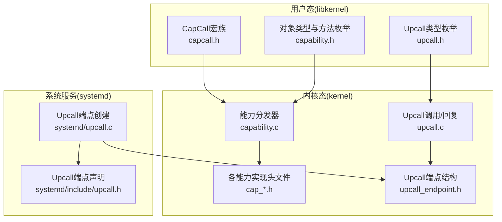
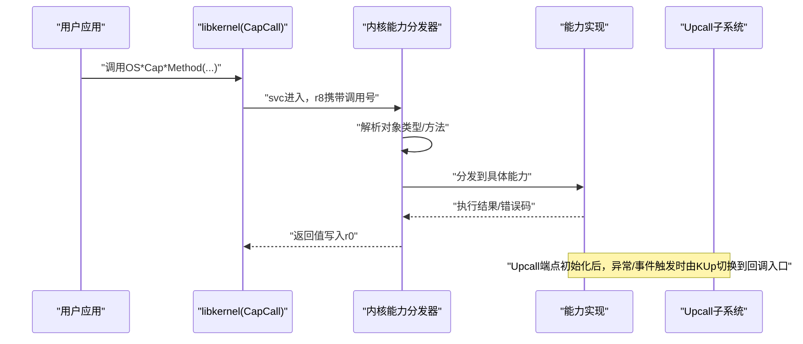
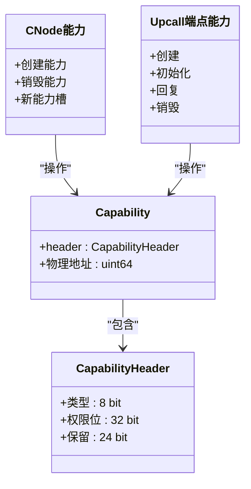
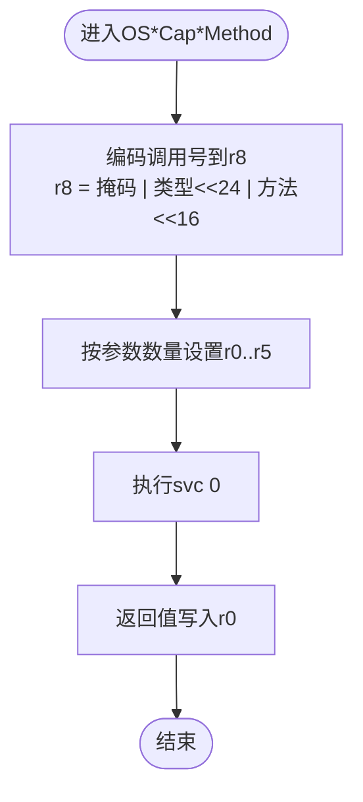
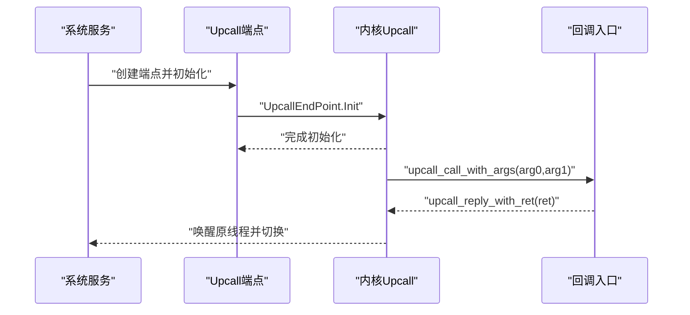
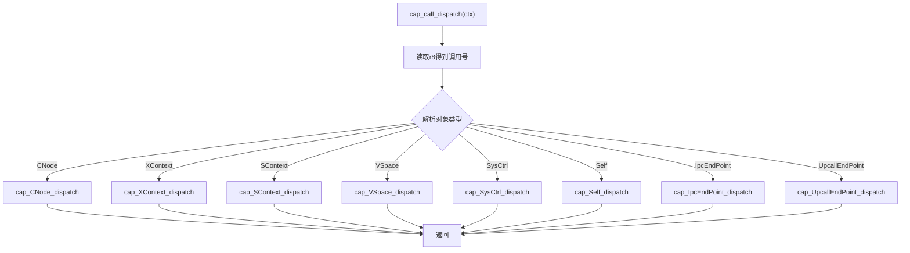
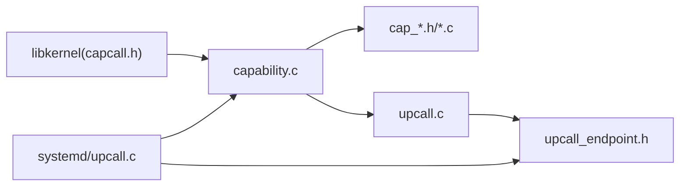

# Capability与Upcall机制API

<cite>
**本文引用的文件**
- [capability.h](file://kernel/include/capability/capability.h)
- [cap_upcall_endpoint.h](file://kernel/include/capability/cap_upcall_endpoint.h)
- [upcall.h](file://kernel/include/upcall/upcall.h)
- [upcall_endpoint.h](file://kernel/include/upcall/upcall_endpoint.h)
- [capability.c](file://kernel/capability/capability.c)
- [cap_upcall_endpoint.c](file://kernel/capability/cap_upcall_endpoint.c)
- [upcall.c](file://kernel/upcall/upcall.c)
- [capability.h](file://ulibs/include/libkernel/capability.h)
- [capcall.h](file://ulibs/include/libkernel/capcall.h)
- [upcall.h](file://ulibs/include/libkernel/upcall.h)
- [upcall.h](file://kernel/systemd/include/upcall.h)
- [upcall.c](file://kernel/systemd/upcall.c)
</cite>

## 目录
1. [引言](#引言)
2. [项目结构](#项目结构)
3. [核心组件](#核心组件)
4. [架构总览](#架构总览)
5. [详细组件分析](#详细组件分析)
6. [依赖关系分析](#依赖关系分析)
7. [性能考量](#性能考量)
8. [故障排查指南](#故障排查指南)
9. [结论](#结论)
10. [附录](#附录)

## 引言
本文件系统化阐述TranquilOS中Capability与Upcall机制的API设计与实现，覆盖以下主题：
- Capability对象的创建、传递与验证机制
- 权限检查、访问控制与安全边界设计
- Upcall端点的建立、回调处理与事件通知机制
- CapCall接口的使用方法与参数传递方式
- Capability继承、权限降级与安全隔离的实现细节
- Upcall回调的注册、注销与生命周期管理
- 完整API文档、安全考虑与使用示例
- 权限设计模式、安全最佳实践与性能优化建议

## 项目结构
TranquilOS将内核态能力与用户态库API分层组织：
- 内核态能力与调度上下文：capability子系统负责对象类型、权限位与分发；upcall子系统负责用户态回调入口与切换。
- 用户态库API：libkernel提供CapCall宏族与对象类型枚举，封装svc调用与参数寄存器传递。
- systemd层：系统服务侧负责分配物理内存、创建XContext/SContext并初始化Upcall端点。

图表来源
- [capability.c](file://kernel/capability/capability.c#L14-L54)
- [capability.h](file://kernel/include/capability/capability.h#L11-L20)
- [upcall.c](file://kernel/upcall/upcall.c#L8-L52)
- [upcall_endpoint.h](file://kernel/include/upcall/upcall_endpoint.h#L8-L17)
- [upcall.h](file://kernel/systemd/include/upcall.h#L8-L17)
- [upcall.c](file://kernel/systemd/upcall.c#L94-L132)

章节来源
- [capability.c](file://kernel/capability/capability.c#L14-L54)
- [capability.h](file://kernel/include/capability/capability.h#L11-L20)
- [upcall.c](file://kernel/upcall/upcall.c#L8-L52)
- [upcall_endpoint.h](file://kernel/include/upcall/upcall_endpoint.h#L8-L17)
- [capability.h](file://ulibs/include/libkernel/capability.h#L6-L41)
- [capcall.h](file://ulibs/include/libkernel/capcall.h#L15-L27)
- [upcall.h](file://ulibs/include/libkernel/upcall.h#L4-L15)
- [upcall.h](file://kernel/systemd/include/upcall.h#L8-L17)
- [upcall.c](file://kernel/systemd/upcall.c#L94-L132)

## 核心组件
- 能力头与能力对象
  - 能力头包含对象类型与权限位，能力对象包含物理地址字段，用于在内核中定位真实对象。
- 能力分发器
  - 解析svc传入的调用号，按对象类型分发到对应能力实现，并预留权限检查位置。
- Upcall端点
  - 维护回调入口XContext、目标SContext、入口地址与栈指针，以及等待队列等。
- CapCall宏族
  - 将对象类型与方法编码进寄存器，通过svc进入内核，返回值写回r0。
- 系统服务侧Upcall端点创建
  - 分配物理内存作为Upcall端点与入口上下文，创建XContext/SContext并初始化，绑定到进程。

章节来源
- [capability.h](file://kernel/include/capability/capability.h#L11-L20)
- [capability.c](file://kernel/capability/capability.c#L14-L54)
- [upcall_endpoint.h](file://kernel/include/upcall/upcall_endpoint.h#L8-L17)
- [capability.h](file://ulibs/include/libkernel/capability.h#L6-L41)
- [capcall.h](file://ulibs/include/libkernel/capcall.h#L15-L27)
- [upcall.c](file://kernel/systemd/upcall.c#L94-L132)

## 架构总览
下图展示从用户态CapCall到内核能力分发与Upcall回调的整体流程。

图表来源
- [capability.c](file://kernel/capability/capability.c#L14-L54)
- [capcall.h](file://ulibs/include/libkernel/capcall.h#L15-L27)
- [upcall.c](file://kernel/upcall/upcall.c#L8-L52)

## 详细组件分析

### 能力对象与权限模型
- 对象类型与方法
  - 用户态通过枚举定义对象类型与方法，内核侧以相同枚举驱动分发。
- 权限位
  - 能力头包含权限位字段，用于限制对对象的操作范围；当前分发器预留了权限检查位置。
- 能力创建与传递
  - CNode能力支持创建新能力（含类型与权限），并将物理地址写入能力对象。
- 安全边界
  - 通过能力引用与权限位形成最小授权面，结合上下文隔离实现安全边界。

图表来源
- [capability.h](file://kernel/include/capability/capability.h#L11-L20)
- [capability.h](file://ulibs/include/libkernel/capability.h#L6-L41)
- [cap_upcall_endpoint.c](file://kernel/capability/cap_upcall_endpoint.c#L92-L110)

章节来源
- [capability.h](file://kernel/include/capability/capability.h#L11-L20)
- [capability.h](file://ulibs/include/libkernel/capability.h#L6-L41)
- [cap_upcall_endpoint.c](file://kernel/capability/cap_upcall_endpoint.c#L92-L110)

### CapCall接口与参数传递
- 调用号编码
  - 高8位掩码标识为CapCall；高8位对象类型；中间8位方法号；低参数占用通用寄存器。
- 寄存器约定
  - r8承载调用号；r0-r5用于参数与返回值；svc指令进入内核。
- 方法族
  - 提供0~6个参数的宏变体，自动设置寄存器并发起svc。
- 典型调用
  - VSpace.TryMapPage、SContext.SetUpcall、UpcallEndPoint.Init等。

图表来源
- [capcall.h](file://ulibs/include/libkernel/capcall.h#L15-L27)
- [capcall.h](file://ulibs/include/libkernel/capcall.h#L29-L56)
- [capcall.h](file://ulibs/include/libkernel/capcall.h#L58-L89)
- [capcall.h](file://ulibs/include/libkernel/capcall.h#L91-L126)

章节来源
- [capcall.h](file://ulibs/include/libkernel/capcall.h#L15-L27)
- [capcall.h](file://ulibs/include/libkernel/capcall.h#L29-L56)
- [capcall.h](file://ulibs/include/libkernel/capcall.h#L58-L89)
- [capcall.h](file://ulibs/include/libkernel/capcall.h#L91-L126)

### Upcall端点建立与回调处理
- 端点创建
  - 系统服务侧为每个Upcall端点分配物理内存，创建XContext/SContext并初始化，绑定到进程。
- 初始化
  - 通过UpcallEndPoint.Init将端点与入口XContext/SContext关联，设置入口地址与栈顶。
- 回调触发
  - 当异常或事件发生时，Upcall子系统将当前线程状态置为阻塞并切换到回调入口，设置r0/r1为回调参数。
- 回调返回
  - 回调函数通过UpcallEndPoint.Reply返回结果，唤醒原线程并切换回其执行上下文。

图表来源
- [upcall.c](file://kernel/upcall/upcall.c#L8-L52)
- [upcall.c](file://kernel/upcall/upcall.c#L54-L95)
- [upcall_endpoint.h](file://kernel/include/upcall/upcall_endpoint.h#L8-L17)
- [upcall.c](file://kernel/systemd/upcall.c#L94-L132)

章节来源
- [upcall.c](file://kernel/upcall/upcall.c#L8-L52)
- [upcall.c](file://kernel/upcall/upcall.c#L54-L95)
- [upcall_endpoint.h](file://kernel/include/upcall/upcall_endpoint.h#L8-L17)
- [upcall.c](file://kernel/systemd/upcall.c#L94-L132)

### 能力分发与权限检查
- 分发逻辑
  - 从r8解析对象类型与方法，调用对应能力的dispatch函数。
- 权限检查
  - 当前实现预留了权限检查位置，后续可在此处校验调用者对目标能力的权限位。

图表来源
- [capability.c](file://kernel/capability/capability.c#L14-L54)

章节来源
- [capability.c](file://kernel/capability/capability.c#L14-L54)

### Capability继承、权限降级与安全隔离
- 继承
  - 通过CNode.NewCapability在目标CNode中创建新能力，携带指定类型与权限位。
- 权限降级
  - 创建能力时仅授予必要权限位，避免过度授权。
- 安全隔离
  - 每个SContext拥有独立的CNode/VSpace，不同进程间无法直接访问彼此的能力表与虚拟地址空间。

章节来源
- [cap_upcall_endpoint.c](file://kernel/capability/cap_upcall_endpoint.c#L12-L17)
- [cap_upcall_endpoint.c](file://kernel/capability/cap_upcall_endpoint.c#L20-L72)
- [capability.h](file://ulibs/include/libkernel/capability.h#L44-L50)

## 依赖关系分析
- 用户态到内核态
  - libkernel的CapCall宏族通过svc进入内核，内核能力分发器根据调用号路由到具体能力实现。
- 内核内部
  - 能力分发器依赖各能力头文件；Upcall子系统依赖调度器与上下文切换模块。
- 系统服务
  - systemd负责为服务进程创建Upcall端点，填充XContext/SContext并初始化。

图表来源
- [capcall.h](file://ulibs/include/libkernel/capcall.h#L15-L27)
- [capability.c](file://kernel/capability/capability.c#L14-L54)
- [upcall.c](file://kernel/upcall/upcall.c#L8-L52)
- [upcall_endpoint.h](file://kernel/include/upcall/upcall_endpoint.h#L8-L17)
- [upcall.c](file://kernel/systemd/upcall.c#L94-L132)

章节来源
- [capcall.h](file://ulibs/include/libkernel/capcall.h#L15-L27)
- [capability.c](file://kernel/capability/capability.c#L14-L54)
- [upcall.c](file://kernel/upcall/upcall.c#L8-L52)
- [upcall_endpoint.h](file://kernel/include/upcall/upcall_endpoint.h#L8-L17)
- [upcall.c](file://kernel/systemd/upcall.c#L94-L132)

## 性能考量
- 寄存器调用约定
  - 通过r0..r5传递参数，减少栈操作，降低开销。
- 能力查找
  - CNode索引采用slot_idx与cnode_id组合，建议在高频路径中缓存常用引用。
- 上下文切换
  - Upcall切换涉及调度器与上下文切换，应尽量缩短回调处理时间，避免阻塞。
- 内存对齐
  - 分配的内核对象与栈需满足对齐要求，避免额外的页表更新。

## 故障排查指南
- 能力类型不匹配
  - 在Upcall端点初始化时会检查目标能力是否为UpcallEndPoint或XContext/SContext，若类型不符将触发异常。
- SContext状态异常
  - 若SContext非就绪状态，Upcall会阻塞当前线程并进行调度；若调度器未初始化或无可用线程，将触发PANIC。
- 回调返回值非法
  - 回调返回值为0会被视为错误，触发PANIC以快速暴露问题。
- 权限不足
  - 能力分发器预留了权限检查位置，若权限不足会导致操作失败或异常。

章节来源
- [cap_upcall_endpoint.c](file://kernel/capability/cap_upcall_endpoint.c#L40-L47)
- [upcall.c](file://kernel/upcall/upcall.c#L8-L52)
- [upcall.c](file://kernel/upcall/upcall.c#L54-L95)
- [capability.c](file://kernel/capability/capability.c#L20-L21)

## 结论
TranquilOS的Capability与Upcall机制以“能力+权限+上下文”为核心，通过简洁的寄存器约定与严格的分发/调度流程，实现了细粒度的权限控制与高效的回调处理。未来可在能力分发器中完善权限检查，并在系统服务侧引入更灵活的端点生命周期管理策略，进一步提升安全性与可维护性。

## 附录

### API参考：CapCall接口
- 调用号编码规则
  - 掩码：固定高位掩码
  - 对象类型：左移24位
  - 方法号：左移16位
  - 参数：按数量放入r0..r5
- 常用调用示例（路径）
  - VSpace.TryMapPage：[capcall.h](file://ulibs/include/libkernel/capcall.h#L141-L142)
  - SContext.SetUpcall：[capcall.h](file://ulibs/include/libkernel/capcall.h#L160)
  - UpcallEndPoint.Init：[capcall.h](file://ulibs/include/libkernel/capcall.h#L174)
  - UpcallEndPoint.Reply：[capcall.h](file://ulibs/include/libkernel/capcall.h#L175)

章节来源
- [capcall.h](file://ulibs/include/libkernel/capcall.h#L15-L27)
- [capcall.h](file://ulibs/include/libkernel/capcall.h#L29-L56)
- [capcall.h](file://ulibs/include/libkernel/capcall.h#L58-L89)
- [capcall.h](file://ulibs/include/libkernel/capcall.h#L91-L126)
- [capcall.h](file://ulibs/include/libkernel/capcall.h#L141-L142)
- [capcall.h](file://ulibs/include/libkernel/capcall.h#L160)
- [capcall.h](file://ulibs/include/libkernel/capcall.h#L174)
- [capcall.h](file://ulibs/include/libkernel/capcall.h#L175)

### API参考：Upcall端点
- 端点结构
  - 入口XContext、目标SContext、入口地址、栈指针、等待队列等
- 关键函数
  - upcall_call_with_args：触发回调并传递参数
  - upcall_reply_with_ret：回调返回并唤醒原线程
- 系统服务创建
  - create_upcall_endpoint：为服务创建端点并初始化
  - create_upcall_endpoint_for_normal_service：为普通进程创建端点

章节来源
- [upcall_endpoint.h](file://kernel/include/upcall/upcall_endpoint.h#L8-L17)
- [upcall.h](file://kernel/include/upcall/upcall.h#L9-L11)
- [upcall.c](file://kernel/upcall/upcall.c#L8-L52)
- [upcall.c](file://kernel/upcall/upcall.c#L54-L95)
- [upcall.h](file://kernel/systemd/include/upcall.h#L8-L17)
- [upcall.c](file://kernel/systemd/upcall.c#L94-L132)

### 安全最佳实践
- 最小权限原则
  - 创建能力时仅授予必要权限位，避免过度授权。
- 能力引用验证
  - 在能力使用前验证引用有效性与类型一致性。
- 回调处理
  - 回调函数应短小精悍，避免长时间阻塞；严格校验返回值。
- 状态监控
  - 定期检查SContext状态与调度器健康状况，防止死锁或饥饿。