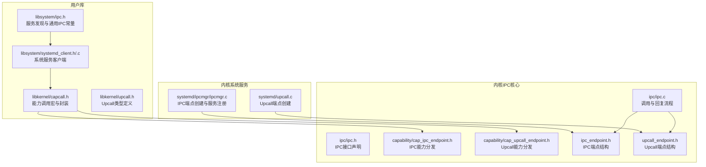
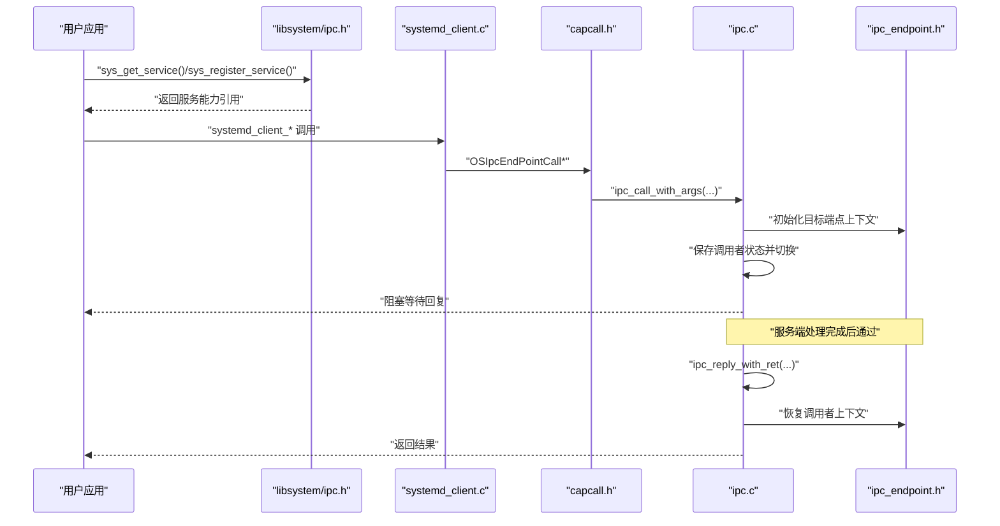
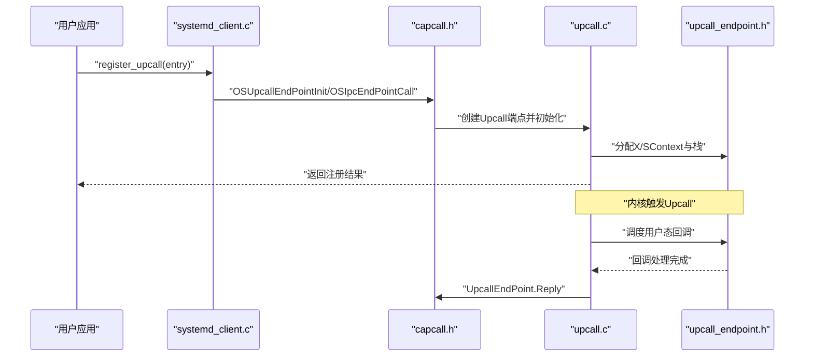
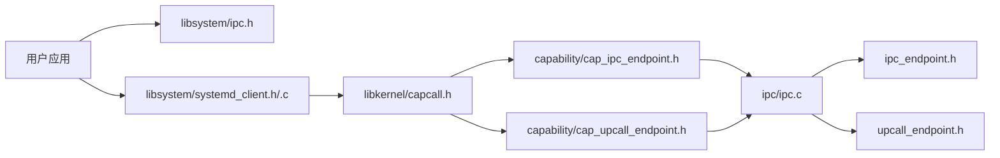
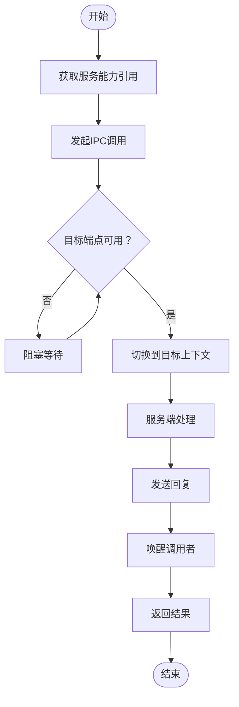

# IPC通信客户端API

<cite>
**本文引用的文件**
- [ipc.h](file://ulibs/include/libsystem/ipc.h)
- [capcall.h](file://ulibs/include/libkernel/capcall.h)
- [upcall.h](file://ulibs/include/libkernel/upcall.h)
- [systemd_client.h](file://ulibs/include/libsystem/systemd_client.h)
- [systemd_client.c](file://ulibs/libsystem/systemd_client.c)
- [ipc_endpoint.h](file://kernel/systemd/include/ipcmgr/ipc_endpoint.h)
- [upcall_endpoint.h](file://kernel/systemd/include/upcall.h)
- [cap_ipc_endpoint.h](file://kernel/include/capability/cap_ipc_endpoint.h)
- [cap_upcall_endpoint.h](file://kernel/include/capability/cap_upcall_endpoint.h)
- [ipc.h](file://kernel/include/ipc/ipc.h)
- [ipc.c](file://kernel/ipc/ipc.c)
- [upcall.h](file://kernel/include/upcall/upcall.h)
- [ipcmgr.c](file://kernel/systemd/ipcmgr/ipcmgr.c)
- [upcall.c](file://kernel/systemd/upcall.c)
</cite>

## 目录
1. [简介](#简介)
2. [项目结构](#项目结构)
3. [核心组件](#核心组件)
4. [架构总览](#架构总览)
5. [详细组件分析](#详细组件分析)
6. [依赖关系分析](#依赖关系分析)
7. [性能考虑](#性能考虑)
8. [故障排查指南](#故障排查指南)
9. [结论](#结论)
10. [附录](#附录)

## 简介
本指南面向TranquilOS的用户态进程，系统性地阐述IPC（进程间通信）客户端API的使用方法，覆盖以下主题：
- 消息传递：同步与异步调用、参数传递与返回值约定
- 端点管理：IPC端点创建、能力引用与生命周期
- 会话控制：调用发起、阻塞与唤醒、上下文切换
- 数据传输：调用参数寄存器约定、返回值写回
- Upcall机制：用户态回调注册与处理
- 同步与异步通信模式：适用场景与选择建议
- 错误处理、超时与重连策略
- 性能优化与并发安全最佳实践

## 项目结构
TranquilOS的IPC客户端API由用户库与内核协作两部分组成：
- 用户库层：提供高层封装与便捷函数（如服务发现、系统服务客户端）
- 内核层：实现IPC端点、调度与上下文切换、能力分发与Upcall端点

**图示来源**
- [ipc.h](file://ulibs/include/libsystem/ipc.h#L1-L73)
- [systemd_client.h](file://ulibs/include/libsystem/systemd_client.h#L1-L84)
- [systemd_client.c](file://ulibs/libsystem/systemd_client.c#L1-L65)
- [capcall.h](file://ulibs/include/libkernel/capcall.h#L164-L177)
- [upcall.h](file://ulibs/include/libkernel/upcall.h#L1-L17)
- [ipcmgr.c](file://kernel/systemd/ipcmgr/ipcmgr.c#L1-L319)
- [upcall.c](file://kernel/systemd/upcall.c#L1-L132)
- [ipc.c](file://kernel/ipc/ipc.c#L1-L114)
- [ipc.h](file://kernel/include/ipc/ipc.h#L1-L13)
- [cap_ipc_endpoint.h](file://kernel/include/capability/cap_ipc_endpoint.h#L1-L12)
- [cap_upcall_endpoint.h](file://kernel/include/capability/cap_upcall_endpoint.h#L1-L12)
- [ipc_endpoint.h](file://kernel/systemd/include/ipcmgr/ipc_endpoint.h#L1-L20)
- [upcall_endpoint.h](file://kernel/systemd/include/upcall.h#L1-L21)

**章节来源**
- [ipc.h](file://ulibs/include/libsystem/ipc.h#L1-L73)
- [systemd_client.h](file://ulibs/include/libsystem/systemd_client.h#L1-L84)
- [systemd_client.c](file://ulibs/libsystem/systemd_client.c#L1-L65)
- [capcall.h](file://ulibs/include/libkernel/capcall.h#L164-L177)
- [upcall.h](file://ulibs/include/libkernel/upcall.h#L1-L17)
- [ipcmgr.c](file://kernel/systemd/ipcmgr/ipcmgr.c#L1-L319)
- [upcall.c](file://kernel/systemd/upcall.c#L1-L132)
- [ipc.c](file://kernel/ipc/ipc.c#L1-L114)
- [ipc.h](file://kernel/include/ipc/ipc.h#L1-L13)
- [cap_ipc_endpoint.h](file://kernel/include/capability/cap_ipc_endpoint.h#L1-L12)
- [cap_upcall_endpoint.h](file://kernel/include/capability/cap_upcall_endpoint.h#L1-L12)
- [ipc_endpoint.h](file://kernel/systemd/include/ipcmgr/ipc_endpoint.h#L1-L20)
- [upcall_endpoint.h](file://kernel/systemd/include/upcall.h#L1-L21)

## 核心组件
- 服务发现与通用IPC常量：提供服务ID枚举、名称服务函数枚举及服务查询与注册的便捷函数。
- 系统服务客户端：封装系统服务（如内存管理、共享内存、Upcall注册等）的调用接口。
- 能力调用宏：统一的IPC调用与回复封装，支持不同参数数量的变体。
- IPC端点与Upcall端点：内核侧的执行上下文与调度上下文容器，承载用户态入口与栈。
- IPC核心流程：内核侧的调用转发、上下文切换、阻塞与唤醒逻辑。

**章节来源**
- [ipc.h](file://ulibs/include/libsystem/ipc.h#L11-L70)
- [systemd_client.h](file://ulibs/include/libsystem/systemd_client.h#L7-L84)
- [systemd_client.c](file://ulibs/libsystem/systemd_client.c#L6-L65)
- [capcall.h](file://ulibs/include/libkernel/capcall.h#L164-L177)
- [ipc_endpoint.h](file://kernel/systemd/include/ipcmgr/ipc_endpoint.h#L8-L18)
- [upcall_endpoint.h](file://kernel/systemd/include/upcall.h#L8-L17)
- [ipc.c](file://kernel/ipc/ipc.c#L9-L114)

## 架构总览
下图展示从用户态到内核态的IPC调用路径与Upcall回调路径：

**图示来源**
- [ipc.h](file://ulibs/include/libsystem/ipc.h#L53-L70)
- [systemd_client.c](file://ulibs/libsystem/systemd_client.c#L6-L65)
- [capcall.h](file://ulibs/include/libkernel/capcall.h#L164-L177)
- [ipc.c](file://kernel/ipc/ipc.c#L9-L114)
- [ipc_endpoint.h](file://kernel/systemd/include/ipcmgr/ipc_endpoint.h#L8-L18)

## 详细组件分析

### 1) 服务发现与通用IPC常量
- 服务ID枚举：包括名称服务、systemd、设备管理、文件系统、网络等服务ID。
- 名称服务函数枚举：注册服务、获取服务。
- 便捷函数：
  - 注册服务：将用户态服务入口地址注册到名称服务，返回服务能力引用。
  - 获取服务：根据服务ID轮询查询，直到可用或超时（可结合重试策略）。

使用要点
- 使用服务ID与函数枚举确保调用语义一致。
- 获取服务时建议采用指数退避或固定间隔重试，避免忙等。
- 返回的服务能力引用用于后续所有IPC调用。

**章节来源**
- [ipc.h](file://ulibs/include/libsystem/ipc.h#L11-L70)

### 2) 系统服务客户端（systemd_client）
- 提供系统服务操作的高层封装，如共享内存分配/获取/释放、内存统计、进程/线程计数、Upcall注册、页故障上报、进程退出等。
- 客户端内部通过sys_get_service获取systemd服务的能力引用，并缓存以复用。

典型调用链
- 获取systemd服务引用：systemd_client_get
- 分配共享内存：systemd_client_alloc_shm
- 获取共享内存：systemd_client_get_shm
- 释放共享内存：systemd_client_free_shm
- 注册Upcall：systemd_client_register_upcall
- 页故障上报：systemd_client_page_fault
- 自身退出：systemd_client_process_self_exit

参数与返回值
- 所有函数均通过OSIpcEndPointCall系列宏进行IPC调用，返回值即为服务端回复。
- 共享内存相关函数返回句柄或指针；统计类函数返回数值；Upcall注册返回状态码。

**章节来源**
- [systemd_client.h](file://ulibs/include/libsystem/systemd_client.h#L7-L84)
- [systemd_client.c](file://ulibs/libsystem/systemd_client.c#L6-L65)

### 3) 能力调用宏（capcall.h）
- 统一的IPC调用封装，支持不同参数个数的变体（2~6个参数），并提供Reply封装。
- 常见宏：
  - IpcEndPoint.Init：初始化IPC端点能力
  - IpcEndPoint.Call：发起IPC调用（method与最多4个参数）
  - IpcEndPoint.Reply：回复调用者
  - UpcallEndPoint.Init：初始化Upcall端点能力
  - UpcallEndPoint.Reply：Upcall回复

调用约定
- 参数按寄存器顺序传入，第1~6个寄存器分别对应endpoint_cref、method、arg1..arg4。
- 调用后当前线程进入阻塞，等待服务端通过Reply唤醒。

**章节来源**
- [capcall.h](file://ulibs/include/libkernel/capcall.h#L164-L177)

### 4) IPC端点与Upcall端点
- IPC端点结构：包含入口执行上下文、调度上下文、入口点、栈信息、调用者上下文以及等待队列。
- Upcall端点结构：与IPC端点类似，但用于被动回调（如页故障）。

端点创建流程（系统服务侧）
- 分配物理内存作为端点对象
- 为目标进程创建XContext/SContext并映射栈
- 初始化端点能力引用并注册到进程或系统服务
- 通过OSIpcEndPointInit完成端点初始化

**章节来源**
- [ipc_endpoint.h](file://kernel/systemd/include/ipcmgr/ipc_endpoint.h#L8-L18)
- [upcall_endpoint.h](file://kernel/systemd/include/upcall.h#L8-L17)
- [ipcmgr.c](file://kernel/systemd/ipcmgr/ipcmgr.c#L22-L87)
- [upcall.c](file://kernel/systemd/upcall.c#L27-L92)

### 5) IPC核心流程（内核）
- 调用路径：用户态通过capcall.h发起调用，内核ipc.c解析寄存器参数，初始化目标端点上下文，保存调用者状态并切换到目标上下文。
- 回复路径：服务端通过ipc_reply_with_ret写回返回值，恢复调用者上下文并唤醒等待队列，再切换回调用者。

关键行为
- 阻塞与唤醒：若目标端点不可用，调用方被阻塞直至服务端Reply。
- 上下文切换：涉及execute_context与schedule_context的切换与调度器操作。
- 错误处理：空指针检查、状态校验与PANIC日志。

**章节来源**
- [ipc.c](file://kernel/ipc/ipc.c#L9-L114)
- [ipc.h](file://kernel/include/ipc/ipc.h#L9-L12)

### 6) Upcall机制（用户态回调）
- Upcall类型：当前定义了页故障类型。
- 注册流程：通过systemd_client_register_upcall将用户态回调入口注册到systemd，systemd在内核侧创建Upcall端点并绑定到调用者进程。
- 触发与处理：当发生页故障等事件时，内核触发Upcall，用户态回调被调度执行，处理完后通过UpcallEndPoint.Reply回复。

**图示来源**
- [systemd_client.c](file://ulibs/libsystem/systemd_client.c#L33-L35)
- [upcall.c](file://kernel/systemd/upcall.c#L27-L92)
- [upcall_endpoint.h](file://kernel/systemd/include/upcall.h#L8-L17)
- [capcall.h](file://ulibs/include/libkernel/capcall.h#L174-L175)

**章节来源**
- [upcall.h](file://ulibs/include/libkernel/upcall.h#L4-L17)
- [systemd_client.c](file://ulibs/libsystem/systemd_client.c#L33-L35)
- [upcall.c](file://kernel/systemd/upcall.c#L27-L92)
- [capcall.h](file://ulibs/include/libkernel/capcall.h#L174-L175)

### 7) 同步与异步通信模式
- 同步模式：默认行为。调用方发起调用后阻塞，直到服务端Reply返回。适用于请求-响应式交互。
- 异步模式：可通过在服务端不立即Reply的方式实现“半双工”或“事件驱动”，但需谨慎设计状态机与资源回收。
- 选择建议：
  - 对实时性要求高且交互次数少的场景优先使用同步模式，简化编程模型。
  - 对高吞吐、低延迟的事件驱动场景可考虑服务端主动Upcall或自定义事件队列，但需配合严格的并发控制。

**章节来源**
- [ipc.c](file://kernel/ipc/ipc.c#L59-L76)
- [capcall.h](file://ulibs/include/libkernel/capcall.h#L164-L177)

### 8) 错误处理、超时与重连
- 错误处理：
  - 空指针与状态检查：内核在关键路径进行空指针与状态校验，失败时记录日志并触发异常。
  - 服务不可用：获取服务时若返回无效引用，应重试或降级处理。
- 超时设置：
  - 当前实现未内置超时机制。可在用户态引入定时器与状态标志，在超时后取消或重试。
- 重连机制：
  - 服务重启后，客户端应重新调用sys_get_service获取最新引用。
  - 对于关键服务，建议在上层封装自动重连与退避策略。

**章节来源**
- [ipc.c](file://kernel/ipc/ipc.c#L10-L18)
- [ipc.h](file://ulibs/include/libsystem/ipc.h#L61-L70)

### 9) 接口文档与参数说明
- 服务发现
  - sys_register_service(service_id, entry_fn) -> 返回服务能力引用
  - sys_get_service(service_id) -> 返回服务能力引用（带重试）
- 系统服务客户端
  - alloc_shm(size) -> 返回共享内存句柄
  - get_shm(shm_id) -> 返回共享内存指针
  - free_shm(shm_id) -> 返回状态
  - get_mem_total/free/proc_count/thread_count -> 返回数值
  - register_upcall(upcall_entry) -> 返回状态
  - page_fault(vaddr) -> 返回状态
  - process_self_exit(status) -> 返回状态
- 能力调用宏
  - OSIpcEndPointCall2/3/4/5/6(endpoint_cref, method, ...) -> 返回服务端结果
  - OSIpcEndPointReply(ret) -> 发送回复
  - OSUpcallEndPointInit/OSUpcallEndPointReply -> Upcall端点初始化与回复

返回值定义
- 成功通常返回非负值或有效句柄/指针
- 失败返回0或特定错误码（由具体服务定义）

**章节来源**
- [ipc.h](file://ulibs/include/libsystem/ipc.h#L53-L70)
- [systemd_client.h](file://ulibs/include/libsystem/systemd_client.h#L54-L84)
- [systemd_client.c](file://ulibs/libsystem/systemd_client.c#L6-L65)
- [capcall.h](file://ulibs/include/libkernel/capcall.h#L164-L177)

### 10) 实际代码示例（路径指引）
- 服务注册与查询
  - [服务注册示例路径](file://ulibs/include/libsystem/ipc.h#L53-L59)
  - [服务查询示例路径](file://ulibs/include/libsystem/ipc.h#L61-L70)
- 系统服务调用
  - [分配共享内存示例路径](file://ulibs/libsystem/systemd_client.c#L6-L8)
  - [获取共享内存示例路径](file://ulibs/libsystem/systemd_client.c#L10-L12)
  - [释放共享内存示例路径](file://ulibs/libsystem/systemd_client.c#L13-L15)
  - [内存统计示例路径](file://ulibs/libsystem/systemd_client.c#L17-L31)
  - [注册Upcall示例路径](file://ulibs/libsystem/systemd_client.c#L33-L35)
  - [页故障上报示例路径](file://ulibs/libsystem/systemd_client.c#L37-L39)
  - [进程退出示例路径](file://ulibs/libsystem/systemd_client.c#L41-L43)
- IPC端点创建（系统服务侧）
  - [IPC端点创建示例路径](file://kernel/systemd/ipcmgr/ipcmgr.c#L22-L87)
  - [Upcall端点创建示例路径](file://kernel/systemd/upcall.c#L27-L92)

**章节来源**
- [ipc.h](file://ulibs/include/libsystem/ipc.h#L53-L70)
- [systemd_client.c](file://ulibs/libsystem/systemd_client.c#L6-L65)
- [ipcmgr.c](file://kernel/systemd/ipcmgr/ipcmgr.c#L22-L87)
- [upcall.c](file://kernel/systemd/upcall.c#L27-L92)

## 依赖关系分析
- 用户库依赖内核能力调用宏与系统服务端点。
- 系统服务端负责创建与管理IPC/Upcall端点，并通过能力引用暴露给用户态。
- IPC核心模块负责跨上下文的调用与回复流程。

**图示来源**
- [ipc.h](file://ulibs/include/libsystem/ipc.h#L1-L73)
- [systemd_client.h](file://ulibs/include/libsystem/systemd_client.h#L1-L84)
- [systemd_client.c](file://ulibs/libsystem/systemd_client.c#L1-L65)
- [capcall.h](file://ulibs/include/libkernel/capcall.h#L164-L177)
- [cap_ipc_endpoint.h](file://kernel/include/capability/cap_ipc_endpoint.h#L1-L12)
- [cap_upcall_endpoint.h](file://kernel/include/capability/cap_upcall_endpoint.h#L1-L12)
- [ipc.c](file://kernel/ipc/ipc.c#L1-L114)
- [ipc_endpoint.h](file://kernel/systemd/include/ipcmgr/ipc_endpoint.h#L1-L20)
- [upcall_endpoint.h](file://kernel/systemd/include/upcall.h#L1-L21)

**章节来源**
- [ipc.h](file://ulibs/include/libsystem/ipc.h#L1-L73)
- [systemd_client.h](file://ulibs/include/libsystem/systemd_client.h#L1-L84)
- [systemd_client.c](file://ulibs/libsystem/systemd_client.c#L1-L65)
- [capcall.h](file://ulibs/include/libkernel/capcall.h#L164-L177)
- [cap_ipc_endpoint.h](file://kernel/include/capability/cap_ipc_endpoint.h#L1-L12)
- [cap_upcall_endpoint.h](file://kernel/include/capability/cap_upcall_endpoint.h#L1-L12)
- [ipc.c](file://kernel/ipc/ipc.c#L1-L114)
- [ipc_endpoint.h](file://kernel/systemd/include/ipcmgr/ipc_endpoint.h#L1-L20)
- [upcall_endpoint.h](file://kernel/systemd/include/upcall.h#L1-L21)

## 性能考虑
- 减少不必要的阻塞：对高频调用可考虑批处理或合并请求，降低上下文切换开销。
- 合理的重试策略：避免忙等，采用指数退避与最大重试次数。
- 并发安全：在多线程环境下，确保对共享资源（如端点引用、回调函数表）的访问加锁。
- 内存管理：尽量复用已分配的共享内存，及时释放不再使用的资源。
- 调度优化：避免长时间占用CPU，必要时在回调中主动让出执行权。

## 故障排查指南
- 服务不可用
  - 现象：sys_get_service返回无效引用或持续为0
  - 排查：确认服务是否已注册；检查名称服务是否启动；增加重试间隔
- IPC调用无响应
  - 现象：调用后长时间阻塞
  - 排查：确认服务端是否调用Reply；检查服务端是否存在死循环或异常；查看内核日志
- 回调未触发
  - 现象：注册Upcall后未收到回调
  - 排查：确认Upcall端点创建成功；检查回调入口是否正确；验证内核触发路径
- 内存与栈溢出
  - 现象：系统崩溃或异常
  - 排查：检查栈大小配置；避免递归过深；确保内存对齐与边界

**章节来源**
- [ipc.c](file://kernel/ipc/ipc.c#L10-L18)
- [ipc.h](file://ulibs/include/libsystem/ipc.h#L61-L70)
- [upcall.c](file://kernel/systemd/upcall.c#L27-L92)

## 结论
TranquilOS的IPC客户端API提供了清晰的服务发现、端点管理与调用机制，并通过Upcall实现了用户态回调能力。通过合理选择同步/异步模式、实施重试与超时策略、遵循并发安全与性能优化原则，可以在保证可靠性的同时获得良好的运行效率。建议在生产环境中结合具体的业务场景，对关键路径进行压力测试与监控。

## 附录
- 关键流程流程图（算法实现）

**图示来源**
- [ipc.c](file://kernel/ipc/ipc.c#L9-L114)
- [ipc.h](file://ulibs/include/libsystem/ipc.h#L61-L70)