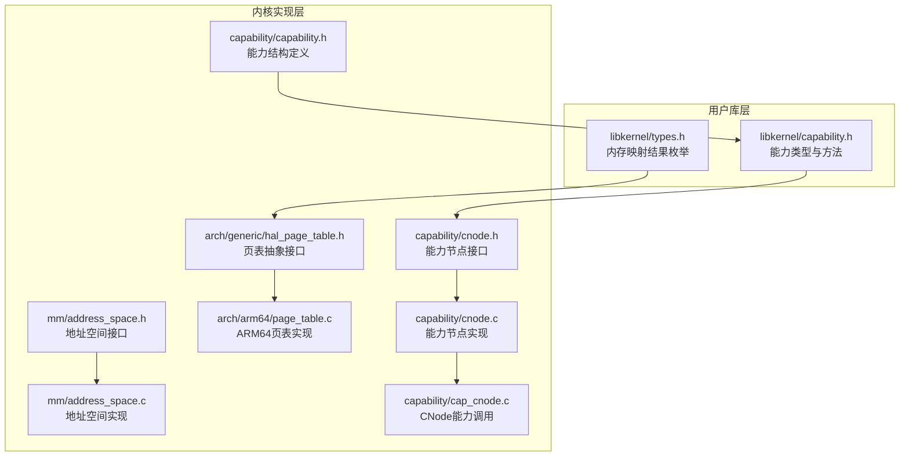
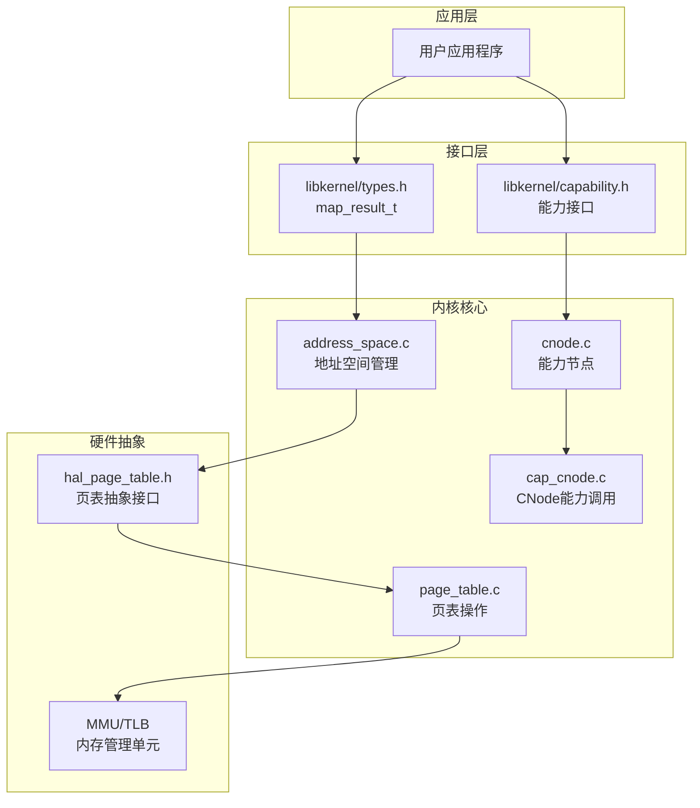
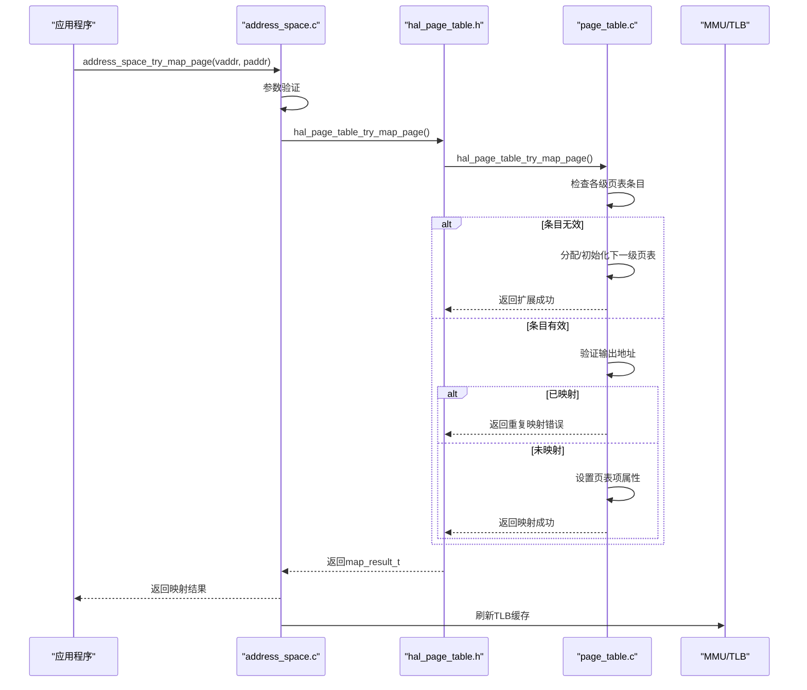
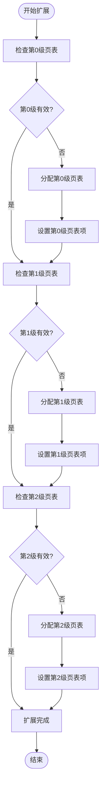
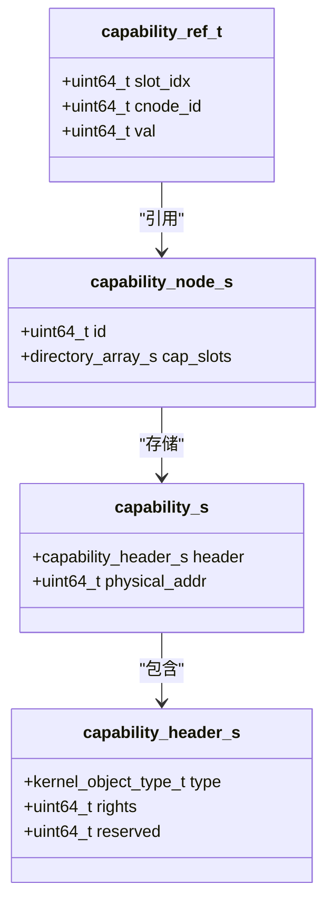
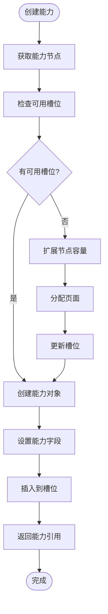
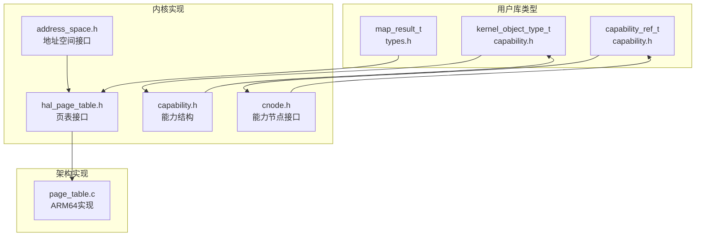

# 内核类型定义API

<cite>
**本文档引用的文件**
- [types.h](file://ulibs/include/libkernel/types.h)
- [capability.h](file://ulibs/include/libkernel/capability.h)
- [capability.h](file://kernel/include/capability/capability.h)
- [hal_page_table.h](file://kernel/include/arch/generic/hal_page_table.h)
- [page_table.c](file://kernel/arch/arm64/page_table.c)
- [address_space.h](file://kernel/include/mm/address_space.h)
- [address_space.c](file://kernel/mm/address_space.c)
- [cnode.h](file://kernel/include/capability/cnode.h)
- [cnode.c](file://kernel/capability/cnode.c)
- [cap_cnode.c](file://kernel/capability/cap_cnode.c)
- [panic.h](file://kernel/include/panic.h)
- [klog.h](file://kernel/include/klog.h)
</cite>

## 目录
1. [简介](#简介)
2. [项目结构](#项目结构)
3. [核心组件](#核心组件)
4. [架构概览](#架构概览)
5. [详细组件分析](#详细组件分析)
6. [依赖关系分析](#依赖关系分析)
7. [性能考虑](#性能考虑)
8. [故障排除指南](#故障排除指南)
9. [结论](#结论)

## 简介
本文件为TranquilOS内核类型定义API的详细参考文档，重点涵盖以下内容：
- 内存映射结果枚举类型map_result_t及其所有取值的含义与错误原因
- map_result_to_string函数的使用方法与字符串表示
- 能力（Capability）相关的基本数据类型定义，包括能力句柄、权限标志和引用计数机制
- 完整的类型定义、使用示例和错误处理指南

## 项目结构
TranquilOS内核的类型定义API分布在用户库头文件与内核实现之间，形成清晰的分层结构：
- 用户库层：提供公共类型定义与工具函数接口
- 内核实现层：具体实现内存映射、地址空间管理与能力系统
- 架构适配层：针对ARM64平台的具体实现

**图表来源**
- [types.h](file://ulibs/include/libkernel/types.h#L1-L76)
- [capability.h](file://ulibs/include/libkernel/capability.h#L1-L141)
- [address_space.h](file://kernel/include/mm/address_space.h#L1-L43)
- [address_space.c](file://kernel/mm/address_space.c#L1-L105)
- [hal_page_table.h](file://kernel/include/arch/generic/hal_page_table.h#L1-L12)
- [page_table.c](file://kernel/arch/arm64/page_table.c#L1-L167)
- [cnode.h](file://kernel/include/capability/cnode.h#L1-L28)
- [cnode.c](file://kernel/capability/cnode.c#L1-L95)
- [cap_cnode.c](file://kernel/capability/cap_cnode.c#L1-L138)
- [capability.h](file://kernel/include/capability/capability.h#L1-L26)

**章节来源**
- [types.h](file://ulibs/include/libkernel/types.h#L1-L76)
- [capability.h](file://ulibs/include/libkernel/capability.h#L1-L141)
- [address_space.h](file://kernel/include/mm/address_space.h#L1-L43)
- [hal_page_table.h](file://kernel/include/arch/generic/hal_page_table.h#L1-L12)

## 核心组件

### 内存映射结果枚举类型 map_result_t
map_result_t用于描述内存映射操作的结果状态，包含成功状态与多种失败状态。该枚举在用户库头文件中定义，并由内核页表实现返回。

- 成功状态
  - MAP_SUCCESS：映射成功完成

- 失败状态分类
  - 条目无效（ENTRY_INVALID）
    - MAP_FAILED_ENTRY_INVALID：通用无效条目
    - MAP_FAILED_LEVEL0_ENTRY_INVALID：第0级页表条目无效
    - MAP_FAILED_LEVEL1_ENTRY_INVALID：第1级页表条目无效
    - MAP_FAILED_LEVEL2_ENTRY_INVALID：第2级页表条目无效
    - MAP_FAILED_LEVEL3_ENTRY_INVALID：第3级页表条目无效
  - 条目有效但不可用（ENTRY_VALID）
    - MAP_FAILED_ENTRY_VALID：通用有效但不可用条目
    - MAP_FAILED_LEVEL0_ENTRY_VALID：第0级页表条目有效但不可用
    - MAP_FAILED_LEVEL1_ENTRY_VALID：第1级页表条目有效但不可用
    - MAP_FAILED_LEVEL2_ENTRY_VALID：第2级页表条目有效但不可用
    - MAP_FAILED_LEVEL3_ENTRY_VALID：第3级页表条目有效但不可用
  - 空指针引用（ENTRY_NULLPTR）
    - MAP_FAILED_ENTRY_NULLPTR：通用空指针条目
    - MAP_FAILED_LEVEL0_ENTRY_NULLPTR：第0级页表条目空指针
    - MAP_FAILED_LEVEL1_ENTRY_NULLPTR：第1级页表条目空指针
    - MAP_FAILED_LEVEL2_ENTRY_NULLPTR：第2级页表条目空指针
    - MAP_FAILED_LEVEL3_ENTRY_NULLPTR：第3级页表条目空指针
  - 重复映射（ENTRY_ALREADY_MAPPED）
    - MAP_FAILED_ENTRY_ALREADY_MAPPED：通用已映射条目
    - MAP_FAILED_LEVEL0_ENTRY_ALREADY_MAPPED：第0级页表条目已映射
    - MAP_FAILED_LEVEL1_ENTRY_ALREADY_MAPPED：第1级页表条目已映射
    - MAP_FAILED_LEVEL2_ENTRY_ALREADY_MAPPED：第2级页表条目已映射
    - MAP_FAILED_LEVEL3_ENTRY_ALREADY_MAPPED：第3级页表条目已映射

每个失败状态都对应特定的错误原因：
- 条目无效：页表条目未正确初始化或配置错误
- 条目有效但不可用：条目存在但输出地址为0，需要先扩展页表
- 空指针引用：下一级页表地址为0，需要分配并初始化新页表
- 重复映射：目标物理页已在映射表中，需先解除映射再重新映射

**章节来源**
- [types.h](file://ulibs/include/libkernel/types.h#L4-L26)
- [page_table.c](file://kernel/arch/arm64/page_table.c#L9-L94)
- [address_space.c](file://kernel/mm/address_space.c#L59-L81)

### map_result_to_string 函数
map_result_to_string函数提供将map_result_t枚举值转换为人类可读字符串的功能，便于调试和日志记录。

使用方法：
- 输入参数：map_result_t类型的映射结果
- 返回值：const char*指向的字符串表示
- 使用场景：错误诊断、日志输出、调试信息展示

字符串表示形式：
- 成功状态："MAP_SUCCESS"
- 失败状态：对应的具体错误类型字符串，如"MAP_FAILED_LEVEL1_ENTRY_INVALID"

**章节来源**
- [types.h](file://ulibs/include/libkernel/types.h#L27-L74)

### 能力相关基本数据类型

#### 能力句柄与引用计数
能力系统通过能力引用（capability_ref_t）实现对内核对象的访问控制：
- capability_ref_t：联合体类型，包含两个字段
  - slot_idx：32位槽索引，标识能力在能力节点中的位置
  - cnode_id：32位能力节点ID，标识所属的能力节点
  - val：64位原始值，用于整体比较和传递

能力引用格式：slot_idx:6--cnode_id:9--cnode_id:9--slot_idx:8
- 6位：保留位
- 9位：能力节点ID
- 9位：槽索引
- 8位：保留位

#### 内核对象类型
kernel_object_type_t枚举定义了内核支持的各种对象类型：
- CAP_UNTYPED：未类型化对象
- OBJ_TYPE_XContext：执行上下文对象
- OBJ_TYPE_SContext：调度上下文对象
- OBJ_TYPE_VSpace：虚拟空间对象
- OBJ_TYPE_CNode：能力节点对象
- OBJ_TYPE_Console：控制台对象
- OBJ_TYPE_SysCtrl：系统控制对象
- OBJ_TYPE_Self：自引用对象
- OBJ_TYPE_IpcEndPoint：IPC端点对象
- OBJ_TYPE_UpcallEndPoint：上行调用端点对象

#### 权限标志
能力结构包含权限字段，用于控制对内核对象的操作权限：
- CAP_RIGHT_ALL：所有权限（0xFFFFFFFF）
- 具体权限：通过位掩码定义，如CAP_CNode_RIGHT_create、CAP_CNode_RIGHT_destroy等

#### 能力节点（CNode）
能力节点是能力系统的容器，负责存储和管理能力引用：
- capability_node_s：能力节点结构
  - id：节点唯一标识符
  - cap_slots：目录数组，存储具体能力项
- cnode_new_cap：创建新能力并插入到指定节点
- cnode_get：根据引用获取目标能力节点

**章节来源**
- [capability.h](file://ulibs/include/libkernel/capability.h#L44-L50)
- [capability.h](file://ulibs/include/libkernel/capability.h#L6-L18)
- [capability.h](file://kernel/include/capability/capability.h#L11-L20)
- [cnode.h](file://kernel/include/capability/cnode.h#L11-L14)
- [cnode.c](file://kernel/capability/cnode.c#L23-L59)

## 架构概览
TranquilOS的内存映射与能力系统采用分层设计，确保功能模块间的清晰职责分离：

**图表来源**
- [address_space.c](file://kernel/mm/address_space.c#L59-L81)
- [page_table.c](file://kernel/arch/arm64/page_table.c#L9-L94)
- [cnode.c](file://kernel/capability/cnode.c#L23-L59)
- [cap_cnode.c](file://kernel/capability/cap_cnode.c#L23-L91)
- [hal_page_table.h](file://kernel/include/arch/generic/hal_page_table.h#L8-L10)

## 详细组件分析

### 内存映射流程分析

#### 地址空间映射序列图

**图表来源**
- [address_space.c](file://kernel/mm/address_space.c#L59-L81)
- [page_table.c](file://kernel/arch/arm64/page_table.c#L9-L94)
- [hal_page_table.h](file://kernel/include/arch/generic/hal_page_table.h#L8-L10)

#### 页表扩展流程图

**图表来源**
- [page_table.c](file://kernel/arch/arm64/page_table.c#L96-L167)

**章节来源**
- [address_space.c](file://kernel/mm/address_space.c#L59-L81)
- [page_table.c](file://kernel/arch/arm64/page_table.c#L9-L167)

### 能力系统组件分析

#### 能力节点类图

**图表来源**
- [capability.h](file://kernel/include/capability/capability.h#L11-L20)
- [cnode.h](file://kernel/include/capability/cnode.h#L11-L14)
- [capability.h](file://ulibs/include/libkernel/capability.h#L44-L50)

#### 能力创建与分发表单图

**图表来源**
- [cnode.c](file://kernel/capability/cnode.c#L23-L59)
- [cap_cnode.c](file://kernel/capability/cap_cnode.c#L23-L91)

**章节来源**
- [capability.h](file://kernel/include/capability/capability.h#L1-L26)
- [cnode.h](file://kernel/include/capability/cnode.h#L1-L28)
- [cnode.c](file://kernel/capability/cnode.c#L1-L95)
- [cap_cnode.c](file://kernel/capability/cap_cnode.c#L1-L138)

## 依赖关系分析

### 类型定义依赖图

**图表来源**
- [types.h](file://ulibs/include/libkernel/types.h#L4-L26)
- [capability.h](file://ulibs/include/libkernel/capability.h#L6-L18)
- [capability.h](file://kernel/include/capability/capability.h#L11-L20)
- [address_space.h](file://kernel/include/mm/address_space.h#L19-L22)
- [hal_page_table.h](file://kernel/include/arch/generic/hal_page_table.h#L8-L10)
- [page_table.c](file://kernel/arch/arm64/page_table.c#L9-L94)

**章节来源**
- [types.h](file://ulibs/include/libkernel/types.h#L1-L76)
- [capability.h](file://ulibs/include/libkernel/capability.h#L1-L141)
- [capability.h](file://kernel/include/capability/capability.h#L1-L26)

## 性能考虑
- 内存映射性能
  - 页表查找复杂度：O(log n)，其中n为页表层级数
  - TLB缓存命中率：合理组织页表结构以提高缓存效率
  - 批量映射：支持范围映射减少重复操作开销

- 能力系统性能
  - 能力引用查找：O(1)时间复杂度
  - 能力节点扩展：按需分配，避免过度预分配
  - 权限检查：在能力调用前进行快速权限验证

- 错误处理开销
  - 日志记录：调试模式下增加额外开销
  - 异常处理：PANIC调用会触发系统停机保护

## 故障排除指南

### 常见内存映射错误及解决方案

#### 条目无效错误
- 症状：MAP_FAILED_LEVELX_ENTRY_INVALID
- 可能原因：页表条目未正确初始化
- 解决方案：先调用address_space_extend扩展相应层级的页表

#### 空指针引用错误
- 症状：MAP_FAILED_LEVELX_ENTRY_NULLPTR
- 可能原因：下一级页表地址为0
- 解决方案：调用hal_page_table_extend分配并初始化新的页表页面

#### 重复映射错误
- 症状：MAP_FAILED_LEVELX_ENTRY_ALREADY_MAPPED
- 可能原因：目标物理页已被映射
- 解决方案：先调用unmap操作解除现有映射，再重新映射

#### 权限相关错误
- 症状：映射成功但访问被拒绝
- 可能原因：权限标志配置不当
- 解决方案：检查并调整能力权限设置

### 调试与日志
- 启用详细日志：通过修改klog.h中的current_log_level级别
- 错误定位：利用PANIC宏输出详细的文件名、函数名和行号信息
- 调试输出：使用log_debug、log_info、log_error等宏进行分级日志记录

**章节来源**
- [page_table.c](file://kernel/arch/arm64/page_table.c#L16-L94)
- [address_space.c](file://kernel/mm/address_space.c#L59-L105)
- [panic.h](file://kernel/include/panic.h#L6-L9)
- [klog.h](file://kernel/include/klog.h#L17-L35)

## 结论
TranquilOS内核类型定义API提供了完整而清晰的内存映射与能力系统接口。通过明确的枚举类型定义、完善的错误处理机制和模块化的架构设计，开发者可以可靠地进行内存管理与能力访问。建议在实际开发中：
- 充分理解map_result_t的各个状态含义
- 正确处理页表扩展与映射的先后顺序
- 合理设计能力权限模型
- 建立完善的错误处理与日志记录机制

这些实践将有助于构建稳定高效的内核应用程序。