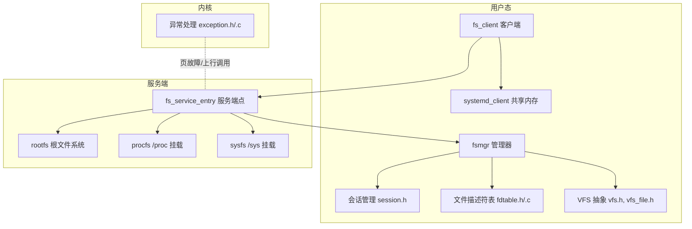
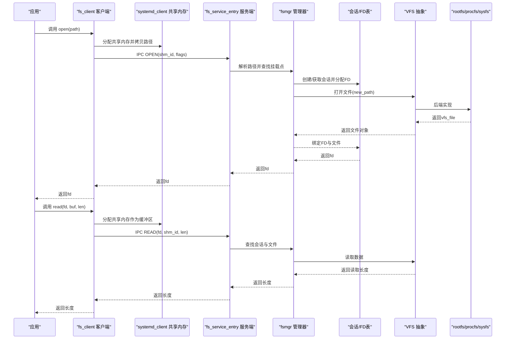
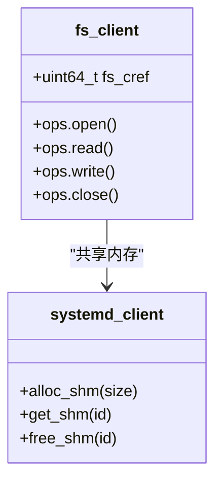
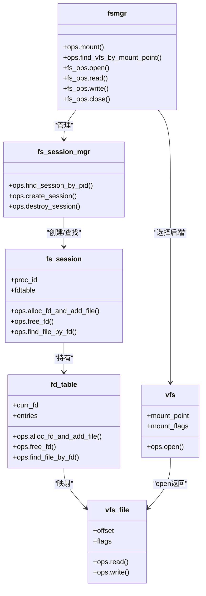
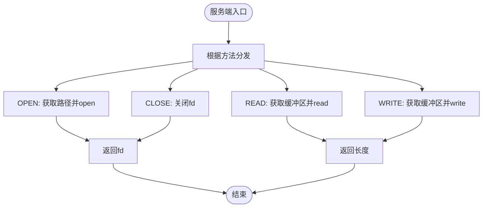
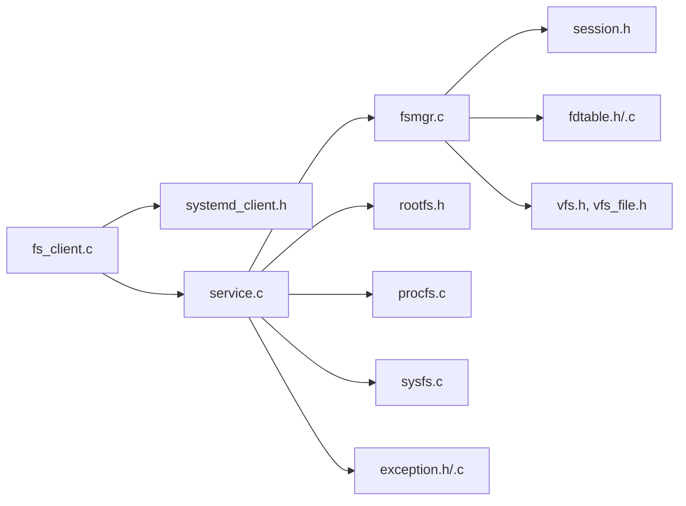

# 文件系统客户端API

<cite>
**本文引用的文件**
- [fs_client.h](file://ulibs/include/libsystem/fs_client.h)
- [fs_client.c](file://ulibs/libsystem/fs_client.c)
- [systemd_client.h](file://ulibs/include/libsystem/systemd_client.h)
- [fsmgr.h](file://uapps/fsmgr/include/fsmgr.h)
- [fsmgr.c](file://uapps/fsmgr/fsmgr.c)
- [service.c](file://uapps/fsmgr/service.c)
- [session.h](file://uapps/fsmgr/include/session.h)
- [fdtable.h](file://uapps/fsmgr/include/fdtable.h)
- [fdtable.c](file://uapps/fsmgr/fdtable.c)
- [vfs.h](file://uapps/fsmgr/include/vfs/vfs.h)
- [vfs_file.h](file://uapps/fsmgr/include/vfs/vfs_file.h)
- [rootfs.h](file://uapps/fsmgr/include/rootfs/rootfs.h)
- [procfs.c](file://uapps/fsmgr/procfs/procfs.c)
- [sysfs.c](file://uapps/fsmgr/sysfs/sysfs.c)
- [exception.h](file://kernel/include/exception/exception.h)
- [exception.c](file://kernel/exception/exception.c)
</cite>

## 目录
1. [简介](#简介)
2. [项目结构](#项目结构)
3. [核心组件](#核心组件)
4. [架构总览](#架构总览)
5. [详细组件分析](#详细组件分析)
6. [依赖关系分析](#依赖关系分析)
7. [性能与I/O优化](#性能与io优化)
8. [故障排查与错误处理](#故障排查与错误处理)
9. [结论](#结论)
10. [附录：接口与使用示例](#附录接口与使用示例)

## 简介
本指南面向TranquilOS文件系统客户端API的使用者，系统性地阐述文件操作（打开、读取、写入、关闭）、会话与文件描述符管理、共享内存缓冲区使用、以及与内核异常机制的交互方式。文档同时覆盖文件系统挂载点（/proc、/sys）的初始化流程，并给出并发访问控制、错误恢复与性能优化的最佳实践。

## 项目结构
TranquilOS的文件系统客户端位于用户态库层，通过系统服务与内核通信；文件系统管理器负责会话、文件描述符表、以及VFS适配。关键模块如下：
- 用户态客户端：fs_client（封装IPC调用）
- 文件系统管理器：fsmgr（会话、FD表、VFS桥接）
- VFS抽象：vfs、vfs_file（统一文件操作接口）
- 服务端入口：service（注册IPC服务端点）
- 系统服务客户端：systemd_client（共享内存分配/释放等）
- 异常处理：kernel exception（页故障与上行调用）

图表来源
- [fs_client.c](file://ulibs/libsystem/fs_client.c#L1-L45)
- [systemd_client.h](file://ulibs/include/libsystem/systemd_client.h#L1-L84)
- [service.c](file://uapps/fsmgr/service.c#L1-L106)
- [fsmgr.c](file://uapps/fsmgr/fsmgr.c#L65-L216)
- [session.h](file://uapps/fsmgr/include/session.h#L1-L39)
- [fdtable.h](file://uapps/fsmgr/include/fdtable.h#L1-L31)
- [fdtable.c](file://uapps/fsmgr/fdtable.c#L1-L96)
- [vfs.h](file://uapps/fsmgr/include/vfs/vfs.h#L1-L21)
- [vfs_file.h](file://uapps/fsmgr/include/vfs/vfs_file.h#L1-L19)
- [rootfs.h](file://uapps/fsmgr/include/rootfs/rootfs.h#L1-L13)
- [procfs.c](file://uapps/fsmgr/procfs/procfs.c#L1-L28)
- [sysfs.c](file://uapps/fsmgr/sysfs/sysfs.c#L1-L28)
- [exception.h](file://kernel/include/exception/exception.h#L1-L30)
- [exception.c](file://kernel/exception/exception.c#L1-L36)

章节来源
- [fs_client.c](file://ulibs/libsystem/fs_client.c#L1-L45)
- [service.c](file://uapps/fsmgr/service.c#L1-L106)
- [fsmgr.c](file://uapps/fsmgr/fsmgr.c#L65-L216)

## 核心组件
- 文件系统客户端fs_client：提供open/read/write/close四类IPC调用，路径通过共享内存传递。
- 文件系统管理器fsmgr：维护进程会话、文件描述符表，桥接VFS并执行具体文件操作。
- 会话与FD表：每个进程一个会话，会话内维护FD到VFS文件对象的映射。
- VFS抽象：统一文件读写接口，支持不同后端（如rootfs、procfs、sysfs）。
- 系统服务systemd_client：提供共享内存分配/获取/释放等能力。
- 服务端入口service：注册IPC服务端点，分发OPEN/READ/WRITE/CLOSE请求。
- 异常处理：内核在同步异常时进行页故障处理或上行调用。

章节来源
- [fs_client.h](file://ulibs/include/libsystem/fs_client.h#L1-L47)
- [fs_client.c](file://ulibs/libsystem/fs_client.c#L1-L45)
- [systemd_client.h](file://ulibs/include/libsystem/systemd_client.h#L1-L84)
- [fsmgr.h](file://uapps/fsmgr/include/fsmgr.h#L1-L43)
- [fsmgr.c](file://uapps/fsmgr/fsmgr.c#L65-L216)
- [session.h](file://uapps/fsmgr/include/session.h#L1-L39)
- [fdtable.h](file://uapps/fsmgr/include/fdtable.h#L1-L31)
- [fdtable.c](file://uapps/fsmgr/fdtable.c#L1-L96)
- [vfs.h](file://uapps/fsmgr/include/vfs/vfs.h#L1-L21)
- [vfs_file.h](file://uapps/fsmgr/include/vfs/vfs_file.h#L1-L19)
- [service.c](file://uapps/fsmgr/service.c#L1-L106)
- [exception.h](file://kernel/include/exception/exception.h#L1-L30)
- [exception.c](file://kernel/exception/exception.c#L1-L36)

## 架构总览
下图展示从用户态客户端到服务端、再到VFS与挂载点的整体调用链路。

图表来源
- [fs_client.c](file://ulibs/libsystem/fs_client.c#L9-L29)
- [systemd_client.h](file://ulibs/include/libsystem/systemd_client.h#L54-L75)
- [service.c](file://uapps/fsmgr/service.c#L9-L58)
- [fsmgr.c](file://uapps/fsmgr/fsmgr.c#L65-L140)
- [session.h](file://uapps/fsmgr/include/session.h#L16-L21)
- [fdtable.h](file://uapps/fsmgr/include/fdtable.h#L23-L27)
- [vfs.h](file://uapps/fsmgr/include/vfs/vfs.h#L7-L10)
- [vfs_file.h](file://uapps/fsmgr/include/vfs/vfs_file.h#L4-L9)

## 详细组件分析

### 文件系统客户端fs_client
- 功能要点
  - open：分配共享内存，拷贝路径字符串，发起IPC OPEN调用，返回文件描述符。
  - read/write：分配共享内存作为缓冲区，发起IPC READ/WRITE调用，返回读写长度。
  - close：发起IPC CLOSE调用，释放资源。
  - 生命周期：单例模式，首次使用时通过系统服务查询FS服务引用并填充函数指针。
- 关键行为
  - 使用systemd_client提供的共享内存接口进行跨空间数据传递。
  - IPC方法枚举定义于fs_client.h中，便于调试与日志输出。

图表来源
- [fs_client.h](file://ulibs/include/libsystem/fs_client.h#L29-L43)
- [fs_client.c](file://ulibs/libsystem/fs_client.c#L9-L29)
- [systemd_client.h](file://ulibs/include/libsystem/systemd_client.h#L54-L75)

章节来源
- [fs_client.h](file://ulibs/include/libsystem/fs_client.h#L1-L47)
- [fs_client.c](file://ulibs/libsystem/fs_client.c#L1-L45)

### 文件系统管理器fsmgr与会话/FD表
- 会话管理
  - 每个进程一个会话，按PID查找或创建。
  - 提供分配FD并绑定文件、释放FD、按FD查找文件的能力。
- FD表
  - 基于双向链表的简单FD表，保存fd到vfs_file的映射。
  - 支持分配、查找、释放。
- VFS桥接
  - 根据路径查找对应挂载点（如/proc、/sys），转换为相对路径后调用VFS open。
  - 读写时根据fd定位文件对象并调用其read/write。

图表来源
- [fsmgr.h](file://uapps/fsmgr/include/fsmgr.h#L31-L37)
- [session.h](file://uapps/fsmgr/include/session.h#L16-L35)
- [fdtable.h](file://uapps/fsmgr/include/fdtable.h#L23-L31)
- [vfs.h](file://uapps/fsmgr/include/vfs/vfs.h#L12-L19)
- [vfs_file.h](file://uapps/fsmgr/include/vfs/vfs_file.h#L11-L17)

章节来源
- [fsmgr.c](file://uapps/fsmgr/fsmgr.c#L65-L216)
- [session.h](file://uapps/fsmgr/include/session.h#L1-L39)
- [fdtable.c](file://uapps/fsmgr/fdtable.c#L1-L96)
- [vfs.h](file://uapps/fsmgr/include/vfs/vfs.h#L1-L21)
- [vfs_file.h](file://uapps/fsmgr/include/vfs/vfs_file.h#L1-L19)

### 服务端入口service与挂载点
- 服务端点
  - 注册IPC FS服务，分发OPEN/READ/WRITE/CLOSE。
  - 读写时通过systemd_client获取共享内存地址，再调用fsmgr执行。
- 挂载点
  - procfs/sysfs在启动时被挂载到“/proc”、“/sys”，由fsmgr管理。
  - rootfs作为根文件系统，配合cpio镜像加载。

图表来源
- [service.c](file://uapps/fsmgr/service.c#L60-L100)
- [procfs.c](file://uapps/fsmgr/procfs/procfs.c#L12-L27)
- [sysfs.c](file://uapps/fsmgr/sysfs/sysfs.c#L12-L27)
- [rootfs.h](file://uapps/fsmgr/include/rootfs/rootfs.h#L6-L9)

章节来源
- [service.c](file://uapps/fsmgr/service.c#L1-L106)
- [procfs.c](file://uapps/fsmgr/procfs/procfs.c#L1-L28)
- [sysfs.c](file://uapps/fsmgr/sysfs/sysfs.c#L1-L28)
- [rootfs.h](file://uapps/fsmgr/include/rootfs/rootfs.h#L1-L13)

### VFS与文件抽象
- VFS抽象
  - 提供open接口，返回vfs_file对象。
  - 挂载点以mount_point标识，支持只读/读写标志。
- vfs_file
  - 记录偏移、标志位与私有数据，提供read/write回调。

章节来源
- [vfs.h](file://uapps/fsmgr/include/vfs/vfs.h#L1-L21)
- [vfs_file.h](file://uapps/fsmgr/include/vfs/vfs_file.h#L1-L19)

## 依赖关系分析
- 客户端依赖systemd_client进行共享内存管理，依赖IPC机制与服务端通信。
- 服务端依赖fsmgr完成会话与FD管理，依赖VFS抽象对接具体文件系统。
- 内核异常子系统在发生页故障时可能触发上行调用或转储，影响文件I/O稳定性。

图表来源
- [fs_client.c](file://ulibs/libsystem/fs_client.c#L1-L45)
- [systemd_client.h](file://ulibs/include/libsystem/systemd_client.h#L1-L84)
- [service.c](file://uapps/fsmgr/service.c#L1-L106)
- [fsmgr.c](file://uapps/fsmgr/fsmgr.c#L65-L216)
- [session.h](file://uapps/fsmgr/include/session.h#L1-L39)
- [fdtable.h](file://uapps/fsmgr/include/fdtable.h#L1-L31)
- [fdtable.c](file://uapps/fsmgr/fdtable.c#L1-L96)
- [vfs.h](file://uapps/fsmgr/include/vfs/vfs.h#L1-L21)
- [vfs_file.h](file://uapps/fsmgr/include/vfs/vfs_file.h#L1-L19)
- [rootfs.h](file://uapps/fsmgr/include/rootfs/rootfs.h#L1-L13)
- [procfs.c](file://uapps/fsmgr/procfs/procfs.c#L1-L28)
- [sysfs.c](file://uapps/fsmgr/sysfs/sysfs.c#L1-L28)
- [exception.h](file://kernel/include/exception/exception.h#L1-L30)
- [exception.c](file://kernel/exception/exception.c#L1-L36)

章节来源
- [fs_client.c](file://ulibs/libsystem/fs_client.c#L1-L45)
- [service.c](file://uapps/fsmgr/service.c#L1-L106)
- [fsmgr.c](file://uapps/fsmgr/fsmgr.c#L65-L216)

## 性能与I/O优化
- 共享内存复用
  - 在多次读写中尽量重用已分配的共享内存缓冲区，减少频繁分配/释放带来的开销。
- 批量I/O
  - 对连续读写场景，优先使用较大块缓冲区，降低IPC往返次数。
- FD缓存
  - 长生命周期文件可复用同一fd，避免重复open/close。
- VFS后端选择
  - /proc与/sys通常轻量，适合频繁访问；大文件建议直接走rootfs后端。
- 异常规避
  - 避免访问越界或未映射地址，减少页故障导致的性能抖动。

[本节为通用指导，不涉及具体文件分析]

## 故障排查与错误处理
- 常见错误路径
  - 未找到fsmgr或会话：检查服务是否正确注册与初始化。
  - 未找到挂载点：确认目标路径前缀与挂载点一致。
  - FD无效：确认fd是否仍在有效会话内，或已被释放。
  - VFS open失败：检查路径转换逻辑与权限标志。
- 日志与诊断
  - 服务端与客户端均输出调试信息，可通过日志定位问题。
- 异常与恢复
  - 内核在同步异常时进行处理，若为用户态地址访问异常，可能触发转储或上行调用，需结合日志与堆栈定位。

章节来源
- [fsmgr.c](file://uapps/fsmgr/fsmgr.c#L65-L140)
- [service.c](file://uapps/fsmgr/service.c#L9-L58)
- [exception.h](file://kernel/include/exception/exception.h#L1-L30)
- [exception.c](file://kernel/exception/exception.c#L1-L36)

## 结论
TranquilOS文件系统客户端API通过简洁的四类IPC调用（open/read/write/close）与会话/FD管理相结合，实现了对多后端文件系统的统一访问。借助共享内存与VFS抽象，既保证了易用性，也兼顾了扩展性与性能。配合/proc与/sys挂载点，用户态应用可高效完成文件操作与系统信息访问。

[本节为总结，不涉及具体文件分析]

## 附录：接口与使用示例

### 接口清单
- 客户端
  - fs_client_get()：获取全局fs_client实例
  - open(filepath)：打开文件，返回fd
  - read(fd, buf, len)：读取数据，返回实际读取长度
  - write(fd, buf, len)：写入数据，返回实际写入长度
  - close(fd)：关闭文件
- 服务端
  - fs_service_entry(cref, method, arg1, arg2, arg3)：服务端入口，分发OPEN/READ/WRITE/CLOSE
- 系统服务
  - systemd_client提供的共享内存接口：alloc_shm/get_shm/free_shm
- VFS
  - vfs_open_fn：VFS打开接口
  - vfs_file_ops：文件读写回调

章节来源
- [fs_client.h](file://ulibs/include/libsystem/fs_client.h#L1-L47)
- [fs_client.c](file://ulibs/libsystem/fs_client.c#L1-L45)
- [systemd_client.h](file://ulibs/include/libsystem/systemd_client.h#L1-L84)
- [service.c](file://uapps/fsmgr/service.c#L60-L100)
- [vfs.h](file://uapps/fsmgr/include/vfs/vfs.h#L7-L10)
- [vfs_file.h](file://uapps/fsmgr/include/vfs/vfs_file.h#L4-L9)

### 使用示例（步骤化）
- 打开文件
  - 获取fs_client实例
  - 准备文件路径字符串
  - 调用open，得到fd
- 读取数据
  - 准备共享内存作为缓冲区
  - 调用read，得到返回长度
- 写入数据
  - 准备待写入缓冲区
  - 调用write，得到返回长度
- 关闭文件
  - 调用close，释放资源

章节来源
- [fs_client.c](file://ulibs/libsystem/fs_client.c#L9-L29)
- [service.c](file://uapps/fsmgr/service.c#L9-L58)

### 并发访问控制与安全建议
- 并发
  - 每进程独立会话与FD表，避免跨进程共享fd。
  - 多线程应用应自行加锁保护共享缓冲区。
- 安全
  - 严格校验路径与权限标志，避免越权访问。
  - 使用systemd_client的共享内存接口进行跨空间数据传递，避免直接指针传递。
- 可靠性
  - 对所有IPC调用的返回值进行检查，及时处理错误。
  - 发生异常时，结合日志与转储信息定位问题。

章节来源
- [session.h](file://uapps/fsmgr/include/session.h#L16-L21)
- [fdtable.h](file://uapps/fsmgr/include/fdtable.h#L23-L27)
- [systemd_client.h](file://ulibs/include/libsystem/systemd_client.h#L54-L75)
- [exception.h](file://kernel/include/exception/exception.h#L1-L30)
- [exception.c](file://kernel/exception/exception.c#L1-L36)