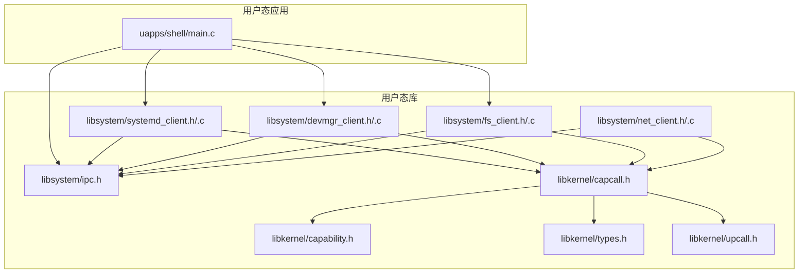
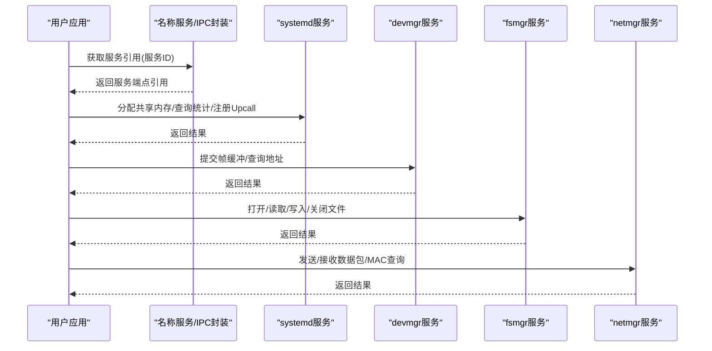
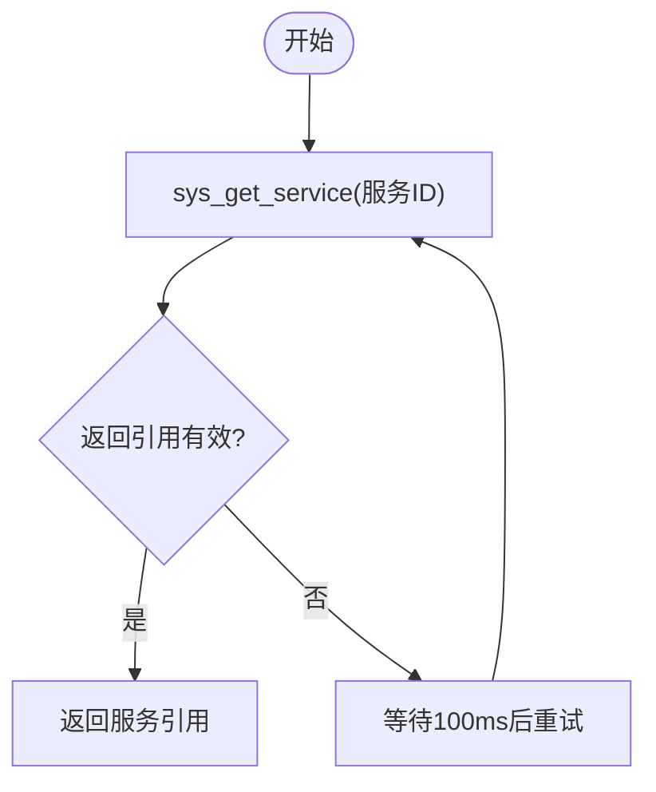
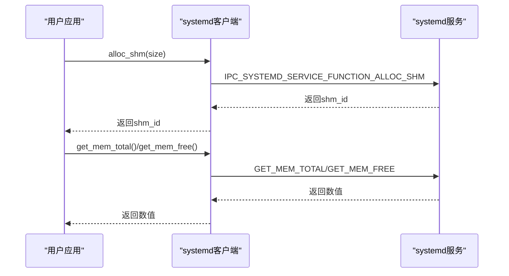
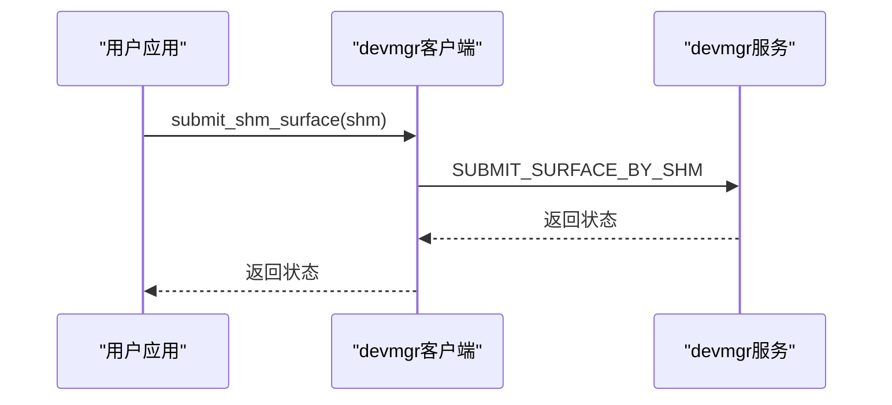
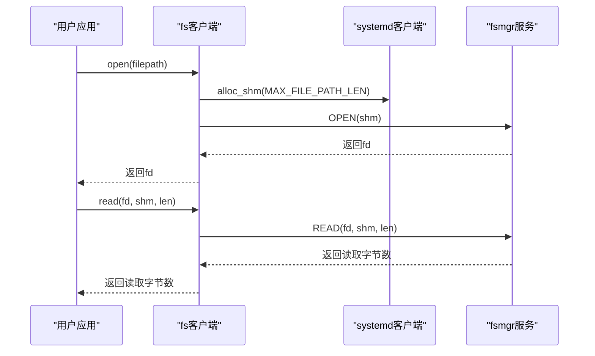
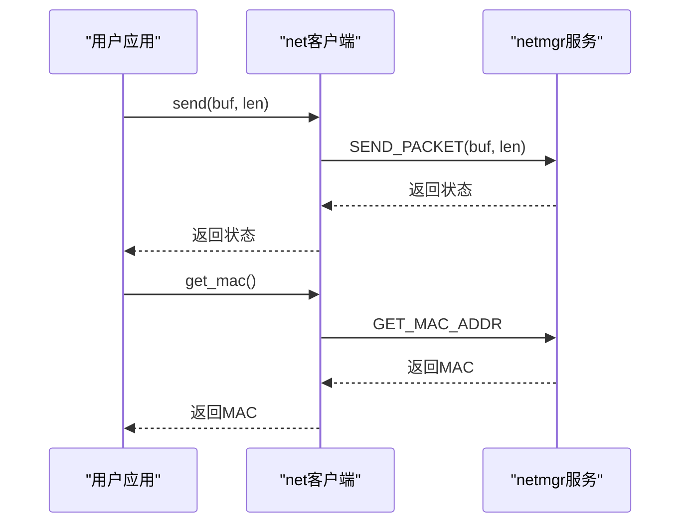
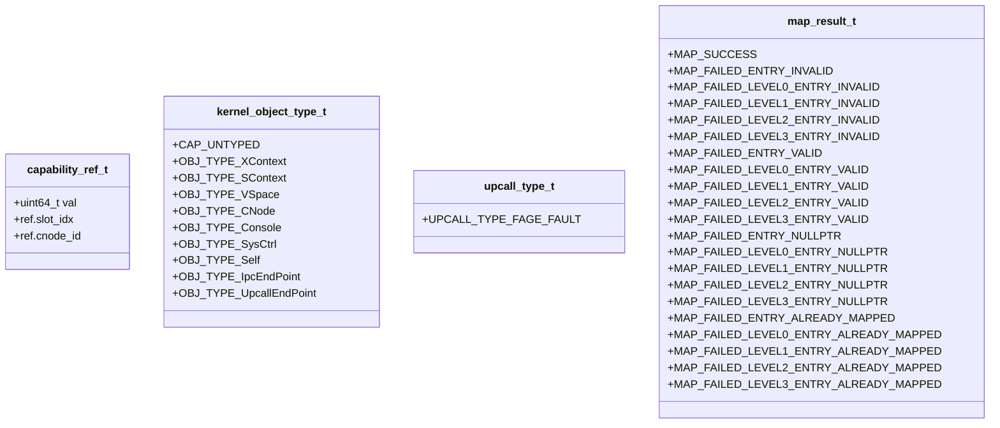
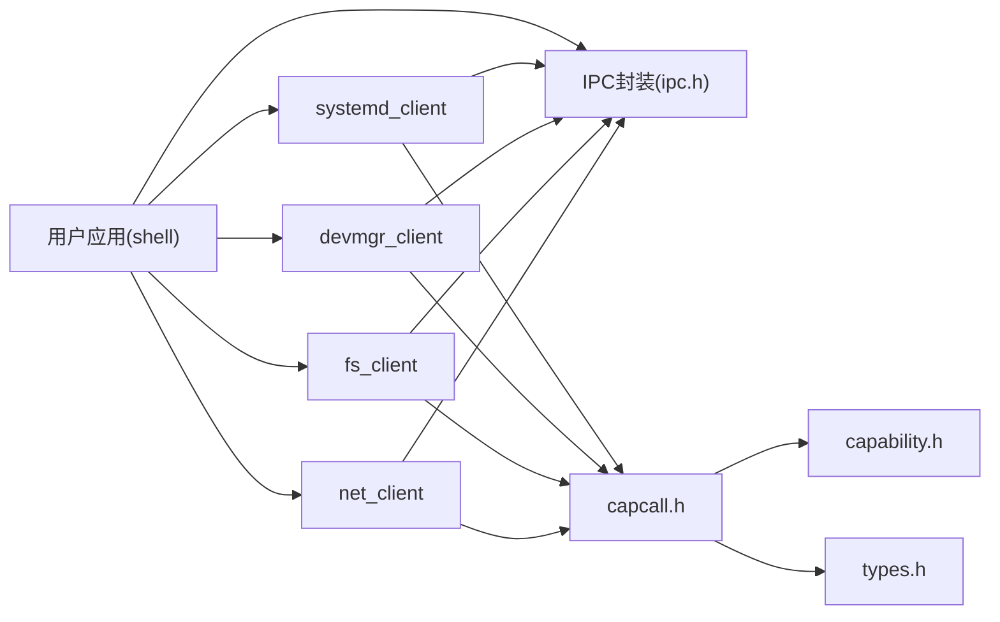

# 用户态API

<cite>
**本文引用的文件**
- [ulibs/include/libsystem/ipc.h](file://ulibs/include/libsystem/ipc.h)
- [ulibs/include/libsystem/systemd_client.h](file://ulibs/include/libsystem/systemd_client.h)
- [ulibs/libsystem/systemd_client.c](file://ulibs/libsystem/systemd_client.c)
- [ulibs/include/libsystem/devmgr_client.h](file://ulibs/include/libsystem/devmgr_client.h)
- [ulibs/libsystem/devmgr_client.c](file://ulibs/libsystem/devmgr_client.c)
- [ulibs/include/libsystem/fs_client.h](file://ulibs/include/libsystem/fs_client.h)
- [ulibs/libsystem/fs_client.c](file://ulibs/libsystem/fs_client.c)
- [ulibs/include/libsystem/net_client.h](file://ulibs/include/libsystem/net_client.h)
- [ulibs/libsystem/net_client.c](file://ulibs/libsystem/net_client.c)
- [ulibs/include/libkernel/capability.h](file://ulibs/include/libkernel/capability.h)
- [ulibs/include/libkernel/capcall.h](file://ulibs/include/libkernel/capcall.h)
- [ulibs/include/libkernel/types.h](file://ulibs/include/libkernel/types.h)
- [ulibs/include/libkernel/upcall.h](file://ulibs/include/libkernel/upcall.h)
- [uapps/shell/main.c](file://uapps/shell/main.c)
</cite>

## 目录
1. [简介](#简介)
2. [项目结构](#项目结构)
3. [核心组件](#核心组件)
4. [架构总览](#架构总览)
5. [详细组件分析](#详细组件分析)
6. [依赖关系分析](#依赖关系分析)
7. [性能考虑](#性能考虑)
8. [故障排查指南](#故障排查指南)
9. [结论](#结论)
10. [附录](#附录)

## 简介
本文件为TranquilOS用户态API的权威参考文档，覆盖以下方面：
- 用户态库接口的数据类型定义、结构体规范与枚举值说明
- 系统守护进程（systemd）客户端API：服务注册、进程/线程统计、共享内存与DMA分配、页故障处理、退出等
- IPC客户端API：消息传递、端点调用、会话控制
- 设备管理（devmgr）客户端API：帧缓冲提交、共享内存表面提交、设备树/镜像地址查询
- 文件系统（fsmgr）客户端API：文件打开、读写、关闭、路径传递
- 网络（netmgr）客户端API：数据包收发、MAC地址查询
- Capability与Upcall机制：内核对象类型、能力节点方法、IPC端点与Upcall端点、映射结果类型
- 每个API均提供参数说明、返回值定义、错误码解释与实际使用示例（以代码片段路径形式给出）

## 项目结构
用户态API主要位于ulibs目录下的libsystem与libkernel子模块中，并由若干用户态应用（如shell）进行集成使用。

**图表来源**
- [ulibs/include/libsystem/ipc.h](file://ulibs/include/libsystem/ipc.h#L1-L73)
- [ulibs/include/libsystem/systemd_client.h](file://ulibs/include/libsystem/systemd_client.h#L1-L84)
- [ulibs/libsystem/systemd_client.c](file://ulibs/libsystem/systemd_client.c#L1-L65)
- [ulibs/include/libsystem/devmgr_client.h](file://ulibs/include/libsystem/devmgr_client.h#L1-L43)
- [ulibs/libsystem/devmgr_client.c](file://ulibs/libsystem/devmgr_client.c#L1-L25)
- [ulibs/include/libsystem/fs_client.h](file://ulibs/include/libsystem/fs_client.h#L1-L47)
- [ulibs/libsystem/fs_client.c](file://ulibs/libsystem/fs_client.c#L1-L45)
- [ulibs/include/libsystem/net_client.h](file://ulibs/include/libsystem/net_client.h#L1-L31)
- [ulibs/libsystem/net_client.c](file://ulibs/libsystem/net_client.c#L1-L32)
- [ulibs/include/libkernel/capability.h](file://ulibs/include/libkernel/capability.h#L1-L141)
- [ulibs/include/libkernel/capcall.h](file://ulibs/include/libkernel/capcall.h#L1-L177)
- [ulibs/include/libkernel/types.h](file://ulibs/include/libkernel/types.h#L1-L76)
- [ulibs/include/libkernel/upcall.h](file://ulibs/include/libkernel/upcall.h#L1-L17)
- [uapps/shell/main.c](file://uapps/shell/main.c#L1-L72)

**章节来源**
- [ulibs/include/libsystem/ipc.h](file://ulibs/include/libsystem/ipc.h#L1-L73)
- [ulibs/include/libsystem/systemd_client.h](file://ulibs/include/libsystem/systemd_client.h#L1-L84)
- [ulibs/libsystem/systemd_client.c](file://ulibs/libsystem/systemd_client.c#L1-L65)
- [ulibs/include/libsystem/devmgr_client.h](file://ulibs/include/libsystem/devmgr_client.h#L1-L43)
- [ulibs/libsystem/devmgr_client.c](file://ulibs/libsystem/devmgr_client.c#L1-L25)
- [ulibs/include/libsystem/fs_client.h](file://ulibs/include/libsystem/fs_client.h#L1-L47)
- [ulibs/libsystem/fs_client.c](file://ulibs/libsystem/fs_client.c#L1-L45)
- [ulibs/include/libsystem/net_client.h](file://ulibs/include/libsystem/net_client.h#L1-L31)
- [ulibs/libsystem/net_client.c](file://ulibs/libsystem/net_client.c#L1-L32)
- [ulibs/include/libkernel/capability.h](file://ulibs/include/libkernel/capability.h#L1-L141)
- [ulibs/include/libkernel/capcall.h](file://ulibs/include/libkernel/capcall.h#L1-L177)
- [ulibs/include/libkernel/types.h](file://ulibs/include/libkernel/types.h#L1-L76)
- [ulibs/include/libkernel/upcall.h](file://ulibs/include/libkernel/upcall.h#L1-L17)
- [uapps/shell/main.c](file://uapps/shell/main.c#L1-L72)

## 核心组件
- 名称服务与IPC端点封装：提供服务发现、注册以及统一的端点调用入口
- systemd客户端：提供共享内存/ DMA分配、内存统计、进程/线程计数、页故障上报、自退出、Upcall注册等
- devmgr客户端：提供帧缓冲/共享内存表面提交、设备树/镜像地址查询
- fs客户端：提供文件打开、读取、写入、关闭，路径通过共享内存传递
- net客户端：提供数据包发送/接收、MAC地址查询
- Capability与Upcall：内核对象类型、能力节点方法、IPC/Upcall端点方法、映射结果类型

**章节来源**
- [ulibs/include/libsystem/ipc.h](file://ulibs/include/libsystem/ipc.h#L11-L70)
- [ulibs/include/libsystem/systemd_client.h](file://ulibs/include/libsystem/systemd_client.h#L7-L84)
- [ulibs/libsystem/systemd_client.c](file://ulibs/libsystem/systemd_client.c#L6-L43)
- [ulibs/include/libsystem/devmgr_client.h](file://ulibs/include/libsystem/devmgr_client.h#L7-L43)
- [ulibs/libsystem/devmgr_client.c](file://ulibs/libsystem/devmgr_client.c#L5-L11)
- [ulibs/include/libsystem/fs_client.h](file://ulibs/include/libsystem/fs_client.h#L7-L47)
- [ulibs/libsystem/fs_client.c](file://ulibs/libsystem/fs_client.c#L9-L29)
- [ulibs/include/libsystem/net_client.h](file://ulibs/include/libsystem/net_client.h#L7-L31)
- [ulibs/libsystem/net_client.c](file://ulibs/libsystem/net_client.c#L7-L17)
- [ulibs/include/libkernel/capability.h](file://ulibs/include/libkernel/capability.h#L6-L141)
- [ulibs/include/libkernel/capcall.h](file://ulibs/include/libkernel/capcall.h#L128-L177)
- [ulibs/include/libkernel/types.h](file://ulibs/include/libkernel/types.h#L4-L76)
- [ulibs/include/libkernel/upcall.h](file://ulibs/include/libkernel/upcall.h#L4-L17)

## 架构总览
用户态API通过统一的IPC端点调用访问内核/系统服务，各客户端模块封装具体方法号与参数打包，系统守护进程提供资源管理与Upcall注册，设备/文件/网络服务分别提供对应功能。

**图表来源**
- [ulibs/include/libsystem/ipc.h](file://ulibs/include/libsystem/ipc.h#L61-L70)
- [ulibs/libsystem/systemd_client.c](file://ulibs/libsystem/systemd_client.c#L6-L43)
- [ulibs/libsystem/devmgr_client.c](file://ulibs/libsystem/devmgr_client.c#L5-L11)
- [ulibs/libsystem/fs_client.c](file://ulibs/libsystem/fs_client.c#L9-L29)
- [ulibs/libsystem/net_client.c](file://ulibs/libsystem/net_client.c#L7-L17)

## 详细组件分析

### 名称服务与IPC端点
- 服务ID枚举：名称服务、systemd、devmgr、fsmgr、netmgr
- 方法枚举：注册服务、获取服务
- 服务获取流程：通过名称服务端点调用“获取服务”，若未就绪则重试
- 端点调用宏：提供2~6参数的端点调用封装，简化参数传递

**图表来源**
- [ulibs/include/libsystem/ipc.h](file://ulibs/include/libsystem/ipc.h#L61-L70)

**章节来源**
- [ulibs/include/libsystem/ipc.h](file://ulibs/include/libsystem/ipc.h#L11-L70)
- [ulibs/include/libkernel/capcall.h](file://ulibs/include/libkernel/capcall.h#L166-L172)

### systemd客户端API
- 功能列表
  - 分配/获取/释放共享内存
  - 获取内存总量/空闲量
  - 获取进程/线程数量
  - 注册Upcall入口
  - 页故障上报
  - 自身进程退出
- 关键函数与参数
  - 分配共享内存：size → 返回共享内存标识
  - 获取共享内存：shm_id → 返回可访问地址
  - 释放共享内存：shm_id → 返回状态
  - 内存统计：无 → 返回数值
  - 进程/线程计数：无 → 返回数值
  - 注册Upcall：upcall_entry → 返回状态
  - 页故障上报：vaddr → 返回状态
  - 自身退出：status → 返回状态
- 错误与返回
  - 返回值为无符号整型；具体错误需结合服务侧语义与返回值约定
- 使用示例（路径）
  - [分配并使用共享内存](file://ulibs/libsystem/systemd_client.c#L6-L15)
  - [获取内存统计与提交帧缓冲](file://uapps/shell/main.c#L59-L68)

**图表来源**
- [ulibs/libsystem/systemd_client.c](file://ulibs/libsystem/systemd_client.c#L6-L31)
- [ulibs/include/libsystem/systemd_client.h](file://ulibs/include/libsystem/systemd_client.h#L7-L52)

**章节来源**
- [ulibs/include/libsystem/systemd_client.h](file://ulibs/include/libsystem/systemd_client.h#L7-L84)
- [ulibs/libsystem/systemd_client.c](file://ulibs/libsystem/systemd_client.c#L6-L43)
- [uapps/shell/main.c](file://uapps/shell/main.c#L59-L68)

### 设备管理客户端API
- 功能列表
  - 提交共享内存表面用于显示输出
  - 查询设备树/镜像地址
- 关键函数与参数
  - 提交共享内存表面：shm → 返回状态
  - 获取CPIO地址：无 → 返回地址
- 使用示例（路径）
  - [提交帧缓冲](file://uapps/shell/main.c#L68-L68)

**图表来源**
- [ulibs/libsystem/devmgr_client.c](file://ulibs/libsystem/devmgr_client.c#L5-L11)
- [ulibs/include/libsystem/devmgr_client.h](file://ulibs/include/libsystem/devmgr_client.h#L7-L27)

**章节来源**
- [ulibs/include/libsystem/devmgr_client.h](file://ulibs/include/libsystem/devmgr_client.h#L7-L43)
- [ulibs/libsystem/devmgr_client.c](file://ulibs/libsystem/devmgr_client.c#L5-L11)
- [uapps/shell/main.c](file://uapps/shell/main.c#L68-L68)

### 文件系统客户端API
- 功能列表
  - 打开文件（路径通过共享内存传递）
  - 读取/写入（指定fd、共享内存缓冲与长度）
  - 关闭文件
- 关键函数与参数
  - 打开：filepath → 返回fd
  - 读取：fd, shm, len → 返回读取字节数
  - 写入：fd, shm, len → 返回写入字节数
  - 关闭：fd → 返回状态
- 路径传递策略
  - 使用systemd共享内存分配器分配临时缓冲，拷贝路径后调用服务，结束后释放
- 使用示例（路径）
  - [打开文件并读取内容](file://ulibs/libsystem/fs_client.c#L9-L16)
  - [读取到共享内存并打印](file://uapps/shell/main.c#L51-L55)

**图表来源**
- [ulibs/libsystem/fs_client.c](file://ulibs/libsystem/fs_client.c#L9-L21)
- [ulibs/include/libsystem/fs_client.h](file://ulibs/include/libsystem/fs_client.h#L7-L27)

**章节来源**
- [ulibs/include/libsystem/fs_client.h](file://ulibs/include/libsystem/fs_client.h#L7-L47)
- [ulibs/libsystem/fs_client.c](file://ulibs/libsystem/fs_client.c#L9-L29)
- [uapps/shell/main.c](file://uapps/shell/main.c#L49-L55)

### 网络客户端API
- 功能列表
  - 发送数据包
  - 接收数据包
  - 查询MAC地址
- 关键函数与参数
  - 发送：buf, len → 返回发送字节数或状态
  - 接收：buf, len → 返回接收字节数或状态
  - MAC查询：无 → 返回MAC地址
- 使用示例（路径）
  - [获取网络客户端并查询MAC](file://ulibs/libsystem/net_client.c#L15-L17)

**图表来源**
- [ulibs/libsystem/net_client.c](file://ulibs/libsystem/net_client.c#L7-L17)
- [ulibs/include/libsystem/net_client.h](file://ulibs/include/libsystem/net_client.h#L7-L11)

**章节来源**
- [ulibs/include/libsystem/net_client.h](file://ulibs/include/libsystem/net_client.h#L7-L31)
- [ulibs/libsystem/net_client.c](file://ulibs/libsystem/net_client.c#L7-L17)

### Capability与Upcall机制
- 内核对象类型：Untyped、XContext、SContext、VSpace、CNode、Console、SysCtrl、Self、IpcEndPoint、UpcallEndPoint
- 能力引用结构：capability_ref，包含slot索引与cnode_id
- 能力节点方法：Create、NewCapability、Prepare、Extend、Destroy
- 控制器方法族：Console、Futex、SysCtrl、Self、Timer、VSpace、XContext、IpcEndPoint、UpcallEndPoint
- Upcall类型：当前定义为页故障
- 映射结果类型：包含各级页表项无效、空指针、已映射等多种失败场景

**图表来源**
- [ulibs/include/libkernel/capability.h](file://ulibs/include/libkernel/capability.h#L44-L50)
- [ulibs/include/libkernel/capability.h](file://ulibs/include/libkernel/capability.h#L6-L18)
- [ulibs/include/libkernel/upcall.h](file://ulibs/include/libkernel/upcall.h#L4-L6)
- [ulibs/include/libkernel/types.h](file://ulibs/include/libkernel/types.h#L4-L26)

**章节来源**
- [ulibs/include/libkernel/capability.h](file://ulibs/include/libkernel/capability.h#L6-L141)
- [ulibs/include/libkernel/capcall.h](file://ulibs/include/libkernel/capcall.h#L128-L177)
- [ulibs/include/libkernel/types.h](file://ulibs/include/libkernel/types.h#L4-L76)
- [ulibs/include/libkernel/upcall.h](file://ulibs/include/libkernel/upcall.h#L4-L17)

## 依赖关系分析
- 用户态应用依赖libsystem客户端库，通过IPC封装访问系统服务
- systemd客户端依赖IPC封装与capcall进行端点调用
- devmgr/fs/net客户端同样依赖IPC封装与capcall
- capcall依赖capability与types定义，向上提供统一的内核调用接口

**图表来源**
- [ulibs/include/libsystem/ipc.h](file://ulibs/include/libsystem/ipc.h#L1-L73)
- [ulibs/include/libsystem/systemd_client.h](file://ulibs/include/libsystem/systemd_client.h#L1-L84)
- [ulibs/libsystem/systemd_client.c](file://ulibs/libsystem/systemd_client.c#L1-L65)
- [ulibs/include/libsystem/devmgr_client.h](file://ulibs/include/libsystem/devmgr_client.h#L1-L43)
- [ulibs/libsystem/devmgr_client.c](file://ulibs/libsystem/devmgr_client.c#L1-L25)
- [ulibs/include/libsystem/fs_client.h](file://ulibs/include/libsystem/fs_client.h#L1-L47)
- [ulibs/libsystem/fs_client.c](file://ulibs/libsystem/fs_client.c#L1-L45)
- [ulibs/include/libsystem/net_client.h](file://ulibs/include/libsystem/net_client.h#L1-L31)
- [ulibs/libsystem/net_client.c](file://ulibs/libsystem/net_client.c#L1-L32)
- [ulibs/include/libkernel/capcall.h](file://ulibs/include/libkernel/capcall.h#L1-L177)
- [ulibs/include/libkernel/capability.h](file://ulibs/include/libkernel/capability.h#L1-L141)
- [ulibs/include/libkernel/types.h](file://ulibs/include/libkernel/types.h#L1-L76)
- [uapps/shell/main.c](file://uapps/shell/main.c#L1-L72)

**章节来源**
- [ulibs/include/libsystem/ipc.h](file://ulibs/include/libsystem/ipc.h#L1-L73)
- [ulibs/include/libkernel/capcall.h](file://ulibs/include/libkernel/capcall.h#L1-L177)
- [uapps/shell/main.c](file://uapps/shell/main.c#L1-L72)

## 性能考虑
- 共享内存复用：文件路径与数据读写尽量使用systemd提供的共享内存，减少拷贝与系统调用次数
- 批量操作：网络数据包发送/接收建议批量处理，降低IPC往返开销
- 重试策略：服务发现时采用短间隔重试，避免长时间阻塞
- Upcall优化：仅在必要时注册Upcall，避免频繁触发

## 故障排查指南
- 服务未找到
  - 现象：sys_get_service返回无效引用并持续重试
  - 处理：确认对应服务是否已启动，检查名称服务注册流程
  - 参考路径：[服务获取与重试](file://ulibs/include/libsystem/ipc.h#L61-L70)
- 共享内存异常
  - 现象：分配/获取/释放共享内存失败
  - 处理：检查systemd共享内存接口返回值与容量限制
  - 参考路径：[共享内存接口](file://ulibs/libsystem/systemd_client.c#L6-L15)
- 文件操作失败
  - 现象：打开/读取/写入/关闭返回异常
  - 处理：确认路径有效性、权限与缓冲区大小
  - 参考路径：[文件操作](file://ulibs/libsystem/fs_client.c#L9-L29)
- 映射错误
  - 现象：地址空间映射返回失败
  - 处理：根据map_result_t定位具体失败原因（无效/空指针/已映射等）
  - 参考路径：[映射结果类型](file://ulibs/include/libkernel/types.h#L4-L76)

**章节来源**
- [ulibs/include/libsystem/ipc.h](file://ulibs/include/libsystem/ipc.h#L61-L70)
- [ulibs/libsystem/systemd_client.c](file://ulibs/libsystem/systemd_client.c#L6-L15)
- [ulibs/libsystem/fs_client.c](file://ulibs/libsystem/fs_client.c#L9-L29)
- [ulibs/include/libkernel/types.h](file://ulibs/include/libkernel/types.h#L4-L76)

## 结论
TranquilOS用户态API通过统一的IPC封装与客户端库，为应用提供了稳定的服务访问接口。systemd作为资源与Upcall中心，devmgr/fs/net分别承担设备、文件与网络功能。借助Capability与Upcall机制，用户态可在受控环境下高效完成资源管理与事件处理。建议在实际开发中遵循共享内存复用、批量处理与合理重试的原则，确保系统稳定性与性能。

## 附录
- 实际使用示例（路径）
  - [shell应用：分配共享内存、打开文件、读取内容、提交帧缓冲](file://uapps/shell/main.c#L41-L70)
  - [systemd客户端：分配/获取/释放共享内存](file://ulibs/libsystem/systemd_client.c#L6-L15)
  - [fs客户端：打开文件并读取](file://ulibs/libsystem/fs_client.c#L9-L16)
  - [net客户端：查询MAC地址](file://ulibs/libsystem/net_client.c#L15-L17)