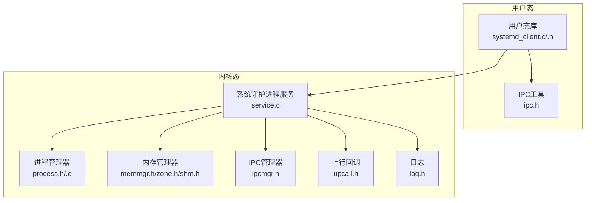
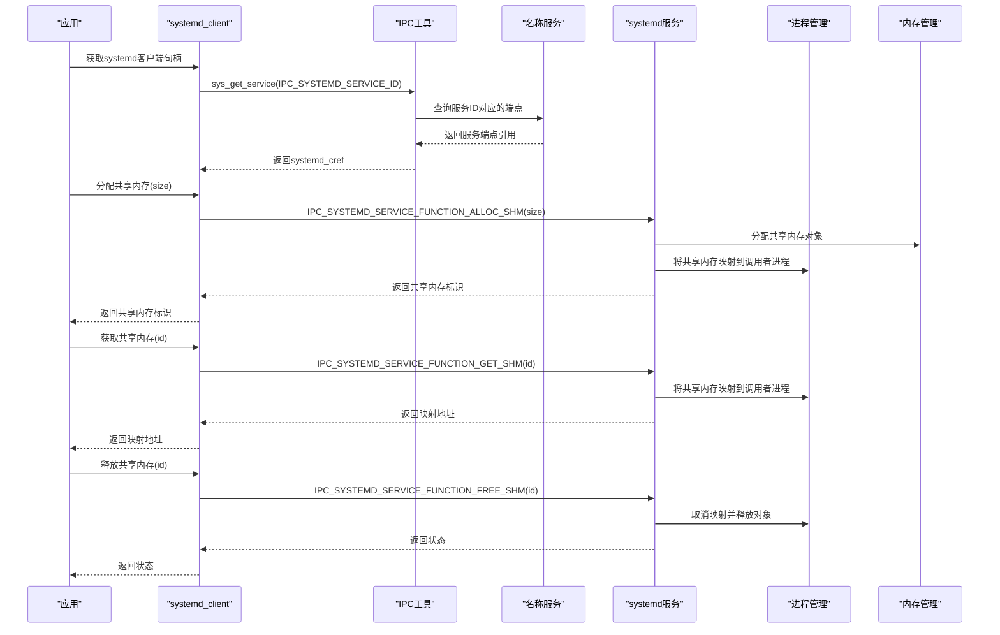
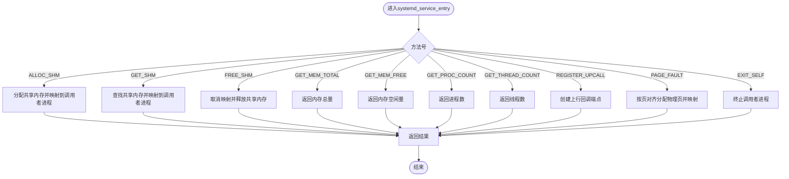
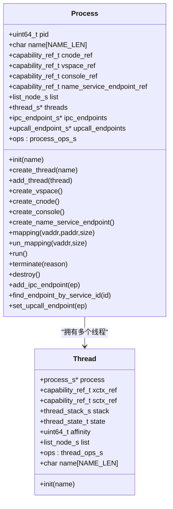
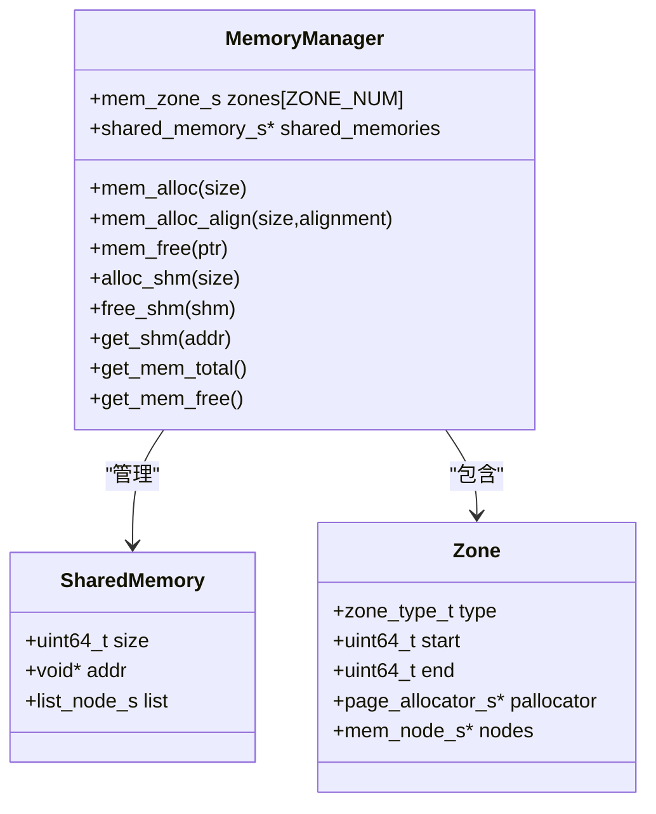
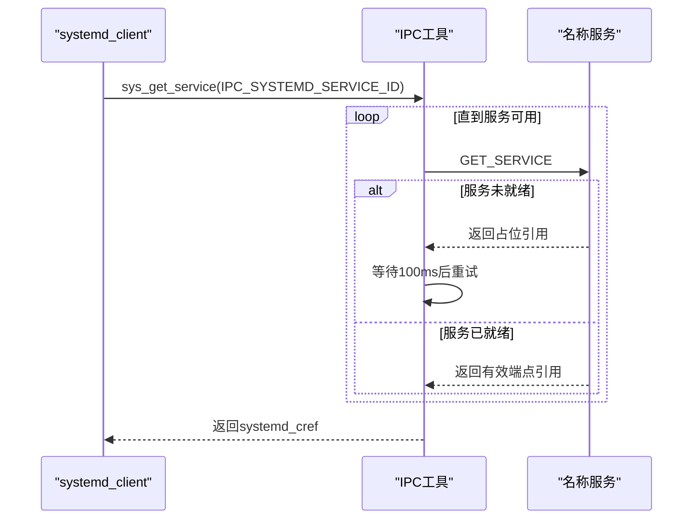
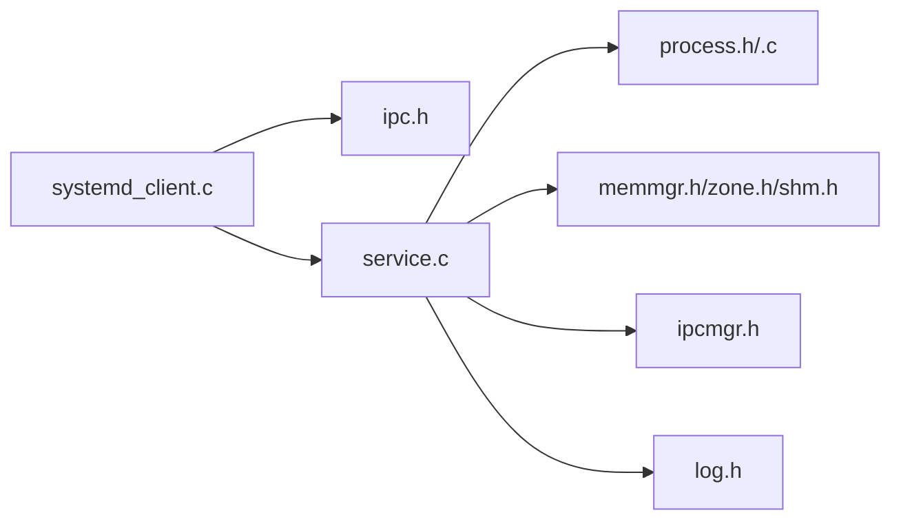

# 系统守护进程客户端API

<cite>
**本文档引用的文件**
- [systemd_client.c](file://ulibs/libsystem/systemd_client.c)
- [systemd_client.h](file://ulibs/include/libsystem/systemd_client.h)
- [ipc.h](file://ulibs/include/libsystem/ipc.h)
- [service.c](file://kernel/systemd/service.c)
- [systemd.h](file://kernel/systemd/include/systemd.h)
- [service.h](file://kernel/systemd/include/service.h)
- [process.h](file://kernel/systemd/include/procmgr/process.h)
- [thread.h](file://kernel/systemd/include/procmgr/thread.h)
- [memmgr.h](file://kernel/systemd/include/memmgr/memmgr.h)
- [zone.h](file://kernel/systemd/include/memmgr/zone.h)
- [shm.h](file://kernel/systemd/include/memmgr/shm.h)
- [ipcmgr.h](file://kernel/systemd/include/ipcmgr/ipcmgr.h)
- [upcall.h](file://kernel/systemd/include/upcall.h)
- [process.c](file://kernel/systemd/procmgr/process.c)
- [log.h](file://kernel/systemd/include/log.h)
</cite>

## 目录
1. [简介](#简介)
2. [项目结构](#项目结构)
3. [核心组件](#核心组件)
4. [架构总览](#架构总览)
5. [详细组件分析](#详细组件分析)
6. [依赖关系分析](#依赖关系分析)
7. [性能考虑](#性能考虑)
8. [故障排查指南](#故障排查指南)
9. [结论](#结论)
10. [附录](#附录)

## 简介
本文件面向TranquilOS系统中的“系统守护进程”（systemd）客户端API，提供对SystemD服务注册、进程管理与资源分配的完整使用说明。内容覆盖：
- 服务注册与发现流程
- 进程创建、运行、销毁与监控
- 共享内存（SHM）分配、获取与释放
- 内存总量与空闲量查询
- 进程数与线程数统计
- 上报缺页异常与自退出
- 能力（Capability）验证要点
- 错误码与超时处理策略
- 实际使用示例与最佳实践

## 项目结构
TranquilOS将系统守护进程能力封装在内核模块中，并通过用户态库提供统一的客户端接口。关键目录与文件如下：
- 用户态客户端：ulibs/libsystem/systemd_client.c 与 ulibs/include/libsystem/systemd_client.h
- 内核态服务实现：kernel/systemd/service.c
- IPC与服务发现：ulibs/include/libsystem/ipc.h
- 进程管理：kernel/systemd/include/procmgr/process.h、kernel/systemd/procmgr/process.c
- 内存管理：kernel/systemd/include/memmgr/memmgr.h、kernel/systemd/include/memmgr/zone.h、kernel/systemd/include/memmgr/shm.h
- 名称服务与IPC端点：kernel/systemd/include/ipcmgr/ipcmgr.h
- 上报与日志：kernel/systemd/include/upcall.h、kernel/systemd/include/log.h

**图表来源**
- [systemd_client.c](file://ulibs/libsystem/systemd_client.c#L1-L65)
- [systemd_client.h](file://ulibs/include/libsystem/systemd_client.h#L1-L52)
- [ipc.h](file://ulibs/include/libsystem/ipc.h#L1-L73)
- [service.c](file://kernel/systemd/service.c#L1-L236)
- [process.h](file://kernel/systemd/include/procmgr/process.h#L1-L98)
- [process.c](file://kernel/systemd/procmgr/process.c#L1-L442)
- [memmgr.h](file://kernel/systemd/include/memmgr/memmgr.h#L1-L31)
- [zone.h](file://kernel/systemd/include/memmgr/zone.h#L1-L36)
- [shm.h](file://kernel/systemd/include/memmgr/shm.h#L1-L15)
- [ipcmgr.h](file://kernel/systemd/include/ipcmgr/ipcmgr.h#L1-L15)
- [upcall.h](file://kernel/systemd/include/upcall.h#L1-L21)
- [log.h](file://kernel/systemd/include/log.h#L1-L32)

**章节来源**
- [systemd_client.c](file://ulibs/libsystem/systemd_client.c#L1-L65)
- [systemd_client.h](file://ulibs/include/libsystem/systemd_client.h#L1-L52)
- [ipc.h](file://ulibs/include/libsystem/ipc.h#L1-L73)
- [service.c](file://kernel/systemd/service.c#L1-L236)

## 核心组件
- 客户端API（systemd_client）
  - 提供共享内存分配/获取/释放、内存总量/空闲量查询、进程/线程计数、注册上行回调、缺页上报、自退出等接口
- 内核服务（systemd_service）
  - 接收客户端请求，执行具体操作（如分配共享内存、映射物理页到进程虚拟空间、统计进程/线程数量等）
- 进程管理（process）
  - 封装进程生命周期、线程创建、地址空间映射、IPC端点与上行回调设置
- 内存管理（memmgr）
  - 维护内存区（zone），提供页分配/对齐分配、共享内存对象管理
- IPC与名称服务
  - 通过名称服务发现systemd服务端点，建立IPC通道

**章节来源**
- [systemd_client.c](file://ulibs/libsystem/systemd_client.c#L1-L65)
- [service.c](file://kernel/systemd/service.c#L1-L236)
- [process.h](file://kernel/systemd/include/procmgr/process.h#L1-L98)
- [memmgr.h](file://kernel/systemd/include/memmgr/memmgr.h#L1-L31)

## 架构总览
下图展示从用户态发起调用到内核态处理的关键路径，以及涉及的数据结构与依赖关系。

**图表来源**
- [systemd_client.c](file://ulibs/libsystem/systemd_client.c#L45-L65)
- [ipc.h](file://ulibs/include/libsystem/ipc.h#L61-L70)
- [service.c](file://kernel/systemd/service.c#L160-L230)
- [process.c](file://kernel/systemd/procmgr/process.c#L84-L148)
- [memmgr.h](file://kernel/systemd/include/memmgr/memmgr.h#L10-L24)

## 详细组件分析

### 客户端API与函数签名
以下为systemd客户端提供的核心接口，均通过IPC端点调用systemd服务实现对应功能。

- 获取共享内存标识（分配）
  - 函数：systemd_client_alloc_shm
  - 参数：size（字节）
  - 返回：共享内存标识（地址或ID）
  - 说明：向systemd申请一块共享内存，并将其映射到调用者进程的虚拟地址空间
  - 参考路径：[systemd_client.c](file://ulibs/libsystem/systemd_client.c#L6-L8)

- 获取共享内存映射地址
  - 函数：systemd_client_get_shm
  - 参数：shm_id（共享内存标识）
  - 返回：映射后的地址
  - 说明：将已存在的共享内存映射到调用者进程
  - 参考路径：[systemd_client.c](file://ulibs/libsystem/systemd_client.c#L10-L12)

- 释放共享内存
  - 函数：systemd_client_free_shm
  - 参数：shm_id（共享内存标识）
  - 返回：状态（0成功，非0失败）
  - 说明：取消映射并释放共享内存对象
  - 参考路径：[systemd_client.c](file://ulibs/libsystem/systemd_client.c#L13-L15)

- 查询内存总量
  - 函数：systemd_client_get_mem_total
  - 参数：无
  - 返回：系统内存总量（字节）
  - 参考路径：[systemd_client.c](file://ulibs/libsystem/systemd_client.c#L17-L19)

- 查询内存空闲量
  - 函数：systemd_client_get_mem_free
  - 参数：无
  - 返回：系统内存空闲量（字节）
  - 参考路径：[systemd_client.c](file://ulibs/libsystem/systemd_client.c#L21-L23)

- 查询进程数量
  - 函数：systemd_client_get_proc_count
  - 参数：无
  - 返回：当前进程总数
  - 参考路径：[systemd_client.c](file://ulibs/libsystem/systemd_client.c#L25-L27)

- 查询线程数量
  - 函数：systemd_client_get_thread_count
  - 参数：无
  - 返回：当前线程总数
  - 参考路径：[systemd_client.c](file://ulibs/libsystem/systemd_client.c#L29-L31)

- 注册上行回调入口
  - 函数：systemd_client_register_upcall
  - 参数：upcall_entry（回调入口地址）
  - 返回：状态（1成功，0失败）
  - 说明：用于设置缺页异常等事件的回调入口
  - 参考路径：[systemd_client.c](file://ulibs/libsystem/systemd_client.c#L33-L35)

- 缺页异常上报
  - 函数：systemd_client_page_fault
  - 参数：vaddr（发生缺页的虚拟地址）
  - 返回：状态（1成功，0失败）
  - 说明：通知systemd为该地址进行缺页处理（可能分配物理页并映射）
  - 参考路径：[systemd_client.c](file://ulibs/libsystem/systemd_client.c#L37-L39)

- 自身进程退出
  - 函数：systemd_client_process_self_exit
  - 参数：status（退出状态）
  - 返回：状态（1成功，0失败）
  - 说明：请求systemd终止当前进程
  - 参考路径：[systemd_client.c](file://ulibs/libsystem/systemd_client.c#L41-L43)

- 获取systemd客户端实例
  - 函数：systemd_client_get
  - 功能：初始化并返回全局systemd客户端实例；内部通过名称服务获取systemd服务端点引用
  - 参考路径：[systemd_client.c](file://ulibs/libsystem/systemd_client.c#L45-L65)

- IPC方法枚举（客户端侧）
  - 文件：ulibs/include/libsystem/systemd_client.h
  - 包含：ALLOC_DMA、ALLOC_SHM、GET_SHM、FREE_SHM、GET_MEM_TOTAL、GET_MEM_FREE、GET_PROC_COUNT、GET_THREAD_COUNT、REGISTER_UPCALL、PAGE_FAULT、EXIT_SELF
  - 参考路径：[systemd_client.h](file://ulibs/include/libsystem/systemd_client.h#L7-L52)

**章节来源**
- [systemd_client.c](file://ulibs/libsystem/systemd_client.c#L1-L65)
- [systemd_client.h](file://ulibs/include/libsystem/systemd_client.h#L1-L52)

### 内核服务端处理逻辑
systemd服务端接收来自客户端的IPC调用，根据方法号分派到具体处理函数，并通过进程/内存管理器完成实际操作。

**图表来源**
- [service.c](file://kernel/systemd/service.c#L160-L230)

**章节来源**
- [service.c](file://kernel/systemd/service.c#L1-L236)

### 进程管理与线程模型
进程与线程是systemd服务中重要的资源实体，负责承载用户态应用的执行上下文。

**图表来源**
- [process.h](file://kernel/systemd/include/procmgr/process.h#L77-L98)
- [thread.h](file://kernel/systemd/include/procmgr/thread.h#L29-L48)

**章节来源**
- [process.h](file://kernel/systemd/include/procmgr/process.h#L1-L98)
- [thread.h](file://kernel/systemd/include/procmgr/thread.h#L1-L48)

### 内存管理与共享内存
内存管理器维护内存区（zone），支持页对齐分配与共享内存对象管理。

**图表来源**
- [memmgr.h](file://kernel/systemd/include/memmgr/memmgr.h#L10-L24)
- [shm.h](file://kernel/systemd/include/memmgr/shm.h#L8-L15)
- [zone.h](file://kernel/systemd/include/memmgr/zone.h#L21-L27)

**章节来源**
- [memmgr.h](file://kernel/systemd/include/memmgr/memmgr.h#L1-L31)
- [shm.h](file://kernel/systemd/include/memmgr/shm.h#L1-L15)
- [zone.h](file://kernel/systemd/include/memmgr/zone.h#L1-L36)

### IPC与服务发现
- 服务ID与名称服务
  - systemd服务ID：IPC_SYSTEMD_SERVICE_ID
  - 通过名称服务查询/注册服务端点
- 客户端获取systemd端点引用
  - sys_get_service会轮询等待直到服务可用（带超时重试）

**图表来源**
- [ipc.h](file://ulibs/include/libsystem/ipc.h#L61-L70)

**章节来源**
- [ipc.h](file://ulibs/include/libsystem/ipc.h#L1-L73)

### Capability权限验证
- 进程能力（Capability）使用
  - 进程创建时生成CNode、VSpace、SContext/XContext等能力引用
  - 通过能力引用进行IPC端点调用与内存映射
- 关键能力类型
  - CNode：能力节点，承载各类子能力
  - VSpace：虚拟地址空间
  - SContext/XContext：调度/执行上下文
  - IPC端点：与其他服务通信
- 能力传递与验证
  - 客户端通过systemd_cref持有对systemd服务的调用能力
  - 内核侧在处理请求时基于调用者PID进行权限校验（例如映射共享内存前获取调用者进程）

**章节来源**
- [process.c](file://kernel/systemd/procmgr/process.c#L296-L325)
- [process.c](file://kernel/systemd/procmgr/process.c#L327-L354)
- [process.c](file://kernel/systemd/procmgr/process.c#L419-L442)

### 错误码与返回值
- 返回值约定
  - 成功通常返回非零（如1），失败返回0或负值（如-1）
- 常见错误场景
  - 内存管理器未初始化
  - 进程管理器未初始化
  - 无法获取调用者进程
  - 地址映射失败（扩展页表、映射页失败）
  - 共享内存对象不存在或为空
- 日志与诊断
  - 使用log_debug/info/warn/error/fatal输出详细信息，便于定位问题

**章节来源**
- [service.c](file://kernel/systemd/service.c#L10-L97)
- [process.c](file://kernel/systemd/procmgr/process.c#L84-L148)
- [log.h](file://kernel/systemd/include/log.h#L11-L30)

### 超时机制
- 服务发现阶段
  - sys_get_service在未找到服务时会循环重试，每次等待固定时间间隔
  - 适用于系统启动初期服务尚未完全初始化的情况
- 建议
  - 在应用启动时预留足够等待时间，避免因短暂不可用导致初始化失败

**章节来源**
- [ipc.h](file://ulibs/include/libsystem/ipc.h#L61-L70)

### 常见使用场景与最佳实践
- 场景一：分配并使用共享内存
  - 步骤：获取systemd客户端 -> 分配共享内存 -> 映射到进程 -> 使用 -> 释放
  - 注意：释放前确保不再使用映射地址
- 场景二：查询系统资源
  - 步骤：获取systemd客户端 -> 查询内存总量/空闲量 -> 查询进程/线程数
- 场景三：处理缺页异常
  - 步骤：在异常处理中调用缺页上报 -> systemd分配物理页并映射
- 最佳实践
  - 所有IPC调用应检查返回值，失败时记录日志并进行回退
  - 在多线程环境下注意共享内存的并发访问控制
  - 合理设置上行回调以处理异步事件（如缺页）

## 依赖关系分析
- 客户端依赖
  - 依赖IPC工具进行服务发现与端点调用
  - 依赖systemd服务端点进行资源操作
- 内核服务依赖
  - 依赖进程管理器完成进程/线程生命周期管理
  - 依赖内存管理器完成页分配与共享内存管理
  - 依赖IPC管理器与名称服务进行端点注册与查询
  - 依赖日志模块输出调试信息

**图表来源**
- [systemd_client.c](file://ulibs/libsystem/systemd_client.c#L1-L65)
- [ipc.h](file://ulibs/include/libsystem/ipc.h#L1-L73)
- [service.c](file://kernel/systemd/service.c#L1-L236)
- [process.h](file://kernel/systemd/include/procmgr/process.h#L1-L98)
- [process.c](file://kernel/systemd/procmgr/process.c#L1-L442)
- [memmgr.h](file://kernel/systemd/include/memmgr/memmgr.h#L1-L31)
- [ipcmgr.h](file://kernel/systemd/include/ipcmgr/ipcmgr.h#L1-L15)
- [log.h](file://kernel/systemd/include/log.h#L1-L32)

**章节来源**
- [systemd_client.c](file://ulibs/libsystem/systemd_client.c#L1-L65)
- [service.c](file://kernel/systemd/service.c#L1-L236)

## 性能考虑
- 共享内存分配
  - 优先使用对齐分配以提升缓存命中率
  - 避免频繁小块分配，尽量批量申请
- 地址空间映射
  - 批量映射连续页可减少页表扩展次数
- 缺页处理
  - 缺页回调应尽量轻量化，避免阻塞
- 线程调度
  - 设置合理的亲和性，减少跨核迁移开销

## 故障排查指南
- 症状：sys_get_service返回无效端点引用
  - 检查systemd服务是否已初始化
  - 查看日志中服务注册与发现过程
- 症状：共享内存分配失败
  - 检查内存总量与空闲量
  - 确认调用者进程具备相应能力
- 症状：地址映射失败
  - 检查页表扩展是否成功
  - 确认物理页分配是否充足
- 症状：缺页上报无效
  - 确认传入的虚拟地址范围正确
  - 检查systemd是否成功分配并映射物理页

**章节来源**
- [ipc.h](file://ulibs/include/libsystem/ipc.h#L61-L70)
- [service.c](file://kernel/systemd/service.c#L109-L141)
- [process.c](file://kernel/systemd/procmgr/process.c#L84-L148)
- [log.h](file://kernel/systemd/include/log.h#L11-L30)

## 结论
本文档系统性地梳理了TranquilOS系统守护进程客户端API，覆盖服务注册、进程管理与资源分配的完整链路。通过明确的函数签名、参数说明、返回值定义与实际使用示例，开发者可以快速集成并稳定使用systemd提供的能力。建议在生产环境中结合日志与错误码进行充分测试，并遵循最佳实践以获得更优的性能与可靠性。

## 附录
- 术语
  - CNode：能力节点
  - VSpace：虚拟地址空间
  - SContext/XContext：调度/执行上下文
  - SHM：共享内存
  - IPC：进程间通信
- 参考文件
  - [systemd_client.c](file://ulibs/libsystem/systemd_client.c#L1-L65)
  - [systemd_client.h](file://ulibs/include/libsystem/systemd_client.h#L1-L52)
  - [ipc.h](file://ulibs/include/libsystem/ipc.h#L1-L73)
  - [service.c](file://kernel/systemd/service.c#L1-L236)
  - [process.h](file://kernel/systemd/include/procmgr/process.h#L1-L98)
  - [process.c](file://kernel/systemd/procmgr/process.c#L1-L442)
  - [memmgr.h](file://kernel/systemd/include/memmgr/memmgr.h#L1-L31)
  - [zone.h](file://kernel/systemd/include/memmgr/zone.h#L1-L36)
  - [shm.h](file://kernel/systemd/include/memmgr/shm.h#L1-L15)
  - [ipcmgr.h](file://kernel/systemd/include/ipcmgr/ipcmgr.h#L1-L15)
  - [upcall.h](file://kernel/systemd/include/upcall.h#L1-L21)
  - [log.h](file://kernel/systemd/include/log.h#L1-L32)