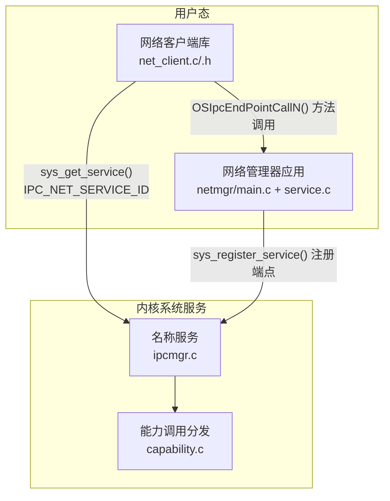
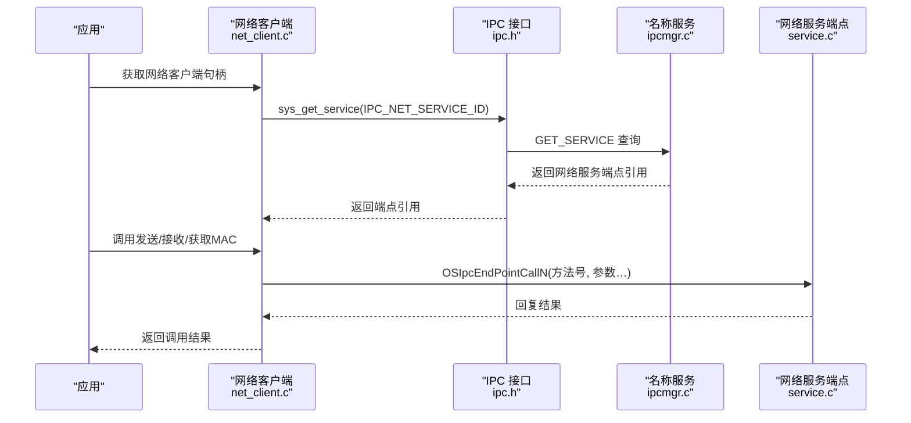
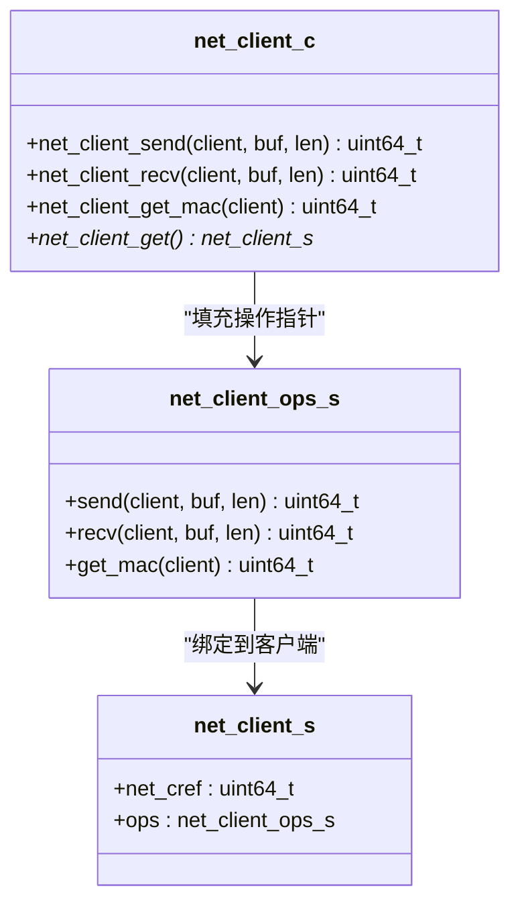
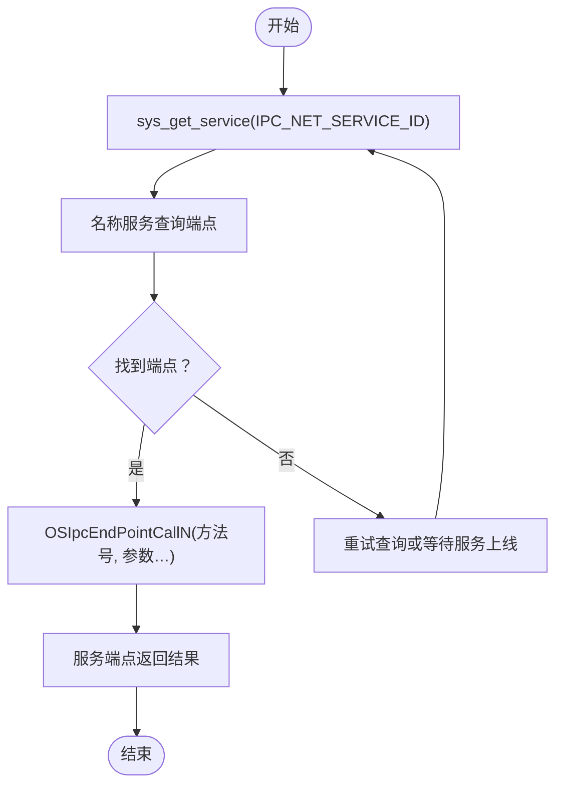
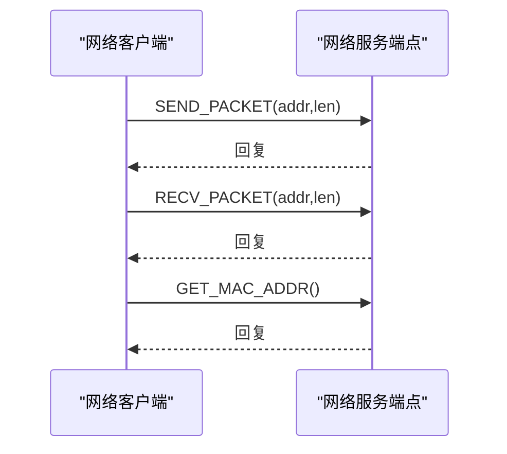

# 网络通信客户端API

<cite>
**本文引用的文件**
- [ulibs/include/libsystem/net_client.h](file://ulibs/include/libsystem/net_client.h)
- [ulibs/libsystem/net_client.c](file://ulibs/libsystem/net_client.c)
- [ulibs/include/libsystem/ipc.h](file://ulibs/include/libsystem/ipc.h)
- [uapps/netmgr/service.c](file://uapps/netmgr/service.c)
- [uapps/netmgr/main.c](file://uapps/netmgr/main.c)
- [ulibs/include/libkernel/capcall.h](file://ulibs/include/libkernel/capcall.h)
- [kernel/systemd/ipcmgr/ipcmgr.c](file://kernel/systemd/ipcmgr/ipcmgr.c)
- [kernel/capability/capability.c](file://kernel/capability/capability.c)
- [README.md](file://README.md)
</cite>

## 目录
1. [简介](#简介)
2. [项目结构](#项目结构)
3. [核心组件](#核心组件)
4. [架构总览](#架构总览)
5. [详细组件分析](#详细组件分析)
6. [依赖关系分析](#依赖关系分析)
7. [性能考虑](#性能考虑)
8. [故障排查指南](#故障排查指南)
9. [结论](#结论)
10. [附录](#附录)

## 简介
本文件为 TranquilOS 网络通信客户端 API 的权威使用文档。当前仓库中已实现网络客户端与网络服务端点的基本框架：用户态网络客户端通过 IPC 调用访问网络服务，网络服务在内核系统服务（systemd）中注册并响应方法调用。本文档面向开发者与集成工程师，系统性说明以下内容：
- 套接字操作与数据传输接口（发送/接收）
- 协议支持现状与扩展建议
- 连接管理与服务发现机制
- 地址解析、DNS 查询与路由管理的可用性与扩展路径
- 网络接口配置、流量控制与 QoS 设置的当前状态与建议
- 网络事件处理、异步 I/O 与连接池管理的现状与最佳实践
- 网络安全、加密通信与防火墙配置的接口现状与建议
- 性能优化、故障诊断与安全防护的最佳实践

## 项目结构
TranquilOS 的网络子系统由“用户态网络客户端库”、“系统服务注册与发现”以及“内核 IPC 名称服务”三部分组成：
- 用户态网络客户端库：提供统一的网络客户端接口，封装 IPC 调用。
- 系统服务：网络管理器作为独立用户态进程，注册网络服务端点。
- 内核系统服务：名称服务负责服务注册与查询，IPC 端点负责方法分发。

**图表来源**
- [ulibs/libsystem/net_client.c](file://ulibs/libsystem/net_client.c#L1-L33)
- [ulibs/include/libsystem/ipc.h](file://ulibs/include/libsystem/ipc.h#L11-L70)
- [uapps/netmgr/service.c](file://uapps/netmgr/service.c#L1-L29)
- [kernel/systemd/ipcmgr/ipcmgr.c](file://kernel/systemd/ipcmgr/ipcmgr.c#L237-L287)
- [kernel/capability/capability.c](file://kernel/capability/capability.c#L14-L58)

**章节来源**
- [ulibs/include/libsystem/net_client.h](file://ulibs/include/libsystem/net_client.h#L1-L31)
- [ulibs/libsystem/net_client.c](file://ulibs/libsystem/net_client.c#L1-L33)
- [ulibs/include/libsystem/ipc.h](file://ulibs/include/libsystem/ipc.h#L1-L73)
- [uapps/netmgr/main.c](file://uapps/netmgr/main.c#L1-L20)
- [uapps/netmgr/service.c](file://uapps/netmgr/service.c#L1-L29)
- [kernel/systemd/ipcmgr/ipcmgr.c](file://kernel/systemd/ipcmgr/ipcmgr.c#L237-L287)
- [kernel/capability/capability.c](file://kernel/capability/capability.c#L14-L58)

## 核心组件
- 网络客户端结构体与操作集
  - 客户端结构体包含服务引用与操作函数指针，封装发送、接收与获取 MAC 地址等操作。
  - 操作函数通过 IPC 端点调用完成具体功能。
- IPC 服务 ID 与方法枚举
  - 定义了网络服务 ID 与方法号，用于服务发现与方法分发。
- 网络服务端点
  - 网络管理器注册网络服务端点，根据方法号执行相应逻辑，并进行回复。

**章节来源**
- [ulibs/include/libsystem/net_client.h](file://ulibs/include/libsystem/net_client.h#L7-L30)
- [ulibs/libsystem/net_client.c](file://ulibs/libsystem/net_client.c#L5-L32)
- [ulibs/include/libsystem/ipc.h](file://ulibs/include/libsystem/ipc.h#L11-L17)
- [uapps/netmgr/service.c](file://uapps/netmgr/service.c#L6-L22)

## 架构总览
下图展示了从用户态网络客户端到内核系统服务的整体调用链路与职责划分。

**图表来源**
- [ulibs/libsystem/net_client.c](file://ulibs/libsystem/net_client.c#L19-L32)
- [ulibs/include/libsystem/ipc.h](file://ulibs/include/libsystem/ipc.h#L61-L70)
- [kernel/systemd/ipcmgr/ipcmgr.c](file://kernel/systemd/ipcmgr/ipcmgr.c#L237-L287)
- [uapps/netmgr/service.c](file://uapps/netmgr/service.c#L6-L22)

## 详细组件分析

### 组件一：网络客户端库
- 结构体与操作
  - 客户端结构体包含服务引用与操作函数指针，分别指向发送、接收与获取 MAC 的实现。
  - 发送与接收函数通过 IPC 端点调用传递缓冲区地址与长度。
- 初始化流程
  - 首次调用时通过名称服务查询网络服务端点引用，并填充操作函数指针。
  - 后续调用直接复用已缓存的引用，避免重复查询。

**图表来源**
- [ulibs/include/libsystem/net_client.h](file://ulibs/include/libsystem/net_client.h#L17-L26)
- [ulibs/libsystem/net_client.c](file://ulibs/libsystem/net_client.c#L7-L32)

**章节来源**
- [ulibs/include/libsystem/net_client.h](file://ulibs/include/libsystem/net_client.h#L13-L30)
- [ulibs/libsystem/net_client.c](file://ulibs/libsystem/net_client.c#L5-L32)

### 组件二：IPC 服务发现与方法调用
- 服务 ID 与方法枚举
  - 定义网络服务 ID 与方法号，便于统一识别与分发。
- 服务注册与查询
  - 应用通过名称服务注册自身为网络服务端点；客户端通过名称服务查询网络服务端点引用。
- 能力调用与端点分发
  - 内核侧根据能力类型与方法号进行分发，最终调用到网络服务端点。

**图表来源**
- [ulibs/include/libsystem/ipc.h](file://ulibs/include/libsystem/ipc.h#L61-L70)
- [kernel/systemd/ipcmgr/ipcmgr.c](file://kernel/systemd/ipcmgr/ipcmgr.c#L237-L287)

**章节来源**
- [ulibs/include/libsystem/ipc.h](file://ulibs/include/libsystem/ipc.h#L11-L17)
- [ulibs/include/libsystem/ipc.h](file://ulibs/include/libsystem/ipc.h#L53-L70)
- [kernel/systemd/ipcmgr/ipcmgr.c](file://kernel/systemd/ipcmgr/ipcmgr.c#L237-L287)
- [kernel/capability/capability.c](file://kernel/capability/capability.c#L14-L58)

### 组件三：网络服务端点
- 端点入口
  - 根据方法号执行对应逻辑（发送包、接收包、获取 MAC），并在默认情况下进行回复。
- 服务注册
  - 网络管理器在启动时注册网络服务端点，使其可被客户端通过名称服务发现。

**图表来源**
- [uapps/netmgr/service.c](file://uapps/netmgr/service.c#L6-L22)

**章节来源**
- [uapps/netmgr/service.c](file://uapps/netmgr/service.c#L6-L22)

## 依赖关系分析
- 客户端对 IPC 的依赖
  - 客户端通过名称服务获取网络服务端点引用，并通过端点调用完成方法分发。
- 端点对内核能力系统的依赖
  - 内核侧根据能力类型与方法号进行分发，最终调用到用户态服务端点。
- 服务注册与发现
  - 名称服务负责维护服务 ID 到端点的映射，提供注册与查询能力。

**图表来源**
- [ulibs/libsystem/net_client.c](file://ulibs/libsystem/net_client.c#L19-L32)
- [ulibs/include/libsystem/ipc.h](file://ulibs/include/libsystem/ipc.h#L53-L70)
- [kernel/systemd/ipcmgr/ipcmgr.c](file://kernel/systemd/ipcmgr/ipcmgr.c#L237-L287)
- [kernel/capability/capability.c](file://kernel/capability/capability.c#L14-L58)
- [uapps/netmgr/service.c](file://uapps/netmgr/service.c#L24-L28)

**章节来源**
- [ulibs/libsystem/net_client.c](file://ulibs/libsystem/net_client.c#L19-L32)
- [ulibs/include/libsystem/ipc.h](file://ulibs/include/libsystem/ipc.h#L53-L70)
- [kernel/systemd/ipcmgr/ipcmgr.c](file://kernel/systemd/ipcmgr/ipcmgr.c#L237-L287)
- [kernel/capability/capability.c](file://kernel/capability/capability.c#L14-L58)
- [uapps/netmgr/service.c](file://uapps/netmgr/service.c#L24-L28)

## 性能考虑
- IPC 调用开销
  - 当前客户端通过 IPC 端点调用网络服务，存在上下文切换与能力分发开销。建议在高频场景下采用批量传输与共享内存策略（见“附录：共享内存与批量传输”）。
- 服务发现重试
  - 客户端在服务未就绪时会进行重试，建议在网络管理器启动后延迟初始化客户端，减少不必要的重试。
- 端点负载
  - 网络服务端点应尽量保持轻量逻辑，避免阻塞；耗时操作可异步化或委托给专用线程池。

[本节为通用性能建议，不直接分析具体文件]

## 故障排查指南
- 服务未发现
  - 现象：sys_get_service 返回无效引用或持续重试。
  - 排查：确认网络管理器是否已注册网络服务端点；检查名称服务日志与服务 ID 是否一致。
- 方法调用失败
  - 现象：端点收到未知方法号或调用无响应。
  - 排查：核对方法号定义与客户端调用是否匹配；检查端点入口逻辑与回复路径。
- 能力分发异常
  - 现象：内核侧无法识别能力类型或方法号。
  - 排查：核对能力类型与方法号编码规则；确保端点入口正确设置返回值。

**章节来源**
- [ulibs/include/libsystem/ipc.h](file://ulibs/include/libsystem/ipc.h#L61-L70)
- [uapps/netmgr/service.c](file://uapps/netmgr/service.c#L17-L20)
- [kernel/capability/capability.c](file://kernel/capability/capability.c#L14-L58)

## 结论
当前仓库实现了网络客户端与网络服务端点的基础框架，具备服务发现、方法分发与基本数据传输能力。对于更复杂的网络功能（如 DNS、路由、QoS、加密与防火墙），需要在现有 IPC 基础上扩展服务端点与客户端接口。建议优先实现共享内存与批量传输以降低 IPC 开销，并在服务端点中引入异步 I/O 与连接池管理以提升吞吐与稳定性。

[本节为总结性内容，不直接分析具体文件]

## 附录

### A. 网络客户端 API 使用说明
- 获取网络客户端实例
  - 调用获取函数以获得全局网络客户端实例；首次调用会自动查询网络服务端点引用并缓存。
- 发送与接收数据
  - 传入缓冲区地址与长度，底层通过 IPC 端点调用网络服务端点执行发送/接收。
- 获取 MAC 地址
  - 通过端点调用获取网络接口的 MAC 地址。

**章节来源**
- [ulibs/libsystem/net_client.c](file://ulibs/libsystem/net_client.c#L19-L32)
- [ulibs/include/libsystem/net_client.h](file://ulibs/include/libsystem/net_client.h#L7-L11)
- [ulibs/include/libsystem/net_client.h](file://ulibs/include/libsystem/net_client.h#L17-L21)

### B. 协议支持与扩展建议
- 当前支持
  - 已定义网络服务 ID 与发送/接收/获取 MAC 方法号，满足基础数据面需求。
- 扩展建议
  - 新增 TCP/UDP 套接字方法：bind、connect、listen、accept、close 等。
  - 新增地址解析与路由管理方法：getaddrinfo、route add/del 等。
  - 新增流量控制与 QoS 方法：setsockopt/getsockopt 对应参数。
  - 新增安全与加密方法：TLS 握手、证书校验、防火墙规则等。

**章节来源**
- [ulibs/include/libsystem/ipc.h](file://ulibs/include/libsystem/ipc.h#L11-L17)
- [ulibs/include/libsystem/net_client.h](file://ulibs/include/libsystem/net_client.h#L7-L11)

### C. 网络事件处理、异步 I/O 与连接池
- 异步 I/O
  - 建议在网络服务端点中引入事件队列与回调机制，将阻塞操作异步化。
- 连接池
  - 在服务端点中维护连接对象池，按需分配与回收，减少频繁创建销毁带来的开销。
- 端点线程模型
  - 可采用多线程端点模型，将不同类型的请求分派至不同工作线程，提高并发处理能力。

[本节为概念性建议，不直接分析具体文件]

### D. 网络安全、加密通信与防火墙
- 加密通信
  - 建议新增 TLS 握手与加解密方法，结合内核安全模块实现密钥管理与硬件加速。
- 防火墙
  - 新增防火墙规则管理方法：添加、删除、查询规则；支持基于 IP、端口、协议的过滤。
- 访问控制
  - 结合能力系统与权限检查，限制应用对网络服务的访问范围。

[本节为概念性建议，不直接分析具体文件]

### E. 共享内存与批量传输
- 共享内存
  - 通过内存管理器分配共享内存区域，客户端与服务端共享同一段物理内存，减少拷贝。
- 批量传输
  - 将多个小包合并为大块传输，降低 IPC 调用次数与系统调用开销。
- 注意事项
  - 需要严格的边界与长度校验，避免越界访问；在服务端点中实现内存映射与释放逻辑。

**章节来源**
- [ulibs/include/libkernel/capcall.h](file://ulibs/include/libkernel/capcall.h#L13-L107)

### F. 实际使用示例（步骤说明）
- 步骤 1：启动网络管理器
  - 启动网络管理器应用，注册网络服务端点。
- 步骤 2：获取网络客户端
  - 调用获取函数，内部通过名称服务查询网络服务端点引用。
- 步骤 3：发送数据
  - 准备缓冲区与长度，调用发送函数，等待服务端点返回。
- 步骤 4：接收数据
  - 准备接收缓冲区与长度，调用接收函数，读取返回的数据长度。
- 步骤 5：获取 MAC
  - 调用获取 MAC 地址函数，读取返回的 MAC 值。

**章节来源**
- [uapps/netmgr/main.c](file://uapps/netmgr/main.c#L7-L19)
- [uapps/netmgr/service.c](file://uapps/netmgr/service.c#L24-L28)
- [ulibs/libsystem/net_client.c](file://ulibs/libsystem/net_client.c#L19-L32)

### G. 项目背景与现状
- 项目目标
  - 提供微内核架构下的 AI-OS，支持多进程、多线程、IPC、能力系统与虚拟化等特性。
- 网络模块现状
  - 网络管理器作为用户态服务存在，但网络功能尚未完全实现；当前仓库仅包含网络客户端与服务端点框架。

**章节来源**
- [README.md](file://README.md#L1-L42)