# 设备管理客户端API

<cite>
**本文引用的文件**
- [uapps/devmgr/devmgr.c](file://uapps/devmgr/devmgr.c)
- [uapps/devmgr/include/devmgr.h](file://uapps/devmgr/include/devmgr.h)
- [uapps/devmgr/main.c](file://uapps/devmgr/main.c)
- [uapps/devmgr/service.c](file://uapps/devmgr/service.c)
- [uapps/devmgr/include/service.h](file://uapps/devmgr/include/service.h)
- [ulibs/libsystem/devmgr_client.c](file://ulibs/libsystem/devmgr_client.c)
- [ulibs/include/libsystem/devmgr_client.h](file://ulibs/include/libsystem/devmgr_client.h)
- [kernel/device/device_tree.c](file://kernel/device/device_tree.c)
- [kernel/include/device/device_tree.h](file://kernel/include/device/device_tree.h)
- [kernel/include/device/device.h](file://kernel/include/device/device.h)
- [kernel/interrupt/irq_mgr.c](file://kernel/interrupt/irq_mgr.c)
- [kernel/include/interrupt/irq_mgr.h](file://kernel/include/interrupt/irq_mgr.h)
- [boot/include/power_manager.h](file://boot/include/power_manager.h)
- [kernel/power_manager.c](file://kernel/power_manager.c)
- [kernel/drivers/arm-psci/psci.c](file://kernel/drivers/arm-psci/psci.c)
- [kernel/syscall/syscall.c](file://kernel/syscall/syscall.c)
- [kernel/include/syscall/syscall.h](file://kernel/include/syscall/syscall.h)
- [kernel/module/module.c](file://kernel/module/module.c)
- [kernel/include/initcall.h](file://kernel/include/initcall.h)
- [uapps/devmgr/drivers/rpi/rpi-gpio/bcm2711_gpio.c](file://uapps/devmgr/drivers/rpi/rpi-gpio/bcm2711_gpio.c)
- [uapps/devmgr/drivers/rpi/rpi-gpio/bcm2711_gpio.h](file://uapps/devmgr/drivers/rpi/rpi-gpio/bcm2711_gpio.h)
- [boot/drivers/rpi/bcm2711-gpio/bcm2711_gpio.c](file://boot/drivers/rpi/bcm2711-gpio/bcm2711_gpio.c)
- [boot/drivers/rpi/bcm2711-gpio/bcm2711_gpio.h](file://boot/drivers/rpi/bcm2711-gpio/bcm2711_gpio.h)
- [boot/drivers/rpi/bcm2835-aux-uart/bcm2835_aux.h](file://boot/drivers/rpi/bcm2835-aux-uart/bcm2835_aux.h)
- [uapps/devmgr/include/log.h](file://uapps/devmgr/include/log.h)
</cite>

## 目录
1. [简介](#简介)
2. [项目结构](#项目结构)
3. [核心组件](#核心组件)
4. [架构总览](#架构总览)
5. [详细组件分析](#详细组件分析)
6. [依赖关系分析](#依赖关系分析)
7. [性能考量](#性能考量)
8. [故障排除指南](#故障排除指南)
9. [结论](#结论)
10. [附录](#附录)

## 简介
本文件面向TranquilOS设备管理客户端API，提供从设备发现、驱动注册与探测、设备树解析、资源分配到GPIO控制、显示帧缓冲提交、服务端IPC交互的完整使用说明。同时覆盖电源管理（PSCI）集成、中断处理框架、模块化初始化流程以及客户端权限与安全访问要点。文档以“自顶向下”的方式组织，先给出高层架构与调用流程，再深入到具体实现细节与最佳实践。

## 项目结构
TranquilOS在内核态与用户态分别提供设备树解析、设备注册、服务端IPC与客户端封装，形成“内核设备子系统—设备管理器服务—用户态客户端”的分层结构。关键目录与职责如下：
- 内核设备子系统：设备树解析、设备注册、中断管理、电源管理（PSCI）
- 用户态设备管理器（devmgr）：服务注册、显示帧缓冲提交、设备驱动初始化入口
- 用户态客户端库（libsystem/devmgr_client）：对devmgr服务的轻量封装，提供IPC调用

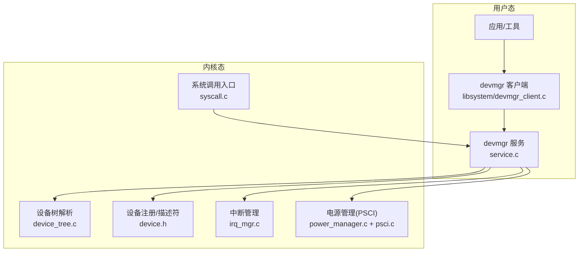

图表来源
- [uapps/devmgr/service.c](file://uapps/devmgr/service.c#L42-L72)
- [ulibs/libsystem/devmgr_client.c](file://ulibs/libsystem/devmgr_client.c#L1-L25)
- [kernel/device/device_tree.c](file://kernel/device/device_tree.c#L10-L23)
- [kernel/include/device/device.h](file://kernel/include/device/device.h#L18-L36)
- [kernel/interrupt/irq_mgr.c](file://kernel/interrupt/irq_mgr.c#L135-L142)
- [kernel/power_manager.c](file://kernel/power_manager.c#L6-L21)
- [kernel/drivers/arm-psci/psci.c](file://kernel/drivers/arm-psci/psci.c#L188-L222)
- [kernel/syscall/syscall.c](file://kernel/syscall/syscall.c#L8-L20)

章节来源
- [uapps/devmgr/devmgr.c](file://uapps/devmgr/devmgr.c#L10-L62)
- [uapps/devmgr/main.c](file://uapps/devmgr/main.c#L6-L17)
- [uapps/devmgr/service.c](file://uapps/devmgr/service.c#L42-L72)
- [ulibs/libsystem/devmgr_client.c](file://ulibs/libsystem/devmgr_client.c#L1-L25)
- [kernel/device/device_tree.c](file://kernel/device/device_tree.c#L10-L95)
- [kernel/include/device/device.h](file://kernel/include/device/device.h#L18-L36)
- [kernel/interrupt/irq_mgr.c](file://kernel/interrupt/irq_mgr.c#L135-L142)
- [kernel/power_manager.c](file://kernel/power_manager.c#L6-L21)
- [kernel/drivers/arm-psci/psci.c](file://kernel/drivers/arm-psci/psci.c#L188-L222)
- [kernel/syscall/syscall.c](file://kernel/syscall/syscall.c#L8-L20)

## 核心组件
- 设备树解析与遍历：提供按兼容字符串、设备类型查找节点，属性读取，节点迭代等能力
- 设备注册与探测：通过设备描述符与probe函数完成设备发现与初始化
- 中断管理：本地中断管理器注册设备与IRQ、处理中断并调度上下文切换
- 电源管理（PSCI）：注册电源管理器，提供CPU开关机、挂起等能力
- 设备管理器服务：提供帧缓冲获取/提交、共享内存表面提交、CPIO地址查询等服务
- 客户端API：封装IPC调用，暴露简洁的API供上层应用使用

章节来源
- [kernel/device/device_tree.c](file://kernel/device/device_tree.c#L25-L95)
- [kernel/include/device/device.h](file://kernel/include/device/device.h#L18-L36)
- [kernel/interrupt/irq_mgr.c](file://kernel/interrupt/irq_mgr.c#L13-L83)
- [boot/include/power_manager.h](file://boot/include/power_manager.h#L38-L72)
- [kernel/power_manager.c](file://kernel/power_manager.c#L6-L21)
- [uapps/devmgr/service.c](file://uapps/devmgr/service.c#L42-L72)
- [ulibs/libsystem/devmgr_client.c](file://ulibs/libsystem/devmgr_client.c#L1-L25)

## 架构总览
下图展示从应用到内核的关键调用链路：应用通过客户端API发起请求，经由系统调用进入内核，服务端在devmgr中处理并可能访问设备树、设备或显示管理器。

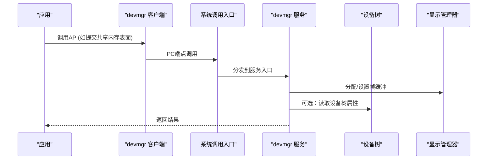

图表来源
- [ulibs/libsystem/devmgr_client.c](file://ulibs/libsystem/devmgr_client.c#L5-L11)
- [kernel/syscall/syscall.c](file://kernel/syscall/syscall.c#L8-L20)
- [uapps/devmgr/service.c](file://uapps/devmgr/service.c#L42-L72)
- [kernel/device/device_tree.c](file://kernel/device/device_tree.c#L53-L60)

章节来源
- [ulibs/libsystem/devmgr_client.c](file://ulibs/libsystem/devmgr_client.c#L1-L25)
- [kernel/syscall/syscall.c](file://kernel/syscall/syscall.c#L8-L20)
- [uapps/devmgr/service.c](file://uapps/devmgr/service.c#L42-L72)

## 详细组件分析

### 设备树解析与资源分配
- 初始化：内核启动时传入DTB物理地址，初始化设备树解析器
- 查找节点：支持按兼容字符串、设备类型查找；支持属性读取
- 迭代：可对节点进行全量或按类型迭代
- 地址获取：从节点字符串中解析基地址（十六进制）

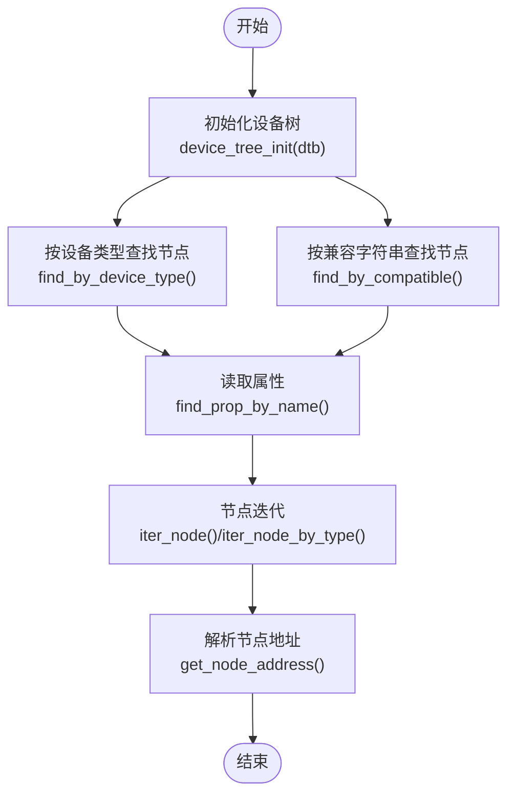

图表来源
- [kernel/device/device_tree.c](file://kernel/device/device_tree.c#L10-L95)
- [kernel/include/device/device_tree.h](file://kernel/include/device/device_tree.h#L12-L22)

章节来源
- [kernel/device/device_tree.c](file://kernel/device/device_tree.c#L10-L95)
- [kernel/include/device/device_tree.h](file://kernel/include/device/device_tree.h#L12-L22)

### 设备注册与驱动探测
- 设备描述符：包含兼容字符串与探测回调
- 注册流程：devmgr根据DTB中的兼容字符串定位节点，调用对应驱动的探测函数
- 初始化宏：通过宏将驱动初始化函数放入特定段，在系统启动时统一执行

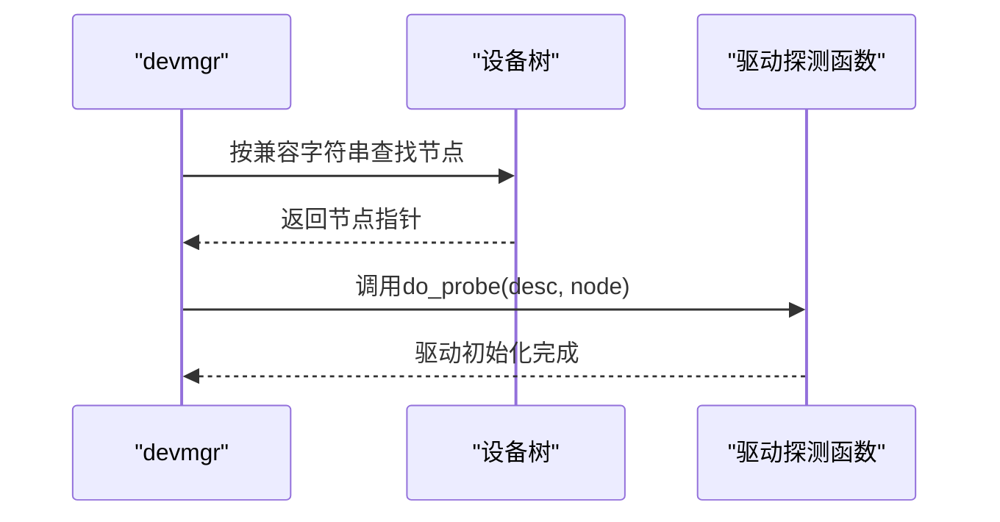

图表来源
- [uapps/devmgr/devmgr.c](file://uapps/devmgr/devmgr.c#L33-L55)
- [uapps/devmgr/include/devmgr.h](file://uapps/devmgr/include/devmgr.h#L17-L20)
- [kernel/include/device/device.h](file://kernel/include/device/device.h#L18-L22)

章节来源
- [uapps/devmgr/devmgr.c](file://uapps/devmgr/devmgr.c#L10-L62)
- [uapps/devmgr/include/devmgr.h](file://uapps/devmgr/include/devmgr.h#L7-L30)
- [kernel/include/device/device.h](file://kernel/include/device/device.h#L18-L36)

### GPIO控制与UART引脚复用
- 引脚功能选择：通过GPFSEL寄存器按引脚号计算寄存器索引与位偏移，写入ALT功能值
- UART引脚配置：将TX/RX引脚设置为指定ALT功能，用于串口通信
- 驱动示例：Raspberry Pi BCM2711 GPIO驱动演示了探测与引脚复用流程

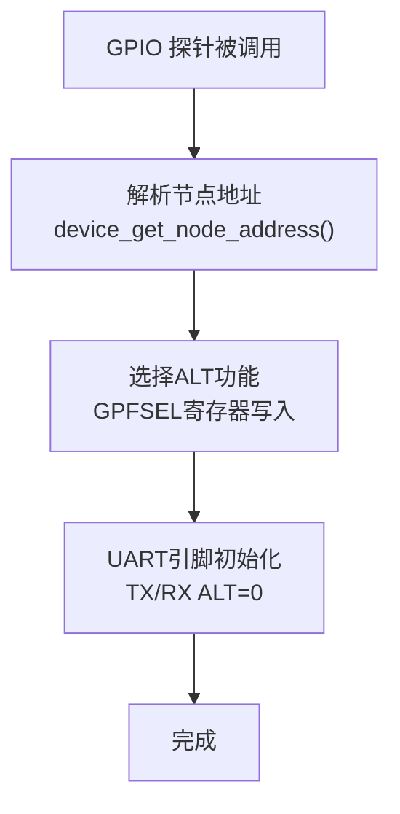

图表来源
- [uapps/devmgr/drivers/rpi/rpi-gpio/bcm2711_gpio.c](file://uapps/devmgr/drivers/rpi/rpi-gpio/bcm2711_gpio.c#L44-L53)
- [uapps/devmgr/drivers/rpi/rpi-gpio/bcm2711_gpio.h](file://uapps/devmgr/drivers/rpi/rpi-gpio/bcm2711_gpio.h#L1-L23)
- [boot/drivers/rpi/bcm2711-gpio/bcm2711_gpio.c](file://boot/drivers/rpi/bcm2711-gpio/bcm2711_gpio.c#L9-L47)
- [boot/drivers/rpi/bcm2711-gpio/bcm2711_gpio.h](file://boot/drivers/rpi/bcm2711-gpio/bcm2711_gpio.h#L1-L23)

章节来源
- [uapps/devmgr/drivers/rpi/rpi-gpio/bcm2711_gpio.c](file://uapps/devmgr/drivers/rpi/rpi-gpio/bcm2711_gpio.c#L1-L63)
- [boot/drivers/rpi/bcm2711-gpio/bcm2711_gpio.c](file://boot/drivers/rpi/bcm2711-gpio/bcm2711_gpio.c#L1-L56)
- [boot/drivers/rpi/bcm2835-aux-uart/bcm2835_aux.h](file://boot/drivers/rpi/bcm2835-aux-uart/bcm2835_aux.h#L7-L31)

### 显示帧缓冲与共享内存提交
- 服务端处理：接收共享内存地址，向显示管理器申请帧缓冲，拷贝数据后设置为当前帧缓冲
- 客户端API：提供提交共享内存表面与获取CPIO地址的封装

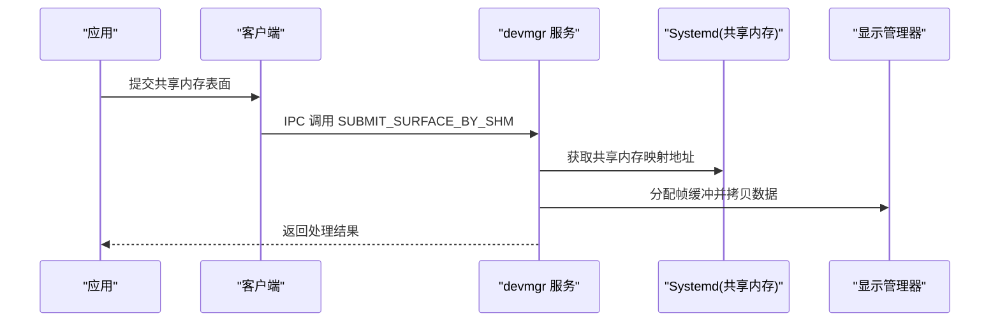

图表来源
- [ulibs/libsystem/devmgr_client.c](file://ulibs/libsystem/devmgr_client.c#L5-L11)
- [uapps/devmgr/service.c](file://uapps/devmgr/service.c#L10-L40)

章节来源
- [ulibs/libsystem/devmgr_client.c](file://ulibs/libsystem/devmgr_client.c#L1-L25)
- [uapps/devmgr/service.c](file://uapps/devmgr/service.c#L10-L40)

### 中断处理框架
- 本地中断管理器：为每个CPU核心维护本地管理器，注册IRQ设备与处理函数
- 中断处理流程：ACK -> 查找IRQ项 -> 调用处理函数 -> EOI -> 调度切换
- 设备注册：支持注册IRQ设备与IRQ列表

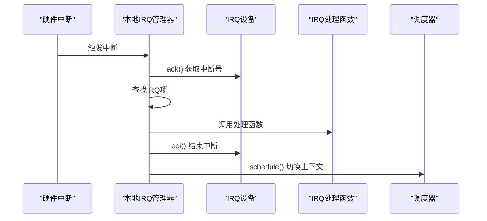

图表来源
- [kernel/interrupt/irq_mgr.c](file://kernel/interrupt/irq_mgr.c#L49-L83)
- [kernel/include/interrupt/irq_mgr.h](file://kernel/include/interrupt/irq_mgr.h)

章节来源
- [kernel/interrupt/irq_mgr.c](file://kernel/interrupt/irq_mgr.c#L13-L142)

### 电源管理（PSCI）集成
- 电源管理器注册：内核在设备探测阶段注册PSCI为电源管理器
- CPU控制：提供CPU开关机、默认挂起、系统挂起等操作
- 客户端调用：通过统一接口调用目标CPU的电源操作

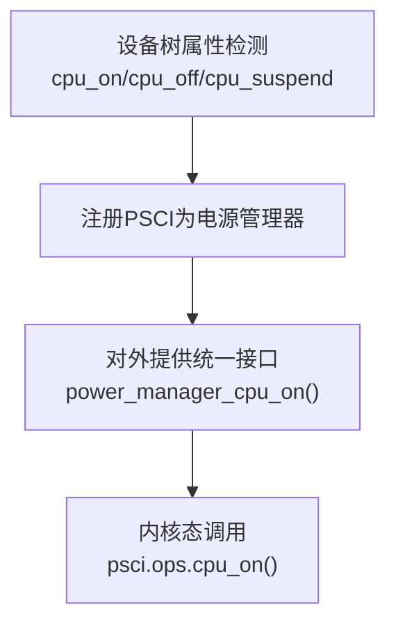

图表来源
- [kernel/drivers/arm-psci/psci.c](file://kernel/drivers/arm-psci/psci.c#L188-L222)
- [kernel/power_manager.c](file://kernel/power_manager.c#L6-L21)
- [boot/include/power_manager.h](file://boot/include/power_manager.h#L38-L72)

章节来源
- [kernel/drivers/arm-psci/psci.c](file://kernel/drivers/arm-psci/psci.c#L188-L222)
- [kernel/power_manager.c](file://kernel/power_manager.c#L6-L21)
- [boot/include/power_manager.h](file://boot/include/power_manager.h#L38-L72)

### 模块化初始化与驱动加载
- 初始化层次：早期设备、关键设备、普通设备等不同阶段
- 驱动注册：通过宏将驱动初始化函数放入特定段，系统启动时统一执行
- 模块初始化：模块级初始化与每CPU初始化

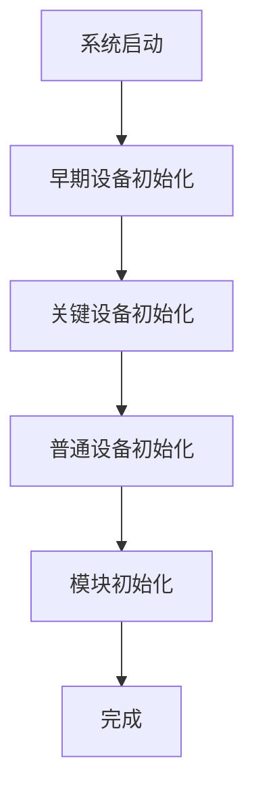

图表来源
- [kernel/include/initcall.h](file://kernel/include/initcall.h#L7-L34)
- [kernel/module/module.c](file://kernel/module/module.c#L8-L18)
- [uapps/devmgr/devmgr.c](file://uapps/devmgr/devmgr.c#L57-L62)

章节来源
- [kernel/include/initcall.h](file://kernel/include/initcall.h#L7-L44)
- [kernel/module/module.c](file://kernel/module/module.c#L1-L18)
- [uapps/devmgr/devmgr.c](file://uapps/devmgr/devmgr.c#L57-L62)

### 客户端API与服务端接口
- 客户端API：封装IPC端点调用，提供提交共享内存表面、获取CPIO地址等方法
- 服务端接口：注册服务端点，根据方法号分发处理，返回结果

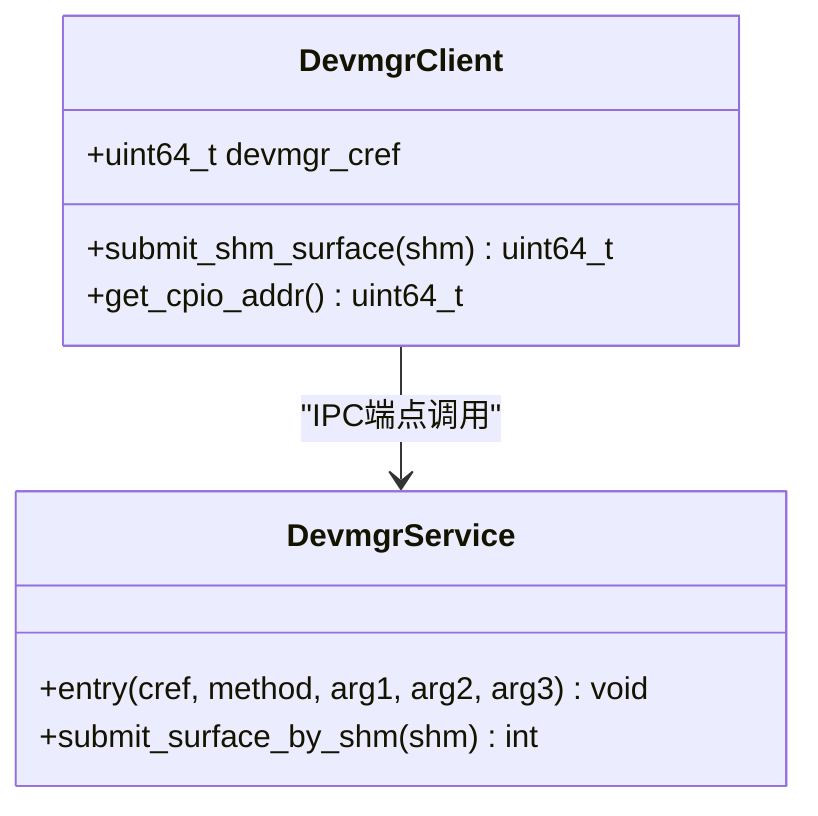

图表来源
- [ulibs/include/libsystem/devmgr_client.h](file://ulibs/include/libsystem/devmgr_client.h#L29-L42)
- [ulibs/libsystem/devmgr_client.c](file://ulibs/libsystem/devmgr_client.c#L5-L11)
- [uapps/devmgr/service.c](file://uapps/devmgr/service.c#L42-L72)

章节来源
- [ulibs/include/libsystem/devmgr_client.h](file://ulibs/include/libsystem/devmgr_client.h#L7-L43)
- [ulibs/libsystem/devmgr_client.c](file://ulibs/libsystem/devmgr_client.c#L1-L25)
- [uapps/devmgr/service.c](file://uapps/devmgr/service.c#L42-L72)

## 依赖关系分析
- 设备树解析依赖libfdt库，提供节点查找、属性读取与迭代
- 设备注册依赖初始化层次机制，确保驱动在正确时机被加载
- 服务端依赖显示管理器与共享内存服务，实现帧缓冲提交
- 客户端依赖IPC与系统服务发现机制

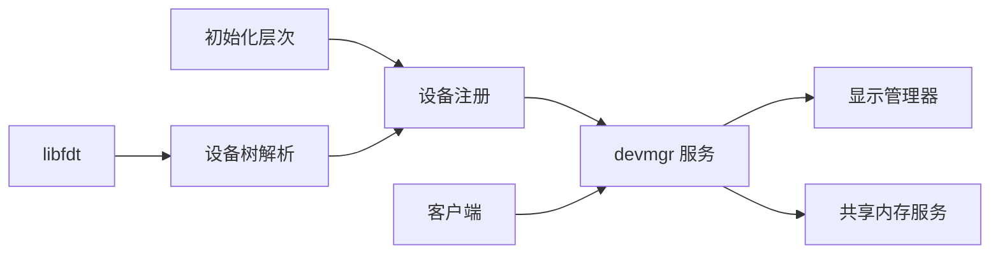

图表来源
- [kernel/device/device_tree.c](file://kernel/device/device_tree.c#L10-L23)
- [kernel/include/initcall.h](file://kernel/include/initcall.h#L26-L34)
- [uapps/devmgr/service.c](file://uapps/devmgr/service.c#L27-L40)
- [ulibs/libsystem/devmgr_client.c](file://ulibs/libsystem/devmgr_client.c#L17-L24)

章节来源
- [kernel/device/device_tree.c](file://kernel/device/device_tree.c#L10-L95)
- [kernel/include/initcall.h](file://kernel/include/initcall.h#L26-L44)
- [uapps/devmgr/service.c](file://uapps/devmgr/service.c#L27-L40)
- [ulibs/libsystem/devmgr_client.c](file://ulibs/libsystem/devmgr_client.c#L17-L24)

## 性能考量
- 设备树遍历与查找：建议按需查找，避免全量迭代；必要时缓存常用节点地址
- 帧缓冲拷贝：尽量减少大块内存拷贝次数，优先使用零拷贝或共享内存映射
- 中断处理：保持处理函数短小精悍，重工作移交至任务/队列
- 初始化顺序：合理安排早期与关键设备初始化，缩短冷启动时间

## 故障排除指南
- 设备树未找到或地址为0：检查DTB传递是否正确，确认设备树初始化调用
- 兼容字符串未匹配：核对设备树中compatible字符串与驱动一致
- 服务端无显示设备：确认显示管理器已初始化且设备已注册
- IPC调用失败：检查服务端点是否注册、客户端是否成功获取服务引用
- 权限与安全：确保通过系统调用与IPC端点进行受控访问，避免直接越权操作

章节来源
- [uapps/devmgr/devmgr.c](file://uapps/devmgr/devmgr.c#L11-L19)
- [uapps/devmgr/service.c](file://uapps/devmgr/service.c#L12-L19)
- [uapps/devmgr/include/log.h](file://uapps/devmgr/include/log.h#L11-L31)

## 结论
TranquilOS的设备管理客户端API围绕设备树、设备注册、服务端IPC与电源/中断框架构建，既保证了灵活性又维持了安全性。通过清晰的初始化层次与模块化设计，开发者可以快速扩展新设备驱动，并以统一的客户端API进行访问。建议在实际工程中遵循本文档的接口规范与最佳实践，确保系统的稳定性与可维护性。

## 附录

### API参考与参数说明
- 客户端API
  - 提交共享内存表面：devmgr_client_submit_shm_surface(client, shm)
    - 参数：client 客户端句柄；shm 共享内存地址
    - 返回：处理结果（整型）
  - 获取CPIO地址：devmgr_client_get_cpio_addr(client)
    - 返回：CPIO地址（整型）
- 服务端方法枚举
  - GET_FRAMEBUFFER：获取帧缓冲
  - SUBMIT_FRAMEBUFFER：提交帧缓冲
  - SUBMIT_SURFACE_BY_SHM：通过共享内存提交表面
  - GET_CPIO_ADDR：获取CPIO地址

章节来源
- [ulibs/include/libsystem/devmgr_client.h](file://ulibs/include/libsystem/devmgr_client.h#L7-L43)
- [ulibs/libsystem/devmgr_client.c](file://ulibs/libsystem/devmgr_client.c#L5-L11)
- [uapps/devmgr/service.c](file://uapps/devmgr/service.c#L42-L72)

### 错误码定义
- 统一返回值约定：非负表示成功，负值表示错误
- 常见错误场景：
  - 设备树未初始化或地址无效
  - 未找到兼容节点
  - 显示管理器未初始化或设备未注册
  - 共享内存映射失败

章节来源
- [uapps/devmgr/service.c](file://uapps/devmgr/service.c#L12-L25)
- [uapps/devmgr/devmgr.c](file://uapps/devmgr/devmgr.c#L11-L19)

### 实际使用示例（步骤说明）
- 设备发现与驱动加载
  - 在驱动中定义设备描述符并实现探测函数
  - 使用宏注册驱动初始化函数
  - 启动时由devmgr统一执行初始化
- GPIO控制
  - 在探测函数中解析节点地址
  - 设置引脚ALT功能，配置UART引脚
- 帧缓冲提交
  - 应用侧准备共享内存
  - 调用客户端API提交共享内存表面
  - 服务端分配帧缓冲并设置为当前显示

章节来源
- [uapps/devmgr/include/devmgr.h](file://uapps/devmgr/include/devmgr.h#L7-L30)
- [uapps/devmgr/devmgr.c](file://uapps/devmgr/devmgr.c#L57-L62)
- [uapps/devmgr/drivers/rpi/rpi-gpio/bcm2711_gpio.c](file://uapps/devmgr/drivers/rpi/rpi-gpio/bcm2711_gpio.c#L44-L53)
- [ulibs/libsystem/devmgr_client.c](file://ulibs/libsystem/devmgr_client.c#L5-L11)
- [uapps/devmgr/service.c](file://uapps/devmgr/service.c#L10-L40)