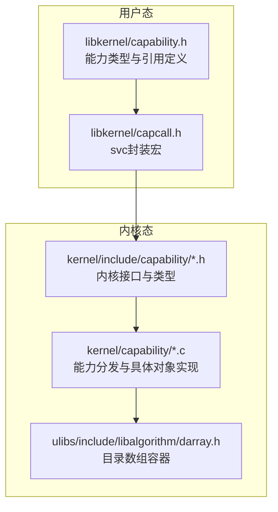
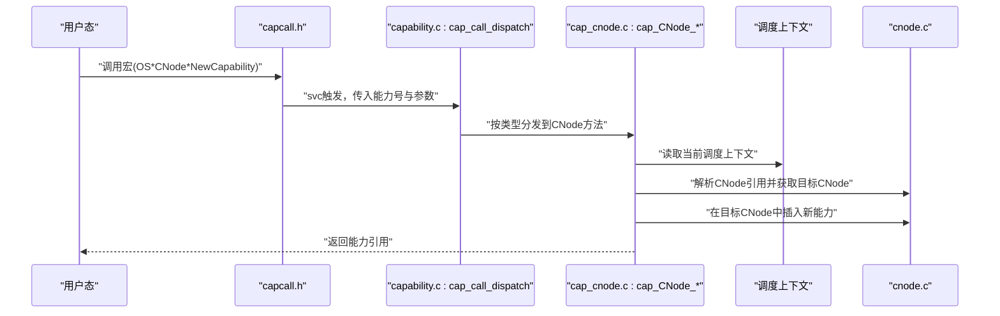
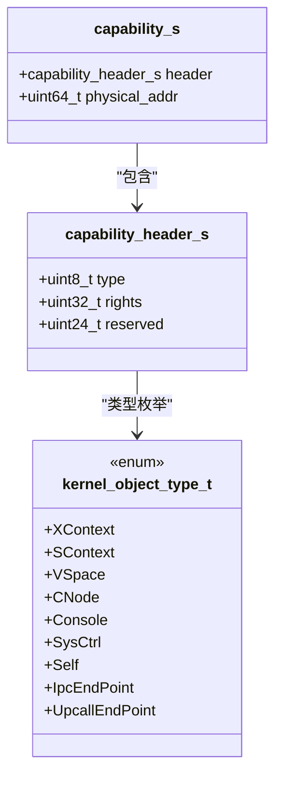
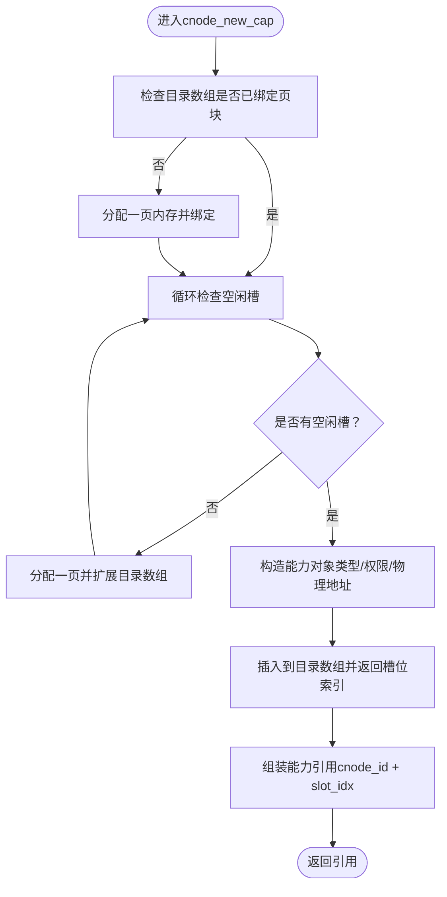
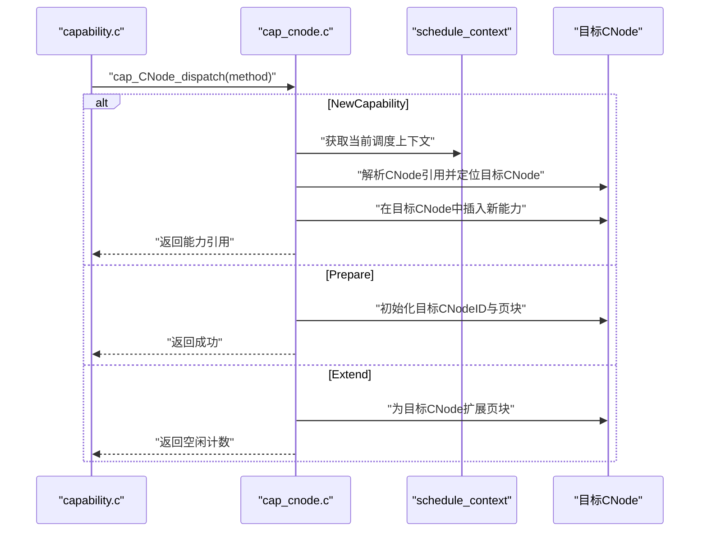

# Capability基础

<cite>
**本文档引用的文件**
- [capability.c](file://kernel/capability/capability.c)
- [capability.h](file://kernel/include/capability/capability.h)
- [cnode.c](file://kernel/capability/cnode.c)
- [cnode.h](file://kernel/include/capability/cnode.h)
- [cap_cnode.c](file://kernel/capability/cap_cnode.c)
- [cap_cnode.h](file://kernel/include/capability/cap_cnode.h)
- [capability.h（用户库）](file://ulibs/include/libkernel/capability.h)
- [darray.h](file://ulibs/include/libalgorithm/darray.h)
- [capcall.h](file://ulibs/include/libkernel/capcall.h)
- [cap_vspace.c](file://kernel/capability/cap_vspace.c)
- [cap_sysctrl.h](file://kernel/include/capability/cap_sysctrl.h)
- [cap_self.h](file://kernel/include/capability/cap_self.h)
</cite>

## 目录
1. [引言](#引言)
2. [项目结构](#项目结构)
3. [核心组件](#核心组件)
4. [架构总览](#架构总览)
5. [详细组件分析](#详细组件分析)
6. [依赖关系分析](#依赖关系分析)
7. [性能考量](#性能考量)
8. [故障排查指南](#故障排查指南)
9. [结论](#结论)
10. [附录：常见用法与最佳实践](#附录常见用法与最佳实践)

## 引言
本文件围绕TranquilOS的Capability基础概念展开，系统性阐述其核心原理、数据结构、存储容器、生命周期管理以及与传统权限系统的差异与安全优势。文档以代码为依据，结合图示帮助读者从宏观到微观全面理解Capability机制。

## 项目结构
TranquilOS的Capability体系由“内核接口头文件”、“内核实现模块”、“用户态能力引用与调用宏”、“通用目录数组容器”等部分组成，形成“用户态调用—内核分发—对象方法执行”的闭环。

图表来源
- [capability.h（用户库）](file://ulibs/include/libkernel/capability.h#L1-L141)
- [capcall.h](file://ulibs/include/libkernel/capcall.h#L1-L41)
- [capability.h](file://kernel/include/capability/capability.h#L1-L26)
- [capability.c](file://kernel/capability/capability.c#L1-L58)
- [cnode.h](file://kernel/include/capability/cnode.h#L1-L29)
- [cnode.c](file://kernel/capability/cnode.c#L1-L95)
- [darray.h](file://ulibs/include/libalgorithm/darray.h#L1-L64)

章节来源
- [capability.h（用户库）](file://ulibs/include/libkernel/capability.h#L1-L141)
- [capcall.h](file://ulibs/include/libkernel/capcall.h#L1-L41)
- [capability.h](file://kernel/include/capability/capability.h#L1-L26)
- [capability.c](file://kernel/capability/capability.c#L1-L58)
- [cnode.h](file://kernel/include/capability/cnode.h#L1-L29)
- [cnode.c](file://kernel/capability/cnode.c#L1-L95)
- [darray.h](file://ulibs/include/libalgorithm/darray.h#L1-L64)

## 核心组件
- 能力头与能力结构
  - 能力头包含类型标识与权限位；能力对象包含头与物理地址指针。
  - 权限位用于控制对对象方法的访问，支持全权限掩码常量。
- 能力节点（CNode）
  - 作为能力的存储容器，内部使用目录数组（多级索引）组织槽位。
  - 提供初始化、扩展页块、创建新能力、按引用获取能力、按引用定位目标CNode等能力。
- 能力分发器
  - 解析svc入口中的能力号，根据类型分发到对应对象的方法处理函数。
- 用户态调用封装
  - 通过宏将能力号与方法编码进寄存器，触发svc软中断完成调用。

章节来源
- [capability.h](file://kernel/include/capability/capability.h#L9-L21)
- [capability.c](file://kernel/capability/capability.c#L14-L58)
- [cnode.h](file://kernel/include/capability/cnode.h#L11-L14)
- [cnode.c](file://kernel/capability/cnode.c#L9-L21)
- [capability.h（用户库）](file://ulibs/include/libkernel/capability.h#L4-L50)
- [capcall.h](file://ulibs/include/libkernel/capcall.h#L13-L27)

## 架构总览
下图展示了从用户态发起能力调用到内核分发再到具体对象方法执行的流程。

图表来源
- [capcall.h](file://ulibs/include/libkernel/capcall.h#L15-L27)
- [capability.c](file://kernel/capability/capability.c#L14-L58)
- [cap_cnode.c](file://kernel/capability/cap_cnode.c#L23-L91)
- [cnode.c](file://kernel/capability/cnode.c#L66-L90)

## 详细组件分析

### 能力结构与字段语义
- 结构体布局
  - 头部：类型标识（8位）、权限位（32位）、保留位（24位），整体紧凑打包。
  - 能力对象：头部+物理地址指针，指向内核对象实例或CNode。
- 字段含义
  - 类型标识：区分XContext、SContext、VSpace、CNode、Console、SysCtrl、Self、IPC端点、上行回调端点等。
  - 权限位：控制可调用的方法集合；全权限掩码可用于测试或特权场景。
  - 物理地址：承载对象实例或容器的物理地址，便于内核直接访问。

图表来源
- [capability.h](file://kernel/include/capability/capability.h#L11-L20)
- [capability.h（用户库）](file://ulibs/include/libkernel/capability.h#L6-L18)

章节来源
- [capability.h](file://kernel/include/capability/capability.h#L9-L21)
- [capability.h（用户库）](file://ulibs/include/libkernel/capability.h#L6-L18)

### CNode（能力节点）与存储容器
- 容器设计
  - 使用目录数组（darray）实现多级索引，支持动态扩展页块，提供空闲槽统计、插入、删除、获取等操作。
  - CNode结构包含唯一ID与目录数组实例，用于承载能力槽位。
- 关键能力
  - 初始化：绑定页块到目录数组，设置ID。
  - 扩展：向目标CNode追加页块以增加可用槽位。
  - 创建能力：在指定CNode中分配空闲槽，填充类型、权限与物理地址，返回能力引用。
  - 获取能力：根据引用定位槽位并返回能力对象。
  - 获取CNode：根据引用解析目标CNode（支持当前CNode与跨CNode引用）。

图表来源
- [cnode.c](file://kernel/capability/cnode.c#L23-L58)
- [darray.h](file://ulibs/include/libalgorithm/darray.h#L29-L41)

章节来源
- [cnode.h](file://kernel/include/capability/cnode.h#L11-L14)
- [cnode.c](file://kernel/capability/cnode.c#L9-L21)
- [cnode.c](file://kernel/capability/cnode.c#L23-L58)
- [cnode.c](file://kernel/capability/cnode.c#L61-L90)
- [darray.h](file://ulibs/include/libalgorithm/darray.h#L1-L64)

### 能力分发与CNode方法
- 分发器
  - 从执行上下文读取能力号，解析出能力类型与方法号，按类型分发到对应对象处理函数。
- CNode方法
  - NewCapability：在目标CNode中创建新能力，随后根据能力类型进一步分发到具体对象的Create方法。
  - Prepare：准备目标CNode，初始化其目录数组与ID。
  - Extend：为目标CNode扩展页块，返回剩余空闲数量。
  - Destroy：预留销毁逻辑。

图表来源
- [capability.c](file://kernel/capability/capability.c#L22-L53)
- [cap_cnode.c](file://kernel/capability/cap_cnode.c#L23-L91)
- [cap_cnode.c](file://kernel/capability/cap_cnode.c#L93-L161)

章节来源
- [capability.c](file://kernel/capability/capability.c#L14-L58)
- [cap_cnode.c](file://kernel/capability/cap_cnode.c#L13-L184)
- [cap_cnode.h](file://kernel/include/capability/cap_cnode.h#L7-L11)

### 能力引用与生命周期
- 能力引用
  - 由槽位索引与CNode ID组合而成，用于快速定位与传递能力。
- 生命周期
  - 创建：在CNode中插入能力并返回引用。
  - 传递：通过引用在不同CNode之间传递（例如将CNode自身作为能力放入另一个CNode）。
  - 销毁：当前实现中CNode Destroy方法为空，实际销毁通常由具体对象方法负责。
  - 引用计数：当前代码未显式维护引用计数字段；若需强引用计数，可在能力头中新增字段并在传递/销毁时更新。

章节来源
- [capability.h（用户库）](file://ulibs/include/libkernel/capability.h#L43-L50)
- [cnode.c](file://kernel/capability/cnode.c#L23-L58)
- [cap_cnode.c](file://kernel/capability/cap_cnode.c#L20-L21)

### 与传统权限系统的对比与安全优势
- 最小权限原则
  - 通过能力引用与权限位精确控制可调用方法，避免传统“进程拥有全部权限”的风险。
- 可传递性与细粒度授权
  - 能力可被传递给其他实体，且每次传递可裁剪权限，实现最小授权与按需授予。
- 去中心化信任
  - 不依赖全局权限表，而是基于持有者手中的能力进行授权判断，降低权限滥用面。
- 易于审计与回收
  - 能力的创建、传递、销毁路径清晰，便于审计与资源回收。

（本节为概念性说明，不直接分析具体文件）

## 依赖关系分析
- 用户态到内核态
  - 用户库定义能力类型与引用格式，capcall宏将调用编码为svc指令，内核capability分发器解析并路由。
- 内核内部
  - capability分发器依赖各对象的dispatch函数；CNode实现依赖目录数组容器；对象方法可能依赖调度上下文与地址空间等子系统。
- 外部依赖
  - 目录数组darray提供多级索引与页块扩展能力，是CNode存储的基础。

图表来源
- [capability.h（用户库）](file://ulibs/include/libkernel/capability.h#L1-L141)
- [capcall.h](file://ulibs/include/libkernel/capcall.h#L1-L41)
- [capability.c](file://kernel/capability/capability.c#L1-L58)
- [cap_cnode.c](file://kernel/capability/cap_cnode.c#L1-L184)
- [cnode.h](file://kernel/include/capability/cnode.h#L1-L29)
- [cnode.c](file://kernel/capability/cnode.c#L1-L95)
- [darray.h](file://ulibs/include/libalgorithm/darray.h#L1-L64)

章节来源
- [capability.c](file://kernel/capability/capability.c#L1-L58)
- [capability.h（用户库）](file://ulibs/include/libkernel/capability.h#L1-L141)
- [capcall.h](file://ulibs/include/libkernel/capcall.h#L1-L41)
- [cnode.h](file://kernel/include/capability/cnode.h#L1-L29)
- [cnode.c](file://kernel/capability/cnode.c#L1-L95)
- [darray.h](file://ulibs/include/libalgorithm/darray.h#L1-L64)

## 性能考量
- 目录数组扩展策略
  - 当空闲槽耗尽时按页扩展，避免频繁重分配；应关注扩展频率与碎片情况。
- 访问路径
  - 通过能力引用定位CNode与槽位为O(1)，但涉及跨CNode引用时需多次解引用，应尽量减少层级。
- 权限检查
  - 当前分发器未实现权限校验，建议在关键路径增加权限位匹配，避免越权调用带来的额外开销。

（本节提供一般性指导，不直接分析具体文件）

## 故障排查指南
- 常见错误与定位
  - CNode为空：创建能力或扩展时若目录数组未绑定页块会报错，需先初始化或扩展。
  - 目标CNode非CNode类型：跨CNode引用时若槽位类型不符会触发异常，需确认引用正确性。
  - 地址为空：目标CNode或对象实例为空，需检查创建流程与物理地址有效性。
- 日志与返回值
  - 内核在关键路径记录调试信息，可通过日志定位问题；返回值用于指示操作结果（如扩展返回空闲计数）。

章节来源
- [cnode.c](file://kernel/capability/cnode.c#L16-L21)
- [cnode.c](file://kernel/capability/cnode.c#L34-L40)
- [cnode.c](file://kernel/capability/cnode.c#L42-L48)
- [cap_cnode.c](file://kernel/capability/cap_cnode.c#L46-L55)
- [cap_cnode.c](file://kernel/capability/cap_cnode.c#L113-L120)
- [capability.c](file://kernel/capability/capability.c#L50-L53)

## 结论
TranquilOS的Capability机制以“能力引用+权限位+对象方法”为核心，借助CNode作为能力容器与传递媒介，实现了细粒度、可传递、可审计的权限模型。通过目录数组容器与分发器，系统在保证安全的同时提供了良好的扩展性与可维护性。未来可在能力头中引入引用计数与更完善的权限校验，进一步提升安全性与可控性。

## 附录：常见用法与最佳实践
- 创建CNode并准备目标CNode
  - 步骤：调用Prepare方法为目标CNode绑定页块并初始化；随后可使用NewCapability在该CNode中创建新能力。
  - 参考路径：[cap_cnode.c](file://kernel/capability/cap_cnode.c#L93-L126)
- 在CNode中创建不同类型的能力
  - 步骤：调用NewCapability传入类型、权限与物理地址；根据类型自动分发到具体对象的Create方法。
  - 参考路径：[cap_cnode.c](file://kernel/capability/cap_cnode.c#L23-L91)
- 将CNode自身作为能力放入另一个CNode
  - 步骤：先在源CNode创建CNode能力，再将其引用作为目标CNode的引用，实现跨CNode传递。
  - 参考路径：[cnode.c](file://kernel/capability/cnode.c#L66-L90)
- 与地址空间映射配合
  - 步骤：通过VSpace能力尝试映射页面，验证CNode引用与VSpace引用的正确性。
  - 参考路径：[cap_vspace.c](file://kernel/capability/cap_vspace.c#L49-L85)
- 最佳实践
  - 严格控制权限位，遵循最小权限原则；避免一次性授予全权限。
  - 合理规划CNode层级，减少跨CNode引用深度；必要时合并或复用CNode。
  - 对关键对象（如VSpace、XContext）在创建后立即设置权限位并进行权限校验。
  - 在用户态通过capcall宏统一发起调用，确保能力号编码一致。

章节来源
- [cap_cnode.c](file://kernel/capability/cap_cnode.c#L93-L161)
- [cap_cnode.c](file://kernel/capability/cap_cnode.c#L23-L91)
- [cnode.c](file://kernel/capability/cnode.c#L66-L90)
- [cap_vspace.c](file://kernel/capability/cap_vspace.c#L49-L85)
- [capability.h（用户库）](file://ulibs/include/libkernel/capability.h#L4-L50)
- [capcall.h](file://ulibs/include/libkernel/capcall.h#L13-L27)
- [cap_sysctrl.h](file://kernel/include/capability/cap_sysctrl.h#L1-L12)
- [cap_self.h](file://kernel/include/capability/cap_self.h#L1-L12)