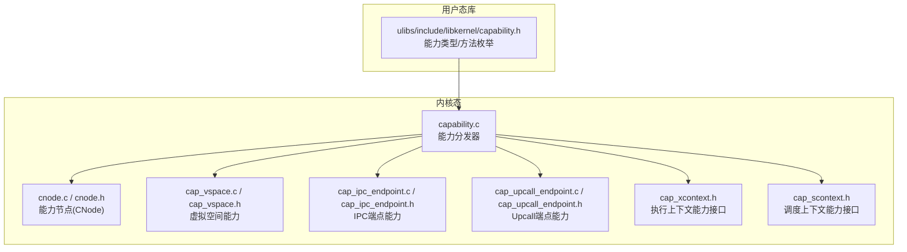
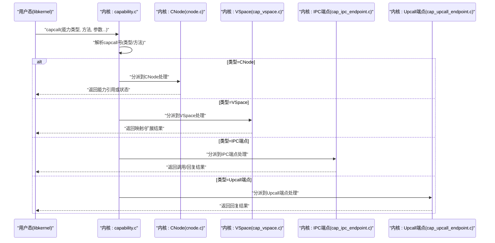
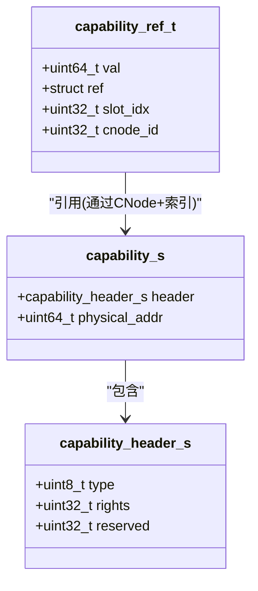
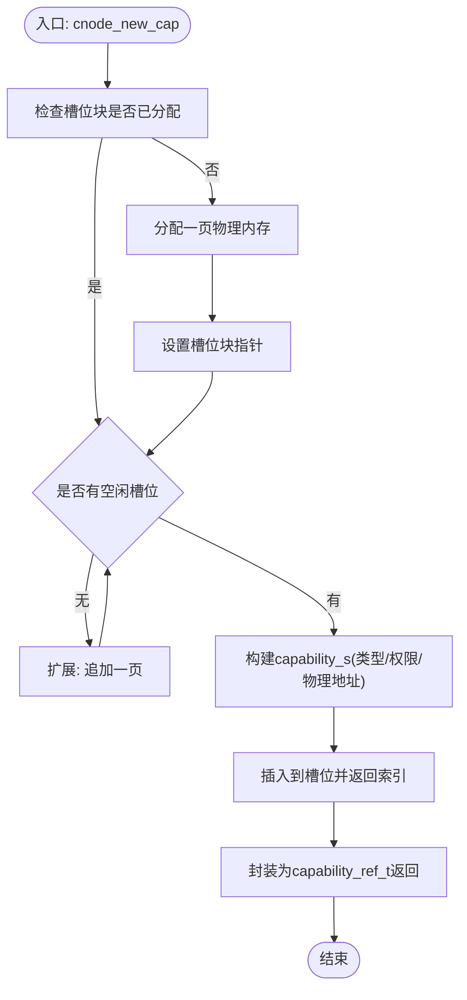
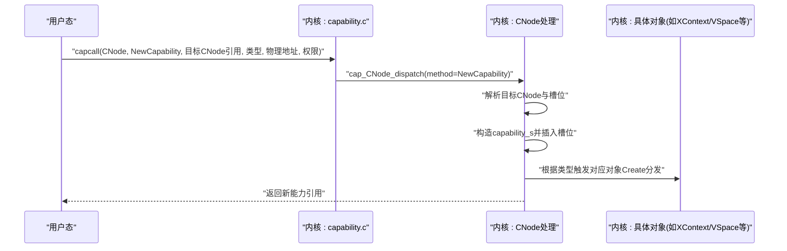
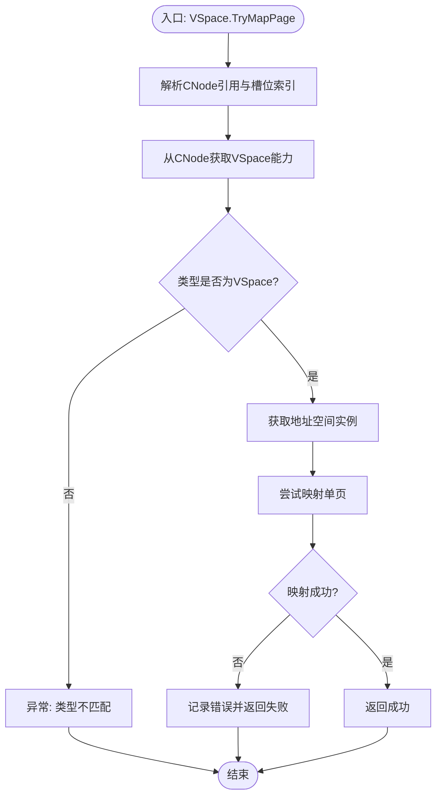
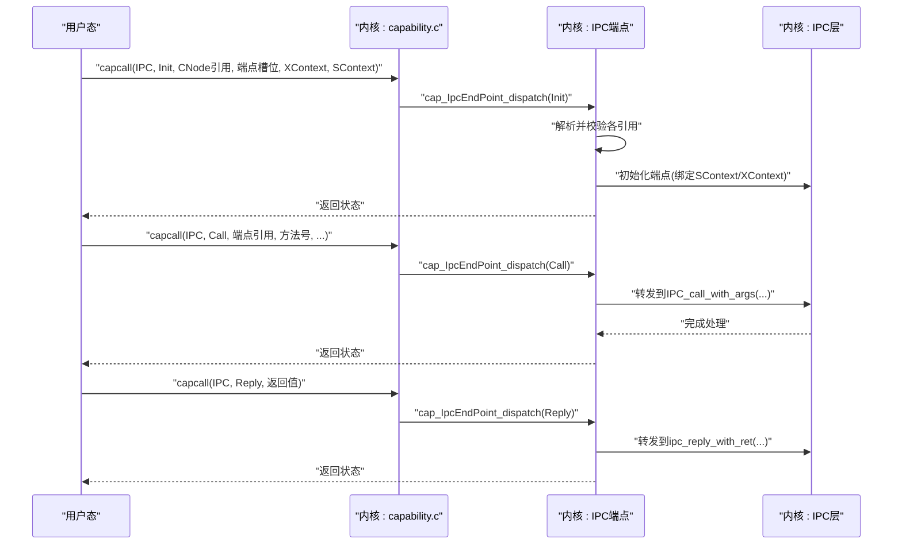
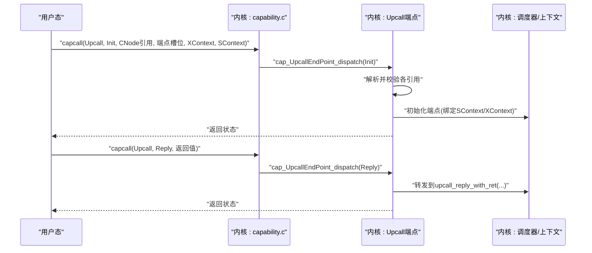
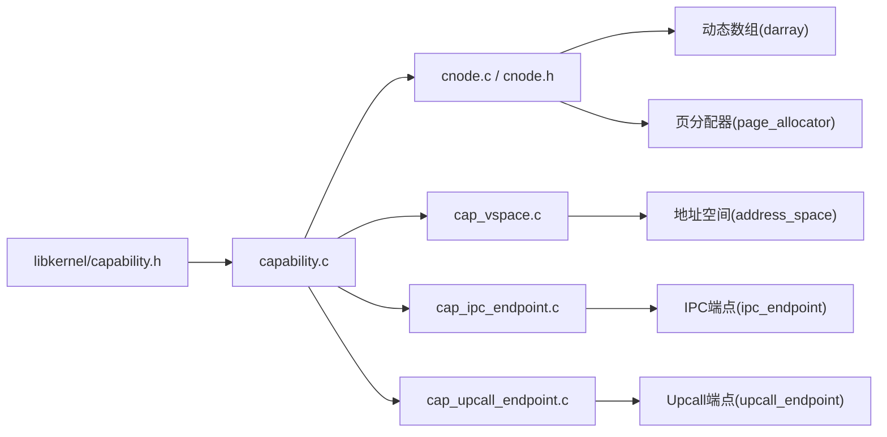

# Capability系统

<cite>
**本文引用的文件**
- [capability.c](file://kernel/capability/capability.c)
- [capability.h](file://kernel/include/capability/capability.h)
- [cnode.c](file://kernel/capability/cnode.c)
- [cnode.h](file://kernel/include/capability/cnode.h)
- [cap_cnode.c](file://kernel/capability/cap_cnode.c)
- [cap_cnode.h](file://kernel/include/capability/cap_cnode.h)
- [capability.h](file://ulibs/include/libkernel/capability.h)
- [cap_ipc_endpoint.c](file://kernel/capability/cap_ipc_endpoint.c)
- [cap_ipc_endpoint.h](file://kernel/include/capability/cap_ipc_endpoint.h)
- [cap_upcall_endpoint.c](file://kernel/capability/cap_upcall_endpoint.c)
- [cap_upcall_endpoint.h](file://kernel/include/capability/cap_upcall_endpoint.h)
- [cap_vspace.c](file://kernel/capability/cap_vspace.c)
- [cap_vspace.h](file://kernel/include/capability/cap_vspace.h)
- [cap_xcontext.h](file://kernel/include/capability/cap_xcontext.h)
- [cap_scontext.h](file://kernel/include/capability/cap_scontext.h)
</cite>

## 目录
1. [简介](#简介)
2. [项目结构](#项目结构)
3. [核心组件](#核心组件)
4. [架构总览](#架构总览)
5. [详细组件分析](#详细组件分析)
6. [依赖关系分析](#依赖关系分析)
7. [性能考量](#性能考量)
8. [故障排查指南](#故障排查指南)
9. [结论](#结论)
10. [附录：使用示例与最佳实践](#附录使用示例与最佳实践)

## 简介
本文件系统性梳理TranquilOS的Capability（能力）子系统，覆盖以下主题：
- Capability结构定义、权限位与引用计数机制
- CNode（能力节点）的作用、布局与扩展策略
- 能力的创建、传递与验证流程
- IPC端点与Upcall端点的初始化、调用与回复
- 权限控制与安全注意事项
- 常见问题定位与调试技巧

该文档既提供代码级的结构图与时序图，也给出可操作的使用示例与最佳实践，帮助读者在理解原理的同时快速落地。

## 项目结构
Capability系统主要由内核态能力分发器、能力节点（CNode）、各类具体能力对象（如虚拟空间、执行上下文、IPC/Upcall端点等）构成，并通过用户态库暴露统一的能力类型与方法枚举。

图表来源
- [capability.c](file://kernel/capability/capability.c#L14-L58)
- [capability.h](file://kernel/include/capability/capability.h#L11-L25)
- [cnode.c](file://kernel/capability/cnode.c#L9-L95)
- [cnode.h](file://kernel/include/capability/cnode.h#L11-L28)
- [cap_vspace.c](file://kernel/capability/cap_vspace.c#L8-L243)
- [cap_vspace.h](file://kernel/include/capability/cap_vspace.h#L1-L12)
- [cap_ipc_endpoint.c](file://kernel/capability/cap_ipc_endpoint.c#L9-L145)
- [cap_ipc_endpoint.h](file://kernel/include/capability/cap_ipc_endpoint.h#L1-L12)
- [cap_upcall_endpoint.c](file://kernel/capability/cap_upcall_endpoint.c#L12-L110)
- [cap_upcall_endpoint.h](file://kernel/include/capability/cap_upcall_endpoint.h#L1-L12)
- [capability.h](file://ulibs/include/libkernel/capability.h#L6-L141)

章节来源
- [capability.c](file://kernel/capability/capability.c#L1-L58)
- [capability.h](file://kernel/include/capability/capability.h#L1-L26)
- [capability.h](file://ulibs/include/libkernel/capability.h#L1-L141)

## 核心组件
- 能力头与能力结构
  - 能力头包含类型与权限位；能力对象包含头与物理地址字段，用于指向内核对象实例。
- 能力引用（capability_ref）
  - 以位域组合“CNode ID + 插槽索引”，形成全局唯一引用。
- CNode（能力节点）
  - 作为能力的容器，内部以动态数组管理能力槽位；支持扩展页以增加容量。
- 能力分发器
  - 解析来自用户态的capcall号，按能力类型与方法分派到对应处理函数。

章节来源
- [capability.h](file://kernel/include/capability/capability.h#L9-L25)
- [capability.h](file://ulibs/include/libkernel/capability.h#L44-L50)
- [cnode.h](file://kernel/include/capability/cnode.h#L11-L28)
- [cnode.c](file://kernel/capability/cnode.c#L9-L95)
- [capability.c](file://kernel/capability/capability.c#L14-L58)

## 架构总览
下图展示了从用户态发起能力调用到内核处理的关键路径，以及CNode在其中的角色。

图表来源
- [capability.c](file://kernel/capability/capability.c#L14-L58)
- [cnode.c](file://kernel/capability/cnode.c#L23-L90)
- [cap_vspace.c](file://kernel/capability/cap_vspace.c#L49-L134)
- [cap_ipc_endpoint.c](file://kernel/capability/cap_ipc_endpoint.c#L70-L120)
- [cap_upcall_endpoint.c](file://kernel/capability/cap_upcall_endpoint.c#L74-L90)

## 详细组件分析

### 能力结构与权限位
- 结构要点
  - 头部包含类型与权限位，用于标识对象类别与可用操作集合
  - 物理地址字段指向内核对象实例，便于直接访问
- 权限位
  - 内核提供全权限掩码常量，便于测试或特殊场景使用
- 引用计数
  - 当前实现未显式维护引用计数字段；能力删除需谨慎，避免悬挂引用

图表来源
- [capability.h](file://kernel/include/capability/capability.h#L11-L25)
- [capability.h](file://ulibs/include/libkernel/capability.h#L44-L50)

章节来源
- [capability.h](file://kernel/include/capability/capability.h#L9-L25)
- [capability.h](file://ulibs/include/libkernel/capability.h#L44-L50)

### CNode（能力节点）
- 作用
  - 承载具体能力对象；每个进程/线程拥有一个根CNode，可递归嵌套其他CNode
- 数据结构
  - 维护自增ID与动态数组槽位；槽位中存放capability_s
- 创建与扩展
  - 新建能力时从页分配器申请内存并插入槽位
  - 扩展时向动态数组追加新页，提升容量
- 获取目标CNode
  - 支持从当前CNode或通过已有关联CNode的槽位间接获取目标CNode

图表来源
- [cnode.c](file://kernel/capability/cnode.c#L23-L59)

章节来源
- [cnode.h](file://kernel/include/capability/cnode.h#L11-L28)
- [cnode.c](file://kernel/capability/cnode.c#L9-L95)

### CNode能力分发与方法
- 方法族
  - Create、NewCapability、Prepare、Extend、Destroy
- 关键流程
  - NewCapability：校验目标CNode与槽位，构造能力并触发对应对象的Create分发
  - Prepare：为目标CNode准备页并初始化
  - Extend：向目标CNode追加页以扩容
- 权限位
  - 提供创建与销毁权限位，便于细粒度授权

图表来源
- [cap_cnode.c](file://kernel/capability/cap_cnode.c#L23-L91)
- [cap_cnode.h](file://kernel/include/capability/cap_cnode.h#L7-L9)

章节来源
- [cap_cnode.c](file://kernel/capability/cap_cnode.c#L13-L184)
- [cap_cnode.h](file://kernel/include/capability/cap_cnode.h#L1-L12)

### 虚拟空间能力（VSpace）
- 方法族
  - Create、Prepare、TryMapPage、TryMapRange、UnMapPage、UnMapRange、Extend、Destroy
- 关键流程
  - Prepare：将页表页绑定到地址空间
  - TryMapPage/UnMapPage：尝试映射/取消映射单页
  - Extend：扩展页表以覆盖更大范围
- 错误处理
  - 映射失败时记录错误日志并返回失败结果

图表来源
- [cap_vspace.c](file://kernel/capability/cap_vspace.c#L49-L85)

章节来源
- [cap_vspace.c](file://kernel/capability/cap_vspace.c#L8-L243)
- [cap_vspace.h](file://kernel/include/capability/cap_vspace.h#L1-L12)

### IPC端点能力
- 初始化
  - 通过Init方法将端点与目标SContext/XContext关联
- 调用与回复
  - Call方法转发到IPC层进行请求处理
  - Reply方法将返回值回传给调用方
- 安全注意
  - 需要严格校验传入的CNode引用与槽位索引，防止越界访问

图表来源
- [cap_ipc_endpoint.c](file://kernel/capability/cap_ipc_endpoint.c#L16-L120)

章节来源
- [cap_ipc_endpoint.c](file://kernel/capability/cap_ipc_endpoint.c#L9-L145)
- [cap_ipc_endpoint.h](file://kernel/include/capability/cap_ipc_endpoint.h#L1-L12)

### Upcall端点能力
- 初始化
  - 将Upcall端点与目标SContext/XContext绑定
- 回复
  - Reply方法将返回值回传给调用方
- 适用场景
  - 异步事件回调、中断处理等

图表来源
- [cap_upcall_endpoint.c](file://kernel/capability/cap_upcall_endpoint.c#L20-L90)

章节来源
- [cap_upcall_endpoint.c](file://kernel/capability/cap_upcall_endpoint.c#L12-L110)
- [cap_upcall_endpoint.h](file://kernel/include/capability/cap_upcall_endpoint.h#L1-L12)

### 执行上下文与调度上下文能力接口
- 接口定义
  - 提供XContext与SContext能力的权限位与方法枚举
- 使用建议
  - 在创建能力时明确授予最小必要权限，遵循最小授权原则

章节来源
- [cap_xcontext.h](file://kernel/include/capability/cap_xcontext.h#L1-L12)
- [cap_scontext.h](file://kernel/include/capability/cap_scontext.h#L1-L12)
- [capability.h](file://ulibs/include/libkernel/capability.h#L120-L125)
- [capability.h](file://ulibs/include/libkernel/capability.h#L72-L85)

## 依赖关系分析
- 能力分发器依赖于各能力模块的分发函数
- CNode依赖动态数组与页分配器
- 各能力模块依赖调度上下文、执行上下文与IPC/Upcall子系统
- 用户态库提供统一的能力类型与方法枚举，驱动内核侧分发

图表来源
- [capability.c](file://kernel/capability/capability.c#L1-L12)
- [cnode.c](file://kernel/capability/cnode.c#L1-L6)
- [cap_vspace.c](file://kernel/capability/cap_vspace.c#L1-L7)
- [cap_ipc_endpoint.c](file://kernel/capability/cap_ipc_endpoint.c#L1-L8)
- [cap_upcall_endpoint.c](file://kernel/capability/cap_upcall_endpoint.c#L1-L10)

章节来源
- [capability.c](file://kernel/capability/capability.c#L1-L12)
- [cnode.c](file://kernel/capability/cnode.c#L1-L6)
- [cap_vspace.c](file://kernel/capability/cap_vspace.c#L1-L7)
- [cap_ipc_endpoint.c](file://kernel/capability/cap_ipc_endpoint.c#L1-L8)
- [cap_upcall_endpoint.c](file://kernel/capability/cap_upcall_endpoint.c#L1-L10)

## 性能考量
- 动态数组扩展策略
  - 按需分配页并追加到槽位，避免一次性占用过多内存
- 映射/解映射
  - 单页映射/解映射开销较小；批量映射建议使用范围接口以减少调用次数
- 日志与错误路径
  - 错误分支会打印日志并返回失败，应避免在热路径频繁触发

[本节为通用性能讨论，无需列出章节来源]

## 故障排查指南
- 常见问题
  - “未知能力类型”：确认capcall号中的类型字段与内核支持列表一致
  - “CNode为空”：检查目标CNode引用与槽位索引是否正确
  - “类型不匹配”：确认目标槽位存放的是预期类型的对象
  - “无空闲槽位”：对CNode执行Extend以扩容
  - “映射失败”：检查VSpace引用、页表页与地址参数
- 调试技巧
  - 开启内核日志，观察分发器与各能力模块的日志输出
  - 使用最小化用例逐步定位：先验证CNode创建与扩展，再验证对象创建与映射
  - 对关键路径添加断言，确保引用解析与类型校验

章节来源
- [capability.c](file://kernel/capability/capability.c#L50-L53)
- [cnode.c](file://kernel/capability/cnode.c#L16-L21)
- [cap_vspace.c](file://kernel/capability/cap_vspace.c#L78-L82)
- [cap_ipc_endpoint.c](file://kernel/capability/cap_ipc_endpoint.c#L89-L95)

## 结论
TranquilOS的Capability系统以CNode为核心容器，结合统一的能力头与引用机制，实现了对内核对象的安全访问与精细授权。通过能力分发器与各能力模块的协作，系统支持虚拟空间映射、IPC与Upcall等关键功能。实践中应重视引用解析、类型校验与权限位配置，遵循最小授权原则，确保系统的安全性与稳定性。

[本节为总结性内容，无需列出章节来源]

## 附录：使用示例与最佳实践

### 使用示例（步骤说明）
- 创建根CNode与扩展
  - 步骤：调用CNode.Create创建根CNode；若槽位不足，调用CNode.Extend追加页
  - 参考：CNode.Create、CNode.Extend
- 在CNode中新建具体能力
  - 步骤：调用CNode.NewCapability，传入目标CNode引用、对象类型、物理地址与权限位
  - 参考：CNode.NewCapability
- 初始化IPC端点并发起调用
  - 步骤：调用IPC.Init绑定SContext/XContext；调用IPC.Call发送请求；在回调中调用IPC.Reply
  - 参考：IPC.Init、IPC.Call、IPC.Reply
- 初始化Upcall端点并回复
  - 步骤：调用Upcall.Init绑定SContext/XContext；在事件发生时调用Upcall.Reply
  - 参考：Upcall.Init、Upcall.Reply
- 虚拟空间映射
  - 步骤：调用VSpace.Prepare绑定页表页；调用VSpace.TryMapPage映射单页；需要时调用VSpace.Extend扩展
  - 参考：VSpace.Prepare、VSpace.TryMapPage、VSpace.Extend

章节来源
- [cap_cnode.c](file://kernel/capability/cap_cnode.c#L23-L91)
- [cap_ipc_endpoint.c](file://kernel/capability/cap_ipc_endpoint.c#L16-L120)
- [cap_upcall_endpoint.c](file://kernel/capability/cap_upcall_endpoint.c#L20-L90)
- [cap_vspace.c](file://kernel/capability/cap_vspace.c#L15-L134)

### 最佳实践与安全考虑
- 权限最小化
  - 仅授予完成任务所需的最小权限位，避免授予全部权限
- 引用校验
  - 每次使用前校验CNode引用与槽位索引的有效性
- 错误处理
  - 对所有失败路径添加日志与返回值检查
- 生命周期管理
  - 严格管理能力对象的创建与销毁，避免悬挂引用与内存泄漏
- 分层设计
  - 将复杂逻辑拆分为多个小步骤，便于调试与维护

[本节为通用实践建议，无需列出章节来源]