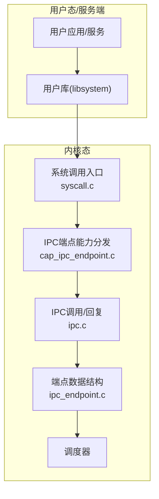
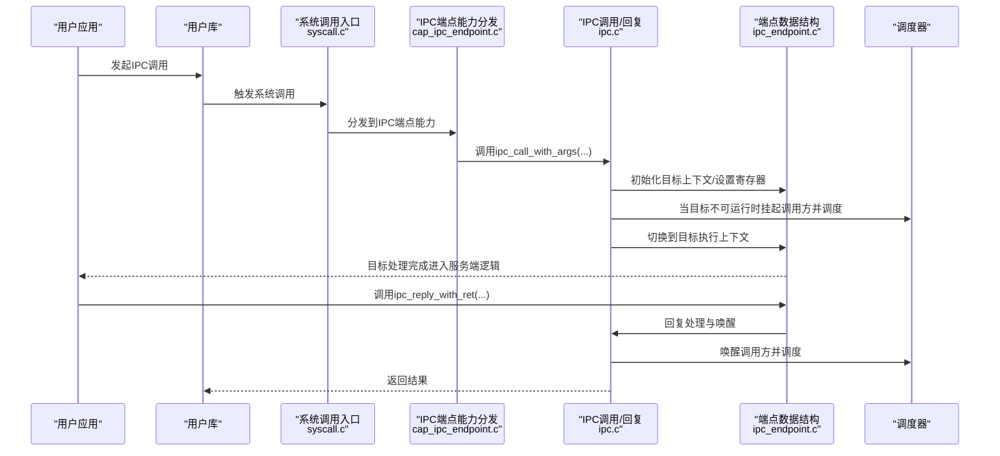
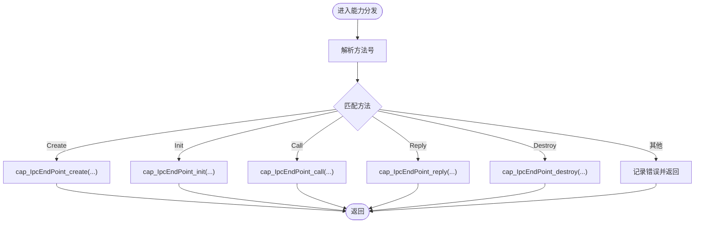
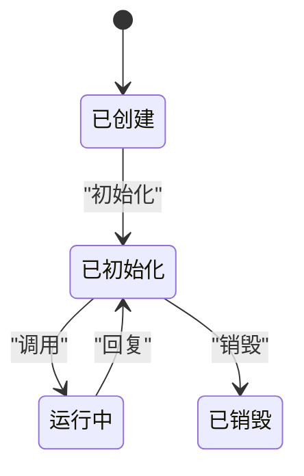
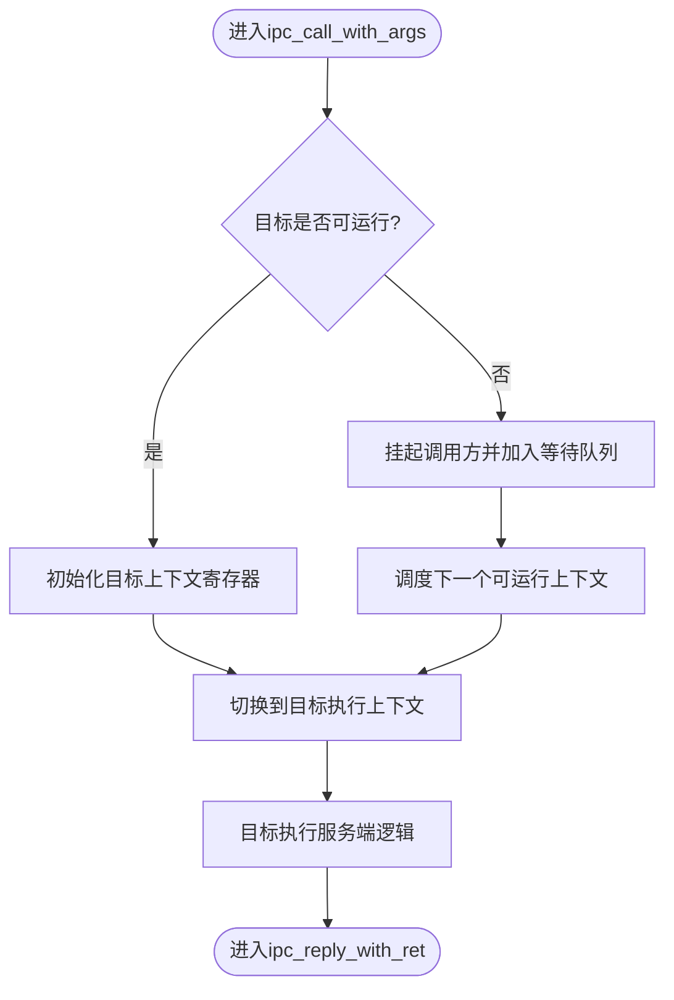
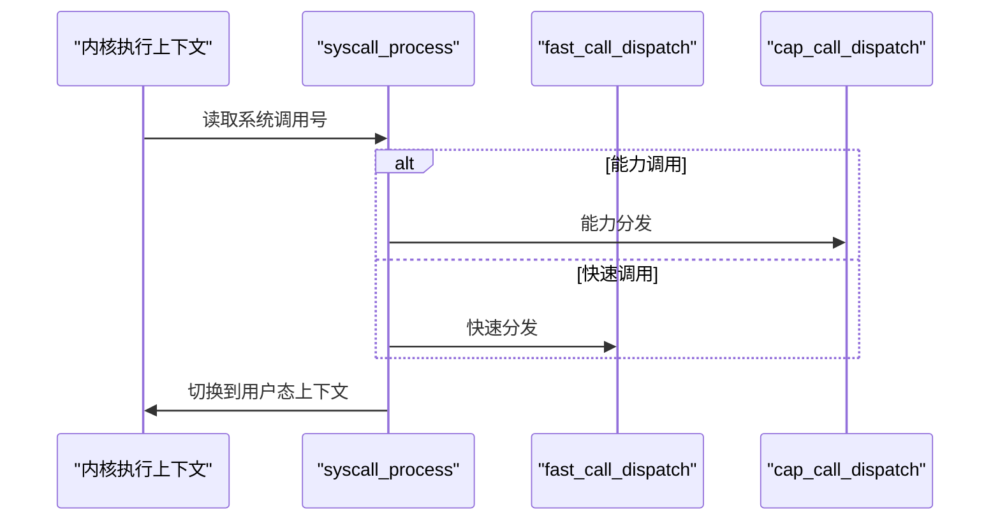
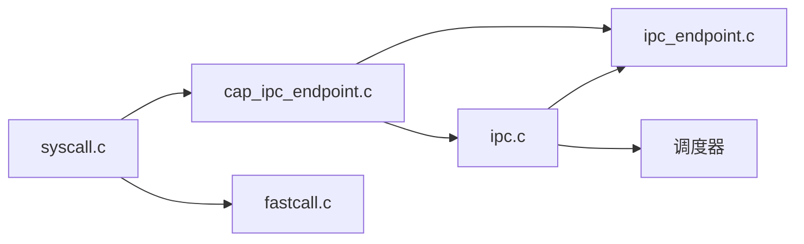

# IPC端点管理

<cite>
**本文引用的文件**
- [cap_ipc_endpoint.h](file://kernel/include/capability/cap_ipc_endpoint.h)
- [cap_ipc_endpoint.c](file://kernel/capability/cap_ipc_endpoint.c)
- [ipc_endpoint.h](file://kernel/include/ipc/ipc_endpoint.h)
- [ipc_endpoint.c](file://kernel/ipc/ipc_endpoint.c)
- [upcall_endpoint.h](file://kernel/include/upcall/upcall_endpoint.h)
- [upcall_endpoint.c](file://kernel/upcall/upcall_endpoint.c)
- [ipc.h](file://kernel/include/ipc/ipc.h)
- [ipc.c](file://kernel/ipc/ipc.c)
- [syscall.h](file://kernel/include/syscall/syscall.h)
- [syscall.c](file://kernel/syscall/syscall.c)
- [fastcall.h](file://kernel/include/syscall/fastcall.h)
- [fastcall.c](file://kernel/syscall/fastcall.c)
- [ipc_endpoint.h（systemd）](file://kernel/systemd/include/ipcmgr/ipc_endpoint.h)
- [ipcmgr.h](file://kernel/systemd/include/ipcmgr/ipcmgr.h)
</cite>

## 目录
1. [简介](#简介)
2. [项目结构](#项目结构)
3. [核心组件](#核心组件)
4. [架构总览](#架构总览)
5. [详细组件分析](#详细组件分析)
6. [依赖关系分析](#依赖关系分析)
7. [性能考量](#性能考量)
8. [故障排除指南](#故障排除指南)
9. [结论](#结论)
10. [附录：使用示例与最佳实践](#附录使用示例与最佳实践)

## 简介
本文件系统化阐述TranquilOS中IPC端点的创建、配置、管理与生命周期，重点覆盖以下方面：
- Capability封装与访问控制：如何通过能力对象对IPC端点进行授权与隔离。
- 消息传递协议：调用参数传递、返回值处理、上下文切换与调度。
- 同步与阻塞机制：端点等待队列、唤醒策略与调度器协作。
- 生命周期管理：从创建、初始化、调用、回复到销毁的完整流程。
- 安全与权限：基于能力位掩码的权限控制与越权检测。
- 性能优化与常见问题排查：阻塞开销、唤醒策略、调试方法。

## 项目结构
围绕IPC端点管理的相关代码主要分布在如下模块：
- 能力层：capability/cap_ipc_endpoint.* 提供IPC端点能力的分发与方法调用入口。
- IPC内核接口：ipc/ipc.* 与 ipc/ipc_endpoint.* 实现端点数据结构、调用与回复逻辑。
- 上行调用端点：upcall/upcall_endpoint.* 提供异常/上行调用的端点模型（概念性对比参考）。
- 系统调用入口：syscall/syscall.* 与 syscall/fastcall.* 统一入口分派。
- systemd侧IPC管理：systemd/include/ipcmgr/* 提供服务端IPC端点的高层抽象与管理。

图表来源
- [syscall.c](file://kernel/syscall/syscall.c#L8-L20)
- [cap_ipc_endpoint.c](file://kernel/capability/cap_ipc_endpoint.c#L124-L145)
- [ipc.c](file://kernel/ipc/ipc.c#L9-L76)
- [ipc_endpoint.c](file://kernel/ipc/ipc_endpoint.c#L7-L25)

章节来源
- [syscall.c](file://kernel/syscall/syscall.c#L8-L20)
- [cap_ipc_endpoint.c](file://kernel/capability/cap_ipc_endpoint.c#L124-L145)
- [ipc.c](file://kernel/ipc/ipc.c#L9-L76)
- [ipc_endpoint.c](file://kernel/ipc/ipc_endpoint.c#L7-L25)

## 核心组件
- IPC端点数据结构：包含目标执行上下文、调度上下文、入口地址与栈指针、调用者信息以及等待队列等字段。
- 能力分发器：根据方法号分派到具体操作（创建、初始化、调用、回复、销毁）。
- IPC调用/回复：负责参数打包、上下文初始化、状态切换与调度。
- 等待与唤醒：将调用方挂起并加入端点等待队列，由被调方在回复时唤醒。
- 上行调用端点：用于异常/上行回调的端点模型（概念性对比，便于理解IPC端点差异）。

章节来源
- [ipc_endpoint.h](file://kernel/include/ipc/ipc_endpoint.h#L8-L17)
- [cap_ipc_endpoint.h](file://kernel/include/capability/cap_ipc_endpoint.h#L7-L10)
- [ipc.h](file://kernel/include/ipc/ipc.h#L9-L11)
- [upcall_endpoint.h](file://kernel/include/upcall/upcall_endpoint.h#L8-L17)

## 架构总览
下图展示了从用户发起IPC调用到内核完成上下文切换与调度的关键路径。

图表来源
- [syscall.c](file://kernel/syscall/syscall.c#L8-L20)
- [cap_ipc_endpoint.c](file://kernel/capability/cap_ipc_endpoint.c#L70-L104)
- [ipc.c](file://kernel/ipc/ipc.c#L9-L76)
- [ipc_endpoint.c](file://kernel/ipc/ipc_endpoint.c#L27-L49)

## 详细组件分析

### 能力封装与访问控制
- 能力类型与方法
  - 能力类型：OBJ_TYPE_IpcEndPoint
  - 方法集合：创建、初始化、调用、回复、销毁
  - 权限位掩码：创建与销毁权限位定义，用于能力持有者权限校验
- 能力分发器
  - 根据方法号分派到对应处理函数
  - 对传入的能力引用进行解析与有效性检查（目标对象类型、物理地址非空等）

图表来源
- [cap_ipc_endpoint.c](file://kernel/capability/cap_ipc_endpoint.c#L124-L145)
- [cap_ipc_endpoint.h](file://kernel/include/capability/cap_ipc_endpoint.h#L7-L10)

章节来源
- [cap_ipc_endpoint.h](file://kernel/include/capability/cap_ipc_endpoint.h#L7-L10)
- [cap_ipc_endpoint.c](file://kernel/capability/cap_ipc_endpoint.c#L124-L145)

### IPC端点数据结构与生命周期
- 数据结构字段
  - entry_xctx：端点入口执行上下文
  - scontext：端点所属调度上下文
  - entry_point、stack_pointer：入口地址与栈指针
  - caller_sctx：当前调用方调度上下文
  - wait_sctx_list：等待该端点的调度上下文队列
- 生命周期阶段
  - 创建：准备未类型内存并进行权限检查（占位）
  - 初始化：绑定目标调度上下文与执行上下文，记录入口与栈
  - 调用：若目标不可运行则挂起调用方；否则切换到目标上下文
  - 回复：恢复调用方状态并唤醒等待队列中的后续上下文
  - 销毁：释放端点资源（占位）

图表来源
- [ipc_endpoint.h](file://kernel/include/ipc/ipc_endpoint.h#L8-L17)
- [ipc_endpoint.c](file://kernel/ipc/ipc_endpoint.c#L7-L25)

章节来源
- [ipc_endpoint.h](file://kernel/include/ipc/ipc_endpoint.h#L8-L17)
- [ipc_endpoint.c](file://kernel/ipc/ipc_endpoint.c#L7-L25)
- [cap_ipc_endpoint.c](file://kernel/capability/cap_ipc_endpoint.c#L9-L14)

### 消息传递协议与同步机制
- 参数传递
  - 从调用方执行上下文中读取端点引用、方法号与最多4个参数
  - 将参数写入目标执行上下文寄存器，按约定顺序传递
- 上下文切换
  - 初始化目标执行上下文的入口与栈指针
  - 更新调用方与目标方的状态，并进行调度器移除/添加
- 阻塞与唤醒
  - 若目标不可运行，调用方被挂起并加入端点等待队列
  - 目标方回复后，唤醒等待队列中的上下文并重新调度

图表来源
- [ipc.c](file://kernel/ipc/ipc.c#L9-L76)

章节来源
- [ipc.h](file://kernel/include/ipc/ipc.h#L9-L11)
- [ipc.c](file://kernel/ipc/ipc.c#L9-L76)

### 系统调用入口与分派
- 入口统一处理
  - 从执行上下文中读取系统调用号
  - 若为能力调用掩码，则转至能力分发；否则走快速调用路径
  - 切换地址空间并切换到用户态上下文
- 快速调用
  - 当前快速调用分派为空，保留扩展点

图表来源
- [syscall.c](file://kernel/syscall/syscall.c#L8-L20)
- [fastcall.c](file://kernel/syscall/fastcall.c#L6-L17)

章节来源
- [syscall.h](file://kernel/include/syscall/syscall.h#L6)
- [syscall.c](file://kernel/syscall/syscall.c#L8-L20)
- [fastcall.h](file://kernel/include/syscall/fastcall.h#L6)
- [fastcall.c](file://kernel/syscall/fastcall.c#L6-L17)

### systemd侧IPC管理（高层视角）
- 管理器结构
  - 包含名称服务端点与系统服务端点等
- 端点对象
  - 持有能力引用、入口上下文与调度上下文、线程栈、入口点、内存与服务标识等
  - 使用双向链表组织，便于管理与遍历

章节来源
- [ipcmgr.h](file://kernel/systemd/include/ipcmgr/ipcmgr.h#L6-L9)
- [ipc_endpoint.h（systemd）](file://kernel/systemd/include/ipcmgr/ipc_endpoint.h#L8-L18)

## 依赖关系分析
- 能力层依赖IPC内核接口与调度器，确保端点初始化、调用与回复的正确性
- IPC内核接口依赖HAL上下文与调度器，完成上下文切换与状态管理
- 系统调用入口统一调度能力与快速调用路径，保证内核入口的一致性

图表来源
- [cap_ipc_endpoint.c](file://kernel/capability/cap_ipc_endpoint.c#L1-L8)
- [ipc.c](file://kernel/ipc/ipc.c#L1-L8)
- [ipc_endpoint.c](file://kernel/ipc/ipc_endpoint.c#L1-L6)
- [syscall.c](file://kernel/syscall/syscall.c#L1-L7)
- [fastcall.c](file://kernel/syscall/fastcall.c#L1-L5)

章节来源
- [cap_ipc_endpoint.c](file://kernel/capability/cap_ipc_endpoint.c#L1-L8)
- [ipc.c](file://kernel/ipc/ipc.c#L1-L8)
- [ipc_endpoint.c](file://kernel/ipc/ipc_endpoint.c#L1-L6)
- [syscall.c](file://kernel/syscall/syscall.c#L1-L7)
- [fastcall.c](file://kernel/syscall/fastcall.c#L1-L5)

## 性能考量
- 减少不必要的上下文切换
  - 在目标可运行时直接切换，避免无谓挂起
  - 批量唤醒等待队列中的上下文，降低频繁调度开销
- 参数传递优化
  - 控制参数数量，避免过多寄存器拷贝
  - 对大块数据采用共享内存或消息体指针传递
- 调度策略
  - 优先选择高优先级或短任务，缩短端到端延迟
- 日志与诊断
  - 在关键路径保留日志，但生产环境建议关闭或降级，避免I/O开销

## 故障排除指南
- 常见错误与定位
  - 空指针：端点、执行上下文、调度上下文或能力节点为空
  - 类型不匹配：目标对象不是IPC端点或XContext/SContext类型不符
  - 未初始化：端点未完成初始化即被调用
  - 调度器未就绪：调度器或本地调度器为空
- 排查步骤
  - 核对能力引用的高位索引与低位槽位是否正确
  - 检查端点状态与等待队列是否异常
  - 确认系统调用入口是否正确分派到能力路径
  - 关注日志输出，定位阻塞与唤醒时机
- 建议
  - 在开发阶段开启详细日志，定位问题后逐步收敛
  - 对关键路径增加断言，尽早暴露非法状态

章节来源
- [cap_ipc_endpoint.c](file://kernel/capability/cap_ipc_endpoint.c#L23-L63)
- [ipc_endpoint.c](file://kernel/ipc/ipc_endpoint.c#L27-L49)
- [ipc.c](file://kernel/ipc/ipc.c#L78-L114)

## 结论
TranquilOS的IPC端点管理以能力为核心，结合端点数据结构与调度器协作，实现了简洁而高效的进程间通信机制。通过明确的生命周期、严格的类型与权限校验、以及清晰的消息传递协议，系统在保证安全性的同时提供了良好的可维护性与扩展性。建议在实际工程中遵循本文的权限设计、参数传递与调度策略，以获得更优的性能与稳定性。

## 附录：使用示例与最佳实践
- 典型场景
  - 服务注册与发现：服务启动后创建IPC端点并通过名称服务注册，客户端通过名称服务查询并发起调用
  - 请求-响应：客户端调用服务端IPC端点，服务端处理完成后调用回复接口
  - 异常/上行回调：与IPC端点类似，但由异常或中断触发，使用上行调用端点模型
- 最佳实践
  - 明确权限位：仅授予必要的创建与销毁权限，避免过度授权
  - 控制参数规模：减少跨上下文拷贝，必要时使用共享内存
  - 优雅处理阻塞：合理设置超时与重试，避免长时间阻塞
  - 严格类型校验：在能力分发与端点初始化阶段进行充分校验
  - 可观测性：在开发阶段启用日志，在生产阶段谨慎降级