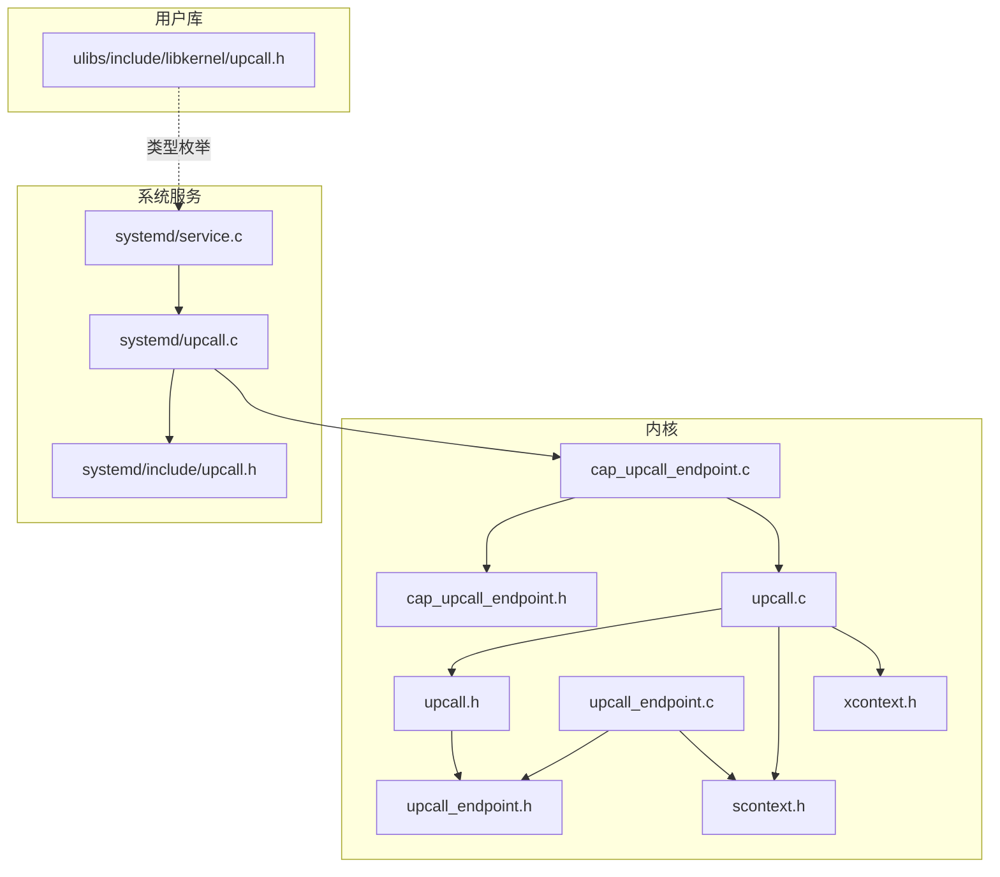
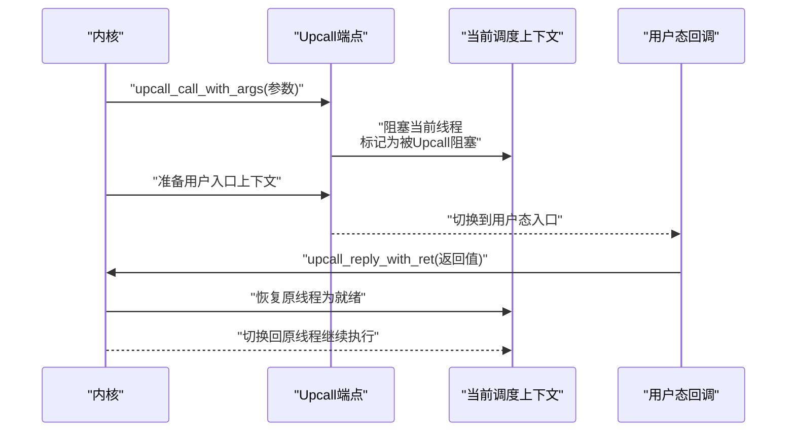
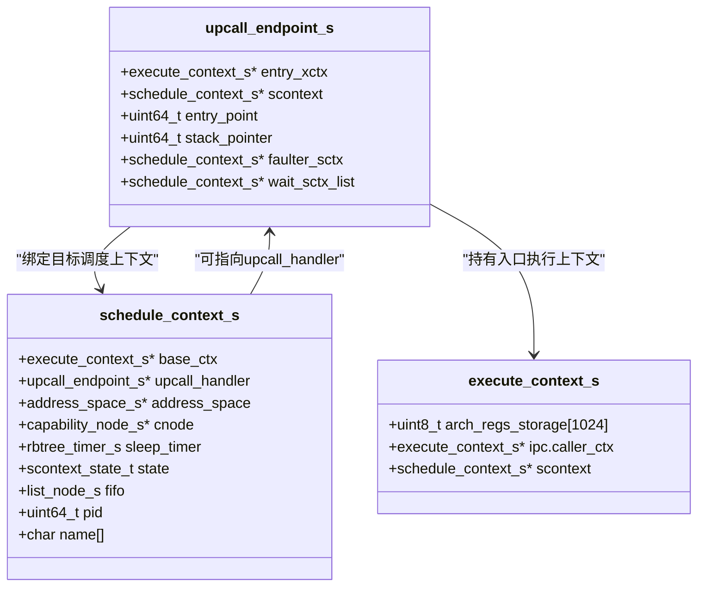
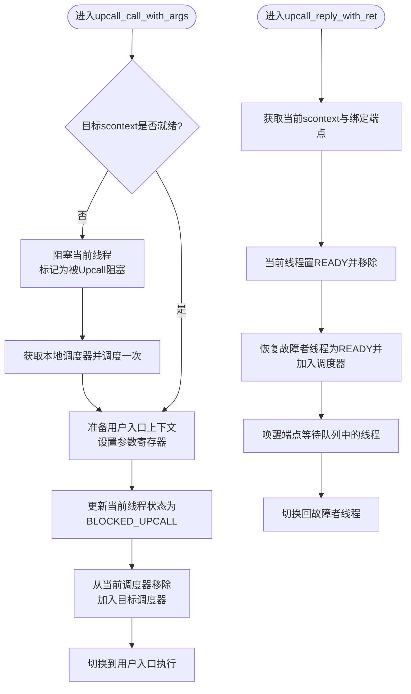
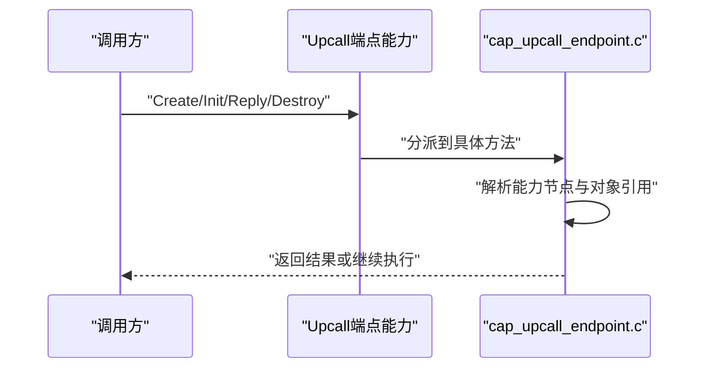
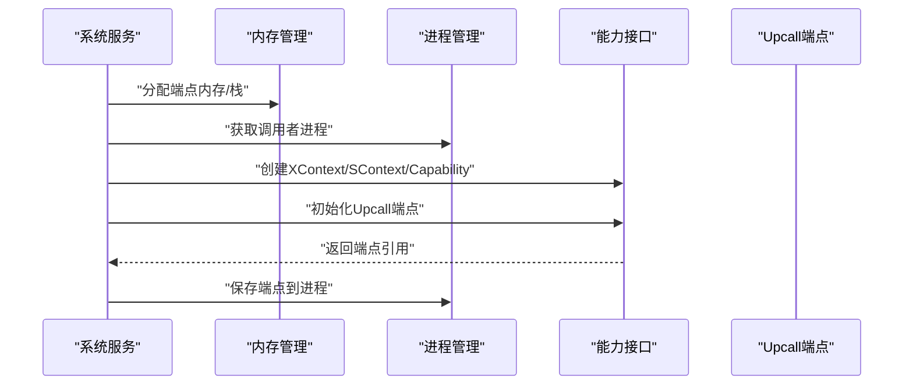
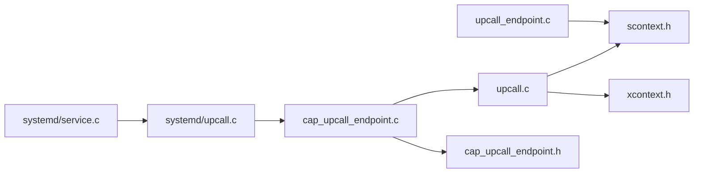

# Upcall机制

<cite>
**本文引用的文件**
- [kernel/include/upcall/upcall.h](file://kernel/include/upcall/upcall.h)
- [kernel/include/upcall/upcall_endpoint.h](file://kernel/include/upcall/upcall_endpoint.h)
- [kernel/upcall/upcall.c](file://kernel/upcall/upcall.c)
- [kernel/upcall/upcall_endpoint.c](file://kernel/upcall/upcall_endpoint.c)
- [kernel/include/capability/cap_upcall_endpoint.h](file://kernel/include/capability/cap_upcall_endpoint.h)
- [kernel/capability/cap_upcall_endpoint.c](file://kernel/capability/cap_upcall_endpoint.c)
- [kernel/systemd/include/upcall.h](file://kernel/systemd/include/upcall.h)
- [kernel/systemd/upcall.c](file://kernel/systemd/upcall.c)
- [kernel/systemd/service.c](file://kernel/systemd/service.c)
- [ulibs/include/libkernel/upcall.h](file://ulibs/include/libkernel/upcall.h)
- [kernel/include/scontext/scontext.h](file://kernel/include/scontext/scontext.h)
- [kernel/include/xcontext/xcontext.h](file://kernel/include/xcontext/xcontext.h)
</cite>

## 目录
1. [引言](#引言)
2. [项目结构](#项目结构)
3. [核心组件](#核心组件)
4. [架构总览](#架构总览)
5. [详细组件分析](#详细组件分析)
6. [依赖关系分析](#依赖关系分析)
7. [性能考量](#性能考量)
8. [故障排查指南](#故障排查指南)
9. [结论](#结论)
10. [附录：使用示例与最佳实践](#附录使用示例与最佳实践)

## 引言
本文件系统化阐述TranquilOS的Upcall机制，重点覆盖以下方面：
- Upcall的概念与在微内核中的作用：以“内核事件驱动用户态回调”的方式，实现高效、可控的异步处理路径。
- Upcall端点的创建与配置：从系统服务侧分配内存、构造执行上下文与调度上下文，并通过能力（Capability）接口初始化端点。
- 触发与执行流程：从内核事件发生，到将当前线程阻塞，切换到用户态回调入口，再到回调返回后恢复原线程的完整路径。
- 与普通IPC的区别与优势：无需显式请求/响应循环，减少消息传递开销；回调语义更贴近异常处理模型。
- 安全性与权限校验：基于能力位掩码的权限控制与能力节点解析。
- 性能影响与优化建议：上下文切换成本、等待队列唤醒策略、栈空间与内存对齐等。
- 常见问题与调试技巧：状态机错误、空指针、调度器未初始化等。

## 项目结构
围绕Upcall机制的关键源文件分布如下：
- 内核接口与实现
  - 上层接口头文件：kernel/include/upcall/upcall.h
  - 端点数据结构与接口：kernel/include/upcall/upcall_endpoint.h
  - 核心调用与回复实现：kernel/upcall/upcall.c、kernel/upcall/upcall_endpoint.c
  - 能力分派与权限：kernel/include/capability/cap_upcall_endpoint.h、kernel/capability/cap_upcall_endpoint.c
- 系统服务侧集成
  - 端点对象定义与创建：kernel/systemd/include/upcall.h、kernel/systemd/upcall.c
  - 服务注册与调用：kernel/systemd/service.c
- 用户库枚举类型
  - ulibs/include/libkernel/upcall.h
- 关键运行时结构
  - 调度上下文状态：kernel/include/scontext/scontext.h
  - 执行上下文：kernel/include/xcontext/xcontext.h

**图表来源**
- [kernel/include/upcall/upcall.h](file://kernel/include/upcall/upcall.h#L1-L13)
- [kernel/include/upcall/upcall_endpoint.h](file://kernel/include/upcall/upcall_endpoint.h#L1-L25)
- [kernel/upcall/upcall.c](file://kernel/upcall/upcall.c#L1-L95)
- [kernel/upcall/upcall_endpoint.c](file://kernel/upcall/upcall_endpoint.c#L1-L83)
- [kernel/include/capability/cap_upcall_endpoint.h](file://kernel/include/capability/cap_upcall_endpoint.h#L1-L12)
- [kernel/capability/cap_upcall_endpoint.c](file://kernel/capability/cap_upcall_endpoint.c#L1-L110)
- [kernel/systemd/include/upcall.h](file://kernel/systemd/include/upcall.h#L1-L21)
- [kernel/systemd/upcall.c](file://kernel/systemd/upcall.c#L1-L132)
- [kernel/systemd/service.c](file://kernel/systemd/service.c#L1-L236)
- [ulibs/include/libkernel/upcall.h](file://ulibs/include/libkernel/upcall.h#L1-L17)
- [kernel/include/scontext/scontext.h](file://kernel/include/scontext/scontext.h#L1-L50)
- [kernel/include/xcontext/xcontext.h](file://kernel/include/xcontext/xcontext.h#L1-L24)

**章节来源**
- [kernel/include/upcall/upcall.h](file://kernel/include/upcall/upcall.h#L1-L13)
- [kernel/include/upcall/upcall_endpoint.h](file://kernel/include/upcall/upcall_endpoint.h#L1-L25)
- [kernel/upcall/upcall.c](file://kernel/upcall/upcall.c#L1-L95)
- [kernel/upcall/upcall_endpoint.c](file://kernel/upcall/upcall_endpoint.c#L1-L83)
- [kernel/include/capability/cap_upcall_endpoint.h](file://kernel/include/capability/cap_upcall_endpoint.h#L1-L12)
- [kernel/capability/cap_upcall_endpoint.c](file://kernel/capability/cap_upcall_endpoint.c#L1-L110)
- [kernel/systemd/include/upcall.h](file://kernel/systemd/include/upcall.h#L1-L21)
- [kernel/systemd/upcall.c](file://kernel/systemd/upcall.c#L1-L132)
- [kernel/systemd/service.c](file://kernel/systemd/service.c#L1-L236)
- [ulibs/include/libkernel/upcall.h](file://ulibs/include/libkernel/upcall.h#L1-L17)
- [kernel/include/scontext/scontext.h](file://kernel/include/scontext/scontext.h#L1-L50)
- [kernel/include/xcontext/xcontext.h](file://kernel/include/xcontext/xcontext.h#L1-L24)

## 核心组件
- Upcall端点数据结构：包含目标执行上下文、调度上下文、入口地址、栈顶指针，以及等待队列与故障者调度上下文等字段。
- Upcall接口：提供带参数的调用与带返回值的回复两个关键入口，用于从内核态切换到用户态回调，并在回调完成后恢复原线程。
- 能力接口：通过能力方法分派，完成端点创建、初始化、回复等操作；并定义了端点能力的权限位。
- 系统服务集成：系统服务负责为进程创建物理内存、XContext/SContext、栈，并通过能力接口初始化Upcall端点。
- 运行时上下文：调度上下文状态包含“被Upcall阻塞”状态；执行上下文承载寄存器现场。

**章节来源**
- [kernel/include/upcall/upcall_endpoint.h](file://kernel/include/upcall/upcall_endpoint.h#L8-L25)
- [kernel/include/upcall/upcall.h](file://kernel/include/upcall/upcall.h#L9-L11)
- [kernel/include/capability/cap_upcall_endpoint.h](file://kernel/include/capability/cap_upcall_endpoint.h#L7-L11)
- [kernel/systemd/include/upcall.h](file://kernel/systemd/include/upcall.h#L8-L17)
- [kernel/include/scontext/scontext.h](file://kernel/include/scontext/scontext.h#L12-L20)
- [kernel/include/xcontext/xcontext.h](file://kernel/include/xcontext/xcontext.h#L7-L15)

## 架构总览
Upcall机制在微内核中的定位是：当内核检测到特定事件（如缺页异常），通过已建立的Upcall端点，将当前线程阻塞并切换到用户态回调入口，由用户态处理程序决定后续动作（例如映射页面、释放资源等）。回调结束后，用户态调用回复接口，内核将原线程恢复到就绪状态并继续执行。

**图表来源**
- [kernel/upcall/upcall.c](file://kernel/upcall/upcall.c#L8-L52)
- [kernel/upcall/upcall.c](file://kernel/upcall/upcall.c#L54-L95)
- [kernel/include/scontext/scontext.h](file://kernel/include/scontext/scontext.h#L12-L20)

## 详细组件分析

### 组件一：Upcall端点数据结构与初始化
- 数据结构字段
  - entry_xctx：用户态入口执行上下文
  - scontext：目标调度上下文
  - entry_point、stack_pointer：入口地址与栈顶
  - faulter_sctx：触发Upcall的故障者调度上下文
  - wait_sctx_list：等待该端点唤醒的调度上下文队列
- 初始化流程
  - 记录当前执行上下文的PC/SP作为用户入口
  - 将目标调度上下文与端点关联
  - 清空等待队列与故障者字段

**图表来源**
- [kernel/include/upcall/upcall_endpoint.h](file://kernel/include/upcall/upcall_endpoint.h#L8-L25)
- [kernel/include/scontext/scontext.h](file://kernel/include/scontext/scontext.h#L22-L43)
- [kernel/include/xcontext/xcontext.h](file://kernel/include/xcontext/xcontext.h#L7-L15)

**章节来源**
- [kernel/include/upcall/upcall_endpoint.h](file://kernel/include/upcall/upcall_endpoint.h#L8-L25)
- [kernel/upcall/upcall_endpoint.c](file://kernel/upcall/upcall_endpoint.c#L8-L26)

### 组件二：Upcall调用与回复流程
- 调用流程
  - 若目标调度上下文非就绪，则阻塞当前线程并进行一次调度
  - 初始化用户态入口上下文（设置入口地址与栈顶）
  - 设置参数寄存器（参数0/1）
  - 当前线程状态置为“被Upcall阻塞”，从当前调度器移除并加入目标调度器
  - 切换到用户态入口执行
- 回复流程
  - 获取当前调度上下文与其绑定的端点
  - 恢复当前线程为就绪并从调度器移除
  - 将故障者线程恢复为就绪并加入调度器
  - 唤醒等待在端点上的其他线程
  - 切换回故障者线程继续执行

**图表来源**
- [kernel/upcall/upcall.c](file://kernel/upcall/upcall.c#L8-L52)
- [kernel/upcall/upcall.c](file://kernel/upcall/upcall.c#L54-L95)
- [kernel/include/scontext/scontext.h](file://kernel/include/scontext/scontext.h#L12-L20)

**章节来源**
- [kernel/upcall/upcall.c](file://kernel/upcall/upcall.c#L8-L52)
- [kernel/upcall/upcall.c](file://kernel/upcall/upcall.c#L54-L95)

### 组件三：能力接口与权限控制
- 能力方法
  - 创建：预留接口，用于从未定类型物理内存生成端点对象
  - 初始化：从能力节点解析端点、执行上下文与调度上下文，完成端点初始化
  - 回复：接收用户态回调返回值，执行内核侧恢复逻辑
  - 销毁：预留接口
- 权限位
  - 创建权限位与销毁权限位，用于限制对端点对象的操作

**图表来源**
- [kernel/capability/cap_upcall_endpoint.c](file://kernel/capability/cap_upcall_endpoint.c#L92-L110)
- [kernel/capability/cap_upcall_endpoint.c](file://kernel/capability/cap_upcall_endpoint.c#L20-L72)
- [kernel/capability/cap_upcall_endpoint.c](file://kernel/capability/cap_upcall_endpoint.c#L74-L87)
- [kernel/include/capability/cap_upcall_endpoint.h](file://kernel/include/capability/cap_upcall_endpoint.h#L7-L11)

**章节来源**
- [kernel/include/capability/cap_upcall_endpoint.h](file://kernel/include/capability/cap_upcall_endpoint.h#L7-L11)
- [kernel/capability/cap_upcall_endpoint.c](file://kernel/capability/cap_upcall_endpoint.c#L12-L72)
- [kernel/capability/cap_upcall_endpoint.c](file://kernel/capability/cap_upcall_endpoint.c#L74-L87)
- [kernel/capability/cap_upcall_endpoint.c](file://kernel/capability/cap_upcall_endpoint.c#L92-L110)

### 组件四：系统服务侧的端点创建与配置
- 分配物理内存与栈空间，构造XContext/SContext
- 映射栈到进程地址空间
- 初始化XContext/SContext，设置能力节点、页表空间、进程PID等
- 通过能力接口初始化Upcall端点，并保存到进程对象中

**图表来源**
- [kernel/systemd/upcall.c](file://kernel/systemd/upcall.c#L27-L92)
- [kernel/systemd/upcall.c](file://kernel/systemd/upcall.c#L94-L132)
- [kernel/systemd/include/upcall.h](file://kernel/systemd/include/upcall.h#L8-L17)

**章节来源**
- [kernel/systemd/upcall.c](file://kernel/systemd/upcall.c#L27-L92)
- [kernel/systemd/upcall.c](file://kernel/systemd/upcall.c#L94-L132)
- [kernel/systemd/include/upcall.h](file://kernel/systemd/include/upcall.h#L8-L17)

### 组件五：与普通IPC的区别与优势
- 区别
  - IPC通常需要显式的请求/响应往返，Upcall更偏向“事件驱动回调”
  - Upcall不需要在内核中维护请求队列，减少消息传递开销
- 优势
  - 更低的同步成本与更清晰的异常处理语义
  - 在缺页等场景下，回调可直接决定映射策略，减少额外IPC往返

（本节为概念性说明，不直接分析具体文件）

## 依赖关系分析
- 内核态依赖
  - upcall.c依赖调度器、HAL上下文、切换接口与日志/断言
  - upcall_endpoint.c依赖调度器、链表与日志/断言
  - cap_upcall_endpoint.c依赖能力节点解析、XContext/SContext、upcall接口
- 系统服务依赖
  - systemd/upcall.c依赖内存管理、进程管理、能力接口与日志
  - systemd/service.c通过能力接口注册Upcall端点

**图表来源**
- [kernel/upcall/upcall.c](file://kernel/upcall/upcall.c#L1-L95)
- [kernel/upcall/upcall_endpoint.c](file://kernel/upcall/upcall_endpoint.c#L1-L83)
- [kernel/capability/cap_upcall_endpoint.c](file://kernel/capability/cap_upcall_endpoint.c#L1-L110)
- [kernel/systemd/upcall.c](file://kernel/systemd/upcall.c#L1-L132)
- [kernel/systemd/service.c](file://kernel/systemd/service.c#L1-L236)
- [kernel/include/scontext/scontext.h](file://kernel/include/scontext/scontext.h#L1-L50)
- [kernel/include/xcontext/xcontext.h](file://kernel/include/xcontext/xcontext.h#L1-L24)
- [kernel/include/capability/cap_upcall_endpoint.h](file://kernel/include/capability/cap_upcall_endpoint.h#L1-L12)

**章节来源**
- [kernel/upcall/upcall.c](file://kernel/upcall/upcall.c#L1-L95)
- [kernel/upcall/upcall_endpoint.c](file://kernel/upcall/upcall_endpoint.c#L1-L83)
- [kernel/capability/cap_upcall_endpoint.c](file://kernel/capability/cap_upcall_endpoint.c#L1-L110)
- [kernel/systemd/upcall.c](file://kernel/systemd/upcall.c#L1-L132)
- [kernel/systemd/service.c](file://kernel/systemd/service.c#L1-L236)

## 性能考量
- 上下文切换成本
  - 用户态入口上下文初始化与寄存器设置带来一定开销；应尽量减少不必要的参数传递。
- 调度器交互
  - 非就绪目标scontext时需调度一次；可通过预热目标线程降低调度次数。
- 等待队列唤醒
  - 端点唤醒所有等待线程可能引发“惊群”；可考虑按事件类型细化唤醒策略。
- 内存与栈
  - 栈与端点内存需对齐与映射；避免频繁分配/回收造成碎片。
- 日志与断言
  - 调试期开启日志有助于定位问题，但生产环境应谨慎使用高频率日志。

（本节提供通用指导，不直接分析具体文件）

## 故障排查指南
- 常见错误与定位
  - 调度器未初始化：在upcall调用与回复路径中均有对调度器的获取与检查，若为空会触发断言。
  - 空指针：端点、执行上下文、调度上下文任一为NULL均会导致断言。
  - 状态机错误：当前线程状态应为RUNNING或BLOCKED_UPCALL；若状态异常需检查调用/回复顺序。
  - 能力解析失败：能力节点索引与对象类型不匹配会导致断言。
- 调试技巧
  - 使用日志输出端点初始化信息、阻塞/唤醒过程与线程状态变化。
  - 在能力初始化路径中打印引用与对象地址，确认映射正确。
  - 对比用户态回调的返回值，确保非零有效值。

**章节来源**
- [kernel/upcall/upcall.c](file://kernel/upcall/upcall.c#L8-L52)
- [kernel/upcall/upcall.c](file://kernel/upcall/upcall.c#L54-L95)
- [kernel/upcall/upcall_endpoint.c](file://kernel/upcall/upcall_endpoint.c#L28-L50)
- [kernel/capability/cap_upcall_endpoint.c](file://kernel/capability/cap_upcall_endpoint.c#L20-L72)

## 结论
TranquilOS的Upcall机制通过“内核事件驱动用户态回调”的方式，在微内核架构中提供了高效、可控的异步处理路径。其核心在于：
- 明确的端点数据结构与初始化流程
- 清晰的调用与回复接口，配合调度器与上下文切换
- 基于能力的权限控制与系统服务侧的端点装配
- 与普通IPC相比具备更低的同步成本与更自然的异常处理语义

在实际使用中，应关注调度器状态、空指针保护、权限位设置与内存对齐等细节，以获得稳定且高性能的行为。

## 附录：使用示例与最佳实践
- 端点创建与初始化
  - 系统服务侧分配端点内存与栈，构造XContext/SContext，映射到进程地址空间，再通过能力接口初始化端点。
  - 参考路径：[kernel/systemd/upcall.c](file://kernel/systemd/upcall.c#L27-L92)
- 注册回调入口
  - 服务注册回调入口地址，系统服务创建端点并保存至进程对象。
  - 参考路径：[kernel/systemd/service.c](file://kernel/systemd/service.c#L99-L107)
- 触发与回复
  - 内核在事件发生时调用upcall_call_with_args，用户态回调完成后调用upcall_reply_with_ret。
  - 参考路径：[kernel/upcall/upcall.c](file://kernel/upcall/upcall.c#L8-L52)、[kernel/upcall/upcall.c](file://kernel/upcall/upcall.c#L54-L95)
- 类型枚举
  - 用户库提供Upcall类型枚举，便于区分不同类型的回调事件（如缺页）。
  - 参考路径：[ulibs/include/libkernel/upcall.h](file://ulibs/include/libkernel/upcall.h#L4-L15)

**章节来源**
- [kernel/systemd/upcall.c](file://kernel/systemd/upcall.c#L27-L92)
- [kernel/systemd/service.c](file://kernel/systemd/service.c#L99-L107)
- [kernel/upcall/upcall.c](file://kernel/upcall/upcall.c#L8-L52)
- [kernel/upcall/upcall.c](file://kernel/upcall/upcall.c#L54-L95)
- [ulibs/include/libkernel/upcall.h](file://ulibs/include/libkernel/upcall.h#L4-L15)