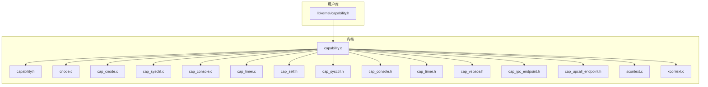
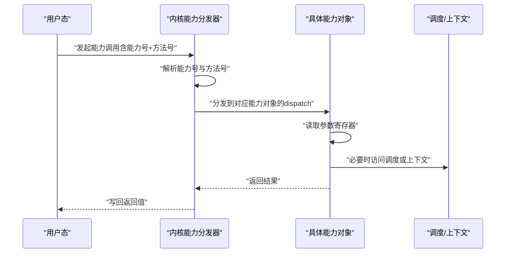
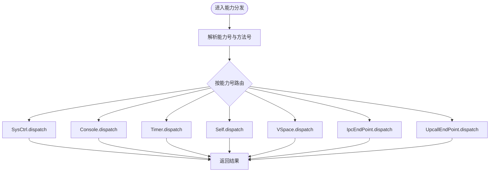
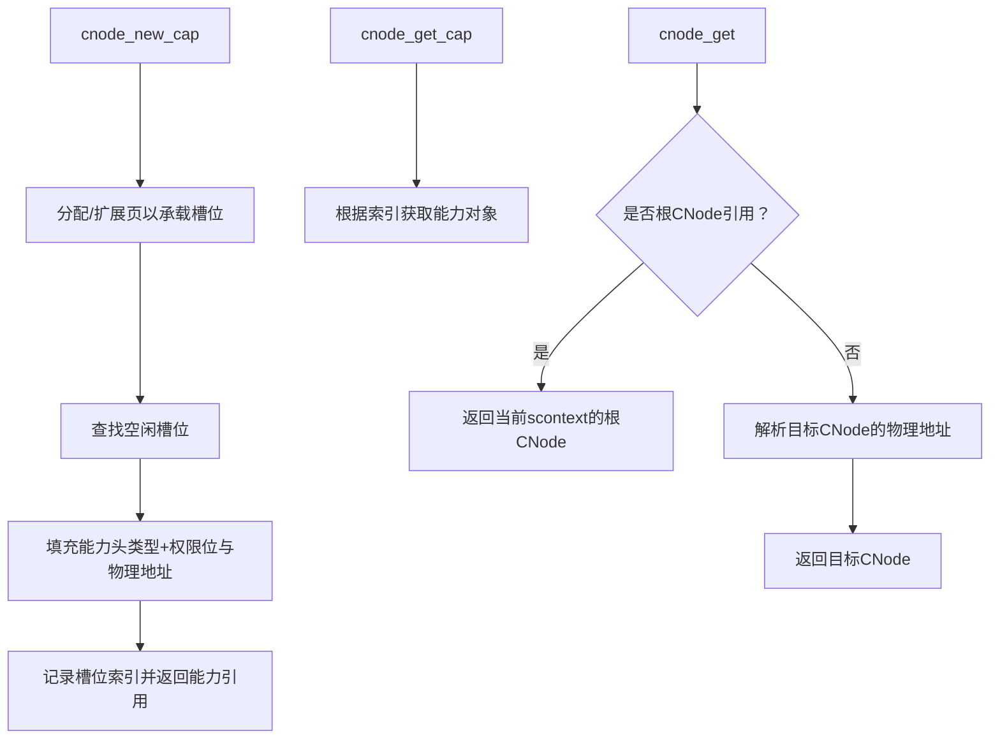
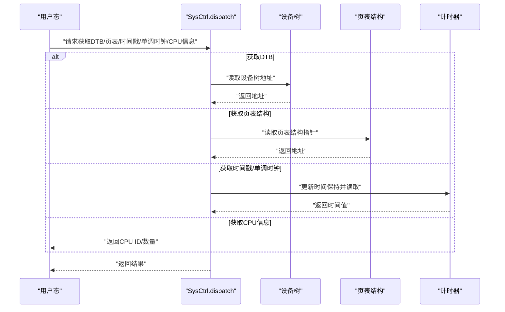
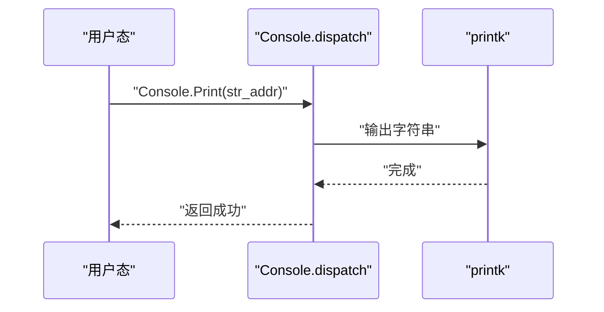
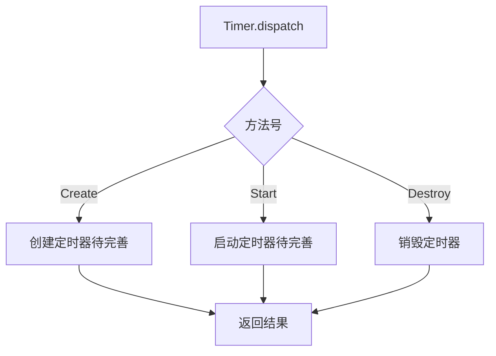
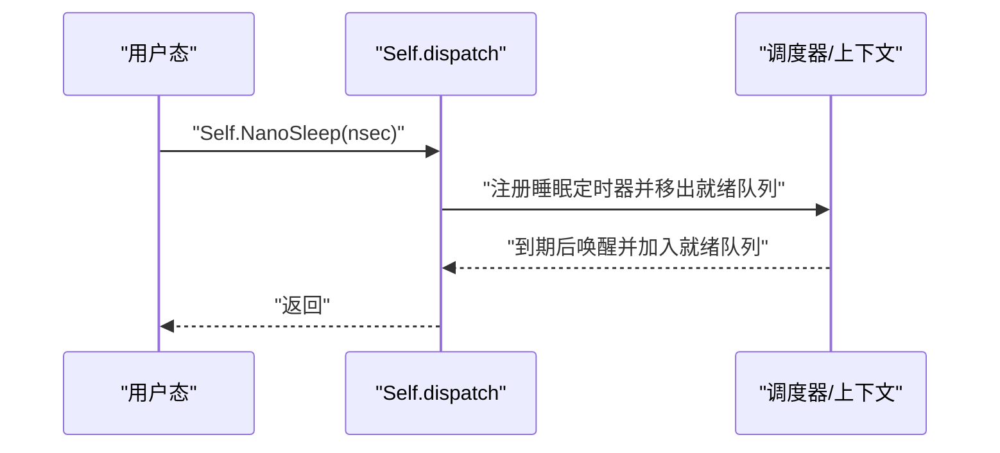
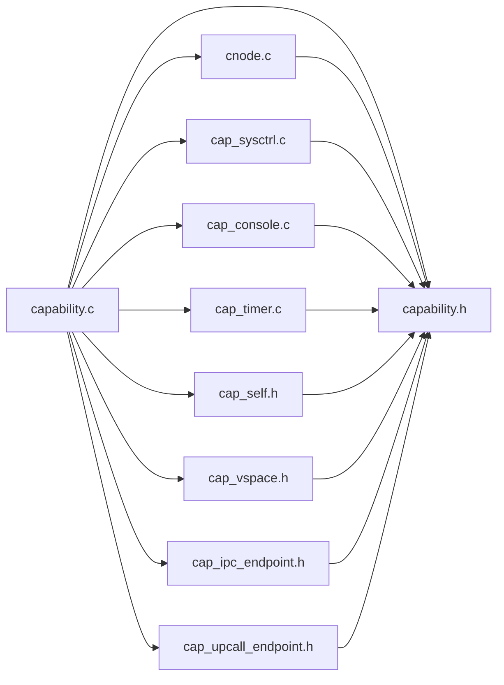

# 权限控制系统

<cite>
**本文引用的文件**
- [capability.c](file://kernel/capability/capability.c)
- [capability.h](file://kernel/include/capability/capability.h)
- [cnode.c](file://kernel/capability/cnode.c)
- [cap_cnode.c](file://kernel/capability/cap_cnode.c)
- [cap_sysctrl.c](file://kernel/capability/cap_sysctrl.c)
- [cap_console.c](file://kernel/capability/cap_console.c)
- [cap_timer.c](file://kernel/capability/cap_timer.c)
- [cap_self.h](file://kernel/include/capability/cap_self.h)
- [cap_sysctrl.h](file://kernel/include/capability/cap_sysctrl.h)
- [cap_console.h](file://kernel/include/capability/cap_console.h)
- [cap_timer.h](file://kernel/include/capability/cap_timer.h)
- [capability.h（用户库）](file://ulibs/include/libkernel/capability.h)
- [scontext.c](file://kernel/context/scontext.c)
- [xcontext.c](file://kernel/context/xcontext.c)
- [cap_vspace.h](file://kernel/include/capability/cap_vspace.h)
- [cap_ipc_endpoint.h](file://kernel/include/capability/cap_ipc_endpoint.h)
- [cap_upcall_endpoint.h](file://kernel/include/capability/cap_upcall_endpoint.h)
</cite>

## 目录
1. [引言](#引言)
2. [项目结构](#项目结构)
3. [核心组件](#核心组件)
4. [架构总览](#架构总览)
5. [详细组件分析](#详细组件分析)
6. [依赖关系分析](#依赖关系分析)
7. [性能考量](#性能考量)
8. [故障排除指南](#故障排除指南)
9. [结论](#结论)
10. [附录](#附录)

## 引言
本文件系统性梳理TranquilOS的权限控制系统，重点解释基于能力（Capability）的权限模型与实现机制，覆盖权限类型、权限位定义、权限检查时机与流程（内核态与用户态）、典型权限对象（系统控制、控制台、定时器、地址空间、IPC端点、上行调用端点、自引用）的实现方式，并给出使用示例、继承与传递机制、安全最佳实践以及常见漏洞与调试排障建议。

## 项目结构
权限控制相关代码主要分布在以下位置：
- 内核能力分发与通用数据结构：kernel/capability 与 kernel/include/capability
- 用户态能力接口与枚举：ulibs/include/libkernel/capability.h
- 上下文与调度：kernel/context 与 kernel/include/scontext、xcontext
- 典型能力对象实现：各 cap_*.c 文件

图表来源
- [capability.c](file://kernel/capability/capability.c#L14-L54)
- [capability.h](file://kernel/include/capability/capability.h#L11-L24)
- [cnode.c](file://kernel/capability/cnode.c#L23-L59)
- [cap_cnode.c](file://kernel/capability/cap_cnode.c#L23-L41)
- [cap_sysctrl.c](file://kernel/capability/cap_sysctrl.c#L69-L96)
- [cap_console.c](file://kernel/capability/cap_console.c#L24-L39)
- [cap_timer.c](file://kernel/capability/cap_timer.c#L19-L34)
- [cap_self.h](file://kernel/include/capability/cap_self.h#L7-L10)
- [cap_sysctrl.h](file://kernel/include/capability/cap_sysctrl.h#L7-L10)
- [cap_console.h](file://kernel/include/capability/cap_console.h#L7-L10)
- [cap_timer.h](file://kernel/include/capability/cap_timer.h#L7-L10)
- [capability.h（用户库）](file://ulibs/include/libkernel/capability.h#L6-L41)
- [scontext.c](file://kernel/context/scontext.c#L32-L68)
- [xcontext.c](file://kernel/context/xcontext.c#L4-L11)

章节来源
- [capability.c](file://kernel/capability/capability.c#L14-L54)
- [capability.h](file://kernel/include/capability/capability.h#L11-L24)
- [capability.h（用户库）](file://ulibs/include/libkernel/capability.h#L6-L41)

## 核心组件
- 能力头与能力对象
  - 能力头包含类型与权限位字段，能力对象包含头与物理地址指针。
  - 权限位采用32位rights掩码，支持按位区分不同操作权限。
- 能力分发器
  - 通过cap_call_dispatch解析能力号与方法号，路由到对应能力对象的dispatch函数。
  - 当前实现中存在“TODO: permission check”注释，表明权限检查尚未完全实现。
- 能力节点（CNode）
  - 提供能力槽位管理、扩展与插入能力的能力。
  - 支持通过引用定位目标CNode，用于跨节点传递能力。
- 典型能力对象
  - 系统控制（SysCtrl）：提供获取设备树、页表结构、时间戳、CPU信息等方法。
  - 控制台（Console）：提供创建、打印、销毁方法。
  - 定时器（Timer）：提供创建、启动、销毁方法。
  - 自引用（Self）：提供让当前线程让出、睡眠、查询调用者PID等方法。
  - 地址空间（VSpace）：虚拟内存空间管理能力（接口声明在头文件中）。
  - IPC端点（IpcEndPoint）：进程间通信端点能力（接口声明在头文件中）。
  - 上行调用端点（UpcallEndPoint）：上行回调端点能力（接口声明在头文件中）。

章节来源
- [capability.h](file://kernel/include/capability/capability.h#L11-L24)
- [capability.c](file://kernel/capability/capability.c#L14-L54)
- [cnode.c](file://kernel/capability/cnode.c#L23-L59)
- [cap_sysctrl.c](file://kernel/capability/cap_sysctrl.c#L69-L96)
- [cap_console.c](file://kernel/capability/cap_console.c#L24-L39)
- [cap_timer.c](file://kernel/capability/cap_timer.c#L19-L34)
- [cap_self.h](file://kernel/include/capability/cap_self.h#L7-L10)
- [cap_vspace.h](file://kernel/include/capability/cap_vspace.h#L7-L10)
- [cap_ipc_endpoint.h](file://kernel/include/capability/cap_ipc_endpoint.h#L7-L10)
- [cap_upcall_endpoint.h](file://kernel/include/capability/cap_upcall_endpoint.h#L7-L10)

## 架构总览
TranquilOS的权限控制采用“能力即权限”的模型：每个能力对象携带类型与权限位，调用方通过能力引用发起能力调用，内核根据能力类型与方法号进行分发，并在后续阶段实施权限检查。

图表来源
- [capability.c](file://kernel/capability/capability.c#L14-L54)
- [cap_sysctrl.c](file://kernel/capability/cap_sysctrl.c#L69-L96)
- [cap_console.c](file://kernel/capability/cap_console.c#L24-L39)
- [cap_timer.c](file://kernel/capability/cap_timer.c#L19-L34)
- [scontext.c](file://kernel/context/scontext.c#L32-L68)
- [xcontext.c](file://kernel/context/xcontext.c#L4-L11)

## 详细组件分析

### 能力分发与通用结构
- 能力头与能力对象
  - 能力头包含类型与权限位；能力对象包含头与物理地址指针，用于指向具体内核对象或数据结构。
- 能力分发器
  - 解析调用号中的能力号与方法号，按类型分发到相应能力对象的dispatch函数。
  - 返回值通过寄存器写回用户态。
- 权限检查现状
  - 分发器中存在“TODO: permission check”，表明当前未对调用方的权限进行校验，存在安全风险。

图表来源
- [capability.c](file://kernel/capability/capability.c#L14-L54)

章节来源
- [capability.h](file://kernel/include/capability/capability.h#L11-L24)
- [capability.c](file://kernel/capability/capability.c#L14-L54)

### 能力节点（CNode）
- 职责
  - 管理能力槽位，支持扩展与插入新能力。
  - 通过引用定位目标CNode，实现能力的跨节点传递。
- 关键流程
  - 新建能力：选择空闲槽位，填充类型、权限位与物理地址。
  - 获取能力：根据引用索引从槽位集合中取出能力。
  - 获取CNode：解析引用，定位目标CNode。

图表来源
- [cnode.c](file://kernel/capability/cnode.c#L23-L59)
- [cnode.c](file://kernel/capability/cnode.c#L66-L89)

章节来源
- [cnode.c](file://kernel/capability/cnode.c#L23-L59)
- [cnode.c](file://kernel/capability/cnode.c#L66-L89)
- [cap_cnode.c](file://kernel/capability/cap_cnode.c#L23-L41)

### 系统控制（SysCtrl）
- 方法族
  - 获取设备树地址、页表结构、时间戳、单调时钟、CPU ID与CPU数量等。
- 实现要点
  - 通过全局子系统接口（如设备树、页表、计时器）读取所需信息并返回。
  - 部分方法需要更新时间保持状态后再返回。

图表来源
- [cap_sysctrl.c](file://kernel/capability/cap_sysctrl.c#L69-L96)

章节来源
- [cap_sysctrl.c](file://kernel/capability/cap_sysctrl.c#L69-L96)
- [cap_sysctrl.h](file://kernel/include/capability/cap_sysctrl.h#L7-L10)

### 控制台（Console）
- 方法族
  - 创建、打印、销毁。
- 实现要点
  - 打印方法直接输出字符串，当前未对目标控制台进行隔离限制（存在“TODO: print to thread's own console”注释）。

图表来源
- [cap_console.c](file://kernel/capability/cap_console.c#L17-L22)

章节来源
- [cap_console.c](file://kernel/capability/cap_console.c#L24-L39)
- [cap_console.h](file://kernel/include/capability/cap_console.h#L7-L10)

### 定时器（Timer）
- 方法族
  - 创建、启动、销毁。
- 实现要点
  - 启动方法当前为空实现，权限检查亦未生效（存在“TODO”注释）。

图表来源
- [cap_timer.c](file://kernel/capability/cap_timer.c#L19-L34)

章节来源
- [cap_timer.c](file://kernel/capability/cap_timer.c#L19-L34)
- [cap_timer.h](file://kernel/include/capability/cap_timer.h#L7-L10)

### 自引用（Self）
- 方法族
  - 让出、纳秒级睡眠、获取调用者PID。
- 实现要点
  - 与当前线程的调度上下文交互，可能涉及睡眠队列与调度器。

图表来源
- [scontext.c](file://kernel/context/scontext.c#L47-L68)
- [xcontext.c](file://kernel/context/xcontext.c#L4-L11)

章节来源
- [cap_self.h](file://kernel/include/capability/cap_self.h#L7-L10)
- [scontext.c](file://kernel/context/scontext.c#L47-L68)
- [xcontext.c](file://kernel/context/xcontext.c#L4-L11)

### 地址空间（VSpace）、IPC端点（IpcEndPoint）、上行调用端点（UpcallEndPoint）
- 接口声明
  - 三类能力均在头文件中声明了创建与销毁权限位，dispatch函数原型已定义。
- 实现现状
  - 头文件中声明了权限位与dispatch函数，但具体实现文件未在当前上下文中出现，需结合实际实现补充。

章节来源
- [cap_vspace.h](file://kernel/include/capability/cap_vspace.h#L7-L10)
- [cap_ipc_endpoint.h](file://kernel/include/capability/cap_ipc_endpoint.h#L7-L10)
- [cap_upcall_endpoint.h](file://kernel/include/capability/cap_upcall_endpoint.h#L7-L10)

## 依赖关系分析
- 能力分发器依赖于各能力对象的dispatch函数与用户库提供的能力号/方法号枚举。
- 能力节点依赖于内存分配器与调度上下文，用于扩展槽位与定位目标CNode。
- 典型能力对象依赖于内核子系统（设备树、页表、计时器、调度器等）。

图表来源
- [capability.c](file://kernel/capability/capability.c#L1-L12)
- [capability.h](file://kernel/include/capability/capability.h#L1-L26)
- [cnode.c](file://kernel/capability/cnode.c#L1-L6)
- [cap_sysctrl.c](file://kernel/capability/cap_sysctrl.c#L1-L12)
- [cap_console.c](file://kernel/capability/cap_console.c#L1-L6)
- [cap_timer.c](file://kernel/capability/cap_timer.c#L1-L6)
- [cap_self.h](file://kernel/include/capability/cap_self.h#L1-L12)
- [cap_vspace.h](file://kernel/include/capability/cap_vspace.h#L1-L12)
- [cap_ipc_endpoint.h](file://kernel/include/capability/cap_ipc_endpoint.h#L1-L12)
- [cap_upcall_endpoint.h](file://kernel/include/capability/cap_upcall_endpoint.h#L1-L12)

章节来源
- [capability.c](file://kernel/capability/capability.c#L1-L12)
- [capability.h](file://kernel/include/capability/capability.h#L1-L26)

## 性能考量
- 能力分发路径应尽量短路与内联，避免不必要的上下文切换。
- CNode扩展与槽位分配应批量进行，减少频繁页分配带来的开销。
- 对于高频率调用的方法（如打印、时间查询），可考虑缓存最近值以降低重复计算成本。
- 权限检查应在分发器早期进行，尽早失败以减少后续处理开销。

## 故障排除指南
- 能力调用无响应或返回错误
  - 检查能力号与方法号是否匹配用户库枚举。
  - 确认目标能力对象的dispatch函数是否被正确调用。
- CNode相关问题
  - 若扩展失败，确认页分配器初始化与可用内存充足。
  - 若获取能力失败，检查引用格式与目标CNode是否有效。
- SysCtrl方法异常
  - 设备树或页表结构未初始化会导致读取失败，需先完成系统初始化。
  - 单调时钟未更新可能导致时间不准确，需确保计时器管理器正常工作。
- Console打印异常
  - 当前实现未隔离到线程专属控制台，若多线程并发打印可能产生竞争，建议在应用层串行化或在内核侧完善隔离。
- Timer启动无效
  - 启动方法当前为空实现，需补充定时器启动逻辑与权限检查。
- Self相关问题
  - 睡眠与唤醒依赖调度器与计时器，若调度器未初始化或计时器异常，将导致睡眠无法生效。

章节来源
- [capability.c](file://kernel/capability/capability.c#L20-L21)
- [cnode.c](file://kernel/capability/cnode.c#L15-L21)
- [cnode.c](file://kernel/capability/cnode.c#L34-L47)
- [cap_sysctrl.c](file://kernel/capability/cap_sysctrl.c#L14-L27)
- [cap_console.c](file://kernel/capability/cap_console.c#L17-L22)
- [cap_timer.c](file://kernel/capability/cap_timer.c#L13-L17)
- [scontext.c](file://kernel/context/scontext.c#L47-L68)

## 结论
TranquilOS的权限控制以能力为核心，通过能力头与权限位实现细粒度权限管理，能力分发器负责将调用路由至具体能力对象。当前实现中，权限检查尚未完全落地，存在较大的安全风险。建议尽快补齐权限检查逻辑，并完善Console、Timer等能力对象的具体实现，同时加强CNode扩展与能力传递的安全性与可靠性。

## 附录

### 权限类型与方法一览（来自用户库）
- 能力类型枚举与字符串映射
- 能力引用格式（CNode ID + 槽位索引）
- 各能力对象的方法枚举（CNode、Console、SysCtrl、Self、Timer、VSpace、IpcEndPoint、UpcallEndPoint）

章节来源
- [capability.h（用户库）](file://ulibs/include/libkernel/capability.h#L6-L41)
- [capability.h（用户库）](file://ulibs/include/libkernel/capability.h#L44-L50)
- [capability.h（用户库）](file://ulibs/include/libkernel/capability.h#L52-L141)