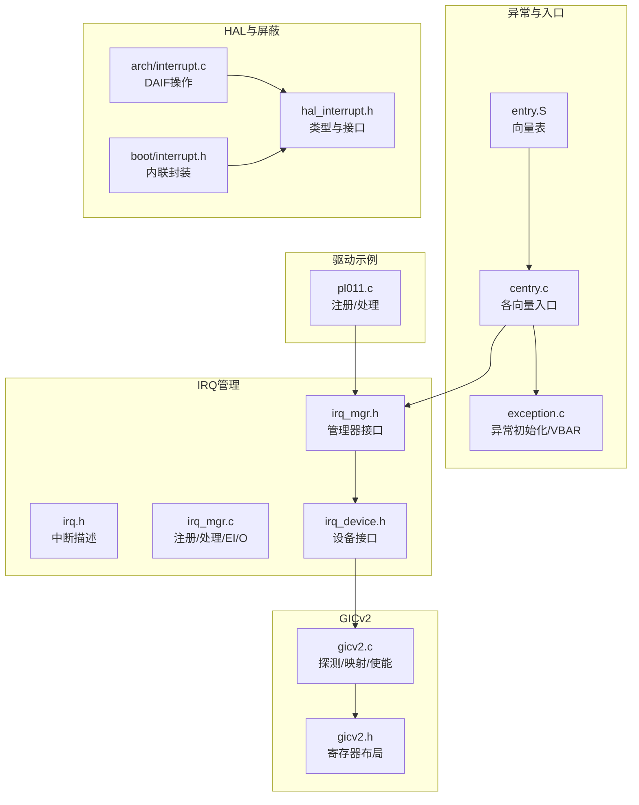
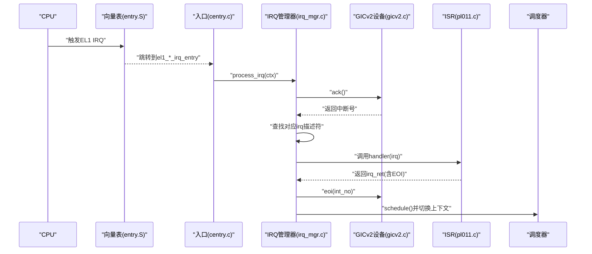
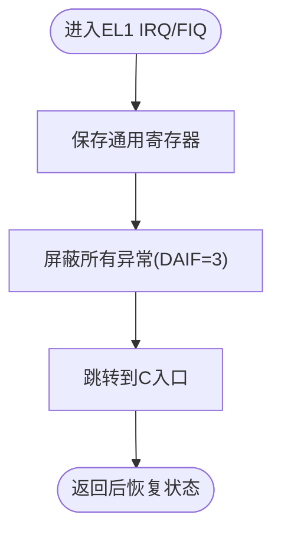
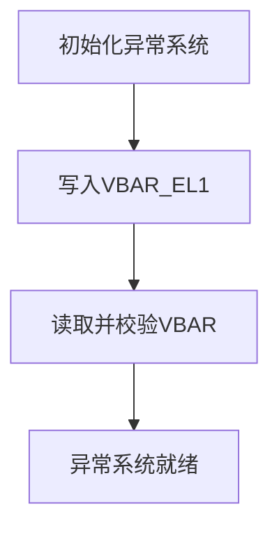
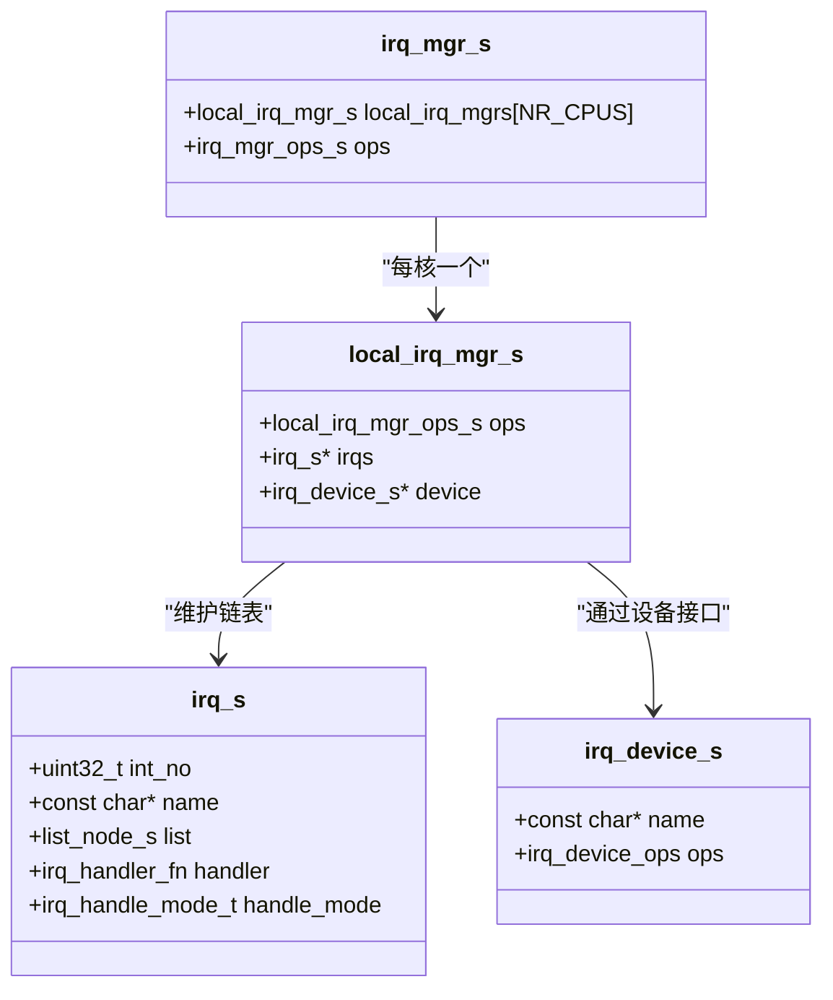
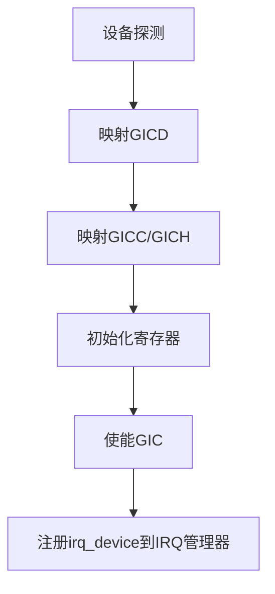
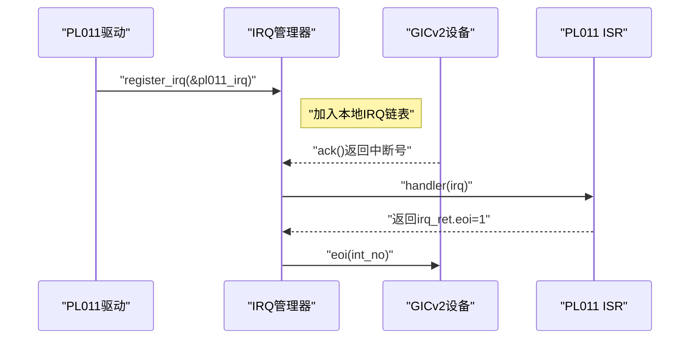
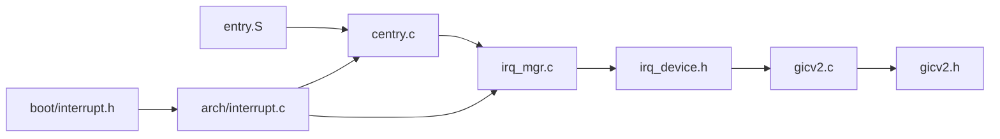

# 中断处理系统

<cite>
**本文引用的文件**
- [kernel/arch/arm64/interrupt.c](file://kernel/arch/arm64/interrupt.c)
- [boot/include/arch/arm64/interrupt.h](file://boot/include/arch/arm64/interrupt.h)
- [kernel/include/arch/generic/hal_interrupt.h](file://kernel/include/arch/generic/hal_interrupt.h)
- [kernel/arch/arm64/entry/entry.S](file://kernel/arch/arm64/entry/entry.S)
- [kernel/arch/arm64/entry/centry.c](file://kernel/arch/arm64/entry/centry.c)
- [kernel/arch/arm64/exception.c](file://kernel/arch/arm64/exception.c)
- [kernel/include/arch/arm64/exception.h](file://kernel/include/arch/arm64/exception.h)
- [kernel/include/interrupt/irq_mgr.h](file://kernel/include/interrupt/irq_mgr.h)
- [kernel/interrupt/irq_mgr.c](file://kernel/interrupt/irq_mgr.c)
- [kernel/include/interrupt/irq.h](file://kernel/include/interrupt/irq.h)
- [kernel/include/interrupt/device/irq_device.h](file://kernel/include/interrupt/device/irq_device.h)
- [kernel/drivers/arm-gic/gicv2.h](file://kernel/drivers/arm-gic/gicv2.h)
- [kernel/drivers/arm-gic/gicv2.c](file://kernel/drivers/arm-gic/gicv2.c)
- [kernel/drivers/arm-uart/pl011.c](file://kernel/drivers/arm-uart/pl011.c)
- [kernel/include/arch/arm64/cpu.h](file://kernel/include/arch/arm64/cpu.h)
- [kernel/include/cpulocal.h](file://kernel/include/cpulocal.h)
</cite>

## 目录
1. [引言](#引言)
2. [项目结构](#项目结构)
3. [核心组件](#核心组件)
4. [架构总览](#架构总览)
5. [详细组件分析](#详细组件分析)
6. [依赖关系分析](#依赖关系分析)
7. [性能考量](#性能考量)
8. [故障排查指南](#故障排查指南)
9. [结论](#结论)
10. [附录](#附录)

## 引言
本文件面向TranquilOS在ARM64平台上的中断处理系统，系统性阐述中断控制器管理（GICv2）、IRQ管理器与中断服务例程（ISR）处理流程，覆盖中断初始化、向量表配置、优先级与目标路由、中断嵌套与屏蔽、以及实时性保障策略。文档同时提供可直接定位到源码的路径示例，帮助读者快速定位实现细节，并给出常见问题的诊断与修复建议。

## 项目结构
围绕ARM64中断处理的关键目录与文件如下：
- 架构相关入口与异常向量：entry.S、centry.c、exception.c
- HAL层中断控制：arch/arm64/interrupt.c、boot/include/arch/arm64/interrupt.h、include/arch/generic/hal_interrupt.h
- IRQ抽象与管理：include/interrupt/irq.h、include/interrupt/irq_mgr.h、interrupt/irq_mgr.c
- 设备接口：include/interrupt/device/irq_device.h
- GICv2控制器：drivers/arm-gic/gicv2.h、drivers/arm-gic/gicv2.c
- 驱动示例：drivers/arm-uart/pl011.c
- 上下文与CPU本地数据：include/arch/arm64/cpu.h、include/cpulocal.h

**图表来源**
- [kernel/arch/arm64/entry/entry.S](file://kernel/arch/arm64/entry/entry.S#L65-L108)
- [kernel/arch/arm64/entry/centry.c](file://kernel/arch/arm64/entry/centry.c#L18-L97)
- [kernel/arch/arm64/exception.c](file://kernel/arch/arm64/exception.c#L108-L117)
- [kernel/include/arch/generic/hal_interrupt.h](file://kernel/include/arch/generic/hal_interrupt.h#L7-L30)
- [kernel/arch/arm64/interrupt.c](file://kernel/arch/arm64/interrupt.c#L5-L66)
- [boot/include/arch/arm64/interrupt.h](file://boot/include/arch/arm64/interrupt.h#L8-L46)
- [kernel/include/interrupt/irq.h](file://kernel/include/interrupt/irq.h#L8-L38)
- [kernel/include/interrupt/irq_mgr.h](file://kernel/include/interrupt/irq_mgr.h#L14-L41)
- [kernel/interrupt/irq_mgr.c](file://kernel/interrupt/irq_mgr.c#L13-L83)
- [kernel/include/interrupt/device/irq_device.h](file://kernel/include/interrupt/device/irq_device.h#L15-L31)
- [kernel/drivers/arm-gic/gicv2.h](file://kernel/drivers/arm-gic/gicv2.h#L15-L102)
- [kernel/drivers/arm-gic/gicv2.c](file://kernel/drivers/arm-gic/gicv2.c#L216-L379)
- [kernel/drivers/arm-uart/pl011.c](file://kernel/drivers/arm-uart/pl011.c#L73-L90)

**章节来源**
- [kernel/arch/arm64/entry/entry.S](file://kernel/arch/arm64/entry/entry.S#L65-L108)
- [kernel/arch/arm64/entry/centry.c](file://kernel/arch/arm64/entry/centry.c#L18-L97)
- [kernel/arch/arm64/exception.c](file://kernel/arch/arm64/exception.c#L108-L117)
- [kernel/include/arch/generic/hal_interrupt.h](file://kernel/include/arch/generic/hal_interrupt.h#L7-L30)
- [kernel/arch/arm64/interrupt.c](file://kernel/arch/arm64/interrupt.c#L5-L66)
- [boot/include/arch/arm64/interrupt.h](file://boot/include/arch/arm64/interrupt.h#L8-L46)
- [kernel/include/interrupt/irq.h](file://kernel/include/interrupt/irq.h#L8-L38)
- [kernel/include/interrupt/irq_mgr.h](file://kernel/include/interrupt/irq_mgr.h#L14-L41)
- [kernel/interrupt/irq_mgr.c](file://kernel/interrupt/irq_mgr.c#L13-L83)
- [kernel/include/interrupt/device/irq_device.h](file://kernel/include/interrupt/device/irq_device.h#L15-L31)
- [kernel/drivers/arm-gic/gicv2.h](file://kernel/drivers/arm-gic/gicv2.h#L15-L102)
- [kernel/drivers/arm-gic/gicv2.c](file://kernel/drivers/arm-gic/gicv2.c#L216-L379)
- [kernel/drivers/arm-uart/pl011.c](file://kernel/drivers/arm-uart/pl011.c#L73-L90)

## 核心组件
- HAL中断控制（DAIF位域）：提供全局与分类（普通/快速/系统错误/调试）中断开关、状态保存与恢复。
- 异常向量与入口：配置VBAR并建立EL1各模式下的同步/IRQ/FIQ/SError入口，统一交由IRQ管理器处理。
- IRQ管理器：维护每核本地IRQ链表、查询中断号、调用对应ISR并完成EIO，随后进行调度切换。
- GICv2设备：抽象GICv2分发器/处理器寄存器访问，提供使能/禁用、优先级/目标设置、ACK/EOI等。
- 驱动示例：以PL011为例展示如何注册中断、编写ISR并返回EOI标志。

**章节来源**
- [kernel/include/arch/generic/hal_interrupt.h](file://kernel/include/arch/generic/hal_interrupt.h#L7-L30)
- [kernel/arch/arm64/interrupt.c](file://kernel/arch/arm64/interrupt.c#L5-L66)
- [kernel/arch/arm64/entry/entry.S](file://kernel/arch/arm64/entry/entry.S#L65-L108)
- [kernel/arch/arm64/entry/centry.c](file://kernel/arch/arm64/entry/centry.c#L78-L97)
- [kernel/include/interrupt/irq.h](file://kernel/include/interrupt/irq.h#L8-L38)
- [kernel/include/interrupt/irq_mgr.h](file://kernel/include/interrupt/irq_mgr.h#L14-L41)
- [kernel/interrupt/irq_mgr.c](file://kernel/interrupt/irq_mgr.c#L13-L83)
- [kernel/include/interrupt/device/irq_device.h](file://kernel/include/interrupt/device/irq_device.h#L15-L31)
- [kernel/drivers/arm-gic/gicv2.h](file://kernel/drivers/arm-gic/gicv2.h#L15-L102)
- [kernel/drivers/arm-gic/gicv2.c](file://kernel/drivers/arm-gic/gicv2.c#L153-L214)
- [kernel/drivers/arm-uart/pl011.c](file://kernel/drivers/arm-uart/pl011.c#L54-L71)

## 架构总览
ARM64中断处理从异常向量表开始，EL1的IRQ/FIQ入口最终委托给IRQ管理器；IRQ管理器通过设备接口从GICv2读取中断号、查找已注册的中断描述符、调用ISR并完成EOI；最后根据调度器结果切换上下文。

**图表来源**
- [kernel/arch/arm64/entry/entry.S](file://kernel/arch/arm64/entry/entry.S#L65-L108)
- [kernel/arch/arm64/entry/centry.c](file://kernel/arch/arm64/entry/centry.c#L78-L97)
- [kernel/interrupt/irq_mgr.c](file://kernel/interrupt/irq_mgr.c#L49-L83)
- [kernel/drivers/arm-gic/gicv2.c](file://kernel/drivers/arm-gic/gicv2.c#L179-L185)
- [kernel/drivers/arm-uart/pl011.c](file://kernel/drivers/arm-uart/pl011.c#L54-L60)

## 详细组件分析

### HAL中断控制（DAIF）
- 提供全局与分类中断开关、状态保存与恢复，用于屏蔽不同类型的异常（普通IRQ、FIQ、系统错误、调试）。
- 在汇编入口中，进入EL1 IRQ/FIQ时会先屏蔽所有异常，再保存寄存器并跳转到C入口。

**图表来源**
- [kernel/arch/arm64/entry/entry.S](file://kernel/arch/arm64/entry/entry.S#L25-L30)
- [kernel/arch/arm64/interrupt.c](file://kernel/arch/arm64/interrupt.c#L7-L13)
- [boot/include/arch/arm64/interrupt.h](file://boot/include/arch/arm64/interrupt.h#L16-L30)

**章节来源**
- [kernel/arch/arm64/interrupt.c](file://kernel/arch/arm64/interrupt.c#L5-L66)
- [boot/include/arch/arm64/interrupt.h](file://boot/include/arch/arm64/interrupt.h#L8-L46)
- [kernel/include/arch/generic/hal_interrupt.h](file://kernel/include/arch/generic/hal_interrupt.h#L7-L30)
- [kernel/arch/arm64/entry/entry.S](file://kernel/arch/arm64/entry/entry.S#L25-L30)

### 异常向量表与初始化
- 向量表按EL与来源（当前EL/低EL）划分，对IRQ/FIQ/Serror分别建立入口。
- 初始化时写入VBAR指向异常表，并校验对齐要求。

**图表来源**
- [kernel/arch/arm64/exception.c](file://kernel/arch/arm64/exception.c#L108-L117)
- [kernel/arch/arm64/entry/entry.S](file://kernel/arch/arm64/entry/entry.S#L65-L108)

**章节来源**
- [kernel/arch/arm64/exception.c](file://kernel/arch/arm64/exception.c#L108-L117)
- [kernel/arch/arm64/entry/entry.S](file://kernel/arch/arm64/entry/entry.S#L65-L108)

### IRQ管理器与ISR处理
- 每核维护本地IRQ管理器，负责注册中断描述符、按中断号查找、调用ISR并完成EOI。
- 处理完成后获取本地调度器并进行上下文切换。

**图表来源**
- [kernel/include/interrupt/irq.h](file://kernel/include/interrupt/irq.h#L28-L38)
- [kernel/include/interrupt/irq_mgr.h](file://kernel/include/interrupt/irq_mgr.h#L23-L41)
- [kernel/interrupt/irq_mgr.c](file://kernel/interrupt/irq_mgr.c#L13-L83)
- [kernel/include/interrupt/device/irq_device.h](file://kernel/include/interrupt/device/irq_device.h#L27-L31)

**章节来源**
- [kernel/include/interrupt/irq.h](file://kernel/include/interrupt/irq.h#L8-L38)
- [kernel/include/interrupt/irq_mgr.h](file://kernel/include/interrupt/irq_mgr.h#L14-L41)
- [kernel/interrupt/irq_mgr.c](file://kernel/interrupt/irq_mgr.c#L13-L83)
- [kernel/include/interrupt/device/irq_device.h](file://kernel/include/interrupt/device/irq_device.h#L15-L31)

### GICv2控制器与设备接口
- GICv2提供分发器（Distributor）与CPU接口（GICC/GICH），支持使能/禁能、优先级、目标CPU、ACK/EOI等。
- 设备探测阶段映射寄存器、清零状态寄存器、注册设备到IRQ管理器。

**图表来源**
- [kernel/drivers/arm-gic/gicv2.c](file://kernel/drivers/arm-gic/gicv2.c#L216-L276)
- [kernel/drivers/arm-gic/gicv2.c](file://kernel/drivers/arm-gic/gicv2.c#L296-L357)
- [kernel/drivers/arm-gic/gicv2.c](file://kernel/drivers/arm-gic/gicv2.c#L201-L214)

**章节来源**
- [kernel/drivers/arm-gic/gicv2.h](file://kernel/drivers/arm-gic/gicv2.h#L15-L102)
- [kernel/drivers/arm-gic/gicv2.c](file://kernel/drivers/arm-gic/gicv2.c#L153-L214)
- [kernel/drivers/arm-gic/gicv2.c](file://kernel/drivers/arm-gic/gicv2.c#L216-L379)

### 驱动示例：PL011串口中断
- 驱动在探测阶段完成硬件初始化，随后在关键阶段初始化函数中注册中断描述符至IRQ管理器。
- ISR简单打印日志并返回EOI标志，驱动侧通常结合自旋锁保护共享资源。

**图表来源**
- [kernel/drivers/arm-uart/pl011.c](file://kernel/drivers/arm-uart/pl011.c#L54-L71)
- [kernel/drivers/arm-uart/pl011.c](file://kernel/drivers/arm-uart/pl011.c#L73-L90)
- [kernel/interrupt/irq_mgr.c](file://kernel/interrupt/irq_mgr.c#L13-L28)
- [kernel/drivers/arm-gic/gicv2.c](file://kernel/drivers/arm-gic/gicv2.c#L179-L185)

**章节来源**
- [kernel/drivers/arm-uart/pl011.c](file://kernel/drivers/arm-uart/pl011.c#L54-L90)

### 中断初始化流程与向量表配置
- 异常向量表在entry.S中定义，按模式与来源排列；VBAR在exception.c中写入并校验。
- GICv2在早期设备初始化阶段被探测与映射，随后注册为IRQ设备。
- HAL层提供DAIF操作，配合入口宏在进入IRQ/FIQ时自动屏蔽异常。

**章节来源**
- [kernel/arch/arm64/entry/entry.S](file://kernel/arch/arm64/entry/entry.S#L65-L108)
- [kernel/arch/arm64/exception.c](file://kernel/arch/arm64/exception.c#L108-L117)
- [kernel/drivers/arm-gic/gicv2.c](file://kernel/drivers/arm-gic/gicv2.c#L288-L294)
- [kernel/drivers/arm-gic/gicv2.c](file://kernel/drivers/arm-gic/gicv2.c#L369-L375)
- [kernel/arch/arm64/interrupt.c](file://kernel/arch/arm64/interrupt.c#L7-L13)

### 中断优先级与目标路由
- GICv2通过IPRIORITYRn设置优先级，ITARGETSRn设置目标CPU，ICFGRn设置触发模式。
- IRQ管理器通过设备接口调用相应函数完成配置。

**章节来源**
- [kernel/drivers/arm-gic/gicv2.h](file://kernel/drivers/arm-gic/gicv2.h#L29-L36)
- [kernel/drivers/arm-gic/gicv2.c](file://kernel/drivers/arm-gic/gicv2.c#L103-L127)
- [kernel/drivers/arm-gic/gicv2.c](file://kernel/drivers/arm-gic/gicv2.c#L171-L177)

### 中断嵌套、屏蔽与延迟处理
- 入口在进入IRQ/FIQ时屏蔽异常（DAIF=3），避免同级或更高级别中断打断；HAL提供分类屏蔽接口。
- IRQ处理流程中，ACK后立即调用ISR，处理完成后执行EOI，避免中断悬挂；若需要延迟处理，可在ISR中提交任务或信号通知。

**章节来源**
- [kernel/arch/arm64/entry/entry.S](file://kernel/arch/arm64/entry/entry.S#L25-L30)
- [kernel/arch/arm64/interrupt.c](file://kernel/arch/arm64/interrupt.c#L7-L47)
- [kernel/interrupt/irq_mgr.c](file://kernel/interrupt/irq_mgr.c#L49-L83)

## 依赖关系分析
- 异常向量表依赖VBAR初始化；入口函数依赖IRQ管理器接口；IRQ管理器依赖设备接口；设备接口依赖GICv2寄存器布局。
- HAL中断控制为底层屏蔽/恢复提供统一接口，向上被入口与IRQ管理器使用。

**图表来源**
- [kernel/arch/arm64/entry/entry.S](file://kernel/arch/arm64/entry/entry.S#L65-L108)
- [kernel/arch/arm64/entry/centry.c](file://kernel/arch/arm64/entry/centry.c#L78-L97)
- [kernel/interrupt/irq_mgr.c](file://kernel/interrupt/irq_mgr.c#L49-L83)
- [kernel/include/interrupt/device/irq_device.h](file://kernel/include/interrupt/device/irq_device.h#L15-L31)
- [kernel/drivers/arm-gic/gicv2.c](file://kernel/drivers/arm-gic/gicv2.c#L179-L185)
- [kernel/drivers/arm-gic/gicv2.h](file://kernel/drivers/arm-gic/gicv2.h#L15-L102)
- [kernel/arch/arm64/interrupt.c](file://kernel/arch/arm64/interrupt.c#L7-L13)
- [boot/include/arch/arm64/interrupt.h](file://boot/include/arch/arm64/interrupt.h#L16-L30)

**章节来源**
- [kernel/arch/arm64/entry/entry.S](file://kernel/arch/arm64/entry/entry.S#L65-L108)
- [kernel/arch/arm64/entry/centry.c](file://kernel/arch/arm64/entry/centry.c#L78-L97)
- [kernel/interrupt/irq_mgr.c](file://kernel/interrupt/irq_mgr.c#L49-L83)
- [kernel/include/interrupt/device/irq_device.h](file://kernel/include/interrupt/device/irq_device.h#L15-L31)
- [kernel/drivers/arm-gic/gicv2.c](file://kernel/drivers/arm-gic/gicv2.c#L179-L185)
- [kernel/drivers/arm-gic/gicv2.h](file://kernel/drivers/arm-gic/gicv2.h#L15-L102)
- [kernel/arch/arm64/interrupt.c](file://kernel/arch/arm64/interrupt.c#L7-L13)
- [boot/include/arch/arm64/interrupt.h](file://boot/include/arch/arm64/interrupt.h#L16-L30)

## 性能考量
- 向量表对齐与VBAR设置必须满足对齐约束，避免异常路径额外开销。
- IRQ处理路径尽量短小，避免在ISR中执行重负载逻辑；长任务应移交工作线程或队列。
- 优先级与目标路由合理设置，避免频繁跨核迁移与热点拥塞。
- 使用HAL分类屏蔽接口在必要范围内最小化中断屏蔽时间，减少抖动。

## 故障排查指南
- 中断未触发
  - 检查VBAR是否正确写入且对齐；确认入口函数是否被调用。
  - 确认GICv2已使能且中断号有效；检查设备是否注册到IRQ管理器。
  - 参考路径：[异常初始化](file://kernel/arch/arm64/exception.c#L108-L117)，[向量表](file://kernel/arch/arm64/entry/entry.S#L65-L108)，[GIC使能](file://kernel/drivers/arm-gic/gicv2.c#L139-L151)，[设备注册](file://kernel/drivers/arm-gic/gicv2.c#L201-L214)。
- 中断丢失或悬挂
  - 确保ISR返回时设置EOI标志，IRQ管理器在处理完后调用设备EOI。
  - 参考路径：[IRQ处理流程](file://kernel/interrupt/irq_mgr.c#L49-L83)，[GIC EOI](file://kernel/drivers/arm-gic/gicv2.c#L134-L137)。
- 优先级混乱或抢占异常
  - 检查IPRIORITYRn与ITARGETSRn配置；确认中断号范围与GIC能力一致。
  - 参考路径：[优先级设置](file://kernel/drivers/arm-gic/gicv2.c#L171-L173)，[目标设置](file://kernel/drivers/arm-gic/gicv2.c#L175-L177)，[中断号有效性](file://kernel/drivers/arm-gic/gicv2.c#L30-L41)。
- 处理延迟与抖动
  - 缩短ISR执行时间；使用分类屏蔽最小化屏蔽窗口；合理安排调度。
  - 参考路径：[HAL屏蔽接口](file://kernel/arch/arm64/interrupt.c#L7-L47)，[入口屏蔽](file://kernel/arch/arm64/entry/entry.S#L25-L30)。

**章节来源**
- [kernel/arch/arm64/exception.c](file://kernel/arch/arm64/exception.c#L108-L117)
- [kernel/arch/arm64/entry/entry.S](file://kernel/arch/arm64/entry/entry.S#L65-L108)
- [kernel/drivers/arm-gic/gicv2.c](file://kernel/drivers/arm-gic/gicv2.c#L139-L151)
- [kernel/drivers/arm-gic/gicv2.c](file://kernel/drivers/arm-gic/gicv2.c#L201-L214)
- [kernel/interrupt/irq_mgr.c](file://kernel/interrupt/irq_mgr.c#L49-L83)
- [kernel/drivers/arm-gic/gicv2.c](file://kernel/drivers/arm-gic/gicv2.c#L134-L137)
- [kernel/drivers/arm-gic/gicv2.c](file://kernel/drivers/arm-gic/gicv2.c#L30-L41)
- [kernel/arch/arm64/interrupt.c](file://kernel/arch/arm64/interrupt.c#L7-L47)
- [kernel/arch/arm64/entry/entry.S](file://kernel/arch/arm64/entry/entry.S#L25-L30)

## 结论
TranquilOS在ARM64上的中断处理采用“向量表+HAL屏蔽+IRQ管理器+GICv2设备”的清晰分层设计：入口负责屏蔽与上下文切换，IRQ管理器负责中断号解析与调度，GICv2提供底层控制器能力。通过合理的优先级与目标配置、严格的EOI与最小化ISR执行时间，系统在保证实时性的同时具备良好的可扩展性与可维护性。

## 附录
- 关键实现路径索引
  - HAL中断接口与类型：[hal_interrupt.h](file://kernel/include/arch/generic/hal_interrupt.h#L7-L30)
  - DAIF操作与状态保存/恢复：[arch/interrupt.c](file://kernel/arch/arm64/interrupt.c#L5-L66)
  - 异常向量表与VBAR初始化：[entry.S](file://kernel/arch/arm64/entry/entry.S#L65-L108)，[exception.c](file://kernel/arch/arm64/exception.c#L108-L117)
  - IRQ管理器注册/查询/处理/EI/O：[irq_mgr.h](file://kernel/include/interrupt/irq_mgr.h#L14-L41)，[irq_mgr.c](file://kernel/interrupt/irq_mgr.c#L13-L83)
  - 中断描述符与处理模式：[irq.h](file://kernel/include/interrupt/irq.h#L8-L38)
  - IRQ设备接口与GICv2寄存器布局：[irq_device.h](file://kernel/include/interrupt/device/irq_device.h#L15-L31)，[gicv2.h](file://kernel/drivers/arm-gic/gicv2.h#L15-L102)
  - GICv2探测/映射/使能/ACK/EOI：[gicv2.c](file://kernel/drivers/arm-gic/gicv2.c#L216-L379)
  - PL011中断注册与ISR示例：[pl011.c](file://kernel/drivers/arm-uart/pl011.c#L54-L90)
  - CPU上下文与寄存器布局：[cpu.h](file://kernel/include/arch/arm64/cpu.h#L85-L94)
  - CPU本地数据与地址空间：[cpulocal.h](file://kernel/include/cpulocal.h#L7-L32)