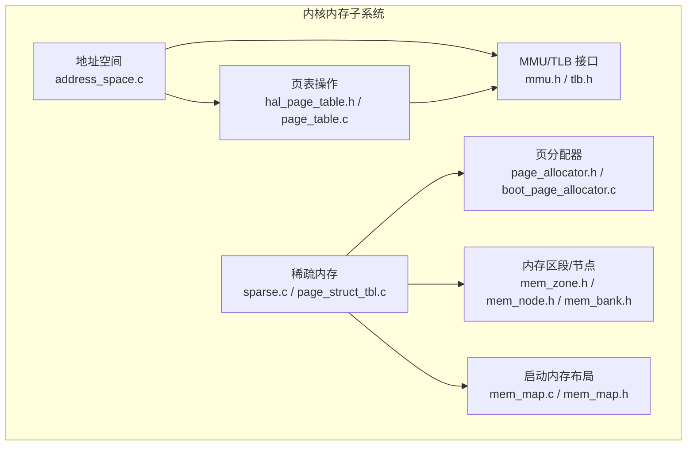
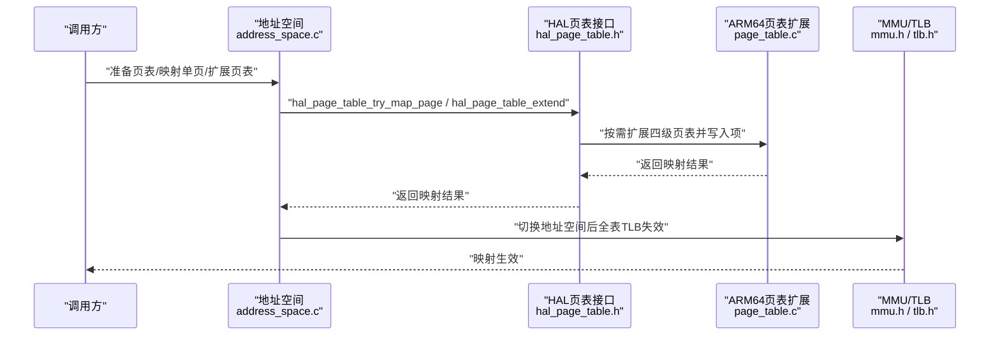
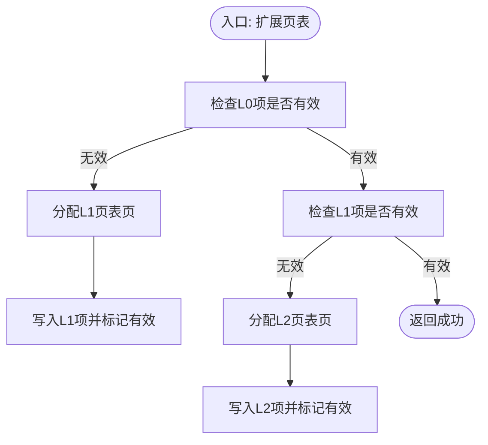
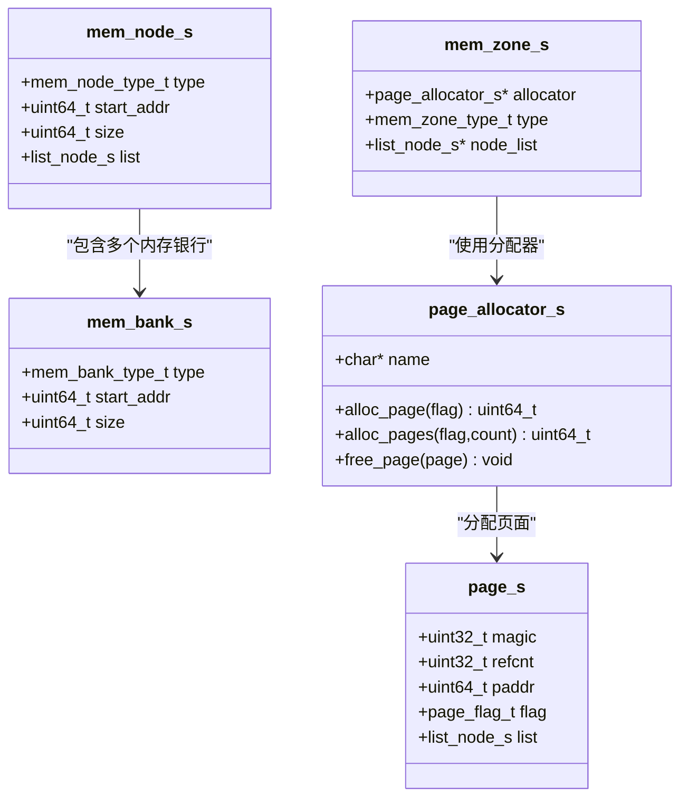
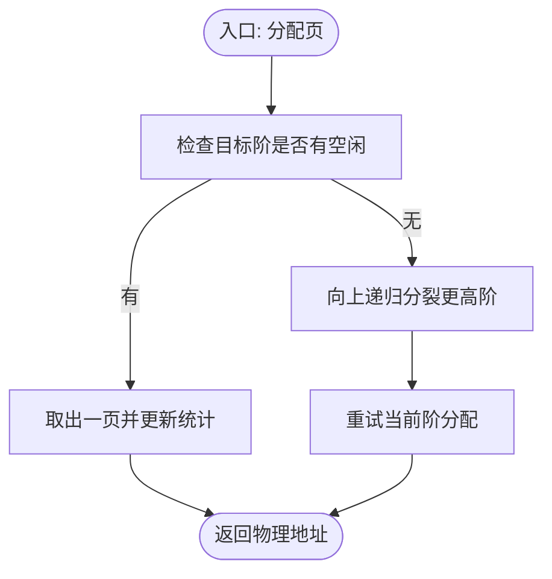
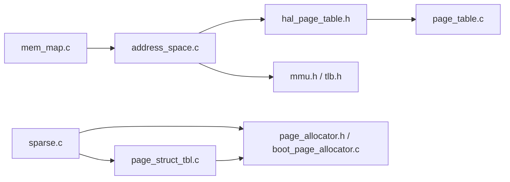

# 内存映射

<cite>
**本文引用的文件**
- [kernel/mm/address_space.c](file://kernel/mm/address_space.c)
- [kernel/include/mm/address_space.h](file://kernel/include/mm/address_space.h)
- [kernel/include/arch/generic/hal_page_table.h](file://kernel/include/arch/generic/hal_page_table.h)
- [kernel/arch/arm64/page_table.c](file://kernel/arch/arm64/page_table.c)
- [kernel/mm/mm.c](file://kernel/mm/mm.c)
- [kernel/include/arch/arm64/mmu.h](file://kernel/include/arch/arm64/mmu.h)
- [kernel/include/arch/arm64/tlb.h](file://kernel/include/arch/arm64/tlb.h)
- [kernel/mm/sparse.c](file://kernel/mm/sparse.c)
- [kernel/mm/page_struct_tbl.c](file://kernel/mm/page_struct_tbl.c)
- [kernel/include/mm/sparse.h](file://kernel/include/mm/sparse.h)
- [kernel/include/mm/page.h](file://kernel/include/mm/page.h)
- [kernel/include/mm/page_allocator.h](file://kernel/include/mm/page_allocator.h)
- [kernel/mm/impl/boot_page_allocator.c](file://kernel/mm/impl/boot_page_allocator.c)
- [kernel/include/mm/mem_bank.h](file://kernel/include/mm/mem_bank.h)
- [kernel/include/mm/mem_node.h](file://kernel/include/mm/mem_node.h)
- [kernel/include/mm/mem_zone.h](file://kernel/include/mm/mem_zone.h)
- [kernel/include/mm/zone.h](file://kernel/include/mm/zone.h)
- [kernel/mm/mem_map.c](file://kernel/mm/mem_map.c)
- [kernel/include/mm/mem_map.h](file://kernel/include/mm/mem_map.h)
- [virt/mm/vmem.c](file://virt/mm/vmem.c)
- [virt/include/mm/pgtable_stage2.h](file://virt/include/mm/pgtable_stage2.h)
</cite>

## 目录
1. [引言](#引言)
2. [项目结构](#项目结构)
3. [核心组件](#核心组件)
4. [架构总览](#架构总览)
5. [详细组件分析](#详细组件分析)
6. [依赖分析](#依赖分析)
7. [性能考虑](#性能考虑)
8. [故障排查指南](#故障排查指南)
9. [结论](#结论)
10. [附录](#附录)

## 引言
本文件面向TranquilOS的内存映射系统，系统性阐述从物理内存到虚拟内存的映射机制，涵盖内存区域划分、映射关系建立与映射表更新流程，并结合稀疏内存支持、页表扩展、地址空间切换、TLB失效等关键实现点，给出可操作的配置参数、性能优化建议与常见问题排查方法。文档同时提供多类图示以帮助不同层次读者理解：从初学者的概览到高级开发者的实现细节与优化策略。

## 项目结构
TranquilOS的内存子系统围绕“地址空间”“页表操作”“物理页结构与分配器”“稀疏内存与设备树解析”“MMU/TLB控制”展开。关键目录与职责如下：
- kernel/mm：地址空间管理、页表操作、物理页结构与分配器、稀疏内存初始化、内核启动内存管理
- kernel/arch/arm64：ARM64平台的页表扩展、页表项描述符、MMU/TLB接口
- kernel/include/arch/generic：通用HAL接口（页表、MMU、TLB）
- virt/mm：虚拟化场景下的虚拟内存抽象与阶段2页表
- 其他：内存区域类型、内存节点与区段、启动时内存布局

图表来源
- [kernel/mm/address_space.c](file://kernel/mm/address_space.c#L1-L105)
- [kernel/include/arch/generic/hal_page_table.h](file://kernel/include/arch/generic/hal_page_table.h#L1-L12)
- [kernel/arch/arm64/page_table.c](file://kernel/arch/arm64/page_table.c#L120-L167)
- [kernel/include/arch/arm64/mmu.h](file://kernel/include/arch/arm64/mmu.h)
- [kernel/include/arch/arm64/tlb.h](file://kernel/include/arch/arm64/tlb.h)
- [kernel/mm/sparse.c](file://kernel/mm/sparse.c#L1-L104)
- [kernel/mm/page_struct_tbl.c](file://kernel/mm/page_struct_tbl.c#L1-L142)
- [kernel/include/mm/page_allocator.h](file://kernel/include/mm/page_allocator.h#L1-L23)
- [kernel/mm/impl/boot_page_allocator.c](file://kernel/mm/impl/boot_page_allocator.c#L1-L47)
- [kernel/include/mm/mem_zone.h](file://kernel/include/mm/mem_zone.h#L1-L21)
- [kernel/include/mm/mem_node.h](file://kernel/include/mm/mem_node.h#L1-L21)
- [kernel/include/mm/mem_bank.h](file://kernel/include/mm/mem_bank.h#L1-L21)
- [kernel/mm/mem_map.c](file://kernel/mm/mem_map.c#L1-L64)

章节来源
- [kernel/mm/address_space.c](file://kernel/mm/address_space.c#L1-L105)
- [kernel/include/arch/generic/hal_page_table.h](file://kernel/include/arch/generic/hal_page_table.h#L1-L12)
- [kernel/arch/arm64/page_table.c](file://kernel/arch/arm64/page_table.c#L120-L167)
- [kernel/mm/sparse.c](file://kernel/mm/sparse.c#L1-L104)
- [kernel/mm/page_struct_tbl.c](file://kernel/mm/page_struct_tbl.c#L1-L142)
- [kernel/mm/mem_map.c](file://kernel/mm/mem_map.c#L1-L64)

## 核心组件
- 地址空间与页表操作
  - 地址空间准备、映射单页、扩展页表、取消映射（占位）与地址空间切换均在地址空间模块中定义与调用HAL接口完成。
  - HAL层提供页表尝试映射与扩展接口，ARM64平台实现负责按需扩展四级页表并写入页表项。
- 物理页结构与分配器
  - 页面结构包含标志位、引用计数、物理地址与链表字段；分配器接口抽象了单页/多页分配与释放。
  - 启动期使用顺序增长的引导分配器，后续由伙伴分配器接管。
- 稀疏内存与内存节点
  - 通过设备树解析内存节点，构建内存银行与图像区域；维护页结构表，记录每页的类型与状态。
- MMU/TLB控制
  - 提供启用/禁用MMU、设置用户/内核页表、切换地址空间后全表TLB失效等能力。
- 虚拟化内存（阶段2）
  - 虚拟内存抽象默认初始化与映射函数预留，阶段2页表头文件存在，用于宿主机到访客机的二级映射。

章节来源
- [kernel/include/mm/address_space.h](file://kernel/include/mm/address_space.h#L1-L42)
- [kernel/mm/address_space.c](file://kernel/mm/address_space.c#L1-L105)
- [kernel/include/arch/generic/hal_page_table.h](file://kernel/include/arch/generic/hal_page_table.h#L1-L12)
- [kernel/arch/arm64/page_table.c](file://kernel/arch/arm64/page_table.c#L120-L167)
- [kernel/include/mm/page.h](file://kernel/include/mm/page.h#L1-L31)
- [kernel/include/mm/page_allocator.h](file://kernel/include/mm/page_allocator.h#L1-L23)
- [kernel/mm/impl/boot_page_allocator.c](file://kernel/mm/impl/boot_page_allocator.c#L1-L47)
- [kernel/mm/sparse.c](file://kernel/mm/sparse.c#L1-L104)
- [kernel/mm/page_struct_tbl.c](file://kernel/mm/page_struct_tbl.c#L1-L142)
- [kernel/mm/mm.c](file://kernel/mm/mm.c#L1-L45)
- [virt/mm/vmem.c](file://virt/mm/vmem.c#L1-L17)
- [virt/include/mm/pgtable_stage2.h](file://virt/include/mm/pgtable_stage2.h)

## 架构总览
下图展示了从应用/内核发起映射请求到硬件页表生效的关键路径，以及稀疏内存初始化与地址空间切换对TLB的影响。

图表来源
- [kernel/mm/address_space.c](file://kernel/mm/address_space.c#L51-L81)
- [kernel/include/arch/generic/hal_page_table.h](file://kernel/include/arch/generic/hal_page_table.h#L1-L12)
- [kernel/arch/arm64/page_table.c](file://kernel/arch/arm64/page_table.c#L120-L167)
- [kernel/include/arch/arm64/mmu.h](file://kernel/include/arch/arm64/mmu.h)
- [kernel/include/arch/arm64/tlb.h](file://kernel/include/arch/arm64/tlb.h)

## 详细组件分析

### 组件A：地址空间与页表映射
- 功能要点
  - 准备页表：清零页表首部，确保初始状态一致。
  - 单页映射：调用HAL接口进行页表项写入。
  - 页表扩展：当目标页表不存在时，按需扩展至四级页表并写入中间表项。
  - 取消映射：当前实现为占位，尚未完成具体逻辑。
  - 地址空间切换：根据新旧地址空间差异，设置用户/内核页表并全表TLB失效。
- 关键流程图（扩展页表）

图表来源
- [kernel/arch/arm64/page_table.c](file://kernel/arch/arm64/page_table.c#L120-L167)

章节来源
- [kernel/include/mm/address_space.h](file://kernel/include/mm/address_space.h#L1-L42)
- [kernel/mm/address_space.c](file://kernel/mm/address_space.c#L51-L81)
- [kernel/arch/arm64/page_table.c](file://kernel/arch/arm64/page_table.c#L120-L167)

### 组件B：稀疏内存与页结构表
- 功能要点
  - 设备树遍历：解析“memory”与“image”节点，生成内存银行与镜像区域。
  - 页结构表：采用四层页表索引记录每页类型与状态，按需分配中间页表页。
  - Boot内存更新：在引导阶段结束后，将已使用的引导内存更新到页结构表中。
- 类图（稀疏内存相关结构）

图表来源
- [kernel/include/mm/mem_bank.h](file://kernel/include/mm/mem_bank.h#L1-L21)
- [kernel/include/mm/mem_node.h](file://kernel/include/mm/mem_node.h#L1-L21)
- [kernel/include/mm/mem_zone.h](file://kernel/include/mm/mem_zone.h#L1-L21)
- [kernel/include/mm/page.h](file://kernel/include/mm/page.h#L1-L31)
- [kernel/include/mm/page_allocator.h](file://kernel/include/mm/page_allocator.h#L1-L23)

章节来源
- [kernel/mm/sparse.c](file://kernel/mm/sparse.c#L1-L104)
- [kernel/mm/page_struct_tbl.c](file://kernel/mm/page_struct_tbl.c#L1-L142)
- [kernel/include/mm/sparse.h](file://kernel/include/mm/sparse.h#L1-L17)
- [kernel/include/mm/mem_bank.h](file://kernel/include/mm/mem_bank.h#L1-L21)
- [kernel/include/mm/mem_node.h](file://kernel/include/mm/mem_node.h#L1-L21)
- [kernel/include/mm/mem_zone.h](file://kernel/include/mm/mem_zone.h#L1-L21)
- [kernel/include/mm/page.h](file://kernel/include/mm/page.h#L1-L31)
- [kernel/include/mm/page_allocator.h](file://kernel/include/mm/page_allocator.h#L1-L23)

### 组件C：启动内存布局与区域划分
- 功能要点
  - 通过链接脚本导出的符号，定义内核文本、只读数据、数据/BSS、内核栈等区域。
  - 提供查询接口，供其他模块识别与处理启动阶段的内存布局。
- 区域类型
  - 文本段、只读数据段、读写数据段（含BSS与内核栈）。

章节来源
- [kernel/mm/mem_map.c](file://kernel/mm/mem_map.c#L1-L64)
- [kernel/include/mm/mem_map.h](file://kernel/include/mm/mem_map.h#L1-L27)

### 组件D：伙伴分配器与引导分配器
- 功能要点
  - 引导分配器：顺序增长，仅在引导阶段可用，不支持释放。
  - 伙伴分配器：按阶组织空闲链表，支持分裂与合并，提供高效的大块内存分配。
- 关键流程图（伙伴分配器分配）

图表来源
- [kernel/mm/impl/boot_page_allocator.c](file://kernel/mm/impl/boot_page_allocator.c#L1-L47)
- [kernel/systemd/memmgr/pallocator/buddy_allocator.c](file://kernel/systemd/memmgr/pallocator/buddy_allocator.c#L108-L145)

章节来源
- [kernel/mm/impl/boot_page_allocator.c](file://kernel/mm/impl/boot_page_allocator.c#L1-L47)
- [kernel/systemd/memmgr/pallocator/buddy_allocator.c](file://kernel/systemd/memmgr/pallocator/buddy_allocator.c#L1-L203)

### 组件E：虚拟化内存（阶段2）
- 功能要点
  - 虚拟内存抽象默认初始化与映射函数预留，阶段2页表头文件存在，用于宿主机到访客机的二级映射。
- 当前状态
  - 默认实现为空操作，实际映射逻辑需在上层完善。

章节来源
- [virt/mm/vmem.c](file://virt/mm/vmem.c#L1-L17)
- [virt/include/mm/pgtable_stage2.h](file://virt/include/mm/pgtable_stage2.h)

## 依赖分析
- 模块耦合
  - 地址空间模块依赖HAL页表接口与MMU/TLB接口，实现跨平台抽象。
  - 稀疏内存模块依赖页分配器与设备树解析，构建页结构表并维护内存银行。
  - 伙伴分配器与引导分配器共同支撑稀疏内存的页级管理。
- 外部依赖
  - ARM64平台特定的页表扩展与页表项描述符。
  - 链接脚本符号用于启动内存布局识别。

图表来源
- [kernel/mm/address_space.c](file://kernel/mm/address_space.c#L1-L105)
- [kernel/include/arch/generic/hal_page_table.h](file://kernel/include/arch/generic/hal_page_table.h#L1-L12)
- [kernel/arch/arm64/page_table.c](file://kernel/arch/arm64/page_table.c#L120-L167)
- [kernel/include/arch/arm64/mmu.h](file://kernel/include/arch/arm64/mmu.h)
- [kernel/include/arch/arm64/tlb.h](file://kernel/include/arch/arm64/tlb.h)
- [kernel/mm/sparse.c](file://kernel/mm/sparse.c#L1-L104)
- [kernel/mm/page_struct_tbl.c](file://kernel/mm/page_struct_tbl.c#L1-L142)
- [kernel/include/mm/page_allocator.h](file://kernel/include/mm/page_allocator.h#L1-L23)
- [kernel/mm/impl/boot_page_allocator.c](file://kernel/mm/impl/boot_page_allocator.c#L1-L47)
- [kernel/mm/mem_map.c](file://kernel/mm/mem_map.c#L1-L64)

章节来源
- [kernel/mm/address_space.c](file://kernel/mm/address_space.c#L1-L105)
- [kernel/mm/sparse.c](file://kernel/mm/sparse.c#L1-L104)
- [kernel/mm/page_struct_tbl.c](file://kernel/mm/page_struct_tbl.c#L1-L142)
- [kernel/mm/mem_map.c](file://kernel/mm/mem_map.c#L1-L64)

## 性能考虑
- 页表扩展策略
  - 按需扩展四级页表，避免一次性预分配造成内存浪费；在热点区域可考虑预热常用页表项以减少缺页开销。
- TLB管理
  - 切换地址空间后执行全表TLB失效，确保一致性；在频繁切换场景下，尽量批量切换并减少无效切换。
- 分配器选择
  - 小块分配优先使用伙伴分配器的低阶页，降低碎片；大块分配通过阶跳跃快速满足需求。
- 稀疏内存
  - 仅在需要时为页结构表分配中间页表页，避免过度占用内存；对冷页区域保持稀疏状态，减少常驻内存。

## 故障排查指南
- 映射冲突
  - 现象：同一虚拟地址重复映射或页表项被覆盖。
  - 排查：确认地址空间准备阶段是否正确清零页表；检查扩展页表逻辑是否重复写入中间表项。
  - 参考
    - [kernel/mm/address_space.c](file://kernel/mm/address_space.c#L51-L81)
    - [kernel/arch/arm64/page_table.c](file://kernel/arch/arm64/page_table.c#L120-L167)
- 权限错误
  - 现象：访问触发异常或数据不可见。
  - 排查：检查页表项属性（特权/非特权、执行允许/禁止、访问标志），确保与目标地址空间一致。
  - 参考
    - [kernel/arch/arm64/page_table.c](file://kernel/arch/arm64/page_table.c#L120-L167)
- 内存泄漏
  - 现象：伙伴分配器空闲统计异常或页结构表未正确回收。
  - 排查：确认释放路径是否正确更新freecnt/freemap与链表；检查稀疏内存更新逻辑是否遗漏。
  - 参考
    - [kernel/systemd/memmgr/pallocator/buddy_allocator.c](file://kernel/systemd/memmgr/pallocator/buddy_allocator.c#L108-L145)
    - [kernel/mm/page_struct_tbl.c](file://kernel/mm/page_struct_tbl.c#L104-L123)
- 地址空间切换无效
  - 现象：切换后仍看到旧映射。
  - 排查：确认切换条件判断与TLB全表失效调用；检查用户/内核页表设置顺序。
  - 参考
    - [kernel/mm/address_space.c](file://kernel/mm/address_space.c#L25-L49)
    - [kernel/mm/mm.c](file://kernel/mm/mm.c#L37-L45)

章节来源
- [kernel/mm/address_space.c](file://kernel/mm/address_space.c#L25-L49)
- [kernel/arch/arm64/page_table.c](file://kernel/arch/arm64/page_table.c#L120-L167)
- [kernel/systemd/memmgr/pallocator/buddy_allocator.c](file://kernel/systemd/memmgr/pallocator/buddy_allocator.c#L108-L145)
- [kernel/mm/page_struct_tbl.c](file://kernel/mm/page_struct_tbl.c#L104-L123)
- [kernel/mm/mm.c](file://kernel/mm/mm.c#L37-L45)

## 结论
TranquilOS的内存映射体系通过地址空间抽象、HAL页表接口与ARM64平台实现，实现了从物理页到虚拟页的灵活映射；稀疏内存与伙伴分配器进一步提升了内存利用率与可扩展性。当前实现中，取消映射与阶段2映射逻辑尚待完善，建议在后续版本中补齐这些关键路径，并结合TLB与分配器策略持续优化性能与稳定性。

## 附录
- 配置参数与宏
  - 页大小与页表索引位宽：见地址空间头文件中的页移位与索引掩码定义。
  - 伙伴分配阶数范围：见伙伴分配器头文件中的枚举与结构体定义。
- 使用示例（路径指引）
  - 地址空间准备与映射单页：参见
    - [kernel/mm/address_space.c](file://kernel/mm/address_space.c#L51-L69)
  - 页表扩展：参见
    - [kernel/arch/arm64/page_table.c](file://kernel/arch/arm64/page_table.c#L120-L167)
  - 地址空间切换与TLB失效：参见
    - [kernel/mm/address_space.c](file://kernel/mm/address_space.c#L25-L49)
  - 稀疏内存初始化与页结构表更新：参见
    - [kernel/mm/sparse.c](file://kernel/mm/sparse.c#L52-L89)
    - [kernel/mm/page_struct_tbl.c](file://kernel/mm/page_struct_tbl.c#L125-L138)
  - 启动内存布局查询：参见
    - [kernel/mm/mem_map.c](file://kernel/mm/mem_map.c#L62-L64)