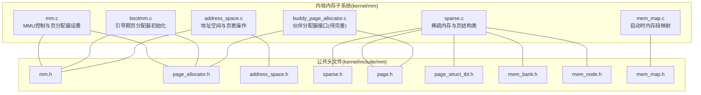
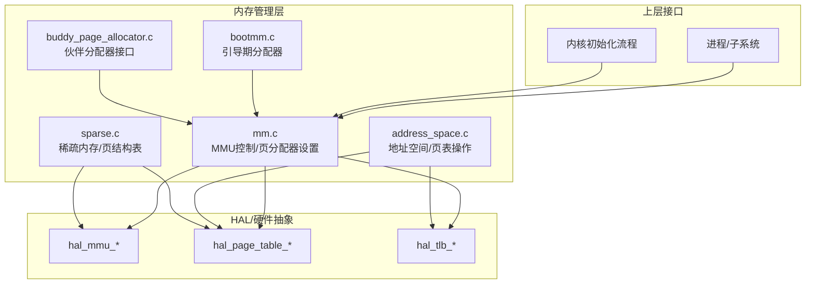
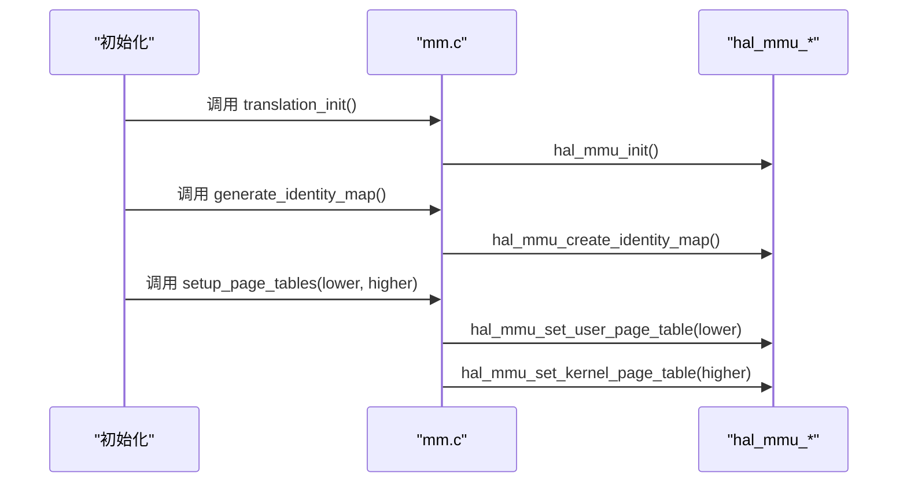
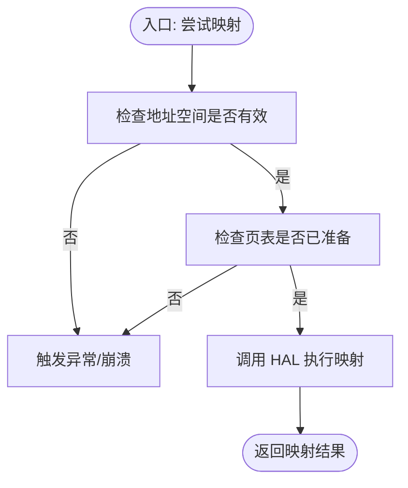
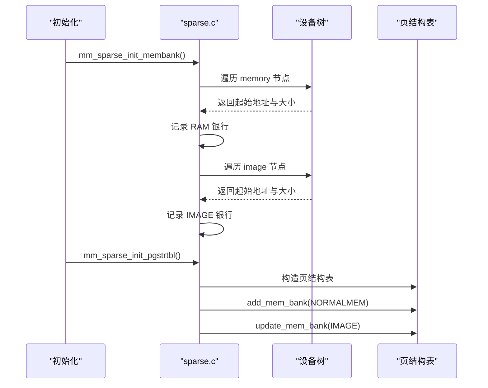
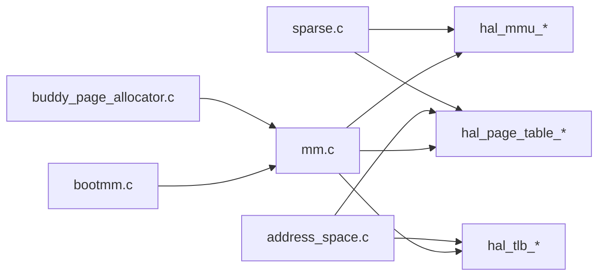
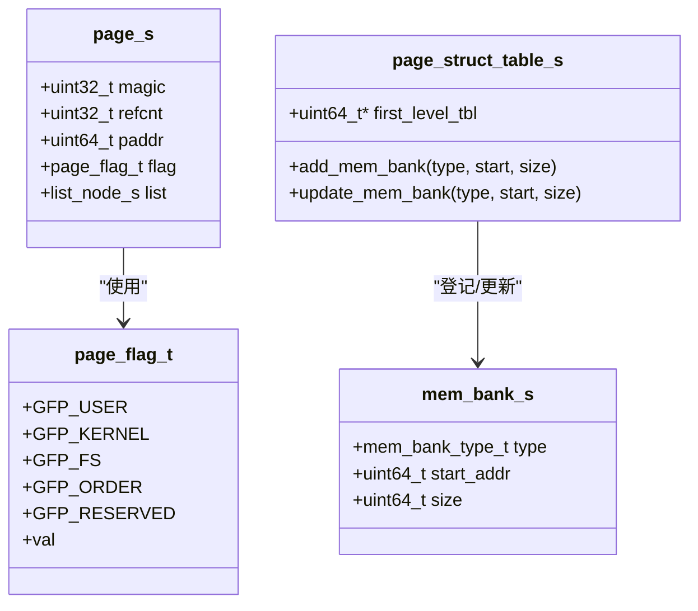

# 内存管理系统

<cite>
**本文引用的文件**
- [kernel/mm/mm.c](file://kernel/mm/mm.c)
- [kernel/mm/bootmm.c](file://kernel/mm/bootmm.c)
- [kernel/mm/mem_map.c](file://kernel/mm/mem_map.c)
- [kernel/mm/sparse.c](file://kernel/mm/sparse.c)
- [kernel/mm/address_space.c](file://kernel/mm/address_space.c)
- [kernel/include/mm/mm.h](file://kernel/include/mm/mm.h)
- [kernel/include/mm/page_allocator.h](file://kernel/include/mm/page_allocator.h)
- [kernel/include/mm/sparse.h](file://kernel/include/mm/sparse.h)
- [kernel/include/mm/address_space.h](file://kernel/include/mm/address_space.h)
- [kernel/include/mm/mem_map.h](file://kernel/include/mm/mem_map.h)
- [kernel/include/mm/mem_node.h](file://kernel/include/mm/mem_node.h)
- [kernel/include/mm/page.h](file://kernel/include/mm/page.h)
- [kernel/include/mm/page_struct_tbl.h](file://kernel/include/mm/page_struct_tbl.h)
- [kernel/include/mm/mem_bank.h](file://kernel/include/mm/mem_bank.h)
- [kernel/mm/impl/buddy_page_allocator.c](file://kernel/mm/impl/buddy_page_allocator.c)
</cite>

## 目录
1. [简介](#简介)
2. [项目结构](#项目结构)
3. [核心组件](#核心组件)
4. [架构总览](#架构总览)
5. [详细组件分析](#详细组件分析)
6. [依赖关系分析](#依赖关系分析)
7. [性能考虑](#性能考虑)
8. [故障排查指南](#故障排查指南)
9. [结论](#结论)
10. [附录](#附录)

## 简介
本文件系统性梳理 TranquilOS 的内存管理系统，覆盖分页管理、伙伴分配器接口、内存映射与稀疏内存支持、地址空间切换与页面表操作、初始化流程与分配策略等。文档同时提供面向初学者的概念讲解与面向高级开发者的实现细节与优化建议，并给出常见问题的定位与修复思路。

## 项目结构
TranquilOS 的内存子系统主要位于 kernel/mm 及其头文件目录中，采用“功能域+抽象层”的组织方式：
- 抽象接口层：定义页、分配器、地址空间、稀疏页表等通用数据结构与接口（位于 include/mm）。
- 平台无关实现：MMU 初始化、页分配器选择、地址空间切换、稀疏内存节点与页结构表管理等（位于 mm/*.c）。
- 分配器实现：当前已提供伙伴分配器接口骨架，以及引导期页分配器（bootmm）。
- 架构适配层：通过 HAL 接口与具体平台 MMU 实现解耦（例如 hal_mmu_*、hal_page_table_*、hal_tlb_*）。

图表来源
- [kernel/mm/mm.c](file://kernel/mm/mm.c#L1-L45)
- [kernel/mm/bootmm.c](file://kernel/mm/bootmm.c#L1-L24)
- [kernel/mm/address_space.c](file://kernel/mm/address_space.c#L1-L105)
- [kernel/mm/sparse.c](file://kernel/mm/sparse.c#L1-L104)
- [kernel/mm/mem_map.c](file://kernel/mm/mem_map.c#L1-L64)
- [kernel/mm/impl/buddy_page_allocator.c](file://kernel/mm/impl/buddy_page_allocator.c#L1-L27)
- [kernel/include/mm/mm.h](file://kernel/include/mm/mm.h#L1-L23)
- [kernel/include/mm/page_allocator.h](file://kernel/include/mm/page_allocator.h#L1-L23)
- [kernel/include/mm/address_space.h](file://kernel/include/mm/address_space.h#L1-L43)
- [kernel/include/mm/sparse.h](file://kernel/include/mm/sparse.h#L1-L17)
- [kernel/include/mm/page.h](file://kernel/include/mm/page.h#L1-L31)
- [kernel/include/mm/page_struct_tbl.h](file://kernel/include/mm/page_struct_tbl.h#L1-L47)
- [kernel/include/mm/mem_bank.h](file://kernel/include/mm/mem_bank.h#L1-L21)
- [kernel/include/mm/mem_node.h](file://kernel/include/mm/mem_node.h#L1-L21)
- [kernel/include/mm/mem_map.h](file://kernel/include/mm/mem_map.h#L1-L29)

章节来源
- [kernel/mm/mm.c](file://kernel/mm/mm.c#L1-L45)
- [kernel/mm/bootmm.c](file://kernel/mm/bootmm.c#L1-L24)
- [kernel/mm/address_space.c](file://kernel/mm/address_space.c#L1-L105)
- [kernel/mm/sparse.c](file://kernel/mm/sparse.c#L1-L104)
- [kernel/mm/mem_map.c](file://kernel/mm/mem_map.c#L1-L64)
- [kernel/mm/impl/buddy_page_allocator.c](file://kernel/mm/impl/buddy_page_allocator.c#L1-L27)
- [kernel/include/mm/mm.h](file://kernel/include/mm/mm.h#L1-L23)
- [kernel/include/mm/page_allocator.h](file://kernel/include/mm/page_allocator.h#L1-L23)
- [kernel/include/mm/address_space.h](file://kernel/include/mm/address_space.h#L1-L43)
- [kernel/include/mm/sparse.h](file://kernel/include/mm/sparse.h#L1-L17)
- [kernel/include/mm/page.h](file://kernel/include/mm/page.h#L1-L31)
- [kernel/include/mm/page_struct_tbl.h](file://kernel/include/mm/page_struct_tbl.h#L1-L47)
- [kernel/include/mm/mem_bank.h](file://kernel/include/mm/mem_bank.h#L1-L21)
- [kernel/include/mm/mem_node.h](file://kernel/include/mm/mem_node.h#L1-L21)
- [kernel/include/mm/mem_map.h](file://kernel/include/mm/mem_map.h#L1-L29)

## 核心组件
- 页与分配器抽象：定义页结构、页标志位、分配器接口与操作函数指针，统一不同分配策略的调用方式。
- MMU 控制与页表设置：提供启用/禁用 MMU、生成身份映射、设置用户/内核页表等能力。
- 地址空间与页表操作：封装页表准备、扩展、映射、反向映射与地址空间切换逻辑。
- 稀疏内存与页结构表：从设备树解析内存银行，构建页结构表，支持普通内存、镜像与引导内存区域的登记与更新。
- 启动内存映射：记录内核文本、只读数据、读写数据、BSS 与内核栈等段的起止地址，便于后续内存管理使用。

章节来源
- [kernel/include/mm/page.h](file://kernel/include/mm/page.h#L1-L31)
- [kernel/include/mm/page_allocator.h](file://kernel/include/mm/page_allocator.h#L1-L23)
- [kernel/include/mm/mm.h](file://kernel/include/mm/mm.h#L1-L23)
- [kernel/include/mm/address_space.h](file://kernel/include/mm/address_space.h#L1-L43)
- [kernel/include/mm/page_struct_tbl.h](file://kernel/include/mm/page_struct_tbl.h#L1-L47)
- [kernel/include/mm/mem_bank.h](file://kernel/include/mm/mem_bank.h#L1-L21)
- [kernel/include/mm/mem_node.h](file://kernel/include/mm/mem_node.h#L1-L21)
- [kernel/include/mm/mem_map.h](file://kernel/include/mm/mem_map.h#L1-L29)
- [kernel/mm/mm.c](file://kernel/mm/mm.c#L1-L45)
- [kernel/mm/address_space.c](file://kernel/mm/address_space.c#L1-L105)
- [kernel/mm/sparse.c](file://kernel/mm/sparse.c#L1-L104)
- [kernel/mm/mem_map.c](file://kernel/mm/mem_map.c#L1-L64)

## 架构总览
下图展示了内存管理子系统的高层交互：上层通过抽象接口调用 HAL 层完成 MMU 设置、页表操作与 TLB 无效化；稀疏内存模块负责从设备树收集物理内存信息并维护页结构表；地址空间模块负责在用户/内核空间之间切换页表并保证一致性；引导期分配器在早期阶段提供页分配能力，随后可被更完善的分配器替换。

图表来源
- [kernel/mm/mm.c](file://kernel/mm/mm.c#L1-L45)
- [kernel/mm/address_space.c](file://kernel/mm/address_space.c#L1-L105)
- [kernel/mm/sparse.c](file://kernel/mm/sparse.c#L1-L104)
- [kernel/mm/bootmm.c](file://kernel/mm/bootmm.c#L1-L24)
- [kernel/mm/impl/buddy_page_allocator.c](file://kernel/mm/impl/buddy_page_allocator.c#L1-L27)

## 详细组件分析

### 组件一：MMU 控制与页分配器设置
- 职责
  - 提供 MMU 启用/禁用、翻译初始化、生成身份映射、设置用户/内核页表等能力。
  - 维护全局页分配器实例，支持运行时替换。
- 关键点
  - 通过 HAL 接口与平台 MMU 实现解耦。
  - 页面表地址通过 CPU 本地存储设置，确保多核场景下的正确性。
- 典型调用序列
  - 初始化阶段：翻译初始化 → 生成身份映射 → 设置页表 → 记录地址空间范围。
  - 运行时：根据需要切换页分配器或更新页表。

图表来源
- [kernel/mm/mm.c](file://kernel/mm/mm.c#L29-L45)

章节来源
- [kernel/mm/mm.c](file://kernel/mm/mm.c#L1-L45)
- [kernel/include/mm/mm.h](file://kernel/include/mm/mm.h#L1-L23)

### 组件二：地址空间与页表操作
- 职责
  - 准备页表、尝试映射单页、扩展页表、取消映射单页与范围。
  - 在用户/内核地址空间之间切换时，必要时更新页表并使 TLB 无效。
- 关键点
  - 地址空间结构包含页表物理地址与标识符，用于区分不同上下文。
  - 映射/取消映射返回结果类型，便于上层进行错误处理与重试。
- 流程图（映射单页）

图表来源
- [kernel/mm/address_space.c](file://kernel/mm/address_space.c#L59-L69)

章节来源
- [kernel/mm/address_space.c](file://kernel/mm/address_space.c#L1-L105)
- [kernel/include/mm/address_space.h](file://kernel/include/mm/address_space.h#L1-L43)

### 组件三：稀疏内存与页结构表
- 职责
  - 从设备树遍历 memory/image 节点，收集物理内存银行信息。
  - 构造页结构表，登记普通内存、镜像与引导内存区域，并支持动态更新。
- 关键点
  - 内存银行类型包括 RAM、IOMM、IMAGE 与 INVALID。
  - 页结构表条目包含有效性、块/页标记、锁与引用计数等字段。
- 序列图（稀疏初始化）

图表来源
- [kernel/mm/sparse.c](file://kernel/mm/sparse.c#L52-L89)

章节来源
- [kernel/mm/sparse.c](file://kernel/mm/sparse.c#L1-L104)
- [kernel/include/mm/sparse.h](file://kernel/include/mm/sparse.h#L1-L17)
- [kernel/include/mm/page_struct_tbl.h](file://kernel/include/mm/page_struct_tbl.h#L1-L47)
- [kernel/include/mm/mem_bank.h](file://kernel/include/mm/mem_bank.h#L1-L21)
- [kernel/include/mm/mem_node.h](file://kernel/include/mm/mem_node.h#L1-L21)

### 组件四：引导期内存与启动映射
- 引导期分配器
  - 提供最小可用的页分配能力，初始化后由全局页分配器接管。
  - 支持禁用引导期分配器，防止内核后期继续使用。
- 启动内存映射
  - 定义内核各段的起止地址，形成启动时的内存区域集合，便于后续内存管理与调试。

章节来源
- [kernel/mm/bootmm.c](file://kernel/mm/bootmm.c#L1-L24)
- [kernel/mm/mem_map.c](file://kernel/mm/mem_map.c#L1-L64)
- [kernel/include/mm/mem_map.h](file://kernel/include/mm/mem_map.h#L1-L29)

### 组件五：伙伴分配器接口（待完善）
- 当前状态
  - 已提供分配器接口与初始化入口，但具体实现尚为空白，需结合页结构表与伙伴算法完善。
- 建议实现要点
  - 使用页结构表维护空闲块链表，按阶组织，支持合并与分裂。
  - 结合页标志位与引用计数，确保并发安全与内存可见性。
  - 提供批量分配与释放，降低碎片化风险。

章节来源
- [kernel/mm/impl/buddy_page_allocator.c](file://kernel/mm/impl/buddy_page_allocator.c#L1-L27)
- [kernel/include/mm/page_allocator.h](file://kernel/include/mm/page_allocator.h#L1-L23)
- [kernel/include/mm/page.h](file://kernel/include/mm/page.h#L1-L31)
- [kernel/include/mm/page_struct_tbl.h](file://kernel/include/mm/page_struct_tbl.h#L1-L47)

## 依赖关系分析
- 模块耦合
  - mm.c 依赖 HAL 接口与页分配器抽象，向上提供统一的 MMU 控制能力。
  - address_space.c 依赖 HAL 页表与 TLB 接口，负责地址空间切换与映射。
  - sparse.c 依赖设备树与页结构表，负责物理内存发现与登记。
  - bootmm.c 依赖 mm.c 的分配器设置接口，提供早期内存。
- 外部依赖
  - HAL 层：hal_mmu_*、hal_page_table_*、hal_tlb_*。
  - 设备树：用于解析 memory 与 image 节点。
  - 日志与异常：klog、panic。

图表来源
- [kernel/mm/mm.c](file://kernel/mm/mm.c#L1-L45)
- [kernel/mm/address_space.c](file://kernel/mm/address_space.c#L1-L105)
- [kernel/mm/sparse.c](file://kernel/mm/sparse.c#L1-L104)
- [kernel/mm/bootmm.c](file://kernel/mm/bootmm.c#L1-L24)
- [kernel/mm/impl/buddy_page_allocator.c](file://kernel/mm/impl/buddy_page_allocator.c#L1-L27)

章节来源
- [kernel/mm/mm.c](file://kernel/mm/mm.c#L1-L45)
- [kernel/mm/address_space.c](file://kernel/mm/address_space.c#L1-L105)
- [kernel/mm/sparse.c](file://kernel/mm/sparse.c#L1-L104)
- [kernel/mm/bootmm.c](file://kernel/mm/bootmm.c#L1-L24)
- [kernel/mm/impl/buddy_page_allocator.c](file://kernel/mm/impl/buddy_page_allocator.c#L1-L27)

## 性能考虑
- 页表层级与索引
  - 地址空间头文件定义了各级页表索引移位，直接影响页表项数量与查找开销。合理利用大页可减少页表层级与 TLB 压力。
- 分配策略
  - 伙伴分配器按阶组织空闲块，能有效降低外部碎片，但可能产生内部碎片。建议结合小对象缓存与批量分配策略进一步优化。
- 地址空间切换
  - 切换时仅在页表地址变化时更新并使 TLB 无效，避免不必要的刷新开销。
- 稀疏内存
  - 仅登记实际存在的物理内存区域，减少页结构表规模与初始化时间。

[本节为通用指导，无需列出章节来源]

## 故障排查指南
- 内存不足
  - 症状：分配失败或返回零地址。
  - 排查：确认页结构表是否正确登记了可用内存；检查伙伴分配器是否已初始化；查看日志输出定位分配路径。
- 地址冲突
  - 症状：映射失败或访问异常。
  - 排查：检查地址空间准备阶段是否清空页表；确认映射前未重复映射同一虚拟页；核对页表扩展逻辑是否正确。
- 权限错误
  - 症状：访问违例或异常。
  - 排查：确认页表项属性（只读/可写/执行）与访问模式一致；检查用户/内核页表切换是否正确。
- 异常与崩溃
  - 症状：空指针或非法地址导致崩溃。
  - 排查：检查地址空间与页表准备阶段的前置条件；确保在调用映射/取消映射前已初始化页表。

章节来源
- [kernel/mm/address_space.c](file://kernel/mm/address_space.c#L59-L93)
- [kernel/mm/mm.c](file://kernel/mm/mm.c#L21-L45)
- [kernel/mm/sparse.c](file://kernel/mm/sparse.c#L91-L104)

## 结论
TranquilOS 的内存管理以抽象接口为核心，通过 HAL 层与平台 MMU 解耦，实现了从引导期到运行时的平滑过渡。稀疏内存与页结构表设计支持多物理内存银行与灵活的区域登记；地址空间与页表操作提供了高效的空间隔离与切换能力。未来可在伙伴分配器实现、碎片化治理与内存保护方面持续优化，以满足更高性能与可靠性的需求。

[本节为总结性内容，无需列出章节来源]

## 附录

### A. 内存初始化流程（概览）
- 启动阶段
  - 翻译初始化与身份映射生成。
  - 从设备树解析内存与镜像银行，构造页结构表并登记普通内存与镜像区域。
  - 初始化引导期页分配器，记录可用内存起点。
- 运行阶段
  - 可选地初始化伙伴分配器并替换全局页分配器。
  - 设置用户/内核页表，记录地址空间范围。
  - 在需要时扩展页表并映射物理页。

章节来源
- [kernel/mm/mm.c](file://kernel/mm/mm.c#L29-L45)
- [kernel/mm/sparse.c](file://kernel/mm/sparse.c#L52-L89)
- [kernel/mm/bootmm.c](file://kernel/mm/bootmm.c#L13-L24)

### B. 分配与释放流程（示意）
- 分配
  - 选择页分配器（引导期或伙伴分配器）。
  - 按页对齐计算起始地址与大小，登记页结构表条目。
- 释放
  - 回收页结构表条目，合并相邻空闲块，更新伙伴链表。

章节来源
- [kernel/include/mm/page_allocator.h](file://kernel/include/mm/page_allocator.h#L8-L21)
- [kernel/include/mm/page.h](file://kernel/include/mm/page.h#L12-L31)
- [kernel/mm/impl/buddy_page_allocator.c](file://kernel/mm/impl/buddy_page_allocator.c#L6-L27)

### C. 数据模型（页与页结构表）

图表来源
- [kernel/include/mm/page.h](file://kernel/include/mm/page.h#L23-L31)
- [kernel/include/mm/page.h](file://kernel/include/mm/page.h#L12-L21)
- [kernel/include/mm/page_struct_tbl.h](file://kernel/include/mm/page_struct_tbl.h#L37-L47)
- [kernel/include/mm/mem_bank.h](file://kernel/include/mm/mem_bank.h#L15-L21)