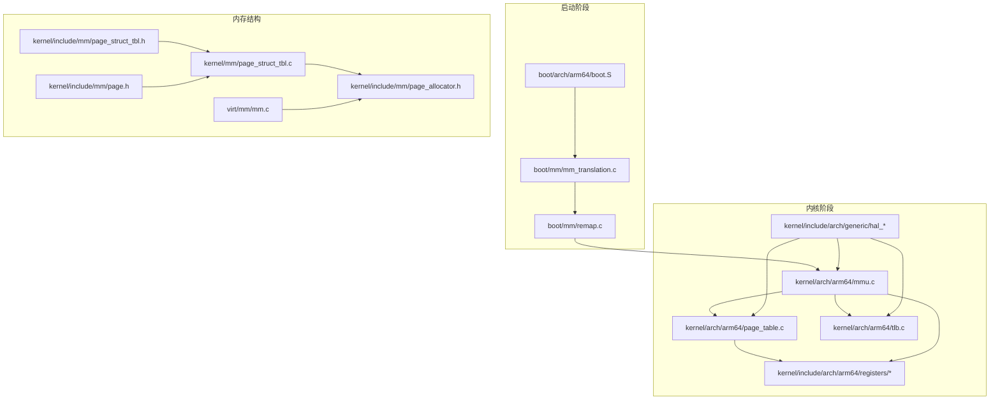
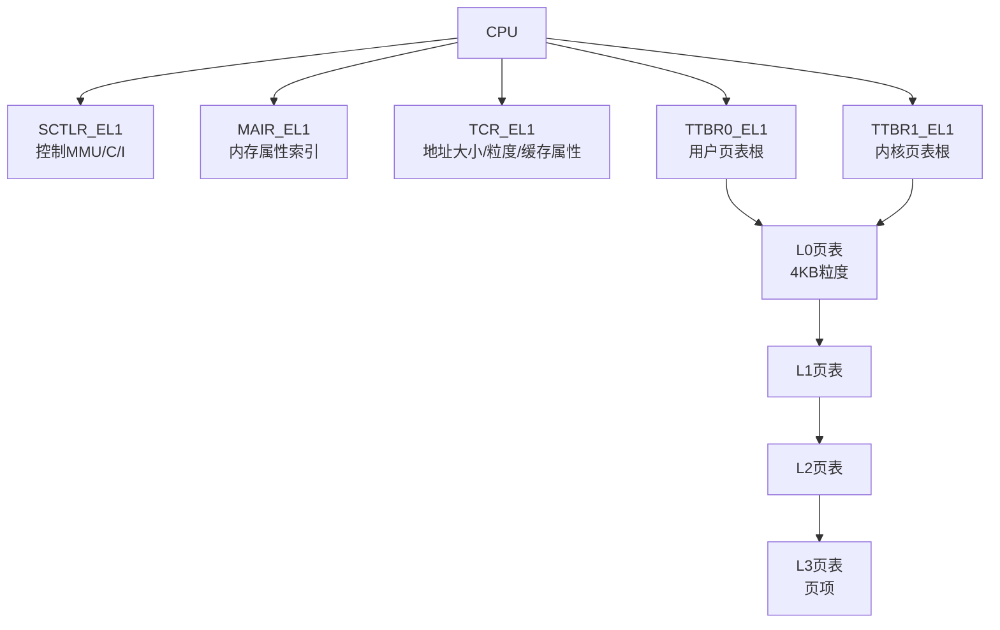
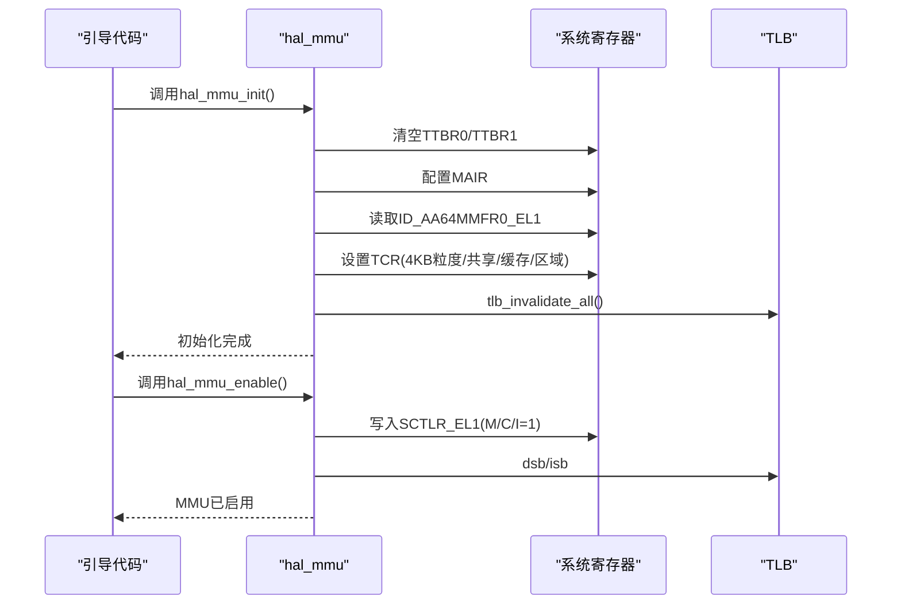
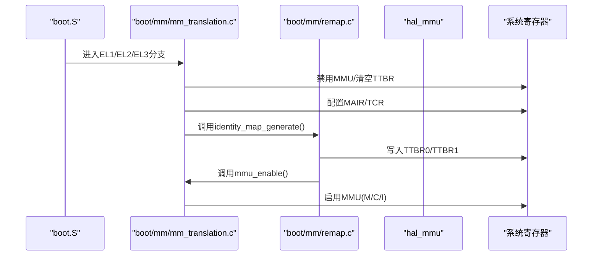
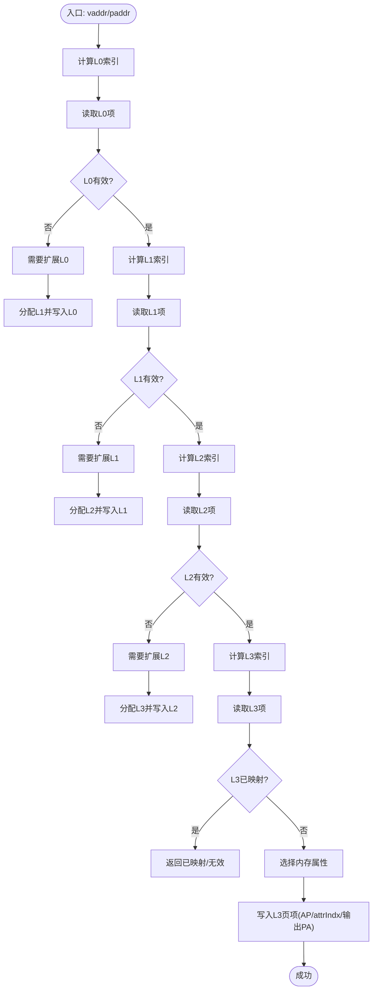
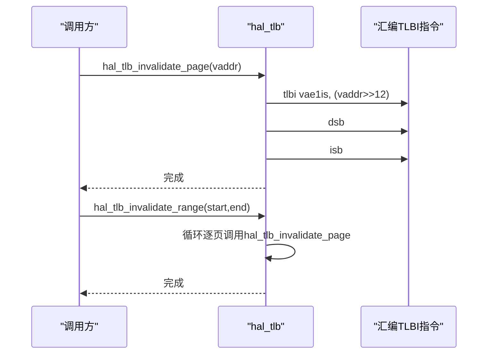
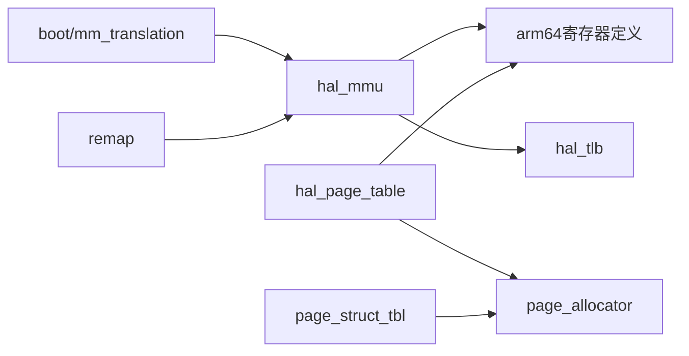

# 分页管理

<cite>
**本文引用的文件**
- [mmu.c](file://kernel/arch/arm64/mmu.c)
- [page_table.c](file://kernel/arch/arm64/page_table.c)
- [tlb.c](file://kernel/arch/arm64/tlb.c)
- [mm_translation.c](file://boot/mm/mm_translation.c)
- [remap.c](file://boot/mm/remap.c)
- [mmu.h](file://kernel/include/arch/arm64/mmu.h)
- [hal_mmu.h](file://kernel/include/arch/generic/hal_mmu.h)
- [hal_page_table.h](file://kernel/include/arch/generic/hal_page_table.h)
- [tcr.h](file://kernel/include/arch/arm64/registers/tcr.h)
- [sctlr.h](file://kernel/include/arch/arm64/registers/sctlr.h)
- [id_aa64mmfr0.h](file://kernel/include/arch/arm64/registers/id_aa64mmfr0.h)
- [boot.S](file://boot/arch/arm64/boot.S)
- [remap.h](file://boot/include/remap.h)
- [page.h](file://kernel/include/mm/page.h)
- [page_allocator.h](file://kernel/include/mm/page_allocator.h)
- [page_struct_tbl.c](file://kernel/mm/page_struct_tbl.c)
- [page_struct_tbl.h](file://kernel/include/mm/page_struct_tbl.h)
- [mm.c](file://virt/mm/mm.c)
- [cache.c](file://kernel/cache/cache.c)
- [hal_tlb.h](file://kernel/include/arch/generic/hal_tlb.h)
</cite>

## 目录
1. [引言](#引言)
2. [项目结构](#项目结构)
3. [核心组件](#核心组件)
4. [架构总览](#架构总览)
5. [详细组件分析](#详细组件分析)
6. [依赖关系分析](#依赖关系分析)
7. [性能考虑](#性能考虑)
8. [故障排查指南](#故障排查指南)
9. [结论](#结论)
10. [附录](#附录)

## 引言
本文件系统性梳理TranquilOS在ARM64架构下的分页管理系统，覆盖页表结构、地址转换、MMU配置与使能、页表创建/扩展/销毁流程、TLB管理、内存属性与访问权限控制，并结合实际源码路径给出可操作的实现参考。文档同时面向初学者与高级开发者，既解释基础概念，也提供深入的实现细节与排错建议。

## 项目结构
围绕分页管理的关键代码分布在以下位置：
- 启动阶段：boot/mm/ 下的翻译初始化与内核重映射；boot/arch/arm64/boot.S负责进入不同异常级别并设置栈。
- 内核阶段：kernel/arch/arm64/ 下的MMU初始化、页表操作、TLB管理；kernel/include/arch/arm64/ 下的寄存器定义与页表项格式；kernel/include/arch/generic/ 下的HAL接口抽象。
- 内存结构：kernel/include/mm/ 与 kernel/mm/ 下的页结构、分配器与页结构表，支撑页表项的物理页管理。

图表来源
- [boot.S](file://boot/arch/arm64/boot.S#L1-L115)
- [mm_translation.c](file://boot/mm/mm_translation.c#L1-L225)
- [remap.c](file://boot/mm/remap.c#L1-L38)
- [mmu.c](file://kernel/arch/arm64/mmu.c#L1-L231)
- [page_table.c](file://kernel/arch/arm64/page_table.c#L1-L167)
- [tlb.c](file://kernel/arch/arm64/tlb.c#L1-L68)
- [page.h](file://kernel/include/mm/page.h#L1-L31)
- [page_allocator.h](file://kernel/include/mm/page_allocator.h#L1-L23)
- [page_struct_tbl.c](file://kernel/mm/page_struct_tbl.c#L31-L142)
- [page_struct_tbl.h](file://kernel/include/mm/page_struct_tbl.h#L1-L47)
- [mm.c](file://virt/mm/mm.c#L1-L15)

章节来源
- [boot.S](file://boot/arch/arm64/boot.S#L1-L115)
- [mm_translation.c](file://boot/mm/mm_translation.c#L1-L225)
- [remap.c](file://boot/mm/remap.c#L1-L38)
- [mmu.c](file://kernel/arch/arm64/mmu.c#L1-L231)
- [page_table.c](file://kernel/arch/arm64/page_table.c#L1-L167)
- [tlb.c](file://kernel/arch/arm64/tlb.c#L1-L68)
- [page.h](file://kernel/include/mm/page.h#L1-L31)
- [page_allocator.h](file://kernel/include/mm/page_allocator.h#L1-L23)
- [page_struct_tbl.c](file://kernel/mm/page_struct_tbl.c#L31-L142)
- [page_struct_tbl.h](file://kernel/include/mm/page_struct_tbl.h#L1-L47)
- [mm.c](file://virt/mm/mm.c#L1-L15)

## 核心组件
- MMU HAL层（hal_mmu）：负责MMU初始化、启用/禁用、设置内核/用户页表根、生成身份映射等。
- 页表操作（hal_page_table）：负责按需扩展页表层级、尝试映射页面、选择内存属性。
- TLB管理（hal_tlb）：提供全量TLB失效、按页失效、范围失效、按ASID失效。
- 启动阶段翻译初始化与内核重映射：在引导早期完成MAIR/TCR配置、生成身份映射并使能MMU。
- 页结构与分配器：维护页结构表与页分配器，支撑页表项所需的物理页分配。

章节来源
- [hal_mmu.h](file://kernel/include/arch/generic/hal_mmu.h#L1-L28)
- [hal_page_table.h](file://kernel/include/arch/generic/hal_page_table.h#L1-L12)
- [hal_tlb.h](file://kernel/include/arch/generic/hal_tlb.h#L1-L15)
- [mm_translation.c](file://boot/mm/mm_translation.c#L1-L225)
- [remap.c](file://boot/mm/remap.c#L1-L38)
- [mmu.c](file://kernel/arch/arm64/mmu.c#L1-L231)
- [page_table.c](file://kernel/arch/arm64/page_table.c#L1-L167)
- [tlb.c](file://kernel/arch/arm64/tlb.c#L1-L68)
- [page.h](file://kernel/include/mm/page.h#L1-L31)
- [page_allocator.h](file://kernel/include/mm/page_allocator.h#L1-L23)
- [page_struct_tbl.c](file://kernel/mm/page_struct_tbl.c#L31-L142)

## 架构总览
ARM64分页采用四级页表（4KB粒度、48位VA），TTBR0用于用户空间，TTBR1用于内核空间。MAIR定义内存属性，TCR控制地址大小、粒度、共享与缓存属性，SCTLR控制MMU开关与缓存/指令缓存开关。启动阶段通过身份映射建立内核可读写，随后切换到最终页表并使能MMU。

图表来源
- [mmu.c](file://kernel/arch/arm64/mmu.c#L62-L126)
- [mm_translation.c](file://boot/mm/mm_translation.c#L99-L162)
- [mmu.h](file://kernel/include/arch/arm64/mmu.h#L69-L167)
- [tcr.h](file://kernel/include/arch/arm64/registers/tcr.h#L6-L54)
- [sctlr.h](file://kernel/include/arch/arm64/registers/sctlr.h#L6-L59)

## 详细组件分析

### MMU初始化与配置（hal_mmu）
- 功能要点
  - 清空页表基址寄存器
  - 配置MAIR内存属性（设备/普通缓存/非缓存等）
  - 读取ID_AA64MMFR0_EL1判断支持的地址范围与粒度能力
  - 设置TCR：选择4KB粒度、共享属性、缓存属性、TTBR0/TTBR1区域与大小
  - 使能/禁用MMU：配合DSB/ISB保证一致性
  - 设置内核/用户页表根
  - 生成身份映射（特权/非特权模式下分别配置UXN/PXN/AP）

- 关键数据结构
  - MAIR/TCR/SCTLR寄存器联合体
  - 页表项描述符（Table/Page/Block Level1/Level2）

- 代码路径
  - 初始化与配置：[hal_mmu_init](file://kernel/arch/arm64/mmu.c#L62-L126)
  - 使能/禁用：[hal_mmu_enable](file://kernel/arch/arm64/mmu.c#L128-L139), [hal_mmu_disable](file://kernel/arch/arm64/mmu.c#L141-L151)
  - 设置页表根：[hal_mmu_set_kernel_page_table](file://kernel/arch/arm64/mmu.c#L153-L155), [hal_mmu_set_user_page_table](file://kernel/arch/arm64/mmu.c#L157-L159)
  - 身份映射生成：[hal_mmu_create_identity_map](file://kernel/arch/arm64/mmu.c#L161-L222)
  - 配置查询：[hal_mmu_get_config](file://kernel/arch/arm64/mmu.c#L224-L231)

图表来源
- [mmu.c](file://kernel/arch/arm64/mmu.c#L62-L151)

章节来源
- [mmu.c](file://kernel/arch/arm64/mmu.c#L62-L231)
- [mmu.h](file://kernel/include/arch/arm64/mmu.h#L1-L168)
- [tcr.h](file://kernel/include/arch/arm64/registers/tcr.h#L6-L54)
- [sctlr.h](file://kernel/include/arch/arm64/registers/sctlr.h#L6-L59)
- [id_aa64mmfr0.h](file://kernel/include/arch/arm64/registers/id_aa64mmfr0.h#L14-L33)

### 启动阶段翻译初始化与内核重映射（boot/mm）
- 功能要点
  - 在引导早期禁用MMU、清空页表寄存器
  - 配置MAIR/TCR，读取ID寄存器检查粒度支持
  - 生成身份映射页表并写入TTBR0/TTBR1
  - 使能MMU

- 代码路径
  - 翻译初始化：[mm_translation_init](file://boot/mm/mm_translation.c#L99-L162)
  - 使能/禁用：[mmu_enable](file://boot/mm/mm_translation.c#L69-L87), [mmu_disable](file://boot/mm/mm_translation.c#L54-L67)
  - 身份映射生成：[identity_map_generate](file://boot/mm/mm_translation.c#L164-L225)
  - 内核重映射入口：[kernel_remap](file://boot/mm/remap.c#L30-L38)

图表来源
- [boot.S](file://boot/arch/arm64/boot.S#L1-L115)
- [mm_translation.c](file://boot/mm/mm_translation.c#L99-L162)
- [remap.c](file://boot/mm/remap.c#L30-L38)

章节来源
- [boot.S](file://boot/arch/arm64/boot.S#L1-L115)
- [mm_translation.c](file://boot/mm/mm_translation.c#L1-L225)
- [remap.c](file://boot/mm/remap.c#L1-L38)
- [remap.h](file://boot/include/remap.h#L1-L7)

### 页表创建、扩展与映射（hal_page_table）
- 功能要点
  - 尝试映射页面：解析四级页表索引，检查各级有效性，若无效则返回失败原因（缺下级表/已映射等）
  - 按需扩展：当某级页表项无效时，为其分配新页并填充描述符
  - 内存属性选择：根据物理地址范围（如UART MMIO）选择设备属性或普通缓存属性
  - 权限控制：AP位控制EL0读写权限，UXN/PXN控制执行权限

- 代码路径
  - 映射页面：[hal_page_table_try_map_page](file://kernel/arch/arm64/page_table.c#L9-L94)
  - 扩展页表：[hal_page_table_extend](file://kernel/arch/arm64/page_table.c#L96-L167)

图表来源
- [page_table.c](file://kernel/arch/arm64/page_table.c#L9-L94)

章节来源
- [page_table.c](file://kernel/arch/arm64/page_table.c#L1-L167)
- [mmu.h](file://kernel/include/arch/arm64/mmu.h#L75-L167)
- [hal_page_table.h](file://kernel/include/arch/generic/hal_page_table.h#L1-L12)

### TLB管理（hal_tlb）
- 功能要点
  - 全量失效：VMALLE1IS
  - 按页失效：VAE1IS（使用页号）
  - 范围失效：逐页调用按页失效
  - 按ASID失效：ASIDE1IS（高位拼接ASID）

- 代码路径
  - 全量/按页/范围/ASID失效：[hal_tlb_invalidate_all](file://kernel/arch/arm64/tlb.c#L44-L68), [hal_tlb_invalidate_page](file://kernel/arch/arm64/tlb.c#L50-L54), [hal_tlb_invalidate_range](file://kernel/arch/arm64/tlb.c#L56-L62), [hal_tlb_invalidate_asid](file://kernel/arch/arm64/tlb.c#L64-L68)

图表来源
- [tlb.c](file://kernel/arch/arm64/tlb.c#L44-L68)

章节来源
- [tlb.c](file://kernel/arch/arm64/tlb.c#L1-L68)
- [hal_tlb.h](file://kernel/include/arch/generic/hal_tlb.h#L1-L15)
- [cache.c](file://kernel/cache/cache.c#L1-L14)

### 页结构与页分配器（支撑页表物理页）
- 功能要点
  - 页结构表：三级页表索引定位到页结构数组，记录页类型、引用计数、锁等
  - 页分配器：提供分配单页/多页/释放接口，供页表扩展使用
  - 内核内存管理：通过全局页分配器指针提供统一入口

- 代码路径
  - 页结构表构造/添加/更新：[page_struct_tbl_construct](file://kernel/mm/page_struct_tbl.c#L125-L138), [page_struct_table_add_mem_bank](file://kernel/mm/page_struct_tbl.c#L104-L123)
  - 页分配器接口：[page_allocator.h](file://kernel/include/mm/page_allocator.h#L1-L23)
  - 全局分配器设置/获取：[mm_set_page_allocator](file://virt/mm/mm.c#L8-L11), [mm_get_page_allocator](file://virt/mm/mm.c#L13-L15)

章节来源
- [page_struct_tbl.c](file://kernel/mm/page_struct_tbl.c#L31-L142)
- [page_struct_tbl.h](file://kernel/include/mm/page_struct_tbl.h#L1-L47)
- [page_allocator.h](file://kernel/include/mm/page_allocator.h#L1-L23)
- [mm.c](file://virt/mm/mm.c#L1-L15)

## 依赖关系分析
- 组件耦合
  - hal_mmu依赖寄存器定义与页表项格式，以及TLB接口
  - hal_page_table依赖页表项格式、页分配器与日志/断言
  - 启动阶段与内核阶段的MMU初始化相互补充，最终由内核接管
- 外部依赖
  - ARM64系统寄存器（SCTLR/MAIR/TCR/TTBR）
  - 汇编TLBI指令族
  - 页分配器与页结构表

图表来源
- [mmu.c](file://kernel/arch/arm64/mmu.c#L1-L231)
- [page_table.c](file://kernel/arch/arm64/page_table.c#L1-L167)
- [mm_translation.c](file://boot/mm/mm_translation.c#L1-L225)
- [remap.c](file://boot/mm/remap.c#L1-L38)
- [page_struct_tbl.c](file://kernel/mm/page_struct_tbl.c#L31-L142)
- [page_allocator.h](file://kernel/include/mm/page_allocator.h#L1-L23)

章节来源
- [mmu.c](file://kernel/arch/arm64/mmu.c#L1-L231)
- [page_table.c](file://kernel/arch/arm64/page_table.c#L1-L167)
- [mm_translation.c](file://boot/mm/mm_translation.c#L1-L225)
- [remap.c](file://boot/mm/remap.c#L1-L38)
- [page_struct_tbl.c](file://kernel/mm/page_struct_tbl.c#L31-L142)
- [page_allocator.h](file://kernel/include/mm/page_allocator.h#L1-L23)

## 性能考虑
- 页表粒度与层级
  - 使用4KB粒度以平衡TLB命中与碎片；四级页表在48位VA下足够覆盖用户/内核空间
- 缓存与共享属性
  - MAIR中对设备与普通内存分别配置缓存属性，减少不必要的缓存一致性开销
- TLB管理
  - 批量范围失效优于逐页失效；全量失效仅在必要时使用
- 访问权限
  - 合理设置AP/UXN/PXN，避免不必要的异常与权限检查成本

## 故障排查指南
- 常见问题与定位
  - 页故障（映射缺失/无效）：检查hal_page_table_try_map_page返回值，确认各级页表是否已扩展
  - 地址越界：核对TCR中的T0SZ/T1SZ与地址范围；确认TTBR0/TTBR1区域划分
  - 权限错误：检查AP/UXN/PXN位；区分用户态与内核态访问
  - MMU未生效：确认SCTLR.M/C/I已置位；确保DSB/ISB屏障
  - TLB不一致：映射/解除映射后进行相应TLB失效

- 排查步骤
  - 启动阶段：核对boot/mm的MAIR/TCR配置与ID寄存器能力
  - 运行阶段：使用hal_tlb_invalidate_range清理范围，或hal_tlb_invalidate_page清理单页
  - 日志与断言：利用PANIC与log_info定位问题点

章节来源
- [page_table.c](file://kernel/arch/arm64/page_table.c#L9-L94)
- [mmu.c](file://kernel/arch/arm64/mmu.c#L128-L151)
- [tlb.c](file://kernel/arch/arm64/tlb.c#L44-L68)
- [mm_translation.c](file://boot/mm/mm_translation.c#L99-L162)

## 结论
TranquilOS在ARM64上的分页管理以HAL抽象为核心，结合启动阶段的身份映射与内核阶段的精细页表操作，实现了可配置、可扩展且具备良好性能的虚拟内存子系统。通过明确的页表结构、严谨的MMU配置与完善的TLB管理，系统在安全性与效率之间取得平衡。后续可在伙伴分配器完善、页结构表扩展与更细粒度的权限控制方面持续优化。

## 附录
- 关键宏与常量
  - 页大小、页移位、地址范围、页表项类型与有效位
- 寄存器与描述符
  - MAIR/TCR/SCTLR、页表Table/Page/Block描述符字段定义

章节来源
- [mmu.h](file://kernel/include/arch/arm64/mmu.h#L1-L168)
- [tcr.h](file://kernel/include/arch/arm64/registers/tcr.h#L1-L56)
- [sctlr.h](file://kernel/include/arch/arm64/registers/sctlr.h#L1-L61)
- [page.h](file://kernel/include/mm/page.h#L1-L31)