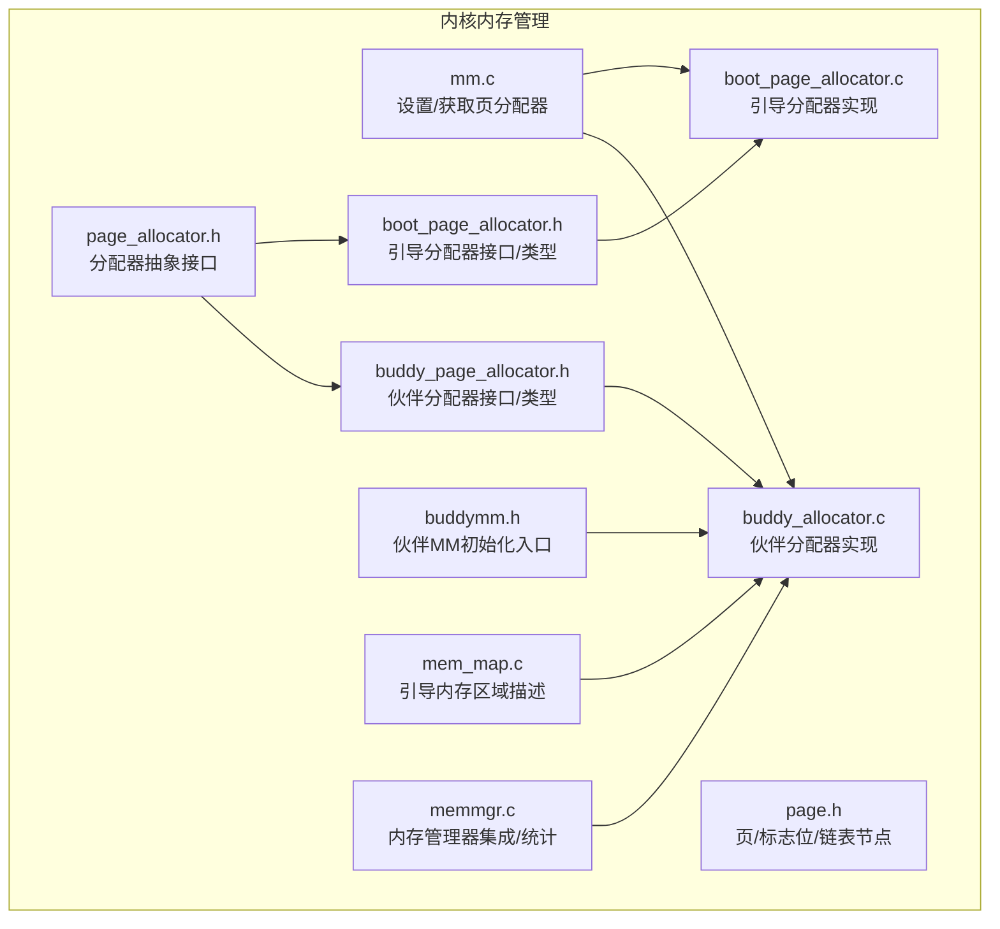
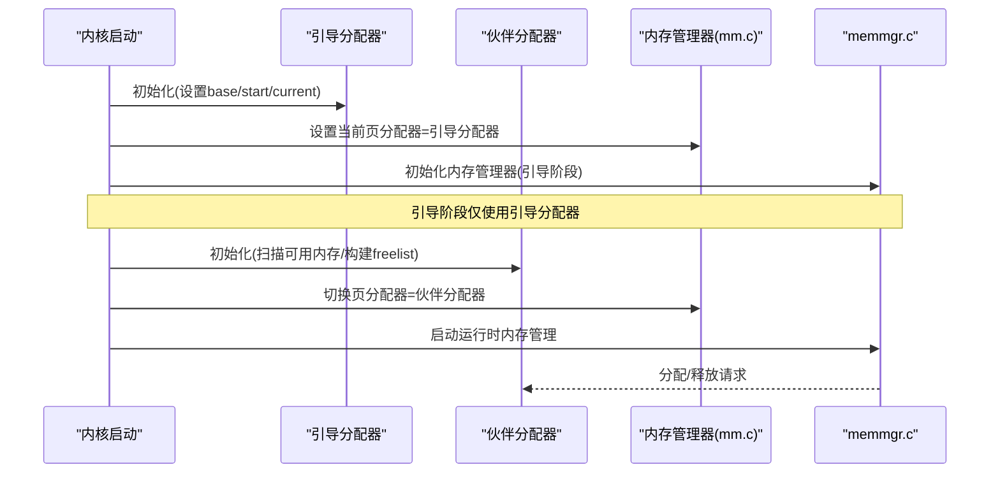
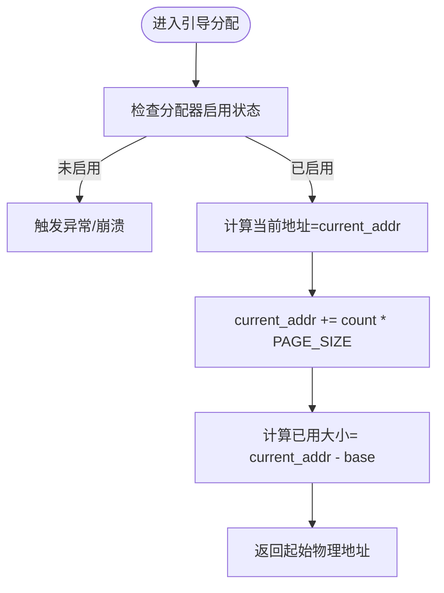
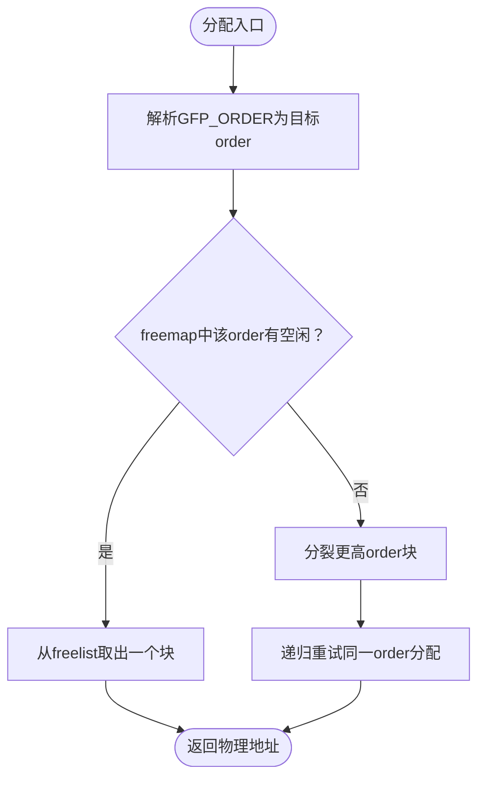
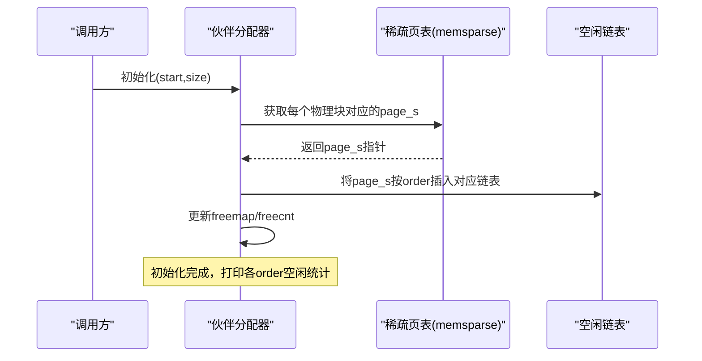
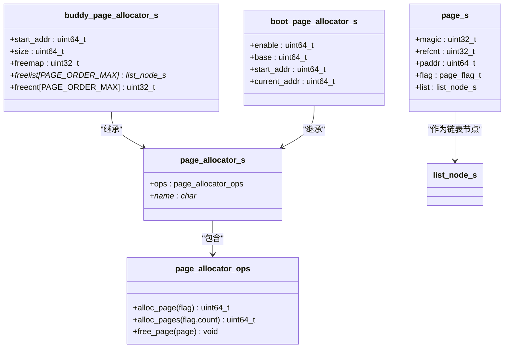
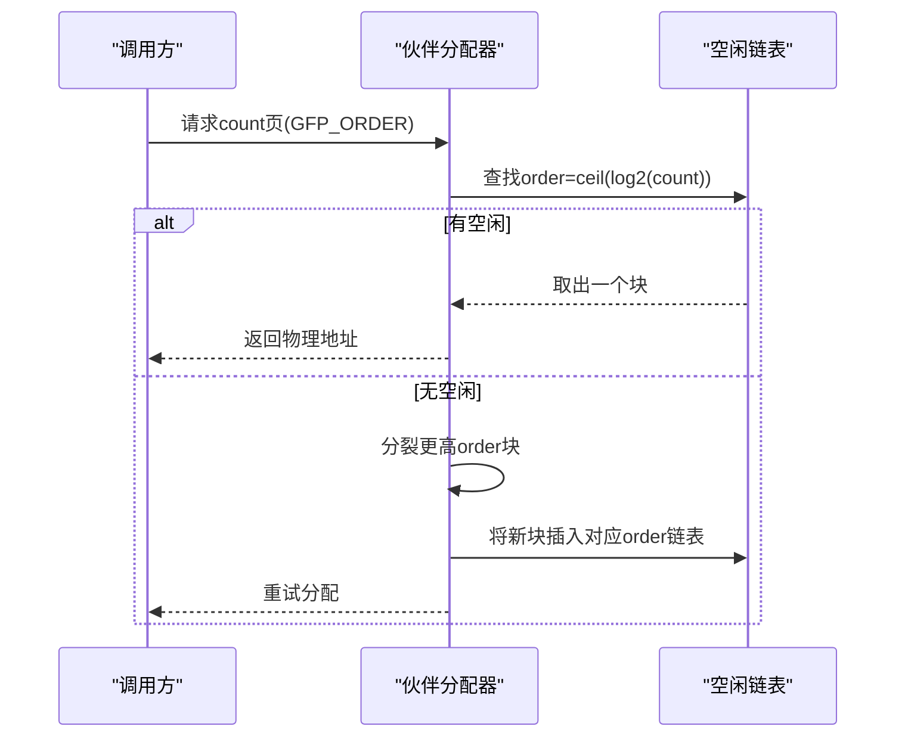
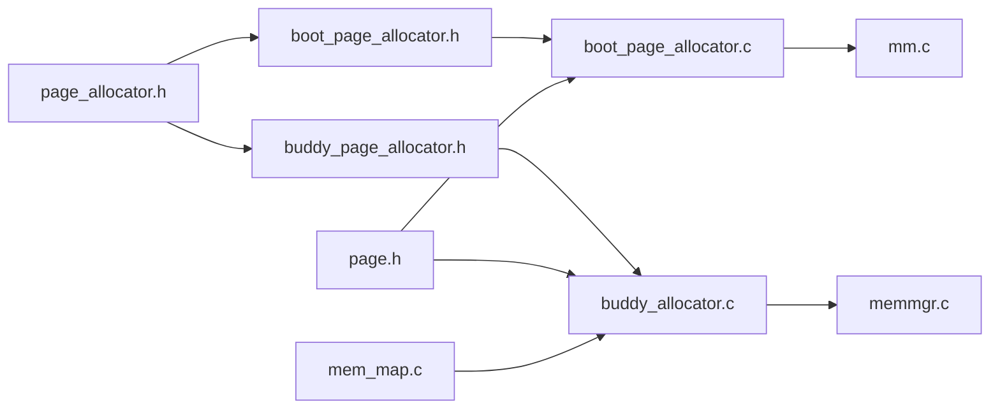

# 页面分配器

<cite>
**本文引用的文件**
- [kernel/include/mm/impl/buddy_page_allocator.h](file://kernel/include/mm/impl/buddy_page_allocator.h)
- [kernel/mm/impl/buddy_page_allocator.c](file://kernel/mm/impl/buddy_page_allocator.c)
- [kernel/systemd/memmgr/pallocator/buddy_allocator.c](file://kernel/systemd/memmgr/pallocator/buddy_allocator.c)
- [kernel/include/mm/impl/boot_page_allocator.h](file://kernel/include/mm/impl/boot_page_allocator.h)
- [kernel/mm/impl/boot_page_allocator.c](file://kernel/mm/impl/boot_page_allocator.c)
- [kernel/include/mm/page_allocator.h](file://kernel/include/mm/page_allocator.h)
- [kernel/include/mm/page.h](file://kernel/include/mm/page.h)
- [kernel/include/mm/buddymm.h](file://kernel/include/mm/buddymm.h)
- [kernel/mm/mm.c](file://kernel/mm/mm.c)
- [kernel/mm/mem_map.c](file://kernel/mm/mem_map.c)
- [kernel/systemd/memmgr/memmgr.c](file://kernel/systemd/memmgr/memmgr.c)
</cite>

## 目录
1. [引言](#引言)
2. [项目结构](#项目结构)
3. [核心组件](#核心组件)
4. [架构总览](#架构总览)
5. [详细组件分析](#详细组件分析)
6. [依赖关系分析](#依赖关系分析)
7. [性能与碎片控制](#性能与碎片控制)
8. [故障排查指南](#故障排查指南)
9. [结论](#结论)
10. [附录：使用示例与最佳实践](#附录使用示例与最佳实践)

## 引言
本文件围绕 TranquilOS 的页面分配子系统进行系统性说明，重点覆盖两类分配器：
- 引导阶段专用的“一次性”分配器（Boot Page Allocator）
- 运行时通用的伙伴分配器（Buddy Page Allocator）

我们将从整体架构入手，逐步深入到数据结构、分配与回收算法、初始化流程、统计与调试能力，并给出常见问题的排查建议与优化要点。文档同时兼顾入门者对内存分配基本概念的理解，以及高级开发者对实现细节与性能调优的需求。

## 项目结构
页面分配器相关代码主要分布在以下位置：
- 接口与类型定义：kernel/include/mm 下的 page_allocator.h、page.h、buddymm.h 等
- 引导分配器实现：kernel/include/mm/impl/boot_page_allocator.h 与 kernel/mm/impl/boot_page_allocator.c
- 伙伴分配器接口与实现：kernel/include/mm/impl/buddy_page_allocator.h 与 kernel/mm/impl/buddy_page_allocator.c；实际运行时实现位于 kernel/systemd/memmgr/pallocator/buddy_allocator.c
- 内核内存管理集成：kernel/mm/mm.c、kernel/mm/mem_map.c、kernel/systemd/memmgr/memmgr.c

**图表来源**
- [kernel/include/mm/page_allocator.h](file://kernel/include/mm/page_allocator.h#L1-L23)
- [kernel/include/mm/impl/buddy_page_allocator.h](file://kernel/include/mm/impl/buddy_page_allocator.h#L1-L40)
- [kernel/mm/impl/buddy_page_allocator.c](file://kernel/mm/impl/buddy_page_allocator.c#L1-L27)
- [kernel/systemd/memmgr/pallocator/buddy_allocator.c](file://kernel/systemd/memmgr/pallocator/buddy_allocator.c#L1-L203)
- [kernel/include/mm/impl/boot_page_allocator.h](file://kernel/include/mm/impl/boot_page_allocator.h#L1-L17)
- [kernel/mm/impl/boot_page_allocator.c](file://kernel/mm/impl/boot_page_allocator.c#L1-L47)
- [kernel/include/mm/page.h](file://kernel/include/mm/page.h#L1-L31)
- [kernel/include/mm/buddymm.h](file://kernel/include/mm/buddymm.h#L1-L11)
- [kernel/mm/mm.c](file://kernel/mm/mm.c#L1-L45)
- [kernel/mm/mem_map.c](file://kernel/mm/mem_map.c#L1-L64)
- [kernel/systemd/memmgr/memmgr.c](file://kernel/systemd/memmgr/memmgr.c#L263-L300)

**章节来源**
- [kernel/include/mm/page_allocator.h](file://kernel/include/mm/page_allocator.h#L1-L23)
- [kernel/include/mm/page.h](file://kernel/include/mm/page.h#L1-L31)
- [kernel/include/mm/impl/buddy_page_allocator.h](file://kernel/include/mm/impl/buddy_page_allocator.h#L1-L40)
- [kernel/mm/impl/buddy_page_allocator.c](file://kernel/mm/impl/buddy_page_allocator.c#L1-L27)
- [kernel/systemd/memmgr/pallocator/buddy_allocator.c](file://kernel/systemd/memmgr/pallocator/buddy_allocator.c#L1-L203)
- [kernel/include/mm/impl/boot_page_allocator.h](file://kernel/include/mm/impl/boot_page_allocator.h#L1-L17)
- [kernel/mm/impl/boot_page_allocator.c](file://kernel/mm/impl/boot_page_allocator.c#L1-L47)
- [kernel/include/mm/buddymm.h](file://kernel/include/mm/buddymm.h#L1-L11)
- [kernel/mm/mm.c](file://kernel/mm/mm.c#L1-L45)
- [kernel/mm/mem_map.c](file://kernel/mm/mem_map.c#L1-L64)
- [kernel/systemd/memmgr/memmgr.c](file://kernel/systemd/memmgr/memmgr.c#L263-L300)

## 核心组件
- 分配器抽象接口：通过统一的 page_allocator_s 结构体对外暴露三类操作：单页分配、多页分配、释放。
- 伙伴分配器：基于分组空闲链表（按 order 维度组织）的高效分配策略，支持分裂与合并以降低外部碎片。
- 引导分配器：在内核早期阶段提供线性的地址递增式分配，简单可靠，不支持释放。
- 页对象与标志：page_s 包含物理地址、引用计数、标志位（含 GFP_* 标志与 GFP_ORDER），并作为双向链表节点参与空闲链表。

**章节来源**
- [kernel/include/mm/page_allocator.h](file://kernel/include/mm/page_allocator.h#L1-L23)
- [kernel/include/mm/page.h](file://kernel/include/mm/page.h#L1-L31)
- [kernel/include/mm/impl/buddy_page_allocator.h](file://kernel/include/mm/impl/buddy_page_allocator.h#L1-L40)
- [kernel/include/mm/impl/boot_page_allocator.h](file://kernel/include/mm/impl/boot_page_allocator.h#L1-L17)

## 架构总览
伙伴分配器与引导分配器通过统一的 page_allocator 抽象对接上层内存管理器。引导阶段由引导分配器提供内核镜像与早期数据结构所需的连续物理内存；随后伙伴分配器接管，提供高效的运行时分配与回收能力。

**图表来源**
- [kernel/mm/impl/boot_page_allocator.c](file://kernel/mm/impl/boot_page_allocator.c#L35-L47)
- [kernel/mm/mm.c](file://kernel/mm/mm.c#L12-L19)
- [kernel/systemd/memmgr/memmgr.c](file://kernel/systemd/memmgr/memmgr.c#L274-L296)
- [kernel/systemd/memmgr/pallocator/buddy_allocator.c](file://kernel/systemd/memmgr/pallocator/buddy_allocator.c#L184-L203)

## 详细组件分析

### 引导分配器（Boot Page Allocator）
- 设计目标：在内核早期阶段提供简单、确定性的物理页分配，不考虑释放，避免引入复杂度。
- 关键点：
  - 线性增长的 current_addr 指针，每次按 count*PAGE_SIZE 增量推进。
  - 启用标志 enable 控制是否允许分配。
  - 不支持释放，free_page 为空操作。
- 使用场景：内核镜像、引导页表、早期数据结构等一次性分配需求。

**图表来源**
- [kernel/mm/impl/boot_page_allocator.c](file://kernel/mm/impl/boot_page_allocator.c#L7-L24)

**章节来源**
- [kernel/include/mm/impl/boot_page_allocator.h](file://kernel/include/mm/impl/boot_page_allocator.h#L1-L17)
- [kernel/mm/impl/boot_page_allocator.c](file://kernel/mm/impl/boot_page_allocator.c#L1-L47)

### 伙伴分配器（Buddy Page Allocator）
- 设计目标：在运行时提供高效、低碎片的连续页分配，支持任意 order 的连续页请求。
- 关键点：
  - 空闲块管理：按 order（0~15，对应 4K~128M）维护独立的空闲链表，freemap 标记某 order 是否有空闲块。
  - 分配算法：从目标 order 开始向上查找，若无空闲则递归分裂更高阶块，直到满足要求。
  - 回收与合并：释放时尝试与伙伴块合并，若可合并则继续向更高阶合并，直至无法合并。
  - 初始化：扫描可用物理内存，将每一块页映射为 page_s 并插入对应 order 链表，更新 freemap 与计数。
  - 调试与统计：提供 dump 输出各 order 的空闲数量与块数，便于诊断碎片与容量分布。

**图表来源**
- [kernel/systemd/memmgr/pallocator/buddy_allocator.c](file://kernel/systemd/memmgr/pallocator/buddy_allocator.c#L131-L145)

**图表来源**
- [kernel/systemd/memmgr/pallocator/buddy_allocator.c](file://kernel/systemd/memmgr/pallocator/buddy_allocator.c#L156-L182)

**图表来源**
- [kernel/include/mm/page_allocator.h](file://kernel/include/mm/page_allocator.h#L1-L23)
- [kernel/include/mm/page.h](file://kernel/include/mm/page.h#L1-L31)
- [kernel/include/mm/impl/buddy_page_allocator.h](file://kernel/include/mm/impl/buddy_page_allocator.h#L28-L36)
- [kernel/include/mm/impl/boot_page_allocator.h](file://kernel/include/mm/impl/boot_page_allocator.h#L7-L13)

**章节来源**
- [kernel/include/mm/impl/buddy_page_allocator.h](file://kernel/include/mm/impl/buddy_page_allocator.h#L1-L40)
- [kernel/mm/impl/buddy_page_allocator.c](file://kernel/mm/impl/buddy_page_allocator.c#L1-L27)
- [kernel/systemd/memmgr/pallocator/buddy_allocator.c](file://kernel/systemd/memmgr/pallocator/buddy_allocator.c#L1-L203)
- [kernel/include/mm/page.h](file://kernel/include/mm/page.h#L1-L31)
- [kernel/include/mm/page_allocator.h](file://kernel/include/mm/page_allocator.h#L1-L23)

### 页面分配与回收流程（运行时）
- 分配流程：根据请求的 GFP_ORDER 定位目标 order；若空闲链表为空，则从更高 order 递归分裂，直到得到两个相邻且同阶的块，取其中一半返回，另一半重新入链表。
- 回收流程：将释放页标记为可用，尝试与右侧伙伴页合并；若伙伴页也空闲且同阶，则合并为更高阶块，继续沿路径向上合并，直至无法合并或到达最大阶。
- 对齐与连续性：伙伴合并保证了分配块的连续性与对齐，从而避免外部碎片的产生。

**图表来源**
- [kernel/systemd/memmgr/pallocator/buddy_allocator.c](file://kernel/systemd/memmgr/pallocator/buddy_allocator.c#L131-L145)

**章节来源**
- [kernel/systemd/memmgr/pallocator/buddy_allocator.c](file://kernel/systemd/memmgr/pallocator/buddy_allocator.c#L57-L106)
- [kernel/systemd/memmgr/pallocator/buddy_allocator.c](file://kernel/systemd/memmgr/pallocator/buddy_allocator.c#L108-L129)

## 依赖关系分析
- 分配器抽象：所有具体分配器均实现 page_allocator_ops，向上提供统一接口。
- 伙伴分配器依赖：
  - page.h 提供页对象与标志位布局
  - dlist.h 提供双向链表操作
  - memsparse 接口用于将物理地址映射为 page_s
- 引导分配器依赖：
  - 简化的线性分配逻辑，无需链表
- 集成点：
  - mm.c 提供全局页分配器句柄，负责切换分配器
  - mem_map.c 提供引导阶段的内存区域描述
  - memmgr.c 在引导完成后接管并统计空闲内存

**图表来源**
- [kernel/include/mm/page_allocator.h](file://kernel/include/mm/page_allocator.h#L1-L23)
- [kernel/include/mm/impl/buddy_page_allocator.h](file://kernel/include/mm/impl/buddy_page_allocator.h#L1-L40)
- [kernel/mm/impl/buddy_page_allocator.c](file://kernel/mm/impl/buddy_page_allocator.c#L1-L27)
- [kernel/systemd/memmgr/pallocator/buddy_allocator.c](file://kernel/systemd/memmgr/pallocator/buddy_allocator.c#L1-L203)
- [kernel/include/mm/impl/boot_page_allocator.h](file://kernel/include/mm/impl/boot_page_allocator.h#L1-L17)
- [kernel/mm/impl/boot_page_allocator.c](file://kernel/mm/impl/boot_page_allocator.c#L1-L47)
- [kernel/include/mm/page.h](file://kernel/include/mm/page.h#L1-L31)
- [kernel/mm/mm.c](file://kernel/mm/mm.c#L1-L45)
- [kernel/mm/mem_map.c](file://kernel/mm/mem_map.c#L1-L64)
- [kernel/systemd/memmgr/memmgr.c](file://kernel/systemd/memmgr/memmgr.c#L263-L300)

**章节来源**
- [kernel/include/mm/page_allocator.h](file://kernel/include/mm/page_allocator.h#L1-L23)
- [kernel/include/mm/page.h](file://kernel/include/mm/page.h#L1-L31)
- [kernel/include/mm/impl/buddy_page_allocator.h](file://kernel/include/mm/impl/buddy_page_allocator.h#L1-L40)
- [kernel/mm/impl/buddy_page_allocator.c](file://kernel/mm/impl/buddy_page_allocator.c#L1-L27)
- [kernel/systemd/memmgr/pallocator/buddy_allocator.c](file://kernel/systemd/memmgr/pallocator/buddy_allocator.c#L1-L203)
- [kernel/include/mm/impl/boot_page_allocator.h](file://kernel/include/mm/impl/boot_page_allocator.h#L1-L17)
- [kernel/mm/impl/boot_page_allocator.c](file://kernel/mm/impl/boot_page_allocator.c#L1-L47)
- [kernel/mm/mm.c](file://kernel/mm/mm.c#L1-L45)
- [kernel/mm/mem_map.c](file://kernel/mm/mem_map.c#L1-L64)
- [kernel/systemd/memmgr/memmgr.c](file://kernel/systemd/memmgr/memmgr.c#L263-L300)

## 性能与碎片控制
- 性能特征
  - 分配/释放时间复杂度近似 O(k)，k 为从目标 order 到最高阶的分裂/合并步数，通常很小。
  - 空闲链表按 order 维度组织，查找目标 order 的块为 O(1)。
- 碎片控制
  - 伙伴算法通过强制块大小为 2^i 页，天然避免内部碎片。
  - 合并策略减少外部碎片，提升大块分配成功率。
- 统计与监控
  - buddy_dump 输出各 order 的空闲块数量，便于观察碎片分布。
  - memmgr 提供 get_mem_free 统计总空闲字节数，便于运行时监控。

**章节来源**
- [kernel/systemd/memmgr/pallocator/buddy_allocator.c](file://kernel/systemd/memmgr/pallocator/buddy_allocator.c#L7-L55)
- [kernel/systemd/memmgr/memmgr.c](file://kernel/systemd/memmgr/memmgr.c#L263-L272)

## 故障排查指南
- 常见问题
  - 内存不足：当 freemap 中目标 order 一直无空闲且无法向上分裂时，分配失败。可通过 buddy_dump 观察各 order 空闲情况。
  - 分配失败：检查 GFP_ORDER 是否合理，确认伙伴分配器已正确初始化并设置为当前分配器。
  - 引导分配器崩溃：若在引导阶段调用释放或禁用后仍尝试分配，会触发异常。
  - 伙伴分配器错误：page.magic 校验失败通常表示 page_s 结构损坏或越界访问。
- 调试建议
  - 打开日志输出，关注 buddy_dump 与分配/分裂/合并过程中的关键信息。
  - 使用 memmgr 的 get_mem_free 获取实时空闲统计，辅助定位碎片问题。
  - 在初始化阶段严格区分引导与运行时分配器，避免混用。

**章节来源**
- [kernel/mm/impl/boot_page_allocator.c](file://kernel/mm/impl/boot_page_allocator.c#L8-L14)
- [kernel/systemd/memmgr/pallocator/buddy_allocator.c](file://kernel/systemd/memmgr/pallocator/buddy_allocator.c#L65-L74)
- [kernel/systemd/memmgr/memmgr.c](file://kernel/systemd/memmgr/memmgr.c#L263-L272)

## 结论
TranquilOS 的页面分配器采用“引导一次性分配器 + 运行时伙伴分配器”的双阶段设计，既满足早期内核启动的确定性需求，又在运行时提供高效的连续页分配能力。伙伴分配器通过空闲块按 order 维度组织、递归分裂与合并策略，有效控制碎片并保持良好的分配性能。配合完善的统计与调试接口，开发者可以快速定位与优化内存相关问题。

## 附录：使用示例与最佳实践
- 初始化与切换
  - 引导阶段：调用引导分配器初始化，设置 base/start/current，启用分配器。
  - 运行时：调用伙伴分配器初始化，传入可用物理内存范围，完成空闲块扫描与链表建立；随后通过 mm_set_page_allocator 切换至伙伴分配器。
- 分配与释放
  - 分配：构造合适的 page_flag_t（含 GFP_ORDER），调用分配接口获取物理地址。
  - 释放：将 page_s 归还给伙伴分配器，触发合并流程。
- 配置与优化
  - 合理选择 GFP_ORDER，尽量减少跨 order 的分裂次数。
  - 定期观察 buddy_dump 输出，识别碎片热点并调整分配策略或内存布局。
  - 在 memmgr 中结合 get_mem_total/get_mem_free 实时监控内存使用趋势。

**章节来源**
- [kernel/mm/impl/boot_page_allocator.c](file://kernel/mm/impl/boot_page_allocator.c#L35-L47)
- [kernel/systemd/memmgr/pallocator/buddy_allocator.c](file://kernel/systemd/memmgr/pallocator/buddy_allocator.c#L184-L203)
- [kernel/mm/mm.c](file://kernel/mm/mm.c#L12-L19)
- [kernel/systemd/memmgr/memmgr.c](file://kernel/systemd/memmgr/memmgr.c#L263-L300)