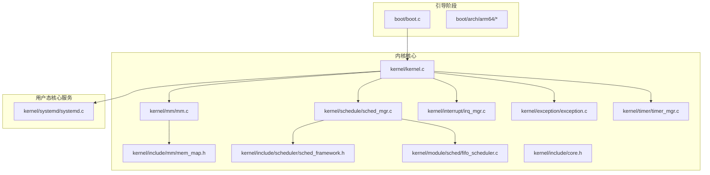
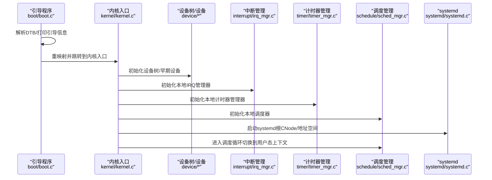
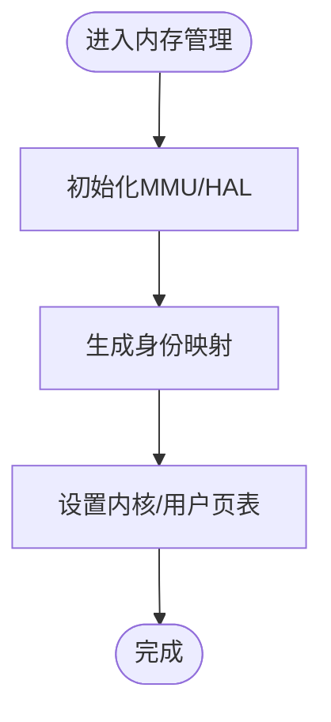
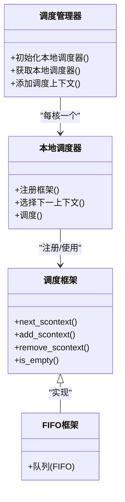
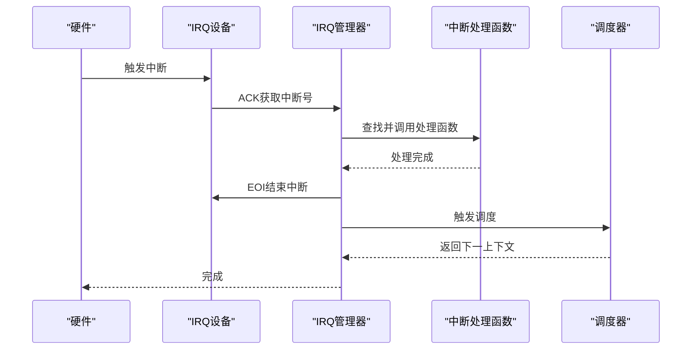
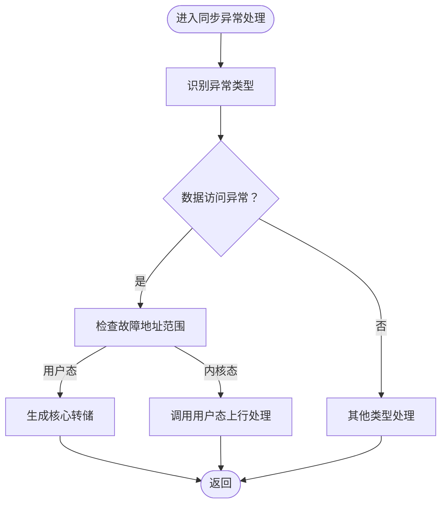
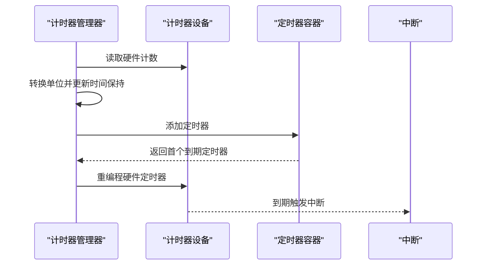
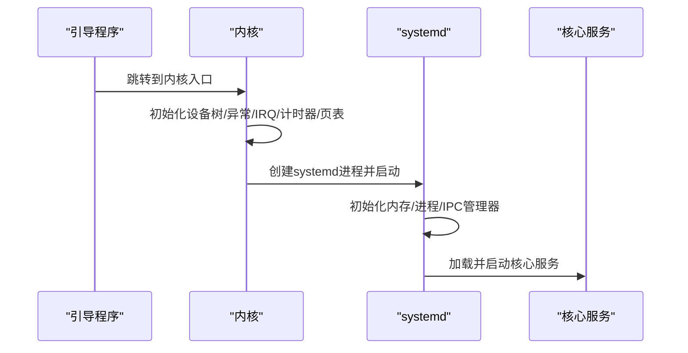
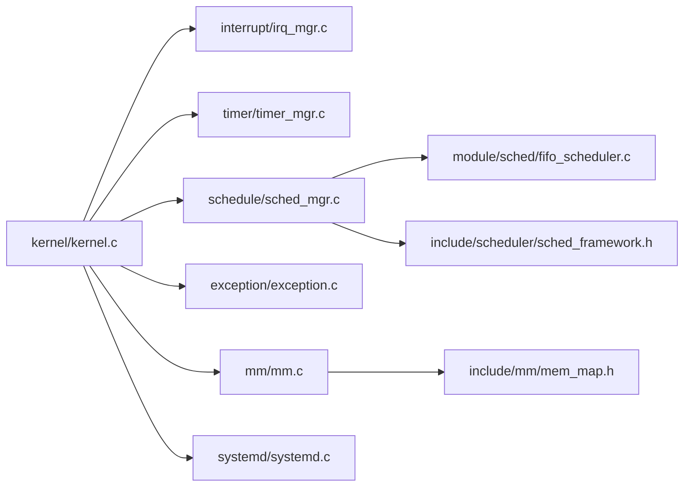

# 内核核心模块

<cite>
**本文引用的文件**
- [README.md](file://README.md)
- [microkernel_design.md](file://docs/kernel/microkernel_design.md)
- [kernel.c](file://kernel/kernel.c)
- [boot.c](file://boot/boot.c)
- [core.h](file://kernel/include/core.h)
- [mm.c](file://kernel/mm/mm.c)
- [mem_map.h](file://kernel/include/mm/mem_map.h)
- [sched_mgr.c](file://kernel/schedule/sched_mgr.c)
- [sched_framework.h](file://kernel/include/scheduler/sched_framework.h)
- [fifo_scheduler.c](file://kernel/module/sched/fifo_scheduler.c)
- [irq_mgr.c](file://kernel/interrupt/irq_mgr.c)
- [exception.c](file://kernel/exception/exception.c)
- [timer_mgr.c](file://kernel/timer/timer_mgr.c)
- [systemd.c](file://kernel/systemd/systemd.c)
</cite>

## 目录
1. [简介](#简介)
2. [项目结构](#项目结构)
3. [核心组件](#核心组件)
4. [架构总览](#架构总览)
5. [详细组件分析](#详细组件分析)
6. [依赖分析](#依赖分析)
7. [性能考虑](#性能考虑)
8. [故障排除指南](#故障排除指南)
9. [结论](#结论)
10. [附录](#附录)

## 简介
本文件面向TranquilOS内核核心模块，系统性梳理内存管理、进程调度、中断与异常处理、计时器以及引导流程等关键子系统，并阐明它们之间的协作关系与数据交换方式。文档兼顾初学者的概念理解与高级开发者的实现细节，提供初始化流程、运行时行为、性能特征、配置参数与调优建议，以及常见集成问题的排查路径。

## 项目结构
TranquilOS采用微内核架构，内核仅保留最小集能力，核心服务（如进程/内存/IPC管理）由用户态systemd承担。内核主要目录与职责概览如下：
- boot：引导阶段代码，负责设备树解析、内核重映射与跳转至内核主入口
- kernel：内核核心源码，包含内存、调度、中断、异常、计时器、上下文切换、capability等
- systemd：用户态核心系统服务，负责加载并管理核心服务进程
- docs：设计文档与背景说明

图表来源
- [boot.c](file://boot/boot.c#L1-L176)
- [kernel.c](file://kernel/kernel.c#L1-L225)
- [mm.c](file://kernel/mm/mm.c#L1-L45)
- [mem_map.h](file://kernel/include/mm/mem_map.h#L1-L29)
- [sched_mgr.c](file://kernel/schedule/sched_mgr.c#L1-L167)
- [sched_framework.h](file://kernel/include/scheduler/sched_framework.h#L1-L20)
- [fifo_scheduler.c](file://kernel/module/sched/fifo_scheduler.c#L1-L111)
- [irq_mgr.c](file://kernel/interrupt/irq_mgr.c#L1-L142)
- [exception.c](file://kernel/exception/exception.c#L1-L36)
- [timer_mgr.c](file://kernel/timer/timer_mgr.c#L1-L208)
- [systemd.c](file://kernel/systemd/systemd.c#L1-L247)

章节来源
- [README.md](file://README.md#L1-L42)
- [microkernel_design.md](file://docs/kernel/microkernel_design.md#L1-L37)

## 核心组件
本节概述四大核心模块及其职责与边界：
- 内存管理：内核仅保留引导期boot allocator，后续由systemd接管物理内存管理与地址空间布局
- 进程调度：基于本地调度器与调度框架（当前实现FIFO），支持多核绑定与优先级抽象
- 中断处理：IRQ管理器负责注册设备、分发到具体中断号、回调处理后触发调度
- 异常处理：同步异常（如数据访问错误）通过用户态上行调用或核心转储处理
- 计时器：提供单调时钟容器与硬件频率校准，支持定时器注册与重编程

章节来源
- [microkernel_design.md](file://docs/kernel/microkernel_design.md#L6-L27)
- [mm.c](file://kernel/mm/mm.c#L1-L45)
- [sched_mgr.c](file://kernel/schedule/sched_mgr.c#L1-L167)
- [fifo_scheduler.c](file://kernel/module/sched/fifo_scheduler.c#L1-L111)
- [irq_mgr.c](file://kernel/interrupt/irq_mgr.c#L1-L142)
- [exception.c](file://kernel/exception/exception.c#L1-L36)
- [timer_mgr.c](file://kernel/timer/timer_mgr.c#L1-L208)

## 架构总览
下图展示从引导到内核主循环的关键路径，以及各子系统间的交互：

图表来源
- [boot.c](file://boot/boot.c#L1-L176)
- [kernel.c](file://kernel/kernel.c#L125-L224)
- [irq_mgr.c](file://kernel/interrupt/irq_mgr.c#L105-L118)
- [timer_mgr.c](file://kernel/timer/timer_mgr.c#L164-L185)
- [sched_mgr.c](file://kernel/schedule/sched_mgr.c#L113-L129)
- [systemd.c](file://kernel/systemd/systemd.c#L217-L246)

## 详细组件分析

### 内存管理系统
- 设计定位：微内核仅保留引导期boot allocator，内核态不直接管理物理内存；systemd接管内存管理与地址空间布局
- 关键接口
  - 设置/获取页分配器：用于在引导后期切换到更完善的分配策略
  - MMU初始化与页表设置：建立内核/用户页表并写入CPU寄存器
  - 身份映射生成：为内核建立物理到虚拟的恒等映射
- 数据结构
  - 内存区域描述：记录文本/只读/可读写段的起止与名称
- 性能与复杂度
  - 页表设置与MMU开关为O(1)，内存区域枚举为O(N)
- 使用模式
  - 引导阶段先启用boot allocator，随后生成身份映射并设置页表，再由systemd接管

图表来源
- [mm.c](file://kernel/mm/mm.c#L29-L45)
- [mem_map.h](file://kernel/include/mm/mem_map.h#L13-L23)

章节来源
- [microkernel_design.md](file://docs/kernel/microkernel_design.md#L6-L8)
- [mm.c](file://kernel/mm/mm.c#L1-L45)
- [mem_map.h](file://kernel/include/mm/mem_map.h#L1-L29)

### 进程调度系统
- 组织结构
  - 调度管理器：维护每核本地调度器实例
  - 本地调度器：绑定到具体CPU，注册调度框架
  - 调度框架：抽象调度算法（当前FIFO）
- 关键流程
  - 注册调度框架（FIFO）到本地调度器
  - 将调度上下文加入框架队列
  - 选择下一个上下文并进行用户态上下文切换
- 复杂度与性能
  - FIFO框架为O(1)入队/出队；多框架轮询时按顺序遍历
- 配置与扩展
  - 可通过注册不同调度框架实现优先级/实时策略

图表来源
- [sched_mgr.c](file://kernel/schedule/sched_mgr.c#L89-L129)
- [sched_framework.h](file://kernel/include/scheduler/sched_framework.h#L11-L18)
- [fifo_scheduler.c](file://kernel/module/sched/fifo_scheduler.c#L87-L109)

章节来源
- [sched_mgr.c](file://kernel/schedule/sched_mgr.c#L1-L167)
- [sched_framework.h](file://kernel/include/scheduler/sched_framework.h#L1-L20)
- [fifo_scheduler.c](file://kernel/module/sched/fifo_scheduler.c#L1-L111)

### 中断处理系统
- 组件职责
  - IRQ管理器：每核本地实例，注册IRQ设备与处理函数
  - 设备层：提供ACK/EIO操作以确认中断并通知硬件
  - 回调链：根据中断号查找已注册处理函数并执行
  - 调度联动：处理完成后触发一次调度，决定是否切换到更高优先级上下文
- 流程序列

图表来源
- [irq_mgr.c](file://kernel/interrupt/irq_mgr.c#L49-L83)

章节来源
- [irq_mgr.c](file://kernel/interrupt/irq_mgr.c#L1-L142)

### 异常处理机制
- 同步异常处理
  - 数据访问异常：区分用户态越界与内核态访问，前者可能触发核心转储，后者通过用户态上行调用处理
  - 日志与诊断：输出异常类型、故障地址与当前调度上下文名称
- 与调度的协作
  - 异常处理后通常会触发一次调度，以恢复或切换到合适的执行上下文

图表来源
- [exception.c](file://kernel/exception/exception.c#L11-L35)

章节来源
- [exception.c](file://kernel/exception/exception.c#L1-L36)

### 计时器与时间管理
- 功能要点
  - 每核本地计时器管理器：维护多个时钟容器（如单调时钟）
  - 时间保持：根据硬件计数计算纳秒时间，缓存最近硬件计数值
  - 定时器容器：支持最小堆/红黑树等容器，提供插入、删除、查询首项
  - 重编程：当新定时器最早到期时间提前时，重新编程硬件
- 关键接口
  - 更新时间保持、添加/移除定时器、重编程硬件、初始化滴答定时器

图表来源
- [timer_mgr.c](file://kernel/timer/timer_mgr.c#L97-L138)
- [timer_mgr.c](file://kernel/timer/timer_mgr.c#L50-L71)
- [timer_mgr.c](file://kernel/timer/timer_mgr.c#L84-L95)

章节来源
- [timer_mgr.c](file://kernel/timer/timer_mgr.c#L1-L208)

### 引导与系统守护进程启动
- 引导流程
  - 解析DTB，初始化早期设备，打印引导信息
  - 启用boot allocator，重映射内核镜像，跳转到内核入口
- 内核主流程
  - 初始化设备树、异常、IRQ、计时器、MMU页表、根CNode与地址空间
  - 初始化模块与每核模块，启动systemd作为系统守护进程
- systemd职责
  - 初始化内存/进程/IPC管理器，加载核心服务（devmgr、fsmgr、idle、shell、netmgr）
  - 为每个服务创建进程、地址空间、能力节点与控制台，按部署模式创建线程并运行

图表来源
- [boot.c](file://boot/boot.c#L82-L107)
- [kernel.c](file://kernel/kernel.c#L125-L224)
- [systemd.c](file://kernel/systemd/systemd.c#L217-L246)

章节来源
- [boot.c](file://boot/boot.c#L1-L176)
- [kernel.c](file://kernel/kernel.c#L1-L225)
- [systemd.c](file://kernel/systemd/systemd.c#L1-L247)

## 依赖分析
- 组件耦合
  - 内核入口依赖设备树、异常、IRQ、计时器、调度与systemd
  - 调度器依赖调度框架（FIFO）与本地CPU上下文
  - IRQ管理器依赖IRQ设备与调度器，形成“处理—调度”闭环
  - 异常处理依赖当前执行上下文与上行调用端点
  - 计时器管理器依赖硬件计时器设备与容器实现
- 外部依赖
  - 设备树与平台驱动（如GIC、UART、PMU等）通过HAL抽象接入
  - 用户态systemd通过ELF装载、能力传递与IPC进行交互

图表来源
- [kernel.c](file://kernel/kernel.c#L1-L25)
- [irq_mgr.c](file://kernel/interrupt/irq_mgr.c#L1-L12)
- [timer_mgr.c](file://kernel/timer/timer_mgr.c#L1-L8)
- [sched_mgr.c](file://kernel/schedule/sched_mgr.c#L1-L4)
- [exception.c](file://kernel/exception/exception.c#L1-L9)
- [mm.c](file://kernel/mm/mm.c#L1-L8)
- [systemd.c](file://kernel/systemd/systemd.c#L1-L14)
- [fifo_scheduler.c](file://kernel/module/sched/fifo_scheduler.c#L1-L12)
- [sched_framework.h](file://kernel/include/scheduler/sched_framework.h#L1-L18)
- [mem_map.h](file://kernel/include/mm/mem_map.h#L1-L23)

章节来源
- [kernel.c](file://kernel/kernel.c#L1-L25)
- [sched_mgr.c](file://kernel/schedule/sched_mgr.c#L1-L4)
- [irq_mgr.c](file://kernel/interrupt/irq_mgr.c#L1-L12)
- [timer_mgr.c](file://kernel/timer/timer_mgr.c#L1-L8)
- [mm.c](file://kernel/mm/mm.c#L1-L8)
- [systemd.c](file://kernel/systemd/systemd.c#L1-L14)

## 性能考虑
- 调度开销
  - FIFO框架为O(1)队列操作；多框架轮询时需注意遍历成本
  - 通过将高优先级任务绑定到特定CPU核，减少跨核迁移
- 中断延迟
  - IRQ管理器ACK/EIO流程应尽量短小；避免在中断处理中进行阻塞操作
  - 将耗时逻辑迁移到线程或异步处理，缩短中断处理路径
- 内存与页表
  - 页表设置与MMU开关为常数时间；避免频繁重建页表
  - 在引导阶段完成身份映射与页表设置，运行期尽量减少TLB抖动
- 计时器精度
  - 依据硬件频率计算纳秒时间，合理选择容器类型（最小堆/红黑树）以平衡插入与查询复杂度
  - 当定时器到期时间提前时才重编程硬件，降低中断频率

## 故障排除指南
- 引导阶段问题
  - 未找到内核/宿主镜像节点：检查设备树兼容属性与地址映射
  - 无法重映射：确认MMU初始化与页表设置正确
- 内核初始化失败
  - 未初始化IRQ/计时器/调度器：检查对应模块初始化顺序与返回值
  - 未找到systemd：确认设备树中存在相应节点且地址有效
- 调度相关
  - 调度框架未注册：确认本地调度器已注册调度框架
  - 上下文为空：检查调度队列是否正确入队/出队
- 中断处理
  - 未注册中断号：确认IRQ管理器已注册对应中断号与处理函数
  - EOI失败：检查设备层ACK/EIO实现与硬件状态
- 异常处理
  - 数据访问异常：区分用户态越界与内核态访问，必要时启用核心转储
  - 上行调用失败：检查用户态上行端点是否存在与可用
- 计时器
  - 定时器未触发：确认容器中存在定时器且硬件已重编程
  - 时间漂移：检查时间保持更新与硬件频率读取

章节来源
- [boot.c](file://boot/boot.c#L34-L45)
- [kernel.c](file://kernel/kernel.c#L181-L218)
- [irq_mgr.c](file://kernel/interrupt/irq_mgr.c#L13-L28)
- [exception.c](file://kernel/exception/exception.c#L11-L24)
- [timer_mgr.c](file://kernel/timer/timer_mgr.c#L50-L71)

## 结论
TranquilOS以内核最小化为核心，将内存管理、进程/线程生命周期、文件系统与网络栈等核心能力下沉至用户态systemd，内核专注于异常/中断/调度/计时器等基础设施。通过清晰的模块边界与抽象接口（如调度框架、IRQ设备、定时器容器），系统具备良好的可扩展性与可维护性。实际部署中，建议重点关注引导阶段的设备树配置、页表与MMU初始化、中断ACK/EIO流程以及systemd服务的加载与运行状态。

## 附录
- 关键头文件与宏
  - 根CNode标识符与核心初始化声明：参见 [core.h](file://kernel/include/core.h#L5-L8)
- 设计文档参考
  - 微内核设计与内存管理策略：参见 [microkernel_design.md](file://docs/kernel/microkernel_design.md#L1-L37)
- 平台与构建
  - 支持平台与构建脚本位于顶层README与scripts目录，详见 [README.md](file://README.md#L35-L42)