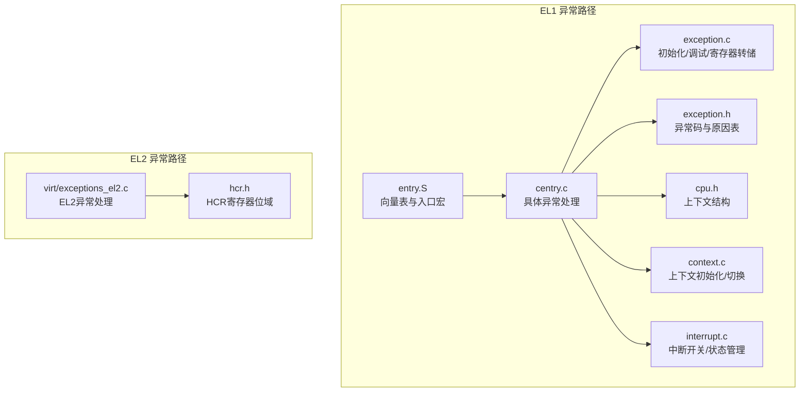
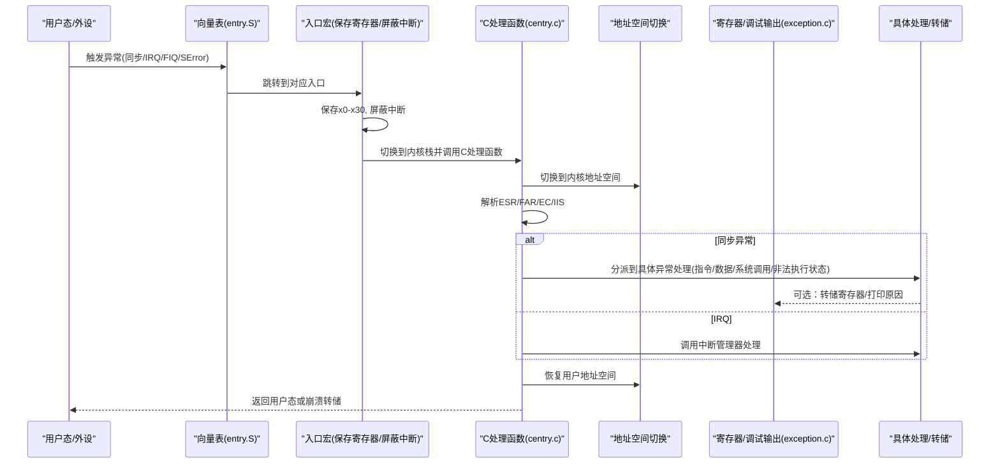
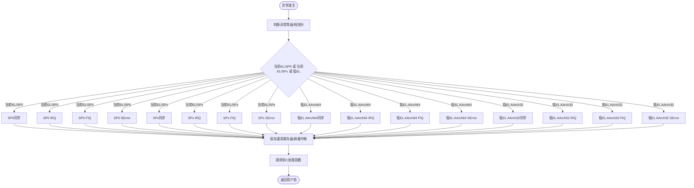
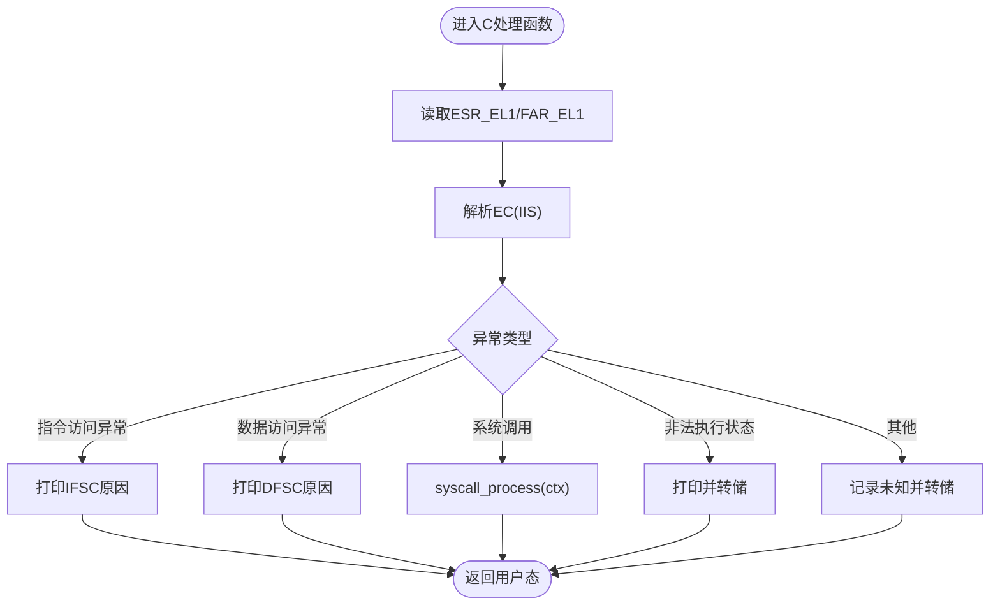
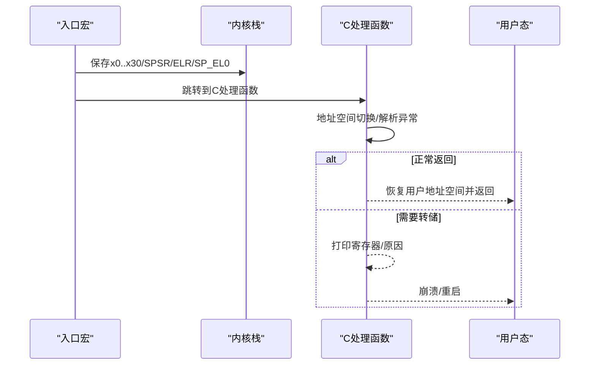
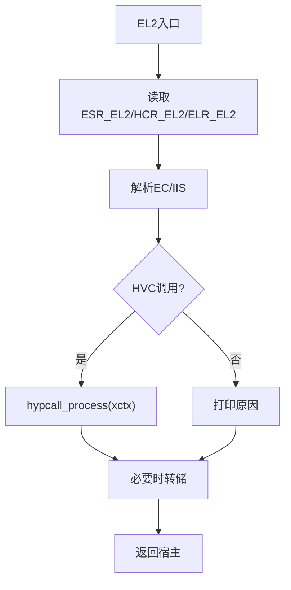
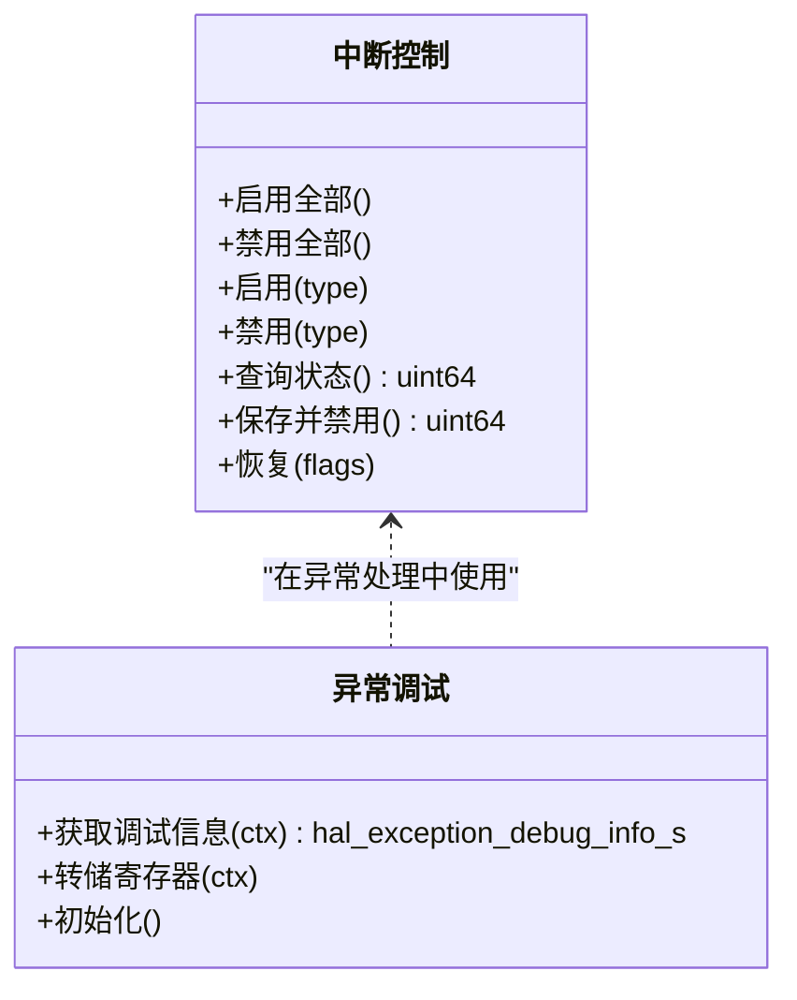
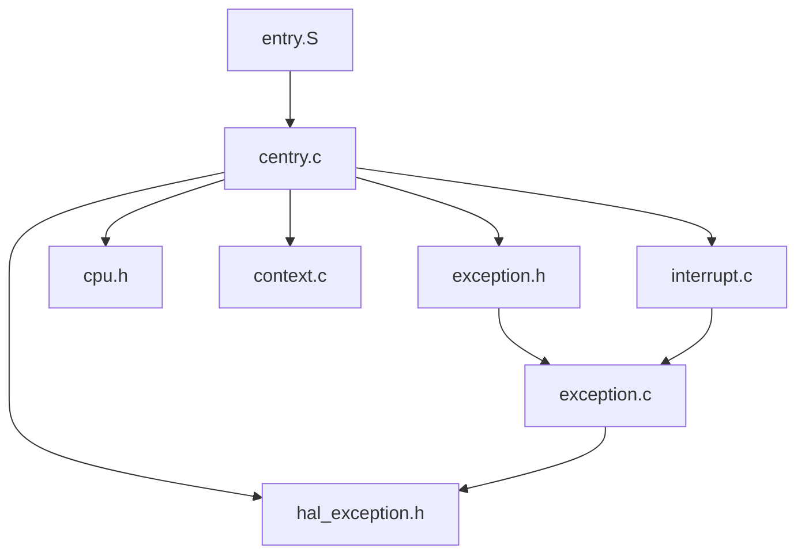

# 异常处理机制

<cite>
**本文引用的文件**
- [kernel/arch/arm64/exception.c](file://kernel/arch/arm64/exception.c)
- [kernel/arch/arm64/interrupt.c](file://kernel/arch/arm64/interrupt.c)
- [kernel/arch/arm64/entry/entry.S](file://kernel/arch/arm64/entry/entry.S)
- [kernel/arch/arm64/entry/centry.c](file://kernel/arch/arm64/entry/centry.c)
- [kernel/include/arch/arm64/exception.h](file://kernel/include/arch/arm64/exception.h)
- [kernel/include/arch/arm64/exceptions_el1.h](file://kernel/include/arch/arm64/exceptions_el1.h)
- [kernel/include/arch/arm64/cpu.h](file://kernel/include/arch/arm64/cpu.h)
- [kernel/include/arch/arm64/registers/spsr.h](file://kernel/include/arch/arm64/registers/spsr.h)
- [kernel/include/arch/generic/hal_exception.h](file://kernel/include/arch/generic/hal_exception.h)
- [kernel/arch/arm64/context.c](file://kernel/arch/arm64/context.c)
- [virt/exceptions_el2.c](file://virt/exceptions_el2.c)
- [kernel/include/arch/arm64/registers/hcr.h](file://kernel/include/arch/arm64/registers/hcr.h)
- [kernel/include/arch/arm64/registers/tcr.h](file://kernel/include/arch/arm64/registers/tcr.h)
</cite>

## 目录
1. [简介](#简介)
2. [项目结构](#项目结构)
3. [核心组件](#核心组件)
4. [架构总览](#架构总览)
5. [详细组件分析](#详细组件分析)
6. [依赖关系分析](#依赖关系分析)
7. [性能考量](#性能考量)
8. [故障排查指南](#故障排查指南)
9. [结论](#结论)
10. [附录](#附录)

## 简介
本文件系统化梳理TranquilOS在ARM64架构下的异常处理机制，覆盖异常向量表布局、异常类型分类与处理流程、异常上下文保存与恢复、EL1/EL2异常路径、中断控制以及调试与性能影响。文档同时给出常见异常问题（如异常循环、上下文损坏、调试困难）的定位与修复建议，并提供面向初学者与高级开发者的分层说明。

## 项目结构
围绕ARM64异常处理的关键源文件分布如下：
- 汇编向量表与入口：entry.S 定义EL1异常向量表与跳转宏；centry.c 提供各异常入口的C实现。
- 异常与寄存器接口：exception.c 提供异常初始化、调试信息获取与寄存器转储；exception.h 定义异常码与原因描述；spsr.h 定义SPSR位域与异常等级。
- 上下文与切换：cpu.h 定义ARM64上下文结构；context.c 提供用户态上下文初始化与寄存器读写；interrupt.c 提供中断开关与状态保存/恢复。
- 虚拟化扩展：virt/exceptions_el2.c 处理EL2异常路径（如HVC调用）。

**图示来源**
- [kernel/arch/arm64/entry/entry.S](file://kernel/arch/arm64/entry/entry.S#L65-L108)
- [kernel/arch/arm64/entry/centry.c](file://kernel/arch/arm64/entry/centry.c#L1-L224)
- [kernel/arch/arm64/exception.c](file://kernel/arch/arm64/exception.c#L108-L117)
- [kernel/include/arch/arm64/exception.h](file://kernel/include/arch/arm64/exception.h#L1-L113)
- [kernel/include/arch/arm64/cpu.h](file://kernel/include/arch/arm64/cpu.h#L85-L94)
- [kernel/arch/arm64/context.c](file://kernel/arch/arm64/context.c#L12-L33)
- [kernel/arch/arm64/interrupt.c](file://kernel/arch/arm64/interrupt.c#L7-L66)
- [virt/exceptions_el2.c](file://virt/exceptions_el2.c#L51-L85)
- [kernel/include/arch/arm64/registers/hcr.h](file://kernel/include/arch/arm64/registers/hcr.h#L6-L71)

**章节来源**
- [kernel/arch/arm64/entry/entry.S](file://kernel/arch/arm64/entry/entry.S#L65-L108)
- [kernel/arch/arm64/entry/centry.c](file://kernel/arch/arm64/entry/centry.c#L1-L224)
- [kernel/arch/arm64/exception.c](file://kernel/arch/arm64/exception.c#L108-L117)
- [kernel/include/arch/arm64/exception.h](file://kernel/include/arch/arm64/exception.h#L1-L113)
- [kernel/include/arch/arm64/cpu.h](file://kernel/include/arch/arm64/cpu.h#L85-L94)
- [kernel/arch/arm64/context.c](file://kernel/arch/arm64/context.c#L12-L33)
- [kernel/arch/arm64/interrupt.c](file://kernel/arch/arm64/interrupt.c#L7-L66)
- [virt/exceptions_el2.c](file://virt/exceptions_el2.c#L51-L85)
- [kernel/include/arch/arm64/registers/hcr.h](file://kernel/include/arch/arm64/registers/hcr.h#L6-L71)

## 核心组件
- 异常向量表与入口
  - 向量表由汇编定义，按“当前EL/SP0、当前EL/SPx、低EL AArch64/AArch32”四类排列，每类含同步、IRQ、FIQ、SError四种入口。
  - 入口宏负责屏蔽中断、保存通用寄存器、切换到内核栈并跳转至对应C处理函数。
- 异常初始化与调试
  - 初始化时设置VBAR_EL1指向向量表，校验对齐；提供异常调试信息获取与寄存器转储。
- 异常类型与原因
  - 定义EC（Exception Class）与IFSC/DFSC等字段，映射到人类可读的原因字符串。
- 上下文与切换
  - ARM64上下文结构包含通用寄存器、上下文寄存器（SPSR/ELR/SP）与FPU寄存器；提供用户态上下文初始化与寄存器读写。
- 中断控制
  - 提供DAIF位粒度的中断开关与状态保存/恢复，支持普通、快速、SError与Debug四类中断。
- EL2异常（虚拟化）
  - EL2路径处理HVC等异常，结合HCR寄存器位域进行虚拟化控制。

**章节来源**
- [kernel/arch/arm64/entry/entry.S](file://kernel/arch/arm64/entry/entry.S#L1-L108)
- [kernel/arch/arm64/entry/centry.c](file://kernel/arch/arm64/entry/centry.c#L18-L163)
- [kernel/arch/arm64/exception.c](file://kernel/arch/arm64/exception.c#L22-L117)
- [kernel/include/arch/arm64/exception.h](file://kernel/include/arch/arm64/exception.h#L4-L113)
- [kernel/include/arch/arm64/cpu.h](file://kernel/include/arch/arm64/cpu.h#L85-L94)
- [kernel/arch/arm64/context.c](file://kernel/arch/arm64/context.c#L7-L98)
- [kernel/arch/arm64/interrupt.c](file://kernel/arch/arm64/interrupt.c#L7-L66)
- [virt/exceptions_el2.c](file://virt/exceptions_el2.c#L51-L85)
- [kernel/include/arch/arm64/registers/hcr.h](file://kernel/include/arch/arm64/registers/hcr.h#L6-L71)

## 架构总览
下图展示了从异常触发到处理完成的整体流程，涵盖向量表、入口宏、C处理函数、地址空间切换、异常类型解析与最终恢复或转储。

**图示来源**
- [kernel/arch/arm64/entry/entry.S](file://kernel/arch/arm64/entry/entry.S#L65-L108)
- [kernel/arch/arm64/entry/centry.c](file://kernel/arch/arm64/entry/centry.c#L18-L163)
- [kernel/arch/arm64/exception.c](file://kernel/arch/arm64/exception.c#L22-L117)

## 详细组件分析

### 异常向量表与入口
- 向量表布局
  - 当前EL同栈指针（SP0）与不同栈指针（SPx）两类，分别处理同步、IRQ、FIQ、SError。
  - 低EL（AArch64/AArch32）两类，同样包含同步、IRQ、FIQ、SError。
- 入口宏行为
  - 通过宏保存通用寄存器并屏蔽中断，随后根据异常等级切换到内核栈并跳转至C处理函数。
- 初始化
  - 设置VBAR_EL1并校验对齐，确保异常向量表位于正确位置。

**图示来源**
- [kernel/arch/arm64/entry/entry.S](file://kernel/arch/arm64/entry/entry.S#L65-L108)

**章节来源**
- [kernel/arch/arm64/entry/entry.S](file://kernel/arch/arm64/entry/entry.S#L1-L108)

### 异常类型分类与处理
- 异常码与原因
  - EC（Exception Class）用于区分异常类型，如指令/数据访问异常、系统调用、非法执行状态等。
  - IFSC/DFSC用于细化具体原因，例如地址大小错误、翻译/权限/对齐等。
- 入口处理逻辑
  - 当前EL SPx同步：解析EC并打印原因，必要时触发转储。
  - 低EL AArch64同步：根据EC分派到指令/数据访问异常、系统调用或未知异常处理。
  - IRQ路径：获取本地中断管理器并交由其处理。

**图示来源**
- [kernel/arch/arm64/entry/centry.c](file://kernel/arch/arm64/entry/centry.c#L113-L163)
- [kernel/include/arch/arm64/exception.h](file://kernel/include/arch/arm64/exception.h#L39-L111)

**章节来源**
- [kernel/arch/arm64/entry/centry.c](file://kernel/arch/arm64/entry/centry.c#L46-L163)
- [kernel/include/arch/arm64/exception.h](file://kernel/include/arch/arm64/exception.h#L4-L113)

### 异常上下文保存与恢复
- 保存
  - 入口宏保存x0-x30，同时保存SPSR/ELR/SP_EL0等关键上下文寄存器。
  - 用户态上下文初始化时设置SP/LR/SPSR/PC/TPID等字段。
- 恢复
  - C处理函数在完成地址空间切换后，依据异常类型决定返回用户态或进行转储。
  - 中断路径通过中断管理器处理后返回。

**图示来源**
- [kernel/arch/arm64/entry/entry.S](file://kernel/arch/arm64/entry/entry.S#L6-L63)
- [kernel/arch/arm64/context.c](file://kernel/arch/arm64/context.c#L12-L33)
- [kernel/arch/arm64/entry/centry.c](file://kernel/arch/arm64/entry/centry.c#L18-L44)

**章节来源**
- [kernel/arch/arm64/entry/entry.S](file://kernel/arch/arm64/entry/entry.S#L6-L63)
- [kernel/arch/arm64/context.c](file://kernel/arch/arm64/context.c#L12-L33)
- [kernel/arch/arm64/entry/centry.c](file://kernel/arch/arm64/entry/centry.c#L18-L44)

### EL2异常处理（虚拟化）
- EL2入口与处理
  - EL2路径提供同步/IRQ/FIQ/SError入口，解析ESR_EL2与EC/IIS，处理HVC等。
  - 结合HCR寄存器位域进行虚拟化控制（如RW/E2H等），以决定是否透传或拦截某些异常。
- 与EL1差异
  - EL2处理更关注虚拟化场景下的异常分流与宿主机接管。

**图示来源**
- [virt/exceptions_el2.c](file://virt/exceptions_el2.c#L51-L85)
- [kernel/include/arch/arm64/registers/hcr.h](file://kernel/include/arch/arm64/registers/hcr.h#L6-L71)

**章节来源**
- [virt/exceptions_el2.c](file://virt/exceptions_el2.c#L51-L85)
- [kernel/include/arch/arm64/registers/hcr.h](file://kernel/include/arch/arm64/registers/hcr.h#L6-L71)

### 中断控制与调试
- 中断开关
  - 支持全局与按类别（普通/快速/SError/Debug）的DAIF位操作，提供状态保存与恢复。
- 调试
  - 提供异常调试信息结构体，包含异常综合信息、故障地址、异常等级与名称。
  - 提供寄存器转储函数，打印关键寄存器与上下文寄存器。

**图示来源**
- [kernel/arch/arm64/interrupt.c](file://kernel/arch/arm64/interrupt.c#L7-L66)
- [kernel/arch/arm64/exception.c](file://kernel/arch/arm64/exception.c#L22-L117)
- [kernel/include/arch/generic/hal_exception.h](file://kernel/include/arch/generic/hal_exception.h#L8-L24)

**章节来源**
- [kernel/arch/arm64/interrupt.c](file://kernel/arch/arm64/interrupt.c#L7-L66)
- [kernel/arch/arm64/exception.c](file://kernel/arch/arm64/exception.c#L22-L117)
- [kernel/include/arch/generic/hal_exception.h](file://kernel/include/arch/generic/hal_exception.h#L8-L24)

## 依赖关系分析
- 组件耦合
  - entry.S与centry.c强耦合：向量表定义与C处理函数一一对应。
  - exception.c依赖HAL接口与寄存器访问宏，提供调试与初始化能力。
  - centry.c依赖异常码表、上下文结构、中断管理器与地址空间切换。
- 外部依赖
  - 寄存器头文件（spsr.h、hcr.h、tcr.h）提供异常等级与控制寄存器语义。
  - 中断管理器与地址空间模块在异常处理中被调用。

**图示来源**
- [kernel/arch/arm64/entry/entry.S](file://kernel/arch/arm64/entry/entry.S#L65-L108)
- [kernel/arch/arm64/entry/centry.c](file://kernel/arch/arm64/entry/centry.c#L1-L224)
- [kernel/include/arch/arm64/exception.h](file://kernel/include/arch/arm64/exception.h#L1-L113)
- [kernel/arch/arm64/exception.c](file://kernel/arch/arm64/exception.c#L1-L119)
- [kernel/include/arch/arm64/cpu.h](file://kernel/include/arch/arm64/cpu.h#L85-L94)
- [kernel/arch/arm64/context.c](file://kernel/arch/arm64/context.c#L1-L98)
- [kernel/arch/arm64/interrupt.c](file://kernel/arch/arm64/interrupt.c#L1-L66)
- [kernel/include/arch/generic/hal_exception.h](file://kernel/include/arch/generic/hal_exception.h#L1-L24)

**章节来源**
- [kernel/arch/arm64/entry/entry.S](file://kernel/arch/arm64/entry/entry.S#L65-L108)
- [kernel/arch/arm64/entry/centry.c](file://kernel/arch/arm64/entry/centry.c#L1-L224)
- [kernel/arch/arm64/exception.c](file://kernel/arch/arm64/exception.c#L1-L119)
- [kernel/include/arch/arm64/exception.h](file://kernel/include/arch/arm64/exception.h#L1-L113)
- [kernel/include/arch/arm64/cpu.h](file://kernel/include/arch/arm64/cpu.h#L85-L94)
- [kernel/arch/arm64/context.c](file://kernel/arch/arm64/context.c#L1-L98)
- [kernel/arch/arm64/interrupt.c](file://kernel/arch/arm64/interrupt.c#L1-L66)
- [kernel/include/arch/generic/hal_exception.h](file://kernel/include/arch/generic/hal_exception.h#L1-L24)

## 性能考量
- 向量表对齐
  - 初始化时检查VBAR对齐，确保向量表位于0x800字节边界，避免潜在性能与一致性问题。
- 中断屏蔽
  - 入口宏在保存寄存器阶段屏蔽中断，减少并发开销但需尽快恢复，避免延迟响应。
- 地址空间切换
  - 在异常处理前后进行地址空间切换，避免不必要的切换成本；仅在需要时切换。
- 日志与转储
  - 调试输出与转储会带来显著开销，建议在生产环境降低日志级别或关闭非必要转储。

**章节来源**
- [kernel/arch/arm64/exception.c](file://kernel/arch/arm64/exception.c#L108-L117)
- [kernel/arch/arm64/entry/entry.S](file://kernel/arch/arm64/entry/entry.S#L27-L29)
- [kernel/arch/arm64/entry/centry.c](file://kernel/arch/arm64/entry/centry.c#L18-L44)

## 故障排查指南
- 异常循环
  - 现象：同一异常反复触发，系统无法前进。
  - 排查要点：检查异常处理函数是否正确恢复用户地址空间；确认中断未被意外开启导致重复触发；核对ESR/FAR解析逻辑。
- 上下文损坏
  - 现象：寄存器值异常或崩溃。
  - 排查要点：确认入口宏完整保存x0..x30与关键上下文寄存器；检查用户态上下文初始化字段是否正确设置。
- 调试困难
  - 现象：无法定位异常来源。
  - 排查要点：使用寄存器转储函数输出关键寄存器；结合异常码与原因表定位IFSC/DFSC；在EL2场景检查HCR配置。
- 中断不响应
  - 现象：IRQ/FIQ无响应。
  - 排查要点：检查DAIF位状态与中断开关；确认IRQ路径已获取本地中断管理器并调用处理函数。

**章节来源**
- [kernel/arch/arm64/entry/entry.S](file://kernel/arch/arm64/entry/entry.S#L6-L63)
- [kernel/arch/arm64/context.c](file://kernel/arch/arm64/context.c#L12-L33)
- [kernel/arch/arm64/entry/centry.c](file://kernel/arch/arm64/entry/centry.c#L78-L97)
- [kernel/arch/arm64/interrupt.c](file://kernel/arch/arm64/interrupt.c#L7-L66)
- [kernel/arch/arm64/exception.c](file://kernel/arch/arm64/exception.c#L47-L106)

## 结论
TranquilOS在ARM64上的异常处理机制以清晰的向量表与入口宏为基础，配合C层的异常解析、地址空间切换与调试输出，实现了对同步异常、IRQ/FIQ与SError的有序处理。EL2路径进一步增强了虚拟化场景下的异常分流能力。通过合理的中断控制与上下文管理，系统在保证稳定性的同时兼顾了可调试性与性能可控性。针对常见问题，建议优先检查向量表对齐、上下文保存完整性与中断状态管理。

## 附录
- 关键API与数据结构
  - 异常调试接口：hal_exception_get_debug_info、hal_exception_dump_registers、hal_exception_init
  - 中断控制接口：hal_irq_enable_all、hal_irq_disable_all、hal_irq_enable、hal_irq_disable、hal_irq_save_and_disable、hal_irq_restore
  - 上下文结构：arm64_cpu_context_s、arm64_common_regs_s、arm64_context_regs_s
  - 异常码与原因：EC_*、INSABORT_REASON[]、DATAABORT_REASON[]
  - EL1入口声明：exceptions_el1.h中的各入口函数原型

**章节来源**
- [kernel/include/arch/generic/hal_exception.h](file://kernel/include/arch/generic/hal_exception.h#L8-L24)
- [kernel/arch/arm64/interrupt.c](file://kernel/arch/arm64/interrupt.c#L7-L66)
- [kernel/include/arch/arm64/cpu.h](file://kernel/include/arch/arm64/cpu.h#L85-L94)
- [kernel/include/arch/arm64/exception.h](file://kernel/include/arch/arm64/exception.h#L4-L113)
- [kernel/include/arch/arm64/exceptions_el1.h](file://kernel/include/arch/arm64/exceptions_el1.h#L4-L22)