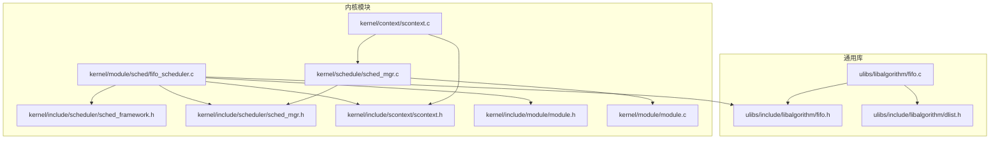
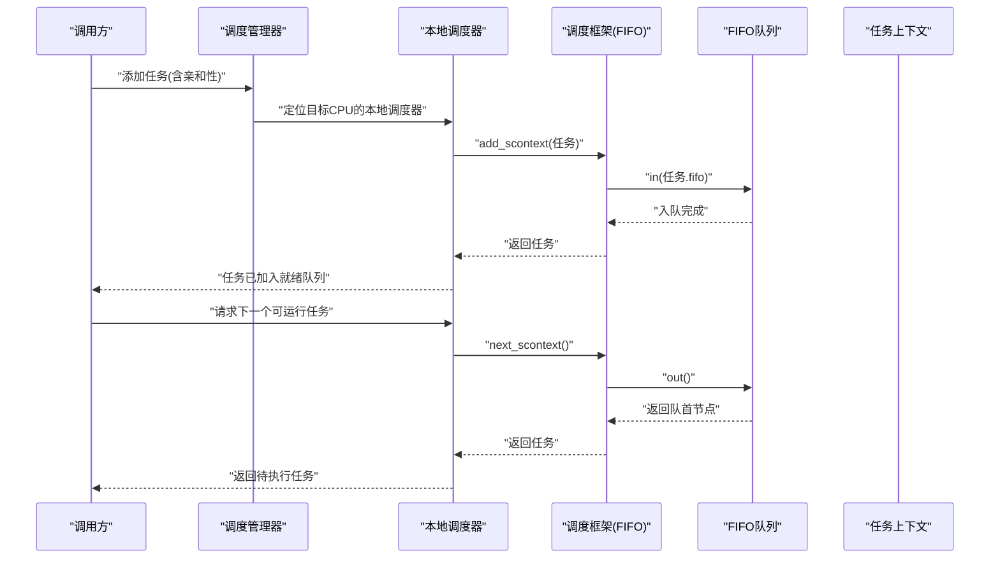
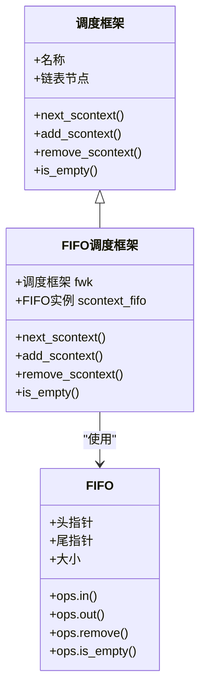
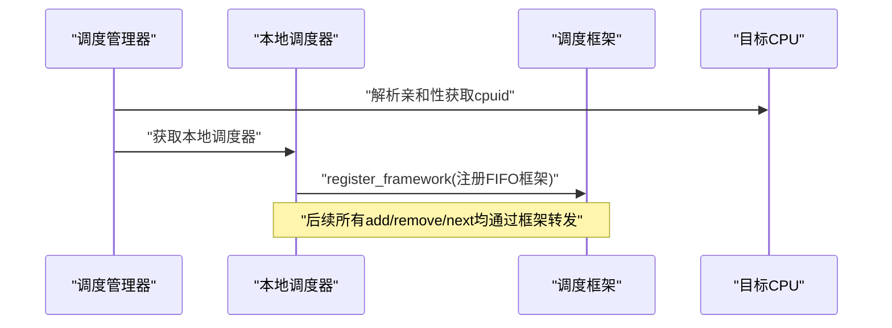
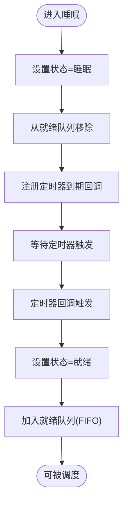
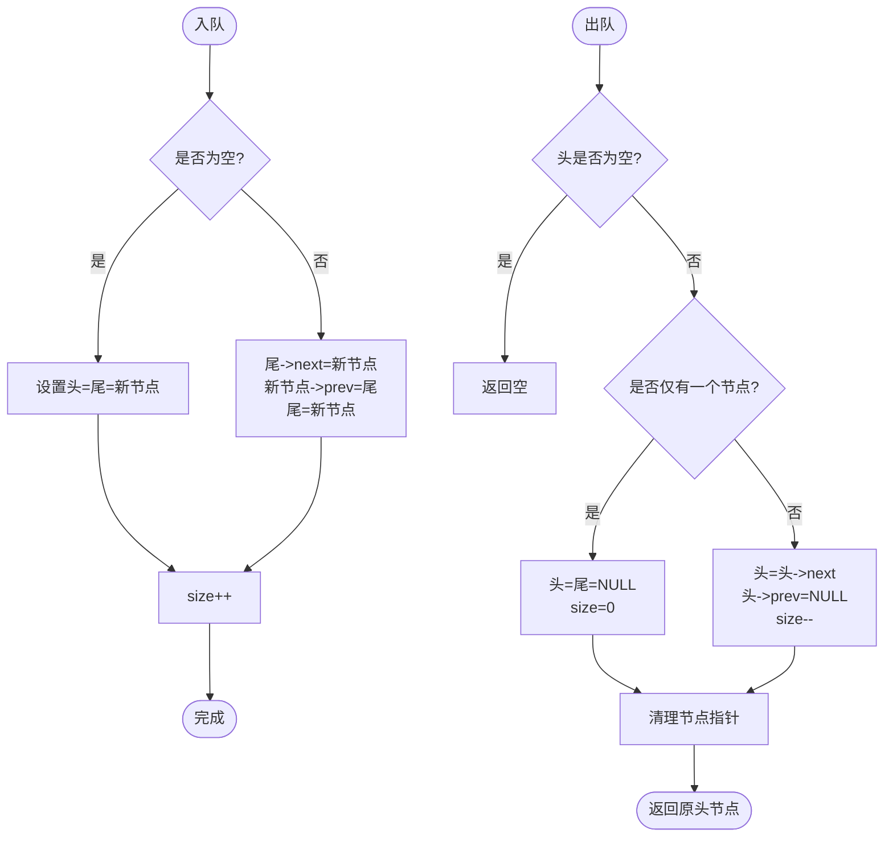
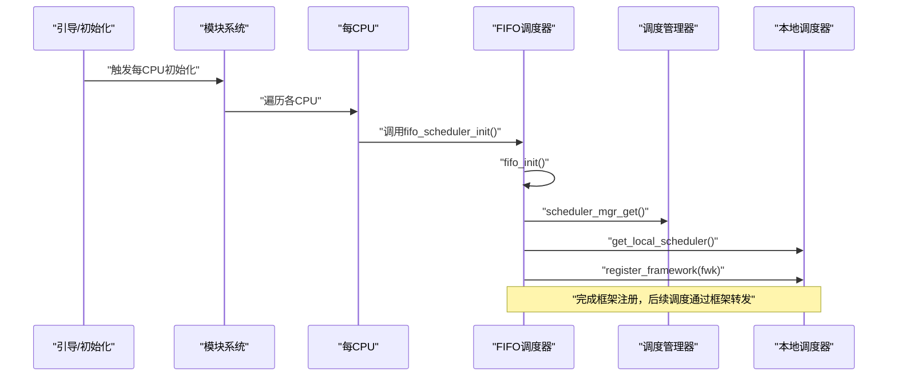
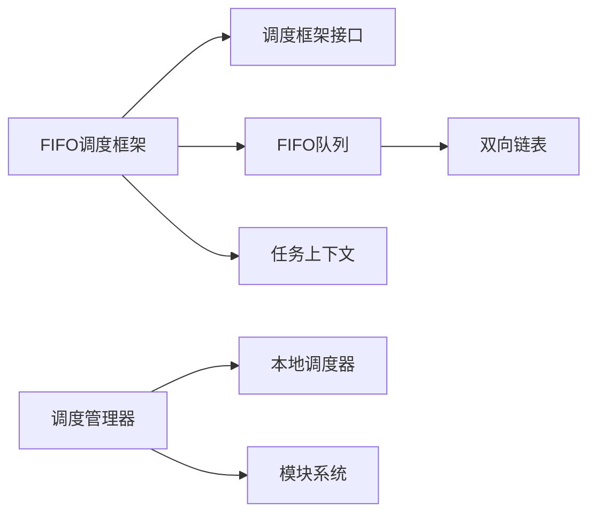

# FIFO调度器

<cite>
**本文引用的文件**
- [kernel/module/sched/fifo_scheduler.c](file://kernel/module/sched/fifo_scheduler.c)
- [ulibs/include/libalgorithm/fifo.h](file://ulibs/include/libalgorithm/fifo.h)
- [ulibs/libalgorithm/fifo.c](file://ulibs/libalgorithm/fifo.c)
- [kernel/include/scheduler/sched_framework.h](file://kernel/include/scheduler/sched_framework.h)
- [kernel/include/scheduler/sched_mgr.h](file://kernel/include/scheduler/sched_mgr.h)
- [kernel/schedule/sched_mgr.c](file://kernel/schedule/sched_mgr.c)
- [kernel/include/scontext/scontext.h](file://kernel/include/scontext/scontext.h)
- [kernel/context/scontext.c](file://kernel/context/scontext.c)
- [kernel/include/module/module.h](file://kernel/include/module/module.h)
- [kernel/module/module.c](file://kernel/module/module.c)
- [ulibs/include/libalgorithm/dlist.h](file://ulibs/include/libalgorithm/dlist.h)
</cite>

## 目录
1. [引言](#引言)
2. [项目结构](#项目结构)
3. [核心组件](#核心组件)
4. [架构总览](#架构总览)
5. [详细组件分析](#详细组件分析)
6. [依赖关系分析](#依赖关系分析)
7. [性能考量](#性能考量)
8. [故障排查指南](#故障排查指南)
9. [结论](#结论)
10. [附录](#附录)

## 引言
本文件面向TranquilOS中的FIFO（先进先出）调度器，系统化阐述其设计与实现：从调度框架、任务上下文、队列数据结构到初始化流程、任务入队/出队与调度决策；并结合内核模块化初始化机制，给出端到端的调度工作流。文档同时覆盖性能特征、适用场景、限制与常见问题的定位与优化建议，帮助读者快速理解并高效使用该调度器。

## 项目结构
FIFO调度器位于内核模块目录下，围绕“调度框架-本地调度器-调度管理器-任务上下文-通用FIFO队列”五层组织，辅以模块初始化与注册机制。

图表来源
- [kernel/module/sched/fifo_scheduler.c](file://kernel/module/sched/fifo_scheduler.c#L1-L111)
- [kernel/include/scheduler/sched_framework.h](file://kernel/include/scheduler/sched_framework.h#L1-L20)
- [kernel/include/scheduler/sched_mgr.h](file://kernel/include/scheduler/sched_mgr.h#L1-L49)
- [kernel/schedule/sched_mgr.c](file://kernel/schedule/sched_mgr.c#L1-L167)
- [kernel/include/scontext/scontext.h](file://kernel/include/scontext/scontext.h#L1-L50)
- [kernel/context/scontext.c](file://kernel/context/scontext.c#L1-L68)
- [kernel/include/module/module.h](file://kernel/include/module/module.h#L1-L12)
- [kernel/module/module.c](file://kernel/module/module.c#L1-L18)
- [ulibs/include/libalgorithm/fifo.h](file://ulibs/include/libalgorithm/fifo.h#L1-L27)
- [ulibs/libalgorithm/fifo.c](file://ulibs/libalgorithm/fifo.c#L1-L98)
- [ulibs/include/libalgorithm/dlist.h](file://ulibs/include/libalgorithm/dlist.h#L1-L61)

章节来源
- [kernel/module/sched/fifo_scheduler.c](file://kernel/module/sched/fifo_scheduler.c#L1-L111)
- [kernel/schedule/sched_mgr.c](file://kernel/schedule/sched_mgr.c#L1-L167)
- [ulibs/libalgorithm/fifo.c](file://ulibs/libalgorithm/fifo.c#L1-L98)

## 核心组件
- 调度框架接口：定义调度器对外统一接口（取下一个、加入、移除、判空），并以链表串联多个框架实例。
- 本地调度器：每个CPU一个实例，持有当前运行的任务指针、锁与调度框架指针，并负责注册框架与转发调用。
- 调度管理器：全局单例，按亲和性将任务分发至对应CPU的本地调度器，负责初始化本地调度器。
- 任务上下文：包含状态字段与嵌入的队列节点，用于在FIFO中排队。
- FIFO队列：基于双向链表实现的环形队列，提供入队、出队、删除与判空操作。

章节来源
- [kernel/include/scheduler/sched_framework.h](file://kernel/include/scheduler/sched_framework.h#L6-L18)
- [kernel/include/scheduler/sched_mgr.h](file://kernel/include/scheduler/sched_mgr.h#L14-L28)
- [kernel/include/scontext/scontext.h](file://kernel/include/scontext/scontext.h#L22-L43)
- [ulibs/include/libalgorithm/fifo.h](file://ulibs/include/libalgorithm/fifo.h#L11-L23)

## 架构总览
FIFO调度器通过“每CPU实例+统一调度框架”的方式，将任务上下文以FIFO队列形式管理，调度时由本地调度器选择非空框架并取出队首任务。

图表来源
- [kernel/schedule/sched_mgr.c](file://kernel/schedule/sched_mgr.c#L131-L147)
- [kernel/module/sched/fifo_scheduler.c](file://kernel/module/sched/fifo_scheduler.c#L38-L52)
- [ulibs/libalgorithm/fifo.c](file://ulibs/libalgorithm/fifo.c#L3-L21)

## 详细组件分析

### FIFO调度框架与实现
- 结构体布局：包含继承的调度框架与一个FIFO实例，每个CPU一个实例数组。
- 关键函数：
  - 取下一个：从FIFO出队，转换为任务上下文返回。
  - 加入：将任务的队列节点入队。
  - 移除：从任意位置删除任务节点。
  - 判空：委托FIFO判空。
- 初始化：每CPU调用一次，注册到本地调度器。

图表来源
- [kernel/module/sched/fifo_scheduler.c](file://kernel/module/sched/fifo_scheduler.c#L13-L16)
- [kernel/module/sched/fifo_scheduler.c](file://kernel/module/sched/fifo_scheduler.c#L18-L83)
- [ulibs/include/libalgorithm/fifo.h](file://ulibs/include/libalgorithm/fifo.h#L18-L23)

章节来源
- [kernel/module/sched/fifo_scheduler.c](file://kernel/module/sched/fifo_scheduler.c#L13-L111)

### 本地调度器与调度管理器
- 本地调度器：
  - 持有当前运行任务指针、调度框架指针、自旋锁与操作表。
  - 提供注册框架、取下一个、加入、移除等操作。
- 调度管理器：
  - 全局单例，按亲和位图选择目标CPU。
  - 初始化本地调度器并填充操作表。
  - 将任务加入指定CPU的本地调度器。

图表来源
- [kernel/schedule/sched_mgr.c](file://kernel/schedule/sched_mgr.c#L105-L129)
- [kernel/schedule/sched_mgr.c](file://kernel/schedule/sched_mgr.c#L131-L147)
- [kernel/module/sched/fifo_scheduler.c](file://kernel/module/sched/fifo_scheduler.c#L99-L109)

章节来源
- [kernel/include/scheduler/sched_mgr.h](file://kernel/include/scheduler/sched_mgr.h#L23-L28)
- [kernel/schedule/sched_mgr.c](file://kernel/schedule/sched_mgr.c#L105-L147)

### 任务上下文与状态流转
- 任务上下文包含：
  - 执行上下文指针、地址空间、能力节点、CPU上下文等。
  - 嵌入的队列节点，用于FIFO排队。
  - 状态枚举：就绪、运行、睡眠、阻塞、终止等。
- 睡眠与唤醒：
  - 睡眠时设置状态为睡眠并从就绪队列移除。
  - 定时器到期后回调将任务置为就绪并重新加入就绪队列。

图表来源
- [kernel/context/scontext.c](file://kernel/context/scontext.c#L47-L68)
- [kernel/context/scontext.c](file://kernel/context/scontext.c#L9-L30)
- [kernel/include/scontext/scontext.h](file://kernel/include/scontext/scontext.h#L12-L20)

章节来源
- [kernel/include/scontext/scontext.h](file://kernel/include/scontext/scontext.h#L22-L43)
- [kernel/context/scontext.c](file://kernel/context/scontext.c#L1-L68)

### FIFO队列数据结构与操作
- 数据结构：
  - 头尾指针与计数，提供统一的ops接口。
- 操作语义：
  - 入队：在队尾追加，保持FIFO顺序。
  - 出队：取队首元素，更新头指针。
  - 删除：支持从任意位置删除，维护前后节点连接。
  - 判空：基于size判断。

图表来源
- [ulibs/libalgorithm/fifo.c](file://ulibs/libalgorithm/fifo.c#L3-L83)
- [ulibs/include/libalgorithm/fifo.h](file://ulibs/include/libalgorithm/fifo.h#L18-L23)

章节来源
- [ulibs/include/libalgorithm/fifo.h](file://ulibs/include/libalgorithm/fifo.h#L1-L27)
- [ulibs/libalgorithm/fifo.c](file://ulibs/libalgorithm/fifo.c#L1-L98)

### 模块初始化与注册
- 每个CPU在“每CPU初始化阶段”调用FIFO调度器初始化函数，完成：
  - 初始化FIFO队列。
  - 获取调度管理器与本地调度器。
  - 填充调度框架的操作表并注册到本地调度器。
- 模块系统通过initcall机制在合适时机执行初始化。

图表来源
- [kernel/module/module.c](file://kernel/module/module.c#L14-L18)
- [kernel/include/module/module.h](file://kernel/include/module/module.h#L6-L7)
- [kernel/module/sched/fifo_scheduler.c](file://kernel/module/sched/fifo_scheduler.c#L87-L111)
- [kernel/schedule/sched_mgr.c](file://kernel/schedule/sched_mgr.c#L105-L129)

章节来源
- [kernel/module/module.c](file://kernel/module/module.c#L1-L18)
- [kernel/include/module/module.h](file://kernel/include/module/module.h#L1-L12)
- [kernel/module/sched/fifo_scheduler.c](file://kernel/module/sched/fifo_scheduler.c#L87-L111)

## 依赖关系分析
- 组件耦合：
  - FIFO调度框架依赖通用FIFO队列与调度框架接口。
  - 本地调度器依赖调度管理器提供的本地实例与操作表。
  - 任务上下文依赖调度管理器进行入队/出队。
- 外部依赖：
  - 模块系统提供初始化钩子。
  - 通用双向链表提供基础节点操作。

图表来源
- [kernel/module/sched/fifo_scheduler.c](file://kernel/module/sched/fifo_scheduler.c#L1-L12)
- [kernel/schedule/sched_mgr.c](file://kernel/schedule/sched_mgr.c#L1-L5)
- [ulibs/libalgorithm/fifo.c](file://ulibs/libalgorithm/fifo.c#L1-L2)
- [ulibs/include/libalgorithm/dlist.h](file://ulibs/include/libalgorithm/dlist.h#L8-L11)

章节来源
- [kernel/include/scheduler/sched_framework.h](file://kernel/include/scheduler/sched_framework.h#L4-L18)
- [ulibs/include/libalgorithm/dlist.h](file://ulibs/include/libalgorithm/dlist.h#L1-L61)

## 性能考量
- 时间复杂度
  - 入队/出队/删除：O(1)，基于双向链表的直接指针操作。
  - 判空：O(1)，基于size字段。
- 空间复杂度
  - 队列节点与任务上下文的list_node_s占用常数额外空间。
- 并发与锁
  - 本地调度器使用CAS自旋锁保护关键路径，避免多核竞争。
- 抢占与时间片
  - 当前实现未体现时间片轮转或抢占逻辑，调度仅在框架非空时取下一个任务，无强制时间片到期切换。
- 适用场景
  - 低开销、严格FIFO顺序的批处理或后台任务。
- 限制
  - 无优先级区分，无法满足实时性要求。
  - 无抢占，可能导致长任务阻塞短任务。

[本节为通用性能讨论，不直接分析具体文件]

## 故障排查指南
- 调度框架未注册
  - 现象：添加任务返回空或调度无输出。
  - 排查：确认每CPU初始化是否完成，框架是否成功注册到本地调度器。
  - 参考
    - [kernel/module/sched/fifo_scheduler.c](file://kernel/module/sched/fifo_scheduler.c#L99-L109)
    - [kernel/schedule/sched_mgr.c](file://kernel/schedule/sched_mgr.c#L89-L103)
- 任务状态异常
  - 现象：任务无法从就绪队列移除或无法再次入队。
  - 排查：检查任务状态转换逻辑，确保睡眠/唤醒路径正确。
  - 参考
    - [kernel/context/scontext.c](file://kernel/context/scontext.c#L9-L30)
    - [kernel/context/scontext.c](file://kernel/context/scontext.c#L47-L68)
- 队列节点悬挂
  - 现象：出队后仍被引用导致内存泄漏。
  - 排查：确认出队后节点指针清零，删除操作正确维护前后连接。
  - 参考
    - [ulibs/libalgorithm/fifo.c](file://ulibs/libalgorithm/fifo.c#L63-L83)
    - [ulibs/libalgorithm/fifo.c](file://ulibs/libalgorithm/fifo.c#L23-L61)
- 初始化失败
  - 现象：PANIC或日志报错。
  - 排查：检查调度管理器是否初始化、本地调度器是否获取成功。
  - 参考
    - [kernel/schedule/sched_mgr.c](file://kernel/schedule/sched_mgr.c#L155-L162)
    - [kernel/module/sched/fifo_scheduler.c](file://kernel/module/sched/fifo_scheduler.c#L91-L98)

章节来源
- [kernel/module/sched/fifo_scheduler.c](file://kernel/module/sched/fifo_scheduler.c#L87-L111)
- [kernel/schedule/sched_mgr.c](file://kernel/schedule/sched_mgr.c#L1-L167)
- [ulibs/libalgorithm/fifo.c](file://ulibs/libalgorithm/fifo.c#L1-L98)

## 结论
FIFO调度器以极简的队列模型实现了稳定的就绪任务管理与调度决策，具备O(1)的入队/出队性能与清晰的模块化边界。其无优先级、无抢占的设计使其适用于对公平性要求高但无强实时约束的场景。若需增强实时性与公平性，可在现有框架上扩展优先级队列与抢占策略，同时注意并发安全与状态一致性。

[本节为总结性内容，不直接分析具体文件]

## 附录

### 使用示例（步骤说明）
- 提交任务
  - 通过能力调用或系统服务将任务加入调度器，传入目标CPU亲和性。
  - 参考
    - [kernel/capability/cap_scontext.c](file://kernel/capability/cap_scontext.c#L316-L348)
    - [kernel/schedule/sched_mgr.c](file://kernel/schedule/sched_mgr.c#L131-L147)
- 调度决策
  - 本地调度器遍历已注册的调度框架，遇到非空框架即取下一个任务。
  - 参考
    - [kernel/schedule/sched_mgr.c](file://kernel/schedule/sched_mgr.c#L51-L72)
    - [kernel/module/sched/fifo_scheduler.c](file://kernel/module/sched/fifo_scheduler.c#L18-L36)
- 执行与上下文切换
  - 返回的任务将由上层调度器或执行框架进行上下文切换与执行。
  - 参考
    - [kernel/include/scontext/scontext.h](file://kernel/include/scontext/scontext.h#L22-L43)

章节来源
- [kernel/capability/cap_scontext.c](file://kernel/capability/cap_scontext.c#L316-L348)
- [kernel/schedule/sched_mgr.c](file://kernel/schedule/sched_mgr.c#L51-L72)
- [kernel/module/sched/fifo_scheduler.c](file://kernel/module/sched/fifo_scheduler.c#L18-L36)
- [kernel/include/scontext/scontext.h](file://kernel/include/scontext/scontext.h#L22-L43)