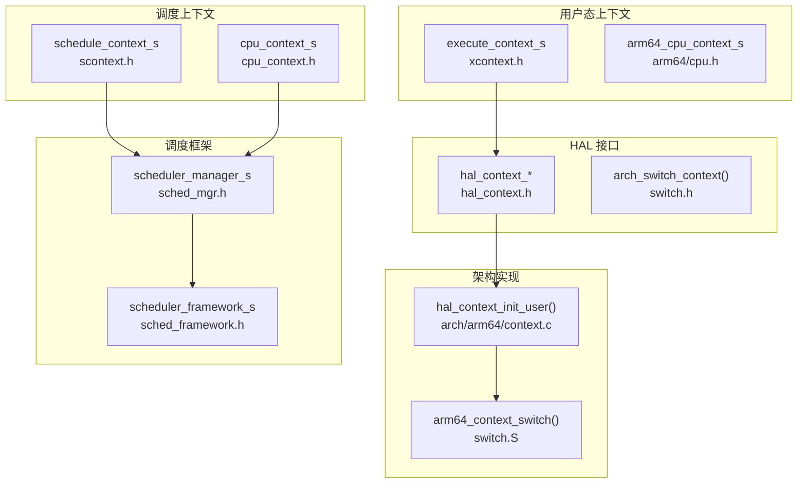
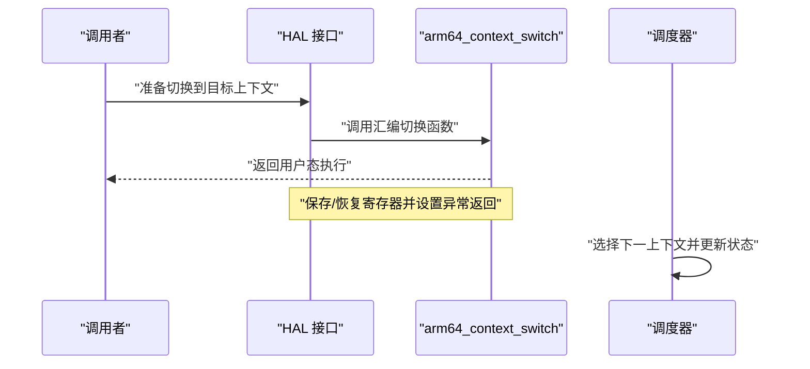
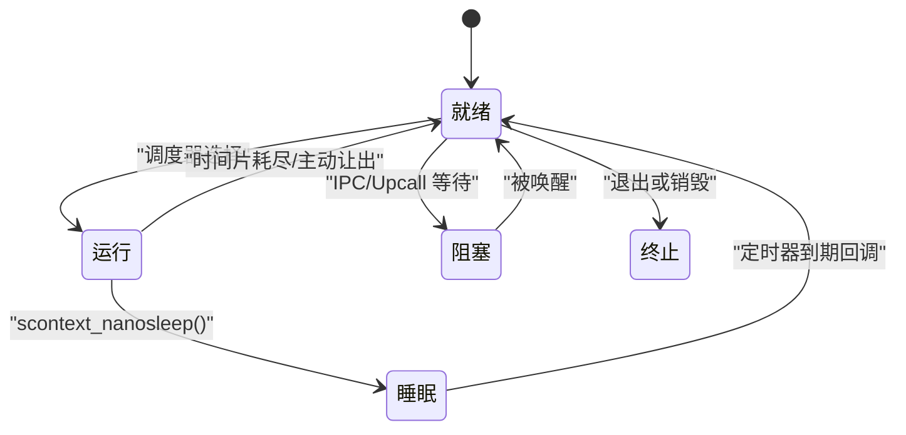
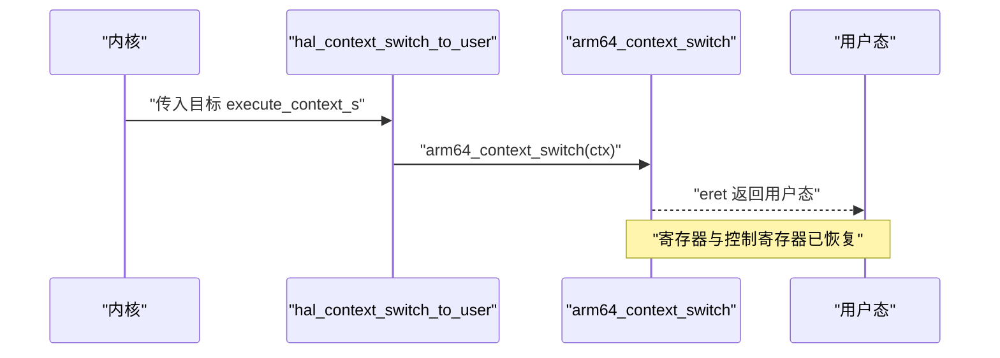
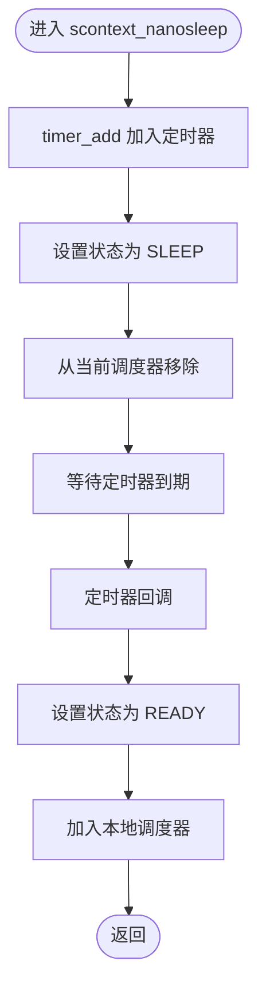
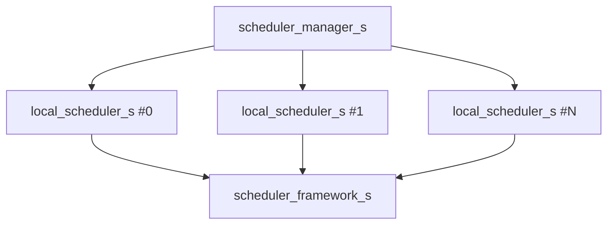
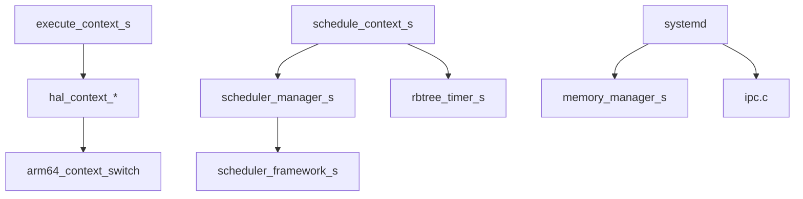

# 上下文管理

<cite>
**本文引用的文件**
- [kernel/context/xcontext.c](file://kernel/context/xcontext.c)
- [kernel/context/scontext.c](file://kernel/context/scontext.c)
- [kernel/arch/arm64/context.c](file://kernel/arch/arm64/context.c)
- [kernel/arch/arm64/switch/switch.S](file://kernel/arch/arm64/switch/switch.S)
- [kernel/include/xcontext/xcontext.h](file://kernel/include/xcontext/xcontext.h)
- [kernel/include/scontext/scontext.h](file://kernel/include/scontext/scontext.h)
- [kernel/include/cpucontext/cpu_context.h](file://kernel/include/cpucontext/cpu_context.h)
- [kernel/include/arch/arm64/cpu.h](file://kernel/include/arch/arm64/cpu.h)
- [kernel/include/arch/arm64/switch.h](file://kernel/include/arch/arm64/switch.h)
- [kernel/include/arch/generic/hal_context.h](file://kernel/include/arch/generic/hal_context.h)
- [kernel/include/scheduler/sched_mgr.h](file://kernel/include/scheduler/sched_mgr.h)
- [kernel/include/scheduler/sched_framework.h](file://kernel/include/scheduler/sched_framework.h)
- [kernel/schedule/sched_mgr.c](file://kernel/schedule/sched_mgr.c)
- [kernel/systemd/upcall.c](file://kernel/systemd/upcall.c)
- [kernel/systemd/ipcmgr/ipcmgr.c](file://kernel/systemd/ipcmgr/ipcmgr.c)
- [kernel/systemd/include/memmgr/memmgr.h](file://kernel/systemd/include/memmgr/memmgr.h)
- [kernel/capability/cap_scontext.c](file://kernel/capability/cap_scontext.c)
- [kernel/capability/cap_xcontext.c](file://kernel/capability/cap_xcontext.c)
- [kernel/ipc/ipc.c](file://kernel/ipc/ipc.c)
</cite>

## 目录
1. [引言](#引言)
2. [项目结构](#项目结构)
3. [核心组件](#核心组件)
4. [架构总览](#架构总览)
5. [详细组件分析](#详细组件分析)
6. [依赖关系分析](#依赖关系分析)
7. [性能考量](#性能考量)
8. [故障排查指南](#故障排查指南)
9. [结论](#结论)
10. [附录](#附录)

## 引言
本文件围绕 TranquilOS 的上下文管理系统进行系统化说明，重点覆盖以下方面：
- 进程上下文（用户态）与调度上下文（内核态）的结构与职责
- 上下文切换、状态保存与恢复流程
- 寄存器管理、栈管理与执行状态跟踪
- 多核调度、线程本地存储（TPIDR）、异常处理
- 性能优化、内存管理与调试能力
- 常见问题定位：栈溢出、寄存器损坏、切换开销过大

## 项目结构
TranquilOS 的上下文管理由“用户态上下文”和“调度上下文”两部分组成，并通过 HAL 层在不同架构间抽象统一接口。ARM64 架构提供了具体的寄存器布局与汇编切换实现。



图示来源
- [kernel/include/xcontext/xcontext.h](file://kernel/include/xcontext/xcontext.h#L7-L15)
- [kernel/include/arch/arm64/cpu.h](file://kernel/include/arch/arm64/cpu.h#L85-L91)
- [kernel/include/scontext/scontext.h](file://kernel/include/scontext/scontext.h#L22-L43)
- [kernel/include/cpucontext/cpu_context.h](file://kernel/include/cpucontext/cpu_context.h#L15-L20)
- [kernel/include/arch/generic/hal_context.h](file://kernel/include/arch/generic/hal_context.h#L8-L23)
- [kernel/include/arch/arm64/switch.h](file://kernel/include/arch/arm64/switch.h#L6-L27)
- [kernel/arch/arm64/switch/switch.S](file://kernel/arch/arm64/switch/switch.S#L20-L37)
- [kernel/arch/arm64/context.c](file://kernel/arch/arm64/context.c#L12-L33)
- [kernel/include/scheduler/sched_mgr.h](file://kernel/include/scheduler/sched_mgr.h#L23-L43)
- [kernel/include/scheduler/sched_framework.h](file://kernel/include/scheduler/sched_framework.h#L11-L18)

章节来源
- [kernel/include/xcontext/xcontext.h](file://kernel/include/xcontext/xcontext.h#L1-L24)
- [kernel/include/scontext/scontext.h](file://kernel/include/scontext/scontext.h#L1-L50)
- [kernel/include/arch/arm64/cpu.h](file://kernel/include/arch/arm64/cpu.h#L1-L94)
- [kernel/include/arch/generic/hal_context.h](file://kernel/include/arch/generic/hal_context.h#L1-L24)
- [kernel/include/arch/arm64/switch.h](file://kernel/include/arch/arm64/switch.h#L1-L29)
- [kernel/arch/arm64/switch/switch.S](file://kernel/arch/arm64/switch/switch.S#L1-L37)
- [kernel/arch/arm64/context.c](file://kernel/arch/arm64/context.c#L1-L98)
- [kernel/include/scheduler/sched_mgr.h](file://kernel/include/scheduler/sched_mgr.h#L1-L49)
- [kernel/include/scheduler/sched_framework.h](file://kernel/include/scheduler/sched_framework.h#L1-L20)

## 核心组件
- 用户态执行上下文 execute_context_s：承载用户态寄存器快照与调用链信息，位于通用 HAL 抽象层之上。
- ARM64 CPU 上下文 arm64_cpu_context_s：包含通用寄存器、控制寄存器（SPSR、PC、SP）与线程本地存储寄存器（TPIDR/TPIDRRO），并以固定大小缓冲区嵌入 execute_context_s。
- 调度上下文 schedule_context_s：封装地址空间、能力节点、睡眠定时器、状态机与进程标识等，用于调度与资源管理。
- HAL 接口 hal_context_*：提供初始化、寄存器读写、切换到用户态等跨架构统一能力。
- 汇编切换 arm64_context_switch：从内核栈恢复用户态寄存器并返回用户态执行。
- 调度器接口：local_scheduler 与 scheduler_manager 提供上下文加入/移除、选择与多核亲和性分发。

章节来源
- [kernel/context/xcontext.c](file://kernel/context/xcontext.c#L1-L15)
- [kernel/context/scontext.c](file://kernel/context/scontext.c#L1-L68)
- [kernel/arch/arm64/context.c](file://kernel/arch/arm64/context.c#L7-L33)
- [kernel/arch/arm64/switch/switch.S](file://kernel/arch/arm64/switch/switch.S#L20-L37)
- [kernel/include/xcontext/xcontext.h](file://kernel/include/xcontext/xcontext.h#L7-L15)
- [kernel/include/arch/arm64/cpu.h](file://kernel/include/arch/arm64/cpu.h#L85-L91)
- [kernel/include/scontext/scontext.h](file://kernel/include/scontext/scontext.h#L22-L43)
- [kernel/include/arch/generic/hal_context.h](file://kernel/include/arch/generic/hal_context.h#L8-L23)
- [kernel/include/arch/arm64/switch.h](file://kernel/include/arch/arm64/switch.h#L27-L27)

## 架构总览
上下文管理的关键路径如下：
- 创建阶段：分配用户态上下文与调度上下文，初始化寄存器与栈，设置状态为就绪。
- 切换阶段：保存当前上下文寄存器到内核栈，加载下一个上下文寄存器并返回用户态。
- 睡眠与唤醒：通过定时器驱动调度器将上下文置为就绪并重新调度。
- 多核调度：根据亲和位选择目标 CPU 的本地调度器，加入队列等待调度。



图示来源
- [kernel/include/arch/generic/hal_context.h](file://kernel/include/arch/generic/hal_context.h#L22-L22)
- [kernel/arch/arm64/switch/switch.S](file://kernel/arch/arm64/switch/switch.S#L20-L37)
- [kernel/include/scheduler/sched_mgr.h](file://kernel/include/scheduler/sched_mgr.h#L23-L28)

## 详细组件分析

### 用户态上下文 execute_context_s 与寄存器布局
- 结构要点
  - 通用寄存器数组：容纳 x0~x30（含 FP/LR）等通用寄存器。
  - 控制寄存器：SPSR、PC、SP、TPIDR、TPIDRRO。
  - FPU 寄存器：d0~d31 与 FPSR。
  - 附加字段：调用链指针、所属调度上下文指针。
- 初始化流程
  - 清零通用寄存器区域。
  - 设置 FP（x29）、LR（x30）为入口与栈顶。
  - 配置 SPSR 为 EL0t，PC/SP 指向入口与栈顶。
  - 线程本地存储寄存器清零。
- 调试与访问
  - 提供寄存器读写接口与上下文打印接口，便于调试。

```mermaid
classDiagram
class execute_context_s {
    +uint8_t arch_regs_storage[1024]
    +ipc : "struct { caller_ctx; }"
    +scontext : "struct schedule_context*"
}
class arm64_common_regs_s {
    +x0..x30
}
class arm64_context_regs_s {
    +spsr
    +pc
    +sp
    +tpid
    +tpid_ro
}
class arm64_fpu_regs_s {
    +d0..d31
    +fpsr
}
class arm64_cpu_context_s {
    +common_regs : arm64_common_regs_s
    +ctx_regs : arm64_context_regs_s
    +fpu_regs : arm64_fpu_regs_s
}
execute_context_s --> arm64_cpu_context_s : "嵌入"
arm64_cpu_context_s --> arm64_common_regs_s
arm64_cpu_context_s --> arm64_context_regs_s
arm64_cpu_context_s --> arm64_fpu_regs_s
```

图示来源
- [kernel/include/xcontext/xcontext.h](file://kernel/include/xcontext/xcontext.h#L7-L15)
- [kernel/include/arch/arm64/cpu.h](file://kernel/include/arch/arm64/cpu.h#L7-L89)

章节来源
- [kernel/arch/arm64/context.c](file://kernel/arch/arm64/context.c#L7-L33)
- [kernel/arch/arm64/context.c](file://kernel/arch/arm64/context.c#L35-L48)
- [kernel/include/arch/arm64/cpu.h](file://kernel/include/arch/arm64/cpu.h#L85-L91)
- [kernel/include/arch/generic/hal_context.h](file://kernel/include/arch/generic/hal_context.h#L8-L23)

### 调度上下文 schedule_context_s 与状态机
- 字段说明
  - base_ctx：绑定的用户态上下文。
  - 地址空间与能力节点：用于资源隔离与权限控制。
  - 睡眠定时器：基于红黑树的定时容器，支持纳秒级睡眠。
  - 状态机：就绪、运行、睡眠、阻塞（IPC/Upcall）、终止。
- 生命周期
  - 初始化：绑定用户态上下文，注册睡眠定时器，初始状态为就绪。
  - 睡眠：添加定时器，状态置为睡眠，从当前调度器移除。
  - 唤醒：定时器回调将状态置为就绪并重新加入调度器。
- 多核亲和：通过调度器管理器按亲和位选择目标 CPU 的本地调度器。



图示来源
- [kernel/include/scontext/scontext.h](file://kernel/include/scontext/scontext.h#L12-L20)
- [kernel/context/scontext.c](file://kernel/context/scontext.c#L32-L45)
- [kernel/context/scontext.c](file://kernel/context/scontext.c#L47-L68)
- [kernel/include/scheduler/sched_mgr.h](file://kernel/include/scheduler/sched_mgr.h#L40-L43)

章节来源
- [kernel/context/scontext.c](file://kernel/context/scontext.c#L9-L30)
- [kernel/context/scontext.c](file://kernel/context/scontext.c#L32-L45)
- [kernel/context/scontext.c](file://kernel/context/scontext.c#L47-L68)
- [kernel/include/scontext/scontext.h](file://kernel/include/scontext/scontext.h#L12-L43)
- [kernel/include/scheduler/sched_mgr.h](file://kernel/include/scheduler/sched_mgr.h#L13-L28)

### 上下文切换流程（用户态）
- 入口与参数
  - HAL 提供切换入口，传入目标 execute_context_s 指针。
- 汇编切换
  - 将目标上下文的内核栈指针作为当前栈使用。
  - 恢复 x9~x30 通用寄存器对与单寄存器。
  - 写入异常返回寄存器（ELR_EL1、SP_EL0、TPIDR_EL0、TPIDRRO_EL0、SPSR_EL1）。
  - 使用 eret 返回用户态。
- 注意事项
  - 切换前需确保目标上下文的寄存器已正确填充。
  - 当前上下文的寄存器保存由调用方负责（例如进入内核时保存）。



图示来源
- [kernel/include/arch/generic/hal_context.h](file://kernel/include/arch/generic/hal_context.h#L22-L22)
- [kernel/arch/arm64/switch/switch.S](file://kernel/arch/arm64/switch/switch.S#L20-L37)
- [kernel/arch/arm64/context.c](file://kernel/arch/arm64/context.c#L96-L98)

章节来源
- [kernel/arch/arm64/switch/switch.S](file://kernel/arch/arm64/switch/switch.S#L1-L37)
- [kernel/arch/arm64/context.c](file://kernel/arch/arm64/context.c#L96-L98)
- [kernel/include/arch/arm64/switch.h](file://kernel/include/arch/arm64/switch.h#L27-L27)

### 睡眠与定时器唤醒
- 触发条件
  - 调用 scontext_nanosleep 后，上下文状态置为睡眠，并将定时器挂接到单调时钟容器。
- 回调逻辑
  - 定时器到期后回调 scontext_timer_handler，将等待上下文置为就绪并加入调度器。
- 调度器交互
  - 通过调度管理器获取本地调度器，执行 add/remove 操作。



图示来源
- [kernel/context/scontext.c](file://kernel/context/scontext.c#L47-L68)
- [kernel/context/scontext.c](file://kernel/context/scontext.c#L9-L30)
- [kernel/include/scheduler/sched_mgr.h](file://kernel/include/scheduler/sched_mgr.h#L13-L28)

章节来源
- [kernel/context/scontext.c](file://kernel/context/scontext.c#L9-L30)
- [kernel/context/scontext.c](file://kernel/context/scontext.c#L47-L68)
- [kernel/schedule/sched_mgr.c](file://kernel/schedule/sched_mgr.c#L131-L147)

### 多核调度与亲和性
- 亲和性解析
  - 调度管理器根据亲和位找到目标 CPU 的本地调度器。
- 本地调度器
  - 提供 add/remove/next/schedule 等操作，内部持有调度框架实例。
- 一致性
  - 通过自旋锁保护本地调度器数据结构，避免并发竞争。



图示来源
- [kernel/include/scheduler/sched_mgr.h](file://kernel/include/scheduler/sched_mgr.h#L40-L43)
- [kernel/include/scheduler/sched_framework.h](file://kernel/include/scheduler/sched_framework.h#L11-L18)
- [kernel/schedule/sched_mgr.c](file://kernel/schedule/sched_mgr.c#L131-L147)

章节来源
- [kernel/include/scheduler/sched_mgr.h](file://kernel/include/scheduler/sched_mgr.h#L1-L49)
- [kernel/include/scheduler/sched_framework.h](file://kernel/include/scheduler/sched_framework.h#L1-L20)
- [kernel/schedule/sched_mgr.c](file://kernel/schedule/sched_mgr.c#L1-L162)

### 线程本地存储（TPIDR/TPIDRRO）
- 初始化
  - HAL 初始化用户态上下文时将 TPIDR/TPIDRRO 置零。
- 使用场景
  - 用户态可通过平台寄存器访问线程本地数据，便于实现 TLS。
- 注意
  - 若业务需要自定义 TLS，应在用户态初始化阶段设置相应寄存器值。

章节来源
- [kernel/arch/arm64/context.c](file://kernel/arch/arm64/context.c#L28-L31)
- [kernel/include/arch/arm64/cpu.h](file://kernel/include/arch/arm64/cpu.h#L45-L46)

### 异常处理与返回
- 异常级别
  - 用户态上下文 SPSR 配置为 EL0t，确保异常返回至用户态。
- 异常返回
  - 汇编切换通过设置 ELR_EL1、SP_EL0、SPSR_EL1 并使用 eret 返回用户态。
- 调试
  - 可通过上下文打印接口输出关键寄存器值，辅助定位异常原因。

章节来源
- [kernel/arch/arm64/context.c](file://kernel/arch/arm64/context.c#L19-L33)
- [kernel/arch/arm64/switch/switch.S](file://kernel/arch/arm64/switch/switch.S#L24-L36)
- [kernel/arch/arm64/context.c](file://kernel/arch/arm64/context.c#L35-L48)

### 栈管理与内存分配
- 栈分配
  - 系统服务端在创建 IPC/Upcall 端点时为上下文分配独立栈页。
- 映射
  - 将栈页映射到进程虚拟地址空间，确保用户态可访问。
- 对齐
  - 分配时按 16 字节对齐，满足 AAPCS64 调用约定。

章节来源
- [kernel/systemd/ipcmgr/ipcmgr.c](file://kernel/systemd/ipcmgr/ipcmgr.c#L62-L72)
- [kernel/systemd/upcall.c](file://kernel/systemd/upcall.c#L67-L77)
- [kernel/systemd/include/memmgr/memmgr.h](file://kernel/systemd/include/memmgr/memmgr.h#L10-L24)

### IPC 唤醒与上下文切换
- 唤醒流程
  - 发送方完成 IPC 后，将调用方上下文置为就绪并加入调度器，随后切换到调用方执行。
- 关键点
  - 通过调度器管理器获取本地调度器，保证跨 CPU 的一致性。
  - 设置返回值到调用方上下文的寄存器中。

章节来源
- [kernel/ipc/ipc.c](file://kernel/ipc/ipc.c#L81-L114)
- [kernel/capability/cap_scontext.c](file://kernel/capability/cap_scontext.c#L300-L314)

### 能力接口与上下文操作
- SContext 能力方法
  - 支持创建、设置能力节点、设置地址空间、设置名称、设置 PID、设置 Upcall、调度与迁移等。
- XContext 能力方法
  - 支持创建与初始化用户态上下文，设置入口与栈顶。

章节来源
- [kernel/capability/cap_scontext.c](file://kernel/capability/cap_scontext.c#L420-L462)
- [kernel/capability/cap_xcontext.c](file://kernel/capability/cap_xcontext.c#L9-L39)

## 依赖关系分析
- 组件耦合
  - execute_context_s 与 arm64_cpu_context_s 强耦合，前者提供存储，后者提供布局。
  - schedule_context_s 依赖调度器框架与定时器容器，形成调度闭环。
  - HAL 层向上屏蔽架构差异，向下依赖汇编切换实现。
- 外部依赖
  - 调度器管理器依赖多核本地调度器与自旋锁。
  - IPC 与 Upcall 依赖内存管理器分配栈与对象。



图示来源
- [kernel/include/xcontext/xcontext.h](file://kernel/include/xcontext/xcontext.h#L7-L15)
- [kernel/include/arch/generic/hal_context.h](file://kernel/include/arch/generic/hal_context.h#L8-L23)
- [kernel/arch/arm64/switch/switch.S](file://kernel/arch/arm64/switch/switch.S#L20-L37)
- [kernel/include/scontext/scontext.h](file://kernel/include/scontext/scontext.h#L37-L37)
- [kernel/include/scheduler/sched_mgr.h](file://kernel/include/scheduler/sched_mgr.h#L40-L43)
- [kernel/include/scheduler/sched_framework.h](file://kernel/include/scheduler/sched_framework.h#L11-L18)
- [kernel/systemd/include/memmgr/memmgr.h](file://kernel/systemd/include/memmgr/memmgr.h#L10-L24)
- [kernel/ipc/ipc.c](file://kernel/ipc/ipc.c#L81-L114)

章节来源
- [kernel/context/xcontext.c](file://kernel/context/xcontext.c#L1-L15)
- [kernel/context/scontext.c](file://kernel/context/scontext.c#L1-L68)
- [kernel/arch/arm64/context.c](file://kernel/arch/arm64/context.c#L1-L98)
- [kernel/arch/arm64/switch/switch.S](file://kernel/arch/arm64/switch/switch.S#L1-L37)
- [kernel/include/scheduler/sched_mgr.h](file://kernel/include/scheduler/sched_mgr.h#L1-L49)
- [kernel/include/scheduler/sched_framework.h](file://kernel/include/scheduler/sched_framework.h#L1-L20)
- [kernel/systemd/include/memmgr/memmgr.h](file://kernel/systemd/include/memmgr/memmgr.h#L1-L30)
- [kernel/ipc/ipc.c](file://kernel/ipc/ipc.c#L81-L114)

## 性能考量
- 切换开销
  - 汇编切换仅恢复少量关键寄存器与控制寄存器，避免了复杂保存/恢复逻辑。
  - 建议减少不必要的寄存器访问，优先使用寄存器而非栈访问。
- 缓存与对齐
  - 本地调度器结构按缓存行对齐，降低伪共享风险。
- 定时器效率
  - 使用红黑树定时器容器，提供 O(log N) 的插入与删除复杂度。
- 多核亲和
  - 通过亲和位快速定位目标 CPU，减少跨核迁移成本。

## 故障排查指南
- 栈溢出
  - 症状：用户态异常、栈指针越界。
  - 排查：检查栈分配大小与对齐；确认用户态函数调用深度与局部变量占用。
  - 参考：栈分配与映射路径。
- 寄存器损坏
  - 症状：切换后寄存器值异常。
  - 排查：确认 HAL 初始化是否正确设置 FP/LR、PC/SP、SPSR；检查汇编切换是否完整恢复寄存器。
- 切换开销过大
  - 症状：频繁上下文切换导致吞吐下降。
  - 排查：评估调度策略与时间片配置；减少不必要的睡眠/唤醒。
- 定时器未触发
  - 症状：scontext_nanosleep 不生效。
  - 排查：确认定时器容器初始化与回调注册；检查调度器是否正确加入上下文。
- IPC 唤醒失败
  - 症状：调用方无法被唤醒。
  - 排查：确认发送方是否正确设置调用方状态并加入调度器；检查切换调用是否正确。

章节来源
- [kernel/systemd/ipcmgr/ipcmgr.c](file://kernel/systemd/ipcmgr/ipcmgr.c#L62-L72)
- [kernel/systemd/upcall.c](file://kernel/systemd/upcall.c#L67-L77)
- [kernel/arch/arm64/context.c](file://kernel/arch/arm64/context.c#L12-L33)
- [kernel/arch/arm64/switch/switch.S](file://kernel/arch/arm64/switch/switch.S#L20-L37)
- [kernel/context/scontext.c](file://kernel/context/scontext.c#L47-L68)
- [kernel/ipc/ipc.c](file://kernel/ipc/ipc.c#L81-L114)

## 结论
TranquilOS 的上下文管理系统通过 HAL 抽象与 ARM64 汇编切换实现了高效、可移植的用户态与内核态上下文管理。结合调度器框架、定时器容器与多核亲和性设计，系统在保证功能完整性的同时兼顾性能与可维护性。建议在实际部署中重点关注栈与寄存器的正确初始化、定时器与调度器的一致性以及多核场景下的负载均衡。

## 附录
- 代码示例路径（不展示具体代码内容）
  - 用户态上下文初始化：[kernel/context/xcontext.c](file://kernel/context/xcontext.c#L4-L7)
  - HAL 用户态上下文初始化：[kernel/arch/arm64/context.c](file://kernel/arch/arm64/context.c#L12-L33)
  - 上下文寄存器读取/设置：[kernel/arch/arm64/context.c](file://kernel/arch/arm64/context.c#L50-L84)
  - 上下文切换入口：[kernel/arch/arm64/context.c](file://kernel/arch/arm64/context.c#L96-L98)
  - 汇编切换实现：[kernel/arch/arm64/switch/switch.S](file://kernel/arch/arm64/switch/switch.S#L20-L37)
  - 调度上下文初始化：[kernel/context/scontext.c](file://kernel/context/scontext.c#L32-L45)
  - 睡眠与唤醒流程：[kernel/context/scontext.c](file://kernel/context/scontext.c#L47-L68)
  - 定时器回调：[kernel/context/scontext.c](file://kernel/context/scontext.c#L9-L30)
  - 多核调度亲和：[kernel/schedule/sched_mgr.c](file://kernel/schedule/sched_mgr.c#L131-L147)
  - IPC 唤醒与切换：[kernel/ipc/ipc.c](file://kernel/ipc/ipc.c#L81-L114)
  - Upcall/IPC 端点栈分配：[kernel/systemd/upcall.c](file://kernel/systemd/upcall.c#L67-L77), [kernel/systemd/ipcmgr/ipcmgr.c](file://kernel/systemd/ipcmgr/ipcmgr.c#L62-L72)
  - SContext 能力方法：[kernel/capability/cap_scontext.c](file://kernel/capability/cap_scontext.c#L420-L462)
  - XContext 能力方法：[kernel/capability/cap_xcontext.c](file://kernel/capability/cap_xcontext.c#L16-L39)