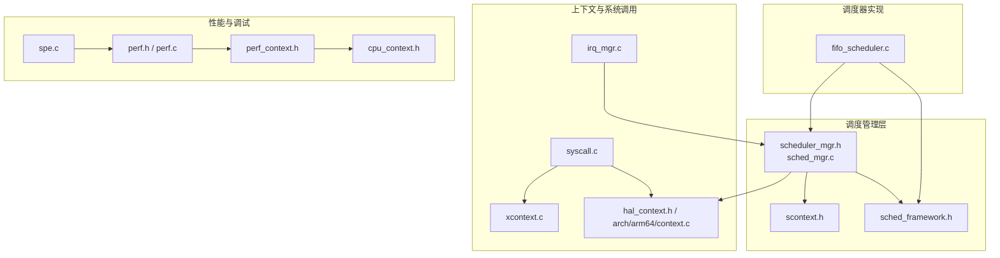
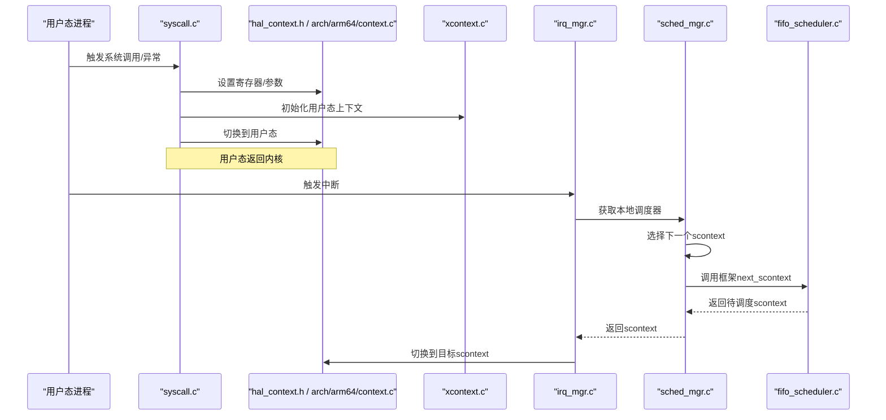
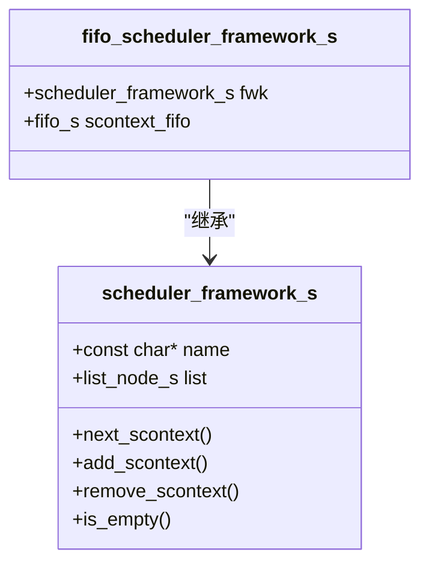
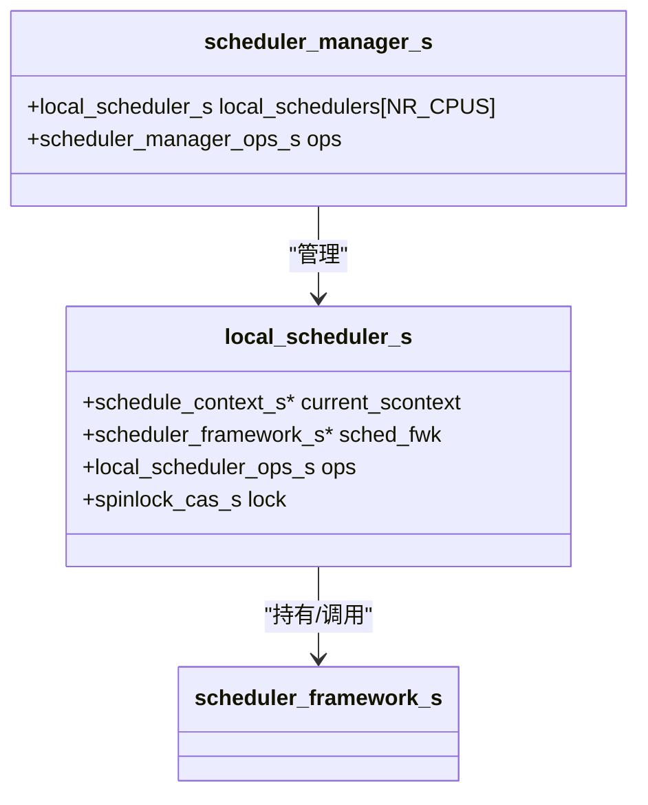
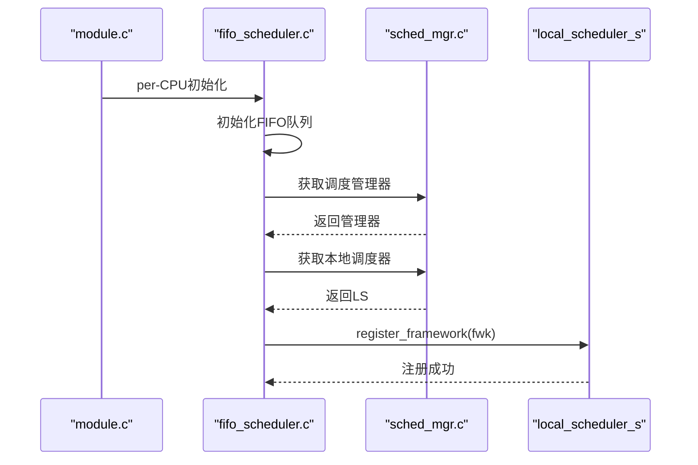
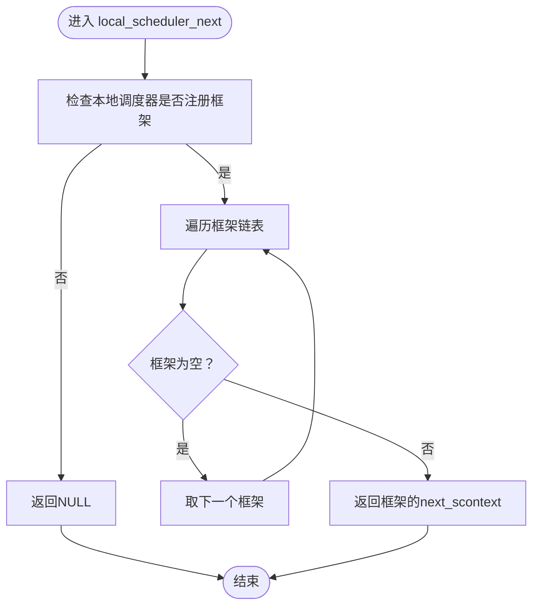
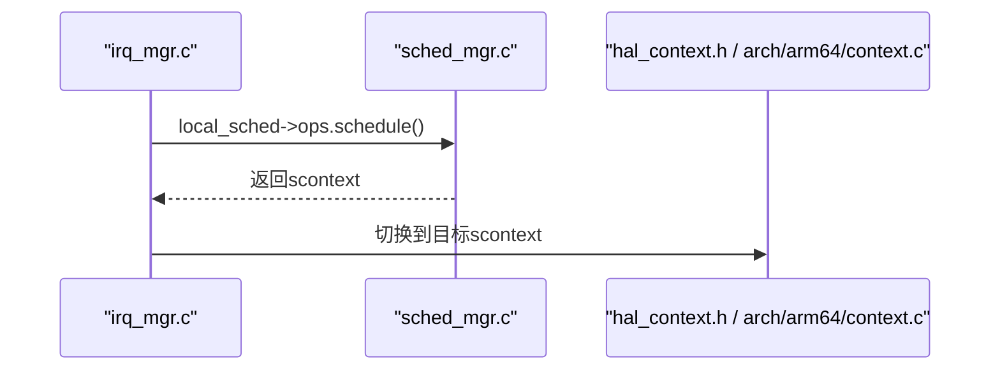
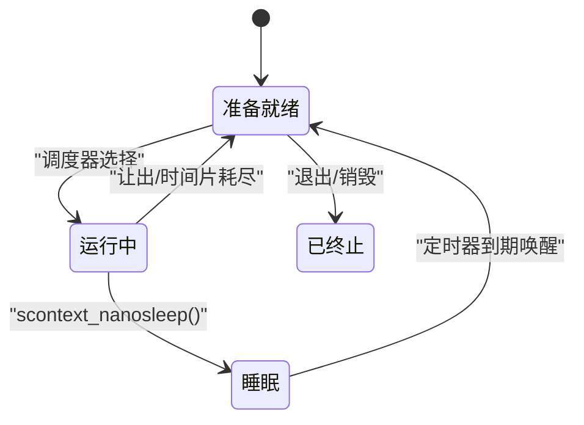
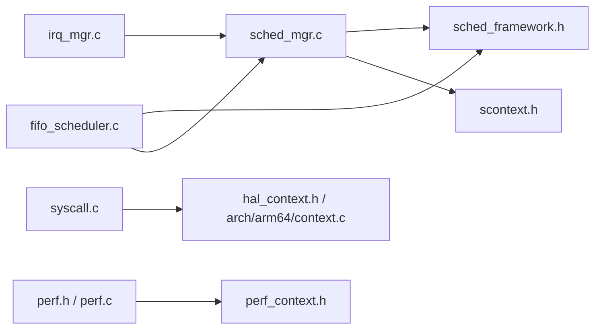

# 调度框架

<cite>
**本文引用的文件**
- [kernel/include/scheduler/sched_framework.h](file://kernel/include/scheduler/sched_framework.h)
- [kernel/include/scheduler/sched_mgr.h](file://kernel/include/scheduler/sched_mgr.h)
- [kernel/schedule/sched_mgr.c](file://kernel/schedule/sched_mgr.c)
- [kernel/module/sched/fifo_scheduler.c](file://kernel/module/sched/fifo_scheduler.c)
- [kernel/include/scontext/scontext.h](file://kernel/include/scontext/scontext.h)
- [kernel/context/scontext.c](file://kernel/context/scontext.c)
- [kernel/context/xcontext.c](file://kernel/context/xcontext.c)
- [kernel/include/arch/generic/hal_context.h](file://kernel/include/arch/generic/hal_context.h)
- [kernel/arch/arm64/context.c](file://kernel/arch/arm64/context.c)
- [kernel/interrupt/irq_mgr.c](file://kernel/interrupt/irq_mgr.c)
- [kernel/syscall/syscall.c](file://kernel/syscall/syscall.c)
- [kernel/module/module.c](file://kernel/module/module.c)
- [kernel/include/trace/perf.h](file://kernel/include/trace/perf.h)
- [kernel/trace/perf.c](file://kernel/trace/perf.c)
- [kernel/include/trace/perf_context.h](file://kernel/include/trace/perf_context.h)
- [kernel/include/cpucontext/cpu_context.h](file://kernel/include/cpucontext/cpu_context.h)
- [kernel/drivers/arm-pmu/spe.c](file://kernel/drivers/arm-pmu/spe.c)
</cite>

## 目录
1. [引言](#引言)
2. [项目结构](#项目结构)
3. [核心组件](#核心组件)
4. [架构总览](#架构总览)
5. [组件详解](#组件详解)
6. [依赖关系分析](#依赖关系分析)
7. [性能考量](#性能考量)
8. [故障排查指南](#故障排查指南)
9. [结论](#结论)
10. [附录](#附录)

## 引言
本文件面向TranquilOS的调度框架，系统性阐述其整体架构、设计原则与实现细节。重点覆盖以下方面：
- 调度器接口定义与调度策略管理
- 调度器注册机制与多策略链式组织
- 初始化流程、调度器选择算法与调度决策过程
- 具体的注册、配置与使用路径示例（以代码片段路径形式给出）
- 扩展机制、性能监控与调试能力
- 状态管理、统计与性能分析工具
- 常见问题定位：调度器冲突、性能瓶颈与配置错误

## 项目结构
调度子系统由“调度管理器”“本地调度器”“调度框架接口”“具体调度器实现（示例：FIFO）”以及“上下文与系统调用/中断集成”构成。下图展示了关键文件之间的关系。

图表来源
- [kernel/include/scheduler/sched_framework.h](file://kernel/include/scheduler/sched_framework.h#L1-L20)
- [kernel/include/scheduler/sched_mgr.h](file://kernel/include/scheduler/sched_mgr.h#L1-L49)
- [kernel/schedule/sched_mgr.c](file://kernel/schedule/sched_mgr.c#L1-L167)
- [kernel/module/sched/fifo_scheduler.c](file://kernel/module/sched/fifo_scheduler.c#L1-L111)
- [kernel/include/scontext/scontext.h](file://kernel/include/scontext/scontext.h#L1-L50)
- [kernel/context/xcontext.c](file://kernel/context/xcontext.c#L1-L15)
- [kernel/include/arch/generic/hal_context.h](file://kernel/include/arch/generic/hal_context.h#L1-L24)
- [kernel/arch/arm64/context.c](file://kernel/arch/arm64/context.c#L50-L98)
- [kernel/interrupt/irq_mgr.c](file://kernel/interrupt/irq_mgr.c#L1-L142)
- [kernel/syscall/syscall.c](file://kernel/syscall/syscall.c#L1-L20)
- [kernel/include/trace/perf.h](file://kernel/include/trace/perf.h#L1-L27)
- [kernel/trace/perf.c](file://kernel/trace/perf.c#L1-L6)
- [kernel/include/trace/perf_context.h](file://kernel/include/trace/perf_context.h#L1-L21)
- [kernel/include/cpucontext/cpu_context.h](file://kernel/include/cpucontext/cpu_context.h#L1-L22)
- [kernel/drivers/arm-pmu/spe.c](file://kernel/drivers/arm-pmu/spe.c#L1-L65)

章节来源
- [kernel/include/scheduler/sched_framework.h](file://kernel/include/scheduler/sched_framework.h#L1-L20)
- [kernel/include/scheduler/sched_mgr.h](file://kernel/include/scheduler/sched_mgr.h#L1-L49)
- [kernel/schedule/sched_mgr.c](file://kernel/schedule/sched_mgr.c#L1-L167)
- [kernel/module/sched/fifo_scheduler.c](file://kernel/module/sched/fifo_scheduler.c#L1-L111)

## 核心组件
- 调度框架接口（scheduler_framework_s）
  - 定义了调度器对外统一的接口：next_scontext、add_scontext、remove_scontext、is_empty
  - 支持通过链表节点将多个调度器串联，形成策略链
- 本地调度器（local_scheduler_s）
  - 每核一个实例，维护当前运行的scontext、已注册的调度框架指针、操作函数集
  - 提供添加/移除/选择下一个scontext/注册框架等操作
- 调度管理器（scheduler_manager_s）
  - 维护NR_CPUS个本地调度器实例
  - 提供全局初始化、按亲和性将scontext加入对应本地调度器、获取本地调度器等能力
- 具体调度器实现（示例：FIFO）
  - 将调度框架接口与队列容器结合，实现FIFO调度
  - 在per-CPU初始化阶段注册到本地调度器
- 调度上下文（schedule_context_s）
  - 描述可被调度的执行实体，包含状态机、睡眠定时器、地址空间、能力节点等
- 中断/系统调用与调度集成
  - 中断处理在完成EIO后触发调度器选择并切换上下文
  - 系统调用返回用户态前进行地址空间与上下文切换

章节来源
- [kernel/include/scheduler/sched_framework.h](file://kernel/include/scheduler/sched_framework.h#L6-L18)
- [kernel/include/scheduler/sched_mgr.h](file://kernel/include/scheduler/sched_mgr.h#L14-L43)
- [kernel/schedule/sched_mgr.c](file://kernel/schedule/sched_mgr.c#L6-L129)
- [kernel/module/sched/fifo_scheduler.c](file://kernel/module/sched/fifo_scheduler.c#L13-L109)
- [kernel/include/scontext/scontext.h](file://kernel/include/scontext/scontext.h#L12-L43)
- [kernel/interrupt/irq_mgr.c](file://kernel/interrupt/irq_mgr.c#L49-L83)
- [kernel/syscall/syscall.c](file://kernel/syscall/syscall.c#L8-L20)

## 架构总览
调度框架采用“管理器-本地调度器-调度框架”的分层设计，支持多策略并存与优先级选择。下图展示了从系统调用/中断到调度器选择与上下文切换的关键路径。

图表来源
- [kernel/syscall/syscall.c](file://kernel/syscall/syscall.c#L8-L20)
- [kernel/include/arch/generic/hal_context.h](file://kernel/include/arch/generic/hal_context.h#L14-L22)
- [kernel/arch/arm64/context.c](file://kernel/arch/arm64/context.c#L96-L98)
- [kernel/context/xcontext.c](file://kernel/context/xcontext.c#L4-L7)
- [kernel/interrupt/irq_mgr.c](file://kernel/interrupt/irq_mgr.c#L69-L83)
- [kernel/schedule/sched_mgr.c](file://kernel/schedule/sched_mgr.c#L51-L87)
- [kernel/module/sched/fifo_scheduler.c](file://kernel/module/sched/fifo_scheduler.c#L18-L36)

## 组件详解

### 调度框架接口与策略管理
- 接口职责
  - next_scontext：从当前框架中取出下一个scontext
  - add_scontext/remove_scontext：向框架添加或从框架移除scontext
  - is_empty：判断框架是否为空
- 多策略组织
  - 通过链表节点将多个框架串联，遍历非空框架以选择scontext
  - 当前实现对不同框架未设置显式优先级，保留扩展空间

图表来源
- [kernel/include/scheduler/sched_framework.h](file://kernel/include/scheduler/sched_framework.h#L6-L18)
- [kernel/module/sched/fifo_scheduler.c](file://kernel/module/sched/fifo_scheduler.c#L13-L16)

章节来源
- [kernel/include/scheduler/sched_framework.h](file://kernel/include/scheduler/sched_framework.h#L6-L18)
- [kernel/schedule/sched_mgr.c](file://kernel/schedule/sched_mgr.c#L61-L72)

### 本地调度器与调度管理器
- 本地调度器（每核）
  - 维护current_scontext、已注册的调度框架指针、CAS自旋锁
  - 提供add/remove/next/schedule/register_framework等操作
- 调度管理器（全局）
  - 维护NR_CPUS个本地调度器
  - 提供init_local_scheduler、get_local_scheduler、add_scontext（按亲和性路由）

图表来源
- [kernel/include/scheduler/sched_mgr.h](file://kernel/include/scheduler/sched_mgr.h#L23-L43)
- [kernel/schedule/sched_mgr.c](file://kernel/schedule/sched_mgr.c#L113-L129)

章节来源
- [kernel/include/scheduler/sched_mgr.h](file://kernel/include/scheduler/sched_mgr.h#L14-L43)
- [kernel/schedule/sched_mgr.c](file://kernel/schedule/sched_mgr.c#L113-L162)

### 调度器注册机制与初始化流程
- per-CPU初始化
  - 模块初始化时，每个CPU调用per-CPU初始化函数
  - 初始化FIFO调度框架，填充名称、函数指针，并注册到本地调度器
- 注册流程
  - 若本地调度器尚未有框架，则直接赋值
  - 否则将新框架插入到已有框架链表头部

图表来源
- [kernel/module/module.c](file://kernel/module/module.c#L14-L17)
- [kernel/module/sched/fifo_scheduler.c](file://kernel/module/sched/fifo_scheduler.c#L87-L109)
- [kernel/schedule/sched_mgr.c](file://kernel/schedule/sched_mgr.c#L89-L103)

章节来源
- [kernel/module/module.c](file://kernel/module/module.c#L8-L17)
- [kernel/module/sched/fifo_scheduler.c](file://kernel/module/sched/fifo_scheduler.c#L87-L109)
- [kernel/schedule/sched_mgr.c](file://kernel/schedule/sched_mgr.c#L89-L103)

### 调度器选择算法与调度决策过程
- 选择算法
  - 遍历本地调度器持有的框架链表，返回首个非空框架的next_scontext
  - 当前未实现框架优先级，建议后续引入权重/类型字段
- 决策过程
  - 若无可用scontext，保持当前运行态
  - 否则通过本地调度器的add_scontext将选中的scontext加入调度队列

图表来源
- [kernel/schedule/sched_mgr.c](file://kernel/schedule/sched_mgr.c#L51-L72)

章节来源
- [kernel/schedule/sched_mgr.c](file://kernel/schedule/sched_mgr.c#L51-L87)

### 上下文与系统调用/中断集成
- 系统调用返回用户态前，切换地址空间并切换到用户上下文
- 中断处理完成后，调用调度器选择下一个scontext并切换

图表来源
- [kernel/interrupt/irq_mgr.c](file://kernel/interrupt/irq_mgr.c#L78-L83)
- [kernel/schedule/sched_mgr.c](file://kernel/schedule/sched_mgr.c#L74-L87)
- [kernel/include/arch/generic/hal_context.h](file://kernel/include/arch/generic/hal_context.h#L22)
- [kernel/arch/arm64/context.c](file://kernel/arch/arm64/context.c#L96-L98)

章节来源
- [kernel/interrupt/irq_mgr.c](file://kernel/interrupt/irq_mgr.c#L49-L83)
- [kernel/syscall/syscall.c](file://kernel/syscall/syscall.c#L17-L20)

### 调度上下文与状态管理
- 状态机
  - READY、RUNNING、SLEEP、BLOCKED_*、TERMINATED等
- 睡眠与唤醒
  - 通过rbtree定时器在到期后将scontext置为READY并重新入队
- 与调度器交互
  - 进入睡眠时从当前调度器移除
  - 定时器回调将scontext加入调度器

图表来源
- [kernel/include/scontext/scontext.h](file://kernel/include/scontext/scontext.h#L12-L20)
- [kernel/context/scontext.c](file://kernel/context/scontext.c#L9-L30)

章节来源
- [kernel/include/scontext/scontext.h](file://kernel/include/scontext/scontext.h#L12-L43)
- [kernel/context/scontext.c](file://kernel/context/scontext.c#L9-L68)

### 性能监控与调试
- 性能监控单元
  - 定义了perf_monitor_unit与perf_context，支持在线/离线与初始化回调
  - 当前注册接口为占位，可用于接入PMU/SPE等硬件计数器
- ARM SPE支持
  - 检测SPE特性并初始化，为后续性能采样提供基础

章节来源
- [kernel/include/trace/perf.h](file://kernel/include/trace/perf.h#L9-L24)
- [kernel/trace/perf.c](file://kernel/trace/perf.c#L3-L5)
- [kernel/include/trace/perf_context.h](file://kernel/include/trace/perf_context.h#L10-L19)
- [kernel/drivers/arm-pmu/spe.c](file://kernel/drivers/arm-pmu/spe.c#L35-L56)

## 依赖关系分析
- 组件耦合
  - 本地调度器依赖调度框架接口；调度管理器负责跨CPU路由与初始化
  - 具体调度器（如FIFO）仅依赖框架接口，便于替换与扩展
- 外部依赖
  - HAL上下文切换接口用于用户态切换
  - 中断管理器在中断处理尾部触发调度
- 可能的循环依赖
  - 未发现直接循环依赖；调度器与上下文通过接口解耦

图表来源
- [kernel/schedule/sched_mgr.c](file://kernel/schedule/sched_mgr.c#L1-L5)
- [kernel/module/sched/fifo_scheduler.c](file://kernel/module/sched/fifo_scheduler.c#L1-L12)
- [kernel/interrupt/irq_mgr.c](file://kernel/interrupt/irq_mgr.c#L1-L12)
- [kernel/syscall/syscall.c](file://kernel/syscall/syscall.c#L1-L7)
- [kernel/include/trace/perf.h](file://kernel/include/trace/perf.h#L1-L8)
- [kernel/trace/perf.c](file://kernel/trace/perf.c#L1-L6)
- [kernel/include/trace/perf_context.h](file://kernel/include/trace/perf_context.h#L1-L8)

章节来源
- [kernel/schedule/sched_mgr.c](file://kernel/schedule/sched_mgr.c#L1-L5)
- [kernel/module/sched/fifo_scheduler.c](file://kernel/module/sched/fifo_scheduler.c#L1-L12)
- [kernel/interrupt/irq_mgr.c](file://kernel/interrupt/irq_mgr.c#L1-L12)
- [kernel/syscall/syscall.c](file://kernel/syscall/syscall.c#L1-L7)

## 性能考量
- 选择算法复杂度
  - 遍历框架链表，最坏O(N)，其中N为已注册的调度框架数量
  - 建议引入优先级/类型字段，减少无效遍历
- 锁竞争
  - 本地调度器使用CAS自旋锁，避免阻塞；在高并发中断场景需关注锁开销
- 数据结构
  - FIFO调度器基于队列，入队/出队为O(1)
- 上下文切换
  - HAL层提供用户态切换，需确保寄存器保存/恢复正确性

## 故障排查指南
- 调度器未注册
  - 现象：添加scontext时报错或返回NULL
  - 排查：确认模块初始化顺序，确保per-CPU调度器已注册
  - 参考路径：[kernel/schedule/sched_mgr.c](file://kernel/schedule/sched_mgr.c#L14-L17)
- scontext与xcontext链接错误
  - 现象：日志提示链接不一致
  - 排查：检查scontext初始化流程与xcontext关联
  - 参考路径：[kernel/schedule/sched_mgr.c](file://kernel/schedule/sched_mgr.c#L23-L27)
- 中断后未切换上下文
  - 现象：系统卡死或无法响应
  - 排查：确认irq_mgr在EIO后调用schedule并切换
  - 参考路径：[kernel/interrupt/irq_mgr.c](file://kernel/interrupt/irq_mgr.c#L78-L83)
- 睡眠定时器未唤醒
  - 现象：scontext长期处于睡眠
  - 排查：检查定时器回调是否将scontext置为READY并入队
  - 参考路径：[kernel/context/scontext.c](file://kernel/context/scontext.c#L19-L29)
- 性能监控未生效
  - 现象：无采样数据
  - 排查：确认perf_monitor_register与硬件特性检测
  - 参考路径：[kernel/trace/perf.c](file://kernel/trace/perf.c#L3-L5), [kernel/drivers/arm-pmu/spe.c](file://kernel/drivers/arm-pmu/spe.c#L35-L56)

章节来源
- [kernel/schedule/sched_mgr.c](file://kernel/schedule/sched_mgr.c#L14-L27)
- [kernel/interrupt/irq_mgr.c](file://kernel/interrupt/irq_mgr.c#L69-L83)
- [kernel/context/scontext.c](file://kernel/context/scontext.c#L19-L29)
- [kernel/trace/perf.c](file://kernel/trace/perf.c#L3-L5)
- [kernel/drivers/arm-pmu/spe.c](file://kernel/drivers/arm-pmu/spe.c#L35-L56)

## 结论
TranquilOS调度框架通过清晰的接口抽象与模块化设计，实现了可插拔的多策略调度。当前以FIFO为例，展示了完整的注册与调度流程；未来可在框架优先级、统计与性能分析方面进一步增强，以满足更复杂的实时与性能需求。

## 附录

### 调度器注册、配置与使用示例（路径指引）
- 注册FIFO调度器（per-CPU）
  - 初始化与注册流程：[kernel/module/sched/fifo_scheduler.c](file://kernel/module/sched/fifo_scheduler.c#L87-L109)
- 获取调度管理器与本地调度器
  - 全局初始化与获取：[kernel/schedule/sched_mgr.c](file://kernel/schedule/sched_mgr.c#L155-L162)
  - 按亲和性添加scontext：[kernel/schedule/sched_mgr.c](file://kernel/schedule/sched_mgr.c#L131-L147)
- 选择下一个scontext
  - 本地调度器next逻辑：[kernel/schedule/sched_mgr.c](file://kernel/schedule/sched_mgr.c#L51-L72)
- 中断后调度与上下文切换
  - 中断处理尾部调度：[kernel/interrupt/irq_mgr.c](file://kernel/interrupt/irq_mgr.c#L78-L83)
- 系统调用返回用户态
  - 地址空间切换与用户态切换：[kernel/syscall/syscall.c](file://kernel/syscall/syscall.c#L17-L20)

章节来源
- [kernel/module/sched/fifo_scheduler.c](file://kernel/module/sched/fifo_scheduler.c#L87-L109)
- [kernel/schedule/sched_mgr.c](file://kernel/schedule/sched_mgr.c#L131-L162)
- [kernel/interrupt/irq_mgr.c](file://kernel/interrupt/irq_mgr.c#L78-L83)
- [kernel/syscall/syscall.c](file://kernel/syscall/syscall.c#L17-L20)