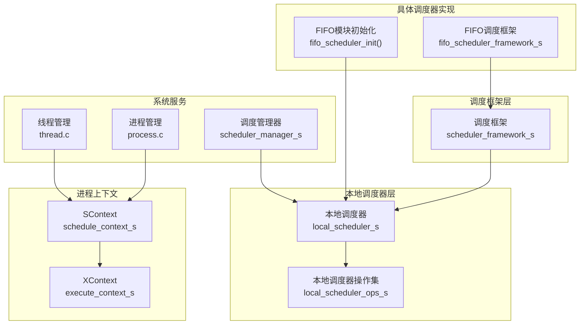
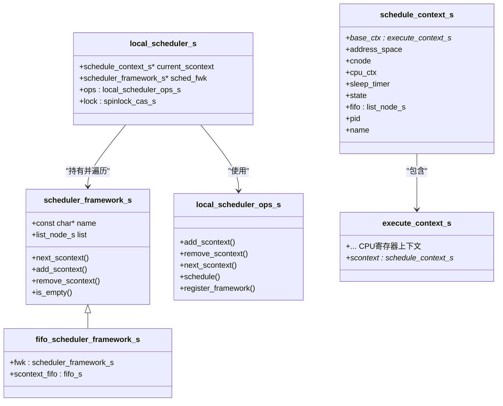
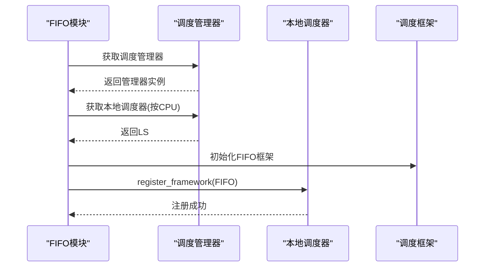
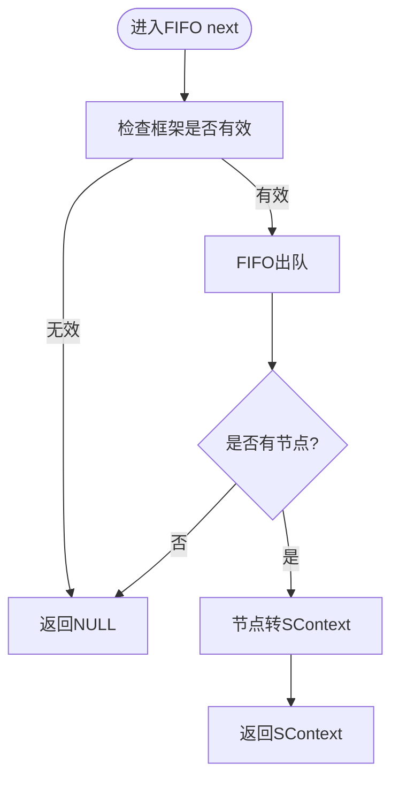
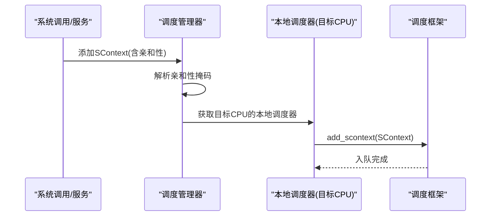
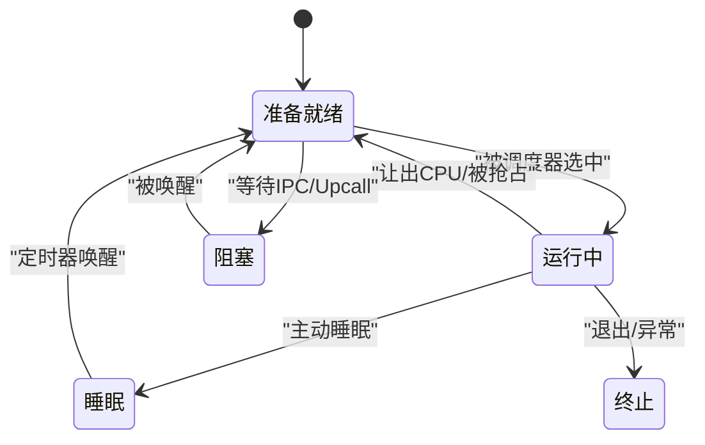
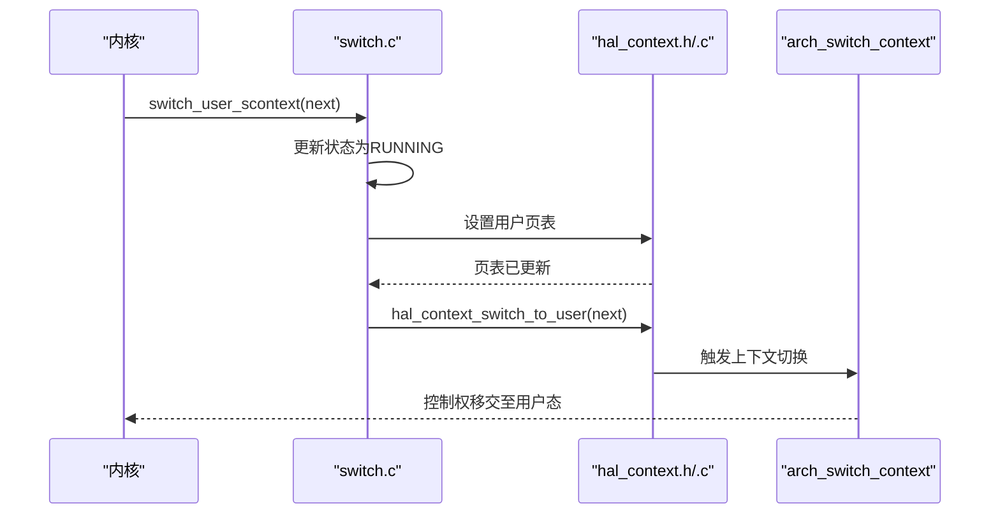
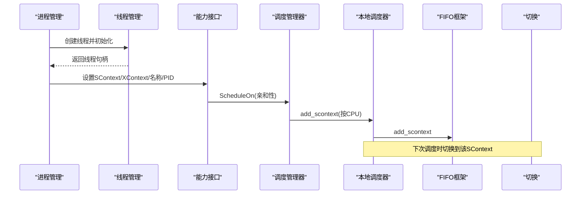
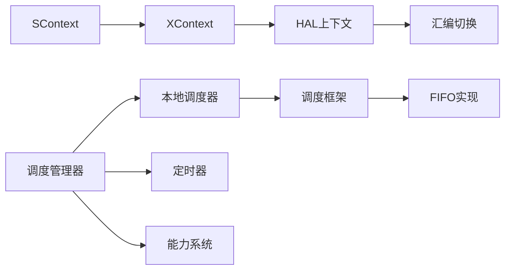

# 进程调度系统

<cite>
**本文引用的文件**
- [kernel/include/scheduler/sched_framework.h](file://kernel/include/scheduler/sched_framework.h)
- [kernel/include/scheduler/sched_mgr.h](file://kernel/include/scheduler/sched_mgr.h)
- [kernel/module/sched/fifo_scheduler.c](file://kernel/module/sched/fifo_scheduler.c)
- [kernel/schedule/sched_mgr.c](file://kernel/schedule/sched_mgr.c)
- [kernel/include/scontext/scontext.h](file://kernel/include/scontext/scontext.h)
- [kernel/context/scontext.c](file://kernel/context/scontext.c)
- [kernel/context/xcontext.c](file://kernel/context/xcontext.c)
- [kernel/include/switch.h](file://kernel/include/switch.h)
- [kernel/switch.c](file://kernel/switch.c)
- [kernel/include/arch/generic/hal_context.h](file://kernel/include/arch/generic/hal_context.h)
- [kernel/arch/arm64/context.c](file://kernel/arch/arm64/context.c)
- [kernel/include/arch/arm64/switch.h](file://kernel/include/arch/arm64/switch.h)
- [kernel/systemd/procmgr/process.c](file://kernel/systemd/procmgr/process.c)
- [kernel/systemd/procmgr/thread.c](file://kernel/systemd/procmgr/thread.c)
- [kernel/capability/cap_scontext.c](file://kernel/capability/cap_scontext.c)
- [kernel/ipc/ipc.c](file://kernel/ipc/ipc.c)
</cite>

## 目录
1. [引言](#引言)
2. [项目结构](#项目结构)
3. [核心组件](#核心组件)
4. [架构总览](#架构总览)
5. [详细组件分析](#详细组件分析)
6. [依赖关系分析](#依赖关系分析)
7. [性能考量](#性能考量)
8. [故障排查指南](#故障排查指南)
9. [结论](#结论)
10. [附录](#附录)

## 引言
本文件面向TranquilOS的进程调度系统，围绕FIFO调度器的框架设计与实现进行深入解析，覆盖以下主题：
- 调度框架与本地调度器的职责划分
- FIFO调度器的具体实现与调度队列操作
- 多核支持与亲和性绑定
- 进程状态管理与睡眠/唤醒机制
- 上下文切换与寄存器管理
- 典型调度流程（创建、调度、销毁）
- 配置与调优建议（优先级扩展、实时性保障等）
- 常见问题（死锁、优先级反转、饥饿）的预防与处理

## 项目结构
TranquilOS采用“调度框架 + 本地调度器 + 具体调度器实现”的分层设计：
- 调度框架：定义统一接口，屏蔽具体调度算法细节
- 本地调度器：每个CPU一个实例，负责在本核内选择下一个可运行实体
- FIFO调度器：基于环形FIFO队列的调度器实现，作为默认或基础调度策略
- 系统服务与能力：通过能力对象将SContext/XContext与调度器对接

图表来源
- [kernel/include/scheduler/sched_framework.h](file://kernel/include/scheduler/sched_framework.h#L1-L20)
- [kernel/include/scheduler/sched_mgr.h](file://kernel/include/scheduler/sched_mgr.h#L1-L49)
- [kernel/module/sched/fifo_scheduler.c](file://kernel/module/sched/fifo_scheduler.c#L1-L111)
- [kernel/schedule/sched_mgr.c](file://kernel/schedule/sched_mgr.c#L1-L167)
- [kernel/include/scontext/scontext.h](file://kernel/include/scontext/scontext.h#L1-L50)
- [kernel/context/xcontext.c](file://kernel/context/xcontext.c#L1-L15)
- [kernel/systemd/procmgr/process.c](file://kernel/systemd/procmgr/process.c#L1-L442)
- [kernel/systemd/procmgr/thread.c](file://kernel/systemd/procmgr/thread.c#L1-L25)

章节来源
- [kernel/include/scheduler/sched_framework.h](file://kernel/include/scheduler/sched_framework.h#L1-L20)
- [kernel/include/scheduler/sched_mgr.h](file://kernel/include/scheduler/sched_mgr.h#L1-L49)
- [kernel/module/sched/fifo_scheduler.c](file://kernel/module/sched/fifo_scheduler.c#L1-L111)
- [kernel/schedule/sched_mgr.c](file://kernel/schedule/sched_mgr.c#L1-L167)

## 核心组件
- 调度框架接口：定义next/add/remove/is_empty等函数指针，抽象不同调度算法的统一入口
- 本地调度器：每个CPU维护一个实例，持有当前运行的SContext、注册的调度框架链表、以及操作函数指针
- FIFO调度器：以FIFO队列承载待调度的SContext，提供入队、出队、判空等操作，并在模块初始化时注册到本地调度器
- SContext/XContext：用户态执行上下文与调度上下文的桥接，包含状态、地址空间、能力节点、定时器等
- 调度管理器：全局单例，负责初始化本地调度器、按亲和性将SContext加入对应核的调度队列

章节来源
- [kernel/include/scheduler/sched_framework.h](file://kernel/include/scheduler/sched_framework.h#L6-L18)
- [kernel/include/scheduler/sched_mgr.h](file://kernel/include/scheduler/sched_mgr.h#L14-L28)
- [kernel/module/sched/fifo_scheduler.c](file://kernel/module/sched/fifo_scheduler.c#L13-L16)
- [kernel/include/scontext/scontext.h](file://kernel/include/scontext/scontext.h#L22-L43)
- [kernel/schedule/sched_mgr.c](file://kernel/schedule/sched_mgr.c#L113-L129)

## 架构总览
调度系统遵循“框架-实现-管理器-上下文”的分层：
- 框架层提供统一调度接口
- 实现层提供具体调度算法（当前为FIFO）
- 管理器层负责跨核初始化与亲和性路由
- 上下文层负责状态与资源管理

图表来源
- [kernel/include/scheduler/sched_framework.h](file://kernel/include/scheduler/sched_framework.h#L11-L18)
- [kernel/include/scheduler/sched_mgr.h](file://kernel/include/scheduler/sched_mgr.h#L23-L28)
- [kernel/module/sched/fifo_scheduler.c](file://kernel/module/sched/fifo_scheduler.c#L13-L16)
- [kernel/include/scontext/scontext.h](file://kernel/include/scontext/scontext.h#L22-L43)
- [kernel/context/xcontext.c](file://kernel/context/xcontext.c#L4-L11)

## 详细组件分析

### 调度框架与本地调度器
- 调度框架接口：提供next/add/remove/is_empty四类回调，屏蔽具体调度算法
- 本地调度器：每个CPU一个实例，维护当前运行的SContext、已注册的调度框架链表、自旋锁保护
- 注册顺序：先初始化本地调度器，再将具体调度器框架注册到本地调度器

图表来源
- [kernel/module/sched/fifo_scheduler.c](file://kernel/module/sched/fifo_scheduler.c#L87-L109)
- [kernel/schedule/sched_mgr.c](file://kernel/schedule/sched_mgr.c#L105-L129)

章节来源
- [kernel/include/scheduler/sched_framework.h](file://kernel/include/scheduler/sched_framework.h#L6-L18)
- [kernel/include/scheduler/sched_mgr.h](file://kernel/include/scheduler/sched_mgr.h#L14-L28)
- [kernel/schedule/sched_mgr.c](file://kernel/schedule/sched_mgr.c#L89-L103)

### FIFO调度器实现
- 数据结构：每个CPU维护一个FIFO队列，存储SContext的链表节点
- 操作接口：
  - next：从队列头部取出下一个SContext
  - add：将SContext入队
  - remove：将指定SContext从队列移除
  - is_empty：判断队列是否为空
- 初始化：模块按CPU初始化FIFO，填充框架回调并注册到本地调度器

图表来源
- [kernel/module/sched/fifo_scheduler.c](file://kernel/module/sched/fifo_scheduler.c#L18-L36)

章节来源
- [kernel/module/sched/fifo_scheduler.c](file://kernel/module/sched/fifo_scheduler.c#L13-L83)

### 多核支持与亲和性
- 亲和性：通过位掩码标识目标CPU集合，调度管理器根据第一个置位的CPU将SContext加入对应本地调度器
- 本地化：每个CPU独立维护自己的调度队列，减少跨核竞争
- 初始化：本地调度器在各CPU上分别初始化，设置自旋锁与操作函数指针

图表来源
- [kernel/schedule/sched_mgr.c](file://kernel/schedule/sched_mgr.c#L131-L147)
- [kernel/include/scheduler/sched_mgr.h](file://kernel/include/scheduler/sched_mgr.h#L105-L111)

章节来源
- [kernel/schedule/sched_mgr.c](file://kernel/schedule/sched_mgr.c#L131-L147)
- [kernel/include/scheduler/sched_mgr.h](file://kernel/include/scheduler/sched_mgr.h#L105-L111)

### 进程状态管理与调度队列
- 状态枚举：READY、RUNNING、SLEEP、BLOCKED及细分（IPC、UPCALL）
- 状态流转：
  - 创建后：READY
  - 被选中执行：RUNNING
  - 睡眠：SLEEP（由定时器到期唤醒后回到READY）
  - 阻塞：BLOCKED（IPC/UPCALL等场景）
  - 终止：TERMINATED
- 队列操作：READY状态的SContext通过调度框架的add/remove接口进入/离开FIFO队列

图表来源
- [kernel/include/scontext/scontext.h](file://kernel/include/scontext/scontext.h#L12-L20)
- [kernel/context/scontext.c](file://kernel/context/scontext.c#L9-L30)

章节来源
- [kernel/include/scontext/scontext.h](file://kernel/include/scontext/scontext.h#L12-L20)
- [kernel/context/scontext.c](file://kernel/context/scontext.c#L9-L30)

### 上下文切换机制与寄存器管理
- 用户态切换入口：提供按SContext或XContext切换的函数
- 切换流程：
  - 设置TLB全失效
  - 切换页表（用户地址空间）
  - 调用HAL层切换到用户态
- HAL层实现：ARM64平台设置SP/LR/PC/SPSR等寄存器，调用汇编切换函数

图表来源
- [kernel/switch.c](file://kernel/switch.c#L8-L29)
- [kernel/include/switch.h](file://kernel/include/switch.h#L7-L11)
- [kernel/include/arch/generic/hal_context.h](file://kernel/include/arch/generic/hal_context.h#L22-L23)
- [kernel/arch/arm64/context.c](file://kernel/arch/arm64/context.c#L96-L98)
- [kernel/include/arch/arm64/switch.h](file://kernel/include/arch/arm64/switch.h#L27)

章节来源
- [kernel/switch.c](file://kernel/switch.c#L8-L29)
- [kernel/arch/arm64/context.c](file://kernel/arch/arm64/context.c#L12-L33)

### 进程创建、调度与销毁（流程示例）
- 创建阶段：
  - 分配并初始化SContext/XContext
  - 将SContext加入进程/线程对象
  - 通过能力接口将SContext加入调度器（按亲和性）
- 调度阶段：
  - 本地调度器遍历已注册的调度框架
  - FIFO框架从队列取下一个SContext
  - 切换到该SContext执行
- 销毁阶段：
  - 标记终止状态
  - 释放资源（地址空间、能力节点等）

图表来源
- [kernel/systemd/procmgr/process.c](file://kernel/systemd/procmgr/process.c#L19-L82)
- [kernel/systemd/procmgr/process.c](file://kernel/systemd/procmgr/process.c#L150-L174)
- [kernel/capability/cap_scontext.c](file://kernel/capability/cap_scontext.c#L316-L341)
- [kernel/schedule/sched_mgr.c](file://kernel/schedule/sched_mgr.c#L131-L147)

章节来源
- [kernel/systemd/procmgr/process.c](file://kernel/systemd/procmgr/process.c#L19-L82)
- [kernel/systemd/procmgr/process.c](file://kernel/systemd/procmgr/process.c#L150-L174)
- [kernel/capability/cap_scontext.c](file://kernel/capability/cap_scontext.c#L300-L341)
- [kernel/schedule/sched_mgr.c](file://kernel/schedule/sched_mgr.c#L131-L147)

### 优先级处理与扩展点
- 当前实现：FIFO无显式优先级字段；调度器按框架链表顺序轮询，首个非空框架提供下一个SContext
- 扩展建议：
  - 在调度框架中增加优先级字段与比较函数
  - 支持RT/CFS等调度器并按优先级/权重选择
  - 提供动态优先级调整接口（如时间片轮转、期限驱动）

章节来源
- [kernel/schedule/sched_mgr.c](file://kernel/schedule/sched_mgr.c#L62-L71)
- [kernel/include/scheduler/sched_framework.h](file://kernel/include/scheduler/sched_framework.h#L6-L18)

### 实时性与睡眠/唤醒
- 睡眠：将SContext置为SLEEP，注册定时器，从调度器移除
- 唤醒：定时器回调将SContext置为READY并重新加入调度器
- IPC/Upcall阻塞：阻塞状态下同样从调度器移除，等待事件后唤醒

章节来源
- [kernel/context/scontext.c](file://kernel/context/scontext.c#L47-L68)
- [kernel/context/scontext.c](file://kernel/context/scontext.c#L9-L30)
- [kernel/ipc/ipc.c](file://kernel/ipc/ipc.c#L81-L114)

## 依赖关系分析
- 组件耦合：
  - 本地调度器依赖调度框架接口，不关心具体算法
  - FIFO调度器实现依赖通用FIFO数据结构
  - SContext/XContext与HAL层交互完成寄存器与页表切换
- 外部依赖：
  - HAL抽象了CPU架构差异（ARM64）
  - 定时器容器用于睡眠/唤醒
  - 能力系统用于跨组件安全地传递SContext/XContext引用

图表来源
- [kernel/schedule/sched_mgr.c](file://kernel/schedule/sched_mgr.c#L1-L167)
- [kernel/module/sched/fifo_scheduler.c](file://kernel/module/sched/fifo_scheduler.c#L1-L111)
- [kernel/arch/arm64/context.c](file://kernel/arch/arm64/context.c#L1-L98)

章节来源
- [kernel/schedule/sched_mgr.c](file://kernel/schedule/sched_mgr.c#L1-L167)
- [kernel/module/sched/fifo_scheduler.c](file://kernel/module/sched/fifo_scheduler.c#L1-L111)

## 性能考量
- 队列操作复杂度：FIFO的入队/出队为O(1)，整体调度开销低
- 缓存行对齐：本地调度器结构按缓存行对齐，降低伪共享
- 自旋锁保护：关键路径使用CAS自旋锁，避免阻塞
- TLB刷新：切换用户态前刷新TLB，避免脏页导致的缺页开销
- 多核亲和性：按亲和性将SContext绑定到特定CPU，减少跨核迁移

章节来源
- [kernel/include/scheduler/sched_mgr.h](file://kernel/include/scheduler/sched_mgr.h#L27-L28)
- [kernel/switch.c](file://kernel/switch.c#L19-L21)

## 故障排查指南
- 调度器未初始化
  - 现象：添加SContext时报错或返回NULL
  - 排查：确认调度管理器初始化与本地调度器初始化顺序正确
- SContext与XContext链接错误
  - 现象：日志提示链接不一致
  - 排查：检查SContext初始化流程，确保XContext指向正确的SContext
- 睡眠未唤醒
  - 现象：SContext长时间处于SLEEP
  - 排查：确认定时器创建与回调逻辑，检查唤醒路径是否将SContext重新加入调度器
- IPC阻塞未恢复
  - 现象：调用方阻塞且无法恢复
  - 排查：确认IPC结束路径正确设置调用者状态并唤醒其SContext

章节来源
- [kernel/schedule/sched_mgr.c](file://kernel/schedule/sched_mgr.c#L19-L28)
- [kernel/context/scontext.c](file://kernel/context/scontext.c#L9-L30)
- [kernel/ipc/ipc.c](file://kernel/ipc/ipc.c#L81-L114)

## 结论
TranquilOS的调度系统以“框架-实现-管理器-上下文”清晰分层，FIFO调度器提供了简单可靠的默认策略。通过多核亲和性与本地调度器隔离，系统在保持低延迟的同时具备良好的可扩展性。未来可在调度框架中引入优先级与公平性策略，进一步提升实时性与吞吐量。

## 附录
- 关键API与路径参考
  - 调度框架接口定义：[kernel/include/scheduler/sched_framework.h](file://kernel/include/scheduler/sched_framework.h#L6-L18)
  - 本地调度器结构与操作：[kernel/include/scheduler/sched_mgr.h](file://kernel/include/scheduler/sched_mgr.h#L14-L28)
  - FIFO调度器实现：[kernel/module/sched/fifo_scheduler.c](file://kernel/module/sched/fifo_scheduler.c#L18-L83)
  - 本地调度器管理：[kernel/schedule/sched_mgr.c](file://kernel/schedule/sched_mgr.c#L51-L129)
  - SContext状态与睡眠：[kernel/include/scontext/scontext.h](file://kernel/include/scontext/scontext.h#L12-L20), [kernel/context/scontext.c](file://kernel/context/scontext.c#L47-L68)
  - 上下文切换入口：[kernel/include/switch.h](file://kernel/include/switch.h#L7-L11), [kernel/switch.c](file://kernel/switch.c#L8-L29)
  - HAL上下文初始化与切换：[kernel/arch/arm64/context.c](file://kernel/arch/arm64/context.c#L12-L33), [kernel/arch/arm64/context.c](file://kernel/arch/arm64/context.c#L96-L98)
  - 进程/线程创建与调度：[kernel/systemd/procmgr/process.c](file://kernel/systemd/procmgr/process.c#L19-L82), [kernel/systemd/procmgr/process.c](file://kernel/systemd/procmgr/process.c#L150-L174)
  - 能力接口调度：[kernel/capability/cap_scontext.c](file://kernel/capability/cap_scontext.c#L316-L341)