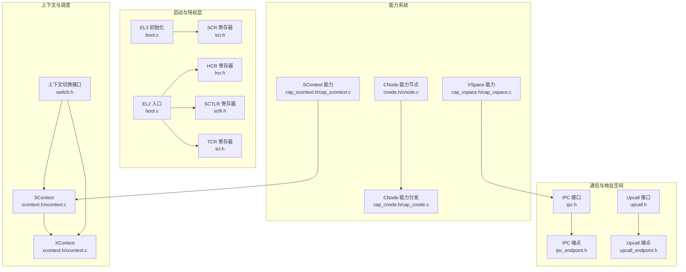
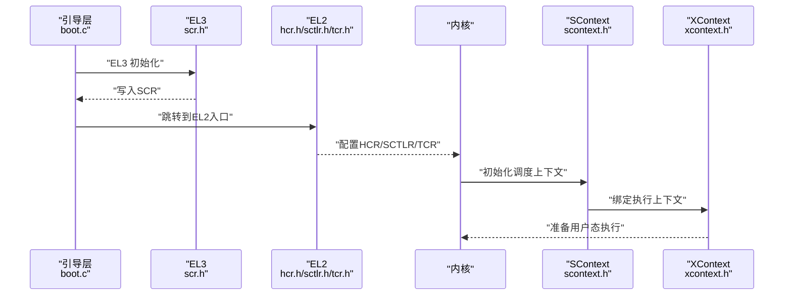
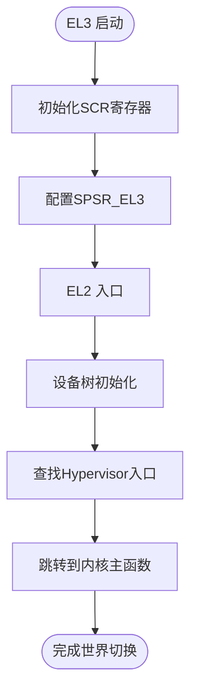
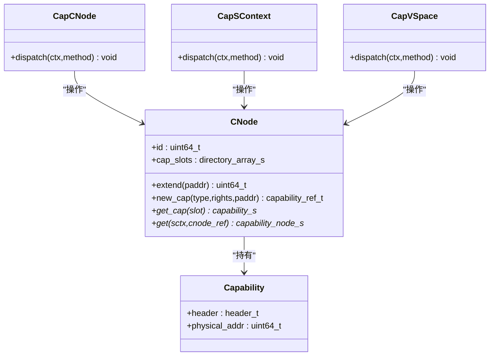
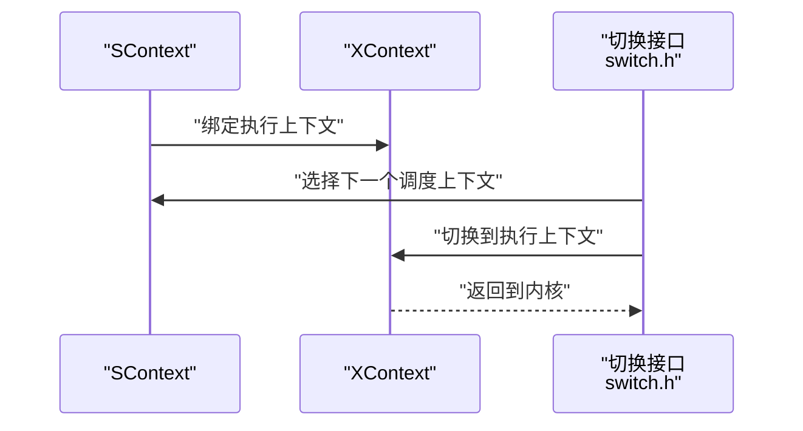
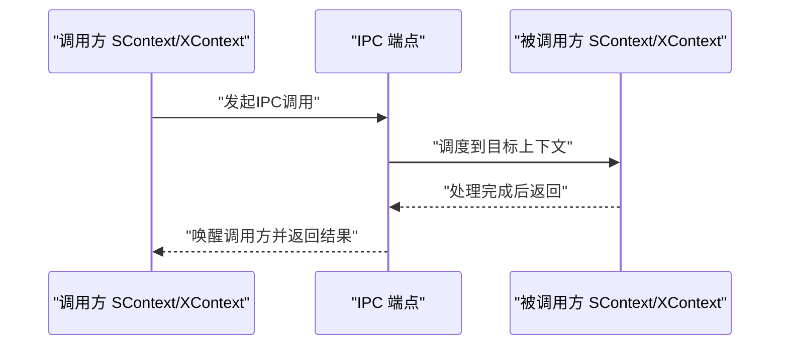
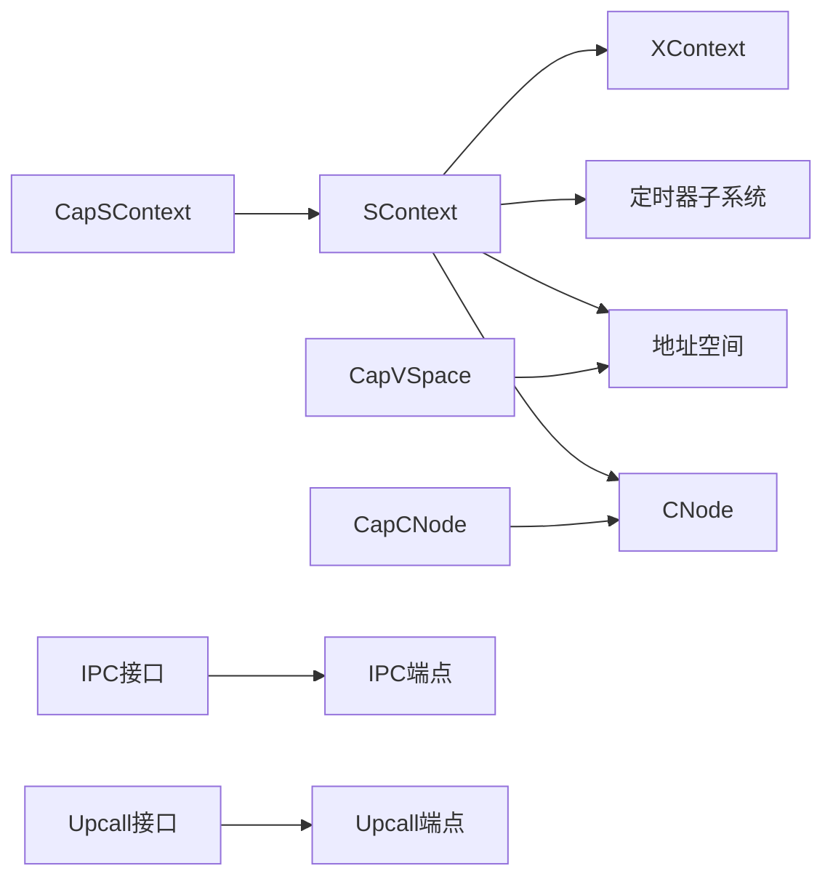

# 安全模块

<cite>
**本文引用的文件**
- [boot.c](file://boot/boot.c)
- [scr.h](file://kernel/include/arch/arm64/registers/scr.h)
- [hcr.h](file://kernel/include/arch/arm64/registers/hcr.h)
- [sctlr.h](file://kernel/include/arch/arm64/registers/sctlr.h)
- [tcr.h](file://kernel/include/arch/arm64/registers/tcr.h)
- [scontext.h](file://kernel/include/scontext/scontext.h)
- [xcontext.h](file://kernel/include/xcontext/xcontext.h)
- [scontext.c](file://kernel/context/scontext.c)
- [xcontext.c](file://kernel/context/xcontext.c)
- [cnode.h](file://kernel/include/capability/cnode.h)
- [cnode.c](file://kernel/capability/cnode.c)
- [cap_cnode.h](file://kernel/include/capability/cap_cnode.h)
- [cap_cnode.c](file://kernel/capability/cap_cnode.c)
- [cap_scontext.h](file://kernel/include/capability/cap_scontext.h)
- [cap_scontext.c](file://kernel/capability/cap_scontext.c)
- [cap_vspace.h](file://kernel/include/capability/cap_vspace.h)
- [cap_vspace.c](file://kernel/capability/cap_vspace.c)
- [ipc.h](file://kernel/include/ipc/ipc.h)
- [ipc_endpoint.h](file://kernel/include/ipc/ipc_endpoint.h)
- [upcall.h](file://kernel/include/upcall/upcall.h)
- [upcall_endpoint.h](file://kernel/include/upcall/upcall_endpoint.h)
- [switch.h](file://kernel/include/switch.h)
- [BUILD.gn](file://trustee/BUILD.gn)
</cite>

## 目录
1. [引言](#引言)
2. [项目结构](#项目结构)
3. [核心组件](#核心组件)
4. [架构总览](#架构总览)
5. [详细组件分析](#详细组件分析)
6. [依赖关系分析](#依赖关系分析)
7. [性能考量](#性能考量)
8. [故障排查指南](#故障排查指南)
9. [结论](#结论)
10. [附录](#附录)

## 引言
本文件面向TranquilOS安全模块，聚焦以下目标：
- 详述TrustZone集成的安全世界初始化与世界切换机制（EL3/EL2/EL1）。
- 解释权限控制系统：Capability验证、能力节点（CNode）、访问控制列表（ACL）式权限位、安全策略实施。
- 阐明安全通信机制与跨世界数据交换：IPC端点、上行调用（Upcall）与地址空间映射。
- 提供安全配置与策略定制指导：通过寄存器配置（SCR/HCR/TTBR/TCR等）实现隔离与保护。
- 给出安全威胁分析与防护建议、常见问题与调试方法。

本说明兼顾安全开发者与系统集成者的需求，既提供代码级关系图示，也给出可操作的配置与排障建议。

## 项目结构
安全相关代码主要分布在如下区域：
- 启动与特权层初始化：EL3/EL2/EL1入口与寄存器配置。
- 上下文与调度：执行上下文（XContext）、调度上下文（SContext）及定时器。
- 能力系统：能力节点（CNode）与各类能力对象（SContext/VSpace/IPC/Upcall等）。
- 通信与地址空间：IPC端点、上行调用端点、地址空间映射。
- Hypervisor与TrustZone：HCR/SCR等寄存器定义与Trustee构建。

**图表来源**
- [boot.c](file://boot/boot.c#L114-L175)
- [scr.h](file://kernel/include/arch/arm64/registers/scr.h#L1-L52)
- [hcr.h](file://kernel/include/arch/arm64/registers/hcr.h#L1-L72)
- [sctlr.h](file://kernel/include/arch/arm64/registers/sctlr.h#L1-L61)
- [tcr.h](file://kernel/include/arch/arm64/registers/tcr.h#L1-L56)
- [scontext.h](file://kernel/include/scontext/scontext.h#L1-L50)
- [xcontext.h](file://kernel/include/xcontext/xcontext.h#L1-L24)
- [scontext.c](file://kernel/context/scontext.c#L1-L68)
- [xcontext.c](file://kernel/context/xcontext.c#L1-L15)
- [cnode.h](file://kernel/include/capability/cnode.h#L1-L28)
- [cnode.c](file://kernel/capability/cnode.c#L1-L95)
- [cap_cnode.h](file://kernel/include/capability/cap_cnode.h#L1-L12)
- [cap_cnode.c](file://kernel/capability/cap_cnode.c#L1-L41)
- [cap_scontext.h](file://kernel/include/capability/cap_scontext.h#L1-L12)
- [cap_scontext.c](file://kernel/capability/cap_scontext.c#L1-L462)
- [cap_vspace.h](file://kernel/include/capability/cap_vspace.h#L1-L12)
- [cap_vspace.c](file://kernel/capability/cap_vspace.c#L42-L85)
- [ipc.h](file://kernel/include/ipc/ipc.h#L1-L13)
- [ipc_endpoint.h](file://kernel/include/ipc/ipc_endpoint.h#L1-L25)
- [upcall.h](file://kernel/include/upcall/upcall.h#L1-L13)
- [upcall_endpoint.h](file://kernel/include/upcall/upcall_endpoint.h#L1-L25)
- [switch.h](file://kernel/include/switch.h#L1-L11)

**章节来源**
- [boot.c](file://boot/boot.c#L114-L175)
- [scr.h](file://kernel/include/arch/arm64/registers/scr.h#L1-L52)
- [hcr.h](file://kernel/include/arch/arm64/registers/hcr.h#L1-L72)
- [sctlr.h](file://kernel/include/arch/arm64/registers/sctlr.h#L1-L61)
- [tcr.h](file://kernel/include/arch/arm64/registers/tcr.h#L1-L56)
- [scontext.h](file://kernel/include/scontext/scontext.h#L1-L50)
- [xcontext.h](file://kernel/include/xcontext/xcontext.h#L1-L24)
- [scontext.c](file://kernel/context/scontext.c#L1-L68)
- [xcontext.c](file://kernel/context/xcontext.c#L1-L15)
- [cnode.h](file://kernel/include/capability/cnode.h#L1-L28)
- [cnode.c](file://kernel/capability/cnode.c#L1-L95)
- [cap_cnode.h](file://kernel/include/capability/cap_cnode.h#L1-L12)
- [cap_cnode.c](file://kernel/capability/cap_cnode.c#L1-L41)
- [cap_scontext.h](file://kernel/include/capability/cap_scontext.h#L1-L12)
- [cap_scontext.c](file://kernel/capability/cap_scontext.c#L1-L462)
- [cap_vspace.h](file://kernel/include/capability/cap_vspace.h#L1-L12)
- [cap_vspace.c](file://kernel/capability/cap_vspace.c#L42-L85)
- [ipc.h](file://kernel/include/ipc/ipc.h#L1-L13)
- [ipc_endpoint.h](file://kernel/include/ipc/ipc_endpoint.h#L1-L25)
- [upcall.h](file://kernel/include/upcall/upcall.h#L1-L13)
- [upcall_endpoint.h](file://kernel/include/upcall/upcall_endpoint.h#L1-L25)
- [switch.h](file://kernel/include/switch.h#L1-L11)

## 核心组件
- 特权层与寄存器配置：EL3初始化设置安全控制寄存器（SCR），EL2入口负责进入Hypervisor；EL1/EL2/EL3均涉及关键控制寄存器（HCR/SCTLR/TCR/SCR）。
- 上下文与调度：XContext用于用户态执行上下文初始化；SContext封装调度状态、地址空间、能力节点与睡眠定时器。
- 能力系统：CNode是能力节点容器；CapCNode/CapSContext/CapVSpace分别负责CNode对象管理、SContext能力操作与VSpace映射。
- 通信与地址空间：IPC端点支持跨世界调用与回复；Upcall端点处理异常或故障时的回调；VSpace能力用于页映射。
- TrustZone集成：通过EL3/EL2/EL1的分层与寄存器配置实现隔离；Trustee构建脚本提供独立镜像。

**章节来源**
- [boot.c](file://boot/boot.c#L114-L175)
- [scontext.h](file://kernel/include/scontext/scontext.h#L1-L50)
- [xcontext.h](file://kernel/include/xcontext/xcontext.h#L1-L24)
- [cnode.h](file://kernel/include/capability/cnode.h#L1-L28)
- [cap_cnode.h](file://kernel/include/capability/cap_cnode.h#L1-L12)
- [cap_scontext.h](file://kernel/include/capability/cap_scontext.h#L1-L12)
- [cap_vspace.h](file://kernel/include/capability/cap_vspace.h#L1-L12)
- [ipc_endpoint.h](file://kernel/include/ipc/ipc_endpoint.h#L1-L25)
- [upcall_endpoint.h](file://kernel/include/upcall/upcall_endpoint.h#L1-L25)
- [BUILD.gn](file://trustee/BUILD.gn#L1-L42)

## 架构总览
TranquilOS在ARM64平台上采用多特权级（EL3/EL2/EL1）与能力系统实现安全隔离与可控访问。EL3负责安全世界初始化与控制寄存器配置；EL2作为Hypervisor入口，结合HCR/SCTLR/TCR等寄存器实现虚拟化与内存隔离；EL1运行内核与受控服务；XContext/SContext构成执行与调度单元；CNode与各类能力对象提供细粒度权限控制；IPC/Upcall实现跨世界通信；VSpace能力支撑地址空间映射。

**图表来源**
- [boot.c](file://boot/boot.c#L114-L175)
- [scr.h](file://kernel/include/arch/arm64/registers/scr.h#L1-L52)
- [hcr.h](file://kernel/include/arch/arm64/registers/hcr.h#L1-L72)
- [sctlr.h](file://kernel/include/arch/arm64/registers/sctlr.h#L1-L61)
- [tcr.h](file://kernel/include/arch/arm64/registers/tcr.h#L1-L56)
- [scontext.h](file://kernel/include/scontext/scontext.h#L1-L50)
- [xcontext.h](file://kernel/include/xcontext/xcontext.h#L1-L24)

## 详细组件分析

### 信任世界初始化与世界切换（EL3/EL2/EL1）
- EL3初始化：设置SCR寄存器的关键位以启用安全特性、控制重入与异常行为，并配置SPSR_EL3以指定初始执行状态。
- EL2入口：从设备树查找Hypervisor入口，完成早期设备初始化后跳转至内核主函数。
- EL1/EL2寄存器：HCR/SCTLR/TCR等寄存器用于控制虚拟化、缓存/TLB行为、地址转换参数等，是实现隔离与安全策略的基础。

**图表来源**
- [boot.c](file://boot/boot.c#L114-L175)
- [scr.h](file://kernel/include/arch/arm64/registers/scr.h#L1-L52)

**章节来源**
- [boot.c](file://boot/boot.c#L114-L175)
- [scr.h](file://kernel/include/arch/arm64/registers/scr.h#L1-L52)
- [hcr.h](file://kernel/include/arch/arm64/registers/hcr.h#L1-L72)
- [sctlr.h](file://kernel/include/arch/arm64/registers/sctlr.h#L1-L61)
- [tcr.h](file://kernel/include/arch/arm64/registers/tcr.h#L1-L56)

### 权限控制系统：Capability、CNode与ACL式权限
- Capability模型：每个能力对象包含类型、权限位与物理地址等元数据；通过CNode组织能力槽位，实现能力的分配与传递。
- ACL式权限：能力对象的rights字段用于表达最小权限集合；调用方需具备相应权限才能操作目标能力。
- 关键流程：
  - 创建能力：在CNode中分配槽位并写入能力头与物理地址。
  - 获取能力：根据引用定位目标CNode与槽位，读取能力对象。
  - 权限校验：在能力分发函数中对传入参数进行校验与权限检查。

**图表来源**
- [cnode.h](file://kernel/include/capability/cnode.h#L1-L28)
- [cnode.c](file://kernel/capability/cnode.c#L1-L95)
- [cap_cnode.h](file://kernel/include/capability/cap_cnode.h#L1-L12)
- [cap_cnode.c](file://kernel/capability/cap_cnode.c#L1-L41)
- [cap_scontext.h](file://kernel/include/capability/cap_scontext.h#L1-L12)
- [cap_scontext.c](file://kernel/capability/cap_scontext.c#L1-L462)
- [cap_vspace.h](file://kernel/include/capability/cap_vspace.h#L1-L12)
- [cap_vspace.c](file://kernel/capability/cap_vspace.c#L42-L85)

**章节来源**
- [cnode.h](file://kernel/include/capability/cnode.h#L1-L28)
- [cnode.c](file://kernel/capability/cnode.c#L1-L95)
- [cap_cnode.h](file://kernel/include/capability/cap_cnode.h#L1-L12)
- [cap_cnode.c](file://kernel/capability/cap_cnode.c#L1-L41)
- [cap_scontext.h](file://kernel/include/capability/cap_scontext.h#L1-L12)
- [cap_scontext.c](file://kernel/capability/cap_scontext.c#L1-L462)
- [cap_vspace.h](file://kernel/include/capability/cap_vspace.h#L1-L12)
- [cap_vspace.c](file://kernel/capability/cap_vspace.c#L42-L85)

### 安全策略实施与上下文管理
- SContext：封装调度状态、睡眠定时器、地址空间与能力节点，支持睡眠与唤醒。
- XContext：初始化通用寄存器与用户态入口，配合HAL层完成上下文切换准备。
- 切换接口：提供从调度上下文到执行上下文的切换接口，确保安全世界切换时的状态一致性。

**图表来源**
- [scontext.h](file://kernel/include/scontext/scontext.h#L1-L50)
- [xcontext.h](file://kernel/include/xcontext/xcontext.h#L1-L24)
- [scontext.c](file://kernel/context/scontext.c#L1-L68)
- [xcontext.c](file://kernel/context/xcontext.c#L1-L15)
- [switch.h](file://kernel/include/switch.h#L1-L11)

**章节来源**
- [scontext.h](file://kernel/include/scontext/scontext.h#L1-L50)
- [xcontext.h](file://kernel/include/xcontext/xcontext.h#L1-L24)
- [scontext.c](file://kernel/context/scontext.c#L1-L68)
- [xcontext.c](file://kernel/context/xcontext.c#L1-L15)
- [switch.h](file://kernel/include/switch.h#L1-L11)

### 安全通信机制与跨世界数据交换
- IPC端点：提供阻塞等待与唤醒机制，支持跨世界调用与回复。
- Upcall端点：用于异常或故障场景的回调处理。
- 地址空间映射：通过VSpace能力尝试映射页，实现跨世界共享内存或数据交换。

**图表来源**
- [ipc.h](file://kernel/include/ipc/ipc.h#L1-L13)
- [ipc_endpoint.h](file://kernel/include/ipc/ipc_endpoint.h#L1-L25)
- [upcall.h](file://kernel/include/upcall/upcall.h#L1-L13)
- [upcall_endpoint.h](file://kernel/include/upcall/upcall_endpoint.h#L1-L25)
- [cap_vspace.c](file://kernel/capability/cap_vspace.c#L42-L85)

**章节来源**
- [ipc.h](file://kernel/include/ipc/ipc.h#L1-L13)
- [ipc_endpoint.h](file://kernel/include/ipc/ipc_endpoint.h#L1-L25)
- [upcall.h](file://kernel/include/upcall/upcall.h#L1-L13)
- [upcall_endpoint.h](file://kernel/include/upcall/upcall_endpoint.h#L1-L25)
- [cap_vspace.c](file://kernel/capability/cap_vspace.c#L42-L85)

### 安全配置与策略定制
- 寄存器配置要点：
  - SCR（EL3）：控制重入、异常处理、安全扩展等。
  - HCR（EL2）：控制虚拟化、中断/异常转发、缓存/TLB行为等。
  - SCTLR（EL1）：控制缓存、分支预测、异常与指令集特性等。
  - TCR（EL1）：控制地址转换大小、域、缓存属性等。
- 策略建议：
  - 最小权限原则：能力rights仅授予必要权限。
  - 分层隔离：利用EL2/EL1/EL3的特权差异实现强隔离。
  - 严格验证：在能力分发前进行参数与权限校验。
  - 可审计性：记录能力创建、映射与调用日志以便审计。

**章节来源**
- [scr.h](file://kernel/include/arch/arm64/registers/scr.h#L1-L52)
- [hcr.h](file://kernel/include/arch/arm64/registers/hcr.h#L1-L72)
- [sctlr.h](file://kernel/include/arch/arm64/registers/sctlr.h#L1-L61)
- [tcr.h](file://kernel/include/arch/arm64/registers/tcr.h#L1-L56)
- [cap_scontext.c](file://kernel/capability/cap_scontext.c#L1-L462)
- [cap_vspace.c](file://kernel/capability/cap_vspace.c#L42-L85)

## 依赖关系分析
- 组件耦合：
  - SContext依赖XContext与定时器子系统；与地址空间与能力节点紧密耦合。
  - 能力分发函数依赖CNode与具体对象类型（SContext/VSpace/IPC/Upcall）。
  - IPC/Upcall依赖端点结构与等待队列。
- 外部依赖：
  - HAL层提供上下文初始化与寄存器访问接口。
  - 设备树用于Hypervisor入口定位与早期设备初始化。

**图表来源**
- [scontext.h](file://kernel/include/scontext/scontext.h#L1-L50)
- [xcontext.h](file://kernel/include/xcontext/xcontext.h#L1-L24)
- [cnode.h](file://kernel/include/capability/cnode.h#L1-L28)
- [cap_scontext.c](file://kernel/capability/cap_scontext.c#L1-L462)
- [cap_vspace.c](file://kernel/capability/cap_vspace.c#L42-L85)
- [ipc_endpoint.h](file://kernel/include/ipc/ipc_endpoint.h#L1-L25)
- [upcall_endpoint.h](file://kernel/include/upcall/upcall_endpoint.h#L1-L25)

**章节来源**
- [scontext.h](file://kernel/include/scontext/scontext.h#L1-L50)
- [xcontext.h](file://kernel/include/xcontext/xcontext.h#L1-L24)
- [cnode.h](file://kernel/include/capability/cnode.h#L1-L28)
- [cap_scontext.c](file://kernel/capability/cap_scontext.c#L1-L462)
- [cap_vspace.c](file://kernel/capability/cap_vspace.c#L42-L85)
- [ipc_endpoint.h](file://kernel/include/ipc/ipc_endpoint.h#L1-L25)
- [upcall_endpoint.h](file://kernel/include/upcall/upcall_endpoint.h#L1-L25)

## 性能考量
- 能力分配与扩展：CNode扩展时按页分配，避免频繁碎片化；尽量批量扩展以减少内存分配开销。
- 定时器与睡眠：使用高效的时间容器（如红黑树）管理睡眠任务，降低唤醒延迟。
- IPC/Upcall路径：尽量减少跨世界调用次数，合并请求；在端点层面优化等待队列。
- 寄存器配置：合理设置HCR/SCTLR/TCR，平衡性能与安全；避免过度禁用缓存或TLB旁路。

## 故障排查指南
- EL3/EL2启动失败：
  - 检查设备树中Hypervisor入口是否正确；确认EL3初始化是否成功写入SCR。
- 能力分发错误：
  - 核对CNode引用与槽位索引；确认目标能力类型匹配；检查rights权限位。
- IPC/Upcall异常：
  - 检查端点等待队列与唤醒逻辑；确认调用方/被调用方上下文状态。
- 地址映射失败：
  - 检查VSpace映射参数（虚拟/物理地址）与权限；确认地址空间有效。
- 调试建议：
  - 使用内核日志输出关键路径参数；在能力分发与映射处增加断言与错误码返回。

**章节来源**
- [boot.c](file://boot/boot.c#L114-L175)
- [cap_cnode.c](file://kernel/capability/cap_cnode.c#L1-L41)
- [cap_scontext.c](file://kernel/capability/cap_scontext.c#L1-L462)
- [cap_vspace.c](file://kernel/capability/cap_vspace.c#L42-L85)
- [ipc_endpoint.h](file://kernel/include/ipc/ipc_endpoint.h#L1-L25)
- [upcall_endpoint.h](file://kernel/include/upcall/upcall_endpoint.h#L1-L25)

## 结论
TranquilOS安全模块通过多特权级（EL3/EL2/EL1）与能力系统实现强隔离与可控访问。EL3负责安全世界初始化与寄存器配置，EL2承担Hypervisor职责，EL1运行内核与服务。SContext/XContext提供执行与调度基础，CNode与能力对象实现ACL式权限控制，IPC/Upcall支撑跨世界通信，VSpace能力实现地址空间映射。结合合理的寄存器配置与最小权限原则，可为系统集成提供可靠的安全部署方案。

## 附录
- Trustee构建：独立镜像构建脚本提供编译与链接选项，便于在可信世界部署。

**章节来源**
- [BUILD.gn](file://trustee/BUILD.gn#L1-L42)