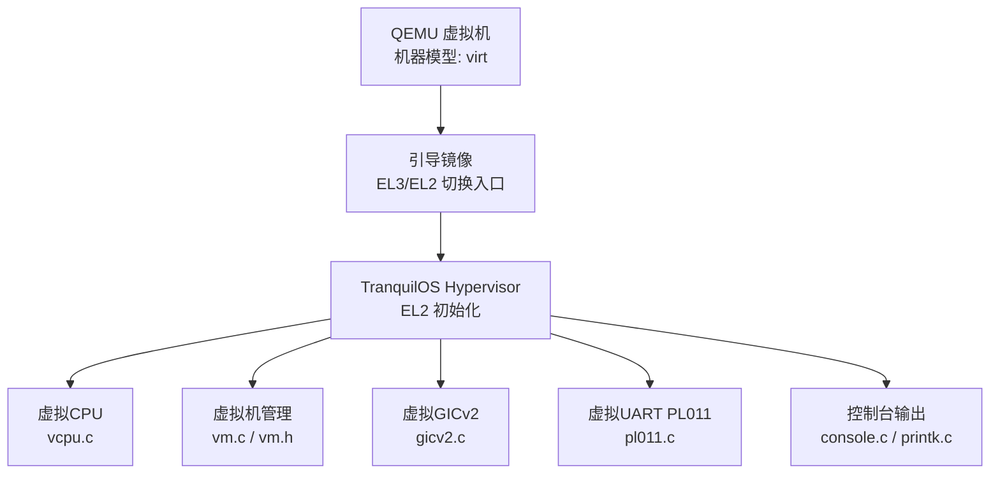
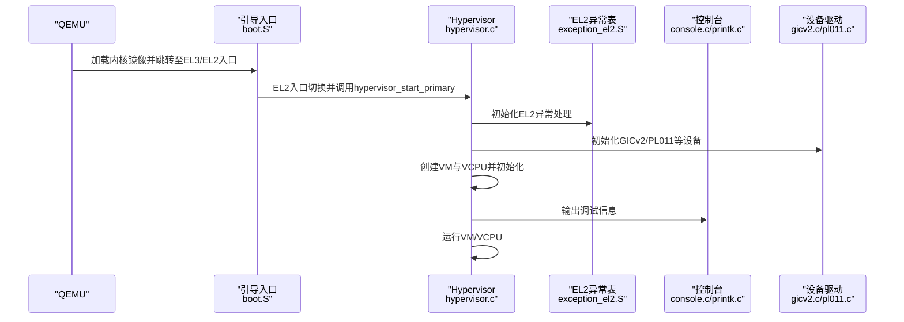
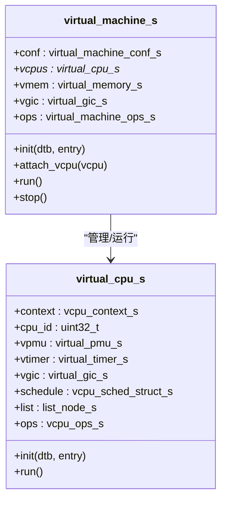
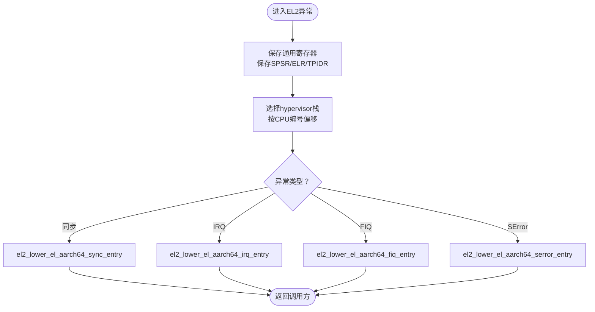
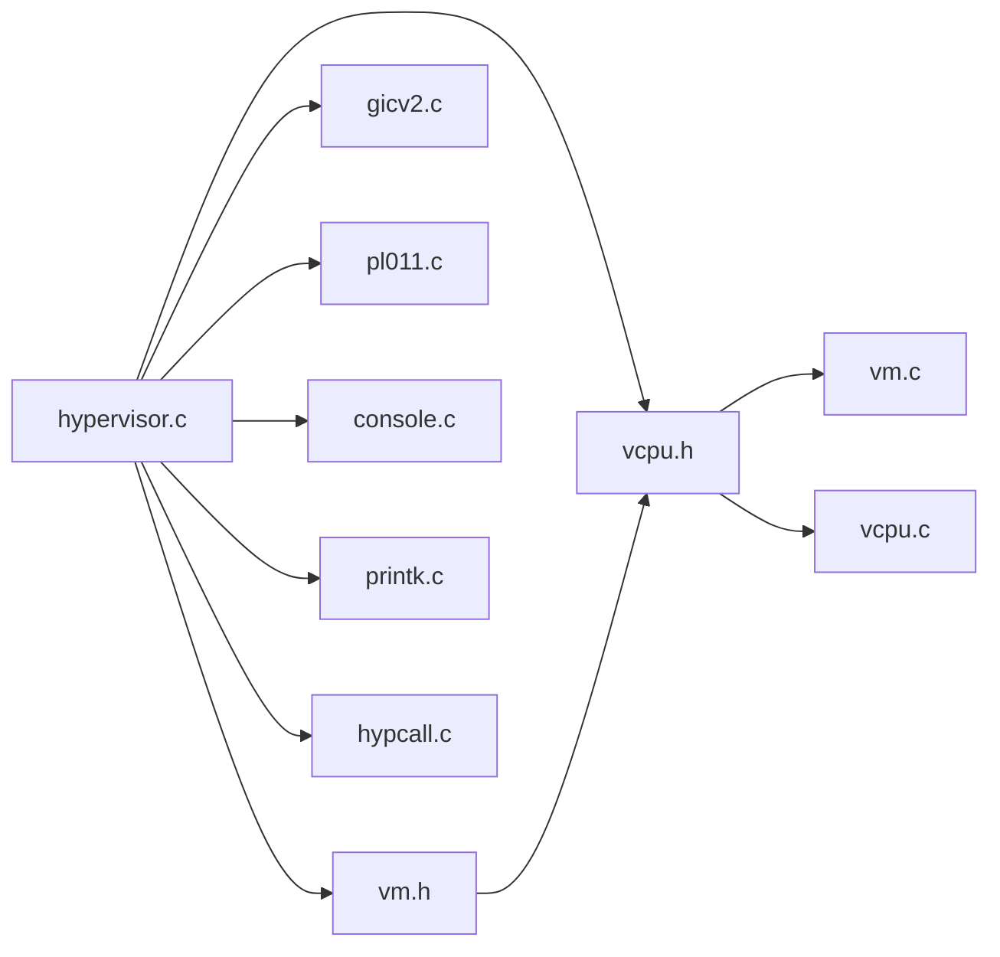

# QEMU虚拟化平台

<cite>
**本文引用的文件**
- [README.md](file://README.md)
- [virt.dts](file://platform/QemuVirt/dts/virt.dts)
- [qemu.virt.boot.run](file://scripts/qemu.virt.boot.run)
- [hypervisor.c](file://virt/hypervisor.c)
- [vm.h](file://virt/include/vm.h)
- [vcpu.h](file://virt/include/vcpu.h)
- [vm.c](file://virt/vm.c)
- [vcpu.c](file://virt/vcpu.c)
- [boot.S](file://virt/arch/arm64/boot/boot.S)
- [exception_el2.S](file://virt/arch/arm64/boot/exception_el2.S)
- [gicv2.c](file://virt/drivers/arm-gic/gicv2.c)
- [pl011.c](file://virt/drivers/arm-uart/pl011.c)
- [console.c](file://virt/console.c)
- [printk.c](file://virt/printk.c)
- [hypcall.c](file://virt/hypcall/hypcall.c)
</cite>

## 目录
1. [简介](#简介)
2. [项目结构](#项目结构)
3. [核心组件](#核心组件)
4. [架构总览](#架构总览)
5. [组件详解](#组件详解)
6. [依赖关系分析](#依赖关系分析)
7. [性能考量](#性能考量)
8. [故障排查指南](#故障排查指南)
9. [结论](#结论)
10. [附录](#附录)

## 简介
本文件面向TranquilOS在QEMU上的虚拟化平台，系统性阐述虚拟设备树定义、内存与外设仿真、启动流程、调试支持与性能优化，并给出虚拟平台与真实硬件的差异与适配策略。同时提供从虚拟机创建、启动到管理的完整指南，覆盖虚拟设备配置、网络与存储仿真实现要点，以及调试工具集成、性能分析与故障诊断方法，并提供扩展与定制建议。

## 项目结构
TranquilOS在QEMU上采用“宿主引导+虚拟化内核”的方式：QEMU以机器模型“virt”加载引导镜像，TranquilOS的hypervisor在EL2接管并初始化虚拟CPU、虚拟内存与中断控制器等子系统，随后进入虚拟机初始化与运行阶段。关键位置如下：
- 平台设备树：定义内存、外设、中断控制器、时钟等资源布局
- 启动脚本：指定QEMU参数（CPU、内存、设备、显示、串口等）
- 虚拟化内核：在EL2实现虚拟CPU、虚拟内存、虚拟GIC、虚拟UART等
- 设备驱动：GICv2、PL011等外设驱动通过设备树匹配与初始化

图表来源
- [boot.S](file://virt/arch/arm64/boot/boot.S#L6-L46)
- [hypervisor.c](file://virt/hypervisor.c#L101-L145)
- [vm.c](file://virt/vm.c#L55-L59)
- [vcpu.c](file://virt/vcpu.c#L60-L66)
- [gicv2.c](file://virt/drivers/arm-gic/gicv2.c#L225-L309)
- [pl011.c](file://virt/drivers/arm-uart/pl011.c#L31-L63)
- [console.c](file://virt/console.c#L11-L22)
- [printk.c](file://virt/printk.c#L6-L15)

章节来源
- [README.md](file://README.md#L35-L38)
- [virt.dts](file://platform/QemuVirt/dts/virt.dts#L1-L468)
- [qemu.virt.boot.run](file://scripts/qemu.virt.boot.run#L1-L19)

## 核心组件
- Hypervisor（EL2）：负责初始化设备树、中断管理、早期内存与页分配器、异常处理、HVC超调用分发，并创建与运行虚拟CPU与虚拟机
- 虚拟CPU（VCPU）：封装执行上下文、系统寄存器、调度节点，负责初始化入口地址、栈指针、SPSR等
- 虚拟机（VM）：管理虚拟内存、虚拟GIC、VCPU集合，提供初始化、运行、附加VCPU等操作
- 中断控制器（GICv2）：映射物理GIC寄存器，注册IRQ设备，设置使能、挂起、活跃、目标与优先级等
- 控制台与打印：通过console抽象输出日志，UART驱动负责字符写入
- HVC超调用：提供hypervisor初始化、VM/VCPU生命周期管理等接口

章节来源
- [hypervisor.c](file://virt/hypervisor.c#L47-L145)
- [vm.h](file://virt/include/vm.h#L19-L34)
- [vcpu.h](file://virt/include/vcpu.h#L26-L44)
- [vm.c](file://virt/vm.c#L5-L59)
- [vcpu.c](file://virt/vcpu.c#L19-L66)
- [gicv2.c](file://virt/drivers/arm-gic/gicv2.c#L16-L328)
- [pl011.c](file://virt/drivers/arm-uart/pl011.c#L10-L63)
- [console.c](file://virt/console.c#L11-L27)
- [printk.c](file://virt/printk.c#L6-L15)
- [hypcall.c](file://virt/hypcall/hypcall.c#L15-L25)

## 架构总览
下图展示从QEMU启动到TranquilOS Hypervisor接管的关键路径，以及EL2异常向量表、HVC处理与设备初始化的交互。

图表来源
- [boot.S](file://virt/arch/arm64/boot/boot.S#L6-L46)
- [exception_el2.S](file://virt/arch/arm64/boot/exception_el2.S#L64-L107)
- [hypervisor.c](file://virt/hypervisor.c#L101-L145)
- [console.c](file://virt/console.c#L11-L22)
- [printk.c](file://virt/printk.c#L6-L15)
- [gicv2.c](file://virt/drivers/arm-gic/gicv2.c#L225-L309)
- [pl011.c](file://virt/drivers/arm-uart/pl011.c#L31-L63)

## 组件详解

### 虚拟设备树与资源布局
- 内存区域：定义物理内存基址与大小，供hypervisor与内核使用
- 设备节点：包括GICv2、PL011、PCIe、Flash、GPIO按键、fw_cfg等，用于设备树匹配与驱动初始化
- 中断控制器：定义中断父节点、中断映射与范围，支撑虚拟GIC初始化
- 时钟与CPU：固定时钟源、多核CPU映射与启用方式（PSCI）

章节来源
- [virt.dts](file://platform/QemuVirt/dts/virt.dts#L60-L63)
- [virt.dts](file://platform/QemuVirt/dts/virt.dts#L363-L379)
- [virt.dts](file://platform/QemuVirt/dts/virt.dts#L350-L356)
- [virt.dts](file://platform/QemuVirt/dts/virt.dts#L326-L340)
- [virt.dts](file://platform/QemuVirt/dts/virt.dts#L381-L385)
- [virt.dts](file://platform/QemuVirt/dts/virt.dts#L416-L447)
- [virt.dts](file://platform/QemuVirt/dts/virt.dts#L455-L461)

### 启动流程与引导入口
- 引导入口根据CurrentEL判断当前特权级别，必要时通过ELR_EL3跳转至EL2入口
- EL2入口计算每个CPU的独立栈空间，清零BSS段，区分主/从CPU并调用对应启动函数
- 主CPU完成设备树初始化、IRQ管理器初始化、早期设备初始化、内存子系统初始化、异常处理初始化、HVC处理注册后，创建VM与VCPU并运行

章节来源
- [boot.S](file://virt/arch/arm64/boot/boot.S#L8-L46)
- [hypervisor.c](file://virt/hypervisor.c#L101-L145)

### 虚拟CPU与虚拟机
- 虚拟CPU：初始化执行上下文（通用寄存器、系统寄存器）、设置入口地址、栈指针与SPSR；提供默认运行逻辑
- 虚拟机：初始化虚拟内存、遍历并初始化VCPU、提供attach_vcpu、run、stop等操作

图表来源
- [vm.h](file://virt/include/vm.h#L19-L34)
- [vcpu.h](file://virt/include/vcpu.h#L26-L44)
- [vm.c](file://virt/vm.c#L5-L59)
- [vcpu.c](file://virt/vcpu.c#L19-L66)

章节来源
- [vm.h](file://virt/include/vm.h#L19-L34)
- [vcpu.h](file://virt/include/vcpu.h#L26-L44)
- [vm.c](file://virt/vm.c#L5-L59)
- [vcpu.c](file://virt/vcpu.c#L19-L66)

### 中断与异常处理（GICv2与EL2）
- GICv2驱动：解析设备树节点，映射GICD/GICC/GICH寄存器，初始化寄存器状态，注册IRQ设备到抽象层
- EL2异常向量表：保存/恢复寄存器、切换到hypervisor栈、分派不同类型的异常入口
- HVC处理：注册HVC处理器，按调用号分发hypervisor初始化、VM/VCPU生命周期管理等

图表来源
- [exception_el2.S](file://virt/arch/arm64/boot/exception_el2.S#L64-L107)

章节来源
- [gicv2.c](file://virt/drivers/arm-gic/gicv2.c#L225-L309)
- [exception_el2.S](file://virt/arch/arm64/boot/exception_el2.S#L64-L107)
- [hypcall.c](file://virt/hypcall/hypcall.c#L15-L25)

### 控制台与调试输出
- 控制台抽象：提供console_register/get/put接口，默认使用空实现，可被具体驱动替换
- 打印实现：格式化字符串后调用console_put输出
- UART驱动：匹配PL011设备，初始化波特率、控制寄存器，实现字符写入

章节来源
- [console.c](file://virt/console.c#L11-L27)
- [printk.c](file://virt/printk.c#L6-L15)
- [pl011.c](file://virt/drivers/arm-uart/pl011.c#L10-L63)

### QEMU启动参数与虚拟设备配置
- 机器模型：virt，GIC版本：v2
- CPU：cortex-a72
- 内存：2G
- 内核与DTB：分别指定引导镜像与设备树二进制文件
- 显示与输入：禁用vga，串口重定向到stdio，启用ramfb与虚拟键盘/鼠标
- 可选GPU：注释掉PCIe GPU设备以便简化或按需开启

章节来源
- [qemu.virt.boot.run](file://scripts/qemu.virt.boot.run#L2-L16)

## 依赖关系分析
- hypervisor.c依赖设备树、中断管理、内存子系统、异常处理、HVC处理与VM/VCPU模块
- VM/VCPU通过抽象接口协作，VCPU依赖页分配器与内存管理
- GICv2驱动依赖设备树解析、IRQ抽象层与系统寄存器访问宏
- UART驱动依赖设备树解析与控制台抽象
- 控制台与打印依赖UART驱动或占位实现

图表来源
- [hypervisor.c](file://virt/hypervisor.c#L1-L20)
- [vm.h](file://virt/include/vm.h#L1-L39)
- [vcpu.h](file://virt/include/vcpu.h#L1-L49)
- [vm.c](file://virt/vm.c#L1-L59)
- [vcpu.c](file://virt/vcpu.c#L1-L66)
- [gicv2.c](file://virt/drivers/arm-gic/gicv2.c#L1-L10)
- [pl011.c](file://virt/drivers/arm-uart/pl011.c#L1-L8)
- [console.c](file://virt/console.c#L1-L6)
- [printk.c](file://virt/printk.c#L1-L5)
- [hypcall.c](file://virt/hypcall/hypcall.c#L1-L8)

章节来源
- [hypervisor.c](file://virt/hypervisor.c#L1-L20)
- [vm.c](file://virt/vm.c#L1-L59)
- [vcpu.c](file://virt/vcpu.c#L1-L66)
- [gicv2.c](file://virt/drivers/arm-gic/gicv2.c#L1-L10)
- [pl011.c](file://virt/drivers/arm-uart/pl011.c#L1-L8)
- [console.c](file://virt/console.c#L1-L6)
- [printk.c](file://virt/printk.c#L1-L5)
- [hypcall.c](file://virt/hypcall/hypcall.c#L1-L8)

## 性能考量
- 内存映射与页分配：确保早期页分配器可用，避免频繁TLB抖动；合理规划虚拟内存布局
- 中断延迟：GICv2优先级与目标设置应结合负载特征；减少不必要的IRQ风暴
- EL2开销：HVC处理与异常分派应尽量轻量化；仅在必要时切换到hypervisor栈
- I/O路径：UART输出应避免阻塞式等待；可考虑缓冲与批量输出
- 调试输出：在高负载场景下降低日志频率，避免影响关键路径

## 故障排查指南
- 启动卡死于EL2入口
  - 检查引导入口是否正确识别CurrentEL并跳转至EL2
  - 确认每个CPU的独立栈已正确分配与清零
- 无控制台输出
  - 确认console已被UART驱动替换；检查PL011初始化是否成功
  - 验证串口重定向参数与显示设备配置
- 中断不生效
  - 检查GICv2寄存器初始化序列与中断使能状态
  - 确认设备树中中断映射与目标CPU设置正确
- HVC调用未响应
  - 确认hypcall注册成功且异常向量表正确
  - 在hypervisor_hvc_handler中增加日志定位调用号分支

章节来源
- [boot.S](file://virt/arch/arm64/boot/boot.S#L8-L46)
- [hypervisor.c](file://virt/hypervisor.c#L101-L145)
- [console.c](file://virt/console.c#L11-L27)
- [printk.c](file://virt/printk.c#L6-L15)
- [pl011.c](file://virt/drivers/arm-uart/pl011.c#L31-L63)
- [gicv2.c](file://virt/drivers/arm-gic/gicv2.c#L225-L309)
- [hypcall.c](file://virt/hypcall/hypcall.c#L15-L25)

## 结论
TranquilOS在QEMU上的虚拟化平台以设备树为纽带，结合EL2 Hypervisor完成VCPU/VM管理、GICv2与UART等外设驱动初始化，形成可运行的虚拟化内核。通过合理的资源布局、中断与异常处理、控制台输出与HVC机制，平台具备良好的可扩展性与可维护性。后续可在虚拟内存、计时器、PMU与PCIe/网卡/块设备等方面进一步完善，以贴近真实硬件并提升性能与兼容性。

## 附录

### 虚拟机创建、启动与管理指南
- 准备工作
  - 设置开发环境并编译引导镜像与内核镜像
  - 确保设备树二进制文件生成完成
- 启动步骤
  - 使用提供的启动脚本加载内核与DTB，配置CPU、内存、显示与串口
  - 观察控制台输出确认Hypervisor初始化与VM/VCPU运行
- 常见参数调整
  - CPU核数与拓扑：修改smp参数与设备树CPU映射
  - 内存大小：调整-m参数与设备树内存节点
  - 外设：增删virtio设备或PCIe设备节点

章节来源
- [README.md](file://README.md#L35-L38)
- [qemu.virt.boot.run](file://scripts/qemu.virt.boot.run#L2-L16)
- [virt.dts](file://platform/QemuVirt/dts/virt.dts#L381-L447)

### 虚拟设备配置与仿真要点
- GICv2：确保GICD/GICC/GICH映射正确，初始化寄存器状态，注册IRQ设备
- UART：设置波特率与控制寄存器，确保字符输出可用
- 存储与网络：可通过virtio-mmio设备接入块设备与网卡，按需在设备树中添加节点
- PCIe：设备树中已定义ECAM兼容的PCIe主机控制器，可连接PCIe设备

章节来源
- [gicv2.c](file://virt/drivers/arm-gic/gicv2.c#L225-L309)
- [pl011.c](file://virt/drivers/arm-uart/pl011.c#L31-L63)
- [virt.dts](file://platform/QemuVirt/dts/virt.dts#L326-L340)
- [virt.dts](file://platform/QemuVirt/dts/virt.dts#L73-L189)

### 调试工具集成与性能分析
- 调试工具
  - 使用QEMU的-S -s参数启用GDB调试；在hypervisor中增加日志点定位问题
- 性能分析
  - 关注EL2异常与HVC调用开销；评估GICv2中断路径延迟；优化控制台输出频率
- 故障诊断
  - 逐步验证设备树匹配、寄存器初始化、IRQ使能与目标设置；确认控制台输出链路

章节来源
- [qemu.virt.boot.run](file://scripts/qemu.virt.boot.run#L15-L16)
- [hypcall.c](file://virt/hypcall/hypcall.c#L15-L25)
- [gicv2.c](file://virt/drivers/arm-gic/gicv2.c#L225-L309)
- [printk.c](file://virt/printk.c#L6-L15)

### 与真实硬件的差异与适配策略
- 差异点
  - QEMU virt平台使用GICv2而非GICv3；时钟与中断映射由设备树描述
  - UART与PCIe等外设通过MMIO与设备树匹配，与真实SoC寄存器布局不同
- 适配策略
  - 以设备树为唯一事实来源，驱动通过compatible匹配与寄存器映射实现解耦
  - 对真实硬件差异部分（如GIC版本、时钟域）通过条件编译或抽象层屏蔽
  - 保持HVC接口稳定，便于在不同平台上复用虚拟化内核

章节来源
- [virt.dts](file://platform/QemuVirt/dts/virt.dts#L363-L379)
- [virt.dts](file://platform/QemuVirt/dts/virt.dts#L350-L356)
- [gicv2.c](file://virt/drivers/arm-gic/gicv2.c#L225-L309)