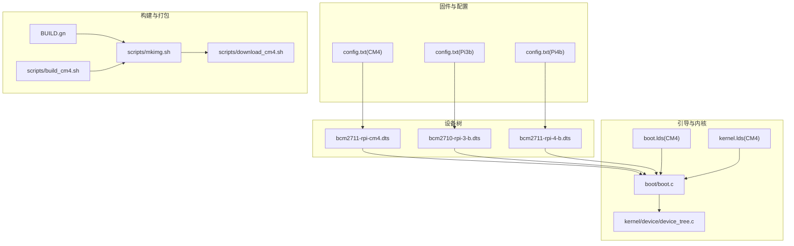
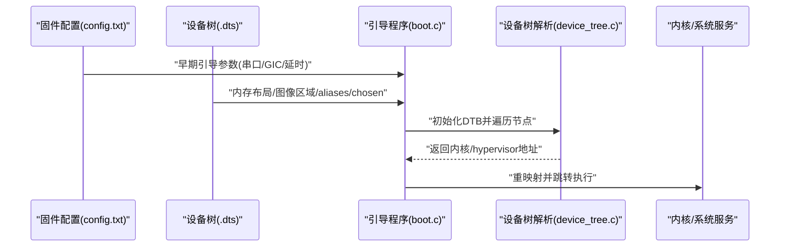
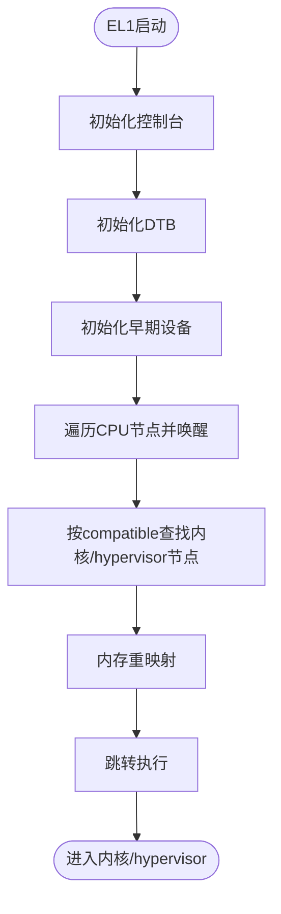
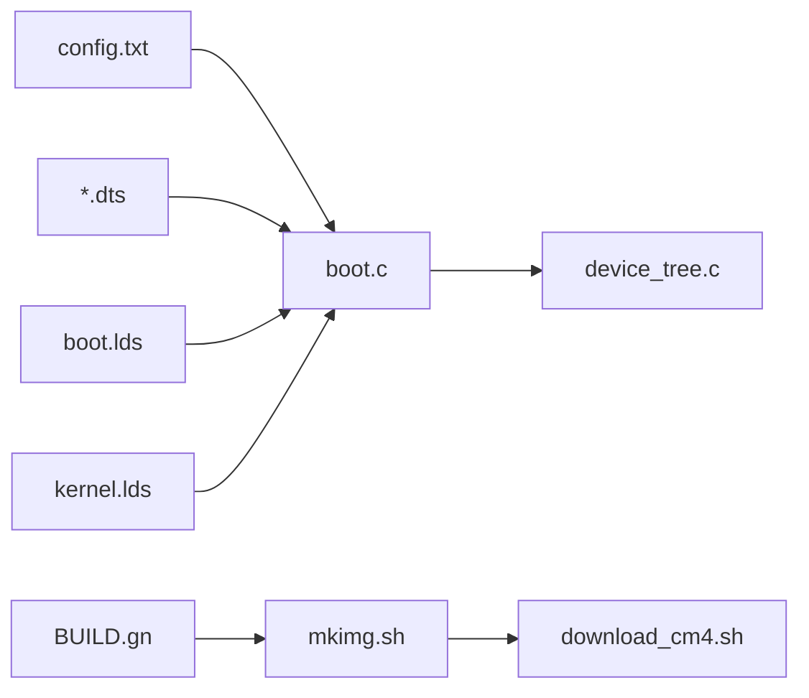

# 固件配置

<cite>
**本文引用的文件**
- [platform/CM4/firmware/config.txt](file://platform/CM4/firmware/config.txt)
- [platform/Pi3b/firmware/config.txt](file://platform/Pi3b/firmware/config.txt)
- [platform/Pi4b/firmware/config.txt](file://platform/Pi4b/firmware/config.txt)
- [boot/boot.c](file://boot/boot.c)
- [kernel/device/device_tree.c](file://kernel/device/device_tree.c)
- [platform/CM4/dts/bcm2711-rpi-cm4.dts](file://platform/CM4/dts/bcm2711-rpi-cm4.dts)
- [platform/Pi3b/dts/bcm2710-rpi-3-b.dts](file://platform/Pi3b/dts/bcm2710-rpi-3-b.dts)
- [platform/Pi4b/dts/bcm2711-rpi-4-b.dts](file://platform/Pi4b/dts/bcm2711-rpi-4-b.dts)
- [scripts/download_cm4.sh](file://scripts/download_cm4.sh)
- [scripts/build_cm4.sh](file://scripts/build_cm4.sh)
- [scripts/mkimg.sh](file://scripts/mkimg.sh)
- [BUILD.gn](file://BUILD.gn)
- [platform/CM4/linker/boot.lds](file://platform/CM4/linker/boot.lds)
- [platform/CM4/linker/kernel.lds](file://platform/CM4/linker/kernel.lds)
- [uapps/devmgr/drivers/virt/fw_cfg.c](file://uapps/devmgr/drivers/virt/fw_cfg.c)
</cite>

## 目录
1. [简介](#简介)
2. [项目结构](#项目结构)
3. [核心组件](#核心组件)
4. [架构总览](#架构总览)
5. [详细组件分析](#详细组件分析)
6. [依赖关系分析](#依赖关系分析)
7. [性能考虑](#性能考虑)
8. [故障排除指南](#故障排除指南)
9. [结论](#结论)
10. [附录](#附录)

## 简介
本文件面向TranquilOS在树莓派平台的固件配置与启动流程，聚焦于config.txt参数的作用与机制、启动参数与内核参数传递、设备树与硬件初始化、以及不同树莓派型号的固件差异与兼容性。文档同时提供参数调优建议、版本兼容性与升级注意事项，并给出可操作的故障排除与调试方法。

## 项目结构
TranquilOS在树莓派平台通过“固件配置 + 设备树 + 启动引导 + 内核”协同完成系统启动。关键位置如下：
- 平台固件配置：各平台的firmware目录下包含config.txt，用于控制早期引导行为（如启用串口、GIC、延迟等）。
- 设备树源文件：各平台dts目录下的.dts文件定义内存布局、外设、chosen节点（内核参数）等。
- 启动引导：boot子系统负责解析DTB、初始化关键设备、重映射并跳转到内核或hypervisor。
- 构建与打包：BUILD.gn与脚本负责生成镜像并写入SD卡/存储介质。

**图示来源**
- [platform/CM4/firmware/config.txt](file://platform/CM4/firmware/config.txt#L1-L14)
- [platform/Pi3b/firmware/config.txt](file://platform/Pi3b/firmware/config.txt#L1-L14)
- [platform/Pi4b/firmware/config.txt](file://platform/Pi4b/firmware/config.txt#L1-L14)
- [platform/CM4/dts/bcm2711-rpi-cm4.dts](file://platform/CM4/dts/bcm2711-rpi-cm4.dts#L83-L85)
- [platform/Pi3b/dts/bcm2710-rpi-3-b.dts](file://platform/Pi3b/dts/bcm2710-rpi-3-b.dts#L90-L94)
- [platform/Pi4b/dts/bcm2711-rpi-4-b.dts](file://platform/Pi4b/dts/bcm2711-rpi-4-b.dts#L111-L115)
- [boot/boot.c](file://boot/boot.c#L82-L107)
- [kernel/device/device_tree.c](file://kernel/device/device_tree.c#L10-L23)
- [platform/CM4/linker/boot.lds](file://platform/CM4/linker/boot.lds#L1-L73)
- [platform/CM4/linker/kernel.lds](file://platform/CM4/linker/kernel.lds#L1-L73)
- [BUILD.gn](file://BUILD.gn#L1-L9)
- [scripts/mkimg.sh](file://scripts/mkimg.sh#L26-L37)
- [scripts/download_cm4.sh](file://scripts/download_cm4.sh#L1-L27)
- [scripts/build_cm4.sh](file://scripts/build_cm4.sh#L1-L6)

**章节来源**
- [platform/CM4/firmware/config.txt](file://platform/CM4/firmware/config.txt#L1-L14)
- [platform/Pi3b/firmware/config.txt](file://platform/Pi3b/firmware/config.txt#L1-L14)
- [platform/Pi4b/firmware/config.txt](file://platform/Pi4b/firmware/config.txt#L1-L14)
- [platform/CM4/dts/bcm2711-rpi-cm4.dts](file://platform/CM4/dts/bcm2711-rpi-cm4.dts#L83-L85)
- [platform/Pi3b/dts/bcm2710-rpi-3-b.dts](file://platform/Pi3b/dts/bcm2710-rpi-3-b.dts#L90-L94)
- [platform/Pi4b/dts/bcm2711-rpi-4-b.dts](file://platform/Pi4b/dts/bcm2711-rpi-4-b.dts#L111-L115)
- [boot/boot.c](file://boot/boot.c#L82-L107)
- [kernel/device/device_tree.c](file://kernel/device/device_tree.c#L10-L23)
- [platform/CM4/linker/boot.lds](file://platform/CM4/linker/boot.lds#L1-L73)
- [platform/CM4/linker/kernel.lds](file://platform/CM4/linker/kernel.lds#L1-L73)
- [BUILD.gn](file://BUILD.gn#L1-L9)
- [scripts/mkimg.sh](file://scripts/mkimg.sh#L26-L37)
- [scripts/download_cm4.sh](file://scripts/download_cm4.sh#L1-L27)
- [scripts/build_cm4.sh](file://scripts/build_cm4.sh#L1-L6)

## 核心组件
- 固件配置文件（config.txt）
  - 统一在各平台firmware目录下，包含通用段与平台特定段，用于控制早期引导行为（如启用64位、串口、GIC、引导延时等）。
  - 示例参数：启用arm_64位、串口、GIC、引导延时等；平台段包含OTG模式、设备树覆盖、帧缓冲数量、内核镜像名等。
- 设备树（Device Tree）
  - 各平台dts定义内存保留区、图像区域、aliases、chosen节点（内核参数）、保留内存（含CMA）等。
  - chosen节点中的bootargs用于向内核传递启动参数。
- 引导程序（boot）
  - 初始化控制台、设备树、早期设备，进行内存重映射，查找内核或hypervisor节点并跳转执行。
- 构建与打包
  - BUILD.gn组织模块；mkimg.sh将多个镜像合并为单个引导镜像；download_cm4.sh将镜像写入SD卡分区。

**章节来源**
- [platform/CM4/firmware/config.txt](file://platform/CM4/firmware/config.txt#L1-L14)
- [platform/Pi3b/firmware/config.txt](file://platform/Pi3b/firmware/config.txt#L1-L14)
- [platform/Pi4b/firmware/config.txt](file://platform/Pi4b/firmware/config.txt#L1-L14)
- [platform/CM4/dts/bcm2711-rpi-cm4.dts](file://platform/CM4/dts/bcm2711-rpi-cm4.dts#L11-L35)
- [platform/Pi3b/dts/bcm2710-rpi-3-b.dts](file://platform/Pi3b/dts/bcm2710-rpi-3-b.dts#L17-L45)
- [platform/Pi4b/dts/bcm2711-rpi-4-b.dts](file://platform/Pi4b/dts/bcm2711-rpi-4-b.dts#L17-L45)
- [boot/boot.c](file://boot/boot.c#L82-L107)
- [kernel/device/device_tree.c](file://kernel/device/device_tree.c#L10-L23)
- [scripts/mkimg.sh](file://scripts/mkimg.sh#L26-L37)
- [scripts/download_cm4.sh](file://scripts/download_cm4.sh#L1-L27)

## 架构总览
下图展示从固件配置到内核执行的关键路径：config.txt影响引导行为，dts定义硬件与内核参数，boot解析DTB并跳转到内核或hypervisor。

**图示来源**
- [platform/CM4/firmware/config.txt](file://platform/CM4/firmware/config.txt#L1-L14)
- [platform/Pi3b/firmware/config.txt](file://platform/Pi3b/firmware/config.txt#L1-L14)
- [platform/Pi4b/firmware/config.txt](file://platform/Pi4b/firmware/config.txt#L1-L14)
- [platform/CM4/dts/bcm2711-rpi-cm4.dts](file://platform/CM4/dts/bcm2711-rpi-cm4.dts#L83-L85)
- [platform/Pi3b/dts/bcm2710-rpi-3-b.dts](file://platform/Pi3b/dts/bcm2710-rpi-3-b.dts#L90-L94)
- [platform/Pi4b/dts/bcm2711-rpi-4-b.dts](file://platform/Pi4b/dts/bcm2711-rpi-4-b.dts#L111-L115)
- [boot/boot.c](file://boot/boot.c#L82-L107)
- [kernel/device/device_tree.c](file://kernel/device/device_tree.c#L10-L23)

## 详细组件分析

### 固件配置文件（config.txt）参数详解
- 通用段（[all]）
  - arm_64bit=1：启用AArch64模式。
  - enable_uart=1：启用串口输出。
  - uart_2ndstage=1：第二阶段使用串口。
  - enable_gic=1：启用GIC中断控制器。
  - bootcode_delay=1：引导代码延时。
  - boot_delay=2：启动延时等级。
  - boot_delay_ms=1000：以毫秒计的启动延时。
- 平台段（[cm4]）
  - otg_mode=1：USB OTG工作模式。
  - dtoverlay=vc4-kms-v3d：启用VC4/KMS与V3D图形栈。
  - max_framebuffers=2：最大帧缓冲数。
  - kernel=boot.img：指定内核镜像名称。

这些参数直接影响早期引导阶段的硬件初始化顺序、串口输出可用性、中断分发与图形栈加载。

**章节来源**
- [platform/CM4/firmware/config.txt](file://platform/CM4/firmware/config.txt#L1-L14)
- [platform/Pi3b/firmware/config.txt](file://platform/Pi3b/firmware/config.txt#L1-L14)
- [platform/Pi4b/firmware/config.txt](file://platform/Pi4b/firmware/config.txt#L1-L14)

### 设备树与内核参数传递
- chosen节点
  - Pi3b：stdout-path、bootargs（如串口速率、UART数量、音频相关参数）。
  - Pi4b：stdout-path、bootargs（如串口速率、UART数量、音频相关参数）。
  - CM4：bootargs（如DMA池大小、UART数量、音频相关参数）。
- reserved-memory
  - 定义共享DMA池（CMA），供内核与驱动使用。
- 图像区域
  - 定义boot、hypervisor、kernel、systemd、ramdisk等镜像的物理地址范围，供引导程序定位。

这些内容由引导程序解析DTB后使用，确保内核与驱动获得正确的硬件描述与启动参数。

**章节来源**
- [platform/Pi3b/dts/bcm2710-rpi-3-b.dts](file://platform/Pi3b/dts/bcm2710-rpi-3-b.dts#L90-L94)
- [platform/Pi4b/dts/bcm2711-rpi-4-b.dts](file://platform/Pi4b/dts/bcm2711-rpi-4-b.dts#L111-L115)
- [platform/CM4/dts/bcm2711-rpi-cm4.dts](file://platform/CM4/dts/bcm2711-rpi-cm4.dts#L83-L85)
- [platform/CM4/dts/bcm2711-rpi-cm4.dts](file://platform/CM4/dts/bcm2711-rpi-cm4.dts#L117-L151)
- [platform/Pi3b/dts/bcm2710-rpi-3-b.dts](file://platform/Pi3b/dts/bcm2710-rpi-3-b.dts#L96-L109)
- [platform/Pi4b/dts/bcm2711-rpi-4-b.dts](file://platform/Pi4b/dts/bcm2711-rpi-4-b.dts#L117-L151)

### 引导程序与设备树交互
- 设备树初始化
  - 引导程序在EL1入口初始化DTB，打印调试信息，随后迭代CPU节点并通过PSCI唤醒其他CPU。
- 节点查找
  - 通过compatible字符串查找内核或hypervisor节点，获取其物理地址并跳转执行。
- 内存重映射
  - 在跳转前完成内存映射与重定位，保证内核虚拟地址空间正确。

**图示来源**
- [boot/boot.c](file://boot/boot.c#L82-L107)
- [kernel/device/device_tree.c](file://kernel/device/device_tree.c#L10-L23)

**章节来源**
- [boot/boot.c](file://boot/boot.c#L82-L107)
- [kernel/device/device_tree.c](file://kernel/device/device_tree.c#L10-L23)

### 不同树莓派型号的固件差异与兼容性
- Pi3b vs Pi4b vs CM4
  - 共同点：均启用arm_64bit、串口、GIC、引导延时等；chosen节点包含bootargs与stdout-path。
  - 差异点：CM4的chosen包含更多图形相关参数；Pi4b与CM4的aliases包含更多UART与I2C接口别名；CM4与Pi4b的reserved-memory包含nvram配置区域（状态通常禁用）。
- 兼容性建议
  - 使用相同通用段参数可提升跨平台一致性。
  - 平台特定段（如dtoverlay、otg_mode）应按目标硬件选择。

**章节来源**
- [platform/Pi3b/dts/bcm2710-rpi-3-b.dts](file://platform/Pi3b/dts/bcm2710-rpi-3-b.dts#L53-L94)
- [platform/Pi4b/dts/bcm2711-rpi-4-b.dts](file://platform/Pi4b/dts/bcm2711-rpi-4-b.dts#L53-L115)
- [platform/CM4/dts/bcm2711-rpi-cm4.dts](file://platform/CM4/dts/bcm2711-rpi-cm4.dts#L53-L85)
- [platform/CM4/dts/bcm2711-rpi-cm4.dts](file://platform/CM4/dts/bcm2711-rpi-cm4.dts#L132-L151)
- [platform/Pi4b/dts/bcm2711-rpi-4-b.dts](file://platform/Pi4b/dts/bcm2711-rpi-4-b.dts#L132-L151)

### 固件参数调优指南
- 性能优化
  - 适当增大coherent_pool与CMA大小（通过dts reserved-memory）以减少DMA碎片。
  - 合理设置boot_delay与boot_delay_ms，平衡启动速度与硬件稳定。
  - 仅启用必要dtoverlay，避免图形栈对启动时间与内存占用的影响。
- 稳定性改进
  - 确保enable_uart与uart_2ndstage一致，便于调试。
  - 在高负载场景下启用enable_gic并检查中断优先级与屏蔽策略。
  - 对CM4/Pi4b，确认otg_mode与USB外设匹配，避免电源与时钟问题。

**章节来源**
- [platform/CM4/dts/bcm2711-rpi-cm4.dts](file://platform/CM4/dts/bcm2711-rpi-cm4.dts#L117-L151)
- [platform/Pi3b/dts/bcm2710-rpi-3-b.dts](file://platform/Pi3b/dts/bcm2710-rpi-3-b.dts#L96-L109)
- [platform/Pi4b/dts/bcm2711-rpi-4-b.dts](file://platform/Pi4b/dts/bcm2711-rpi-4-b.dts#L117-L151)
- [platform/CM4/firmware/config.txt](file://platform/CM4/firmware/config.txt#L1-L14)

### 固件版本兼容性与升级注意事项
- 版本兼容性
  - arm_64bit、enable_uart、enable_gic等参数在各平台保持一致语义，可跨平台复用。
  - dtoverlay与otg_mode与具体硬件相关，升级时需验证目标平台支持情况。
- 升级步骤
  - 修改config.txt后，重新构建镜像并写盘。
  - 建议先在开发板上验证，再批量部署。

**章节来源**
- [platform/CM4/firmware/config.txt](file://platform/CM4/firmware/config.txt#L1-L14)
- [scripts/build_cm4.sh](file://scripts/build_cm4.sh#L1-L6)
- [scripts/mkimg.sh](file://scripts/mkimg.sh#L26-L37)
- [scripts/download_cm4.sh](file://scripts/download_cm4.sh#L1-L27)

### 设备树加载、内核参数传递与硬件初始化
- 设备树加载
  - 引导程序通过device_tree_init加载DTB，随后遍历节点以完成早期硬件初始化。
- 内核参数传递
  - chosen.bootargs在内核启动时生效，影响串口、DMA池、音频等子系统的初始化。
- 硬件初始化
  - 串口、GPIO、I2C、SPI、UART等外设在DTB中声明，引导程序根据aliases与节点属性进行初始化。

**章节来源**
- [kernel/device/device_tree.c](file://kernel/device/device_tree.c#L10-L23)
- [platform/Pi3b/dts/bcm2710-rpi-3-b.dts](file://platform/Pi3b/dts/bcm2710-rpi-3-b.dts#L53-L94)
- [platform/Pi4b/dts/bcm2711-rpi-4-b.dts](file://platform/Pi4b/dts/bcm2711-rpi-4-b.dts#L53-L115)
- [platform/CM4/dts/bcm2711-rpi-cm4.dts](file://platform/CM4/dts/bcm2711-rpi-cm4.dts#L53-L85)

## 依赖关系分析
- 模块耦合
  - boot依赖device_tree解析DTB并定位内核/hypervisor。
  - dts定义的内存布局与aliases直接影响引导程序的地址计算与设备初始化。
- 外部依赖
  - 构建系统（BUILD.gn）组织模块；mkimg.sh负责镜像合并；download_cm4.sh负责写盘。
- 链接器脚本
  - boot.lds与kernel.lds分别定义引导与内核的链接布局，确保地址对齐与栈空间预留。

**图示来源**
- [platform/CM4/firmware/config.txt](file://platform/CM4/firmware/config.txt#L1-L14)
- [platform/Pi3b/firmware/config.txt](file://platform/Pi3b/firmware/config.txt#L1-L14)
- [platform/Pi4b/firmware/config.txt](file://platform/Pi4b/firmware/config.txt#L1-L14)
- [platform/CM4/dts/bcm2711-rpi-cm4.dts](file://platform/CM4/dts/bcm2711-rpi-cm4.dts#L11-L35)
- [platform/Pi3b/dts/bcm2710-rpi-3-b.dts](file://platform/Pi3b/dts/bcm2710-rpi-3-b.dts#L17-L45)
- [platform/Pi4b/dts/bcm2711-rpi-4-b.dts](file://platform/Pi4b/dts/bcm2711-rpi-4-b.dts#L17-L45)
- [boot/boot.c](file://boot/boot.c#L82-L107)
- [kernel/device/device_tree.c](file://kernel/device/device_tree.c#L10-L23)
- [BUILD.gn](file://BUILD.gn#L1-L9)
- [scripts/mkimg.sh](file://scripts/mkimg.sh#L26-L37)
- [scripts/download_cm4.sh](file://scripts/download_cm4.sh#L1-L27)
- [platform/CM4/linker/boot.lds](file://platform/CM4/linker/boot.lds#L1-L73)
- [platform/CM4/linker/kernel.lds](file://platform/CM4/linker/kernel.lds#L1-L73)

**章节来源**
- [boot/boot.c](file://boot/boot.c#L82-L107)
- [kernel/device/device_tree.c](file://kernel/device/device_tree.c#L10-L23)
- [platform/CM4/linker/boot.lds](file://platform/CM4/linker/boot.lds#L1-L73)
- [platform/CM4/linker/kernel.lds](file://platform/CM4/linker/kernel.lds#L1-L73)
- [BUILD.gn](file://BUILD.gn#L1-L9)
- [scripts/mkimg.sh](file://scripts/mkimg.sh#L26-L37)
- [scripts/download_cm4.sh](file://scripts/download_cm4.sh#L1-L27)

## 性能考虑
- 启动时间
  - 降低boot_delay与boot_delay_ms可缩短启动时间，但需权衡硬件稳定。
  - 减少不必要的dtoverlay可显著缩短启动时间。
- 内存与DMA
  - 合理设置CMA大小，避免DMA分配失败导致的图形或网络异常。
- 中断与串口
  - 确保enable_gic与串口参数正确，以便在高负载下维持调试链路可用。

[本节为通用指导，无需列出具体文件来源]

## 故障排除指南
- 无法找到内核/hypervisor节点
  - 检查DTB是否正确加载；确认.dts中对应compatible字符串与boot地址范围。
- 串口无输出
  - 确认enable_uart与uart_2ndstage已启用；检查chosen.stdout-path与波特率。
- 启动卡顿或超时
  - 适当降低boot_delay与boot_delay_ms；检查是否有过多dtoverlay。
- 图形显示异常
  - 确认dtoverlay与otg_mode与硬件匹配；检查CMA大小与帧缓冲数量。
- 镜像写盘失败
  - 使用download_cm4.sh脚本确保镜像写入正确分区；确认SD卡容量与挂载状态。

**章节来源**
- [boot/boot.c](file://boot/boot.c#L34-L45)
- [kernel/device/device_tree.c](file://kernel/device/device_tree.c#L25-L37)
- [platform/CM4/firmware/config.txt](file://platform/CM4/firmware/config.txt#L1-L14)
- [platform/Pi3b/dts/bcm2710-rpi-3-b.dts](file://platform/Pi3b/dts/bcm2710-rpi-3-b.dts#L90-L94)
- [platform/Pi4b/dts/bcm2711-rpi-4-b.dts](file://platform/Pi4b/dts/bcm2711-rpi-4-b.dts#L111-L115)
- [scripts/download_cm4.sh](file://scripts/download_cm4.sh#L1-L27)

## 结论
TranquilOS在树莓派平台的固件配置围绕config.txt与dts展开，通过chosen节点向内核传递启动参数，引导程序负责解析DTB并完成硬件初始化与跳转。不同平台在图形栈、UART与别名等方面存在差异，建议统一通用段参数并按平台特性调整平台段参数。通过合理设置启动延时、DMA池与设备树覆盖，可在性能与稳定性之间取得良好平衡。

[本节为总结性内容，无需列出具体文件来源]

## 附录
- 关键参数速查
  - arm_64bit：启用AArch64。
  - enable_uart/uart_2ndstage：启用串口与第二阶段串口。
  - enable_gic：启用GIC。
  - bootcode_delay/boot_delay/boot_delay_ms：引导延时。
  - dtoverlay/otg_mode/max_framebuffers/kernel：平台特定图形与内核镜像名。
- 参考实现路径
  - 固件配置：platform/*/firmware/config.txt
  - 设备树：platform/*/dts/*.dts
  - 引导程序：boot/boot.c
  - 设备树解析：kernel/device/device_tree.c
  - 构建与打包：BUILD.gn、scripts/mkimg.sh、scripts/download_cm4.sh、scripts/build_cm4.sh
  - 链接器脚本：platform/*/linker/*.lds

**章节来源**
- [platform/CM4/firmware/config.txt](file://platform/CM4/firmware/config.txt#L1-L14)
- [platform/Pi3b/firmware/config.txt](file://platform/Pi3b/firmware/config.txt#L1-L14)
- [platform/Pi4b/firmware/config.txt](file://platform/Pi4b/firmware/config.txt#L1-L14)
- [platform/CM4/dts/bcm2711-rpi-cm4.dts](file://platform/CM4/dts/bcm2711-rpi-cm4.dts#L83-L85)
- [platform/Pi3b/dts/bcm2710-rpi-3-b.dts](file://platform/Pi3b/dts/bcm2710-rpi-3-b.dts#L90-L94)
- [platform/Pi4b/dts/bcm2711-rpi-4-b.dts](file://platform/Pi4b/dts/bcm2711-rpi-4-b.dts#L111-L115)
- [boot/boot.c](file://boot/boot.c#L82-L107)
- [kernel/device/device_tree.c](file://kernel/device/device_tree.c#L10-L23)
- [BUILD.gn](file://BUILD.gn#L1-L9)
- [scripts/mkimg.sh](file://scripts/mkimg.sh#L26-L37)
- [scripts/download_cm4.sh](file://scripts/download_cm4.sh#L1-L27)
- [scripts/build_cm4.sh](file://scripts/build_cm4.sh#L1-L6)
- [platform/CM4/linker/boot.lds](file://platform/CM4/linker/boot.lds#L1-L73)
- [platform/CM4/linker/kernel.lds](file://platform/CM4/linker/kernel.lds#L1-L73)