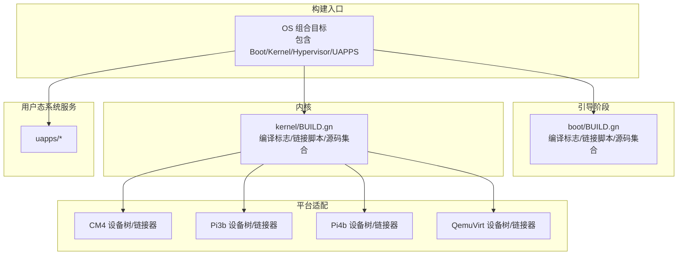
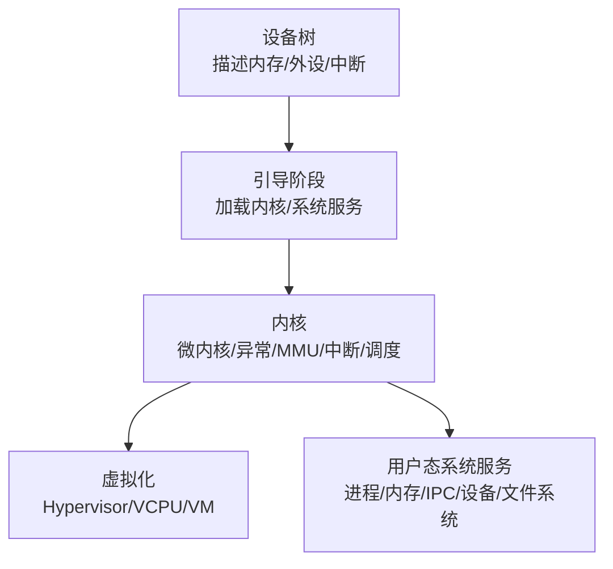
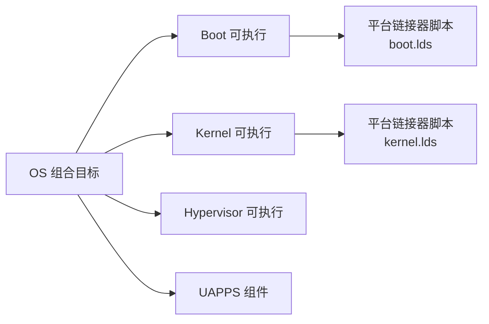

# 平台适配

<cite>
**本文引用的文件**
- [README.md](file://README.md)
- [BUILD.gn](file://BUILD.gn)
- [boot/BUILD.gn](file://boot/BUILD.gn)
- [kernel/BUILD.gn](file://kernel/BUILD.gn)
- [platform/CM4/linker/kernel.lds](file://platform/CM4/linker/kernel.lds)
- [platform/Pi3b/linker/kernel.lds](file://platform/Pi3b/linker/kernel.lds)
- [platform/Pi4b/linker/kernel.lds](file://platform/Pi4b/linker/kernel.lds)
- [platform/QemuVirt/linker/kernel.lds](file://platform/QemuVirt/linker/kernel.lds)
- [platform/CM4/dts/bcm2711-rpi-cm4.dts](file://platform/CM4/dts/bcm2711-rpi-cm4.dts)
- [platform/Pi3b/dts/bcm2835-rpi-3-b.dts](file://platform/Pi3b/dts/bcm2835-rpi-3-b.dts)
- [platform/Pi4b/dts/bcm2711-rpi-4-b.dts](file://platform/Pi4b/dts/bcm2711-rpi-4-b.dts)
- [platform/QemuVirt/dts/virt.dts](file://platform/QemuVirt/dts/virt.dts)
- [scripts/build_cm4.sh](file://scripts/build_cm4.sh)
- [scripts/build_pi3b.sh](file://scripts/build_pi3b.sh)
- [scripts/build_pi4b.sh](file://scripts/build_pi4b.sh)
- [scripts/build_qemu.sh](file://scripts/build_qemu.sh)
- [scripts/mkimg.sh](file://scripts/mkimg.sh)
- [run_board_cm4.sh](file://run_board_cm4.sh)
- [run_qemu_pi3b.sh](file://run_qemu_pi3b.sh)
- [run_qemu_pi4b.sh](file://run_qemu_pi4b.sh)
- [run_qemu_virt.sh](file://run_qemu_virt.sh)
</cite>

## 目录
1. [简介](#简介)
2. [项目结构](#项目结构)
3. [核心组件](#核心组件)
4. [架构总览](#架构总览)
5. [详细组件分析](#详细组件分析)
6. [依赖关系分析](#依赖关系分析)
7. [性能考量](#性能考量)
8. [故障排查指南](#故障排查指南)
9. [结论](#结论)
10. [附录](#附录)

## 简介
本文件面向TranquilOS平台的平台适配与系统集成，覆盖树莓派系列（CM4、Pi3b、Pi4b）与QEMU虚拟化平台的设备树配置、链接器脚本、平台特定构建选项与运行流程。文档同时提供新硬件平台适配的完整指南，包括硬件抽象层设计、驱动移植建议、平台间差异与兼容性考虑、性能优化与调试技巧，以及系统镜像制作与烧录工具的使用方法。

## 项目结构
TranquilOS采用分层组织：引导阶段（boot）、内核（kernel）、用户态系统服务（uapps）、虚拟化（virt）、平台适配（platform）、通用库（ulibs）、工具链与脚本（scripts）。构建系统基于GN/Ninja，通过平台参数选择目标硬件与链接器布局。

图示来源
- [BUILD.gn](file://BUILD.gn#L1-L9)
- [boot/BUILD.gn](file://boot/BUILD.gn#L1-L66)
- [kernel/BUILD.gn](file://kernel/BUILD.gn#L1-L135)

章节来源
- [README.md](file://README.md#L1-L42)
- [BUILD.gn](file://BUILD.gn#L1-L9)

## 核心组件
- 引导阶段（Boot）
  - 包含启动汇编、早期内存管理、设备树解析、UART控制、PSCI电源管理等。
  - 链接器脚本由平台决定，统一入口地址与段落布局。
- 内核（Kernel）
  - 微内核入口、异常处理、MMU/页表、TLB、中断/GIC、定时器、IPC/Upcall、能力模型、调度器、缓存、PMU、DMA、GPU等。
  - 源码按模块组织，构建时按平台注入链接器脚本。
- 用户态系统服务（UAPPS）
  - 进程/线程管理、内存管理、IPC管理、设备管理、文件系统、网络、Shell等。
- 虚拟化（Virt）
  - Hypervisor、VCPU、VM、中断虚拟化、页表二级映射等。

章节来源
- [boot/BUILD.gn](file://boot/BUILD.gn#L26-L66)
- [kernel/BUILD.gn](file://kernel/BUILD.gn#L25-L135)

## 架构总览
下图展示TranquilOS在不同平台上的运行时布局：设备树描述物理/虚拟资源，引导阶段加载内核与系统服务，内核初始化硬件抽象层并建立虚拟化环境（如适用），随后启动用户态系统服务。

图示来源
- [platform/CM4/dts/bcm2711-rpi-cm4.dts](file://platform/CM4/dts/bcm2711-rpi-cm4.dts#L1-L120)
- [platform/Pi3b/dts/bcm2835-rpi-3-b.dts](file://platform/Pi3b/dts/bcm2835-rpi-3-b.dts#L1-L120)
- [platform/Pi4b/dts/bcm2711-rpi-4-b.dts](file://platform/Pi4b/dts/bcm2711-rpi-4-b.dts#L1-L120)
- [platform/QemuVirt/dts/virt.dts](file://platform/QemuVirt/dts/virt.dts#L1-L120)

## 详细组件分析

### 设备树配置（Device Tree）
- CM4（Compute Module 4）
  - 定义内存保留区、保留区域（Linux CMA/NVRAM）、SOC总线、GPIO、UART、I2C/SPI/I2S、MMC/SD、Mailbox、Watchdog、定时器、热区等。
  - 关键节点包括soc、gpio、serial、mmc、mailbox、timer、thermal-zones等。
- Pi3b（Raspberry Pi 3 Model B）
  - 类似布局，但针对BCM2835/2837 SoC特性，包含蓝牙、I2S、SPI、GPIO复用配置等。
- Pi4b（Raspberry Pi 4 Model B）
  - 针对BCM2711，扩展了更多GPIO、UART、I2C、SPI、RGMII、PCIe等。
- QemuVirt（QEMU虚拟化）
  - 定义虚拟CPU、GIC、PL011/PL031、PCIe、fw_cfg、virtio_mmio等，模拟ARM Cortex-A72平台。

章节来源
- [platform/CM4/dts/bcm2711-rpi-cm4.dts](file://platform/CM4/dts/bcm2711-rpi-cm4.dts#L1-L200)
- [platform/Pi3b/dts/bcm2835-rpi-3-b.dts](file://platform/Pi3b/dts/bcm2835-rpi-3-b.dts#L1-L200)
- [platform/Pi4b/dts/bcm2711-rpi-4-b.dts](file://platform/Pi4b/dts/bcm2711-rpi-4-b.dts#L1-L200)
- [platform/QemuVirt/dts/virt.dts](file://platform/QemuVirt/dts/virt.dts#L1-L200)

### 链接器脚本与平台布局
- 共同点
  - 统一入口符号，按.text/.rodata/.data/.bss顺序排列，随后分配内核栈与引导内存起始位置。
- 平台差异
  - 基址不同：CM4/Pi3b/Pi4b为高基址，QemuVirt为更高基址以避免与真实SoC地址冲突。
  - 初始化调用段（initcall）按优先级分层组织，确保模块初始化顺序。
- 使用方式
  - 构建时通过GN传入平台参数，自动选择对应链接器脚本。

章节来源
- [platform/CM4/linker/kernel.lds](file://platform/CM4/linker/kernel.lds#L1-L73)
- [platform/Pi3b/linker/kernel.lds](file://platform/Pi3b/linker/kernel.lds#L1-L73)
- [platform/Pi4b/linker/kernel.lds](file://platform/Pi4b/linker/kernel.lds#L1-L73)
- [platform/QemuVirt/linker/kernel.lds](file://platform/QemuVirt/linker/kernel.lds#L1-L73)

### 构建与运行脚本
- 构建脚本
  - 通过GN生成输出目录并指定platform参数，随后Ninja编译。
  - 示例：CM4、Pi3b、Pi4b、QEMU分别有独立构建脚本。
- 运行脚本
  - 提供在真实板卡或QEMU上运行的便捷脚本，简化启动流程。

章节来源
- [scripts/build_cm4.sh](file://scripts/build_cm4.sh#L1-L6)
- [scripts/build_pi3b.sh](file://scripts/build_pi3b.sh#L1-L6)
- [scripts/build_pi4b.sh](file://scripts/build_pi4b.sh#L1-L6)
- [scripts/build_qemu.sh](file://scripts/build_qemu.sh#L1-L6)
- [run_board_cm4.sh](file://run_board_cm4.sh#L1-L200)
- [run_qemu_pi3b.sh](file://run_qemu_pi3b.sh#L1-L200)
- [run_qemu_pi4b.sh](file://run_qemu_pi4b.sh#L1-L200)
- [run_qemu_virt.sh](file://run_qemu_virt.sh#L1-L200)

### 平台间差异与兼容性
- 设备树差异
  - 不同SoC的外设基址、中断号、时钟配置不同；树莓派系列与QEMU虚拟化差异较大。
- 内核入口与链接器布局
  - 基址不同导致地址空间隔离，需确保设备树与链接器脚本一致。
- 外设驱动
  - UART/GPIO/I2C/SPI等驱动在不同SoC上寄存器与中断号不同，需按平台适配。
- 虚拟化支持
  - QEMU平台默认启用虚拟化路径，树莓派平台主要为裸机运行。

章节来源
- [platform/CM4/dts/bcm2711-rpi-cm4.dts](file://platform/CM4/dts/bcm2711-rpi-cm4.dts#L1-L120)
- [platform/Pi3b/dts/bcm2835-rpi-3-b.dts](file://platform/Pi3b/dts/bcm2835-rpi-3-b.dts#L1-L120)
- [platform/Pi4b/dts/bcm2711-rpi-4-b.dts](file://platform/Pi4b/dts/bcm2711-rpi-4-b.dts#L1-L120)
- [platform/QemuVirt/dts/virt.dts](file://platform/QemuVirt/dts/virt.dts#L1-L120)

### 新硬件平台适配指南
- 硬件抽象层（HAL）设计
  - 将SoC差异封装为统一接口：时钟/中断/内存/串口/GPIO/定时器/看门狗/PMU等。
  - 通过宏与条件编译屏蔽平台差异，保持上层逻辑稳定。
- 设备树编写
  - 明确内存布局、保留区、外设节点、中断控制器、时钟源、别名等。
  - 与链接器脚本基址保持一致，避免地址冲突。
- 驱动移植
  - 分离平台无关与平台相关的部分；平台相关部分以头文件/源文件形式按平台组织。
  - 遵循能力模型与IPC机制，避免直接访问底层硬件。
- 构建与链接
  - 新增平台目录，提供对应的链接器脚本与设备树。
  - 在构建系统中新增平台参数分支，确保编译标志、包含路径、链接脚本正确注入。
- 调试与验证
  - 利用内核打印、KMSG缓冲、串口输出进行调试。
  - 在QEMU上先行验证，再迁移至真实硬件。

（本节为概念性指导，不直接分析具体文件）

## 依赖关系分析
构建系统的依赖关系如下：OS组合目标依赖Boot、Kernel、Hypervisor与UAPPS；内核与引导阶段均通过GN注入平台参数，选择对应链接器脚本与源码集合。

图示来源
- [BUILD.gn](file://BUILD.gn#L1-L9)
- [boot/BUILD.gn](file://boot/BUILD.gn#L26-L40)
- [kernel/BUILD.gn](file://kernel/BUILD.gn#L25-L37)

章节来源
- [BUILD.gn](file://BUILD.gn#L1-L9)
- [boot/BUILD.gn](file://boot/BUILD.gn#L26-L40)
- [kernel/BUILD.gn](file://kernel/BUILD.gn#L25-L37)

## 性能考量
- 编译优化
  - 使用合适的CPU指令集与优化等级，减少不必要的标准库与头文件开销。
- 内存布局
  - 合理设置CMA大小与保留区，避免碎片化；确保内核栈与引导内存充足。
- 中断与定时器
  - 选择高精度计时源，合理配置GIC与中断优先级，降低抖动。
- 缓存与TLB
  - 启用合适的缓存策略，避免频繁TLB刷新；注意跨平台缓存一致性。
- 虚拟化性能
  - 在QEMU平台启用合适后端与设备直通，减少虚拟化开销。

（本节提供通用建议，不直接分析具体文件）

## 故障排查指南
- 构建失败
  - 检查GN参数是否正确传递平台名称；确认链接器脚本路径与源码集合是否匹配。
- 启动无输出
  - 检查设备树中的stdout-path与串口配置；确认UART驱动与引脚复用正确。
- 内存访问异常
  - 对照设备树保留区与链接器脚本基址，避免重叠或越界。
- QEMU运行问题
  - 确认虚拟设备节点与驱动匹配；检查PCIe/fw_cfg/virtio配置。
- 日志与调试
  - 使用内核打印与KMSG缓冲定位问题；必要时开启更详细的调试信息。

章节来源
- [platform/QemuVirt/dts/virt.dts](file://platform/QemuVirt/dts/virt.dts#L463-L467)

## 结论
TranquilOS通过清晰的分层架构与可插拔的平台适配机制，实现了对树莓派系列与QEMU虚拟化平台的有效支持。遵循本文提供的设备树、链接器脚本、构建与运行流程，结合HAL设计与驱动移植建议，可以高效完成新硬件平台的适配，并在性能与稳定性之间取得平衡。

## 附录

### 系统镜像制作与烧录工具
- 镜像制作
  - 使用仓库提供的脚本生成系统镜像，包含引导、内核、系统服务与根文件系统。
- 烧录与部署
  - 树莓派平台：将镜像写入SD卡，插入设备启动。
  - QEMU平台：通过运行脚本启动虚拟机，进行开发与测试。

章节来源
- [scripts/mkimg.sh](file://scripts/mkimg.sh#L1-L200)