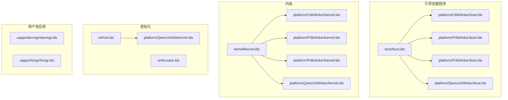
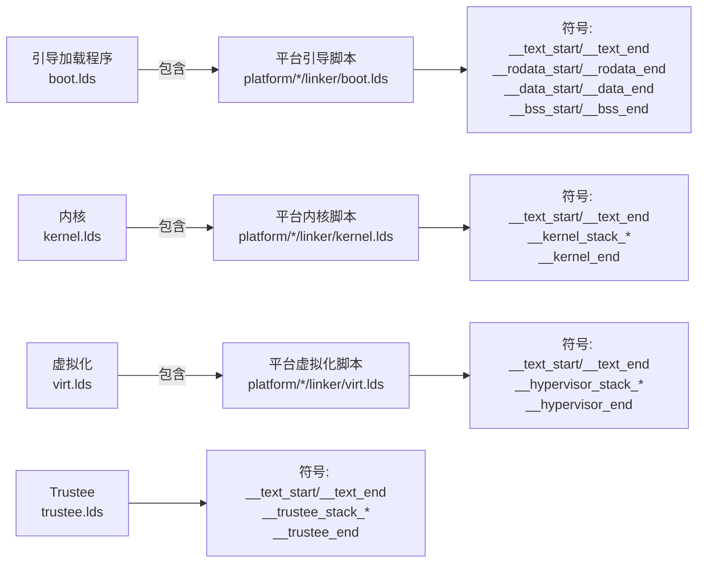
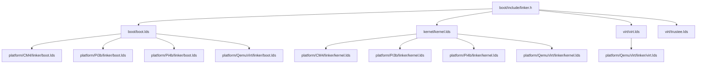

# 平台链接器脚本

<cite>
**本文引用的文件**
- [boot/boot.lds](file://boot/boot.lds)
- [kernel/kernel.lds](file://kernel/kernel.lds)
- [virt/virt.lds](file://virt/virt.lds)
- [platform/CM4/linker/boot.lds](file://platform/CM4/linker/boot.lds)
- [platform/CM4/linker/kernel.lds](file://platform/CM4/linker/kernel.lds)
- [platform/CM4/linker/virt.lds](file://platform/CM4/linker/virt.lds)
- [platform/Pi3b/linker/boot.lds](file://platform/Pi3b/linker/boot.lds)
- [platform/Pi3b/linker/kernel.lds](file://platform/Pi3b/linker/kernel.lds)
- [platform/Pi3b/linker/virt.lds](file://platform/Pi3b/linker/virt.lds)
- [platform/Pi4b/linker/boot.lds](file://platform/Pi4b/linker/boot.lds)
- [platform/Pi4b/linker/kernel.lds](file://platform/Pi4b/linker/kernel.lds)
- [platform/Pi4b/linker/virt.lds](file://platform/Pi4b/linker/virt.lds)
- [platform/QemuVirt/linker/boot.lds](file://platform/QemuVirt/linker/boot.lds)
- [platform/QemuVirt/linker/kernel.lds](file://platform/QemuVirt/linker/kernel.lds)
- [platform/QemuVirt/linker/virt.lds](file://platform/QemuVirt/linker/virt.lds)
- [boot/include/linker.h](file://boot/include/linker.h)
- [virt/trustee.lds](file://virt/trustee.lds)
- [uapps/devmgr/devmgr.lds](file://uapps/devmgr/devmgr.lds)
- [uapps/fsmgr/fsmgr.lds](file://uapps/fsmgr/fsmgr.lds)
</cite>

## 目录
1. [引言](#引言)
2. [项目结构](#项目结构)
3. [核心组件](#核心组件)
4. [架构总览](#架构总览)
5. [详细组件分析](#详细组件分析)
6. [依赖关系分析](#依赖关系分析)
7. [性能考量](#性能考量)
8. [故障排查指南](#故障排查指南)
9. [结论](#结论)
10. [附录](#附录)

## 引言
本文件系统性梳理TranquilOS在ARM64平台上针对不同目标（引导加载程序、内核、虚拟化组件）的链接器脚本配置与差异，重点覆盖：
- 内存布局定义与地址空间映射
- 符号链接规则与段对齐策略
- 各平台（树莓派系列、QEMU虚拟机）的内存区域划分与栈分配
- 重定位机制与地址转换策略
- 链接过程分析、符号解析与段对齐实现细节
- 平台特定的链接优化与性能考虑
- 链接器脚本调试与问题排查方法

## 项目结构
TranquilOS的链接器脚本按“目标类型+平台”组织，形成清晰的层次：
- 引导加载程序：顶层与平台级两套脚本，分别用于通用引导阶段与特定平台的最终布局
- 内核：顶层与平台级两套脚本，分别用于通用内核与特定平台的最终布局
- 虚拟化组件：hypervisor、trustee等独立脚本，对应EL2/EL3运行态
- 用户态应用：设备管理器、文件系统管理器等，采用更紧凑的布局与对齐策略

图表来源
- [boot/boot.lds](file://boot/boot.lds#L1-L73)
- [kernel/kernel.lds](file://kernel/kernel.lds#L1-L73)
- [virt/virt.lds](file://virt/virt.lds#L1-L70)
- [platform/CM4/linker/boot.lds](file://platform/CM4/linker/boot.lds#L1-L73)
- [platform/CM4/linker/kernel.lds](file://platform/CM4/linker/kernel.lds#L1-L73)
- [platform/CM4/linker/virt.lds](file://platform/CM4/linker/virt.lds#L1-L70)
- [platform/Pi3b/linker/boot.lds](file://platform/Pi3b/linker/boot.lds#L1-L77)
- [platform/Pi3b/linker/kernel.lds](file://platform/Pi3b/linker/kernel.lds#L1-L73)
- [platform/Pi3b/linker/virt.lds](file://platform/Pi3b/linker/virt.lds#L1-L70)
- [platform/Pi4b/linker/boot.lds](file://platform/Pi4b/linker/boot.lds#L1-L83)
- [platform/Pi4b/linker/kernel.lds](file://platform/Pi4b/linker/kernel.lds#L1-L73)
- [platform/Pi4b/linker/virt.lds](file://platform/Pi4b/linker/virt.lds#L1-L76)
- [platform/QemuVirt/linker/boot.lds](file://platform/QemuVirt/linker/boot.lds#L1-L76)
- [platform/QemuVirt/linker/kernel.lds](file://platform/QemuVirt/linker/kernel.lds#L1-L73)
- [platform/QemuVirt/linker/virt.lds](file://platform/QemuVirt/linker/virt.lds#L1-L70)
- [virt/trustee.lds](file://virt/trustee.lds#L1-L68)
- [uapps/devmgr/devmgr.lds](file://uapps/devmgr/devmgr.lds#L1-L41)
- [uapps/fsmgr/fsmgr.lds](file://uapps/fsmgr/fsmgr.lds#L1-L41)

章节来源
- [boot/boot.lds](file://boot/boot.lds#L1-L73)
- [kernel/kernel.lds](file://kernel/kernel.lds#L1-L73)
- [virt/virt.lds](file://virt/virt.lds#L1-L70)

## 核心组件
- 引导加载程序链接脚本：负责将引导阶段代码、只读数据、初始化数据、BSS段以及多级初始化调用序列按顺序排列，并在末尾预留EL1/EL2/EL3栈空间与引导内存起始位置。
- 内核链接脚本：与引导脚本类似，但包含异常处理入口段与更高的起始地址，确保内核在物理地址空间中的可执行性与对齐要求。
- 虚拟化链接脚本：针对hypervisor与trustee，使用EL2异常入口段，分配hypervisor栈与结束标记；trustee脚本则独立于平台脚本，面向安全启动场景。
- 用户态应用链接脚本：强调文本段后紧跟专用初始化段与对齐策略，便于模块化初始化。

章节来源
- [boot/boot.lds](file://boot/boot.lds#L1-L73)
- [kernel/kernel.lds](file://kernel/kernel.lds#L1-L73)
- [virt/virt.lds](file://virt/virt.lds#L1-L70)
- [virt/trustee.lds](file://virt/trustee.lds#L1-L68)
- [uapps/devmgr/devmgr.lds](file://uapps/devmgr/devmgr.lds#L1-L41)
- [uapps/fsmgr/fsmgr.lds](file://uapps/fsmgr/fsmgr.lds#L1-L41)

## 架构总览
下图展示不同目标与平台之间的链接器脚本关系及关键符号：

图表来源
- [boot/boot.lds](file://boot/boot.lds#L1-L73)
- [platform/CM4/linker/boot.lds](file://platform/CM4/linker/boot.lds#L1-L73)
- [platform/Pi3b/linker/boot.lds](file://platform/Pi3b/linker/boot.lds#L1-L77)
- [platform/Pi4b/linker/boot.lds](file://platform/Pi4b/linker/boot.lds#L1-L83)
- [platform/QemuVirt/linker/boot.lds](file://platform/QemuVirt/linker/boot.lds#L1-L76)
- [kernel/kernel.lds](file://kernel/kernel.lds#L1-L73)
- [platform/CM4/linker/kernel.lds](file://platform/CM4/linker/kernel.lds#L1-L73)
- [platform/Pi3b/linker/kernel.lds](file://platform/Pi3b/linker/kernel.lds#L1-L73)
- [platform/Pi4b/linker/kernel.lds](file://platform/Pi4b/linker/kernel.lds#L1-L73)
- [platform/QemuVirt/linker/kernel.lds](file://platform/QemuVirt/linker/kernel.lds#L1-L73)
- [virt/virt.lds](file://virt/virt.lds#L1-L70)
- [platform/QemuVirt/linker/virt.lds](file://platform/QemuVirt/linker/virt.lds#L1-L70)
- [virt/trustee.lds](file://virt/trustee.lds#L1-L68)

## 详细组件分析

### 引导加载程序链接脚本（boot.lds）
- 入口与起始地址：设置入口点，随后在固定地址处开始放置代码段。
- 段落组织：按“.text.boot”、“.text.initcall_lvX.init”、“.text*”顺序排列，保证初始化链路的正确性；只读数据、数据段、BSS段依次对齐至页边界。
- 栈与内存预留：在BSS之后预留EL1/EL2栈空间，并在末尾标记“__boot_end”与“__bootmem_start”，用于后续内存管理。
- 平台差异：Pi3b/Pi4b平台额外包含EL3栈段，以支持多异常级别运行环境。

章节来源
- [boot/boot.lds](file://boot/boot.lds#L1-L73)
- [platform/Pi3b/linker/boot.lds](file://platform/Pi3b/linker/boot.lds#L1-L77)
- [platform/Pi4b/linker/boot.lds](file://platform/Pi4b/linker/boot.lds#L1-L83)
- [platform/QemuVirt/linker/boot.lds](file://platform/QemuVirt/linker/boot.lds#L1-L76)

### 内核链接脚本（kernel.lds）
- 起始地址与异常入口：在较高物理地址处放置内核镜像，包含异常处理入口段，确保从EL1进入时的正确跳转。
- 初始化链路：与引导脚本一致的initcall分层组织，但增加到更多层级，满足内核复杂初始化需求。
- 栈与结束标记：在BSS之后预留内核栈空间，并在末尾标记“__kernel_end”与“__bootmem_start”。

章节来源
- [kernel/kernel.lds](file://kernel/kernel.lds#L1-L73)
- [platform/CM4/linker/kernel.lds](file://platform/CM4/linker/kernel.lds#L1-L73)
- [platform/Pi3b/linker/kernel.lds](file://platform/Pi3b/linker/kernel.lds#L1-L73)
- [platform/Pi4b/linker/kernel.lds](file://platform/Pi4b/linker/kernel.lds#L1-L73)
- [platform/QemuVirt/linker/kernel.lds](file://platform/QemuVirt/linker/kernel.lds#L1-L73)

### 虚拟化链接脚本（virt.lds 与 trustee.lds）
- hypervisor（virt.lds）：在平台脚本基础上，使用EL2异常入口段，预留hypervisor栈空间与结束标记。
- trusteed（trustee.lds）：独立脚本，面向安全启动场景，同样包含文本、只读数据、数据、BSS段与栈段。

章节来源
- [virt/virt.lds](file://virt/virt.lds#L1-L70)
- [platform/QemuVirt/linker/virt.lds](file://platform/QemuVirt/linker/virt.lds#L1-L70)
- [virt/trustee.lds](file://virt/trustee.lds#L1-L68)

### 用户态应用链接脚本（devmgr.lds, fsmgr.lds）
- 特殊初始化段：在文本段后插入专用初始化段（如“.dev.init”），并进行对齐，便于模块化初始化。
- 基本布局：与引导/内核脚本一致的段组织与对齐策略，但规模更小，适合用户态进程。

章节来源
- [uapps/devmgr/devmgr.lds](file://uapps/devmgr/devmgr.lds#L1-L41)
- [uapps/fsmgr/fsmgr.lds](file://uapps/fsmgr/fsmgr.lds#L1-L41)

### 平台特定差异（树莓派与QEMU）
- 地址空间映射：不同平台在起始地址、异常入口段与栈分配上存在差异，以适配硬件特性与运行环境。
- 多EL栈：Pi3b/Pi4b平台在引导阶段引入EL3栈，以支持多异常级别运行。
- 虚拟化入口：QEMU平台的虚拟化脚本与hypervisor入口地址与内核脚本保持一致的对齐与布局策略。

章节来源
- [platform/CM4/linker/boot.lds](file://platform/CM4/linker/boot.lds#L1-L73)
- [platform/Pi3b/linker/boot.lds](file://platform/Pi3b/linker/boot.lds#L1-L77)
- [platform/Pi4b/linker/boot.lds](file://platform/Pi4b/linker/boot.lds#L1-L83)
- [platform/QemuVirt/linker/boot.lds](file://platform/QemuVirt/linker/boot.lds#L1-L76)
- [platform/CM4/linker/kernel.lds](file://platform/CM4/linker/kernel.lds#L1-L73)
- [platform/Pi3b/linker/kernel.lds](file://platform/Pi3b/linker/kernel.lds#L1-L73)
- [platform/Pi4b/linker/kernel.lds](file://platform/Pi4b/linker/kernel.lds#L1-L73)
- [platform/QemuVirt/linker/kernel.lds](file://platform/QemuVirt/linker/kernel.lds#L1-L73)
- [platform/CM4/linker/virt.lds](file://platform/CM4/linker/virt.lds#L1-L70)
- [platform/Pi3b/linker/virt.lds](file://platform/Pi3b/linker/virt.lds#L1-L70)
- [platform/Pi4b/linker/virt.lds](file://platform/Pi4b/linker/virt.lds#L1-L76)
- [platform/QemuVirt/linker/virt.lds](file://platform/QemuVirt/linker/virt.lds#L1-L70)

## 依赖关系分析
- 包含关系：平台脚本通常包含顶层脚本的公共片段，通过统一的符号命名与对齐策略实现一致性。
- 头文件依赖：引导相关脚本包含公共头文件，以共享地址常量与宏定义。
- 符号导出：各脚本通过统一的符号命名（如“__*_start/_end”）导出段边界，供运行时或后续阶段使用。

图表来源
- [boot/include/linker.h](file://boot/include/linker.h#L1-L6)
- [boot/boot.lds](file://boot/boot.lds#L1-L73)
- [kernel/kernel.lds](file://kernel/kernel.lds#L1-L73)
- [virt/virt.lds](file://virt/virt.lds#L1-L70)
- [virt/trustee.lds](file://virt/trustee.lds#L1-L68)
- [platform/CM4/linker/boot.lds](file://platform/CM4/linker/boot.lds#L1-L73)
- [platform/Pi3b/linker/boot.lds](file://platform/Pi3b/linker/boot.lds#L1-L77)
- [platform/Pi4b/linker/boot.lds](file://platform/Pi4b/linker/boot.lds#L1-L83)
- [platform/QemuVirt/linker/boot.lds](file://platform/QemuVirt/linker/boot.lds#L1-L76)
- [platform/CM4/linker/kernel.lds](file://platform/CM4/linker/kernel.lds#L1-L73)
- [platform/Pi3b/linker/kernel.lds](file://platform/Pi3b/linker/kernel.lds#L1-L73)
- [platform/Pi4b/linker/kernel.lds](file://platform/Pi4b/linker/kernel.lds#L1-L73)
- [platform/QemuVirt/linker/kernel.lds](file://platform/QemuVirt/linker/kernel.lds#L1-L73)
- [platform/QemuVirt/linker/virt.lds](file://platform/QemuVirt/linker/virt.lds#L1-L70)

章节来源
- [boot/include/linker.h](file://boot/include/linker.h#L1-L6)
- [boot/boot.lds](file://boot/boot.lds#L1-L73)
- [kernel/kernel.lds](file://kernel/kernel.lds#L1-L73)
- [virt/virt.lds](file://virt/virt.lds#L1-L70)
- [virt/trustee.lds](file://virt/trustee.lds#L1-L68)

## 性能考量
- 对齐策略：所有段均按页大小对齐，减少TLB抖动并提升内存访问效率。
- 初始化链路：通过分层initcall组织，降低启动时的全局锁竞争与初始化开销。
- 栈空间预留：为不同异常级别预留独立栈，避免上下文切换时的栈溢出与性能回退。
- 平台适配：不同平台的起始地址与入口段选择，确保在目标硬件上的最佳运行时性能。

## 故障排查指南
- 符号未定义或重复定义：检查各脚本是否正确导出/导入“__*_start/_end”等符号，避免链接阶段报错。
- 地址冲突：确认各段起始地址与对齐策略，避免跨段重叠或越界。
- 栈溢出：根据平台差异核对EL1/EL2/EL3栈的起始与结束标记，必要时增大栈大小。
- 调试技巧：使用nm/objdump查看符号表与段布局，结合脚本中的符号标记定位问题。

## 结论
TranquilOS的链接器脚本通过统一的段组织、对齐策略与符号命名，实现了引导加载程序、内核与虚拟化组件在不同平台间的可移植性与一致性。平台特定的差异主要体现在起始地址、异常入口段与多EL栈的配置上。遵循本文档的分析与建议，可高效完成链接脚本的修改与定制，并在实际部署中获得稳定的性能表现。

## 附录
- 修改与定制指南
  - 自定义内存布局：调整起始地址与段顺序，确保符合目标平台的物理地址空间规划。
  - 特殊需求适配：如需新增初始化段或调整对齐粒度，参考用户态应用脚本的模式进行扩展。
  - 平台优化：针对不同平台的硬件特性（如多EL栈、异常入口）进行微调，以获得最佳运行时性能。
- 链接过程与符号解析
  - 链接器按脚本顺序收集段内容，依据对齐规则分配地址，生成符号表与重定位信息。
  - 运行时通过“__*_start/_end”符号定位各段边界，完成内存初始化与上下文切换准备。