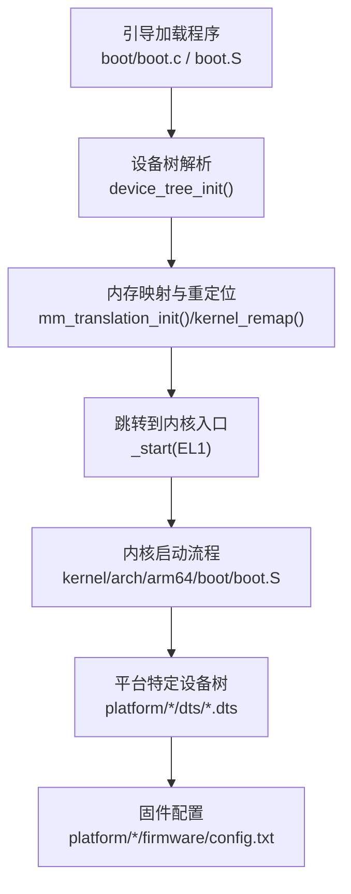
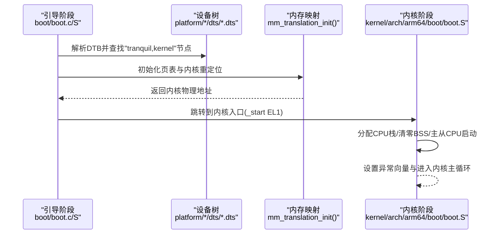
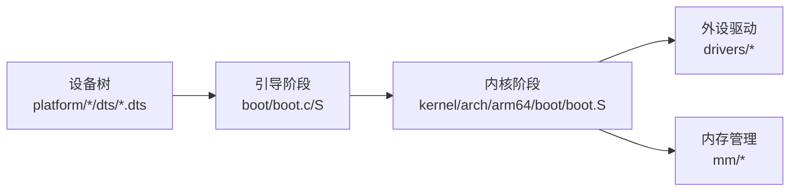

# 树莓派平台

<cite>
**本文引用的文件**
- [bcm2710-rpi-3-b.dts](file://platform/Pi3b/dts/bcm2710-rpi-3-b.dts)
- [bcm2711-rpi-4-b.dts](file://platform/Pi4b/dts/bcm2711-rpi-4-b.dts)
- [bcm2711-rpi-cm4.dts](file://platform/CM4/dts/bcm2711-rpi-cm4.dts)
- [boot.lds（通用）](file://boot/boot.lds)
- [kernel.lds（通用）](file://kernel/kernel.lds)
- [kernel.lds（Pi3b）](file://platform/Pi3b/linker/kernel.lds)
- [kernel.lds（Pi4b）](file://platform/Pi4b/linker/kernel.lds)
- [kernel.lds（CM4）](file://platform/CM4/linker/kernel.lds)
- [linker.h](file://boot/include/linker.h)
- [common.h（架构通用）](file://kernel/include/arch/arm64/common.h)
- [boot.c](file://boot/boot.c)
- [boot.S（引导）](file://boot/arch/arm64/boot.S)
- [boot.S（内核）](file://kernel/arch/arm64/boot/boot.S)
- [config.txt（Pi3b 固件）](file://platform/Pi3b/firmware/config.txt)
- [config.txt（Pi4b 固件）](file://platform/Pi4b/firmware/config.txt)
</cite>

## 目录
1. [引言](#引言)
2. [项目结构](#项目结构)
3. [核心组件](#核心组件)
4. [架构总览](#架构总览)
5. [详细组件分析](#详细组件分析)
6. [依赖关系分析](#依赖关系分析)
7. [性能考量](#性能考量)
8. [故障排除指南](#故障排除指南)
9. [结论](#结论)
10. [附录](#附录)

## 引言
本文件面向TranquilOS在树莓派平台的适配与使用，聚焦于Pi3b、Pi4b与CM4 Compute Module三类硬件平台的设备树配置、链接器脚本差异、内存管理策略、启动流程与硬件初始化序列，并给出设备树覆盖、GPIO与外设驱动适配方法、平台差异与兼容性考量、以及调试与排障建议。目标是帮助开发者在不同树莓派硬件上稳定运行TranquilOS。

## 项目结构
TranquilOS采用按“平台/型号”分层组织的设备树与链接器资源，同时保留通用引导与内核启动代码，确保跨平台一致性与可维护性。

- 平台目录组织
  - platform/Pi3b：Pi3b设备树、固件配置与链接器脚本
  - platform/Pi4b：Pi4b设备树、固件配置与链接器脚本
  - platform/CM4：CM4设备树、固件配置与链接器脚本
- 通用引导与内核
  - boot：引导阶段代码与链接器脚本
  - kernel：内核阶段代码与链接器脚本
- 设备树覆盖与固件
  - 各平台firmware目录下的config.txt用于启用必要外设与显示输出

图表来源
- [boot.c](file://boot/boot.c#L82-L107)
- [boot.S（引导）](file://boot/arch/arm64/boot.S#L7-L104)
- [boot.S（内核）](file://kernel/arch/arm64/boot/boot.S#L6-L57)

章节来源
- [boot.c](file://boot/boot.c#L1-L176)
- [boot.S（引导）](file://boot/arch/arm64/boot.S#L1-L115)
- [boot.S（内核）](file://kernel/arch/arm64/boot/boot.S#L1-L68)

## 核心组件
- 设备树（Device Tree）
  - Pi3b：基于bcm2837，定义内存布局、外设节点、中断与时钟等
  - Pi4b：基于bcm2711，支持更丰富的外设与DMA映射
  - CM4：Compute Module版本，GPIO地址与部分外设别名调整
- 链接器脚本
  - 通用引导与内核脚本定义了EL1/EL2/EL3栈位置与段落布局
  - 平台级kernel.lds保持一致的内核加载基址，确保跨平台一致性
- 引导与内核启动
  - 引导阶段负责解析DTB、初始化早期设备、建立页表并跳转至内核
  - 内核阶段负责CPU栈分配、清零BSS、主从CPU启动与异常向量设置

章节来源
- [bcm2710-rpi-3-b.dts](file://platform/Pi3b/dts/bcm2710-rpi-3-b.dts#L1-L120)
- [bcm2711-rpi-4-b.dts](file://platform/Pi4b/dts/bcm2711-rpi-4-b.dts#L1-L120)
- [bcm2711-rpi-cm4.dts](file://platform/CM4/dts/bcm2711-rpi-cm4.dts#L1-L120)
- [boot.lds（通用）](file://boot/boot.lds#L1-L73)
- [kernel.lds（通用）](file://kernel/kernel.lds#L1-L73)
- [kernel.lds（Pi3b）](file://platform/Pi3b/linker/kernel.lds#L1-L73)
- [kernel.lds（Pi4b）](file://platform/Pi4b/linker/kernel.lds#L1-L73)
- [kernel.lds（CM4）](file://platform/CM4/linker/kernel.lds#L1-L73)
- [boot.c](file://boot/boot.c#L34-L107)
- [boot.S（引导）](file://boot/arch/arm64/boot.S#L78-L104)
- [boot.S（内核）](file://kernel/arch/arm64/boot/boot.S#L32-L57)

## 架构总览
下图展示从引导到内核的跨EL启动路径与关键职责：

图表来源
- [boot.c](file://boot/boot.c#L34-L107)
- [boot.S（引导）](file://boot/arch/arm64/boot.S#L78-L104)
- [boot.S（内核）](file://kernel/arch/arm64/boot/boot.S#L32-L57)

章节来源
- [boot.c](file://boot/boot.c#L34-L107)
- [boot.S（引导）](file://boot/arch/arm64/boot.S#L78-L104)
- [boot.S（内核）](file://kernel/arch/arm64/boot/boot.S#L32-L57)

## 详细组件分析

### 设备树配置与关键节点
- 公共头部与兼容性
  - Pi3b与Pi4b均以“raspberrypi,*+brcm,*”作为compatible字符串，便于内核识别
  - CM4同样兼容bcm2711，但GPIO基地址与部分外设别名调整
- 内存布局与预留区
  - Pi3b：定义dtb、boot、hypervisor、kernel、systemd、ramdisk、kmsg_buf等区域
  - Pi4b/CM4：保留区包含CMA与NVRAM，且alloc-ranges明确分配范围
- 外设映射与中断
  - Pi3b：GPIO、UART、I2C、SPI、MMC、I2S、Mailbox等节点齐全
  - Pi4b/CM4：新增更多UART/I2C/SPI实例、RGMII/MII接口、PCIe/SCB等
  - 中断控制器与GIC配置在Pi4b/CM4中更复杂，支持多中断线
- 时钟与热管理
  - Pi3b：cprman时钟源与thermal-zone定义
  - Pi4b/CM4：更丰富的时钟域与热阈值参数

章节来源
- [bcm2710-rpi-3-b.dts](file://platform/Pi3b/dts/bcm2710-rpi-3-b.dts#L1-L120)
- [bcm2710-rpi-3-b.dts](file://platform/Pi3b/dts/bcm2710-rpi-3-b.dts#L136-L200)
- [bcm2710-rpi-3-b.dts](file://platform/Pi3b/dts/bcm2710-rpi-3-b.dts#L593-L646)
- [bcm2711-rpi-4-b.dts](file://platform/Pi4b/dts/bcm2711-rpi-4-b.dts#L1-L120)
- [bcm2711-rpi-4-b.dts](file://platform/Pi4b/dts/bcm2711-rpi-4-b.dts#L117-L152)
- [bcm2711-rpi-4-b.dts](file://platform/Pi4b/dts/bcm2711-rpi-4-b.dts#L178-L229)
- [bcm2711-rpi-cm4.dts](file://platform/CM4/dts/bcm2711-rpi-cm4.dts#L1-L120)
- [bcm2711-rpi-cm4.dts](file://platform/CM4/dts/bcm2711-rpi-cm4.dts#L87-L112)
- [bcm2711-rpi-cm4.dts](file://platform/CM4/dts/bcm2711-rpi-cm4.dts#L124-L177)

### 链接器脚本与内存布局
- 通用布局
  - 引导脚本boot.lds：定义EL1/EL2栈起始与对齐，确保安全栈空间
  - 内核脚本kernel.lds：统一的内核加载基址，保证跨平台一致性
- 平台差异
  - Pi3b/Pi4b/CM4的kernel.lds保持一致，避免因平台差异导致的加载冲突
- 引导地址约定
  - 引导器入口地址由linker.h定义，确保与固件加载地址一致

章节来源
- [boot.lds（通用）](file://boot/boot.lds#L1-L73)
- [kernel.lds（通用）](file://kernel/kernel.lds#L1-L73)
- [kernel.lds（Pi3b）](file://platform/Pi3b/linker/kernel.lds#L1-L73)
- [kernel.lds（Pi4b）](file://platform/Pi4b/linker/kernel.lds#L1-L73)
- [kernel.lds（CM4）](file://platform/CM4/linker/kernel.lds#L1-L73)
- [linker.h](file://boot/include/linker.h#L1-L6)

### 启动流程与硬件初始化
- 引导阶段（EL3/EL2/EL1）
  - boot.S根据CurrentEL选择分支，为主从CPU分配独立栈
  - el1_start_primary负责控制台复位、DTB初始化、早期设备、内存子系统与CPU唤醒
  - 支持通过PSCI启用次CPU
- 内核阶段（EL1）
  - kernel/arch/arm64/boot/boot.S为每个CPU分配栈并清零BSS，随后进入内核主流程

章节来源
- [boot.S（引导）](file://boot/arch/arm64/boot.S#L7-L104)
- [boot.c](file://boot/boot.c#L82-L107)
- [boot.c](file://boot/boot.c#L68-L102)
- [boot.S（内核）](file://kernel/arch/arm64/boot/boot.S#L32-L57)
- [common.h（架构通用）](file://kernel/include/arch/arm64/common.h#L1-L6)

### GPIO与外设驱动适配
- GPIO配置
  - Pi3b：大量GPIO复用配置（spi/i2c/pcm/uart等），通过pinctrl命名与函数选择实现
  - Pi4b/CM4：扩展更多I2C/SPI实例与RGMI/MII接口，提供更灵活的外设复用
- UART与蓝牙
  - Pi3b：PL011与辅助UART均可配置，蓝牙模块通过子节点启用
  - Pi4b/CM4：UART数量增加，辅助UART仍可用作蓝牙
- 存储与音频
  - SD/MMC节点在Pi3b中已启用，Pi4b/CM4提供额外MMC与eMMC2bus
  - 音频通过Mailbox与Audio子系统配合

章节来源
- [bcm2710-rpi-3-b.dts](file://platform/Pi3b/dts/bcm2710-rpi-3-b.dts#L178-L200)
- [bcm2710-rpi-3-b.dts](file://platform/Pi3b/dts/bcm2710-rpi-3-b.dts#L593-L646)
- [bcm2711-rpi-4-b.dts](file://platform/Pi4b/dts/bcm2711-rpi-4-b.dts#L220-L230)
- [bcm2711-rpi-4-b.dts](file://platform/Pi4b/dts/bcm2711-rpi-4-b.dts#L718-L768)
- [bcm2711-rpi-cm4.dts](file://platform/CM4/dts/bcm2711-rpi-cm4.dts#L166-L177)
- [bcm2711-rpi-cm4.dts](file://platform/CM4/dts/bcm2711-rpi-cm4.dts#L768-L800)

### 设备树覆盖与固件配置
- 设备树覆盖
  - 可通过overlay机制动态修改GPIO功能、时钟频率或外设使能状态
  - 建议在开发阶段先验证基础覆盖，再逐步引入复杂配置
- 固件配置
  - config.txt启用ARM 64位、串口、GIC、延迟与帧缓冲等关键选项
  - CM4模式下可启用OTG与图形叠加

章节来源
- [config.txt（Pi3b 固件）](file://platform/Pi3b/firmware/config.txt#L1-L14)
- [config.txt（Pi4b 固件）](file://platform/Pi4b/firmware/config.txt#L1-L14)

## 依赖关系分析
- 组件耦合
  - 引导阶段强依赖DTB中的“tranquil,*”节点，确保正确解析内核镜像位置
  - 内核阶段依赖通用的异常向量与栈分配策略
- 外设依赖
  - UART/蓝牙/存储/音频等外设均通过设备树节点声明，驱动按需启用
- 平台差异
  - Pi4b/CM4在中断与DMA方面更复杂，需在驱动层关注多中断线与DMA通道

图表来源
- [bcm2711-rpi-4-b.dts](file://platform/Pi4b/dts/bcm2711-rpi-4-b.dts#L178-L229)
- [boot.c](file://boot/boot.c#L82-L107)
- [boot.S（引导）](file://boot/arch/arm64/boot.S#L78-L104)
- [boot.S（内核）](file://kernel/arch/arm64/boot/boot.S#L32-L57)

章节来源
- [bcm2711-rpi-4-b.dts](file://platform/Pi4b/dts/bcm2711-rpi-4-b.dts#L178-L229)
- [boot.c](file://boot/boot.c#L82-L107)
- [boot.S（引导）](file://boot/arch/arm64/boot.S#L78-L104)
- [boot.S（内核）](file://kernel/arch/arm64/boot/boot.S#L32-L57)

## 性能考量
- 内存管理
  - 使用CMA预留区保障DMA连续内存；Pi4b/CM4的CMA分配范围明确，有助于大容量显存/网络DMA
- 中断与调度
  - Pi4b/CM4多中断线设计需在驱动中合理绑定IRQ，避免抖动与丢失
- 时钟与热管理
  - 合理设置cprman与thermal-zone参数，避免降频与过热
- 启动时间
  - 减少DTB节点数量与冗余外设启用，缩短引导阶段扫描时间

## 故障排除指南
- 无法找到内核节点
  - 现象：引导阶段提示未找到“tranquil,kernel”
  - 排查：确认DTB中相应节点存在且reg有效
- 串口无输出
  - 现象：无控制台输出
  - 排查：检查config.txt的串口与GIC启用项；确认设备树aliases指向正确UART
- CPU无法唤醒
  - 现象：仅主CPU运行
  - 排查：确认DTB中CPU节点enable-method为psci；检查PSCI服务是否可用
- 显示异常
  - 现象：屏幕黑屏或分辨率异常
  - 排查：检查overlay与帧缓冲配置；确认GPIO复用与显示时序匹配
- DMA失败
  - 现象：网络/存储读写错误
  - 排查：确认CMA大小与分配范围；检查DMA通道绑定与中断状态

章节来源
- [boot.c](file://boot/boot.c#L34-L45)
- [config.txt（Pi3b 固件）](file://platform/Pi3b/firmware/config.txt#L1-L14)
- [config.txt（Pi4b 固件）](file://platform/Pi4b/firmware/config.txt#L1-L14)
- [bcm2711-rpi-4-b.dts](file://platform/Pi4b/dts/bcm2711-rpi-4-b.dts#L117-L152)

## 结论
TranquilOS在树莓派平台的适配以设备树为核心，结合统一的引导与内核启动流程，实现了对Pi3b、Pi4b与CM4的兼容支持。通过合理的设备树覆盖、GPIO与外设配置，以及针对平台差异的内存与中断策略，可在不同硬件上获得稳定的运行环境。建议在开发过程中优先验证基础DTB与固件配置，再逐步引入高级特性与驱动。

## 附录
- 快速对照表
  - Pi3b：bcm2837，GPIO/I2C/SPI/UART/SD/MMC完整，适合入门与轻负载
  - Pi4b：bcm2711，外设丰富、中断与DMA增强，适合高负载与图形
  - CM4：Compute Module，GPIO地址与别名调整，适合嵌入式定制