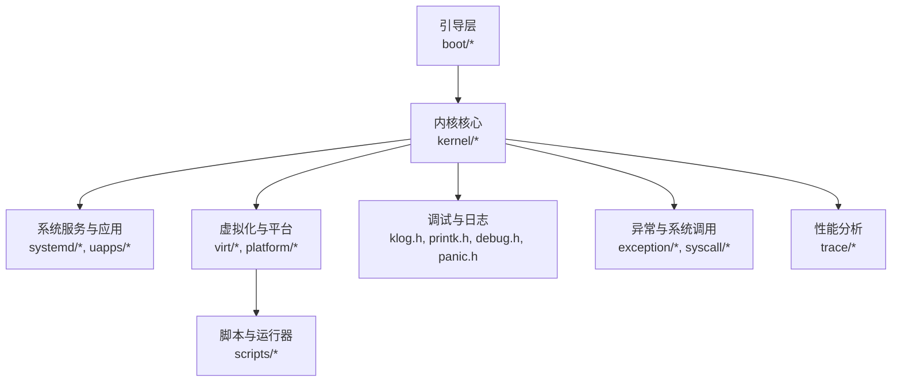
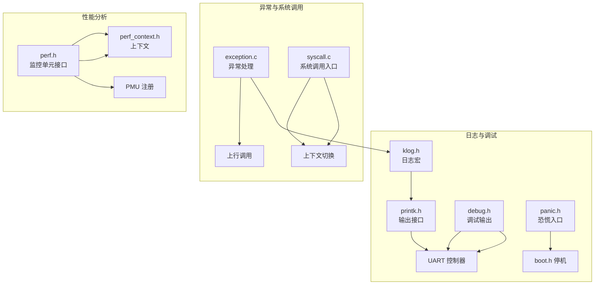
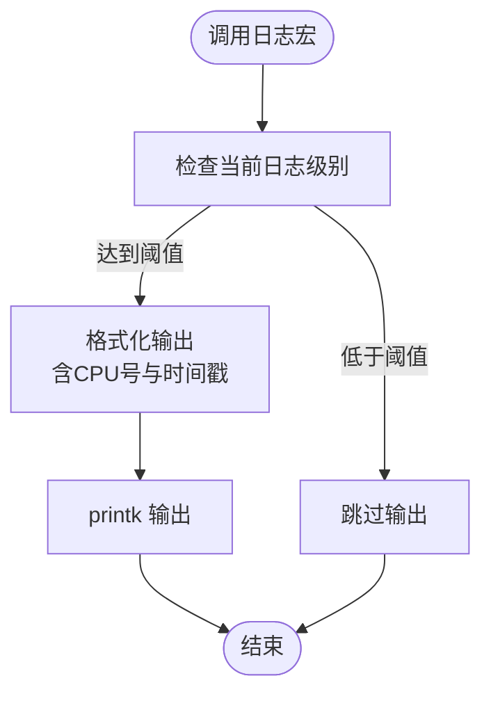
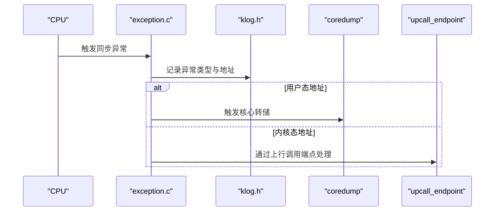
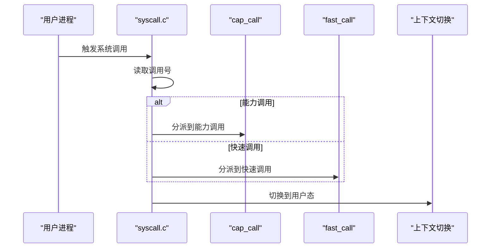
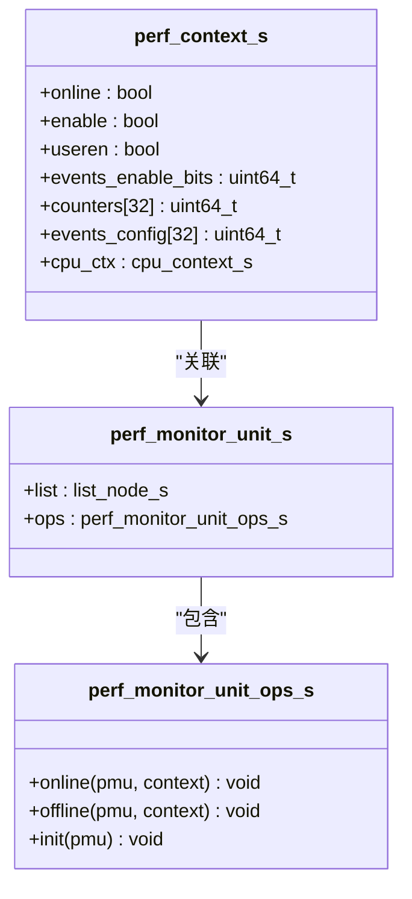
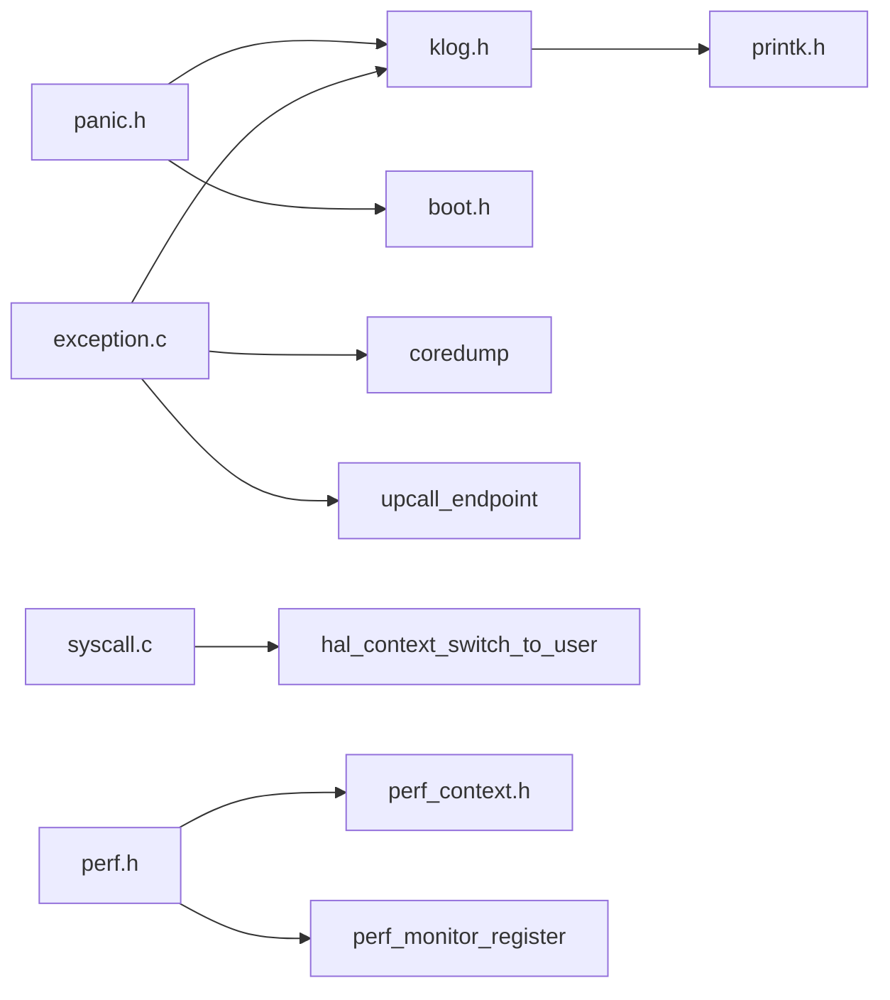

# 开发工具与调试

<cite>
**本文引用的文件**
- [README.md](file://README.md)
- [env_setup.sh](file://env_setup.sh)
- [scripts/build_qemu.sh](file://scripts/build_qemu.sh)
- [scripts/qemu.virt.boot.run](file://scripts/qemu.virt.boot.run)
- [scripts/qemu.rasp3b.boot.run](file://scripts/qemu.rasp3b.boot.run)
- [scripts/qemu.rasp4b.boot.run](file://scripts/qemu.rasp4b.boot.run)
- [kernel/include/klog.h](file://kernel/include/klog.h)
- [kernel/include/printk.h](file://kernel/include/printk.h)
- [kernel/include/debug.h](file://kernel/include/debug.h)
- [kernel/include/panic.h](file://kernel/include/panic.h)
- [kernel/exception/exception.c](file://kernel/exception/exception.c)
- [kernel/include/exception/exception.h](file://kernel/include/exception/exception.h)
- [kernel/syscall/syscall.c](file://kernel/syscall/syscall.c)
- [kernel/include/syscall/syscall.h](file://kernel/include/syscall/syscall.h)
- [kernel/include/trace/perf.h](file://kernel/include/trace/perf.h)
- [kernel/include/trace/perf_context.h](file://kernel/include/trace/perf_context.h)
- [kernel/trace/perf.c](file://kernel/trace/perf.c)
- [kernel/include/initcall.h](file://kernel/include/initcall.h)
- [boot/include/boot.h](file://boot/include/boot.h)
- [kernel/include/core.h](file://kernel/include/core.h)
- [kernel/include/idle/idle.h](file://kernel/include/idle/idle.h)
- [kernel/include/scheduler/sched_framework.h](file://kernel/include/scheduler/sched_framework.h)
</cite>

## 目录
1. 引言
2. 项目结构
3. 核心组件
4. 架构总览
5. 组件详解
6. 依赖关系分析
7. 性能考量
8. 故障排查指南
9. 结论
10. 附录

## 引言
本文件面向TranquilOS开发者与高级调试人员，系统化介绍开发工具链、调试环境配置、日志系统、异常与崩溃处理、以及性能分析能力。内容覆盖从环境搭建到日常调试、从基础日志到内核级性能监控，帮助快速定位问题、识别瓶颈并优化系统行为。

## 项目结构
TranquilOS采用模块化分层设计：引导阶段（boot）、内核核心（kernel）、用户态系统服务与应用（systemd、uapps）、虚拟化与平台适配（virt、platform）、脚本与工具链（scripts、toolchains）。调试与日志相关的关键位置集中在内核头文件与实现中，异常路径与系统调用处理位于kernel目录，性能分析接口在trace子系统。

章节来源
- [README.md](file://README.md#L1-L42)

## 核心组件
- 日志系统：提供多等级日志宏，统一输出到控制台，并带CPU号与时间戳。
- 调试输出：通过专用调试通道输出字符，支持在不同硬件平台下切换。
- 崩溃与恐慌：统一的panic入口，记录文件、函数、行号后进入停机状态。
- 异常处理：同步异常分派，区分数据访问故障与指令故障，必要时触发核心转储或上行调用。
- 系统调用：统一入口，区分能力调用与快速调用，完成地址空间切换与上下文切换。
- 性能分析：PMU监控单元注册接口与上下文结构，预留扩展点。

章节来源
- [kernel/include/klog.h](file://kernel/include/klog.h#L1-L38)
- [kernel/include/printk.h](file://kernel/include/printk.h#L1-L7)
- [kernel/include/debug.h](file://kernel/include/debug.h#L1-L31)
- [kernel/include/panic.h](file://kernel/include/panic.h#L1-L10)
- [kernel/exception/exception.c](file://kernel/exception/exception.c#L1-L36)
- [kernel/include/exception/exception.h](file://kernel/include/exception/exception.h#L1-L30)
- [kernel/syscall/syscall.c](file://kernel/syscall/syscall.c#L1-L20)
- [kernel/include/syscall/syscall.h](file://kernel/include/syscall/syscall.h#L1-L8)
- [kernel/include/trace/perf.h](file://kernel/include/trace/perf.h#L1-L27)
- [kernel/include/trace/perf_context.h](file://kernel/include/trace/perf_context.h#L1-L22)
- [kernel/trace/perf.c](file://kernel/trace/perf.c#L1-L6)

## 架构总览
下图展示调试与日志在系统中的位置与交互：日志通过printk输出；调试输出走专用通道；异常路径在内核中被集中处理；系统调用统一入口；性能分析接口作为可插拔模块存在。

图表来源
- [kernel/include/klog.h](file://kernel/include/klog.h#L1-L38)
- [kernel/include/printk.h](file://kernel/include/printk.h#L1-L7)
- [kernel/include/debug.h](file://kernel/include/debug.h#L1-L31)
- [kernel/include/panic.h](file://kernel/include/panic.h#L1-L10)
- [boot/include/boot.h](file://boot/include/boot.h#L1-L8)
- [kernel/exception/exception.c](file://kernel/exception/exception.c#L1-L36)
- [kernel/syscall/syscall.c](file://kernel/syscall/syscall.c#L1-L20)
- [kernel/include/trace/perf.h](file://kernel/include/trace/perf.h#L1-L27)
- [kernel/include/trace/perf_context.h](file://kernel/include/trace/perf_context.h#L1-L22)

## 组件详解

### 日志系统与调试输出
- 日志等级：定义了调试、信息、警告、错误四个级别，可通过全局变量调整当前日志级别以控制输出量。
- 输出格式：每条日志包含CPU号、时间戳与级别标记，便于多核与实时性分析。
- 打印接口：printk为统一输出入口，具体实现由平台驱动负责。
- 调试输出：提供独立的调试通道，支持在不同硬件平台下映射到不同寄存器地址，用于早期引导或低层调试。
- 恐慌机制：PANIC宏记录文件、函数、行号后进入停机状态，确保异常可追踪。

图表来源
- [kernel/include/klog.h](file://kernel/include/klog.h#L17-L35)
- [kernel/include/printk.h](file://kernel/include/printk.h#L1-L7)

章节来源
- [kernel/include/klog.h](file://kernel/include/klog.h#L1-L38)
- [kernel/include/printk.h](file://kernel/include/printk.h#L1-L7)
- [kernel/include/debug.h](file://kernel/include/debug.h#L1-L31)
- [kernel/include/panic.h](file://kernel/include/panic.h#L1-L10)

### 异常处理与崩溃转储
- 同步异常分派：根据异常类型（如数据访问故障、指令故障）进行差异化处理。
- 数据访问故障：若发生在用户态虚拟内存区域，触发核心转储；否则通过上行调用端点通知用户态处理。
- 记录与定位：异常处理会记录异常类型、故障地址与当前调度上下文名称，便于定位问题来源。
- 恐慌保护：当关键指针为空时，使用PANIC宏记录并停机，避免未定义行为。

图表来源
- [kernel/exception/exception.c](file://kernel/exception/exception.c#L26-L36)
- [kernel/include/exception/exception.h](file://kernel/include/exception/exception.h#L23-L29)
- [kernel/include/klog.h](file://kernel/include/klog.h#L17-L35)

章节来源
- [kernel/exception/exception.c](file://kernel/exception/exception.c#L1-L36)
- [kernel/include/exception/exception.h](file://kernel/include/exception/exception.h#L1-L30)
- [kernel/include/panic.h](file://kernel/include/panic.h#L1-L10)

### 系统调用处理
- 统一入口：syscall_process根据调用号判断是否为能力调用，分别分派至cap_call或fast_call。
- 地址空间切换：在调用前后切换内核与用户地址空间，保证上下文安全。
- 用户态切换：最终切换到用户态执行，完成系统调用流程。

图表来源
- [kernel/syscall/syscall.c](file://kernel/syscall/syscall.c#L8-L20)
- [kernel/include/syscall/syscall.h](file://kernel/include/syscall/syscall.h#L1-L8)

章节来源
- [kernel/syscall/syscall.c](file://kernel/syscall/syscall.c#L1-L20)
- [kernel/include/syscall/syscall.h](file://kernel/include/syscall/syscall.h#L1-L8)

### 性能分析接口
- 监控单元：提供在线/离线初始化与注册接口，支持按需启用与禁用监控单元。
- 上下文结构：包含PMU计数器、事件掩码、用户态标志及CPU上下文，用于采集与恢复。
- 扩展点：perf_monitor_register目前为占位实现，后续可接入具体PMU设备。

图表来源
- [kernel/include/trace/perf.h](file://kernel/include/trace/perf.h#L13-L26)
- [kernel/include/trace/perf_context.h](file://kernel/include/trace/perf_context.h#L10-L19)

章节来源
- [kernel/include/trace/perf.h](file://kernel/include/trace/perf.h#L1-L27)
- [kernel/include/trace/perf_context.h](file://kernel/include/trace/perf_context.h#L1-L22)
- [kernel/trace/perf.c](file://kernel/trace/perf.c#L1-L6)

## 依赖关系分析
- 日志与打印：klog.h依赖printk.h与时间/CPU接口；panic.h依赖klog.h与停机接口。
- 异常路径：exception.c依赖klog.h、coredump、upcall、调度管理等模块。
- 系统调用：syscall.c依赖上下文切换、调度与能力调用框架。
- 性能分析：perf.h与perf_context.h相互依赖，perf.c依赖二者。

图表来源
- [kernel/include/klog.h](file://kernel/include/klog.h#L1-L38)
- [kernel/include/printk.h](file://kernel/include/printk.h#L1-L7)
- [kernel/include/panic.h](file://kernel/include/panic.h#L1-L10)
- [boot/include/boot.h](file://boot/include/boot.h#L1-L8)
- [kernel/exception/exception.c](file://kernel/exception/exception.c#L1-L36)
- [kernel/syscall/syscall.c](file://kernel/syscall/syscall.c#L1-L20)
- [kernel/include/trace/perf.h](file://kernel/include/trace/perf.h#L1-L27)
- [kernel/include/trace/perf_context.h](file://kernel/include/trace/perf_context.h#L1-L22)

章节来源
- [kernel/include/klog.h](file://kernel/include/klog.h#L1-L38)
- [kernel/include/panic.h](file://kernel/include/panic.h#L1-L10)
- [kernel/exception/exception.c](file://kernel/exception/exception.c#L1-L36)
- [kernel/syscall/syscall.c](file://kernel/syscall/syscall.c#L1-L20)
- [kernel/include/trace/perf.h](file://kernel/include/trace/perf.h#L1-L27)
- [kernel/include/trace/perf_context.h](file://kernel/include/trace/perf_context.h#L1-L22)

## 性能考量
- 日志开销：频繁的日志输出会带来串口写入与格式化成本，建议在生产环境提升日志级别或在热点路径关闭详细日志。
- 异常路径：数据访问故障在用户态与内核态分支不同，用户态故障触发转储可能带来较大IO开销，应结合业务场景评估。
- 系统调用：地址空间切换与上下文切换有固定成本，尽量批量处理与减少不必要的系统调用。
- 性能分析：PMU计数器开启会引入额外开销，仅在调试阶段启用；注册监控单元时注意资源占用与中断影响。

## 故障排查指南
- 环境准备
  - 设置工具链与构建路径：通过环境脚本导出工具链路径，确保gn与交叉编译工具可用。
  - 构建与运行：使用QEMU运行脚本启动虚拟平台，验证引导与内核加载。
- 日志定位
  - 提升日志级别：在日志头文件中调整当前日志级别，观察更详细的内核行为。
  - 关注CPU号与时间戳：多核环境下通过CPU号区分任务，通过时间戳定位事件序列。
- 异常与崩溃
  - 数据访问故障：若发生在用户态虚拟内存区域，优先检查用户态代码与页表映射；若在内核区域，检查上行调用端点与内核一致性。
  - PANIC输出：根据文件、函数、行号快速定位问题，结合最近一次日志与异常记录回溯。
- 性能分析
  - 在需要时启用PMU监控单元，采集关键事件计数；注意与系统负载的关系，避免误判。
- 初始化顺序
  - 使用initcall机制组织初始化顺序，确保关键设备先于模块初始化，避免空指针或未就绪导致的异常。

章节来源
- [env_setup.sh](file://env_setup.sh#L1-L5)
- [README.md](file://README.md#L35-L42)
- [kernel/include/klog.h](file://kernel/include/klog.h#L15-L35)
- [kernel/exception/exception.c](file://kernel/exception/exception.c#L11-L35)
- [kernel/include/panic.h](file://kernel/include/panic.h#L6-L8)
- [kernel/include/initcall.h](file://kernel/include/initcall.h#L7-L41)

## 结论
TranquilOS提供了从日志、调试到异常处理与性能分析的完整工具链。通过合理配置日志级别、利用统一的异常与系统调用入口、以及按需启用性能分析，开发者可以在日常开发与高级调试之间取得平衡。建议在开发过程中持续关注日志与异常输出，结合性能分析结果优化关键路径，确保系统稳定与高效。

## 附录
- 开发环境搭建
  - 导入工具链与构建工具：参考环境脚本设置PATH。
  - 构建与运行：使用脚本构建并启动QEMU虚拟机，验证内核功能。
- 调试技巧
  - 使用调试输出通道在早期引导阶段定位问题。
  - 在热点路径附近谨慎使用高频率日志，避免掩盖真实性能瓶颈。
  - 对异常进行分类处理，优先修复用户态相关问题，再处理内核态异常。

章节来源
- [env_setup.sh](file://env_setup.sh#L1-L5)
- [README.md](file://README.md#L35-L42)
- [kernel/include/debug.h](file://kernel/include/debug.h#L8-L20)