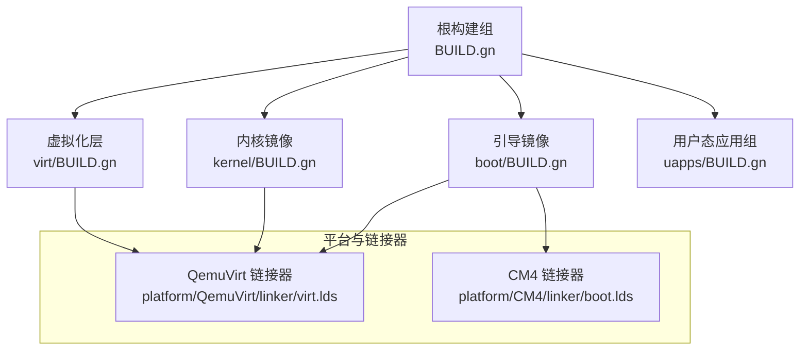
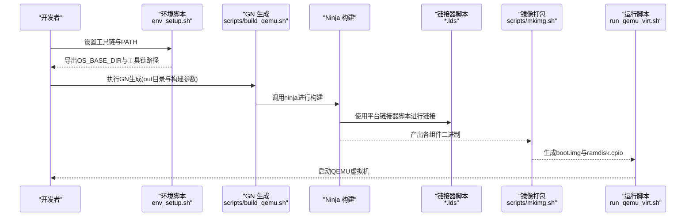
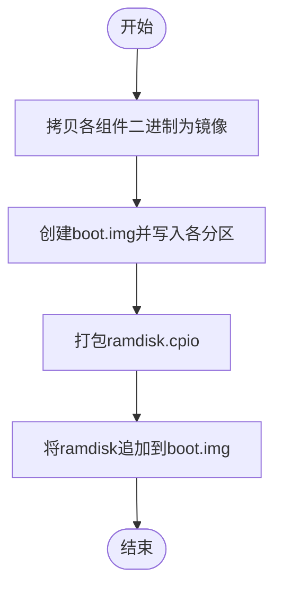
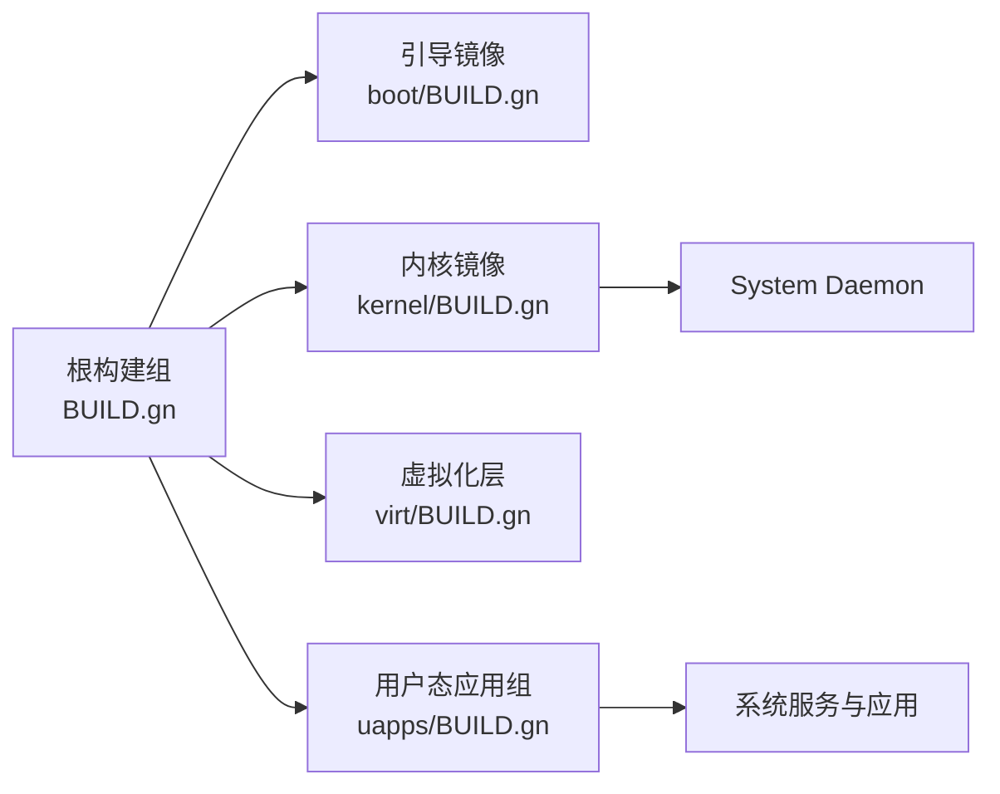

# 快速开始

<cite>
**本文引用的文件**
- [README.md](file://README.md)
- [BUILD.gn](file://BUILD.gn)
- [env_setup.sh](file://env_setup.sh)
- [scripts/build_qemu.sh](file://scripts/build_qemu.sh)
- [scripts/mkimg.sh](file://scripts/mkimg.sh)
- [run_qemu_virt.sh](file://run_qemu_virt.sh)
- [run_board_cm4.sh](file://run_board_cm4.sh)
- [scripts/download_cm4.sh](file://scripts/download_cm4.sh)
- [boot/BUILD.gn](file://boot/BUILD.gn)
- [kernel/BUILD.gn](file://kernel/BUILD.gn)
- [virt/BUILD.gn](file://virt/BUILD.gn)
- [uapps/BUILD.gn](file://uapps/BUILD.gn)
- [platform/QemuVirt/linker/virt.lds](file://platform/QemuVirt/linker/virt.lds)
- [platform/CM4/linker/boot.lds](file://platform/CM4/linker/boot.lds)
- [toolchains/README.md](file://toolchains/README.md)
</cite>

## 目录
1. [简介](#简介)
2. [项目结构](#项目结构)
3. [核心组件](#核心组件)
4. [架构总览](#架构总览)
5. [详细组件分析](#详细组件分析)
6. [依赖关系分析](#依赖关系分析)
7. [性能与构建建议](#性能与构建建议)
8. [故障排查指南](#故障排查指南)
9. [结论](#结论)
10. [附录：常用命令与路径](#附录常用命令与路径)

## 简介
本指南面向初学者与有经验的开发者，帮助你在本地完成TranquilOS的环境搭建、工具链准备、构建与运行（含QEMU虚拟机与树莓派Compute Module 4实机）。文档严格基于仓库内的脚本与配置文件，确保每一步都可复现。

## 项目结构
TranquilOS采用模块化组织，核心目录与职责概览如下：
- boot：引导镜像与早期硬件初始化
- kernel：微内核主体（含体系结构相关实现、中断、MMU、IPC、能力系统等）
- virt：虚拟化层（Hypervisor与VM管理）
- uapps：用户态系统服务与应用（设备管理、文件系统、网络、Shell等）
- ulibs：用户态通用库（libc、libfdt、libgraphics、算法等）
- platform：平台适配（QemuVirt、Pi3b/Pi4b、CM4）及其链接器脚本与设备树
- scripts：构建与打包脚本、运行脚本
- 工具链：交叉编译工具链与GN/Ninja构建系统

图表来源
- [BUILD.gn](file://BUILD.gn#L1-L9)
- [boot/BUILD.gn](file://boot/BUILD.gn#L1-L66)
- [kernel/BUILD.gn](file://kernel/BUILD.gn#L1-L135)
- [virt/BUILD.gn](file://virt/BUILD.gn#L1-L72)
- [uapps/BUILD.gn](file://uapps/BUILD.gn#L1-L10)
- [platform/QemuVirt/linker/virt.lds](file://platform/QemuVirt/linker/virt.lds#L1-L70)
- [platform/CM4/linker/boot.lds](file://platform/CM4/linker/boot.lds#L1-L73)

章节来源
- [README.md](file://README.md#L1-L42)
- [BUILD.gn](file://BUILD.gn#L1-L9)

## 核心组件
- 引导镜像（Boot）：负责早期硬件初始化、UART控制台、设备树解析、电源管理等，最终跳转到内核入口。
- 内核（Kernel）：微内核主体，包含异常处理、中断、MMU、页表、调度、IPC、能力系统、定时器、控制台、设备管理、驱动等。
- 虚拟化层（Hypervisor）：在AArch64上实现虚拟化，管理VCPU、VM内存与系统寄存器，提供Hypervisor调用接口。
- 用户态应用组（UAPPS）：包含设备管理、文件系统、网络、空闲进程与Shell等基础服务。

章节来源
- [boot/BUILD.gn](file://boot/BUILD.gn#L26-L66)
- [kernel/BUILD.gn](file://kernel/BUILD.gn#L25-L135)
- [virt/BUILD.gn](file://virt/BUILD.gn#L26-L72)
- [uapps/BUILD.gn](file://uapps/BUILD.gn#L1-L10)
- [BUILD.gn](file://BUILD.gn#L1-L9)

## 架构总览
下图展示从环境准备到生成镜像并运行的关键流程，涵盖工具链、GN/Ninja、链接器脚本与打包脚本。

图表来源
- [env_setup.sh](file://env_setup.sh#L1-L5)
- [scripts/build_qemu.sh](file://scripts/build_qemu.sh#L1-L6)
- [platform/QemuVirt/linker/virt.lds](file://platform/QemuVirt/linker/virt.lds#L1-L70)
- [scripts/mkimg.sh](file://scripts/mkimg.sh#L1-L38)
- [run_qemu_virt.sh](file://run_qemu_virt.sh#L1-L5)

## 详细组件分析

### 环境搭建与工具链
- 工具链下载：请从官方提供的工具链地址下载并解压至本地，确保包含aarch64-elf交叉工具链与GN/Ninja。
- 环境变量设置：执行环境脚本以设置基础工作目录与PATH，使GN与交叉编译工具可用。
- 验证步骤：确认工具链路径已加入PATH，并能直接调用aarch64-elf-gcc、gn、ninja等命令。

章节来源
- [toolchains/README.md](file://toolchains/README.md#L1-L3)
- [env_setup.sh](file://env_setup.sh#L1-L5)

### 构建系统与平台选择
- 构建系统：使用GN生成构建目录，Ninja进行并行构建。
- 平台参数：通过GN参数选择目标平台（如“QemuVirt”），不同平台对应不同的链接器脚本与设备树。
- 关键构建文件：
  - 根构建组：定义整体产物（Boot、Hypervisor、Kernel、UAPPS）。
  - 各子系统BUILD.gn：定义编译标志、包含目录、链接脚本与源文件列表。
  - 链接器脚本：按平台指定加载地址与段布局。

章节来源
- [BUILD.gn](file://BUILD.gn#L1-L9)
- [boot/BUILD.gn](file://boot/BUILD.gn#L7-L24)
- [kernel/BUILD.gn](file://kernel/BUILD.gn#L6-L23)
- [virt/BUILD.gn](file://virt/BUILD.gn#L7-L24)
- [platform/QemuVirt/linker/virt.lds](file://platform/QemuVirt/linker/virt.lds#L1-L70)
- [platform/CM4/linker/boot.lds](file://platform/CM4/linker/boot.lds#L1-L73)

### 镜像生成与打包
- 二进制拷贝：使用objcopy将各组件输出转换为二进制镜像。
- boot.img布局：按固定偏移写入loader、DTB、hypervisor、kernel、systemd与ramdisk。
- ramdisk制作：将系统服务二进制打包为cpio归档，再追加到boot.img末尾。
- 设备树与固件：根据平台复制对应的DTB与config.txt至启动分区。

图表来源
- [scripts/mkimg.sh](file://scripts/mkimg.sh#L1-L38)

章节来源
- [scripts/mkimg.sh](file://scripts/mkimg.sh#L1-L38)

### 运行测试（QEMU虚拟机）
- 快速启动：执行QEMU虚拟机运行脚本，自动完成构建、镜像生成与启动。
- 启动顺序：脚本依次调用构建脚本、镜像打包脚本，最后执行QEMU启动脚本。
- 注意事项：确保已正确设置环境变量与工具链路径；若首次运行，请先完成一次完整构建。

章节来源
- [run_qemu_virt.sh](file://run_qemu_virt.sh#L1-L5)
- [scripts/build_qemu.sh](file://scripts/build_qemu.sh#L1-L6)

### 实际硬件烧录（树莓派Compute Module 4）
- 依赖工具：rpiboot（用于通过USB引导CM4）。
- 流程：先构建并生成镜像，再通过rpiboot挂载启动卷，将boot.img与DTB、config.txt复制到启动分区，最后卸载并完成烧录。
- 注意：确保系统已识别并挂载/boot卷，且具有写权限。

章节来源
- [run_board_cm4.sh](file://run_board_cm4.sh#L1-L5)
- [scripts/download_cm4.sh](file://scripts/download_cm4.sh#L1-L27)

### 不同平台的构建选项与配置
- QEMU虚拟机（QemuVirt）：使用QemuVirt链接器脚本，适合在QEMU中验证内核与虚拟化功能。
- 树莓派系列（Pi3b/Pi4b）：使用对应平台链接器脚本与设备树，适合在树莓派硬件上运行。
- Compute Module 4（CM4）：使用CM4链接器脚本，配合rpiboot进行引导与烧录。

章节来源
- [platform/QemuVirt/linker/virt.lds](file://platform/QemuVirt/linker/virt.lds#L1-L70)
- [platform/CM4/linker/boot.lds](file://platform/CM4/linker/boot.lds#L1-L73)

## 依赖关系分析
- 组件耦合：根构建组聚合四个主要产物；内核依赖系统服务（systemd），用户态应用依赖通用库与系统客户端。
- 外部依赖：交叉编译工具链、GN、Ninja、objcopy、cpio、dd等。
- 平台耦合：不同平台使用不同的链接器脚本与设备树，构建参数通过GN传入。

图表来源
- [BUILD.gn](file://BUILD.gn#L1-L9)
- [kernel/BUILD.gn](file://kernel/BUILD.gn#L131-L134)
- [uapps/BUILD.gn](file://uapps/BUILD.gn#L1-L10)

章节来源
- [BUILD.gn](file://BUILD.gn#L1-L9)
- [kernel/BUILD.gn](file://kernel/BUILD.gn#L131-L134)
- [uapps/BUILD.gn](file://uapps/BUILD.gn#L1-L10)

## 性能与构建建议
- 并行构建：Ninja默认启用多线程，建议在多核环境下直接使用默认配置。
- 清理缓存：遇到链接或符号错误时，先清理out目录并重新生成。
- 工具链版本：确保使用的交叉编译工具链版本与项目匹配，避免ABI不一致导致的问题。
- 链接器脚本：不同平台的加载地址与段布局不同，务必选择正确的脚本，避免运行时地址冲突。

## 故障排查指南
- 工具链未找到：检查环境脚本是否正确导出工具链路径；确认PATH中包含交叉编译工具链bin目录。
- 构建失败（链接错误）：核对GN参数与平台选择；检查链接器脚本路径与加载地址是否匹配。
- 镜像生成异常：确认objcopy、cpio、dd命令可用；检查ramdisk目录结构与文件是否存在。
- QEMU无法启动：确认已生成boot.img与DTB；检查QEMU启动脚本参数与设备树路径。
- CM4烧录失败：确认rpiboot正常工作；检查启动卷挂载状态与写权限；核对DTB与config.txt是否正确复制。

章节来源
- [env_setup.sh](file://env_setup.sh#L1-L5)
- [scripts/build_qemu.sh](file://scripts/build_qemu.sh#L1-L6)
- [scripts/mkimg.sh](file://scripts/mkimg.sh#L1-L38)
- [scripts/download_cm4.sh](file://scripts/download_cm4.sh#L1-L27)

## 结论
通过本指南，你可以完成TranquilOS的环境准备、工具链配置、构建与运行。建议先在QEMU上验证功能，再切换到CM4进行实机验证。遇到问题时，优先检查工具链与构建参数，其次核对镜像生成与平台脚本。

## 附录：常用命令与路径
- 环境准备
  - 设置环境变量：执行环境脚本以导出工具链路径与基础目录。
- 构建与运行
  - QEMU虚拟机：执行运行脚本以完成构建、镜像生成与启动。
  - CM4实机：执行运行脚本后，使用下载脚本将镜像写入启动卷。
- 关键路径
  - 工具链：交叉编译工具链与GN/Ninja所在目录。
  - 构建输出：构建产物位于out目录，镜像生成后会生成boot.img与ramdisk.cpio。
  - 平台链接器：按平台选择对应的链接器脚本。

章节来源
- [README.md](file://README.md#L35-L42)
- [env_setup.sh](file://env_setup.sh#L1-L5)
- [run_qemu_virt.sh](file://run_qemu_virt.sh#L1-L5)
- [run_board_cm4.sh](file://run_board_cm4.sh#L1-L5)
- [scripts/mkimg.sh](file://scripts/mkimg.sh#L1-L38)