# GN构建配置

<cite>
**本文引用的文件**
- [BUILD.gn](file://BUILD.gn)
- [boot/BUILD.gn](file://boot/BUILD.gn)
- [kernel/BUILD.gn](file://kernel/BUILD.gn)
- [virt/BUILD.gn](file://virt/BUILD.gn)
- [uapps/BUILD.gn](file://uapps/BUILD.gn)
- [kernel/systemd/BUILD.gn](file://kernel/systemd/BUILD.gn)
- [trustee/BUILD.gn](file://trustee/BUILD.gn)
- [uapps/devmgr/BUILD.gn](file://uapps/devmgr/BUILD.gn)
- [uapps/fsmgr/BUILD.gn](file://uapps/fsmgr/BUILD.gn)
- [uapps/netmgr/BUILD.gn](file://uapps/netmgr/BUILD.gn)
- [uapps/idle/BUILD.gn](file://uapps/idle/BUILD.gn)
- [uapps/shell/BUILD.gn](file://uapps/shell/BUILD.gn)
</cite>

## 目录
1. [简介](#简介)
2. [项目结构](#项目结构)
3. [核心组件](#核心组件)
4. [架构总览](#架构总览)
5. [详细组件分析](#详细组件分析)
6. [依赖分析](#依赖分析)
7. [性能考虑](#性能考虑)
8. [故障排查指南](#故障排查指南)
9. [结论](#结论)
10. [附录](#附录)

## 简介
本文件系统性梳理TranquilOS在GN构建系统下的配置与实现，重点覆盖：
- GN构建语法与语义要点（如config、group、executable等）
- 主构建文件中OS组的定义与依赖关系
- 各子模块的构建规则：引导程序、内核、虚拟化、用户态应用与用户态库
- 构建目标命名约定与依赖传递机制
- 自定义与扩展技巧
- 最佳实践与性能优化建议
- 常见问题与调试方法

## 项目结构
TranquilOS采用按功能域分层的目录组织方式，构建配置以模块为单位分布在各子目录的BUILD.gn中，并通过顶层OS组统一编排。

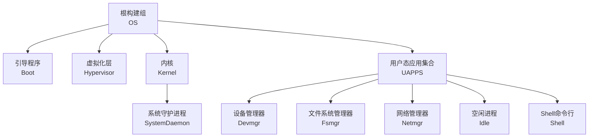

图表来源
- [BUILD.gn](file://BUILD.gn#L1-L9)
- [uapps/BUILD.gn](file://uapps/BUILD.gn#L1-L10)
- [kernel/BUILD.gn](file://kernel/BUILD.gn#L131-L134)
- [kernel/systemd/BUILD.gn](file://kernel/systemd/BUILD.gn#L24-L55)

章节来源
- [BUILD.gn](file://BUILD.gn#L1-L9)
- [uapps/BUILD.gn](file://uapps/BUILD.gn#L1-L10)

## 核心组件
本节聚焦GN构建的核心要素与TranquilOS中的具体使用方式。

- 组与目标
  - group用于聚合多个目标，形成逻辑分组或顶层入口，便于批量构建与依赖管理。
  - executable用于生成可执行文件，包含源文件列表、链接脚本、包含路径与编译/链接标志等。
- 配置块config
  - 在同一模块内复用编译/链接参数，避免重复声明，提升可维护性。
- 变量与路径
  - 使用$BASE_DIR、模块名变量等统一管理路径，结合平台变量实现跨平台构建。
- 平台变量platform
  - 通过print输出当前平台，同时在链接脚本与包含路径中动态选择对应平台资源。

章节来源
- [boot/BUILD.gn](file://boot/BUILD.gn#L7-L24)
- [kernel/BUILD.gn](file://kernel/BUILD.gn#L6-L23)
- [virt/BUILD.gn](file://virt/BUILD.gn#L7-L24)
- [uapps/devmgr/BUILD.gn](file://uapps/devmgr/BUILD.gn#L4-L21)
- [uapps/fsmgr/BUILD.gn](file://uapps/fsmgr/BUILD.gn#L4-L21)
- [uapps/netmgr/BUILD.gn](file://uapps/netmgr/BUILD.gn#L4-L20)
- [uapps/idle/BUILD.gn](file://uapps/idle/BUILD.gn#L4-L21)
- [uapps/shell/BUILD.gn](file://uapps/shell/BUILD.gn#L4-L21)
- [kernel/systemd/BUILD.gn](file://kernel/systemd/BUILD.gn#L5-L22)
- [trustee/BUILD.gn](file://trustee/BUILD.gn#L6-L23)

## 架构总览
下图展示从顶层OS组到各子模块的依赖关系与构建顺序：

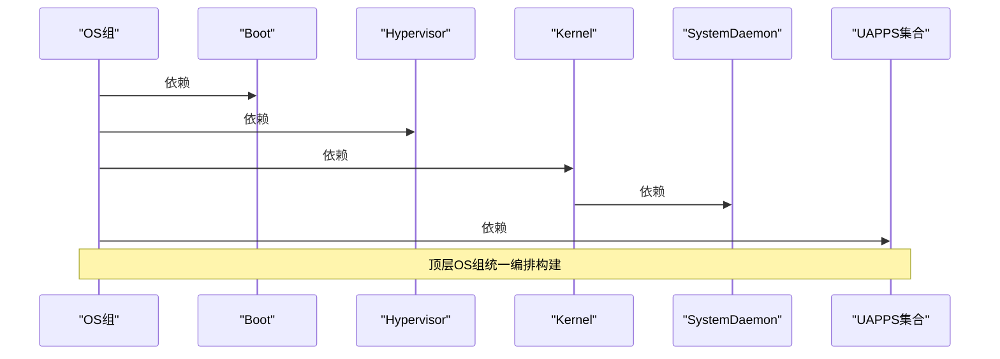

图表来源
- [BUILD.gn](file://BUILD.gn#L1-L9)
- [kernel/BUILD.gn](file://kernel/BUILD.gn#L131-L134)
- [uapps/BUILD.gn](file://uapps/BUILD.gn#L1-L10)

## 详细组件分析

### 引导程序（Boot）
- 目标类型：executable
- 关键点
  - 复用compile_flags配置，统一C/C++/链接标志
  - include_dirs包含用户态库与内核头文件，确保引导阶段即可访问必要接口
  - 链接脚本由平台变量动态选择
  - 源文件涵盖启动汇编、基础C库、设备树解析、RTC、GPIO、UART、电源管理、MM等

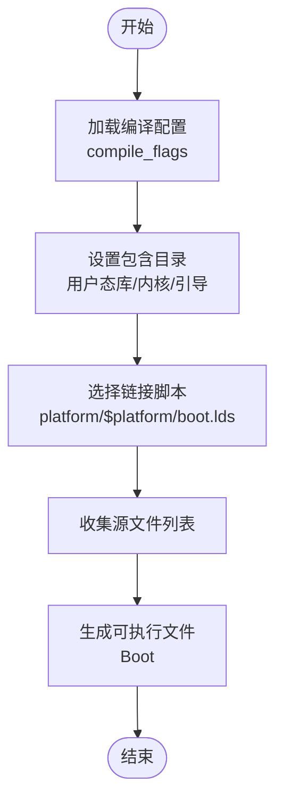

图表来源
- [boot/BUILD.gn](file://boot/BUILD.gn#L7-L24)
- [boot/BUILD.gn](file://boot/BUILD.gn#L26-L65)

章节来源
- [boot/BUILD.gn](file://boot/BUILD.gn#L1-L66)

### 内核（Kernel）
- 目标类型：executable
- 关键点
  - 包含体系结构相关代码、异常处理、中断、TLB、页表、上下文切换、原子操作、核心转储、调度、缓存、中断管理、定时器、内存管理、驱动、跟踪、电源管理、IPC、能力系统、系统调用、CPU本地数据等
  - 依赖SystemDaemon作为系统守护进程
  - 链接脚本同样由平台变量选择

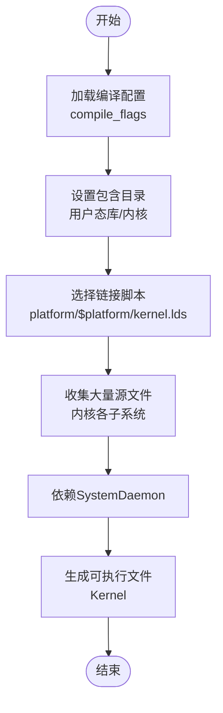

图表来源
- [kernel/BUILD.gn](file://kernel/BUILD.gn#L6-L23)
- [kernel/BUILD.gn](file://kernel/BUILD.gn#L25-L134)

章节来源
- [kernel/BUILD.gn](file://kernel/BUILD.gn#L1-L135)

### 虚拟化（Hypervisor）
- 目标类型：executable
- 关键点
  - 包含hypervisor相关代码、系统寄存器、异常处理、中断、控制台、定时器、内存管理、VCPU、VM对象、hypcall等
  - 链接脚本由平台变量选择

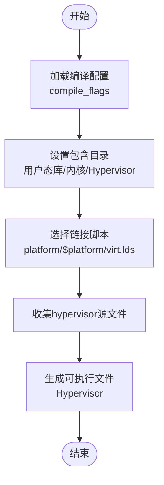

图表来源
- [virt/BUILD.gn](file://virt/BUILD.gn#L7-L24)
- [virt/BUILD.gn](file://virt/BUILD.gn#L26-L71)

章节来源
- [virt/BUILD.gn](file://virt/BUILD.gn#L1-L72)

### 用户态应用集合（UAPPS）
- 目标类型：group
- 关键点
  - 聚合多个用户态应用目标：Devmgr、Fsmgr、Netmgr、Idle、Shell

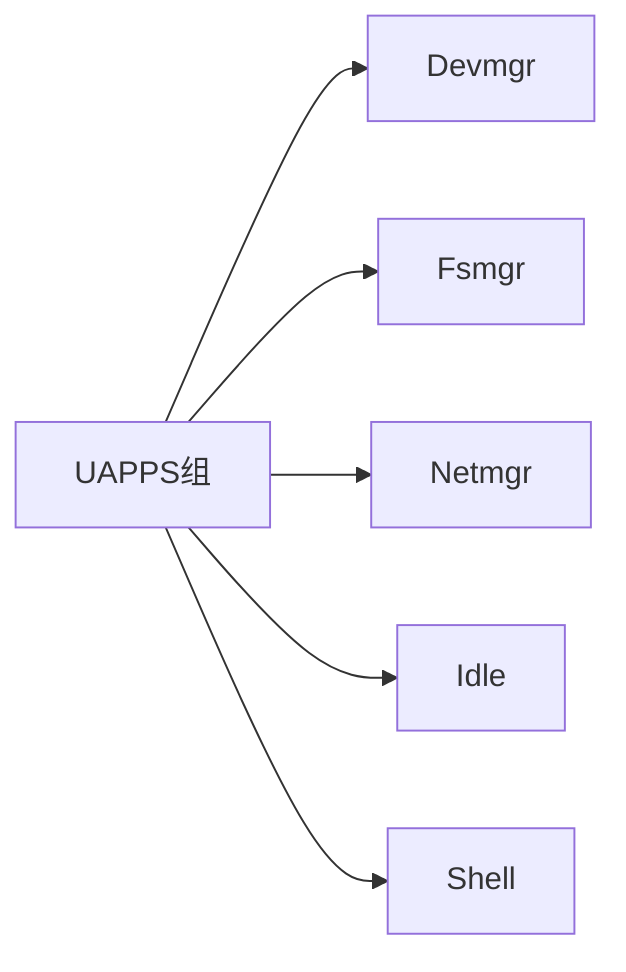

图表来源
- [uapps/BUILD.gn](file://uapps/BUILD.gn#L1-L10)

章节来源
- [uapps/BUILD.gn](file://uapps/BUILD.gn#L1-L10)

### 设备管理器（Devmgr）
- 目标类型：executable
- 关键点
  - 包含Raspberry Pi GPIO/FB、QEMU fw_cfg、显示管理器、系统服务客户端、设备管理器核心、服务与入口

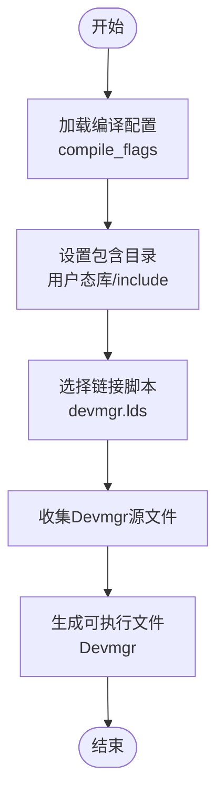

图表来源
- [uapps/devmgr/BUILD.gn](file://uapps/devmgr/BUILD.gn#L4-L21)
- [uapps/devmgr/BUILD.gn](file://uapps/devmgr/BUILD.gn#L23-L51)

章节来源
- [uapps/devmgr/BUILD.gn](file://uapps/devmgr/BUILD.gn#L1-L51)

### 文件系统管理器（Fsmgr）
- 目标类型：executable
- 关键点
  - 包含rootfs、procfs、sysfs、fdtable、session、系统服务客户端、文件系统管理器核心

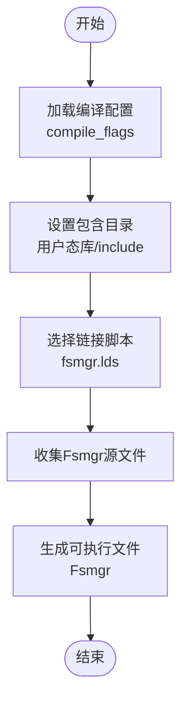

图表来源
- [uapps/fsmgr/BUILD.gn](file://uapps/fsmgr/BUILD.gn#L4-L21)
- [uapps/fsmgr/BUILD.gn](file://uapps/fsmgr/BUILD.gn#L23-L51)

章节来源
- [uapps/fsmgr/BUILD.gn](file://uapps/fsmgr/BUILD.gn#L1-L51)

### 网络管理器（Netmgr）
- 目标类型：executable
- 关键点
  - 包含网络服务、系统服务客户端、入口与网络相关实现

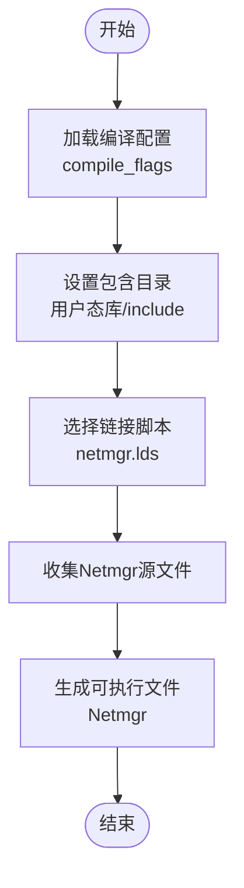

图表来源
- [uapps/netmgr/BUILD.gn](file://uapps/netmgr/BUILD.gn#L4-L20)
- [uapps/netmgr/BUILD.gn](file://uapps/netmgr/BUILD.gn#L22-L43)

章节来源
- [uapps/netmgr/BUILD.gn](file://uapps/netmgr/BUILD.gn#L1-L44)

### 空闲进程（Idle）
- 目标类型：executable
- 关键点
  - 空闲进程入口与基础C库

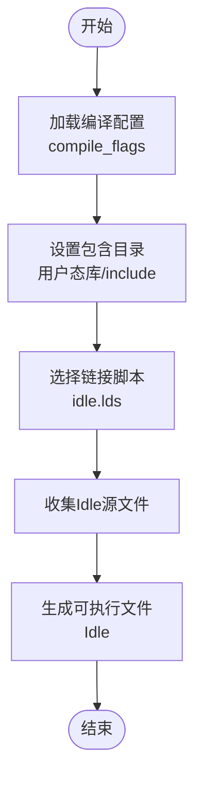

图表来源
- [uapps/idle/BUILD.gn](file://uapps/idle/BUILD.gn#L4-L21)
- [uapps/idle/BUILD.gn](file://uapps/idle/BUILD.gn#L23-L41)

章节来源
- [uapps/idle/BUILD.gn](file://uapps/idle/BUILD.gn#L1-L41)

### Shell命令行（Shell）
- 目标类型：executable
- 关键点
  - 包含图形字体与2D图形库、系统/设备/文件系统客户端、入口与命令行实现

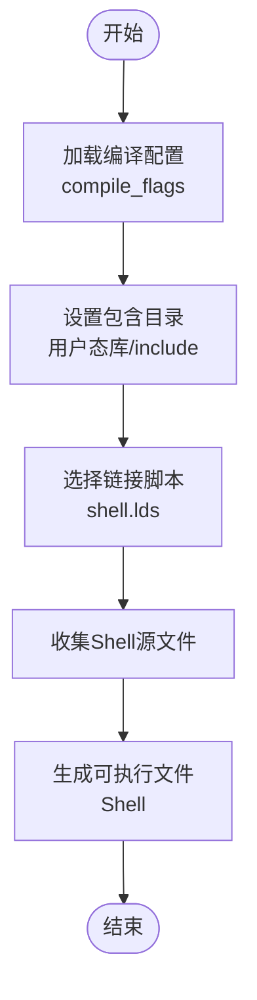

图表来源
- [uapps/shell/BUILD.gn](file://uapps/shell/BUILD.gn#L4-L21)
- [uapps/shell/BUILD.gn](file://uapps/shell/BUILD.gn#L23-L47)

章节来源
- [uapps/shell/BUILD.gn](file://uapps/shell/BUILD.gn#L1-L47)

### 系统守护进程（SystemDaemon）
- 目标类型：executable
- 关键点
  - 内存管理、进程/线程管理、IPC、回传、服务、系统守护进程核心、入口与链接脚本

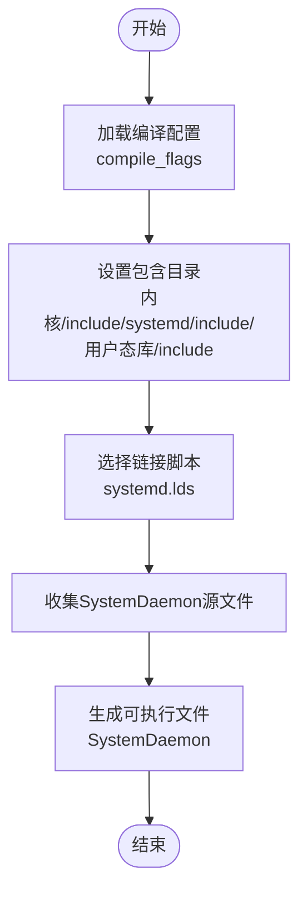

图表来源
- [kernel/systemd/BUILD.gn](file://kernel/systemd/BUILD.gn#L5-L22)
- [kernel/systemd/BUILD.gn](file://kernel/systemd/BUILD.gn#L24-L55)

章节来源
- [kernel/systemd/BUILD.gn](file://kernel/systemd/BUILD.gn#L1-L56)

### Trustee（受信执行环境）
- 目标类型：executable
- 关键点
  - 受信执行环境入口与链接脚本

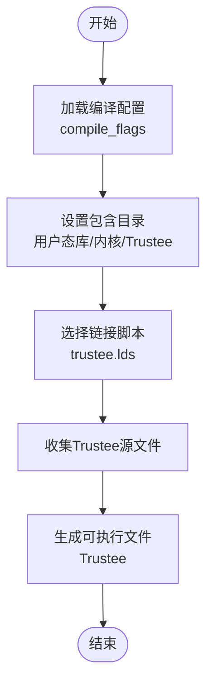

图表来源
- [trustee/BUILD.gn](file://trustee/BUILD.gn#L6-L23)
- [trustee/BUILD.gn](file://trustee/BUILD.gn#L25-L43)

章节来源
- [trustee/BUILD.gn](file://trustee/BUILD.gn#L1-L43)

## 依赖分析
- 顶层OS组依赖引导程序、虚拟化、内核与用户态应用集合
- 内核进一步依赖SystemDaemon
- 用户态应用集合聚合多个应用目标
- 所有模块均通过config复用编译/链接配置，减少重复

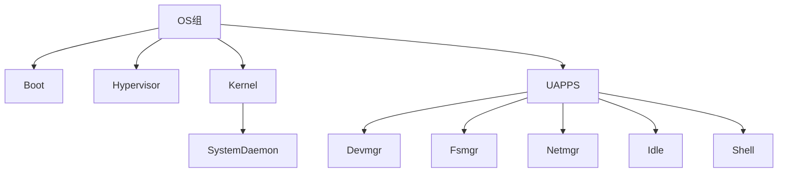

图表来源
- [BUILD.gn](file://BUILD.gn#L1-L9)
- [kernel/BUILD.gn](file://kernel/BUILD.gn#L131-L134)
- [uapps/BUILD.gn](file://uapps/BUILD.gn#L1-L10)

章节来源
- [BUILD.gn](file://BUILD.gn#L1-L9)
- [kernel/BUILD.gn](file://kernel/BUILD.gn#L131-L134)
- [uapps/BUILD.gn](file://uapps/BUILD.gn#L1-L10)

## 性能考虑
- 编译标志统一管理：通过config集中定义cflags、cflags_c、ldflags，减少重复与不一致带来的构建时间波动
- 链接脚本按平台选择：避免不必要的全量链接，缩短链接时间
- 源文件清单明确：仅包含实际需要的源文件，降低编译体量
- 依赖最小化：group与deps仅列出必要目标，避免无谓的增量编译
- 并行构建：GN默认支持并行，建议在CI与本地开发中充分利用

## 故障排查指南
- 平台变量未生效
  - 现象：print输出与预期不符，链接脚本路径错误
  - 排查：确认传入的platform值是否正确；检查平台目录是否存在对应linker脚本
  - 参考
    - [boot/BUILD.gn](file://boot/BUILD.gn#L27-L39)
    - [kernel/BUILD.gn](file://kernel/BUILD.gn#L26-L37)
    - [virt/BUILD.gn](file://virt/BUILD.gn#L27-L39)
- 头文件包含缺失
  - 现象：编译报找不到头文件
  - 排查：核对include_dirs是否包含所需头文件目录；确认相对路径与$BASE_DIR拼接是否正确
  - 参考
    - [boot/BUILD.gn](file://boot/BUILD.gn#L31-L36)
    - [kernel/BUILD.gn](file://kernel/BUILD.gn#L30-L33)
    - [virt/BUILD.gn](file://virt/BUILD.gn#L31-L36)
- 链接失败
  - 现象：链接时报符号未定义或脚本错误
  - 排查：确认链接脚本路径与内容；核对源文件是否包含必要的实现；检查deps是否完整
  - 参考
    - [boot/BUILD.gn](file://boot/BUILD.gn#L37-L40)
    - [kernel/BUILD.gn](file://kernel/BUILD.gn#L34-L37)
    - [virt/BUILD.gn](file://virt/BUILD.gn#L37-L40)
- 依赖循环或遗漏
  - 现象：构建报错提示循环依赖或目标未找到
  - 排查：检查group与deps声明；确保依赖方向正确且无环
  - 参考
    - [BUILD.gn](file://BUILD.gn#L2-L7)
    - [kernel/BUILD.gn](file://kernel/BUILD.gn#L131-L134)
    - [uapps/BUILD.gn](file://uapps/BUILD.gn#L2-L8)

## 结论
TranquilOS的GN构建配置以清晰的模块划分与统一的配置管理为基础，通过group与executable实现层次化的构建编排。顶层OS组将引导程序、虚拟化、内核与用户态应用集合有机串联，内核再依赖SystemDaemon完成系统守护进程的构建。该设计具备良好的可维护性与扩展性，适合在多平台环境下进行持续集成与迭代开发。

## 附录
- 构建目标命名约定
  - 模块名首字母大写，目标名与模块名一致，如Boot、Kernel、Hypervisor、SystemDaemon等
- 依赖传递机制
  - 通过deps声明直接依赖；group作为逻辑聚合，最终由顶层OS组统一触发
- 自定义与扩展技巧
  - 新增模块时，优先在对应目录创建BUILD.gn并定义executable与必要include_dirs/ldflags
  - 将通用编译/链接参数放入config块并在模块内引用
  - 如需新增平台，只需在platform/<your_platform>/linker下提供对应脚本，并在模块中通过platform变量选择
- 最佳实践
  - 保持config集中化，避免分散重复
  - 明确include_dirs范围，避免污染编译环境
  - 严格控制源文件清单，减少不必要的编译单元
  - 使用group进行逻辑分组，便于按需构建