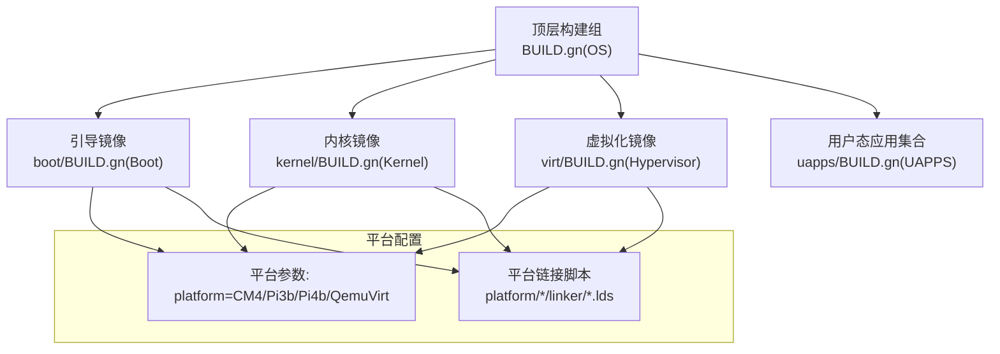
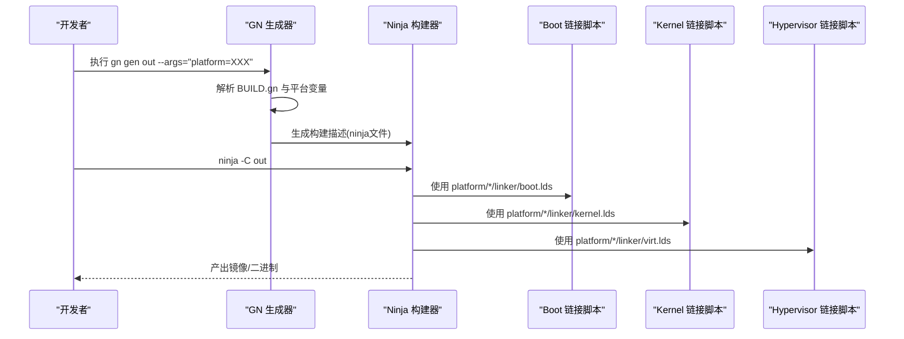
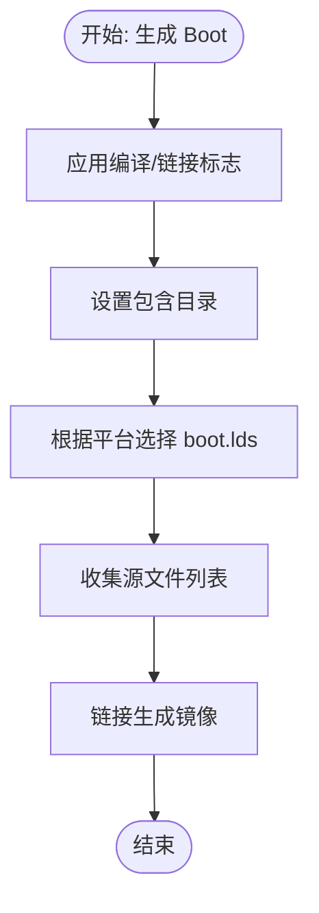
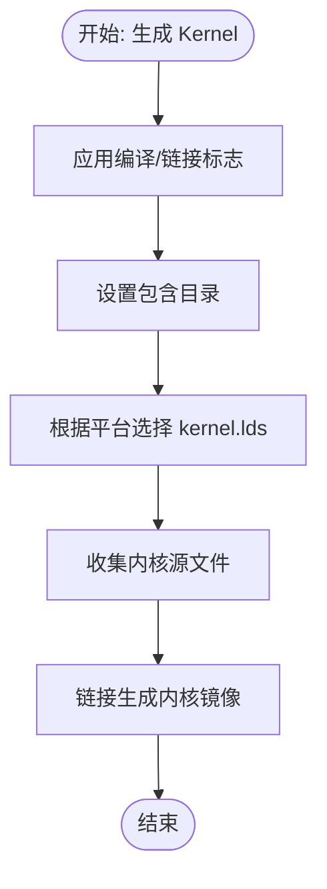
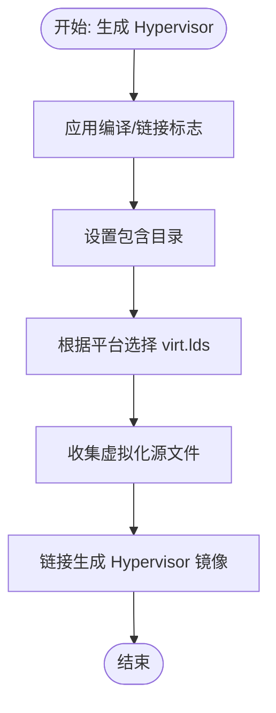
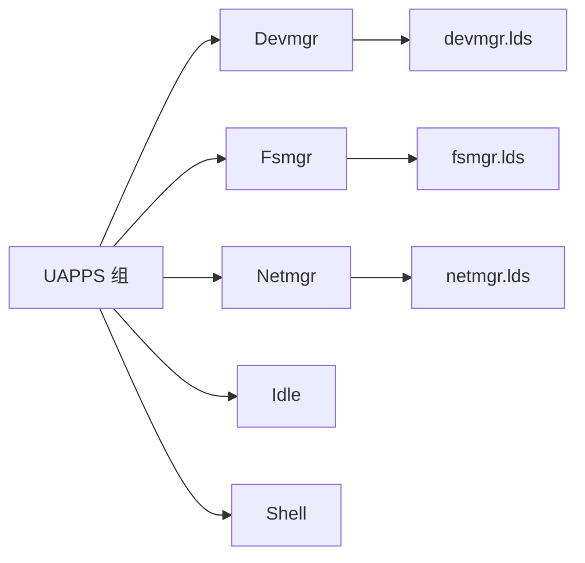
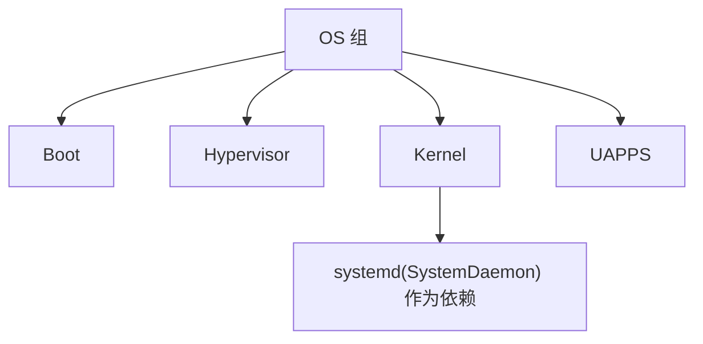

# 构建系统

<cite>
**本文引用的文件**
- [BUILD.gn](file://BUILD.gn)
- [boot/BUILD.gn](file://boot/BUILD.gn)
- [kernel/BUILD.gn](file://kernel/BUILD.gn)
- [virt/BUILD.gn](file://virt/BUILD.gn)
- [uapps/BUILD.gn](file://uapps/BUILD.gn)
- [boot/boot.lds](file://boot/boot.lds)
- [kernel/kernel.lds](file://kernel/kernel.lds)
- [virt/virt.lds](file://virt/virt.lds)
- [platform/CM4/linker/kernel.lds](file://platform/CM4/linker/kernel.lds)
- [platform/Pi3b/linker/kernel.lds](file://platform/Pi3b/linker/kernel.lds)
- [platform/Pi4b/linker/kernel.lds](file://platform/Pi4b/linker/kernel.lds)
- [platform/QemuVirt/linker/kernel.lds](file://platform/QemuVirt/linker/kernel.lds)
- [scripts/build_cm4.sh](file://scripts/build_cm4.sh)
- [scripts/build_pi3b.sh](file://scripts/build_pi3b.sh)
- [scripts/build_pi4b.sh](file://scripts/build_pi4b.sh)
- [scripts/build_qemu.sh](file://scripts/build_qemu.sh)
- [env_setup.sh](file://env_setup.sh)
- [uapps/devmgr/BUILD.gn](file://uapps/devmgr/BUILD.gn)
- [uapps/fsmgr/BUILD.gn](file://uapps/fsmgr/BUILD.gn)
- [uapps/netmgr/BUILD.gn](file://uapps/netmgr/BUILD.gn)
</cite>

## 目录
1. [简介](#简介)
2. [项目结构](#项目结构)
3. [核心组件](#核心组件)
4. [架构总览](#架构总览)
5. [详细组件分析](#详细组件分析)
6. [依赖关系分析](#依赖关系分析)
7. [性能与并行编译](#性能与并行编译)
8. [故障排查指南](#故障排查指南)
9. [结论](#结论)
10. [附录](#附录)

## 简介
本文件面向TranquilOS构建系统，系统性阐述基于GN（Generate Ninja）的构建配置与Ninja构建工具的使用方式，覆盖以下主题：
- GN构建规则定义与目标组织
- 依赖关系管理与模块化分层
- 平台特定配置与链接脚本
- 链接器脚本的内存布局、符号链接与平台差异
- 构建系统的自定义与扩展方法
- 构建优化与并行编译技巧
- 常见问题与调试方法

## 项目结构
TranquilOS采用GN/Ninja双层构建体系：顶层通过一个聚合组控制整体产出；各子系统（引导、内核、虚拟化、用户态应用等）分别在独立的BUILD.gn中声明目标；平台差异通过“平台参数”注入，并在链接脚本中体现。

图表来源
- [BUILD.gn](file://BUILD.gn#L1-L9)
- [boot/BUILD.gn](file://boot/BUILD.gn#L26-L65)
- [kernel/BUILD.gn](file://kernel/BUILD.gn#L25-L134)
- [virt/BUILD.gn](file://virt/BUILD.gn#L26-L71)
- [uapps/BUILD.gn](file://uapps/BUILD.gn#L1-L9)

章节来源
- [BUILD.gn](file://BUILD.gn#L1-L9)
- [boot/BUILD.gn](file://boot/BUILD.gn#L1-L66)
- [kernel/BUILD.gn](file://kernel/BUILD.gn#L1-L135)
- [virt/BUILD.gn](file://virt/BUILD.gn#L1-L72)
- [uapps/BUILD.gn](file://uapps/BUILD.gn#L1-L10)

## 核心组件
- 顶层构建组：聚合多个可执行目标，统一入口。
- 引导阶段（Boot）：最小化启动代码与早期硬件初始化，使用平台专属链接脚本。
- 内核阶段（Kernel）：完整内核实现，包含异常处理、中断、MMU、调度、IPC、设备驱动等。
- 虚拟化阶段（Hypervisor）：EL2虚拟化环境，包含VCPU、VM内存管理、GICv2等。
- 用户态应用（UAPPS）：设备管理、文件系统、网络等用户态服务。

章节来源
- [BUILD.gn](file://BUILD.gn#L1-L9)
- [boot/BUILD.gn](file://boot/BUILD.gn#L26-L65)
- [kernel/BUILD.gn](file://kernel/BUILD.gn#L25-L134)
- [virt/BUILD.gn](file://virt/BUILD.gn#L26-L71)
- [uapps/BUILD.gn](file://uapps/BUILD.gn#L1-L9)

## 架构总览
下图展示从GN生成到Ninja构建的端到端流程，以及平台参数如何影响链接脚本选择。

图表来源
- [scripts/build_cm4.sh](file://scripts/build_cm4.sh#L4-L5)
- [scripts/build_pi3b.sh](file://scripts/build_pi3b.sh#L4-L5)
- [scripts/build_pi4b.sh](file://scripts/build_pi4b.sh#L4-L5)
- [scripts/build_qemu.sh](file://scripts/build_qemu.sh#L4-L5)
- [boot/BUILD.gn](file://boot/BUILD.gn#L37-L40)
- [kernel/BUILD.gn](file://kernel/BUILD.gn#L34-L37)
- [virt/BUILD.gn](file://virt/BUILD.gn#L37-L40)

## 详细组件分析

### 引导阶段（Boot）
- 构建目标：Boot
- 关键点：
  - 统一编译标志与链接标志配置
  - 包含目录：用户库头文件、引导与内核公共头文件
  - 链接脚本：按平台选择 platform/*/linker/boot.lds
  - 源码集：引导汇编、早期硬件驱动、基础libc与fdt、设备树解析、引导内存管理等

图表来源
- [boot/BUILD.gn](file://boot/BUILD.gn#L7-L24)
- [boot/BUILD.gn](file://boot/BUILD.gn#L31-L40)
- [boot/BUILD.gn](file://boot/BUILD.gn#L41-L64)

章节来源
- [boot/BUILD.gn](file://boot/BUILD.gn#L1-L66)
- [boot/boot.lds](file://boot/boot.lds#L1-L73)

### 内核阶段（Kernel）
- 构建目标：Kernel
- 关键点：
  - 统一编译/链接标志
  - 包含目录：用户库与内核公共头文件
  - 链接脚本：platform/*/linker/kernel.lds
  - 源码集：架构相关启动/异常/中断/TLB/MMU、调度、IPC、能力系统、设备驱动、定时器、缓存、PMU、DMA、GPU、看门狗、电源管理等

图表来源
- [kernel/BUILD.gn](file://kernel/BUILD.gn#L6-L23)
- [kernel/BUILD.gn](file://kernel/BUILD.gn#L30-L37)
- [kernel/BUILD.gn](file://kernel/BUILD.gn#L38-L130)

章节来源
- [kernel/BUILD.gn](file://kernel/BUILD.gn#L1-L135)
- [kernel/kernel.lds](file://kernel/kernel.lds#L1-L73)
- [platform/CM4/linker/kernel.lds](file://platform/CM4/linker/kernel.lds#L1-L73)
- [platform/Pi3b/linker/kernel.lds](file://platform/Pi3b/linker/kernel.lds#L1-L73)
- [platform/Pi4b/linker/kernel.lds](file://platform/Pi4b/linker/kernel.lds#L1-L73)
- [platform/QemuVirt/linker/kernel.lds](file://platform/QemuVirt/linker/kernel.lds#L1-L73)

### 虚拟化阶段（Hypervisor）
- 构建目标：Hypervisor
- 关键点：
  - 统一编译/链接标志
  - 包含目录：用户库、内核公共头文件、虚拟化源与头文件
  - 链接脚本：platform/*/linker/virt.lds
  - 源码集：EL2异常、系统寄存器、VCPU/VM内存管理、GICv2、串口、RTC、hypcall等

图表来源
- [virt/BUILD.gn](file://virt/BUILD.gn#L7-L24)
- [virt/BUILD.gn](file://virt/BUILD.gn#L31-L40)
- [virt/BUILD.gn](file://virt/BUILD.gn#L41-L70)

章节来源
- [virt/BUILD.gn](file://virt/BUILD.gn#L1-L72)
- [virt/virt.lds](file://virt/virt.lds#L1-L70)

### 用户态应用（UAPPS）
- 构建组：UAPPS
- 子目标：Devmgr、Fsmgr、Netmgr、Idle、Shell
- 共同特征：
  - 统一编译/链接标志
  - 包含目录：用户库与各自头文件
  - 各自链接脚本：devmgr.lds、fsmgr.lds、netmgr.lds等

图表来源
- [uapps/BUILD.gn](file://uapps/BUILD.gn#L1-L9)
- [uapps/devmgr/BUILD.gn](file://uapps/devmgr/BUILD.gn#L4-L21)
- [uapps/devmgr/BUILD.gn](file://uapps/devmgr/BUILD.gn#L31-L34)
- [uapps/fsmgr/BUILD.gn](file://uapps/fsmgr/BUILD.gn#L4-L21)
- [uapps/fsmgr/BUILD.gn](file://uapps/fsmgr/BUILD.gn#L31-L34)
- [uapps/netmgr/BUILD.gn](file://uapps/netmgr/BUILD.gn#L4-L20)
- [uapps/netmgr/BUILD.gn](file://uapps/netmgr/BUILD.gn#L30-L33)

章节来源
- [uapps/BUILD.gn](file://uapps/BUILD.gn#L1-L10)
- [uapps/devmgr/BUILD.gn](file://uapps/devmgr/BUILD.gn#L1-L51)
- [uapps/fsmgr/BUILD.gn](file://uapps/fsmgr/BUILD.gn#L1-L51)
- [uapps/netmgr/BUILD.gn](file://uapps/netmgr/BUILD.gn#L1-L44)

## 依赖关系分析
- 顶层OS组依赖：Boot、Hypervisor、Kernel、UAPPS
- 内核依赖：systemd子系统（在内核目标中声明）
- 平台差异：通过platform参数注入，影响链接脚本路径与加载地址

图表来源
- [BUILD.gn](file://BUILD.gn#L1-L9)
- [kernel/BUILD.gn](file://kernel/BUILD.gn#L131-L133)

章节来源
- [BUILD.gn](file://BUILD.gn#L1-L9)
- [kernel/BUILD.gn](file://kernel/BUILD.gn#L131-L133)

## 性能与并行编译
- 并行度：Ninja默认并行，可通过-n参数控制任务数；建议结合CPU核心数与磁盘I/O能力调优
- 编译缓存：启用编译缓存可显著缩短增量构建时间（需在工具链层面配置）
- 依赖最小化：减少不必要的头文件包含与跨模块依赖，有助于并行编译效率
- 链接优化：合并小函数、去除未用段可降低镜像体积与链接时间
- 工具链优化：使用较新的aarch64交叉编译工具链，提升编译速度与质量

## 故障排查指南
- 环境准备
  - 确认已设置环境变量：OS_BASE_DIR、GN与交叉编译工具链路径
  - 参考路径：[env_setup.sh](file://env_setup.sh#L1-L5)
- 平台参数错误
  - 若链接脚本未找到或加载地址不正确，检查platform参数是否匹配平台目录
  - 参考脚本：[build_cm4.sh](file://scripts/build_cm4.sh#L4-L5)、[build_pi3b.sh](file://scripts/build_pi3b.sh#L4-L5)、[build_pi4b.sh](file://scripts/build_pi4b.sh#L4-L5)、[build_qemu.sh](file://scripts/build_qemu.sh#L4-L5)
- 链接失败
  - 检查链接脚本路径与ENTRY/SECTIONS定义是否与目标一致
  - 参考链接脚本：
    - [boot/boot.lds](file://boot/boot.lds#L1-L73)
    - [kernel/kernel.lds](file://kernel/kernel.lds#L1-L73)
    - [virt/virt.lds](file://virt/virt.lds#L1-L70)
    - 平台链接脚本：
      - [platform/CM4/linker/kernel.lds](file://platform/CM4/linker/kernel.lds#L1-L73)
      - [platform/Pi3b/linker/kernel.lds](file://platform/Pi3b/linker/kernel.lds#L1-L73)
      - [platform/Pi4b/linker/kernel.lds](file://platform/Pi4b/linker/kernel.lds#L1-L73)
      - [platform/QemuVirt/linker/kernel.lds](file://platform/QemuVirt/linker/kernel.lds#L1-L73)
- 符号未解析
  - 确认源文件是否被纳入对应目标；检查链接顺序与依赖声明
  - 对于用户态应用，确认各自链接脚本与目标一致
- 生成与构建
  - 清理输出目录后重新生成：参考脚本中的清理步骤
  - 参考：[build_cm4.sh](file://scripts/build_cm4.sh#L3-L5)、[build_pi3b.sh](file://scripts/build_pi3b.sh#L3-L5)、[build_pi4b.sh](file://scripts/build_pi4b.sh#L3-L5)、[build_qemu.sh](file://scripts/build_qemu.sh#L3-L5)

章节来源
- [env_setup.sh](file://env_setup.sh#L1-L5)
- [scripts/build_cm4.sh](file://scripts/build_cm4.sh#L1-L6)
- [scripts/build_pi3b.sh](file://scripts/build_pi3b.sh#L1-L6)
- [scripts/build_pi4b.sh](file://scripts/build_pi4b.sh#L1-L6)
- [scripts/build_qemu.sh](file://scripts/build_qemu.sh#L1-L6)
- [boot/boot.lds](file://boot/boot.lds#L1-L73)
- [kernel/kernel.lds](file://kernel/kernel.lds#L1-L73)
- [virt/virt.lds](file://virt/virt.lds#L1-L70)
- [platform/CM4/linker/kernel.lds](file://platform/CM4/linker/kernel.lds#L1-L73)
- [platform/Pi3b/linker/kernel.lds](file://platform/Pi3b/linker/kernel.lds#L1-L73)
- [platform/Pi4b/linker/kernel.lds](file://platform/Pi4b/linker/kernel.lds#L1-L73)
- [platform/QemuVirt/linker/kernel.lds](file://platform/QemuVirt/linker/kernel.lds#L1-L73)

## 结论
TranquilOS构建系统以GN为核心，配合Ninja实现高效、可扩展的多平台构建。通过平台参数与链接脚本解耦，实现引导、内核、虚拟化与用户态应用的清晰边界与可维护性。遵循本文提供的配置、链接与调试实践，可稳定地完成从开发机到目标板的全链路构建。

## 附录

### 自定义与扩展方法
- 新增平台
  - 在platform目录新增平台子目录，并提供对应的链接脚本
  - 在脚本中传入新平台参数，确保GN能解析到正确的链接脚本路径
  - 参考现有脚本与链接脚本组织方式
- 新增目标
  - 在对应模块的BUILD.gn中添加executable或library目标
  - 设置include_dirs、ldflags与sources，必要时复用统一config
- 调整编译选项
  - 修改统一config中的cflags/ldflags，影响所有目标
  - 或针对单个目标单独配置

章节来源
- [boot/BUILD.gn](file://boot/BUILD.gn#L7-L24)
- [kernel/BUILD.gn](file://kernel/BUILD.gn#L6-L23)
- [virt/BUILD.gn](file://virt/BUILD.gn#L7-L24)
- [uapps/devmgr/BUILD.gn](file://uapps/devmgr/BUILD.gn#L4-L21)
- [uapps/fsmgr/BUILD.gn](file://uapps/fsmgr/BUILD.gn#L4-L21)
- [uapps/netmgr/BUILD.gn](file://uapps/netmgr/BUILD.gn#L4-L20)