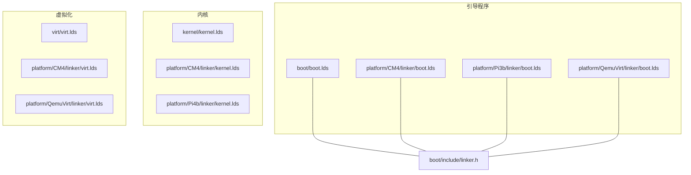
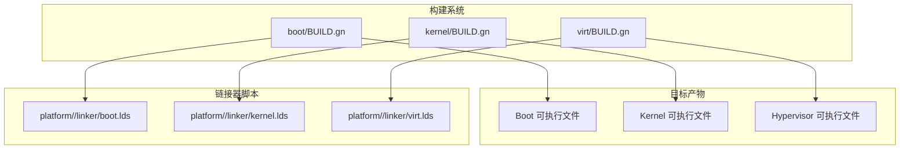
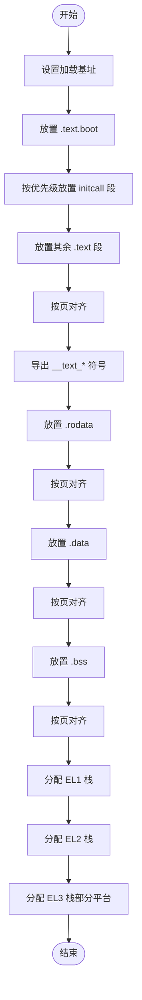
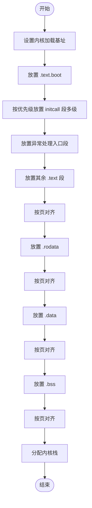
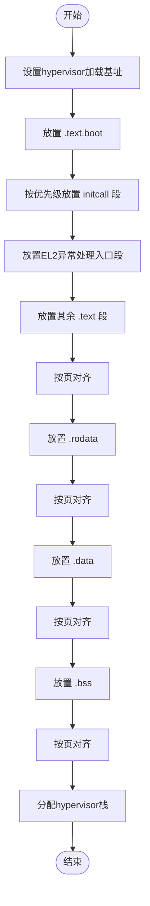
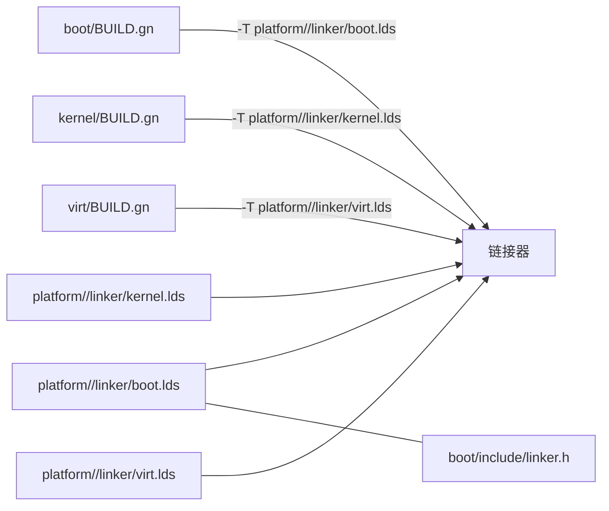

# 链接器脚本

<cite>
**本文引用的文件**
- [boot/boot.lds](file://boot/boot.lds)
- [kernel/kernel.lds](file://kernel/kernel.lds)
- [virt/virt.lds](file://virt/virt.lds)
- [platform/CM4/linker/boot.lds](file://platform/CM4/linker/boot.lds)
- [platform/CM4/linker/kernel.lds](file://platform/CM4/linker/kernel.lds)
- [platform/CM4/linker/virt.lds](file://platform/CM4/linker/virt.lds)
- [platform/Pi3b/linker/boot.lds](file://platform/Pi3b/linker/boot.lds)
- [platform/Pi4b/linker/kernel.lds](file://platform/Pi4b/linker/kernel.lds)
- [platform/QemuVirt/linker/boot.lds](file://platform/QemuVirt/linker/boot.lds)
- [platform/QemuVirt/linker/virt.lds](file://platform/QemuVirt/linker/virt.lds)
- [boot/include/linker.h](file://boot/include/linker.h)
- [uapps/devmgr/devmgr.lds](file://uapps/devmgr/devmgr.lds)
- [uapps/fsmgr/fsmgr.lds](file://uapps/fsmgr/fsmgr.lds)
- [boot/BUILD.gn](file://boot/BUILD.gn)
- [kernel/BUILD.gn](file://kernel/BUILD.gn)
- [virt/BUILD.gn](file://virt/BUILD.gn)
</cite>

## 目录
1. [引言](#引言)
2. [项目结构](#项目结构)
3. [核心组件](#核心组件)
4. [架构总览](#架构总览)
5. [详细组件分析](#详细组件分析)
6. [依赖关系分析](#依赖关系分析)
7. [性能与内存布局优化](#性能与内存布局优化)
8. [故障排查指南](#故障排查指南)
9. [结论](#结论)
10. [附录](#附录)

## 引言
本文件面向TranquilOS在ARM64架构下的链接器脚本（.lds）进行系统性说明，覆盖以下主题：
- ARM64链接器脚本语法与内存布局定义
- 内核、引导程序与虚拟化模块的链接器脚本差异
- 内存区域划分、符号链接规则与地址重定位机制
- 平台特定链接器脚本的配置与定制方法
- 链接过程优化与内存布局调整技巧
- 常见错误与解决方案

目标读者包括链接器专家与系统集成工程师，既提供深入的技术细节，也提供可操作的配置建议。

## 项目结构
TranquilOS按“功能域+平台”组织链接器脚本：
- 顶层：引导程序、内核、虚拟化模块各自拥有独立的链接器脚本
- 平台目录：每个平台（如CM4、Pi3b、Pi4b、QemuVirt）提供对应的boot/kernel/virt.lds
- 公共头文件：boot/include/linker.h提供公共常量（如引导程序基址）

**图示来源**
- [boot/boot.lds](file://boot/boot.lds#L1-L73)
- [platform/CM4/linker/boot.lds](file://platform/CM4/linker/boot.lds#L1-L73)
- [platform/Pi3b/linker/boot.lds](file://platform/Pi3b/linker/boot.lds#L1-L77)
- [platform/QemuVirt/linker/boot.lds](file://platform/QemuVirt/linker/boot.lds#L1-L75)
- [kernel/kernel.lds](file://kernel/kernel.lds#L1-L73)
- [platform/CM4/linker/kernel.lds](file://platform/CM4/linker/kernel.lds#L1-L73)
- [platform/Pi4b/linker/kernel.lds](file://platform/Pi4b/linker/kernel.lds#L1-L73)
- [virt/virt.lds](file://virt/virt.lds#L1-L70)
- [platform/CM4/linker/virt.lds](file://platform/CM4/linker/virt.lds#L1-L70)
- [platform/QemuVirt/linker/virt.lds](file://platform/QemuVirt/linker/virt.lds#L1-L70)
- [boot/include/linker.h](file://boot/include/linker.h#L1-L6)

**章节来源**
- [boot/boot.lds](file://boot/boot.lds#L1-L73)
- [kernel/kernel.lds](file://kernel/kernel.lds#L1-L73)
- [virt/virt.lds](file://virt/virt.lds#L1-L70)
- [platform/CM4/linker/boot.lds](file://platform/CM4/linker/boot.lds#L1-L73)
- [platform/Pi3b/linker/boot.lds](file://platform/Pi3b/linker/boot.lds#L1-L77)
- [platform/Pi4b/linker/kernel.lds](file://platform/Pi4b/linker/kernel.lds#L1-L73)
- [platform/QemuVirt/linker/boot.lds](file://platform/QemuVirt/linker/boot.lds#L1-L75)
- [platform/QemuVirt/linker/virt.lds](file://platform/QemuVirt/linker/virt.lds#L1-L70)
- [boot/include/linker.h](file://boot/include/linker.h#L1-L6)

## 核心组件
- 引导程序链接器脚本：负责将引导阶段代码放置到平台指定的起始地址，并预留EL1/EL2栈空间；部分平台还包含EL3栈。
- 内核链接器脚本：定义内核文本、只读数据、数据段、BSS段及内核栈位置；包含异常处理入口段。
- 虚拟化模块链接器脚本：定义hypervisor文本、只读数据、数据段、BSS段及hypervisor栈位置；包含EL2异常处理入口段。
- 平台特定脚本：在不同硬件平台上对起始地址、栈大小等进行差异化配置。
- 公共头文件：提供引导程序基址等共享常量，便于统一管理。

**章节来源**
- [boot/boot.lds](file://boot/boot.lds#L1-L73)
- [kernel/kernel.lds](file://kernel/kernel.lds#L1-L73)
- [virt/virt.lds](file://virt/virt.lds#L1-L70)
- [platform/CM4/linker/boot.lds](file://platform/CM4/linker/boot.lds#L1-L73)
- [platform/Pi3b/linker/boot.lds](file://platform/Pi3b/linker/boot.lds#L1-L77)
- [platform/QemuVirt/linker/boot.lds](file://platform/QemuVirt/linker/boot.lds#L1-L75)
- [boot/include/linker.h](file://boot/include/linker.h#L1-L6)

## 架构总览
下图展示各组件与平台脚本的关系，以及构建系统如何选择对应链接器脚本。

**图示来源**
- [boot/BUILD.gn](file://boot/BUILD.gn#L37-L40)
- [kernel/BUILD.gn](file://kernel/BUILD.gn#L34-L37)
- [virt/BUILD.gn](file://virt/BUILD.gn#L37-L40)

## 详细组件分析

### 引导程序链接器脚本（boot.lds）
- 起始地址与入口：通过ENTRY(_start)设置入口点；. = 指令设定加载基址。
- 文本段与初始化调用：将.text.boot与initcall相关段按优先级顺序排列，确保启动时序正确。
- 数据段与BSS：分别按rodata/data/bss顺序布局，并以页对齐。
- 栈区：EL1/EL2栈（部分平台含EL3）紧随BSS之后，每段分配固定大小。
- 符号导出：导出__text_start/__text_end、__rodata_start、__data_start、__bss_start、__bss_end等用于运行时初始化。

**图示来源**
- [boot/boot.lds](file://boot/boot.lds#L5-L72)
- [platform/CM4/linker/boot.lds](file://platform/CM4/linker/boot.lds#L5-L72)
- [platform/Pi3b/linker/boot.lds](file://platform/Pi3b/linker/boot.lds#L5-L77)
- [platform/QemuVirt/linker/boot.lds](file://platform/QemuVirt/linker/boot.lds#L5-L75)

**章节来源**
- [boot/boot.lds](file://boot/boot.lds#L1-L73)
- [platform/CM4/linker/boot.lds](file://platform/CM4/linker/boot.lds#L1-L73)
- [platform/Pi3b/linker/boot.lds](file://platform/Pi3b/linker/boot.lds#L1-L77)
- [platform/QemuVirt/linker/boot.lds](file://platform/QemuVirt/linker/boot.lds#L1-L75)

### 内核链接器脚本（kernel.lds）
- 起始地址与入口：ENTRY(_start)，加载基址远高于引导程序，适配内核地址空间。
- 初始化调用：包含更多优先级层级（lv0-lv7），确保复杂内核初始化顺序。
- 异常处理：显式保留异常处理入口段，保证EL1异常路径可用。
- 栈区：仅分配内核栈，紧随BSS之后。
- 符号导出：导出__kernel_*系列符号，供内核初始化使用。

**图示来源**
- [kernel/kernel.lds](file://kernel/kernel.lds#L3-L72)
- [platform/CM4/linker/kernel.lds](file://platform/CM4/linker/kernel.lds#L3-L72)
- [platform/Pi4b/linker/kernel.lds](file://platform/Pi4b/linker/kernel.lds#L3-L72)

**章节来源**
- [kernel/kernel.lds](file://kernel/kernel.lds#L1-L73)
- [platform/CM4/linker/kernel.lds](file://platform/CM4/linker/kernel.lds#L1-L73)
- [platform/Pi4b/linker/kernel.lds](file://platform/Pi4b/linker/kernel.lds#L1-L73)

### 虚拟化模块链接器脚本（virt.lds）
- 起始地址与入口：ENTRY(_start)，加载基址位于平台特定区间。
- 初始化调用：包含initcall段，支持hypervisor早期初始化。
- 异常处理：显式保留EL2异常处理入口段。
- 栈区：分配hypervisor栈，紧随BSS之后。
- 符号导出：导出__hypervisor_*系列符号，供hypervisor初始化使用。

**图示来源**
- [virt/virt.lds](file://virt/virt.lds#L5-L69)
- [platform/CM4/linker/virt.lds](file://platform/CM4/linker/virt.lds#L5-L69)
- [platform/QemuVirt/linker/virt.lds](file://platform/QemuVirt/linker/virt.lds#L5-L69)

**章节来源**
- [virt/virt.lds](file://virt/virt.lds#L1-L70)
- [platform/CM4/linker/virt.lds](file://platform/CM4/linker/virt.lds#L1-L70)
- [platform/QemuVirt/linker/virt.lds](file://platform/QemuVirt/linker/virt.lds#L1-L70)

### 平台特定差异
- 加载基址：不同平台的起始地址不同，例如CM4、Pi3b、Pi4b、QemuVirt各有差异。
- 栈数量：Pi3b平台在引导阶段额外分配EL3栈，其他平台通常为EL1/EL2。
- 异常入口：内核与虚拟化脚本分别包含EL1/EL2异常入口段，确保对应特权级的异常处理可用。

**章节来源**
- [platform/CM4/linker/boot.lds](file://platform/CM4/linker/boot.lds#L5-L72)
- [platform/Pi3b/linker/boot.lds](file://platform/Pi3b/linker/boot.lds#L5-L77)
- [platform/Pi4b/linker/kernel.lds](file://platform/Pi4b/linker/kernel.lds#L3-L72)
- [platform/QemuVirt/linker/boot.lds](file://platform/QemuVirt/linker/boot.lds#L5-L75)
- [platform/QemuVirt/linker/virt.lds](file://platform/QemuVirt/linker/virt.lds#L5-L69)

### 公共头文件与引导程序基址
- 公共头文件提供引导程序基址常量，便于在多个平台脚本中复用。
- 引导程序脚本通过#include引入该头文件，实现跨平台一致性。

**章节来源**
- [boot/include/linker.h](file://boot/include/linker.h#L1-L6)
- [platform/QemuVirt/linker/boot.lds](file://platform/QemuVirt/linker/boot.lds#L1-L1)
- [platform/CM4/linker/boot.lds](file://platform/CM4/linker/boot.lds#L1-L1)
- [platform/Pi3b/linker/boot.lds](file://platform/Pi3b/linker/boot.lds#L1-L1)

### 用户态应用链接器脚本示例
- 设备管理器与文件系统管理器等用户态应用同样采用.lods脚本，但不包含异常处理段，主要用于设备/文件系统初始化段的特殊放置与对齐。

**章节来源**
- [uapps/devmgr/devmgr.lds](file://uapps/devmgr/devmgr.lds#L1-L41)
- [uapps/fsmgr/fsmgr.lds](file://uapps/fsmgr/fsmgr.lds#L1-L41)

## 依赖关系分析
- 构建系统通过BUILD.gn的ldflags选项将目标平台的链接器脚本传递给链接器。
- 引导程序、内核、虚拟化模块分别绑定到各自的平台脚本，确保加载地址与内存布局一致。
- 公共头文件被引导程序脚本包含，形成跨平台的常量共享。

**图示来源**
- [boot/BUILD.gn](file://boot/BUILD.gn#L37-L40)
- [kernel/BUILD.gn](file://kernel/BUILD.gn#L34-L37)
- [virt/BUILD.gn](file://virt/BUILD.gn#L37-L40)
- [boot/include/linker.h](file://boot/include/linker.h#L1-L6)

**章节来源**
- [boot/BUILD.gn](file://boot/BUILD.gn#L37-L40)
- [kernel/BUILD.gn](file://kernel/BUILD.gn#L34-L37)
- [virt/BUILD.gn](file://virt/BUILD.gn#L37-L40)

## 性能与内存布局优化
- 对齐策略：所有段均以页对齐，减少TLB抖动并提升访问效率。
- 初始化调用分层：通过多级initcall段，将启动任务拆分为可调度的优先级，缩短关键路径时间。
- 栈空间规划：为不同特权级预留独立栈，避免上下文切换时的栈溢出风险。
- 地址空间隔离：内核与引导程序采用高地址加载，降低与外设映射冲突的概率。
- 平台定制：针对不同SoC的内存特性，调整加载基址与栈大小，确保在目标硬件上稳定运行。

[本节为通用优化建议，无需具体文件分析]

## 故障排查指南
- 符号未定义或重复定义
  - 现象：链接时报错提示未解析符号或重复定义。
  - 排查：检查是否遗漏了必要的源文件或段；确认initcall段的放置顺序与符号导出是否一致。
  - 参考：导出符号列表与段落顺序定义。
  - 参考文件
    - [boot/boot.lds](file://boot/boot.lds#L7-L35)
    - [kernel/kernel.lds](file://kernel/kernel.lds#L5-L38)
    - [virt/virt.lds](file://virt/virt.lds#L7-L34)

- 加载地址冲突
  - 现象：不同模块加载地址重叠导致运行时异常。
  - 排查：核对各平台脚本的起始地址；确保引导程序、内核、虚拟化模块的基址不重叠。
  - 参考：平台脚本的加载基址定义。
  - 参考文件
    - [platform/CM4/linker/boot.lds](file://platform/CM4/linker/boot.lds#L6-L6)
    - [platform/Pi3b/linker/boot.lds](file://platform/Pi3b/linker/boot.lds#L6-L6)
    - [platform/Pi4b/linker/kernel.lds](file://platform/Pi4b/linker/kernel.lds#L4-L4)
    - [platform/QemuVirt/linker/boot.lds](file://platform/QemuVirt/linker/boot.lds#L6-L6)
    - [platform/QemuVirt/linker/virt.lds](file://platform/QemuVirt/linker/virt.lds#L6-L6)

- 栈溢出或栈越界
  - 现象：异常或中断处理时发生栈溢出。
  - 排查：确认栈起始地址与大小配置；检查是否在高特权级段中使用了过大的局部变量。
  - 参考：栈段的起始与结束符号定义。
  - 参考文件
    - [boot/boot.lds](file://boot/boot.lds#L60-L68)
    - [platform/CM4/linker/boot.lds](file://platform/CM4/linker/boot.lds#L60-L68)
    - [platform/Pi3b/linker/boot.lds](file://platform/Pi3b/linker/boot.lds#L60-L71)
    - [kernel/kernel.lds](file://kernel/kernel.lds#L65-L69)
    - [virt/virt.lds](file://virt/virt.lds#L61-L65)

- 平台脚本不匹配
  - 现象：构建时链接器找不到对应平台脚本或参数传递错误。
  - 排查：确认BUILD.gn中ldflags的-T参数指向正确的平台脚本路径。
  - 参考文件
    - [boot/BUILD.gn](file://boot/BUILD.gn#L37-L40)
    - [kernel/BUILD.gn](file://kernel/BUILD.gn#L34-L37)
    - [virt/BUILD.gn](file://virt/BUILD.gn#L37-L40)

## 结论
TranquilOS在ARM64平台上的链接器脚本遵循统一的布局规范：以页对齐的段组织、明确的符号导出、分层的初始化调用与多特权级栈规划。通过平台化的脚本定制，实现了在不同硬件上的稳定部署。结合构建系统的参数注入，可灵活切换目标平台并保持一致的链接行为。对于系统集成者而言，理解这些脚本的结构与符号语义，是实现可靠内存布局与高效启动流程的关键。

[本节为总结性内容，无需具体文件分析]

## 附录
- 关键符号速览
  - 引导程序：__text_start/__text_end、__rodata_start、__data_start、__bss_start/__bss_end、EL1/EL2/EL3栈相关符号
  - 内核：__text_start/__text_end、__rodata_start、__data_start、__bss_start/__bss_end、内核栈相关符号
  - 虚拟化：__text_start/__text_end、__rodata_start、__data_start、__bss_start/__bss_end、hypervisor栈相关符号
- 平台脚本路径
  - 引导程序：platform/<platform>/linker/boot.lds
  - 内核：platform/<platform>/linker/kernel.lds
  - 虚拟化：platform/<platform>/linker/virt.lds

**章节来源**
- [boot/boot.lds](file://boot/boot.lds#L7-L69)
- [kernel/kernel.lds](file://kernel/kernel.lds#L5-L70)
- [virt/virt.lds](file://virt/virt.lds#L7-L66)
- [platform/CM4/linker/boot.lds](file://platform/CM4/linker/boot.lds#L7-L71)
- [platform/Pi3b/linker/boot.lds](file://platform/Pi3b/linker/boot.lds#L7-L76)
- [platform/Pi4b/linker/kernel.lds](file://platform/Pi4b/linker/kernel.lds#L5-L71)
- [platform/QemuVirt/linker/boot.lds](file://platform/QemuVirt/linker/boot.lds#L7-L74)
- [platform/QemuVirt/linker/virt.lds](file://platform/QemuVirt/linker/virt.lds#L7-L68)