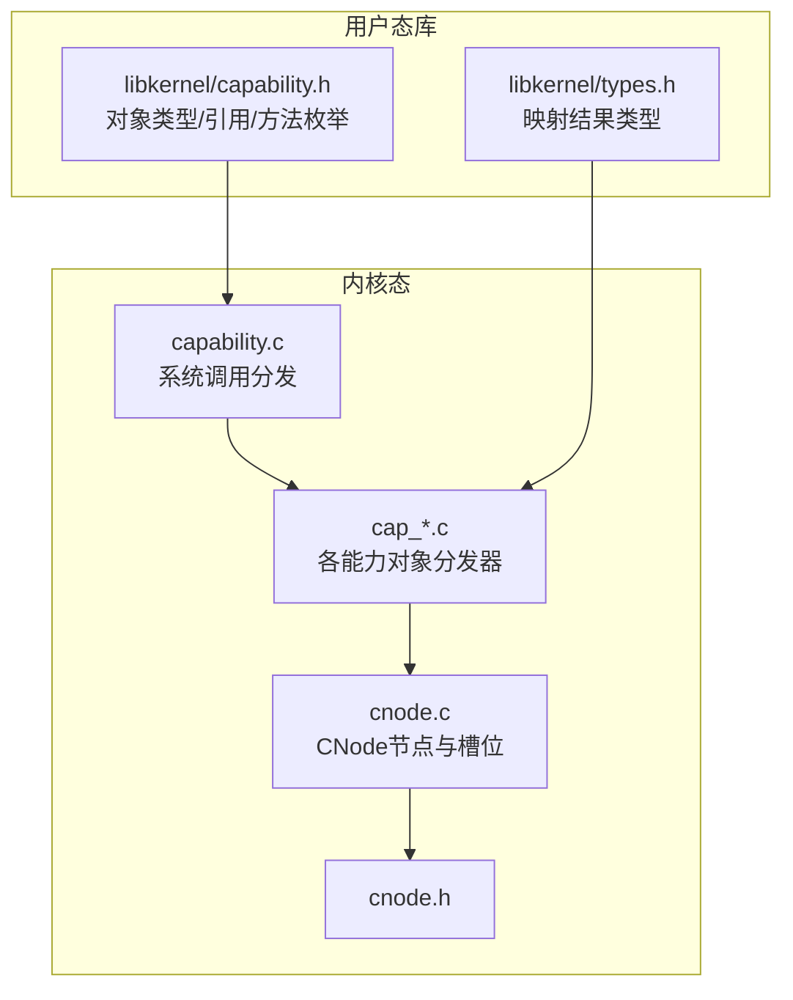
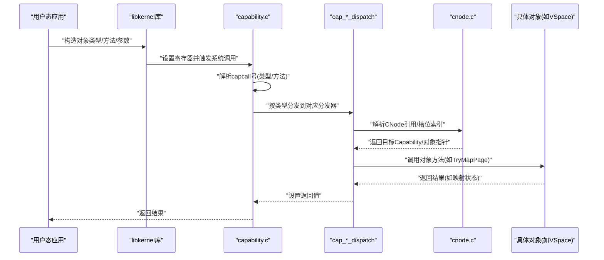
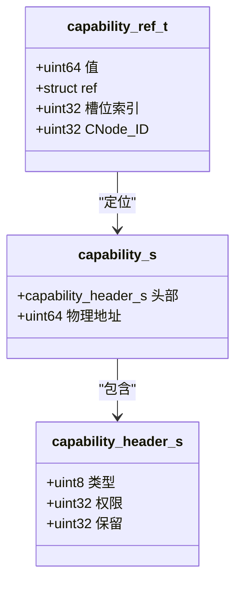
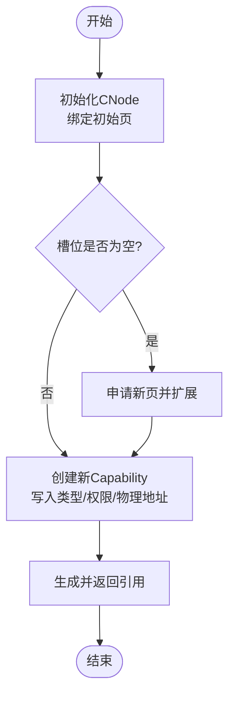
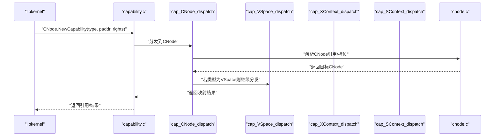
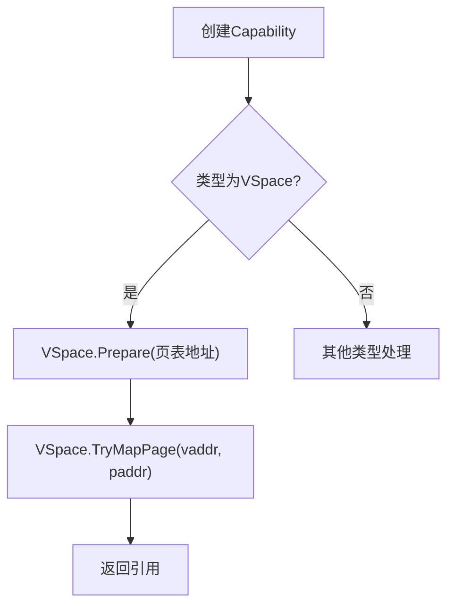
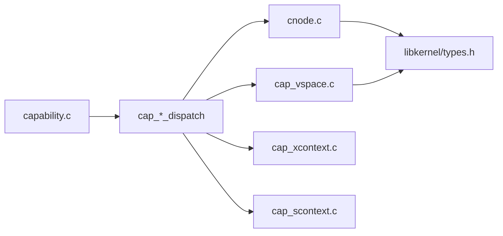

# Capability系统设计

<cite>
**本文档引用的文件**
- [capability.c](file://kernel/capability/capability.c)
- [capability.h](file://kernel/include/capability/capability.h)
- [cnode.c](file://kernel/capability/cnode.c)
- [cnode.h](file://kernel/include/capability/cnode.h)
- [cap_cnode.c](file://kernel/capability/cap_cnode.c)
- [cap_xcontext.c](file://kernel/capability/cap_xcontext.c)
- [cap_scontext.c](file://kernel/capability/cap_scontext.c)
- [cap_vspace.c](file://kernel/capability/cap_vspace.c)
- [capability.h](file://ulibs/include/libkernel/capability.h)
- [types.h](file://ulibs/include/libkernel/types.h)
</cite>

## 目录
1. [引言](#引言)
2. [项目结构](#项目结构)
3. [核心组件](#核心组件)
4. [架构总览](#架构总览)
5. [详细组件分析](#详细组件分析)
6. [依赖关系分析](#依赖关系分析)
7. [性能考量](#性能考量)
8. [故障排查指南](#故障排查指南)
9. [结论](#结论)
10. [附录](#附录)

## 引言
本文件面向TranquilOS的Capability系统，系统化阐述其作为细粒度权限管理机制的设计与实现。Capability以“持有即授权”的思想，将对象访问权以可传递的令牌形式在用户态与内核态之间流转，并通过CNode（Capability Node）统一组织与存储各类Capability。本文从Capability结构、CNode组织方式、权限验证与方法分发、用户态/内核态传递机制、类型安全的系统调用实现、典型操作示例与安全策略，以及与传统权限模型的对比优势与局限性等方面进行深入解析。

## 项目结构
Capability系统主要分布在内核态的capability目录与用户态库的libkernel目录中：
- 内核态：capability.c负责系统调用入口分发；各能力对象的分发器实现位于cap_*.c；CNode的节点与槽位管理位于cnode.c与cnode.h。
- 用户态库：capability.h定义对象类型、引用格式与方法枚举；types.h提供内存映射结果等类型。

**图表来源**
- [capability.c](file://kernel/capability/capability.c#L1-L58)
- [cnode.c](file://kernel/capability/cnode.c#L1-L95)
- [cnode.h](file://kernel/include/capability/cnode.h#L1-L29)
- [capability.h](file://ulibs/include/libkernel/capability.h#L1-L141)
- [types.h](file://ulibs/include/libkernel/types.h#L1-L76)

**章节来源**
- [capability.c](file://kernel/capability/capability.c#L1-L58)
- [capability.h](file://kernel/include/capability/capability.h#L1-L26)
- [cnode.c](file://kernel/capability/cnode.c#L1-L95)
- [cnode.h](file://kernel/include/capability/cnode.h#L1-L29)
- [capability.h](file://ulibs/include/libkernel/capability.h#L1-L141)
- [types.h](file://ulibs/include/libkernel/types.h#L1-L76)

## 核心组件
- Capability结构与头部
  - Capability由头部与物理地址组成，头部包含对象类型与权限位。该设计使每个Capability既携带元数据（类型、权限），又指向内核对象的物理地址，便于快速定位与校验。
  - 权限位使用32位字段，支持按位控制不同操作权限，例如创建、销毁等。
- CNode（Capability Node）
  - CNode是Capability的容器，内部以目录数组（darray）组织槽位，每个槽位存放一个Capability。CNode还维护自身唯一ID，用于引用定位。
  - 提供初始化、扩展页、创建新Capability、根据引用获取CNode等接口。
- 能力对象分发器
  - 按对象类型（如CNode、XContext、SContext、VSpace等）划分独立的分发器，每个分发器负责处理对应对象的方法调用。
  - 分发器通过从执行上下文中读取寄存器参数，解析出目标CNode引用、目标对象引用与方法号，再执行具体逻辑。

**章节来源**
- [capability.h](file://kernel/include/capability/capability.h#L9-L21)
- [cnode.h](file://kernel/include/capability/cnode.h#L11-L14)
- [cnode.c](file://kernel/capability/cnode.c#L9-L13)
- [capability.c](file://kernel/capability/capability.c#L14-L54)

## 架构总览
下图展示从用户态发起Capability调用到内核态分发与执行的关键路径，体现类型安全与细粒度权限控制：

**图表来源**
- [capability.c](file://kernel/capability/capability.c#L14-L54)
- [cap_cnode.c](file://kernel/capability/cap_cnode.c#L163-L184)
- [cap_vspace.c](file://kernel/capability/cap_vspace.c#L213-L243)
- [cnode.c](file://kernel/capability/cnode.c#L66-L90)

**章节来源**
- [capability.c](file://kernel/capability/capability.c#L14-L54)
- [cap_cnode.c](file://kernel/capability/cap_cnode.c#L163-L184)
- [cap_vspace.c](file://kernel/capability/cap_vspace.c#L213-L243)
- [cnode.c](file://kernel/capability/cnode.c#L66-L90)

## 详细组件分析

### Capability结构与引用计数
- 结构定义
  - 头部包含对象类型与权限位，物理地址指向内核对象实例。这种设计使Capability既是“令牌”，也是“句柄”。
- 引用计数与定位
  - 引用采用联合体封装，高32位为CNode ID，低32位为槽位索引，形成全局唯一的定位标识。通过该引用可在当前或指定CNode中定位到具体Capability。
- 权限验证
  - 当前分发器存在权限检查占位，后续应基于Capability头部的权限位对调用方法进行校验，确保最小权限原则。

**图表来源**
- [capability.h](file://kernel/include/capability/capability.h#L11-L20)
- [capability.h](file://ulibs/include/libkernel/capability.h#L44-L50)

**章节来源**
- [capability.h](file://kernel/include/capability/capability.h#L9-L21)
- [capability.h](file://ulibs/include/libkernel/capability.h#L44-L50)

### CNode（Capability Node）设计与实现
- 组织方式
  - CNode以目录数组管理槽位，支持动态扩展页，从而实现可增长的Capability存储空间。
- 关键流程
  - 初始化：为CNode分配并绑定初始页，建立槽位集合。
  - 扩展：当槽位不足时，向页分配器申请新页并挂接到槽位集合。
  - 创建Capability：在可用槽位写入新的Capability（类型、权限、物理地址），返回引用。
  - 获取CNode：根据引用解析目标CNode，支持根CNode与跨CNode引用。
- 安全要点
  - 在创建/扩展前检查页分配器与空闲槽位，失败时触发异常，避免悬挂状态。
  - 对跨CNode引用进行类型校验，防止误用非CNode类型的Capability。

**图表来源**
- [cnode.c](file://kernel/capability/cnode.c#L9-L13)
- [cnode.c](file://kernel/capability/cnode.c#L15-L21)
- [cnode.c](file://kernel/capability/cnode.c#L23-L59)

**章节来源**
- [cnode.c](file://kernel/capability/cnode.c#L9-L13)
- [cnode.c](file://kernel/capability/cnode.c#L15-L21)
- [cnode.c](file://kernel/capability/cnode.c#L23-L59)
- [cnode.h](file://kernel/include/capability/cnode.h#L11-L14)

### 能力对象分发与类型安全系统调用
- 系统调用入口
  - capability.c解析来自用户态的capcall号，提取对象类型与方法号，按类型分发到对应分发器。
- CNode分发器
  - 支持创建、新建Capability、准备目标CNode、扩展目标CNode等方法。在新建Capability后，根据类型进一步调用相应对象的创建流程。
- VSpace分发器
  - 支持准备页表、尝试映射单页、尝试映射范围、扩展页表、取消映射单页/范围等。所有操作均通过CNode引用定位目标VSpace对象并执行。
- XContext/SContext分发器
  - XContext负责初始化执行上下文（设置入口与栈指针）；SContext负责设置调度上下文的CNode/VSpace/XContext/回调端点等，并支持调度加入与亲和调度。

**图表来源**
- [capability.c](file://kernel/capability/capability.c#L14-L54)
- [cap_cnode.c](file://kernel/capability/cap_cnode.c#L163-L184)
- [cap_vspace.c](file://kernel/capability/cap_vspace.c#L213-L243)
- [cnode.c](file://kernel/capability/cnode.c#L66-L90)

**章节来源**
- [capability.c](file://kernel/capability/capability.c#L14-L54)
- [cap_cnode.c](file://kernel/capability/cap_cnode.c#L23-L91)
- [cap_vspace.c](file://kernel/capability/cap_vspace.c#L45-L85)
- [cap_xcontext.c](file://kernel/capability/cap_xcontext.c#L9-L48)
- [cap_scontext.c](file://kernel/capability/cap_scontext.c#L19-L62)

### 用户态与内核态传递机制
- 引用传递
  - 用户态通过libkernel提供的引用格式（CNode ID + 槽位索引）在进程间传递Capability。该引用在内核侧解析为物理地址，实现类型安全的对象访问。
- 方法调用约定
  - 各对象方法通过寄存器传递参数，分发器按约定顺序读取，确保调用语义清晰且高效。
- 类型安全
  - 每次操作前进行类型校验（如目标Capability必须为CNode/VSpace等），防止越权或误用。

**章节来源**
- [capability.h](file://ulibs/include/libkernel/capability.h#L44-L50)
- [capability.c](file://kernel/capability/capability.c#L14-L54)
- [cap_cnode.c](file://kernel/capability/cap_cnode.c#L100-L126)

### 典型Capability操作示例与安全策略
- 示例一：创建并配置VSpace
  - 步骤：CNode.NewCapability -> VSpace.Prepare -> VSpace.TryMapPage -> 返回引用。
  - 安全策略：仅在具备相应权限位时允许创建与映射；映射前校验页表有效性与未映射状态。
- 示例二：初始化线程执行上下文
  - 步骤：CNode.NewCapability -> XContext.Init(entry, sp)。
  - 安全策略：仅允许已创建的XContext被初始化；入口与栈指针需满足对齐与范围要求。
- 示例三：设置调度上下文
  - 步骤：SContext.SetCNode/SContext.SetVSpace/SContext.SetXContext/SContext.SetUpcall -> SContext.Schedule。
  - 安全策略：仅允许已创建的SContext被设置；关联对象必须为对应类型。

**图表来源**
- [cap_cnode.c](file://kernel/capability/cap_cnode.c#L23-L91)
- [cap_vspace.c](file://kernel/capability/cap_vspace.c#L15-L85)

**章节来源**
- [cap_cnode.c](file://kernel/capability/cap_cnode.c#L23-L91)
- [cap_vspace.c](file://kernel/capability/cap_vspace.c#L15-L85)
- [cap_xcontext.c](file://kernel/capability/cap_xcontext.c#L16-L48)
- [cap_scontext.c](file://kernel/capability/cap_scontext.c#L19-L62)

### 与传统权限模型的对比
- 优势
  - 细粒度权限：每个Capability携带权限位，按位控制，最小权限原则更易实现。
  - 可传递性：Capability可安全地在进程间传递，避免集中式权限中心带来的攻击面。
  - 类型安全：通过类型校验与引用格式，减少越权与误用风险。
- 局限性
  - 复杂性：需要在用户态维护引用与在内核态解析，增加开发与调试复杂度。
  - 性能开销：每次调用需进行类型校验与引用解析，可能带来额外开销。
  - 权限位设计：权限位需谨慎设计，避免过度授权或权限缺失。

## 依赖关系分析
- 组件耦合
  - capability.c依赖各能力对象分发器；cap_*_dispatch依赖cnode.c进行引用解析；VSpace等对象依赖地址空间管理模块。
- 外部依赖
  - 页分配器用于CNode扩展；日志与异常模块用于错误处理；调度器用于SContext调度。
- 循环依赖
  - 当前实现未发现循环依赖；分发器与CNode解耦良好。

**图表来源**
- [capability.c](file://kernel/capability/capability.c#L1-L58)
- [cap_cnode.c](file://kernel/capability/cap_cnode.c#L1-L184)
- [cap_vspace.c](file://kernel/capability/cap_vspace.c#L1-L243)
- [cap_xcontext.c](file://kernel/capability/cap_xcontext.c#L1-L68)
- [cap_scontext.c](file://kernel/capability/cap_scontext.c#L1-L462)
- [types.h](file://ulibs/include/libkernel/types.h#L1-L76)

**章节来源**
- [capability.c](file://kernel/capability/capability.c#L1-L58)
- [cap_cnode.c](file://kernel/capability/cap_cnode.c#L1-L184)
- [cap_vspace.c](file://kernel/capability/cap_vspace.c#L1-L243)
- [cap_xcontext.c](file://kernel/capability/cap_xcontext.c#L1-L68)
- [cap_scontext.c](file://kernel/capability/cap_scontext.c#L1-L462)
- [types.h](file://ulibs/include/libkernel/types.h#L1-L76)

## 性能考量
- 槽位访问
  - CNode使用目录数组管理槽位，插入/查询为O(1)，但需注意缓存局部性与页分配带来的抖动。
- 页扩展
  - 扩展时一次性申请整页，降低频繁分配成本；建议在批量创建Capability时预估容量，减少扩展次数。
- 映射操作
  - VSpace映射/取消映射涉及页表更新，建议批量操作并避免频繁切换地址空间，减少TLB抖动。
- 分发器
  - 分发器逻辑简单，寄存器读取开销低；建议在用户态聚合调用，减少系统调用次数。

## 故障排查指南
- 常见问题
  - CNode为空或无空闲槽位：检查是否正确扩展或引用是否有效。
  - 非CNode类型引用：确认引用的目标Capability类型是否为CNode。
  - 地址空间为空：确认VSpace对象已正确创建与准备。
  - 权限不足：检查Capability头部权限位是否包含所需操作。
- 排查步骤
  - 使用日志输出定位分发器与CNode解析阶段的问题。
  - 校验引用格式（CNode ID与槽位索引）与对象类型。
  - 检查页分配器状态与返回值。

**章节来源**
- [cnode.c](file://kernel/capability/cnode.c#L16-L21)
- [cnode.c](file://kernel/capability/cnode.c#L66-L90)
- [cap_vspace.c](file://kernel/capability/cap_vspace.c#L15-L43)
- [capability.c](file://kernel/capability/capability.c#L20-L21)

## 结论
TranquilOS的Capability系统以“持有即授权”的理念，结合CNode统一组织与类型安全的分发机制，实现了细粒度、可传递、可验证的权限模型。通过明确的引用格式、严格的类型校验与方法分发，系统在保证安全性的同时，也为用户态提供了清晰的编程模型。未来可在权限检查完善、批量操作优化与调试工具增强方面持续改进。

## 附录
- 关键枚举与常量
  - 对象类型：XContext、SContext、VSpace、CNode、Console、SysCtrl、Self、IpcEndPoint、UpcallEndPoint。
  - 引用格式：高32位为CNode ID，低32位为槽位索引；特殊常量CNODE_CURRENT_CREF表示当前CNode引用。
  - 方法枚举：按对象类型划分，涵盖创建、初始化、设置、调度、映射等常用操作。

**章节来源**
- [capability.h](file://ulibs/include/libkernel/capability.h#L6-L18)
- [capability.h](file://ulibs/include/libkernel/capability.h#L44-L50)
- [capability.h](file://ulibs/include/libkernel/capability.h#L52-L139)