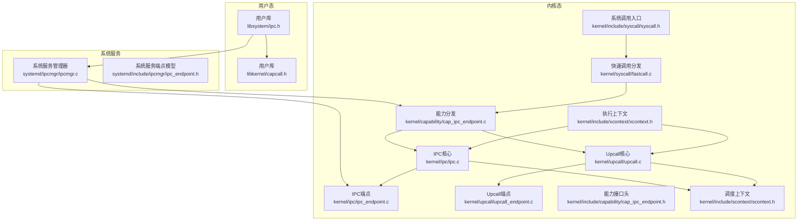
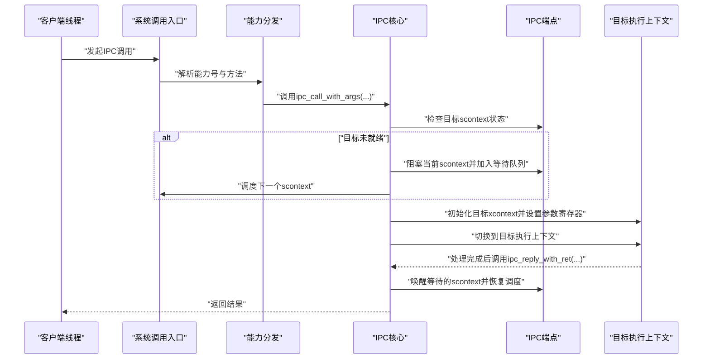
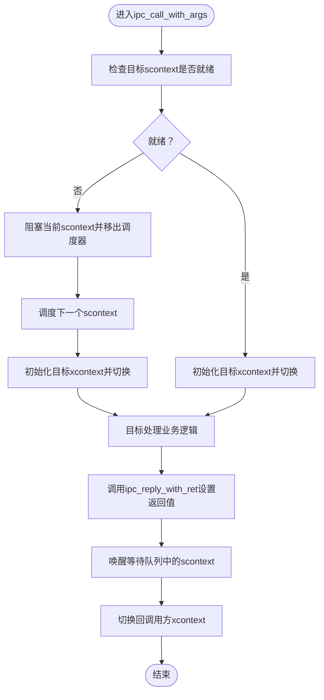
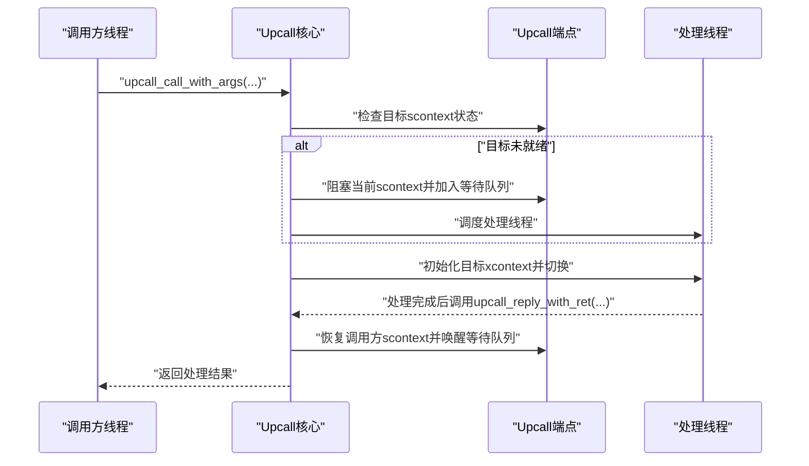
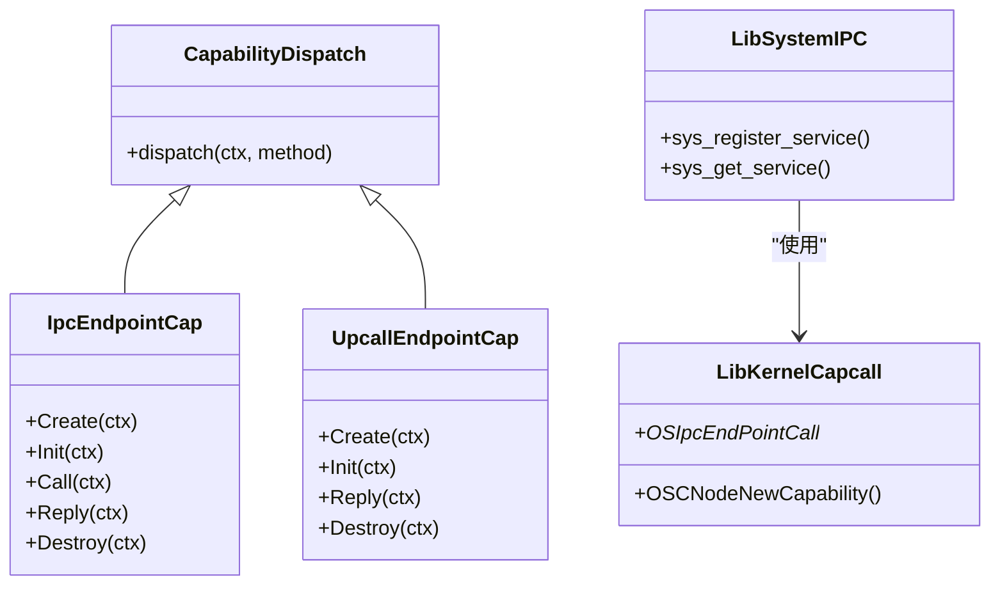
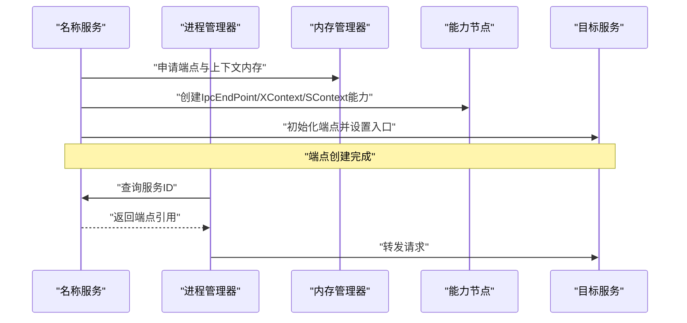
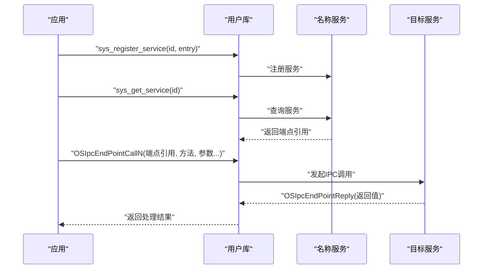
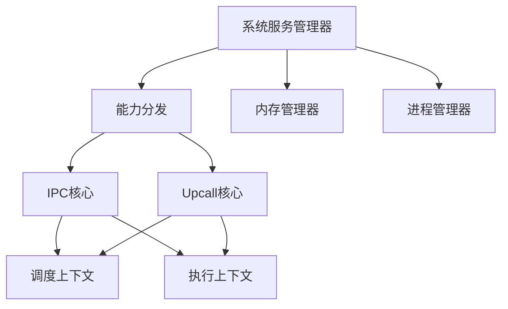

# IPC机制设计

<cite>
**本文档引用的文件**
- [kernel/include/ipc/ipc.h](file://kernel/include/ipc/ipc.h)
- [kernel/include/ipc/ipc_endpoint.h](file://kernel/include/ipc/ipc_endpoint.h)
- [kernel/ipc/ipc.c](file://kernel/ipc/ipc.c)
- [kernel/ipc/ipc_endpoint.c](file://kernel/ipc/ipc_endpoint.c)
- [kernel/include/upcall/upcall.h](file://kernel/include/upcall/upcall.h)
- [kernel/include/upcall/upcall_endpoint.h](file://kernel/include/upcall/upcall_endpoint.h)
- [kernel/upcall/upcall.c](file://kernel/upcall/upcall.c)
- [kernel/upcall/upcall_endpoint.c](file://kernel/upcall/upcall_endpoint.c)
- [kernel/include/capability/cap_ipc_endpoint.h](file://kernel/include/capability/cap_ipc_endpoint.h)
- [kernel/capability/cap_ipc_endpoint.c](file://kernel/capability/cap_ipc_endpoint.c)
- [kernel/include/capability/cap_upcall_endpoint.h](file://kernel/include/capability/cap_upcall_endpoint.h)
- [kernel/capability/cap_upcall_endpoint.c](file://kernel/capability/cap_upcall_endpoint.c)
- [kernel/systemd/include/ipcmgr/ipcmgr.h](file://kernel/systemd/include/ipcmgr/ipcmgr.h)
- [kernel/systemd/include/ipcmgr/ipc_endpoint.h](file://kernel/systemd/include/ipcmgr/ipc_endpoint.h)
- [kernel/systemd/ipcmgr/ipcmgr.c](file://kernel/systemd/ipcmgr/ipcmgr.c)
- [ulibs/include/libsystem/ipc.h](file://ulibs/include/libsystem/ipc.h)
- [ulibs/include/libkernel/capcall.h](file://ulibs/include/libkernel/capcall.h)
- [kernel/include/xcontext/xcontext.h](file://kernel/include/xcontext/xcontext.h)
- [kernel/include/scontext/scontext.h](file://kernel/include/scontext/scontext.h)
- [kernel/include/syscall/syscall.h](file://kernel/include/syscall/syscall.h)
- [kernel/syscall/fastcall.c](file://kernel/syscall/fastcall.c)
</cite>

## 目录
1. [简介](#简介)
2. [项目结构](#项目结构)
3. [核心组件](#核心组件)
4. [架构总览](#架构总览)
5. [详细组件分析](#详细组件分析)
6. [依赖关系分析](#依赖关系分析)
7. [性能考虑](#性能考虑)
8. [故障排除指南](#故障排除指南)
9. [结论](#结论)
10. [附录](#附录)

## 简介
本文件面向TranquilOS的IPC机制设计，系统性阐述其“控制流立即切换”的新型IPC方式，对比传统内核进程间同步（socket、pipe、共享内存）在延迟、吞吐与实时性方面的差异与优势。文档覆盖IPC端点的创建与管理、消息传递实现原理、性能优化策略、Upcall异步通知与回调处理机制，并提供IPC使用示例、消息格式定义与错误处理机制，最后分析该机制对系统实时性与性能的影响。

## 项目结构
TranquilOS的IPC与Upcall机制由内核态与用户态协作完成：内核提供IPC端点与Upcall端点的数据结构、调度与上下文切换逻辑；系统服务负责端点注册与服务发现；用户态库通过能力调用封装IPC/Upcall的系统调用接口。

**图表来源**
- [kernel/ipc/ipc.c](file://kernel/ipc/ipc.c#L1-L114)
- [kernel/ipc/ipc_endpoint.c](file://kernel/ipc/ipc_endpoint.c#L1-L82)
- [kernel/upcall/upcall.c](file://kernel/upcall/upcall.c#L1-L95)
- [kernel/upcall/upcall_endpoint.c](file://kernel/upcall/upcall_endpoint.c#L1-L83)
- [kernel/capability/cap_ipc_endpoint.c](file://kernel/capability/cap_ipc_endpoint.c#L33-L145)
- [kernel/systemd/ipcmgr/ipcmgr.c](file://kernel/systemd/ipcmgr/ipcmgr.c#L1-L319)
- [ulibs/include/libsystem/ipc.h](file://ulibs/include/libsystem/ipc.h#L1-L73)
- [ulibs/include/libkernel/capcall.h](file://ulibs/include/libkernel/capcall.h#L1-L41)
- [kernel/include/xcontext/xcontext.h](file://kernel/include/xcontext/xcontext.h#L1-L24)
- [kernel/include/scontext/scontext.h](file://kernel/include/scontext/scontext.h#L1-L50)
- [kernel/include/syscall/syscall.h](file://kernel/include/syscall/syscall.h#L1-L8)
- [kernel/syscall/fastcall.c](file://kernel/syscall/fastcall.c#L1-L17)

**章节来源**
- [kernel/ipc/ipc.c](file://kernel/ipc/ipc.c#L1-L114)
- [kernel/ipc/ipc_endpoint.c](file://kernel/ipc/ipc_endpoint.c#L1-L82)
- [kernel/upcall/upcall.c](file://kernel/upcall/upcall.c#L1-L95)
- [kernel/upcall/upcall_endpoint.c](file://kernel/upcall/upcall_endpoint.c#L1-L83)
- [kernel/capability/cap_ipc_endpoint.c](file://kernel/capability/cap_ipc_endpoint.c#L33-L145)
- [kernel/systemd/ipcmgr/ipcmgr.c](file://kernel/systemd/ipcmgr/ipcmgr.c#L1-L319)
- [ulibs/include/libsystem/ipc.h](file://ulibs/include/libsystem/ipc.h#L1-L73)
- [ulibs/include/libkernel/capcall.h](file://ulibs/include/libkernel/capcall.h#L1-L41)
- [kernel/include/xcontext/xcontext.h](file://kernel/include/xcontext/xcontext.h#L1-L24)
- [kernel/include/scontext/scontext.h](file://kernel/include/scontext/scontext.h#L1-L50)
- [kernel/include/syscall/syscall.h](file://kernel/include/syscall/syscall.h#L1-L8)
- [kernel/syscall/fastcall.c](file://kernel/syscall/fastcall.c#L1-L17)

## 核心组件
- IPC端点与上下文切换
  - IPC端点结构体包含目标执行上下文、调度上下文、入口地址与栈指针等，支持阻塞等待队列与唤醒逻辑。
  - IPC调用通过立即切换到目标执行上下文并设置参数寄存器，调用方进入阻塞状态，由被调用方完成处理后通过回复函数唤醒调用方。
- Upcall端点与异常回调
  - Upcall端点用于异步通知与异常回调，调用方进入特定阻塞状态，被调用方处理完成后恢复原调用方上下文。
- 能力分发与系统调用
  - 内核通过能力对象分发IPC/Upcall方法，用户态通过封装的系统调用接口进行调用。
- 系统服务管理器
  - 负责为服务创建IPC端点、注册服务、提供服务发现与能力映射。

**章节来源**
- [kernel/include/ipc/ipc_endpoint.h](file://kernel/include/ipc/ipc_endpoint.h#L8-L25)
- [kernel/ipc/ipc_endpoint.c](file://kernel/ipc/ipc_endpoint.c#L7-L82)
- [kernel/include/ipc/ipc.h](file://kernel/include/ipc/ipc.h#L9-L13)
- [kernel/ipc/ipc.c](file://kernel/ipc/ipc.c#L9-L114)
- [kernel/include/upcall/upcall_endpoint.h](file://kernel/include/upcall/upcall_endpoint.h#L8-L25)
- [kernel/upcall/upcall_endpoint.c](file://kernel/upcall/upcall_endpoint.c#L8-L83)
- [kernel/include/upcall/upcall.h](file://kernel/include/upcall/upcall.h#L9-L13)
- [kernel/upcall/upcall.c](file://kernel/upcall/upcall.c#L8-L95)
- [kernel/include/capability/cap_ipc_endpoint.h](file://kernel/include/capability/cap_ipc_endpoint.h#L10-L12)
- [kernel/capability/cap_ipc_endpoint.c](file://kernel/capability/cap_ipc_endpoint.c#L124-L145)
- [kernel/systemd/include/ipcmgr/ipcmgr.h](file://kernel/systemd/include/ipcmgr/ipcmgr.h#L6-L15)
- [kernel/systemd/ipcmgr/ipcmgr.c](file://kernel/systemd/ipcmgr/ipcmgr.c#L22-L195)

## 架构总览
TranquilOS的IPC采用“控制流立即切换”模式：调用方在内核中直接切换到目标执行上下文，避免传统IPC在内核态复制与缓冲带来的额外开销；同时通过调度器维护阻塞队列与唤醒流程，确保并发安全与可调度性。Upcall机制则提供异步通知路径，用于异常或中断场景下的回调处理。

**图表来源**
- [kernel/ipc/ipc.c](file://kernel/ipc/ipc.c#L9-L114)
- [kernel/ipc/ipc_endpoint.c](file://kernel/ipc/ipc_endpoint.c#L27-L82)
- [kernel/include/capability/cap_ipc_endpoint.c](file://kernel/capability/cap_ipc_endpoint.c#L70-L119)
- [kernel/include/syscall/syscall.h](file://kernel/include/syscall/syscall.h#L6-L8)

**章节来源**
- [kernel/ipc/ipc.c](file://kernel/ipc/ipc.c#L9-L114)
- [kernel/ipc/ipc_endpoint.c](file://kernel/ipc/ipc_endpoint.c#L27-L82)
- [kernel/include/capability/cap_ipc_endpoint.c](file://kernel/capability/cap_ipc_endpoint.c#L70-L119)
- [kernel/include/syscall/syscall.h](file://kernel/include/syscall/syscall.h#L6-L8)

## 详细组件分析

### IPC端点与消息传递
- 数据结构
  - IPC端点包含目标执行上下文、调度上下文、入口地址、栈指针、调用者调度上下文以及等待队列。
- 初始化与阻塞
  - 初始化时记录入口地址与栈指针；当目标调度上下文非就绪状态时，当前调度上下文被阻塞并加入等待队列。
- 调用与切换
  - 调用时从当前执行上下文读取参数寄存器，初始化目标执行上下文并设置参数，随后切换到目标执行上下文。
- 回复与唤醒
  - 处理完成后通过回复函数设置调用方返回值，恢复调用方调度状态并唤醒等待队列中的其他调度上下文。

**图表来源**
- [kernel/ipc/ipc.c](file://kernel/ipc/ipc.c#L9-L114)
- [kernel/ipc/ipc_endpoint.c](file://kernel/ipc/ipc_endpoint.c#L27-L82)

**章节来源**
- [kernel/include/ipc/ipc_endpoint.h](file://kernel/include/ipc/ipc_endpoint.h#L8-L25)
- [kernel/ipc/ipc_endpoint.c](file://kernel/ipc/ipc_endpoint.c#L7-L82)
- [kernel/include/ipc/ipc.h](file://kernel/include/ipc/ipc.h#L9-L13)
- [kernel/ipc/ipc.c](file://kernel/ipc/ipc.c#L9-L114)

### Upcall机制设计
- 数据结构
  - Upcall端点与IPC端点类似，但阻塞状态与唤醒逻辑针对异常或异步通知场景。
- 调用与阻塞
  - 调用时目标scontext若非就绪，当前scontext进入特定阻塞状态并等待被调用方处理。
- 回复与恢复
  - 处理完成后根据返回值决定是否恢复原调用方上下文，并唤醒等待队列。

**图表来源**
- [kernel/upcall/upcall.c](file://kernel/upcall/upcall.c#L8-L95)
- [kernel/upcall/upcall_endpoint.c](file://kernel/upcall/upcall_endpoint.c#L28-L83)
- [kernel/include/upcall/upcall.h](file://kernel/include/upcall/upcall.h#L9-L13)

**章节来源**
- [kernel/include/upcall/upcall_endpoint.h](file://kernel/include/upcall/upcall_endpoint.h#L8-L25)
- [kernel/upcall/upcall_endpoint.c](file://kernel/upcall/upcall_endpoint.c#L8-L83)
- [kernel/include/upcall/upcall.h](file://kernel/include/upcall/upcall.h#L9-L13)
- [kernel/upcall/upcall.c](file://kernel/upcall/upcall.c#L8-L95)

### 能力分发与系统调用
- 能力分发
  - 内核通过能力对象分发IPC/Upcall方法，包括创建、初始化、调用、回复与销毁等。
- 用户态封装
  - 用户态库通过宏定义生成系统调用包装，简化能力调用与参数传递。

**图表来源**
- [kernel/capability/cap_ipc_endpoint.c](file://kernel/capability/cap_ipc_endpoint.c#L124-L145)
- [kernel/capability/cap_upcall_endpoint.c](file://kernel/capability/cap_upcall_endpoint.c#L92-L110)
- [ulibs/include/libsystem/ipc.h](file://ulibs/include/libsystem/ipc.h#L53-L70)
- [ulibs/include/libkernel/capcall.h](file://ulibs/include/libkernel/capcall.h#L29-L41)

**章节来源**
- [kernel/include/capability/cap_ipc_endpoint.h](file://kernel/include/capability/cap_ipc_endpoint.h#L10-L12)
- [kernel/capability/cap_ipc_endpoint.c](file://kernel/capability/cap_ipc_endpoint.c#L124-L145)
- [kernel/include/capability/cap_upcall_endpoint.h](file://kernel/include/capability/cap_upcall_endpoint.h#L1-L12)
- [kernel/capability/cap_upcall_endpoint.c](file://kernel/capability/cap_upcall_endpoint.c#L92-L110)
- [ulibs/include/libsystem/ipc.h](file://ulibs/include/libsystem/ipc.h#L53-L70)
- [ulibs/include/libkernel/capcall.h](file://ulibs/include/libkernel/capcall.h#L29-L41)

### 系统服务管理器与端点生命周期
- 端点创建
  - 为每个服务分配物理内存作为端点对象，创建执行/调度上下文与栈，并通过能力节点导出端点引用。
- 服务注册与发现
  - 名称服务负责服务注册与查询，客户端通过名称服务获取目标服务的端点引用。
- 系统进程与普通进程
  - 系统进程与普通进程的端点创建路径略有差异，系统进程直接使用当前能力节点，普通进程需要为目标进程映射与设置能力节点。

**图表来源**
- [kernel/systemd/ipcmgr/ipcmgr.c](file://kernel/systemd/ipcmgr/ipcmgr.c#L22-L195)
- [kernel/systemd/ipcmgr/ipcmgr.c](file://kernel/systemd/ipcmgr/ipcmgr.c#L237-L287)
- [kernel/systemd/include/ipcmgr/ipc_endpoint.h](file://kernel/systemd/include/ipcmgr/ipc_endpoint.h#L8-L18)

**章节来源**
- [kernel/systemd/include/ipcmgr/ipcmgr.h](file://kernel/systemd/include/ipcmgr/ipcmgr.h#L6-L15)
- [kernel/systemd/include/ipcmgr/ipc_endpoint.h](file://kernel/systemd/include/ipcmgr/ipc_endpoint.h#L8-L18)
- [kernel/systemd/ipcmgr/ipcmgr.c](file://kernel/systemd/ipcmgr/ipcmgr.c#L22-L195)
- [kernel/systemd/ipcmgr/ipcmgr.c](file://kernel/systemd/ipcmgr/ipcmgr.c#L237-L287)

### IPC使用示例与消息格式
- 示例流程
  - 客户端通过名称服务获取目标服务的端点引用，随后调用能力接口发起IPC调用，服务端处理完成后回复。
- 消息格式
  - 参数通过寄存器传递，前几个通用寄存器承载端点引用、方法号与若干参数；返回值通过调用方上下文寄存器返回。

**图表来源**
- [ulibs/include/libsystem/ipc.h](file://ulibs/include/libsystem/ipc.h#L53-L70)
- [kernel/systemd/ipcmgr/ipcmgr.c](file://kernel/systemd/ipcmgr/ipcmgr.c#L237-L287)
- [kernel/include/capability/cap_ipc_endpoint.c](file://kernel/capability/cap_ipc_endpoint.c#L70-L119)

**章节来源**
- [ulibs/include/libsystem/ipc.h](file://ulibs/include/libsystem/ipc.h#L1-L73)
- [kernel/systemd/ipcmgr/ipcmgr.c](file://kernel/systemd/ipcmgr/ipcmgr.c#L237-L287)
- [kernel/include/capability/cap_ipc_endpoint.c](file://kernel/capability/cap_ipc_endpoint.c#L70-L119)

## 依赖关系分析
- 组件耦合
  - IPC核心依赖调度上下文与执行上下文，通过调度器管理阻塞与唤醒；Upcall核心与IPC核心共享类似的上下文切换与阻塞机制。
  - 能力分发模块统一处理IPC/Upcall方法，用户态库通过系统调用接口间接使用。
- 外部依赖
  - 系统服务管理器依赖内存管理器、进程管理器与能力节点，负责端点生命周期管理与服务发现。

**图表来源**
- [kernel/ipc/ipc.c](file://kernel/ipc/ipc.c#L1-L114)
- [kernel/upcall/upcall.c](file://kernel/upcall/upcall.c#L1-L95)
- [kernel/capability/cap_ipc_endpoint.c](file://kernel/capability/cap_ipc_endpoint.c#L124-L145)
- [kernel/systemd/ipcmgr/ipcmgr.c](file://kernel/systemd/ipcmgr/ipcmgr.c#L1-L319)

**章节来源**
- [kernel/ipc/ipc.c](file://kernel/ipc/ipc.c#L1-L114)
- [kernel/upcall/upcall.c](file://kernel/upcall/upcall.c#L1-L95)
- [kernel/capability/cap_ipc_endpoint.c](file://kernel/capability/cap_ipc_endpoint.c#L124-L145)
- [kernel/systemd/ipcmgr/ipcmgr.c](file://kernel/systemd/ipcmgr/ipcmgr.c#L1-L319)

## 性能考虑
- 控制流立即切换的优势
  - 避免内核态数据复制与缓冲，减少系统调用与上下文切换次数，降低延迟与提升吞吐。
- 阻塞与唤醒的代价
  - 需要维护等待队列与调度器操作，应尽量缩短端点处理时间，避免长时间阻塞。
- 内存与栈管理
  - 端点与上下文内存需按页对齐与正确映射，栈大小应满足典型调用深度需求。
- 实时性保障
  - 通过调度器优先级与定时器容器配合，确保高优先级服务的响应时间。

[本节为一般性指导，无需具体文件分析]

## 故障排除指南
- 常见错误与定位
  - 空指针与非法状态：端点或上下文为空、状态不合法时触发恐慌，需检查端点初始化与能力节点有效性。
  - 调度器未初始化：调度器或本地调度器为空时触发恐慌，需确认系统初始化顺序。
  - 等待队列异常：双向链表遍历过程中出现空节点，需检查阻塞与唤醒逻辑一致性。
- 排查步骤
  - 启用调试日志，定位调用/回复路径与状态转换。
  - 核对能力引用与对象类型，确保端点、执行上下文与调度上下文正确关联。
  - 检查系统调用入口与快速调用分发，确保方法号与寄存器参数正确传递。

**章节来源**
- [kernel/ipc/ipc.c](file://kernel/ipc/ipc.c#L9-L114)
- [kernel/ipc/ipc_endpoint.c](file://kernel/ipc/ipc_endpoint.c#L27-L82)
- [kernel/upcall/upcall.c](file://kernel/upcall/upcall.c#L54-L95)
- [kernel/upcall/upcall_endpoint.c](file://kernel/upcall/upcall_endpoint.c#L52-L83)
- [kernel/syscall/fastcall.c](file://kernel/syscall/fastcall.c#L6-L17)

## 结论
TranquilOS的IPC机制通过“控制流立即切换”显著降低了传统IPC的延迟与开销，结合Upcall机制实现高效的异步通知与回调处理。系统服务管理器负责端点生命周期与服务发现，用户态库通过能力调用封装简化了IPC/Upcall的使用。整体设计在保证并发安全与可调度性的前提下，提升了系统的实时性与吞吐表现。

[本节为总结性内容，无需具体文件分析]

## 附录
- 关键数据结构与接口
  - IPC端点：包含执行/调度上下文、入口地址、栈指针与等待队列。
  - Upcall端点：与IPC端点结构相似，阻塞状态与唤醒逻辑针对异步场景。
  - 能力分发：统一处理IPC/Upcall方法，用户态通过系统调用接口使用。
- 使用建议
  - 尽量缩短端点处理时间，避免长时间阻塞。
  - 正确管理端点生命周期，及时释放不再使用的端点与上下文。
  - 在高实时性场景中合理配置调度优先级与定时器容器。

[本节为补充性内容，无需具体文件分析]