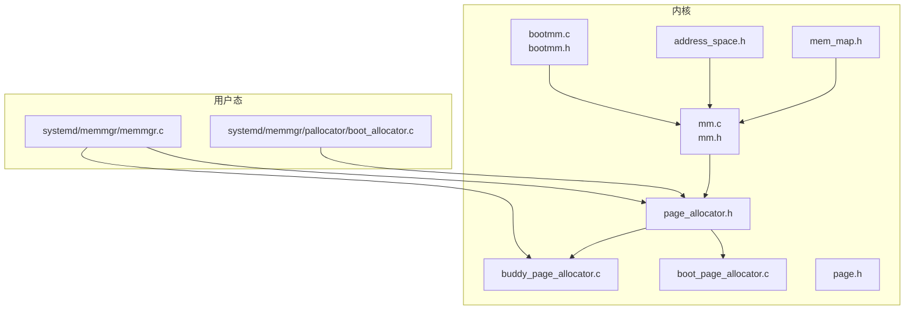
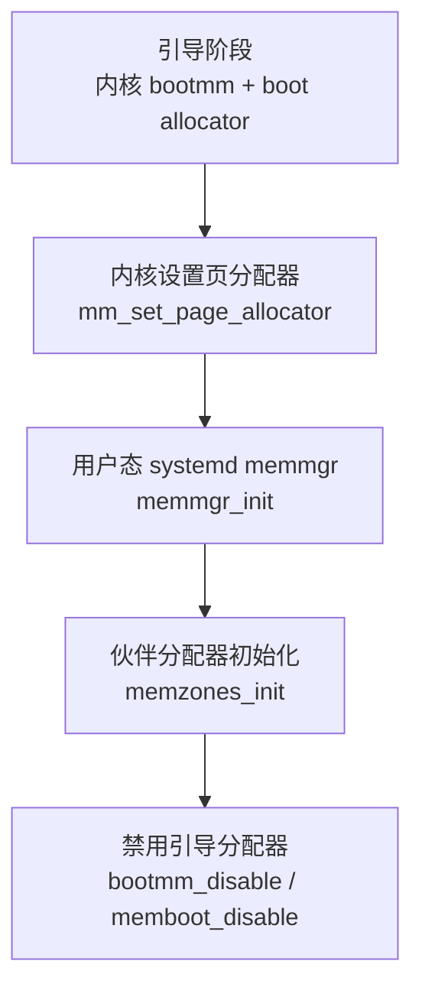
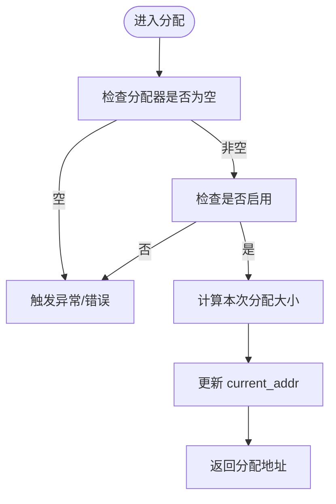
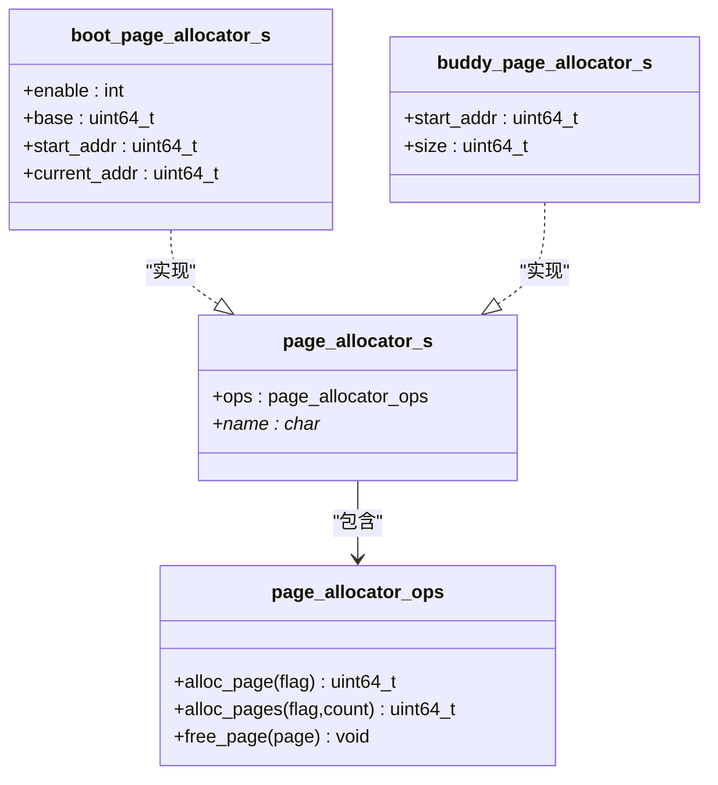
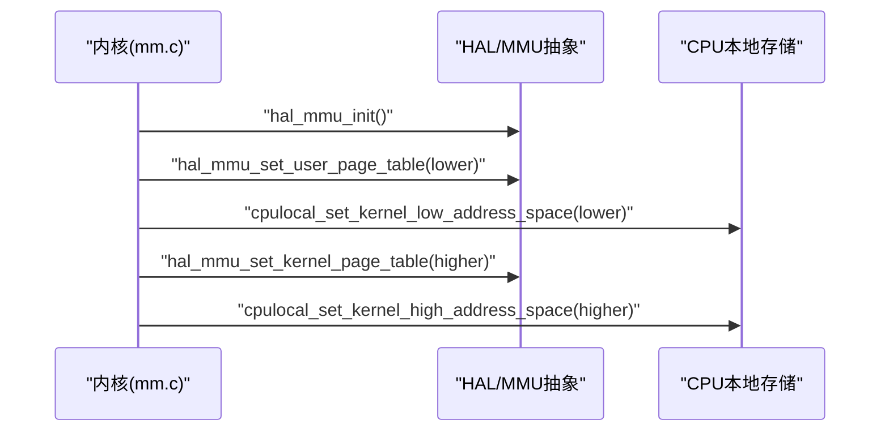
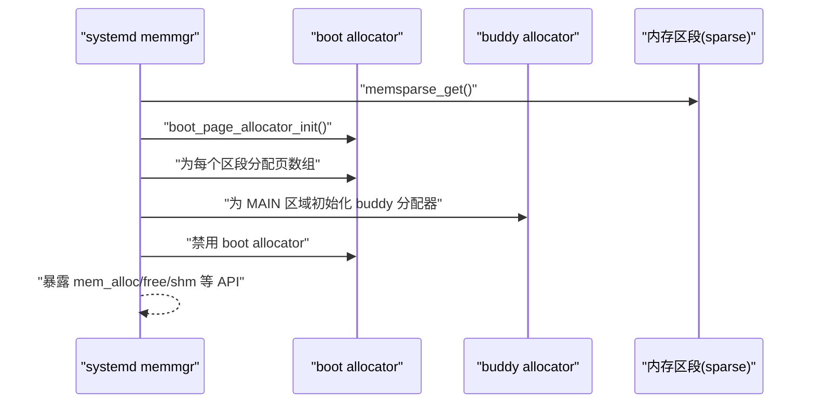
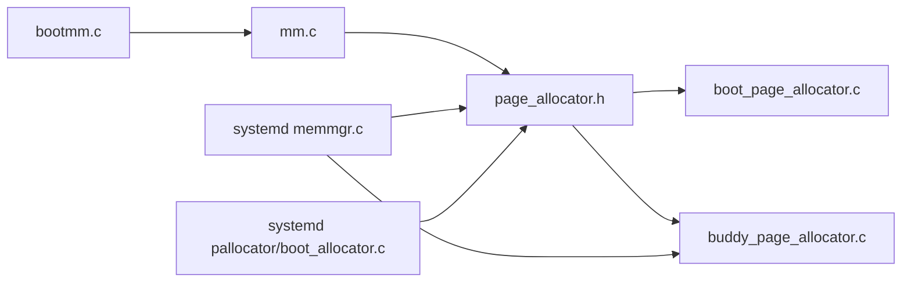

# 内存管理策略

<cite>
**本文引用的文件**
- [bootmm.c](file://kernel/mm/bootmm.c)
- [bootmm.h](file://kernel/include/mm/bootmm.h)
- [mm.c](file://kernel/mm/mm.c)
- [mm.h](file://kernel/include/mm/mm.h)
- [boot_page_allocator.c](file://kernel/mm/impl/boot_page_allocator.c)
- [buddy_page_allocator.c](file://kernel/mm/impl/buddy_page_allocator.c)
- [page_allocator.h](file://kernel/include/mm/page_allocator.h)
- [page.h](file://kernel/include/mm/page.h)
- [address_space.h](file://kernel/include/mm/address_space.h)
- [mem_map.h](file://kernel/include/mm/mem_map.h)
- [memmgr.c](file://kernel/systemd/memmgr/memmgr.c)
- [boot_allocator.c](file://kernel/systemd/memmgr/pallocator/boot_allocator.c)
</cite>

## 目录
1. [引言](#引言)
2. [项目结构](#项目结构)
3. [核心组件](#核心组件)
4. [架构总览](#架构总览)
5. [详细组件分析](#详细组件分析)
6. [依赖关系分析](#依赖关系分析)
7. [性能考量](#性能考量)
8. [故障排查指南](#故障排查指南)
9. [结论](#结论)
10. [附录](#附录)

## 引言
本文件系统性阐述 TranquilOS 在微内核架构下的内存管理策略与实现。其核心设计理念是：内核在启动阶段仅保留“引导页分配器（boot allocator）”以完成早期内存分配，随后将复杂且完整的物理内存管理能力交由用户态 systemd 服务接管。该策略通过“内核极简 + 用户态完备”的分层架构，实现了安全、可扩展、可维护的内存管理体系，并为后续虚拟内存、地址空间管理、共享内存等高级特性奠定基础。

## 项目结构
围绕内存管理的关键目录与文件如下：
- 内核启动与引导阶段的内存分配：bootmm、boot_page_allocator
- 内核通用内存子系统接口：mm、page_allocator、page、address_space、mem_map
- 用户态内存管理服务：systemd/memmgr 及其页分配器实现

**图表来源**
- [bootmm.c](file://kernel/mm/bootmm.c#L1-L24)
- [bootmm.h](file://kernel/include/mm/bootmm.h#L1-L11)
- [mm.c](file://kernel/mm/mm.c#L1-L45)
- [mm.h](file://kernel/include/mm/mm.h#L1-L23)
- [boot_page_allocator.c](file://kernel/mm/impl/boot_page_allocator.c#L1-L47)
- [buddy_page_allocator.c](file://kernel/mm/impl/buddy_page_allocator.c#L1-L27)
- [page_allocator.h](file://kernel/include/mm/page_allocator.h#L1-L23)
- [page.h](file://kernel/include/mm/page.h#L1-L31)
- [address_space.h](file://kernel/include/mm/address_space.h#L1-L43)
- [mem_map.h](file://kernel/include/mm/mem_map.h#L1-L29)
- [memmgr.c](file://kernel/systemd/memmgr/memmgr.c#L1-L300)
- [boot_allocator.c](file://kernel/systemd/memmgr/pallocator/boot_allocator.c#L1-L44)

**章节来源**
- [bootmm.c](file://kernel/mm/bootmm.c#L1-L24)
- [mm.c](file://kernel/mm/mm.c#L1-L45)
- [memmgr.c](file://kernel/systemd/memmgr/memmgr.c#L1-L300)

## 核心组件
- 引导页分配器（Boot Allocator）
  - 作用：内核启动阶段提供线性递增的物理页分配，不支持释放；启动完成后被禁用。
  - 关键接口：初始化、分配单页/多页、禁用。
  - 实现位置：内核与用户态分别提供实现，确保启动路径与用户态路径一致。

- 通用页分配器接口（page_allocator）
  - 作用：抽象出统一的页分配 API，屏蔽具体分配算法细节。
  - 接口：alloc_page、alloc_pages、free_page；记录分配器名称。

- 帧描述符与标志（page）
  - 作用：描述物理页元数据（魔数、引用计数、物理地址、标志位）。
  - 标志位：GFP_USER/GFP_KERNEL/GFP_FS/GFP_ORDER 等，用于分配场景与块大小编码。

- 地址空间与页表（address_space、mm）
  - 作用：管理进程/内核地址空间、页表设置、映射/取消映射、切换。
  - 能力：低地址空间与高地址空间的设置与切换；页表地址准备与映射扩展。

- 用户态内存管理服务（systemd memmgr）
  - 作用：完成物理内存区段扫描、页数组构建、伙伴分配器初始化、内存区与节点组织、共享内存管理、统计查询。
  - 流程：引导阶段使用 boot allocator 完成初始化，随后切换到 buddy 分配器并禁用 boot allocator。

**章节来源**
- [boot_page_allocator.c](file://kernel/mm/impl/boot_page_allocator.c#L1-L47)
- [page_allocator.h](file://kernel/include/mm/page_allocator.h#L1-L23)
- [page.h](file://kernel/include/mm/page.h#L1-L31)
- [address_space.h](file://kernel/include/mm/address_space.h#L1-L43)
- [mm.c](file://kernel/mm/mm.c#L1-L45)
- [memmgr.c](file://kernel/systemd/memmgr/memmgr.c#L1-L300)
- [boot_allocator.c](file://kernel/systemd/memmgr/pallocator/boot_allocator.c#L1-L44)

## 架构总览
TranquilOS 的内存管理采用“内核极简 + 用户态完备”的分层设计：
- 启动阶段：内核仅使用 boot allocator 完成早期初始化；随后将页分配器替换为用户态提供的实现。
- 运行阶段：用户态 systemd memmgr 负责物理内存管理、伙伴分配器、内存区与节点组织、共享内存、统计查询等。
- 地址空间与页表：内核提供 HAL 层抽象，用户态通过能力调用与内核协作完成页表设置与映射。

**图表来源**
- [bootmm.c](file://kernel/mm/bootmm.c#L1-L24)
- [mm.c](file://kernel/mm/mm.c#L10-L19)
- [memmgr.c](file://kernel/systemd/memmgr/memmgr.c#L274-L296)

## 详细组件分析

### 组件A：引导页分配器（Boot Allocator）
- 设计要点
  - 单调递增分配，无释放；启动后禁用，防止内核态误用。
  - 提供内核与用户态两套实现，保证一致性与可移植性。
- 关键流程
  - 初始化：记录 base/start/current 指针。
  - 分配：按页数累加 current_addr 并返回起始地址。
  - 禁用：标记 enable=0，后续分配失败。

**图表来源**
- [boot_page_allocator.c](file://kernel/mm/impl/boot_page_allocator.c#L7-L24)
- [boot_allocator.c](file://kernel/systemd/memmgr/pallocator/boot_allocator.c#L6-L21)

**章节来源**
- [boot_page_allocator.c](file://kernel/mm/impl/boot_page_allocator.c#L1-L47)
- [boot_allocator.c](file://kernel/systemd/memmgr/pallocator/boot_allocator.c#L1-L44)

### 组件B：通用页分配器接口（page_allocator）
- 设计要点
  - 通过函数指针封装不同分配策略（boot、buddy），统一调用入口。
  - 支持单页与多页分配、释放；记录分配器名称便于调试。
- 关键流程
  - 初始化时绑定各操作函数指针。
  - 外部通过 page_allocator_s.ops 调用具体实现。

**图表来源**
- [page_allocator.h](file://kernel/include/mm/page_allocator.h#L1-L23)
- [boot_page_allocator.c](file://kernel/mm/impl/boot_page_allocator.c#L35-L47)
- [buddy_page_allocator.c](file://kernel/mm/impl/buddy_page_allocator.c#L21-L27)

**章节来源**
- [page_allocator.h](file://kernel/include/mm/page_allocator.h#L1-L23)
- [boot_page_allocator.c](file://kernel/mm/impl/boot_page_allocator.c#L1-L47)
- [buddy_page_allocator.c](file://kernel/mm/impl/buddy_page_allocator.c#L1-L27)

### 组件C：帧描述符与标志（page）
- 设计要点
  - 使用魔数与引用计数保障页对象完整性与生命周期管理。
  - 标志位编码分配场景与连续页数量（order），便于伙伴算法与上层调度。
- 性能影响
  - 帧描述符对齐至 64 字节，减少伪共享风险。
  - 标志位紧凑存储，降低内存占用。

**章节来源**
- [page.h](file://kernel/include/mm/page.h#L1-L31)

### 组件D：地址空间与页表（address_space、mm）
- 设计要点
  - 提供地址空间标识、页表地址、映射/取消映射、扩展、切换等接口。
  - 内核侧通过 HAL 抽象完成 MMU 初始化、使能/禁用、页表设置与切换。
- 关键流程
  - 设置低/高地址空间页表基址并写入 CPU 本地存储。
  - 尝试映射单页或范围，返回映射结果。

**图表来源**
- [mm.c](file://kernel/mm/mm.c#L29-L45)
- [address_space.h](file://kernel/include/mm/address_space.h#L19-L42)

**章节来源**
- [mm.c](file://kernel/mm/mm.c#L1-L45)
- [address_space.h](file://kernel/include/mm/address_space.h#L1-L43)

### 组件E：用户态内存管理服务（systemd memmgr）
- 设计要点
  - 引导阶段使用 boot allocator 完成页数组与节点初始化。
  - 切换到 buddy 分配器并禁用 boot allocator，避免内核态再次使用。
  - 提供共享内存分配/查找/释放、内存总量/可用量查询。
- 关键流程
  - memboot_init：定位主内存区段，初始化 boot allocator。
  - memparray_init：为每个区段分配页数组，填充帧描述符。
  - memzones_init：为 MAIN 区域创建内存节点与 buddy 分配器。
  - memmgr_init：串联上述步骤并暴露 API。

**图表来源**
- [memmgr.c](file://kernel/systemd/memmgr/memmgr.c#L16-L118)
- [memmgr.c](file://kernel/systemd/memmgr/memmgr.c#L274-L296)

**章节来源**
- [memmgr.c](file://kernel/systemd/memmgr/memmgr.c#L1-L300)

## 依赖关系分析
- 内核侧
  - bootmm.c 通过 mm_set_page_allocator 将 boot allocator 注册为全局页分配器。
  - mm.c 提供 MMU 初始化、使能/禁用、页表设置与映射接口。
  - page_allocator.h 作为统一抽象，被 boot_page_allocator.c 与 buddy_page_allocator.c 实现。
- 用户态侧
  - memmgr.c 依赖 sparse 区段信息、boot allocator 完成初始化，再切换到 buddy allocator。
  - boot_allocator.c 与内核版保持行为一致，确保启动路径正确。

**图表来源**
- [bootmm.c](file://kernel/mm/bootmm.c#L13-L19)
- [mm.c](file://kernel/mm/mm.c#L12-L19)
- [page_allocator.h](file://kernel/include/mm/page_allocator.h#L18-L21)
- [boot_page_allocator.c](file://kernel/mm/impl/boot_page_allocator.c#L35-L47)
- [buddy_page_allocator.c](file://kernel/mm/impl/buddy_page_allocator.c#L21-L27)
- [memmgr.c](file://kernel/systemd/memmgr/memmgr.c#L274-L296)
- [boot_allocator.c](file://kernel/systemd/memmgr/pallocator/boot_allocator.c#L32-L44)

**章节来源**
- [bootmm.c](file://kernel/mm/bootmm.c#L1-L24)
- [mm.c](file://kernel/mm/mm.c#L1-L45)
- [page_allocator.h](file://kernel/include/mm/page_allocator.h#L1-L23)
- [memmgr.c](file://kernel/systemd/memmgr/memmgr.c#L1-L300)

## 性能考量
- 分配器选择
  - boot allocator：启动期线性增长，开销极小；禁用后不再使用。
  - buddy allocator：适合大块连续内存分配，碎片控制良好；需权衡初始化成本与运行时性能。
- 对齐与缓存
  - 帧描述符按 64 字节对齐，降低跨核竞争时的伪共享。
  - 页面大小固定为 4KB，简化页表与 TLB 管理。
- 映射与切换
  - 通过内核 HAL 抽象统一设置页表与切换地址空间，减少平台差异带来的性能波动。
- 统计与可观测性
  - memmgr 提供总内存与可用内存统计，便于上层资源调度与诊断。

[本节为通用性能建议，无需特定文件引用]

## 故障排查指南
- 启动阶段分配失败
  - 现象：boot allocator 分配返回 0 或触发异常。
  - 排查：确认 boot allocator 是否已禁用；检查初始化顺序是否正确。
  - 参考路径：[boot_page_allocator.c](file://kernel/mm/impl/boot_page_allocator.c#L12-L14)，[boot_allocator.c](file://kernel/systemd/memmgr/pallocator/boot_allocator.c#L13-L16)
- 无法切换到用户态分配器
  - 现象：内核无法设置页分配器或 MMU 初始化失败。
  - 排查：检查 mm_set_page_allocator 调用时机；确认 HAL 接口实现。
  - 参考路径：[mm.c](file://kernel/mm/mm.c#L12-L19)，[mm.c](file://kernel/mm/mm.c#L29-L31)
- 共享内存未找到
  - 现象：根据地址查找共享内存失败。
  - 排查：确认共享内存链表状态；检查分配/释放流程是否正确移除节点。
  - 参考路径：[memmgr.c](file://kernel/systemd/memmgr/memmgr.c#L187-L211)，[memmgr.c](file://kernel/systemd/memmgr/memmgr.c#L213-L248)

**章节来源**
- [boot_page_allocator.c](file://kernel/mm/impl/boot_page_allocator.c#L12-L14)
- [boot_allocator.c](file://kernel/systemd/memmgr/pallocator/boot_allocator.c#L13-L16)
- [mm.c](file://kernel/mm/mm.c#L12-L19)
- [memmgr.c](file://kernel/systemd/memmgr/memmgr.c#L187-L211)
- [memmgr.c](file://kernel/systemd/memmgr/memmgr.c#L213-L248)

## 结论
TranquilOS 的内存管理策略通过“内核极简 + 用户态完备”的架构，将启动期的简单分配与运行期的复杂管理清晰分离。内核仅保留 boot allocator 以完成早期任务，随后由用户态 systemd memmgr 提供完整的物理内存管理能力，包括伙伴分配、区段与节点组织、共享内存与统计查询。配合内核 HAL 抽象的地址空间与页表管理，系统在安全性、可维护性与性能之间取得平衡，并为后续虚拟内存与更高级特性打下坚实基础。

[本节为总结性内容，无需特定文件引用]

## 附录
- API 使用示例（路径指引）
  - 启动阶段初始化引导分配器：[bootmm.c](file://kernel/mm/bootmm.c#L13-L19)
  - 设置页分配器：[mm.c](file://kernel/mm/mm.c#L12-L19)
  - 用户态内存管理初始化：[memmgr.c](file://kernel/systemd/memmgr/memmgr.c#L274-L296)
  - 分配共享内存：[memmgr.c](file://kernel/systemd/memmgr/memmgr.c#L161-L185)
  - 查询总内存/可用内存：[memmgr.c](file://kernel/systemd/memmgr/memmgr.c#L251-L272)

**章节来源**
- [bootmm.c](file://kernel/mm/bootmm.c#L13-L19)
- [mm.c](file://kernel/mm/mm.c#L12-L19)
- [memmgr.c](file://kernel/systemd/memmgr/memmgr.c#L274-L296)
- [memmgr.c](file://kernel/systemd/memmgr/memmgr.c#L161-L185)
- [memmgr.c](file://kernel/systemd/memmgr/memmgr.c#L251-L272)