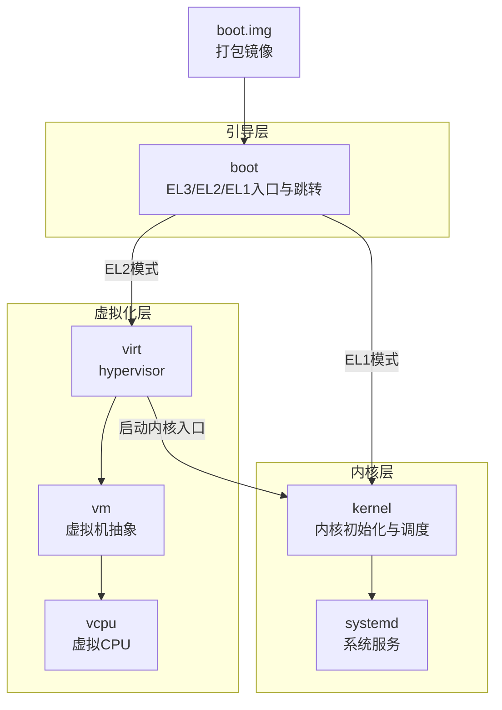
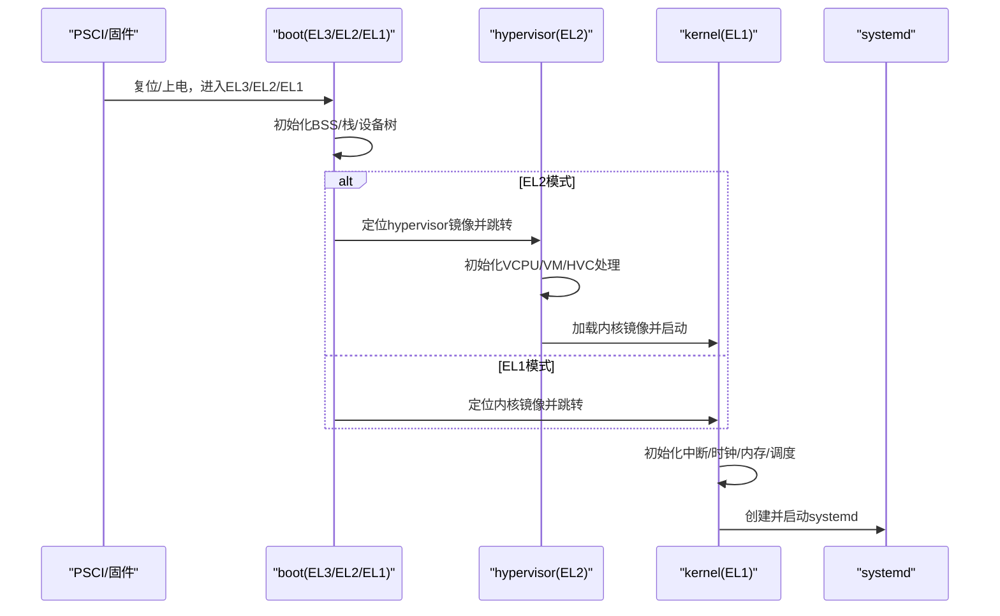
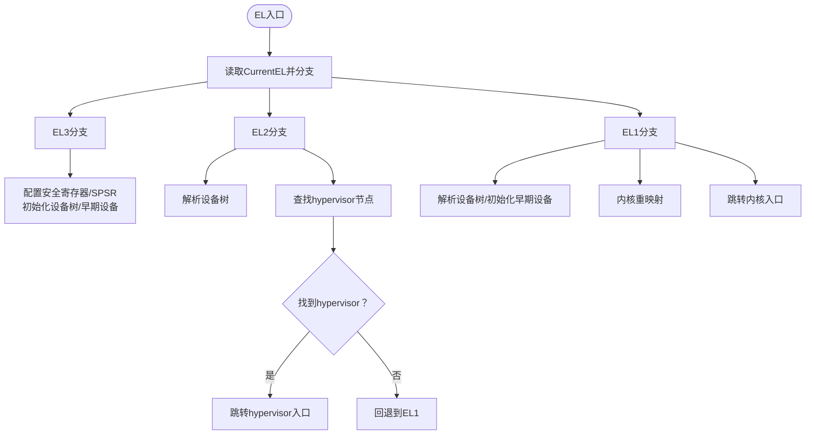
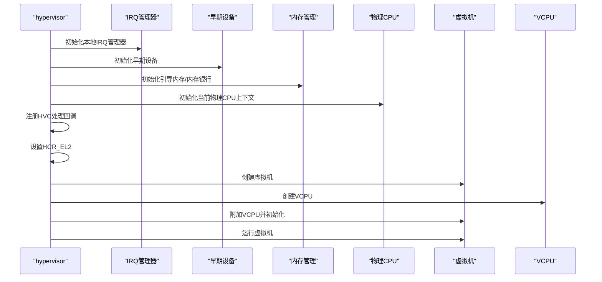
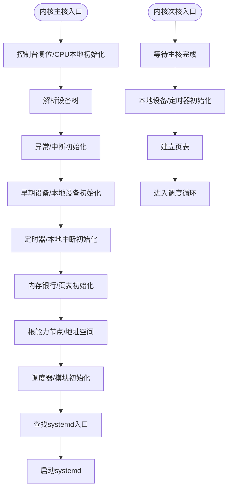
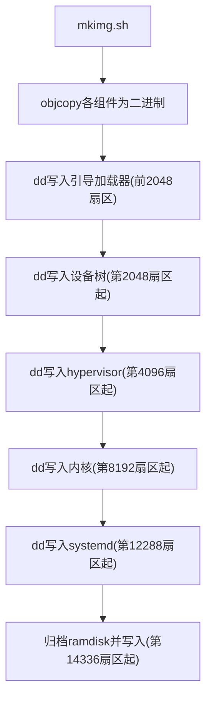
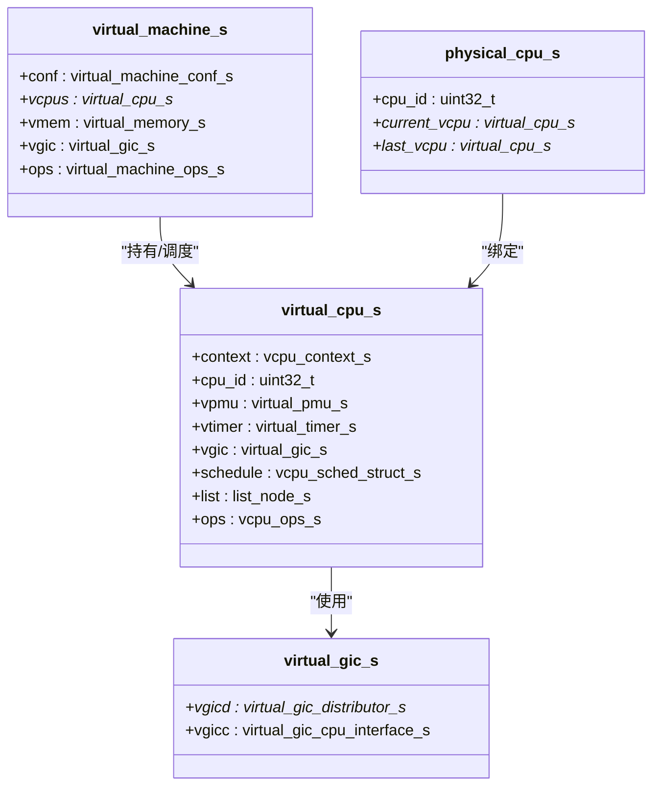
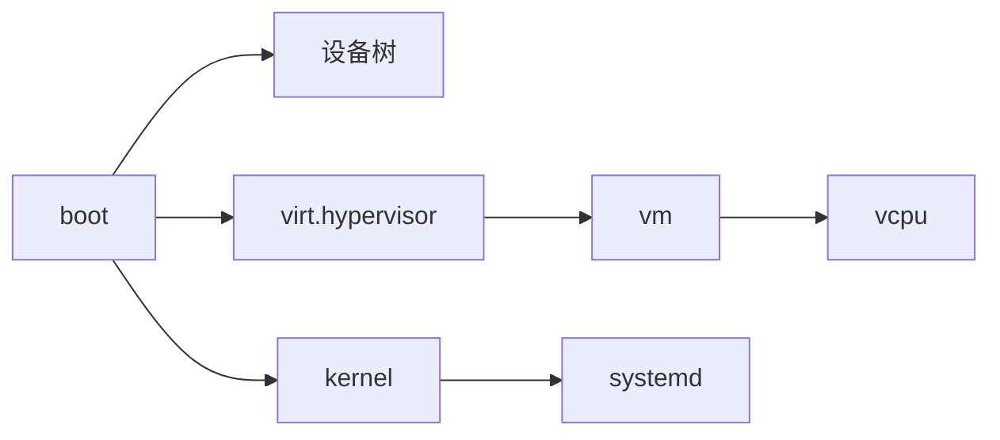

# 启动流程架构

<cite>
**本文引用的文件**   
- [boot/boot.c](file://boot/boot.c)
- [boot/arch/arm64/boot.S](file://boot/arch/arm64/boot.S)
- [boot/include/boot.h](file://boot/include/boot.h)
- [kernel/kernel.c](file://kernel/kernel.c)
- [virt/hypervisor.c](file://virt/hypervisor.c)
- [virt/vm.c](file://virt/vm.c)
- [virt/vcpu.c](file://virt/vcpu.c)
- [virt/include/vm.h](file://virt/include/vm.h)
- [virt/include/vcpu.h](file://virt/include/vcpu.h)
- [virt/include/pcpu.h](file://virt/include/pcpu.h)
- [virt/include/vgic.h](file://virt/include/vgic.h)
- [virt/include/vtimer.h](file://virt/include/vtimer.h)
- [scripts/mkimg.sh](file://scripts/mkimg.sh)
- [platform/QemuVirt/dts/virt.dts](file://platform/QemuVirt/dts/virt.dts)
- [platform/CM4/dts/bcm2711-rpi-cm4.dts](file://platform/CM4/dts/bcm2711-rpi-cm4.dts)
- [README.md](file://README.md)
</cite>

## 目录
1. [引言](#引言)
2. [项目结构](#项目结构)
3. [核心组件](#核心组件)
4. [架构总览](#架构总览)
5. [详细组件分析](#详细组件分析)
6. [依赖关系分析](#依赖关系分析)
7. [性能考量](#性能考量)
8. [故障排查指南](#故障排查指南)
9. [结论](#结论)
10. [附录](#附录)

## 引言
本文件面向TranquilOS的启动流程架构，系统性阐述其在AArch64平台上实现的EL2 Type-1虚拟化启动方案，并对比EL1直接启动模式。文档覆盖从引导加载器、hypervisor、内核到systemd的职责与交互，解析启动镜像boot.img的组织与装载方式，给出关键数据结构、启动参数与设备树配置要点，并提供时序图与流程图帮助理解。

## 项目结构
TranquilOS采用分层模块化设计：
- boot：引导加载器，负责从EL3/EL2/EL1入口初始化BSS、栈、设备树，定位内核/hypervisor/systemd镜像并跳转执行。
- virt：EL2 Type-1 Hypervisor，负责虚拟机与VCPU初始化、异常处理、HVC调用分发、物理资源映射等。
- kernel：内核，完成设备树解析、中断与时钟初始化、内存管理、调度器与模块系统初始化，并启动systemd。
- systemd：用户态系统服务集合，作为内核初始化后的首个用户态进程运行。
- scripts：构建与打包脚本，生成boot.img并写入各组件镜像。
- platform：平台设备树定义，描述各组件在物理地址空间中的布局与兼容属性。

**图表来源**
- [boot/arch/arm64/boot.S](file://boot/arch/arm64/boot.S#L1-L115)
- [boot/boot.c](file://boot/boot.c#L1-L176)
- [virt/hypervisor.c](file://virt/hypervisor.c#L1-L149)
- [virt/vm.c](file://virt/vm.c#L1-L59)
- [virt/vcpu.c](file://virt/vcpu.c#L1-L66)
- [kernel/kernel.c](file://kernel/kernel.c#L1-L225)
- [scripts/mkimg.sh](file://scripts/mkimg.sh#L1-L38)

**章节来源**
- [README.md](file://README.md#L1-L42)
- [boot/arch/arm64/boot.S](file://boot/arch/arm64/boot.S#L1-L115)
- [boot/boot.c](file://boot/boot.c#L1-L176)
- [scripts/mkimg.sh](file://scripts/mkimg.sh#L1-L38)

## 核心组件
- 引导加载器（boot）
  - 负责识别当前EL等级，初始化BSS与栈，解析设备树，定位内核/hypervisor/systemd镜像地址，进行内存重映射后跳转执行。
  - 支持EL3、EL2、EL1三级入口，分别对应不同的初始化路径与跳转目标。
- Hypervisor（virt）
  - 在EL2下初始化VCPU与虚拟机，注册HVC处理函数，设置HCR_EL2控制寄存器，建立虚拟中断控制器与定时器等虚拟外设接口。
- 内核（kernel）
  - 解析设备树，初始化中断与时钟、内存管理、调度器与模块系统，创建根能力节点与地址空间，启动systemd。
- Systemd（systemd）
  - 作为首个用户态进程，承载系统服务管理与资源分配。

**章节来源**
- [boot/boot.c](file://boot/boot.c#L1-L176)
- [virt/hypervisor.c](file://virt/hypervisor.c#L1-L149)
- [kernel/kernel.c](file://kernel/kernel.c#L1-L225)

## 架构总览
TranquilOS支持两种启动模式：
- EL1直接启动：引导加载器直接跳转至内核入口，内核完成初始化后启动systemd。
- EL2 Type-1虚拟化启动：引导加载器检测hypervisor镜像，进入EL2后由hypervisor接管，创建虚拟机与VCPU，加载内核镜像作为VM内的“Guest Kernel”，通过HVC调用与虚拟外设与宿主交互。

**图表来源**
- [boot/arch/arm64/boot.S](file://boot/arch/arm64/boot.S#L1-L115)
- [boot/boot.c](file://boot/boot.c#L1-L176)
- [virt/hypervisor.c](file://virt/hypervisor.c#L1-L149)
- [kernel/kernel.c](file://kernel/kernel.c#L1-L225)

## 详细组件分析

### 组件A：引导加载器（EL3/EL2/EL1入口与跳转）
- 入口逻辑
  - 根据CurrentEL判断当前特权级，分别为EL3、EL2、EL1分支；每个分支设置对应EL的栈、清零BSS、区分主核/次核并调用相应start函数。
- EL1启动流程
  - 初始化控制台与设备树，禁用中断，早期设备初始化，打印引导信息，初始化引导内存管理，遍历CPU节点并通过PSCI唤醒其他CPU，随后进行内核重映射并跳转至内核入口。
- EL2启动流程
  - 从设备树查找“tranquil,hypervisor”节点，若存在则跳转至hypervisor入口；否则回退至EL1。
- EL3启动流程
  - 配置安全寄存器与SPSR，初始化设备树与早期设备，打印调试信息。

**图表来源**
- [boot/arch/arm64/boot.S](file://boot/arch/arm64/boot.S#L1-L115)
- [boot/boot.c](file://boot/boot.c#L1-L176)

**章节来源**
- [boot/arch/arm64/boot.S](file://boot/arch/arm64/boot.S#L1-L115)
- [boot/boot.c](file://boot/boot.c#L1-L176)
- [boot/include/boot.h](file://boot/include/boot.h#L1-L8)

### 组件B：Hypervisor（EL2 Type-1虚拟化）
- 初始化
  - 初始化IRQ管理器、早期设备与内存银行，打印版本信息，创建物理CPU上下文，注册HVC处理回调，使能中断。
  - 设置HCR_EL2控制寄存器，配置虚拟化相关位，启用EL1为AArch64状态。
- 虚拟机与VCPU
  - 创建虚拟机与VCPU实例，从设备树查找“tranquil,boot”节点以获取内核镜像入口地址。
  - 将VCPU附加到VM并初始化，随后运行VM。
- HVC处理
  - 提供HVC调用号的分发处理，预留扩展点用于虚拟机生命周期管理。

**图表来源**
- [virt/hypervisor.c](file://virt/hypervisor.c#L1-L149)
- [virt/vm.c](file://virt/vm.c#L1-L59)
- [virt/vcpu.c](file://virt/vcpu.c#L1-L66)

**章节来源**
- [virt/hypervisor.c](file://virt/hypervisor.c#L1-L149)
- [virt/vm.c](file://virt/vm.c#L1-L59)
- [virt/vcpu.c](file://virt/vcpu.c#L1-L66)

### 组件C：内核（EL1）
- 主核流程
  - 控制台复位、CPU本地初始化、设备树解析、异常与中断初始化、早期设备与CPU局部设备初始化。
  - 打印内存区域信息，初始化定时器与本地中断设备，建立内存页表与地址空间。
  - 创建根能力节点与根地址空间，初始化调度器与模块系统，从设备树查找“tranquil,systemd”并启动。
- 次核流程
  - 等待主核初始化完成，初始化本地设备与定时器，建立页表，启用中断后进入调度循环。

**图表来源**
- [kernel/kernel.c](file://kernel/kernel.c#L1-L225)

**章节来源**
- [kernel/kernel.c](file://kernel/kernel.c#L1-L225)

### 组件D：Systemd（用户态系统服务）
- systemd作为首个用户态进程被内核创建与启动，负责系统服务管理与资源分配。其具体实现位于systemd目录，启动入口与服务管理接口由内核sysproc子系统负责初始化与调度。

**章节来源**
- [kernel/kernel.c](file://kernel/kernel.c#L200-L225)

### 启动镜像与打包（boot.img）
- boot.img组织
  - 64MB大小，按固定偏移顺序写入：引导加载器、设备树blob、hypervisor、内核、systemd、ramdisk。
- 打包脚本
  - 使用objcopy提取各组件二进制，再通过dd写入boot.img的不同扇区偏移，最后将ramdisk归档写入末尾。
- 设备树布局
  - 平台DTS中为各组件声明“compatible”属性与物理地址范围，引导加载器通过设备树查找各镜像入口地址。

**图表来源**
- [scripts/mkimg.sh](file://scripts/mkimg.sh#L1-L38)
- [platform/QemuVirt/dts/virt.dts](file://platform/QemuVirt/dts/virt.dts#L1-L468)
- [platform/CM4/dts/bcm2711-rpi-cm4.dts](file://platform/CM4/dts/bcm2711-rpi-cm4.dts#L1-L800)

**章节来源**
- [scripts/mkimg.sh](file://scripts/mkimg.sh#L1-L38)
- [platform/QemuVirt/dts/virt.dts](file://platform/QemuVirt/dts/virt.dts#L1-L468)
- [platform/CM4/dts/bcm2711-rpi-cm4.dts](file://platform/CM4/dts/bcm2711-rpi-cm4.dts#L1-L800)

### 关键数据结构与虚拟化对象
- 虚拟机（VM）
  - 包含配置、VCPU链表、虚拟内存与虚拟GIC等成员，提供初始化、附加VCPU、运行与停止操作。
- 虚拟CPU（VCPU）
  - 包含执行上下文、系统寄存器、调度节点与操作函数指针，负责上下文初始化与运行。
- 物理CPU（PCPU）
  - 记录当前与上次运行的VCPU，便于上下文切换。
- 虚拟GIC（VGIC）
  - 抽象虚拟分发器与CPU接口寄存器，用于虚拟中断管理。

**图表来源**
- [virt/include/vm.h](file://virt/include/vm.h#L1-L39)
- [virt/include/vcpu.h](file://virt/include/vcpu.h#L1-L49)
- [virt/include/pcpu.h](file://virt/include/pcpu.h#L1-L18)
- [virt/include/vgic.h](file://virt/include/vgic.h#L1-L66)

**章节来源**
- [virt/include/vm.h](file://virt/include/vm.h#L1-L39)
- [virt/include/vcpu.h](file://virt/include/vcpu.h#L1-L49)
- [virt/include/pcpu.h](file://virt/include/pcpu.h#L1-L18)
- [virt/include/vgic.h](file://virt/include/vgic.h#L1-L66)

## 依赖关系分析
- 引导加载器对设备树与早期设备的依赖较强，通过设备树节点的“compatible”属性定位各组件入口。
- Hypervisor依赖VCPU与VM抽象，以及HVC处理机制，实现虚拟化控制流。
- 内核依赖设备树提供的内存布局与外设信息，完成内存管理与时钟/中断初始化。
- systemd作为用户态进程，由内核sysproc子系统创建与启动。

**图表来源**
- [boot/boot.c](file://boot/boot.c#L1-L176)
- [virt/hypervisor.c](file://virt/hypervisor.c#L1-L149)
- [virt/vm.c](file://virt/vm.c#L1-L59)
- [virt/vcpu.c](file://virt/vcpu.c#L1-L66)
- [kernel/kernel.c](file://kernel/kernel.c#L1-L225)

**章节来源**
- [boot/boot.c](file://boot/boot.c#L1-L176)
- [virt/hypervisor.c](file://virt/hypervisor.c#L1-L149)
- [virt/vm.c](file://virt/vm.c#L1-L59)
- [virt/vcpu.c](file://virt/vcpu.c#L1-L66)
- [kernel/kernel.c](file://kernel/kernel.c#L1-L225)

## 性能考量
- EL2虚拟化引入Hypervisor层，会带来少量额外开销，但可获得更强的隔离与资源管理能力。
- 通过HVC调用与虚拟外设接口减少Guest与Host之间的直接耦合，提升可维护性。
- 内核与Hypervisor均在启动阶段完成内存与中断初始化，避免后续运行期抖动。
- 建议在实际部署中根据平台特性调整HCR_EL2配置与VCPU数量，以平衡性能与资源占用。

## 故障排查指南
- 引导失败
  - 检查设备树中各组件的“compatible”属性与“reg/size”是否正确，确认boot.img写入偏移无误。
  - 若未找到hypervisor节点，引导加载器会回退至EL1，需确认设备树布局或禁用EL2模式。
- 内核无法启动
  - 确认设备树中“tranquil,systemd”节点存在且地址有效；检查内核初始化日志，关注中断与时钟初始化是否成功。
- Hypervisor异常
  - 检查HCR_EL2配置与HVC回调注册；确认VCPU上下文初始化与页表建立是否完成。

**章节来源**
- [boot/boot.c](file://boot/boot.c#L120-L140)
- [kernel/kernel.c](file://kernel/kernel.c#L200-L225)
- [virt/hypervisor.c](file://virt/hypervisor.c#L100-L149)

## 结论
TranquilOS提供了清晰的启动分层：引导加载器负责多EL入口与镜像定位，EL2模式下由Hypervisor接管并创建虚拟机与VCPU，最终加载内核；EL1模式则直接由引导加载器跳转至内核。通过设备树与打包脚本，系统实现了灵活的组件布局与可移植性。EL2虚拟化在隔离与资源管理方面具备优势，适合需要强隔离与可扩展性的场景；EL1直接启动则更简洁高效，适合轻量级部署。

## 附录
- 启动参数与设备树
  - 平台DTS中定义了各组件的“compatible”与地址范围，引导加载器据此定位镜像入口。
- 构建与运行
  - 参考仓库根目录README中的构建与运行说明，结合平台DTS与mkimg.sh完成镜像生成与测试。

**章节来源**
- [platform/QemuVirt/dts/virt.dts](file://platform/QemuVirt/dts/virt.dts#L1-L468)
- [README.md](file://README.md#L35-L42)