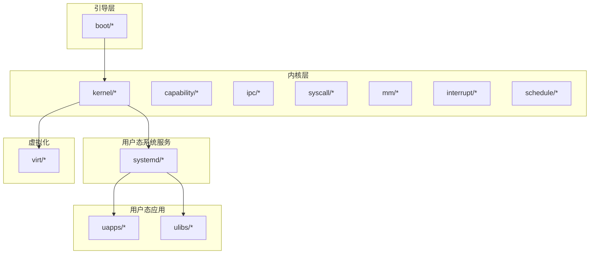
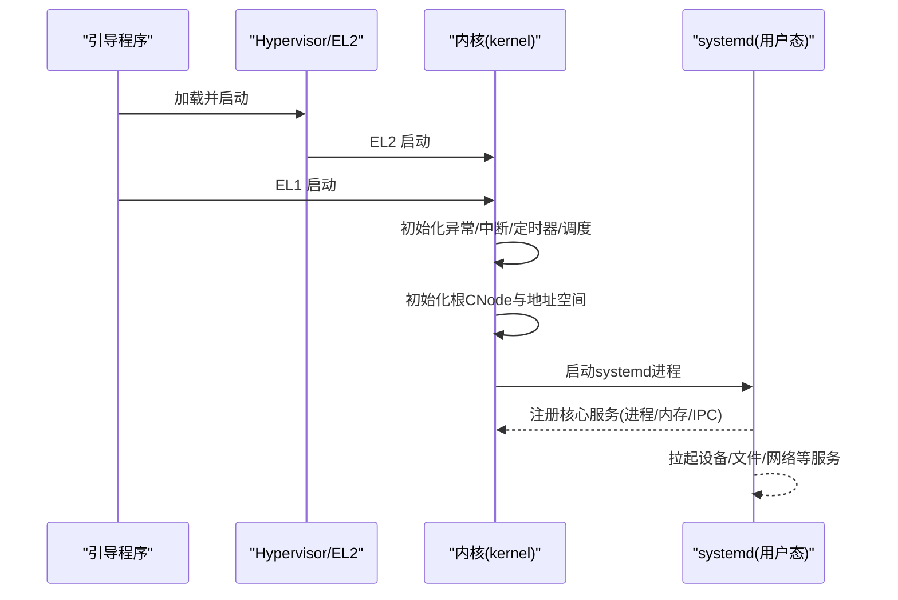
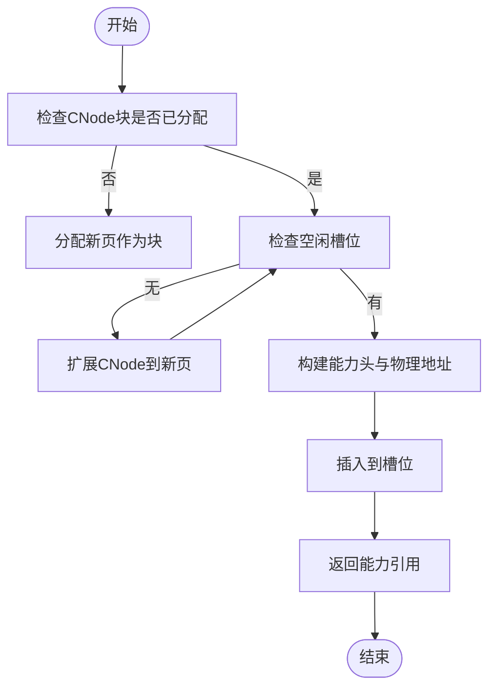
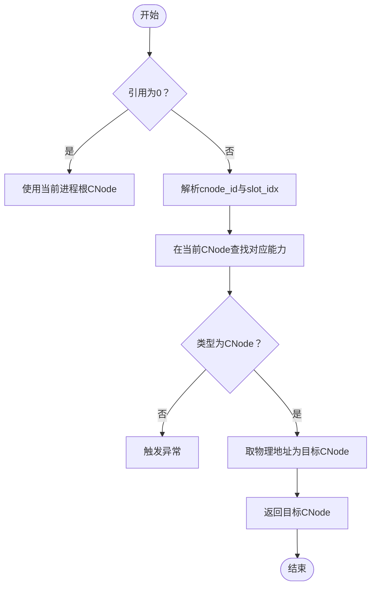
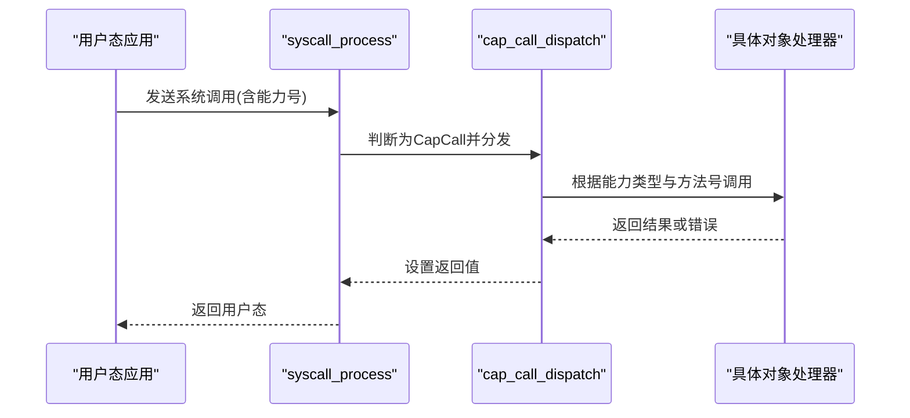
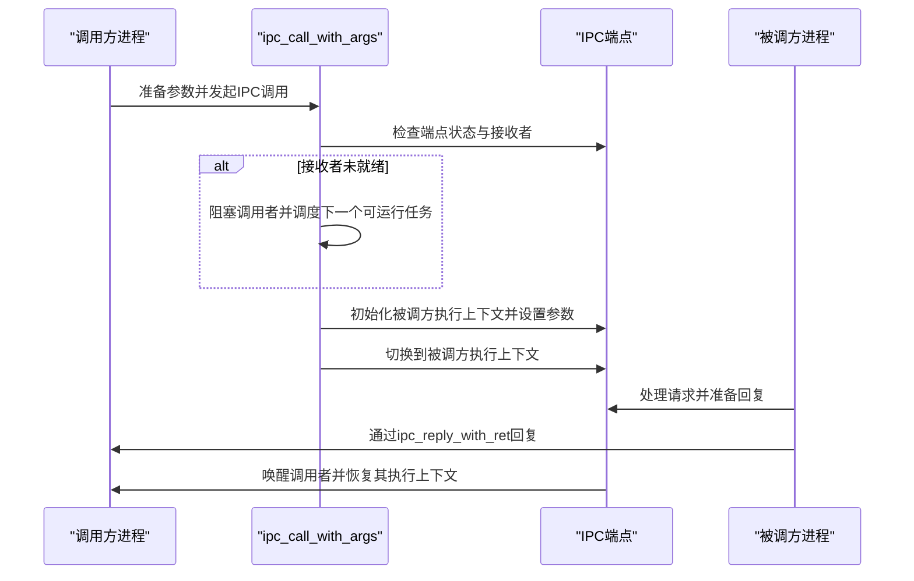
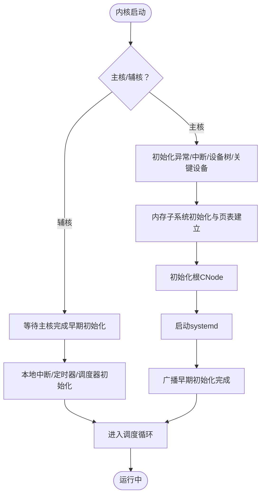
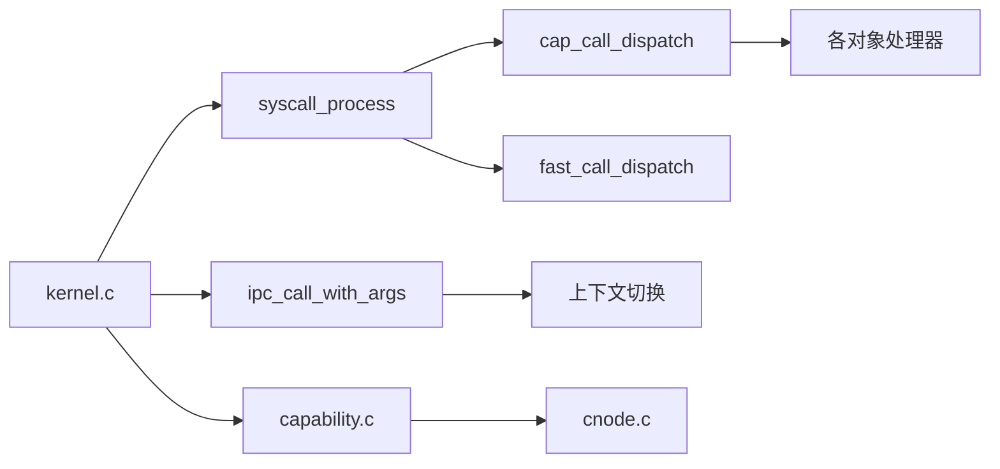

# 微内核设计原理

<cite>
**本文引用的文件**
- [README.md](file://README.md)
- [microkernel_design.md](file://docs/microkernel_design.md)
- [kernel/microkernel_design.md](file://docs/kernel/microkernel_design.md)
- [kernel.c](file://kernel/kernel.c)
- [core.h](file://kernel/include/core.h)
- [capability.h](file://kernel/include/capability/capability.h)
- [capability.c](file://kernel/capability/capability.c)
- [cnode.h](file://kernel/include/capability/cnode.h)
- [cnode.c](file://kernel/capability/cnode.c)
- [ipc.h](file://kernel/include/ipc/ipc.h)
- [ipc.c](file://kernel/ipc/ipc.c)
- [syscall.h](file://kernel/include/syscall/syscall.h)
- [syscall.c](file://kernel/syscall/syscall.c)
- [common.h](file://kernel/include/arch/arm64/common.h)
</cite>

## 目录
1. [简介](#简介)
2. [项目结构](#项目结构)
3. [核心组件](#核心组件)
4. [架构总览](#架构总览)
5. [详细组件分析](#详细组件分析)
6. [依赖关系分析](#依赖关系分析)
7. [性能考量](#性能考量)
8. [故障排查指南](#故障排查指南)
9. [结论](#结论)
10. [附录](#附录)

## 简介
本文件围绕 TranquilOS 微内核的设计理念与实现进行系统化技术说明，重点阐释以下主题：
- 微内核的核心理念：最小特权原则、类型安全、模块化分离
- 与传统宏内核的差异及选择微内核的优势
- 内核对象的抽象化设计、权限控制机制与安全隔离原理
- 通过具体代码路径展示微内核如何实现上述设计原则
- 对微内核架构的优缺点与适用场景进行讨论

TranquilOS 的微内核文档明确指出其采用“能力（capability）”作为内核对象与细粒度权限的管理结构，并将内存管理、进程/线程管理、设备管理等核心职责下沉到用户态系统服务（systemd），内核仅保留引导期内存分配与基础调度、中断、异常、时间与时钟等最小集合。

章节来源
- file://README.md#L1-L42
- file://docs/microkernel_design.md#L1-L43
- file://docs/kernel/microkernel_design.md#L1-L37

## 项目结构
TranquilOS 采用分层与按功能域划分的组织方式：
- boot：引导与平台相关初始化（MMU、页表、重映射、串口控制等）
- kernel：内核核心（调度、中断、异常、内存管理框架、能力与CNode、IPC、系统调用等）
- systemd：用户态核心系统服务（进程/内存/IPC 管理器等）
- uapps：用户态应用（设备管理器、文件系统管理器、网络管理器、shell 等）
- ulibs：用户态库（图形、算法、系统客户端等）
- virt：虚拟化子系统（EL2 Hypervisor、VCPU、VM、页表等）
- platform：不同硬件平台的设备树与链接脚本
- docs：设计文档与理论基础

章节来源
- file://README.md#L1-L42

## 核心组件
本节聚焦于支撑微内核设计原则的关键模块及其职责边界：

- 能力与CNode（Capability & CNode）
  - 能力是内核对象与细粒度权限的统一抽象，承载对象类型、权限位与物理地址
  - CNode 是进程持有的能力容器，支持动态扩展与线性索引，用于存放进程的所有内核对象引用
  - 通过能力引用（cnode_id + slot_idx）实现对象访问与权限控制

- 系统调用与快速调用（CapCall/FastCall）
  - 系统调用入口根据调用号区分 CapCall 与 FastCall
  - CapCall 通过能力分发器路由到具体对象方法，实现最小特权与类型安全

- 进程上下文与执行上下文
  - 执行上下文（execute_context_s）承载用户态寄存器状态
  - 调度上下文（schedule_context_s）承载调度状态，二者解耦提升可维护性

- IPC 与 Upcall
  - IPC 支持“控制流立即切换”的消息传递，避免依赖调度器行为，提高实时性
  - Upcall Endpoint 用于异步事件回调，配合 IPC 实现高效通知

- 内存管理框架
  - 引导期使用简单页分配器，随后移交用户态 systemd 完成物理内存管理
  - 内核保留最小内存管理能力以支撑早期初始化与页表建立

- 中断、异常与定时器
  - 提供中断控制器初始化、本地定时器与滴答时钟，支撑系统时序与抢占调度

章节来源
- file://docs/microkernel_design.md#L6-L32
- file://kernel/include/capability/capability.h#L11-L25
- file://kernel/include/capability/cnode.h#L11-L28
- file://kernel/capability/cnode.c#L9-L95
- file://kernel/include/syscall/syscall.h#L6
- file://kernel/syscall/syscall.c#L8-L20
- file://kernel/include/ipc/ipc.h#L9-L12
- file://kernel/ipc/ipc.c#L9-L114
- file://kernel/include/arch/arm64/common.h#L4

## 架构总览
下图展示了从引导到用户态 systemd 的启动流程，以及内核与用户态服务之间的职责划分。

图表来源
- [kernel.c](file://kernel/kernel.c#L125-L224)
- [kernel/microkernel_design.md](file://docs/kernel/microkernel_design.md#L28-L37)

章节来源
- file://kernel/kernel.c#L125-L224
- file://docs/kernel/microkernel_design.md#L28-L37

## 详细组件分析

### 能力与CNode：抽象化与权限控制
- 设计要点
  - 能力头包含对象类型与权限位，结合物理地址形成可传递的句柄
  - CNode 以目录数组形式存储能力槽位，支持动态扩展，线性索引便于快速定位
  - 通过能力引用（cnode_id + slot_idx）实现跨对象的安全访问

- 关键流程（创建能力）

图表来源
- [cnode.c](file://kernel/capability/cnode.c#L23-L59)

- 关键流程（获取目标CNode）

图表来源
- [cnode.c](file://kernel/capability/cnode.c#L66-L90)

章节来源
- file://kernel/include/capability/capability.h#L11-L25
- file://kernel/include/capability/cnode.h#L11-L28
- file://kernel/capability/cnode.c#L9-L95

### CapCall 分发与最小特权
- 设计要点
  - 系统调用入口根据调用号判断是否为 CapCall
  - CapCall 将调用号拆分为能力类型与方法号，分发到对应对象处理函数
  - 权限位在能力头中定义，调用前应进行权限校验（当前实现留有 TODO）

- 调用序列

图表来源
- [syscall.c](file://kernel/syscall/syscall.c#L8-L20)
- [capability.c](file://kernel/capability/capability.c#L14-L54)

章节来源
- file://kernel/syscall/syscall.c#L8-L20
- file://kernel/capability/capability.c#L14-L54

### IPC：控制流立即切换与实时性
- 设计要点
  - IPC 支持“控制流立即切换”，无需等待调度器行为，减少延迟
  - 调用方在阻塞队列中等待，被调方通过上下文切换直接接管执行
  - 回复时唤醒调用方并恢复其执行上下文

- 调用序列

图表来源
- [ipc.c](file://kernel/ipc/ipc.c#L9-L114)

章节来源
- file://kernel/include/ipc/ipc.h#L9-L12
- file://kernel/ipc/ipc.c#L9-L114

### 内核启动与早期初始化
- 设计要点
  - 主核与辅核分别进入不同的启动路径，主核负责设备树解析、关键设备初始化、页表建立、根CNode 初始化与 systemd 启动
  - 辅核等待主核完成早期初始化后，再进行本地中断、定时器与调度器初始化

- 关键流程

图表来源
- [kernel.c](file://kernel/kernel.c#L125-L224)

章节来源
- file://kernel/kernel.c#L125-L224

## 依赖关系分析
- 组件耦合与职责边界
  - 内核核心模块（调度、中断、异常、内存）保持最小集合，其余能力（进程、内存、设备、文件系统）下沉至用户态 systemd
  - CapCall 与 IPC 作为内核与用户态交互的桥梁，确保最小特权与类型安全
  - CNode 作为能力容器，贯穿进程生命周期，是权限控制与对象访问的中枢

- 依赖可视化

图表来源
- [syscall.c](file://kernel/syscall/syscall.c#L8-L20)
- [capability.c](file://kernel/capability/capability.c#L14-L54)
- [cnode.c](file://kernel/capability/cnode.c#L9-L95)
- [ipc.c](file://kernel/ipc/ipc.c#L9-L114)
- [kernel.c](file://kernel/kernel.c#L125-L224)

章节来源
- file://kernel/syscall/syscall.c#L8-L20
- file://kernel/capability/capability.c#L14-L54
- file://kernel/capability/cnode.c#L9-L95
- file://kernel/ipc/ipc.c#L9-L114
- file://kernel/kernel.c#L125-L224

## 性能考量
- 最小内核与用户态服务
  - 将内存管理、进程/线程管理等下沉到用户态 systemd，降低内核复杂度，有利于长期维护与优化
- 控制流立即切换的 IPC
  - 避免调度器行为依赖，减少 IPC 调用延迟，提升实时性
- 动态扩展的 CNode
  - 在不复制的情况下动态扩展，降低能力管理开销；线性索引加速查找
- 早期初始化与多核协作
  - 主/辅核分工明确，缩短启动时间并充分利用多核资源

章节来源
- file://docs/microkernel_design.md#L6-L32
- file://kernel/ipc/ipc.c#L9-L114
- file://kernel/capability/cnode.c#L15-L21

## 故障排查指南
- 启动阶段常见问题
  - 未找到 systemd：检查设备树中是否正确声明 systemd 节点
  - 页分配失败：确认引导期页分配器初始化与内存区域映射
  - 本地定时器/中断未初始化：检查本地管理器初始化顺序与使能逻辑

- 能力与权限相关问题
  - 能力引用无效：确认 cnode_id 与 slot_idx 解析正确，目标能力类型匹配
  - 权限不足：检查能力头中的权限位是否满足调用需求（当前实现留有权限检查 TODO）

- IPC 相关问题
  - 调用方阻塞无法唤醒：检查端点状态与唤醒逻辑
  - 上下文切换异常：确认执行上下文初始化与寄存器设置正确

章节来源
- file://kernel/kernel.c#L202-L208
- file://kernel/capability/cnode.c#L66-L90
- file://kernel/capability/cnode.c#L27-L48
- file://kernel/ipc/ipc.c#L9-L114
- file://kernel/capability/capability.c#L20

## 结论
TranquilOS 微内核通过“能力 + CNode + CapCall + IPC”的组合，实现了最小特权、类型安全与模块化分离的设计目标。内核仅保留必要的基础设施，将复杂的服务下沉到用户态 systemd，既提升了系统的安全性与稳定性，也为后续扩展与优化提供了清晰的边界。控制流立即切换的 IPC 进一步增强了实时性与响应速度。尽管当前实现中部分权限检查仍为预留 TODO，但整体架构已具备良好的可演进性与工程落地基础。

## 附录
- 参考文档
  - 微内核设计文档：[microkernel_design.md](file://docs/microkernel_design.md)
  - 内核设计文档：[kernel/microkernel_design.md](file://docs/kernel/microkernel_design.md)
- 关键实现路径
  - 能力与CNode：[capability.h](file://kernel/include/capability/capability.h), [capability.c](file://kernel/capability/capability.c), [cnode.h](file://kernel/include/capability/cnode.h), [cnode.c](file://kernel/capability/cnode.c)
  - 系统调用与分发：[syscall.h](file://kernel/include/syscall/syscall.h), [syscall.c](file://kernel/syscall/syscall.c)
  - IPC 与上下文切换：[ipc.h](file://kernel/include/ipc/ipc.h), [ipc.c](file://kernel/ipc/ipc.c)
  - 内核启动与早期初始化：[kernel.c](file://kernel/kernel.c), [core.h](file://kernel/include/core.h)
  - 架构常量与栈大小：[common.h](file://kernel/include/arch/arm64/common.h)