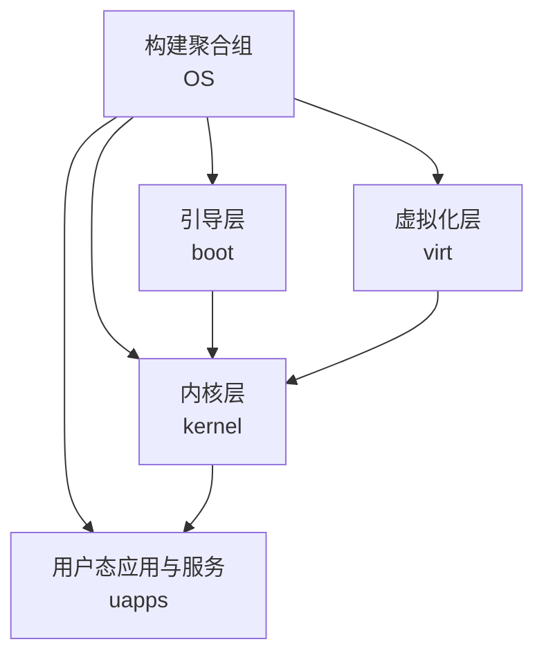
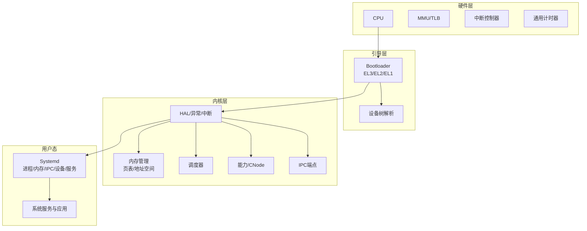
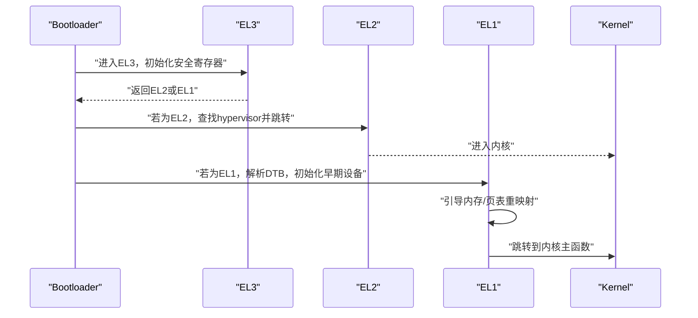
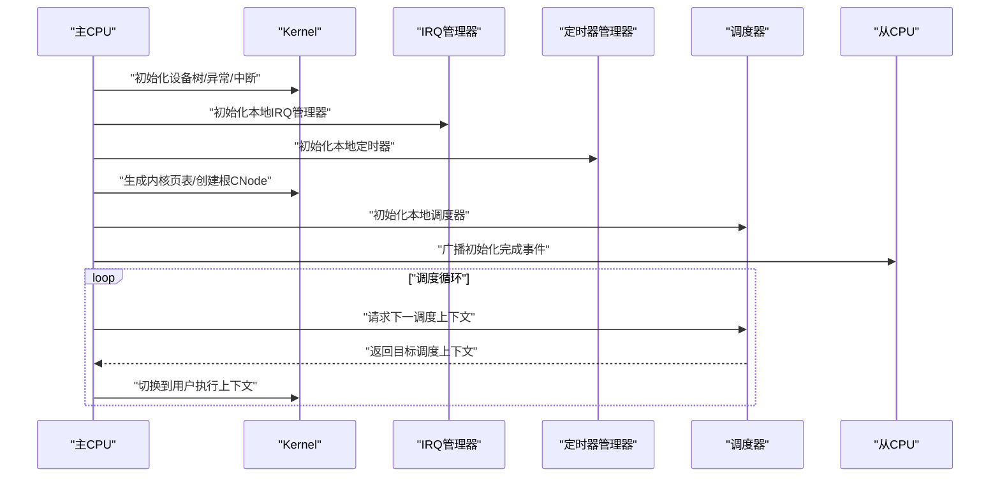
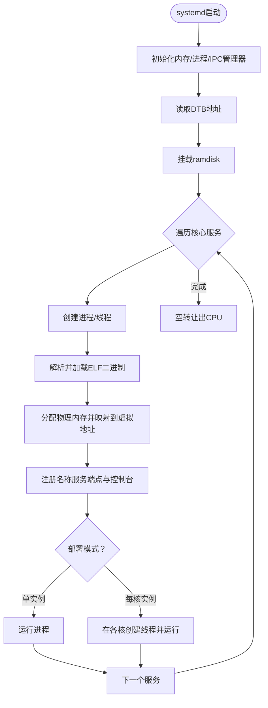
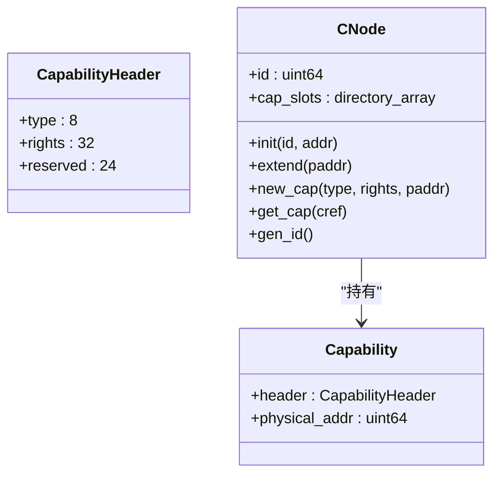
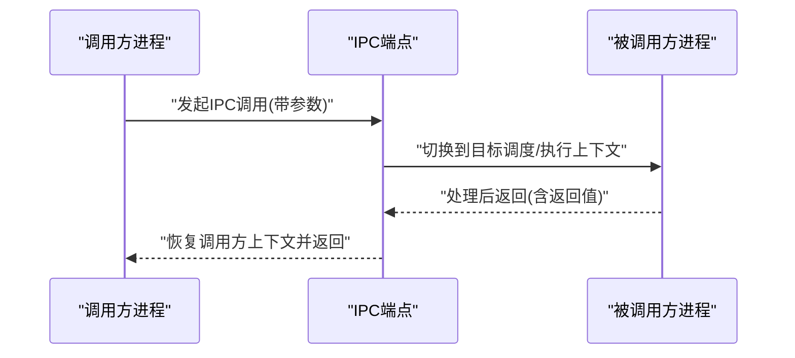
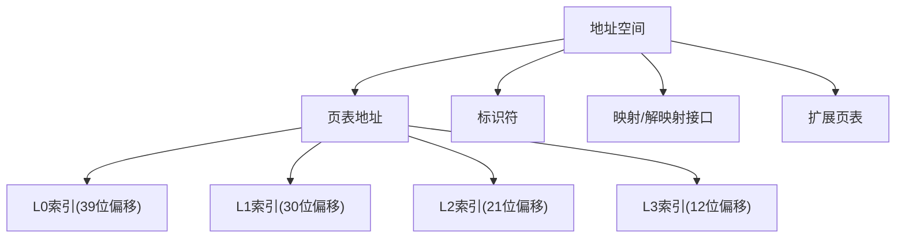
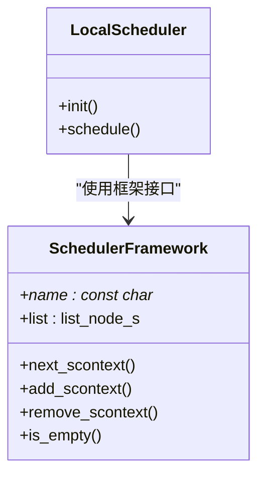
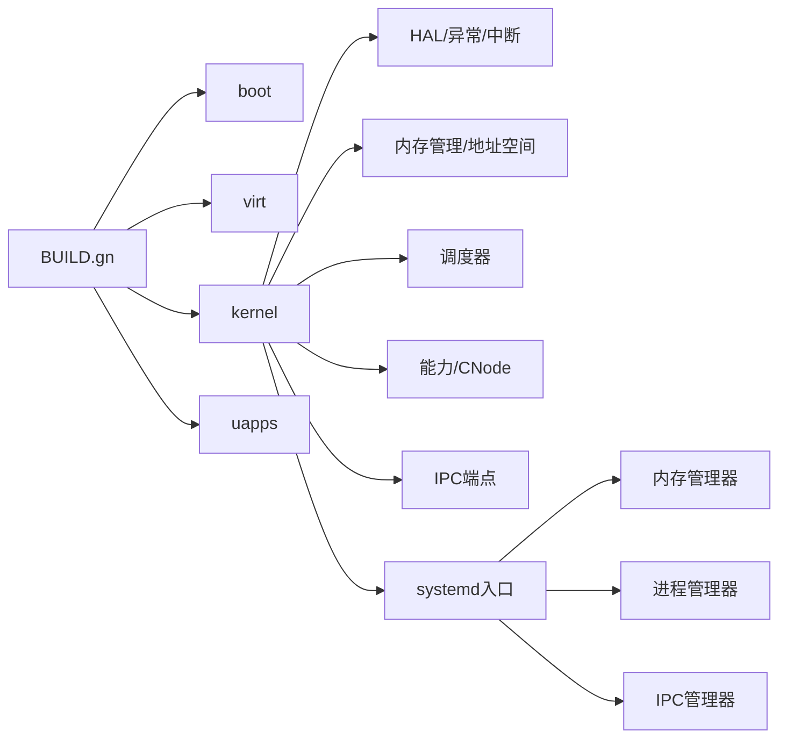

# 架构设计

<cite>
**本文引用的文件**
- [README.md](file://README.md)
- [BUILD.gn](file://BUILD.gn)
- [docs/microkernel_design.md](file://docs/microkernel_design.md)
- [docs/kernel/microkernel_design.md](file://docs/kernel/microkernel_design.md)
- [kernel/kernel.c](file://kernel/kernel.c)
- [boot/boot.c](file://boot/boot.c)
- [kernel/systemd/systemd.c](file://kernel/systemd/systemd.c)
- [kernel/include/core.h](file://kernel/include/core.h)
- [kernel/include/capability/capability.h](file://kernel/include/capability/capability.h)
- [kernel/include/capability/cnode.h](file://kernel/include/capability/cnode.h)
- [kernel/include/ipc/ipc.h](file://kernel/include/ipc/ipc.h)
- [kernel/include/ipc/ipc_endpoint.h](file://kernel/include/ipc/ipc_endpoint.h)
- [kernel/include/mm/address_space.h](file://kernel/include/mm/address_space.h)
- [kernel/include/scheduler/sched_framework.h](file://kernel/include/scheduler/sched_framework.h)
- [kernel/include/arch/arm64/common.h](file://kernel/include/arch/arm64/common.h)
</cite>

## 目录
1. [简介](#简介)
2. [项目结构](#项目结构)
3. [核心组件](#核心组件)
4. [架构总览](#架构总览)
5. [详细组件分析](#详细组件分析)
6. [依赖关系分析](#依赖关系分析)
7. [性能考量](#性能考量)
8. [故障排查指南](#故障排查指南)
9. [结论](#结论)
10. [附录](#附录)

## 简介
本架构文档面向TranquilOS微内核，系统性阐述其高层设计理念、架构模式与系统边界。TranquilOS采用aarch64平台，基于最小特权原则、类型安全与模块化分离，通过能力（Capability）机制实现细粒度权限控制，并将内存管理、进程/线程管理、设备管理等核心职责下沉至用户态系统守护进程systemd，内核仅保留引导、异常处理、中断、调度、地址空间切换与基础IPC等最小集合能力。系统支持从EL2（Type-1虚拟化）或EL1两种路径启动，具备多核、定时器、控制流即时切换的IPC等特性。

## 项目结构
仓库采用按“功能域+层次”混合组织方式：内核代码位于kernel/，引导代码位于boot/，用户态系统服务位于uapps/，用户态库位于ulibs/，虚拟化层位于virt/，平台相关配置位于platform/，构建入口位于根目录BUILD.gn与各子模块BUILD.gn。

- 根级构建聚合组OS包含：boot、virt、kernel、uapps四大构件。
- kernel/包含架构抽象层、中断、异常、MMU、调度、IPC、能力系统、内存管理、定时器、系统服务框架等。
- boot/负责从EL3/EL2/EL1启动流程、设备树解析、早期内存与页表初始化、跳转到内核主函数。
- uapps/为用户态系统服务与应用集合，如devmgr、fsmgr、idle、shell、netmgr等。
- ulibs/提供libc、libfdt、libelf、libgraphics、libalgorithm及系统客户端库。
- virt/实现虚拟化层，包含hypervisor、VCPU、VM、页表stage2、中断与定时器等。
- platform/包含不同硬件平台的设备树与链接脚本。

**图表来源**
- [BUILD.gn](file://BUILD.gn#L1-L9)

**章节来源**
- [BUILD.gn](file://BUILD.gn#L1-L9)
- [README.md](file://README.md#L1-L42)

## 核心组件
- 引导与启动链路：boot.c根据当前EL选择EL2或EL1路径，完成设备树解析、早期设备初始化、页表映射与跳转。
- 内核主循环：kernel.c在主从CPU上完成异常/中断初始化、本地定时器与调度器初始化、建立内核页表、创建systemd并进入调度循环。
- 用户态系统守护进程systemd：负责核心服务的生命周期管理（进程/线程创建、地址空间映射、能力端点注册、控制台创建）、加载ELF二进制、分发部署策略（单实例或多核实例）。
- 能力与CNode：capability.h定义能力头与能力结构；cnode.h定义能力节点，用于进程内能力表的动态扩展与线性索引。
- 地址空间与页表：address_space.h定义地址空间标识、页表层级索引位宽、映射/解映射接口。
- IPC与端点：ipc.h与ipc_endpoint.h定义IPC调用与回复的接口，以及端点阻塞/唤醒等待队列。
- 调度框架：sched_framework.h定义调度框架的回调接口，便于插入不同调度算法。
- 架构常量：arch/arm64/common.h定义栈大小等架构相关常量。

**章节来源**
- [boot/boot.c](file://boot/boot.c#L34-L107)
- [kernel/kernel.c](file://kernel/kernel.c#L125-L224)
- [kernel/systemd/systemd.c](file://kernel/systemd/systemd.c#L15-L74)
- [kernel/include/capability/capability.h](file://kernel/include/capability/capability.h#L11-L26)
- [kernel/include/capability/cnode.h](file://kernel/include/capability/cnode.h#L11-L28)
- [kernel/include/mm/address_space.h](file://kernel/include/mm/address_space.h#L19-L42)
- [kernel/include/ipc/ipc.h](file://kernel/include/ipc/ipc.h#L9-L13)
- [kernel/include/ipc/ipc_endpoint.h](file://kernel/include/ipc/ipc_endpoint.h#L8-L25)
- [kernel/include/scheduler/sched_framework.h](file://kernel/include/scheduler/sched_framework.h#L11-L18)
- [kernel/include/arch/arm64/common.h](file://kernel/include/arch/arm64/common.h#L4-L6)

## 架构总览
TranquilOS采用“微内核+系统守护进程”的经典分层架构：
- 微内核：负责异常/中断、MMU/页表、调度、基础IPC、能力与地址空间切换。
- 用户态systemd：负责物理内存管理、进程/线程生命周期、设备管理、文件系统、网络等服务的拉起与管理。
- 启动路径：支持EL2 Type-1虚拟化（hypervisor -> kernel -> systemd）与EL1直接启动（kernel -> systemd）。

**图表来源**
- [boot/boot.c](file://boot/boot.c#L82-L107)
- [kernel/kernel.c](file://kernel/kernel.c#L125-L224)
- [kernel/systemd/systemd.c](file://kernel/systemd/systemd.c#L217-L246)

## 详细组件分析

### 组件A：引导与启动链路（EL2/EL1）
- EL3初始化：设置安全寄存器与SPSR，准备EL2/EL1切换。
- EL2路径：从设备树查找hypervisor镜像并跳转，实现Type-1虚拟化。
- EL1路径：解析设备树、初始化早期设备、引导内存、重映射内核、唤醒次核、跳转到内核主函数。
- 关键流程：设备树解析 -> 早期设备初始化 -> 页表映射 -> 跳转内核。

**图表来源**
- [boot/boot.c](file://boot/boot.c#L138-L176)
- [boot/boot.c](file://boot/boot.c#L82-L107)

**章节来源**
- [boot/boot.c](file://boot/boot.c#L34-L107)
- [boot/boot.c](file://boot/boot.c#L109-L136)
- [boot/boot.c](file://boot/boot.c#L138-L176)

### 组件B：内核主循环与调度
- 主CPU初始化：设备树、异常、中断、定时器、本地设备、模块初始化、生成内核页表、创建根CNode、初始化调度器、广播就绪事件。
- 从CPU初始化：等待主CPU初始化完成，初始化本地设备、定时器、调度器，进入调度循环。
- 调度循环：持续从本地调度器获取下一个可执行调度上下文，切换到用户执行上下文。

**图表来源**
- [kernel/kernel.c](file://kernel/kernel.c#L125-L224)
- [kernel/kernel.c](file://kernel/kernel.c#L61-L123)

**章节来源**
- [kernel/kernel.c](file://kernel/kernel.c#L125-L224)
- [kernel/kernel.c](file://kernel/kernel.c#L61-L123)

### 组件C：systemd系统守护进程
- 服务编排：定义核心服务列表（devmgr、fsmgr、idle、shell、netmgr），按部署模式（单实例/每核实例）创建进程、线程。
- 地址空间与能力：为每个服务创建CNode与VSpace，加载ELF二进制到物理内存并映射到虚拟地址，注册名称服务端点与控制台。
- 运行循环：初始化内存/进程/IPC管理器，读取DTB，挂载ramdisk，启动核心服务，进入空转让出CPU。

**图表来源**
- [kernel/systemd/systemd.c](file://kernel/systemd/systemd.c#L217-L246)
- [kernel/systemd/systemd.c](file://kernel/systemd/systemd.c#L76-L205)

**章节来源**
- [kernel/systemd/systemd.c](file://kernel/systemd/systemd.c#L15-L74)
- [kernel/systemd/systemd.c](file://kernel/systemd/systemd.c#L76-L205)
- [kernel/systemd/systemd.c](file://kernel/systemd/systemd.c#L217-L246)

### 组件D：能力与CNode（最小特权与类型安全）
- 能力结构：能力头包含对象类型与权限位，能力体包含物理地址，配合CNode实现进程内能力表。
- CNode：支持动态扩展与线性索引，进程资源（内核对象）集中存储于CNode，通过引用传递实现最小权限访问。
- 接口：创建CNode、扩展CNode、新增能力、查询能力、生成ID等。

**图表来源**
- [kernel/include/capability/capability.h](file://kernel/include/capability/capability.h#L11-L26)
- [kernel/include/capability/cnode.h](file://kernel/include/capability/cnode.h#L11-L28)

**章节来源**
- [kernel/include/capability/capability.h](file://kernel/include/capability/capability.h#L11-L26)
- [kernel/include/capability/cnode.h](file://kernel/include/capability/cnode.h#L11-L28)

### 组件E：IPC与端点（控制流即时切换）
- IPC调用：以端点为入口，支持带参数的调用与返回，避免依赖调度器行为，提升实时性与速度。
- 端点模型：包含入口执行上下文、调度上下文、入口地址/栈指针、调用者调度上下文、等待队列等。
- 接口：发起调用、回复返回、阻塞等待、唤醒等待者。

**图表来源**
- [kernel/include/ipc/ipc.h](file://kernel/include/ipc/ipc.h#L9-L13)
- [kernel/include/ipc/ipc_endpoint.h](file://kernel/include/ipc/ipc_endpoint.h#L8-L25)

**章节来源**
- [kernel/include/ipc/ipc.h](file://kernel/include/ipc/ipc.h#L9-L13)
- [kernel/include/ipc/ipc_endpoint.h](file://kernel/include/ipc/ipc_endpoint.h#L8-L25)

### 组件F：地址空间与页表（模块化分离）
- 地址空间：以页表地址与标识符表示，提供低/高地址空间切换、页映射/解映射、扩展页表等接口。
- 页表层级：定义四层页表索引位移，支持按层级扩展与映射。
- 用途：内核与用户进程共享地址空间抽象，内核维护自身页表，systemd负责用户态进程的地址空间管理。

**图表来源**
- [kernel/include/mm/address_space.h](file://kernel/include/mm/address_space.h#L11-L42)

**章节来源**
- [kernel/include/mm/address_space.h](file://kernel/include/mm/address_space.h#L11-L42)

### 组件G：调度框架（可插拔调度）
- 框架接口：定义next/add/remove/is_empty等回调，便于接入FIFO、RR、EDF等调度算法。
- 本地调度器：每个CPU维护本地调度器，结合调度框架实现公平与高效调度。

**图表来源**
- [kernel/include/scheduler/sched_framework.h](file://kernel/include/scheduler/sched_framework.h#L11-L18)

**章节来源**
- [kernel/include/scheduler/sched_framework.h](file://kernel/include/scheduler/sched_framework.h#L11-L18)

## 依赖关系分析
- 构建聚合：根BUILD.gn将boot、virt、kernel、uapps聚合为OS整体产物。
- 内核依赖：kernel.c依赖HAL、中断、定时器、调度、地址空间、能力、systemd入口等模块。
- systemd依赖：systemd.c依赖内存/进程/IPC管理器、ELF解析、ramdisk、服务注册等。
- 启动链路：boot.c依赖设备树、早期设备、页表重映射、跳转内核。

**图表来源**
- [BUILD.gn](file://BUILD.gn#L1-L9)
- [kernel/kernel.c](file://kernel/kernel.c#L125-L224)
- [kernel/systemd/systemd.c](file://kernel/systemd/systemd.c#L217-L246)

**章节来源**
- [BUILD.gn](file://BUILD.gn#L1-L9)
- [kernel/kernel.c](file://kernel/kernel.c#L125-L224)
- [kernel/systemd/systemd.c](file://kernel/systemd/systemd.c#L217-L246)

## 性能考量
- 最小内核：仅保留异常/中断、MMU/页表、调度、基础IPC与能力，降低内核态开销。
- 即时IPC：控制流直接切换，减少调度器参与，提高IPC吞吐与时延可控性。
- 多核友好：每核本地调度器与本地定时器，减少跨核干扰。
- 页表与地址空间：四层页表与地址空间抽象，兼顾灵活性与性能。
- 用户态服务：将内存管理、设备驱动、文件系统等迁移到用户态，内核态保持稳定与可验证。

## 故障排查指南
- 启动失败（EL1）：检查设备树节点“tranquil,kernel”是否存在、地址是否正确；确认早期设备初始化与页表重映射是否成功。
- 启动失败（EL2）：确认设备树节点“tranquil,hypervisor”存在且地址有效；确保EL3安全寄存器配置正确。
- systemd未启动：检查设备树节点“tranquil,systemd”地址；查看systemd服务列表与ramdisk挂载。
- 调度无响应：确认本地调度器初始化完成、从CPU已广播初始化完成事件；检查调度循环是否正常。
- IPC异常：确认端点初始化、调用参数与返回路径；检查目标进程是否处于可调度状态。

**章节来源**
- [boot/boot.c](file://boot/boot.c#L34-L45)
- [boot/boot.c](file://boot/boot.c#L124-L135)
- [kernel/kernel.c](file://kernel/kernel.c#L202-L208)
- [kernel/systemd/systemd.c](file://kernel/systemd/systemd.c#L217-L246)

## 结论
TranquilOS通过微内核+systemd的分层架构，将复杂性从内核态剥离到用户态，结合能力机制与地址空间抽象，实现最小特权、类型安全与模块化分离。EL2/EL1双启动路径满足虚拟化与裸机场景，调度与IPC优化兼顾实时性与吞吐。建议在后续版本中完善文件系统、网络管理与图形渲染等用户态服务，持续增强可扩展性与生态完整性。

## 附录
- 技术栈与工具链：aarch64、GN/Ninja构建、EL3/EL2/EL1寄存器操作、设备树（DTB）。
- 第三方依赖：libfdt（设备树解析）、libelf（ELF解析）、libc（标准库）、libgraphics、libalgorithm等。
- 版本与兼容性：内核与引导版本信息见引导与内核打印输出；平台差异通过设备树与链接脚本适配。

**章节来源**
- [README.md](file://README.md#L35-L42)
- [kernel/include/arch/arm64/common.h](file://kernel/include/arch/arm64/common.h#L4-L6)