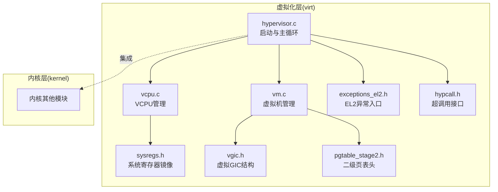
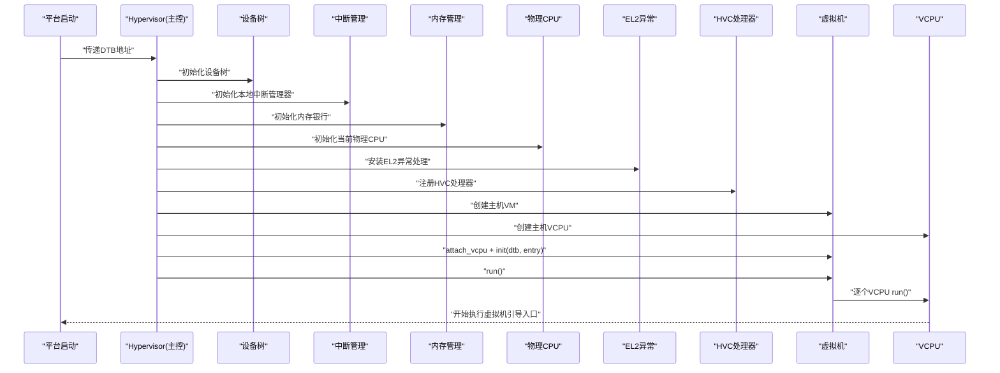
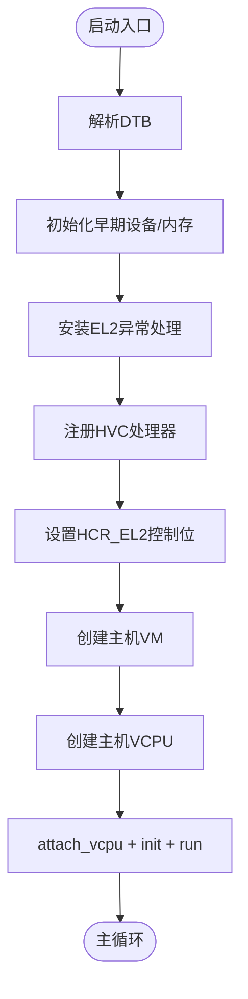
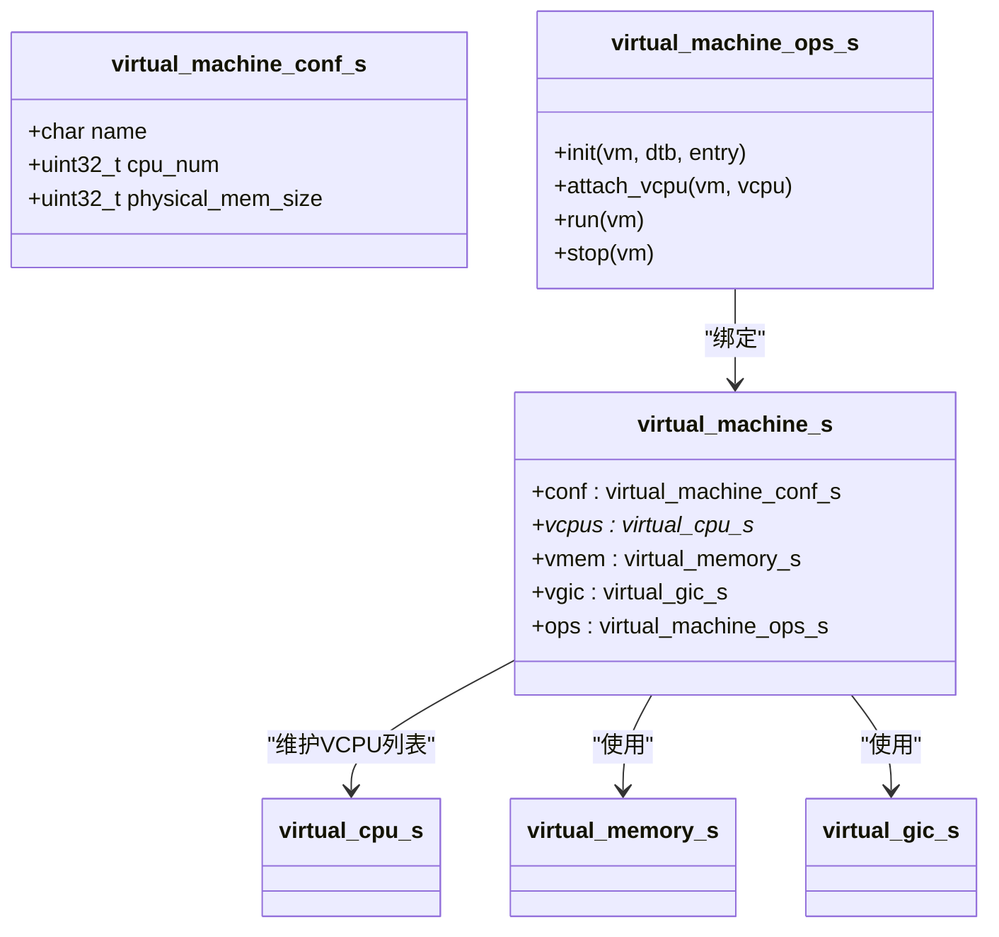
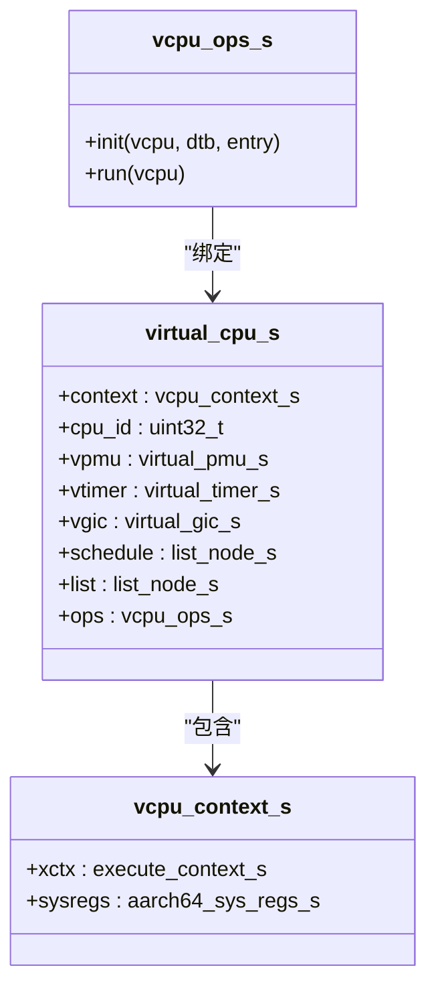
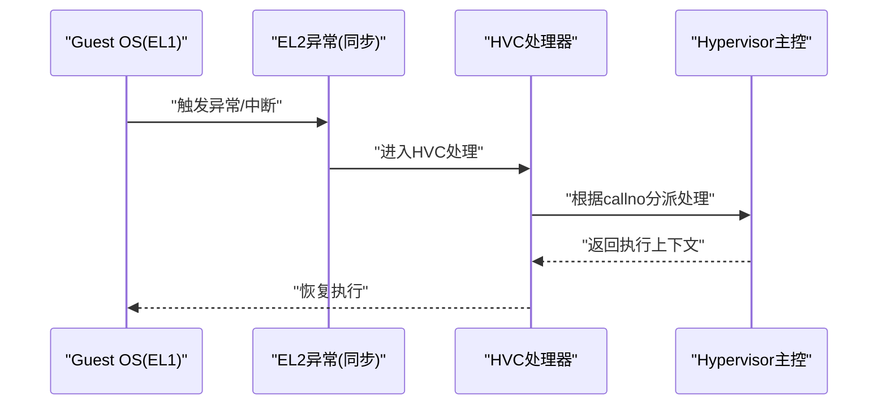
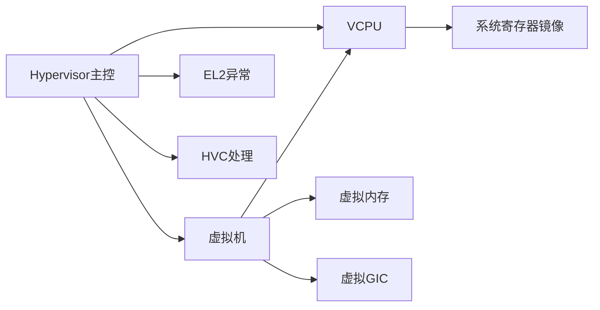

# 虚拟化支持架构

<cite>
**本文引用的文件**
- [virt/hypervisor.c](file://virt/hypervisor.c)
- [virt/vm.c](file://virt/vm.c)
- [virt/vcpu.c](file://virt/vcpu.c)
- [virt/include/vm.h](file://virt/include/vm.h)
- [virt/include/vcpu.h](file://virt/include/vcpu.h)
- [virt/include/arch/arm64/sysregs.h](file://virt/include/arch/arm64/sysregs.h)
- [virt/include/arch/arm64/exceptions_el2.h](file://virt/include/arch/arm64/exceptions_el2.h)
- [virt/include/hypcall/hypcall.h](file://virt/include/hypcall/hypcall.h)
- [virt/include/mm/pgtable_stage2.h](file://virt/include/mm/pgtable_stage2.h)
- [virt/include/vgic.h](file://virt/include/vgic.h)
</cite>

## 目录
1. [简介](#简介)
2. [项目结构](#项目结构)
3. [核心组件](#核心组件)
4. [架构总览](#架构总览)
5. [详细组件分析](#详细组件分析)
6. [依赖关系分析](#依赖关系分析)
7. [性能考量](#性能考量)
8. [故障排除指南](#故障排除指南)
9. [结论](#结论)
10. [附录](#附录)

## 简介
本技术文档围绕 TranquilOS 的虚拟化支持架构展开，重点阐述基于 EL2 的 Type-1 Hypervisor 设计与实现，涵盖虚拟机创建、VCPU 管理、资源分配、与内核的集成方式、虚拟化数据结构、内存管理（含二级页表）、I/O 虚拟化（VGIC）以及虚拟机生命周期管理与运行流程。文档同时提供配置建议、性能优化策略与常见问题排查方法，并分析虚拟化对系统性能与安全的影响。

## 项目结构
TranquilOS 的虚拟化子系统位于独立的 virt 目录中，采用“按功能域分层”的组织方式：
- hypervisor 启动与入口：负责初始化异常向量、中断管理、设备树解析、内存银行与物理 CPU 初始化，并建立主机 VM 与 VCPU，随后进入运行循环。
- 虚拟机与 VCPU：通过统一的接口抽象，实现 VM 的初始化、运行、停止与 VCPU 的上下文初始化与调度。
- 内存与寄存器：定义了 AArch64 系统寄存器镜像结构，用于保存/恢复虚拟 CPU 的系统寄存器状态；提供二级页表头文件占位，为 Stage-2 地址转换预留扩展点。
- I/O 虚拟化：VGIC 结构体描述虚拟 GIC 分发器与 CPU 接口寄存器布局，为后续映射与中断路由做准备。
- 异常与系统调用：EL2 异常入口声明、HVC 超调用号定义与注册机制，构成虚拟化控制面的基础。

**图表来源**
- [virt/hypervisor.c](file://virt/hypervisor.c#L101-L145)
- [virt/vm.c](file://virt/vm.c#L55-L59)
- [virt/vcpu.c](file://virt/vcpu.c#L60-L66)
- [virt/include/arch/arm64/sysregs.h](file://virt/include/arch/arm64/sysregs.h#L7-L104)
- [virt/include/arch/arm64/exceptions_el2.h](file://virt/include/arch/arm64/exceptions_el2.h#L4-L24)
- [virt/include/hypcall/hypcall.h](file://virt/include/hypcall/hypcall.h#L6-L16)
- [virt/include/mm/pgtable_stage2.h](file://virt/include/mm/pgtable_stage2.h#L1-L4)
- [virt/include/vgic.h](file://virt/include/vgic.h#L60-L63)

**章节来源**
- [virt/hypervisor.c](file://virt/hypervisor.c#L101-L145)
- [virt/vm.c](file://virt/vm.c#L55-L59)
- [virt/vcpu.c](file://virt/vcpu.c#L60-L66)
- [virt/include/arch/arm64/sysregs.h](file://virt/include/arch/arm64/sysregs.h#L7-L104)
- [virt/include/arch/arm64/exceptions_el2.h](file://virt/include/arch/arm64/exceptions_el2.h#L4-L24)
- [virt/include/hypcall/hypcall.h](file://virt/include/hypcall/hypcall.h#L6-L16)
- [virt/include/mm/pgtable_stage2.h](file://virt/include/mm/pgtable_stage2.h#L1-L4)
- [virt/include/vgic.h](file://virt/include/vgic.h#L60-L63)

## 核心组件
- Hypervisor 主控与入口
  - 初始化设备树、早期设备、内存银行、物理 CPU 上下文与本地中断管理器。
  - 安装 EL2 异常处理、注册 HVC 处理器、设置 HCR_EL2 控制位，完成 Hypervisor 基础环境。
  - 创建主机 VM 与 VCPU，加载 DTB 与引导入口地址，挂接并运行 VM。
- 虚拟机管理
  - 提供 VM 的初始化、运行、附加 VCPU、停止等操作的默认实现。
  - 维护 VM 的配置、VCPU 列表、虚拟内存与虚拟 GIC。
- VCPU 管理
  - 初始化 VCPU 执行上下文（EL1 栈、PC、SPSR），并预留虚拟 GIC、虚拟定时器、虚拟 PMU 初始化接口。
  - 提供 VCPU 运行入口，切换到 VCPU 上下文执行。
- 系统寄存器镜像
  - 定义 aarch64_sys_regs_s 结构，覆盖大量系统寄存器字段，用于保存/恢复虚拟 CPU 的状态。
- EL2 异常与 HVC
  - 声明多种 EL2 异常入口函数原型，便于在汇编层实现具体处理。
  - 定义 HVC 超调用号集合，提供 hypcall 注册接口，作为虚拟化控制面的统一入口。
- 二级页表与 I/O 虚拟化
  - pgtable_stage2.h 为 Stage-2 地址转换预留头文件。
  - vgic.h 描述虚拟 GIC 的分发器与 CPU 接口寄存器布局，为中断虚拟化奠定基础。

**章节来源**
- [virt/hypervisor.c](file://virt/hypervisor.c#L47-L145)
- [virt/vm.c](file://virt/vm.c#L5-L59)
- [virt/vcpu.c](file://virt/vcpu.c#L15-L66)
- [virt/include/arch/arm64/sysregs.h](file://virt/include/arch/arm64/sysregs.h#L7-L104)
- [virt/include/arch/arm64/exceptions_el2.h](file://virt/include/arch/arm64/exceptions_el2.h#L4-L24)
- [virt/include/hypcall/hypcall.h](file://virt/include/hypcall/hypcall.h#L6-L16)
- [virt/include/mm/pgtable_stage2.h](file://virt/include/mm/pgtable_stage2.h#L1-L4)
- [virt/include/vgic.h](file://virt/include/vgic.h#L4-L63)

## 架构总览
下图展示了 Hypervisor 的启动路径与关键交互：从平台启动到 EL2 异常安装、HVC 注册、VM/VCPU 创建与运行，以及与内核其他子系统的集成点。

**图表来源**
- [virt/hypervisor.c](file://virt/hypervisor.c#L101-L145)
- [virt/vm.c](file://virt/vm.c#L5-L59)
- [virt/vcpu.c](file://virt/vcpu.c#L15-L66)
- [virt/include/arch/arm64/exceptions_el2.h](file://virt/include/arch/arm64/exceptions_el2.h#L24-L24)
- [virt/include/hypcall/hypcall.h](file://virt/include/hypcall/hypcall.h#L13-L16)

## 详细组件分析

### Hypervisor 主控与启动流程
- 关键职责
  - 解析 DTB、初始化早期设备与内存银行。
  - 安装 EL2 异常处理、注册 HVC 处理器。
  - 设置 HCR_EL2 控制位，启用必要的虚拟化特性。
  - 创建主机 VM 与 VCPU，加载引导入口地址，运行虚拟机。
- 启动序列要点
  - 在进入 EL2 后禁用中断，打印 Hypervisor 欢迎信息与当前核心信息。
  - 初始化 IRQ 管理器、关键设备、稀疏内存银行，记录 Hypervisor 结束地址。
  - 完成物理 CPU 初始化后，安装 EL2 异常与 HVC 处理器，再开启中断。
  - 最终创建 VM/VCPU 并运行，进入主循环等待。

**图表来源**
- [virt/hypervisor.c](file://virt/hypervisor.c#L101-L145)

**章节来源**
- [virt/hypervisor.c](file://virt/hypervisor.c#L28-L145)

### 虚拟机管理（VM）
- 数据结构
  - 虚拟机配置包含名称、VCPU 数量与物理内存大小。
  - VM 维护 VCPU 链表、虚拟内存对象与虚拟 GIC。
- 默认操作
  - 初始化：为每个 VCPU 调用其 init，传入 DTB 与入口地址。
  - 运行：遍历 VCPU 列表，依次调用其 run。
  - 附加 VCPU：支持单链表追加。
  - 停止：当前为空实现，可扩展为清理资源与回退状态。

**图表来源**
- [virt/include/vm.h](file://virt/include/vm.h#L19-L34)

**章节来源**
- [virt/vm.c](file://virt/vm.c#L5-L59)
- [virt/include/vm.h](file://virt/include/vm.h#L19-L34)

### VCPU 管理
- 数据结构
  - vcpu_context_s 包含执行上下文与 AArch64 系统寄存器镜像。
  - vcpu_ops_s 提供 init 与 run 两个操作。
- 初始化流程
  - 清空通用寄存器，设置 x0 为 DTB 地址，分配栈页并设置 pc/spsr。
  - 预留虚拟 GIC、虚拟定时器、虚拟 PMU 初始化接口。
- 运行流程
  - 通过上下文切换进入 VCPU 执行。

**图表来源**
- [virt/include/vcpu.h](file://virt/include/vcpu.h#L26-L44)
- [virt/include/arch/arm64/sysregs.h](file://virt/include/arch/arm64/sysregs.h#L7-L104)

**章节来源**
- [virt/vcpu.c](file://virt/vcpu.c#L15-L66)
- [virt/include/vcpu.h](file://virt/include/vcpu.h#L14-L44)
- [virt/include/arch/arm64/sysregs.h](file://virt/include/arch/arm64/sysregs.h#L7-L104)

### 系统寄存器镜像与上下文保存/恢复
- aarch64_sys_regs_s 覆盖大量系统寄存器字段，用于在虚拟化场景中保存/恢复 VCPU 的状态。
- 提供保存/恢复接口声明，便于在上下文切换或异常处理时使用。

**章节来源**
- [virt/include/arch/arm64/sysregs.h](file://virt/include/arch/arm64/sysregs.h#L7-L104)
- [virt/include/arch/arm64/sysregs.h](file://virt/include/arch/arm64/sysregs.h#L106-L107)

### EL2 异常与 HVC 超调用
- EL2 异常入口声明：提供 SP0 与 SPx 两种模式下的同步/IRQ/FIQ/SError 入口原型，便于在汇编层实现具体处理。
- HVC 超调用：定义一组超调用号，如 Hypervisor 初始化、VM/VCPU 生命周期管理等；提供 hypcall 注册接口，由 Hypervisor 主控在启动阶段注册。

**图表来源**
- [virt/include/arch/arm64/exceptions_el2.h](file://virt/include/arch/arm64/exceptions_el2.h#L4-L24)
- [virt/include/hypcall/hypcall.h](file://virt/include/hypcall/hypcall.h#L6-L16)
- [virt/hypervisor.c](file://virt/hypervisor.c#L78-L99)

**章节来源**
- [virt/include/arch/arm64/exceptions_el2.h](file://virt/include/arch/arm64/exceptions_el2.h#L4-L24)
- [virt/include/hypcall/hypcall.h](file://virt/include/hypcall/hypcall.h#L6-L16)
- [virt/hypervisor.c](file://virt/hypervisor.c#L78-L99)

### 内存管理与二级页表
- 当前实现
  - 虚拟机初始化阶段会调用虚拟内存初始化接口，但未见具体实现细节。
  - 二级页表头文件存在，表明 Stage-2 地址转换能力处于预留/扩展阶段。
- 建议
  - 在 VM 初始化时建立 Stage-2 映射，将 VM 物理内存与宿主物理内存进行映射。
  - 实现页表分配与回收、TLB 维护与刷新逻辑，确保内存访问正确性与性能。

**章节来源**
- [virt/vm.c](file://virt/vm.c#L11-L18)
- [virt/include/mm/pgtable_stage2.h](file://virt/include/mm/pgtable_stage2.h#L1-L4)

### I/O 虚拟化（VGIC）
- 结构设计
  - 虚拟 GIC 分发器与 CPU 接口寄存器布局清晰，便于在 Stage-2 中将虚拟 CPU 接口访问映射到物理地址。
  - 支持中断使能、优先级、目标 CPU 等寄存器组，满足虚拟中断管理需求。
- 实现建议
  - 在 VM 初始化阶段完成虚拟 GIC 的映射与路由配置。
  - 将物理中断源与虚拟中断线关联，实现中断注入与 EOI 流程。

**章节来源**
- [virt/include/vgic.h](file://virt/include/vgic.h#L4-L63)

## 依赖关系分析
- 组件耦合
  - Hypervisor 主控依赖 VM/VCPU 抽象与 EL2/HVC 子系统，形成控制面核心。
  - VM/VCPU 依赖内存与系统寄存器镜像，以维持运行时状态。
  - VGIC 与内存子系统共同支撑 I/O 虚拟化。
- 外部依赖
  - 设备树解析与关键设备初始化依赖平台固件与硬件描述。
  - 中断管理器与物理 CPU 初始化依赖底层架构支持。

**图表来源**
- [virt/hypervisor.c](file://virt/hypervisor.c#L101-L145)
- [virt/vm.c](file://virt/vm.c#L5-L59)
- [virt/vcpu.c](file://virt/vcpu.c#L15-L66)
- [virt/include/arch/arm64/sysregs.h](file://virt/include/arch/arm64/sysregs.h#L7-L104)
- [virt/include/vgic.h](file://virt/include/vgic.h#L60-L63)

**章节来源**
- [virt/hypervisor.c](file://virt/hypervisor.c#L101-L145)
- [virt/vm.c](file://virt/vm.c#L5-L59)
- [virt/vcpu.c](file://virt/vcpu.c#L15-L66)

## 性能考量
- 中断延迟与吞吐
  - 合理配置 HCR_EL2 控制位，避免不必要的陷阱与重定向，减少异常开销。
  - 使用本地中断管理器与高效中断路由，降低虚拟中断处理延迟。
- 内存访问效率
  - 在 Stage-2 映射中尽量采用大页或连续映射，减少页表层级与 TLB 失效。
  - 对频繁访问的寄存器与页表项进行缓存与预热。
- 上下文切换
  - 精简系统寄存器保存/恢复路径，仅在必要时切换完整上下文。
  - 在多 VCPU 场景下，合理安排调度与亲和性，减少跨核迁移。
- I/O 虚拟化
  - VGIC 映射应尽量简化中断路径，避免额外的页表查表与权限检查。

[本节为通用指导，不直接分析具体文件]

## 故障排除指南
- 启动阶段无输出或卡死
  - 检查 EL2 异常是否正确安装，HVC 处理器是否注册。
  - 确认设备树初始化与关键设备初始化顺序正确。
- VM 无法运行或立即退出
  - 核对 VM 初始化流程：attach_vcpu、init(dtb, entry) 是否成功。
  - 检查 VCPU 上下文初始化：栈分配、PC/SPSR 设置是否正确。
- 中断异常
  - 确认本地中断管理器已初始化且启用。
  - 检查 HCR_EL2 控制位设置，确保允许物理中断路由。
- 内存相关问题
  - 若出现内存访问错误，检查 Stage-2 映射是否建立，页表是否正确。
  - 关注 TLB 刷新与一致性，避免脏缓存导致的访问失败。

**章节来源**
- [virt/hypervisor.c](file://virt/hypervisor.c#L101-L145)
- [virt/vm.c](file://virt/vm.c#L5-L59)
- [virt/vcpu.c](file://virt/vcpu.c#L19-L33)

## 结论
TranquilOS 的虚拟化支持架构以 EL2 Type-1 Hypervisor 为核心，通过清晰的 VM/VCPU 抽象、系统寄存器镜像与 HVC 控制面，实现了从启动到运行的完整闭环。当前实现完成了 Hypervisor 主控、VM/VCPU 生命周期与基本异常/HVC 通道，内存与 I/O 虚拟化处于扩展预留阶段。后续可在 Stage-2 页表、VGIC 映射与调度策略上进一步完善，以获得更稳健的虚拟化体验与更高的性能表现。

## 附录

### 虚拟化配置示例（概念性）
- Hypervisor 启动参数
  - 传入 DTB 地址，确保设备树解析与关键设备初始化。
  - 设置 HCR_EL2 控制位，启用必要的虚拟化特性并保持最小陷阱集。
- VM/VCPU 配置
  - VM 名称、VCPU 数量与物理内存大小在配置结构中定义。
  - 初始化时为每个 VCPU 分配上下文并设置入口地址。
- I/O 虚拟化
  - 在 VM 初始化阶段完成虚拟 GIC 的映射与中断路由配置。

[本节为概念性说明，不直接分析具体文件]

### 虚拟化对系统性能与安全的影响
- 性能
  - EL2 陷阱与重定向会引入额外开销，需通过合理的控制位与映射策略降低影响。
  - Stage-2 页表与中断路由的复杂度直接影响 I/O 与内存访问延迟。
- 安全
  - 通过隔离 VM 的内存与外设访问，结合严格的中断路由与寄存器保护，提升系统整体安全性。
  - HVC 控制面应严格校验参数与来源，防止越权调用。

[本节为通用指导，不直接分析具体文件]