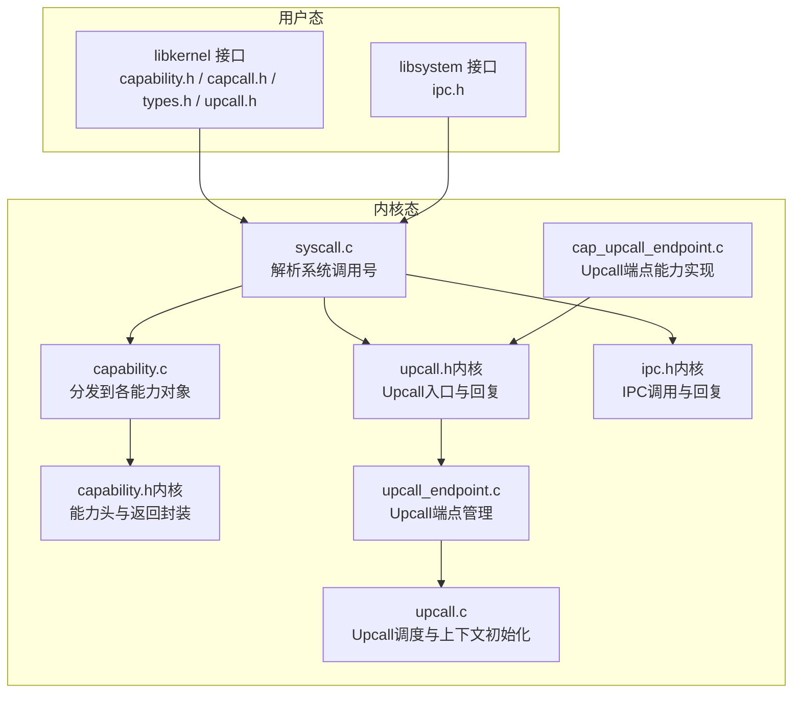
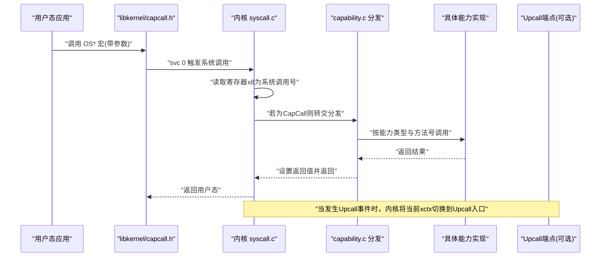
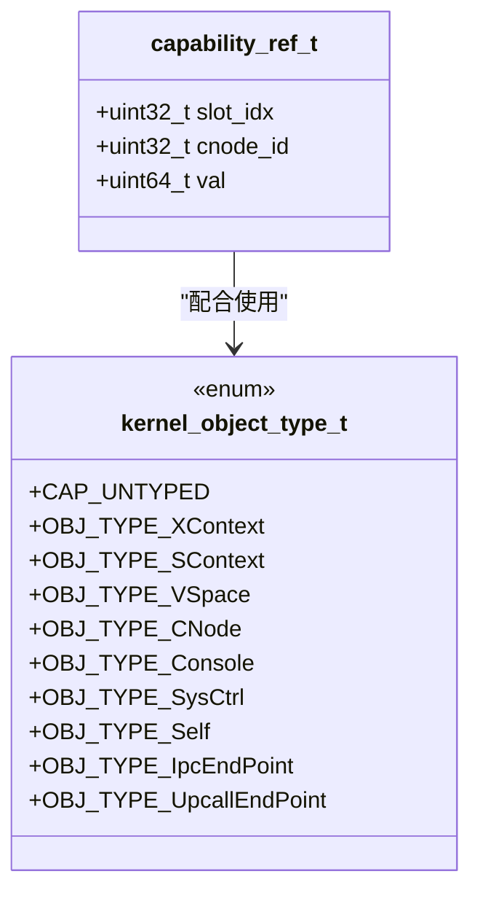
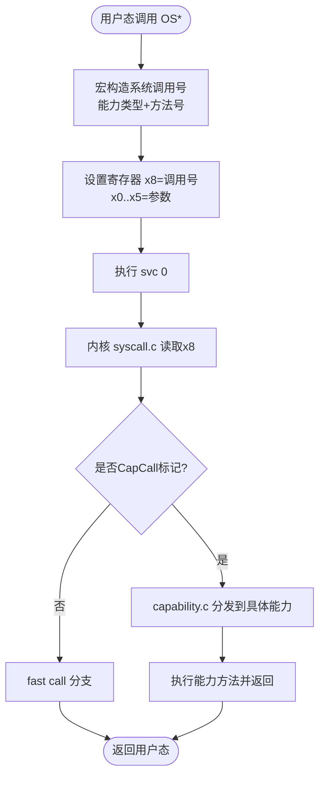
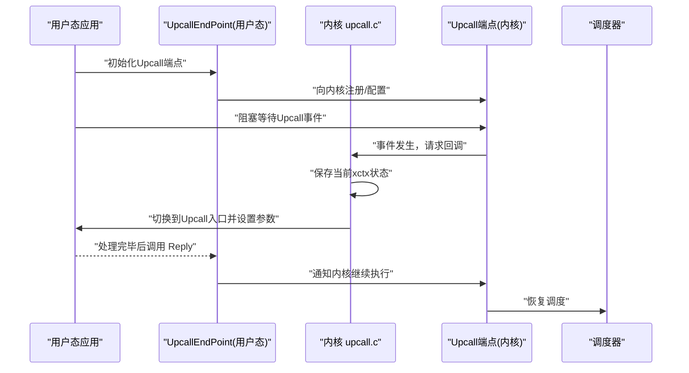
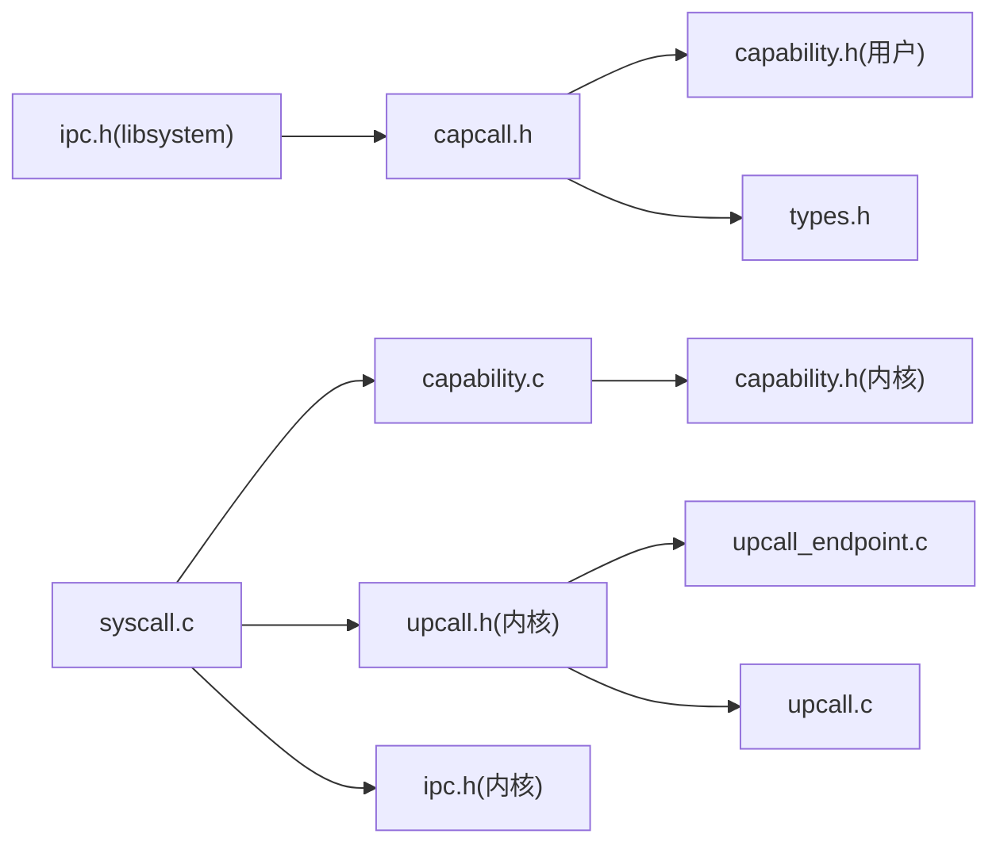

# 内核接口库

<cite>
**本文引用的文件**
- [capability.h](file://ulibs/include/libkernel/capability.h)
- [capcall.h](file://ulibs/include/libkernel/capcall.h)
- [types.h](file://ulibs/include/libkernel/types.h)
- [upcall.h](file://ulibs/include/libkernel/upcall.h)
- [ipc.h](file://ulibs/include/libsystem/ipc.h)
- [capability.h（内核）](file://kernel/include/capability/capability.h)
- [syscall.c](file://kernel/syscall/syscall.c)
- [capability.c](file://kernel/capability/capability.c)
- [upcall.h（内核）](file://kernel/include/upcall/upcall.h)
- [upcall_endpoint.c](file://kernel/upcall/upcall_endpoint.c)
- [upcall.c](file://kernel/upcall/upcall.c)
- [cap_upcall_endpoint.c](file://kernel/capability/cap_upcall_endpoint.c)
- [cap_sysctrl.h](file://kernel/include/capability/cap_sysctrl.h)
- [ipc.h（内核）](file://kernel/include/ipc/ipc.h)
</cite>

## 目录
1. [简介](#简介)
2. [项目结构](#项目结构)
3. [核心组件](#核心组件)
4. [架构总览](#架构总览)
5. [详细组件分析](#详细组件分析)
6. [依赖关系分析](#依赖关系分析)
7. [性能考量](#性能考量)
8. [故障排查指南](#故障排查指南)
9. [结论](#结论)
10. [附录：使用示例与最佳实践](#附录使用示例与最佳实践)

## 简介
本文件面向TranquilOS内核接口库的使用者与维护者，系统性阐述用户态到内核态的调用封装（CapCall）、能力（Capability）体系的获取/验证/传递机制、内核数据类型与常量定义、Upcall机制在用户态的实现与回调处理，并提供安全与错误处理建议。目标是帮助开发者正确、安全地进行系统级编程。

## 项目结构
TranquilOS将“用户态接口库”与“内核实现”清晰分离：
- 用户态接口库位于 ulibs/include/libkernel 与 ulibs/include/libsystem，提供统一的C语言API与宏封装，屏蔽底层寄存器约定与系统调用细节。
- 内核侧在 kernel/ 下实现具体能力分发、上下文切换、IPC与Upcall等逻辑。

图表来源
- [capability.h](file://ulibs/include/libkernel/capability.h#L1-L141)
- [capcall.h](file://ulibs/include/libkernel/capcall.h#L1-L177)
- [types.h](file://ulibs/include/libkernel/types.h#L1-L76)
- [upcall.h](file://ulibs/include/libkernel/upcall.h#L1-L17)
- [ipc.h](file://ulibs/include/libsystem/ipc.h#L1-L73)
- [capability.h（内核）](file://kernel/include/capability/capability.h#L1-L26)
- [syscall.c](file://kernel/syscall/syscall.c#L1-L20)
- [capability.c](file://kernel/capability/capability.c#L1-L58)
- [upcall.h（内核）](file://kernel/include/upcall/upcall.h#L1-L13)
- [upcall_endpoint.c](file://kernel/upcall/upcall_endpoint.c#L1-L50)
- [upcall.c](file://kernel/upcall/upcall.c#L1-L35)
- [cap_upcall_endpoint.c](file://kernel/capability/cap_upcall_endpoint.c#L84-L110)
- [ipc.h（内核）](file://kernel/include/ipc/ipc.h#L1-L13)

章节来源
- [capability.h](file://ulibs/include/libkernel/capability.h#L1-L141)
- [capcall.h](file://ulibs/include/libkernel/capcall.h#L1-L177)
- [types.h](file://ulibs/include/libkernel/types.h#L1-L76)
- [upcall.h](file://ulibs/include/libkernel/upcall.h#L1-L17)
- [ipc.h](file://ulibs/include/libsystem/ipc.h#L1-L73)
- [capability.h（内核）](file://kernel/include/capability/capability.h#L1-L26)
- [syscall.c](file://kernel/syscall/syscall.c#L1-L20)
- [capability.c](file://kernel/capability/capability.c#L1-L58)
- [upcall.h（内核）](file://kernel/include/upcall/upcall.h#L1-L13)
- [upcall_endpoint.c](file://kernel/upcall/upcall_endpoint.c#L1-L50)
- [upcall.c](file://kernel/upcall/upcall.c#L1-L35)
- [cap_upcall_endpoint.c](file://kernel/capability/cap_upcall_endpoint.c#L84-L110)
- [ipc.h（内核）](file://kernel/include/ipc/ipc.h#L1-L13)

## 核心组件
- 能力类型与引用
  - 用户态通过 capability_ref_t 表示能力引用，包含 cnode_id 与 slot_idx，用于定位内核中的物理对象。
  - kernel_object_type_t 定义了内核对象类型集合，如 XContext、SContext、VSpace、CNode、Console、SysCtrl、Self、IpcEndPoint、UpcallEndPoint。
- CapCall 宏族
  - 通过固定寄存器约定与 svc 指令进入内核，宏根据能力类型与方法号拼装系统调用号，自动传递参数并接收返回值。
  - 提供 0~6 参数版本的封装，简化用户态调用。
- 内核数据类型
  - map_result_t 描述内存映射结果，包含成功与多种失败场景（页表层级无效、已映射、空指针等）。
- Upcall 机制
  - 用户态通过 UpcallEndPoint 能力与内核建立回调通道；内核在特定事件（如缺页）时将控制权切换至用户态的Upcall入口。
- IPC 服务发现与调用
  - libsystem/ipc.h 提供服务注册与查询接口，基于 CapCall 的 IpcEndPoint 能力完成跨进程通信。

章节来源
- [capability.h](file://ulibs/include/libkernel/capability.h#L4-L50)
- [capability.h](file://ulibs/include/libkernel/capability.h#L6-L18)
- [capcall.h](file://ulibs/include/libkernel/capcall.h#L13-L127)
- [types.h](file://ulibs/include/libkernel/types.h#L4-L26)
- [upcall.h](file://ulibs/include/libkernel/upcall.h#L4-L15)
- [ipc.h](file://ulibs/include/libsystem/ipc.h#L11-L34)

## 架构总览
下图展示从用户态 CapCall 到内核分发与执行的完整路径，以及 Upcall 回调的关键节点。

图表来源
- [capcall.h](file://ulibs/include/libkernel/capcall.h#L15-L127)
- [syscall.c](file://kernel/syscall/syscall.c#L8-L20)
- [capability.c](file://kernel/capability/capability.c#L14-L54)
- [capability.h（内核）](file://kernel/include/capability/capability.h#L22-L24)
- [upcall.h（内核）](file://kernel/include/upcall/upcall.h#L9-L11)

## 详细组件分析

### 能力系统与引用
- 能力引用 capability_ref_t
  - 由 cnode_id 与 slot_idx 组成，用于在能力节点中唯一标识一个能力条目。
  - CNODE_CURRENT_CREF 常量表示“当前能力节点”的引用。
- 能力类型 kernel_object_type_t
  - 覆盖执行上下文、调度上下文、虚拟空间、能力节点、控制台、系统控制、自能力、IPC端点、Upcall端点等。
- 方法枚举
  - 各能力类型的方法枚举集中定义于 capability.h，便于用户态通过 CapCall 宏调用。

图表来源
- [capability.h](file://ulibs/include/libkernel/capability.h#L44-L50)
- [capability.h](file://ulibs/include/libkernel/capability.h#L6-L18)

章节来源
- [capability.h](file://ulibs/include/libkernel/capability.h#L4-L50)
- [capability.h](file://ulibs/include/libkernel/capability.h#L6-L18)

### CapCall 实现原理
- 系统调用号构造
  - 通过宏将能力类型与方法号编码进系统调用号的高段位，最低位保留为 CapCall 标记。
- 寄存器约定
  - 使用 x8 保存系统调用号；x0-x5 作为参数传递；返回值通过 x0 返回。
- svc 指令触发
  - 在用户态通过 svc 0 进入内核，内核在 syscall.c 中识别 CapCall 并转交 capability.c 分发。
- 多参宏族
  - 提供 0~6 参数版本的 CAP_CALL_DEFINE* 宏，自动设置寄存器并生成函数名 OS*。

图表来源
- [capcall.h](file://ulibs/include/libkernel/capcall.h#L13-L127)
- [syscall.c](file://kernel/syscall/syscall.c#L8-L20)
- [capability.c](file://kernel/capability/capability.c#L14-L54)

章节来源
- [capcall.h](file://ulibs/include/libkernel/capcall.h#L13-L127)
- [syscall.c](file://kernel/syscall/syscall.c#L8-L20)
- [capability.c](file://kernel/capability/capability.c#L14-L54)

### 内核数据类型与使用
- map_result_t
  - 描述内存映射操作的结果，包含成功与多类失败状态（不同层级页表项无效、已映射、空指针等），便于上层进行错误处理与重试策略。
- capability_header_s 与 capability_s
  - 内核侧能力头部包含类型与权限位，结合物理地址形成最终能力对象。
- 权限位
  - CAP_RIGHT_ALL 定义全权限位掩码；部分能力（如 SysCtrl）定义了具体权限位常量，用于后续权限检查。

章节来源
- [types.h](file://ulibs/include/libkernel/types.h#L4-L26)
- [capability.h（内核）](file://kernel/include/capability/capability.h#L9-L20)
- [cap_sysctrl.h](file://kernel/include/capability/cap_sysctrl.h#L7-L11)

### Upcall 机制（用户态视角）
- 用户态职责
  - 通过 UpcallEndPoint 能力与内核建立回调通道；在需要等待或处理异步事件时，将当前执行上下文挂起，等待内核回调。
- 内核态职责
  - upcall.c 负责在事件发生时，将当前执行上下文切换到 Upcall 入口，并设置参数寄存器。
  - upcall_endpoint.c 管理 Upcall 端点的状态与等待队列。
- 回调流程
  - 内核调用 upcall_call_with_args 初始化用户态上下文并设置参数，随后进行调度切换。
  - 用户态回调处理完成后，通过 UpcallEndPoint 的 Reply 方法通知内核继续执行。

图表来源
- [upcall.h（内核）](file://kernel/include/upcall/upcall.h#L9-L11)
- [upcall_endpoint.c](file://kernel/upcall/upcall_endpoint.c#L8-L50)
- [upcall.c](file://kernel/upcall/upcall.c#L8-L35)
- [cap_upcall_endpoint.c](file://kernel/capability/cap_upcall_endpoint.c#L92-L110)

章节来源
- [upcall.h](file://ulibs/include/libkernel/upcall.h#L4-L15)
- [upcall_endpoint.c](file://kernel/upcall/upcall_endpoint.c#L8-L50)
- [upcall.c](file://kernel/upcall/upcall.c#L8-L35)
- [cap_upcall_endpoint.c](file://kernel/capability/cap_upcall_endpoint.c#L92-L110)

### IPC 服务发现与调用（用户态）
- 服务注册与查询
  - 通过 sys_register_service 与 sys_get_service 完成服务注册与发现；内部使用 CapCall 的 IpcEndPoint 能力发起调用。
- 重试与超时
  - 当服务尚未就绪时，提供轮询与睡眠重试逻辑，避免立即失败。

章节来源
- [ipc.h](file://ulibs/include/libsystem/ipc.h#L52-L70)

## 依赖关系分析
- 用户态接口库依赖关系
  - libkernel/capcall.h 依赖 libkernel/capability.h 与 libkernel/types.h，以获得能力类型、方法枚举与返回类型。
  - libsystem/ipc.h 依赖 libkernel/capcall.h 以通过 CapCall 发起 IPC 调用。
- 内核态依赖关系
  - syscall.c 依赖 capability.c 以分发 CapCall；capability.c 依据能力类型调用对应能力实现。
  - Upcall 机制依赖 upcall.h（内核）、upcall_endpoint.c 与 upcall.c 协同工作。
  - IPC 机制依赖 kernel/include/ipc/ipc.h 中的声明。

图表来源
- [capcall.h](file://ulibs/include/libkernel/capcall.h#L1-L10)
- [capability.h](file://ulibs/include/libkernel/capability.h#L1-L141)
- [types.h](file://ulibs/include/libkernel/types.h#L1-L76)
- [ipc.h](file://ulibs/include/libsystem/ipc.h#L1-L73)
- [syscall.c](file://kernel/syscall/syscall.c#L1-L20)
- [capability.c](file://kernel/capability/capability.c#L1-L58)
- [capability.h（内核）](file://kernel/include/capability/capability.h#L1-L26)
- [upcall.h（内核）](file://kernel/include/upcall/upcall.h#L1-L13)
- [upcall_endpoint.c](file://kernel/upcall/upcall_endpoint.c#L1-L50)
- [upcall.c](file://kernel/upcall/upcall.c#L1-L35)
- [ipc.h（内核）](file://kernel/include/ipc/ipc.h#L1-L13)

章节来源
- [capcall.h](file://ulibs/include/libkernel/capcall.h#L1-L10)
- [capability.h](file://ulibs/include/libkernel/capability.h#L1-L141)
- [types.h](file://ulibs/include/libkernel/types.h#L1-L76)
- [ipc.h](file://ulibs/include/libsystem/ipc.h#L1-L73)
- [syscall.c](file://kernel/syscall/syscall.c#L1-L20)
- [capability.c](file://kernel/capability/capability.c#L1-L58)
- [capability.h（内核）](file://kernel/include/capability/capability.h#L1-L26)
- [upcall.h（内核）](file://kernel/include/upcall/upcall.h#L1-L13)
- [upcall_endpoint.c](file://kernel/upcall/upcall_endpoint.c#L1-L50)
- [upcall.c](file://kernel/upcall/upcall.c#L1-L35)
- [ipc.h（内核）](file://kernel/include/ipc/ipc.h#L1-L13)

## 性能考量
- CapCall 调用开销
  - 每次调用涉及寄存器设置、svc 指令与内核态分发，频繁调用应合并参数或采用批量接口（如内核提供）。
- Upcall 调度
  - Upcall 会触发上下文切换与调度，应在必要时启用；避免在高频事件中滥用。
- 内存映射
  - map_result_t 反映映射失败原因，应结合日志与重试策略减少不必要的重复映射。

## 故障排查指南
- CapCall 返回值与错误处理
  - 对于内存映射类调用，优先检查 map_result_t 的具体失败原因，针对性修复页表或地址对齐问题。
- Upcall 未触发
  - 确认 UpcallEndPoint 已正确初始化并与内核注册；检查内核侧 upcall_endpoint.c 的状态与等待队列。
- IPC 服务不可用
  - 使用 sys_get_service 时注意轮询与重试逻辑；确认服务端已注册且 cref 有效。
- 权限不足
  - 内核 capability.c 中存在权限检查占位，建议在实现中补充权限校验逻辑，防止越权访问。

章节来源
- [types.h](file://ulibs/include/libkernel/types.h#L27-L74)
- [capability.c](file://kernel/capability/capability.c#L20-L21)
- [upcall_endpoint.c](file://kernel/upcall/upcall_endpoint.c#L28-L50)
- [ipc.h](file://ulibs/include/libsystem/ipc.h#L61-L70)

## 结论
TranquilOS 的内核接口库通过 CapCall 将用户态调用标准化为统一的系统调用格式，结合能力引用与权限位实现细粒度的安全控制。Upcall 与 IPC 为异步事件与跨进程通信提供了可靠通道。遵循本文的使用规范与安全建议，可有效提升系统级编程的稳定性与安全性。

## 附录：使用示例与最佳实践
- 获取与验证能力
  - 使用能力节点方法创建/准备目标能力，并通过 capability_ref_t 持有引用；在调用前确认权限位满足需求。
- 调用 CapCall
  - 优先使用带参宏族（0~6 参数）以减少手写汇编；注意参数顺序与类型匹配。
- 内存映射
  - 调用 VSpace 的映射方法后检查 map_result_t，针对不同失败原因采取修复措施。
- Upcall 回调
  - 在用户态初始化 UpcallEndPoint 并设置回调入口；在回调中仅做必要处理并尽快调用 Reply。
- IPC 服务
  - 使用 sys_register_service 注册服务，使用 sys_get_service 查询服务；对不可用的服务进行重试。
- 安全与错误处理
  - 在内核侧完善权限检查；在用户态对所有返回值进行判错与日志记录；避免在关键路径中进行无谓的系统调用。

章节来源
- [capcall.h](file://ulibs/include/libkernel/capcall.h#L128-L177)
- [types.h](file://ulibs/include/libkernel/types.h#L4-L26)
- [upcall.h](file://ulibs/include/libkernel/upcall.h#L4-L15)
- [ipc.h](file://ulibs/include/libsystem/ipc.h#L52-L70)
- [capability.c](file://kernel/capability/capability.c#L20-L21)