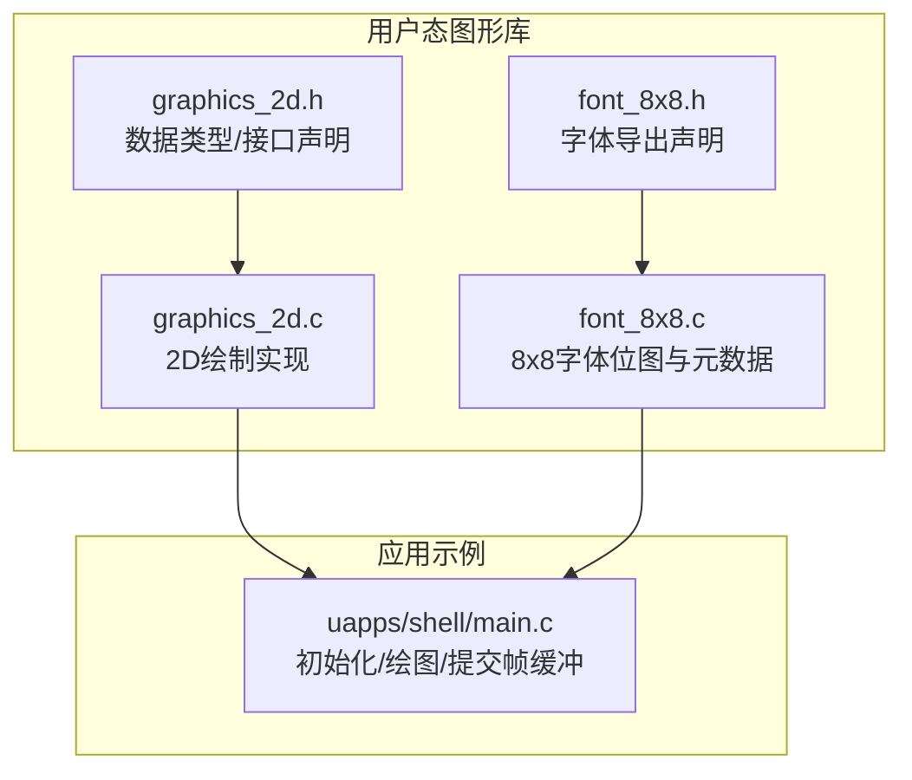
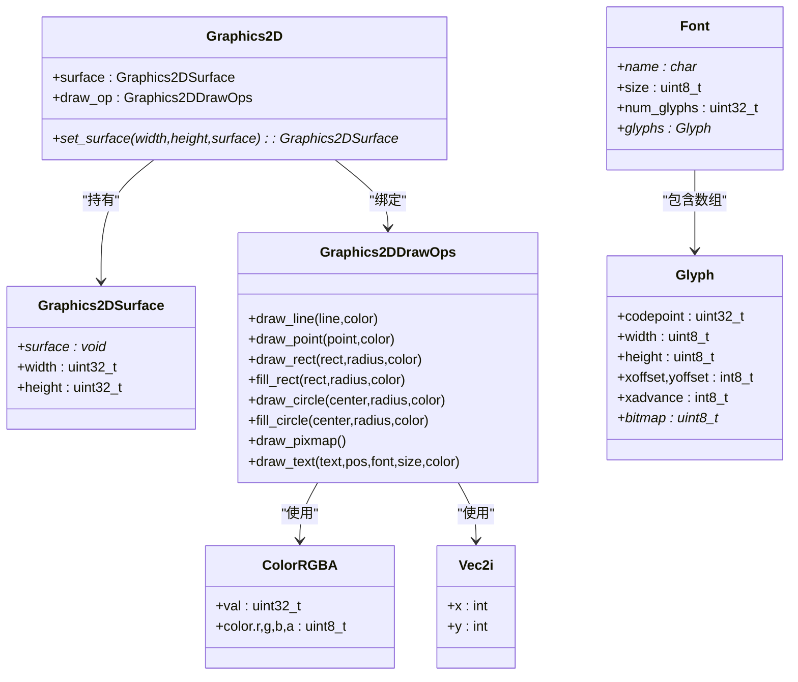
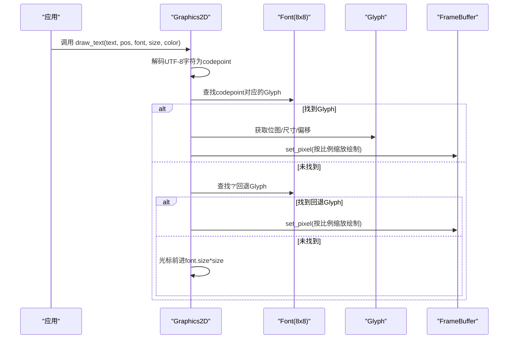
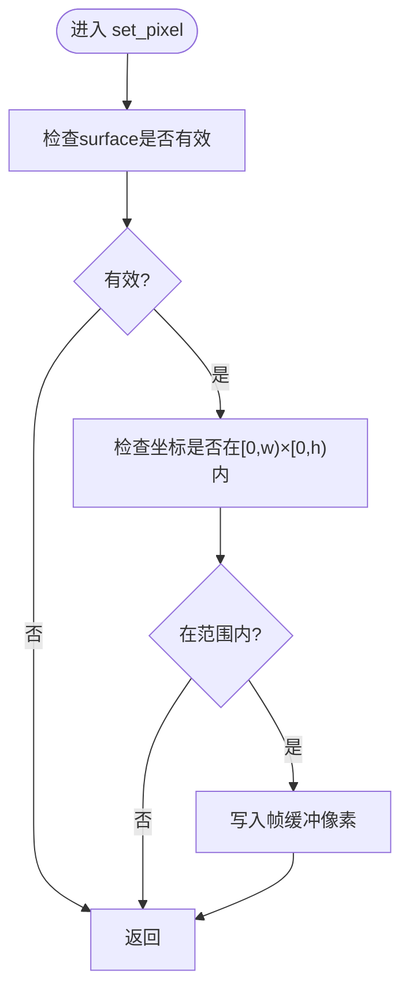
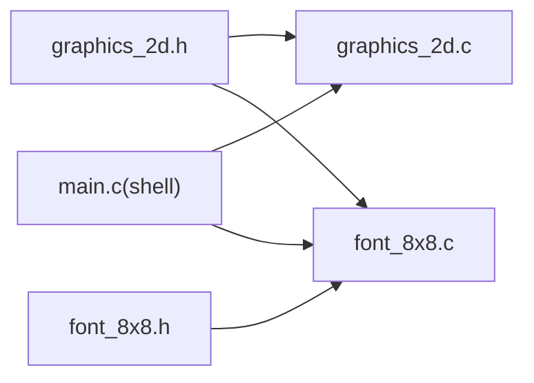

# 图形库

<cite>
**本文引用的文件列表**
- [graphics_2d.h](file://ulibs/include/libgraphics/graphics_2d.h)
- [font_8x8.h](file://ulibs/include/libgraphics/font_8x8.h)
- [graphics_2d.c](file://ulibs/libgraphics/graphics_2d.c)
- [font_8x8.c](file://ulibs/libgraphics/font_8x8.c)
- [main.c](file://uapps/shell/main.c)
</cite>

## 目录
1. [简介](#简介)
2. [项目结构](#项目结构)
3. [核心组件](#核心组件)
4. [架构总览](#架构总览)
5. [详细组件分析](#详细组件分析)
6. [依赖关系分析](#依赖关系分析)
7. [性能考量](#性能考量)
8. [故障排查指南](#故障排查指南)
9. [结论](#结论)
10. [附录：使用示例与最佳实践](#附录使用示例与最佳实践)

## 简介
本文件为 TranquilOS 图形库的详细技术文档，聚焦于：
- 8×8 字体的实现原理（字符编码、位图存储、渲染流程）
- 2D 图形绘制函数（点、线、矩形、圆、文本）的实现与调用方式
- 坐标系统与颜色管理机制
- 使用示例（文本显示、简单图形绘制、图像处理思路）
- 性能优化建议与内存使用注意事项
- 常见问题与兼容性考虑

## 项目结构
图形库位于用户态库目录 ulibs 下，核心文件如下：
- 头文件：libgraphics/graphics_2d.h、libgraphics/font_8x8.h
- 实现：libgraphics/graphics_2d.c、libgraphics/font_8x8.c
- 使用示例：uapps/shell/main.c

图表来源
- [graphics_2d.h](file://ulibs/include/libgraphics/graphics_2d.h#L1-L138)
- [font_8x8.h](file://ulibs/include/libgraphics/font_8x8.h#L1-L9)
- [graphics_2d.c](file://ulibs/libgraphics/graphics_2d.c#L1-L404)
- [font_8x8.c](file://ulibs/libgraphics/font_8x8.c#L1-L204)
- [main.c](file://uapps/shell/main.c#L1-L72)

章节来源
- [graphics_2d.h](file://ulibs/include/libgraphics/graphics_2d.h#L1-L138)
- [font_8x8.h](file://ulibs/include/libgraphics/font_8x8.h#L1-L9)
- [graphics_2d.c](file://ulibs/libgraphics/graphics_2d.c#L1-L404)
- [font_8x8.c](file://ulibs/libgraphics/font_8x8.c#L1-L204)
- [main.c](file://uapps/shell/main.c#L1-L72)

## 核心组件
- 图形上下文与表面
  - graphics_2d_s：封装当前绘制目标（graphics_2d_surface_s）与绘制操作表（graphics_2d_draw_ops_s）
  - graphics_2d_surface_s：包含帧缓冲指针、宽高
- 绘图操作接口
  - draw_line、draw_point、draw_rect、fill_rect、draw_circle、fill_circle、draw_pixmap、draw_text
- 基础几何与颜色
  - vec2i_s、point2d、line2d、rect2d、border_radius
  - color_rgba_t：RGBA 32 位颜色，支持按分量构造与打包
- 字体与字形
  - graphics_2d_font_s、graphics_2d_glyph_s：描述字体名称、大小、字形数量与字形数组
  - font_8x8：内置 8×8 字体实例

章节来源
- [graphics_2d.h](file://ulibs/include/libgraphics/graphics_2d.h#L7-L134)
- [font_8x8.h](file://ulibs/include/libgraphics/font_8x8.h#L1-L9)

## 架构总览
图形库采用“上下文 + 操作表”的设计，通过 graphics_2d_init 初始化后，应用只需持有 graphics_2d_s 指针即可调用各类绘制函数。绘制函数内部通过 set_pixel 将像素写入帧缓冲，坐标系为屏幕坐标（原点在左上角），颜色为 RGBA。

图表来源
- [graphics_2d.h](file://ulibs/include/libgraphics/graphics_2d.h#L18-L134)
- [font_8x8.h](file://ulibs/include/libgraphics/font_8x8.h#L1-L9)
- [font_8x8.c](file://ulibs/libgraphics/font_8x8.c#L82-L97)

## 详细组件分析

### 8×8 字体实现原理
- 字符编码与字形索引
  - 每个字形由 graphics_2d_glyph_s 描述，包含 codepoint、宽高、偏移、前进距离与位图指针
  - 字体 font_8x8 是一个常量对象，包含若干字形条目，覆盖常用 ASCII 及部分扩展字符
- 位图数据存储
  - 字形位图以紧凑的位序列存储，每行按行优先顺序排列，每个字节内按 MSB→LSB 的位序存放
  - 位为 1 表示该像素位置被点亮；位为 0 表示透明
- 文本渲染流程
  - graphics_2d_draw_text 接收 UTF-8 字符串，逐字解码为 codepoint
  - 在字体字形表中查找对应字形；若未找到则回退到占位符 '?'，再找不到则跳过该字符
  - 调用 draw_glyph 按比例缩放绘制字形位图，更新光标位置

图表来源
- [graphics_2d.c](file://ulibs/libgraphics/graphics_2d.c#L51-L73)
- [graphics_2d.c](file://ulibs/libgraphics/graphics_2d.c#L75-L87)
- [graphics_2d.c](file://ulibs/libgraphics/graphics_2d.c#L89-L114)
- [graphics_2d.c](file://ulibs/libgraphics/graphics_2d.c#L335-L368)
- [font_8x8.c](file://ulibs/libgraphics/font_8x8.c#L99-L195)

章节来源
- [font_8x8.c](file://ulibs/libgraphics/font_8x8.c#L1-L204)
- [graphics_2d.c](file://ulibs/libgraphics/graphics_2d.c#L51-L114)
- [graphics_2d.c](file://ulibs/libgraphics/graphics_2d.c#L335-L368)

### 2D 图形绘制函数实现
- 像素写入与边界检查
  - set_pixel 对传入坐标进行边界检查，确保不越界；将颜色值直接写入帧缓冲（32 位 RGBA）
- 点与线
  - draw_point 直接设置单点像素
  - draw_line 使用 Bresenham 算法，按步进方向迭代，逐点绘制
- 矩形与圆
  - draw_rect 支持四角圆角，通过 quarter-circle 子程序绘制圆角弧段，再连接直线边
  - fill_rect 在有圆角时对每个像素判断是否在圆角外接圆之外，决定是否绘制
  - draw_circle 使用中点画圆算法，对称绘制八象限像素
  - fill_circle 遍历矩形区域，用距离判别式判断是否在圆内
- 文本
  - draw_text 逐字渲染，支持 UTF-8 编码与回退机制

图表来源
- [graphics_2d.c](file://ulibs/libgraphics/graphics_2d.c#L4-L14)

章节来源
- [graphics_2d.c](file://ulibs/libgraphics/graphics_2d.c#L4-L160)
- [graphics_2d.c](file://ulibs/libgraphics/graphics_2d.c#L171-L281)
- [graphics_2d.c](file://ulibs/libgraphics/graphics_2d.c#L283-L326)

### 坐标系统与颜色管理
- 坐标系统
  - 屏幕坐标系原点在左上角，x 向右递增，y 向下递增
  - 几何对象使用 vec2i_s 表示二维整数坐标
- 颜色管理
  - color_rgba_t 以 32 位无符号整型表示 RGBA，支持按分量构造与整体打包
  - 绘制函数统一接收 color_rgba_t，最终写入帧缓冲

章节来源
- [graphics_2d.h](file://ulibs/include/libgraphics/graphics_2d.h#L7-L34)
- [graphics_2d.c](file://ulibs/libgraphics/graphics_2d.c#L4-L14)

## 依赖关系分析
- 头文件依赖
  - graphics_2d.h 定义所有公共数据类型与接口
  - font_8x8.h 仅包含 graphics_2d.h 并导出 font_8x8 实例
- 实现依赖
  - graphics_2d.c 依赖 graphics_2d.h，并在内部实现 set_pixel、Bresenham、中点画圆等算法
  - font_8x8.c 依赖 graphics_2d.h，定义 8×8 字体的字形数组与 font_8x8 对象
- 应用依赖
  - shell 示例通过 graphics_2d_init 初始化图形上下文，设置帧缓冲，调用绘制函数并提交给设备管理器

图表来源
- [graphics_2d.h](file://ulibs/include/libgraphics/graphics_2d.h#L1-L138)
- [graphics_2d.c](file://ulibs/libgraphics/graphics_2d.c#L1-L404)
- [font_8x8.h](file://ulibs/include/libgraphics/font_8x8.h#L1-L9)
- [font_8x8.c](file://ulibs/libgraphics/font_8x8.c#L1-L204)
- [main.c](file://uapps/shell/main.c#L1-L72)

章节来源
- [graphics_2d.h](file://ulibs/include/libgraphics/graphics_2d.h#L1-L138)
- [font_8x8.h](file://ulibs/include/libgraphics/font_8x8.h#L1-L9)
- [graphics_2d.c](file://ulibs/libgraphics/graphics_2d.c#L1-L404)
- [font_8x8.c](file://ulibs/libgraphics/font_8x8.c#L1-L204)
- [main.c](file://uapps/shell/main.c#L1-L72)

## 性能考量
- 帧缓冲访问
  - set_pixel 为最底层写入，建议在上层批量绘制前进行范围裁剪，减少越界检查开销
- 算法复杂度
  - draw_line：O(dx+dy)，适合短边快速绘制
  - draw_rect/fill_rect：O(w×h)，建议优先使用 fill_rect，避免重复调用多条 draw_line
  - draw_circle/fill_circle：O(πr^2) 或 O(r^2)，可考虑缓存圆周点集以复用
- 字体渲染
  - draw_text 逐字遍历字符串，建议在高频场景下预构建字形映射表，避免每次查找
  - draw_glyph 中按比例缩放存在嵌套循环，建议限制 size 参数或使用整数缩放策略
- 内存与带宽
  - 帧缓冲为 32 位 RGBA，每像素 4 字节；大分辨率下内存占用显著
  - 提交帧缓冲时尽量减少拷贝，使用共享内存与零拷贝提交策略

[本节为通用性能指导，不直接分析具体文件]

## 故障排查指南
- 帧缓冲为空或越界
  - 现象：调用绘制函数无效果
  - 排查：确认已通过 set_surface 设置了有效的 surface 指针与宽高
  - 参考：graphics_2d_set_surface 的参数校验逻辑
- 绘制结果异常
  - 现象：颜色错乱、像素越界
  - 排查：检查颜色构造是否正确；确认坐标在 [0,width)×[0,height) 范围内
  - 参考：set_pixel 的边界检查
- 文本不显示或显示乱码
  - 现象：部分字符缺失或显示为占位符
  - 排查：确认传入 UTF-8 字符串；检查字体字形表是否包含对应 codepoint；必要时使用回退字符
  - 参考：graphics_2d_draw_text 的回退逻辑
- 圆角矩形绘制不完整
  - 现象：圆角区域缺失或不圆滑
  - 排查：确认 border_radius 的四个角半径设置合理；fill_rect 的圆角判断条件是否满足
  - 参考：fill_rect 的圆角距离判断

章节来源
- [graphics_2d.c](file://ulibs/libgraphics/graphics_2d.c#L371-L386)
- [graphics_2d.c](file://ulibs/libgraphics/graphics_2d.c#L4-L14)
- [graphics_2d.c](file://ulibs/libgraphics/graphics_2d.c#L335-L368)
- [graphics_2d.c](file://ulibs/libgraphics/graphics_2d.c#L212-L281)

## 结论
TranquilOS 图形库提供了简洁高效的 2D 绘图能力，结合 8×8 内置字体与基础几何绘制函数，能够满足轻量级图形界面与系统信息展示需求。通过合理的坐标与颜色管理、清晰的接口设计以及可扩展的字体系统，开发者可以快速实现文本与简单图形的绘制。在性能方面，建议关注帧缓冲访问、算法复杂度与内存占用，并在高频场景下进行针对性优化。

[本节为总结性内容，不直接分析具体文件]

## 附录：使用示例与最佳实践

### 使用示例
- 初始化与设置帧缓冲
  - 创建 graphics_2d_s 实例，调用 graphics_2d_init 完成初始化
  - 通过 set_surface 指定帧缓冲地址、宽度与高度
- 绘制圆形与矩形
  - 使用 fill_circle、fill_rect 进行填充绘制
  - 使用 draw_rect（带圆角）绘制圆角矩形
- 文本显示
  - 使用 draw_text 输出 UTF-8 字符串，指定字体与字号
  - 可通过 color 构造不同颜色
- 提交帧缓冲
  - 将共享内存 ID 提交给设备管理器，完成显示输出

章节来源
- [main.c](file://uapps/shell/main.c#L44-L71)
- [graphics_2d.c](file://ulibs/libgraphics/graphics_2d.c#L388-L404)
- [graphics_2d.c](file://ulibs/libgraphics/graphics_2d.c#L371-L386)

### 最佳实践
- 颜色构造
  - 使用 color(r,g,b,a) 工具函数统一构造颜色，避免手动拼装
- 坐标与尺寸
  - 使用 ivec2、point2d、line2d、rect2d、border_radius 等辅助函数，提升可读性与一致性
- 性能优化
  - 优先使用 fill_rect 替代多次 draw_line
  - 控制 draw_text 的 size 参数，避免过大比例导致像素填充过多
  - 对频繁使用的字形进行缓存或预处理
- 内存管理
  - 合理规划帧缓冲大小，避免越界访问
  - 使用共享内存进行跨进程/跨模块传输，减少拷贝

[本节为通用指导，不直接分析具体文件]