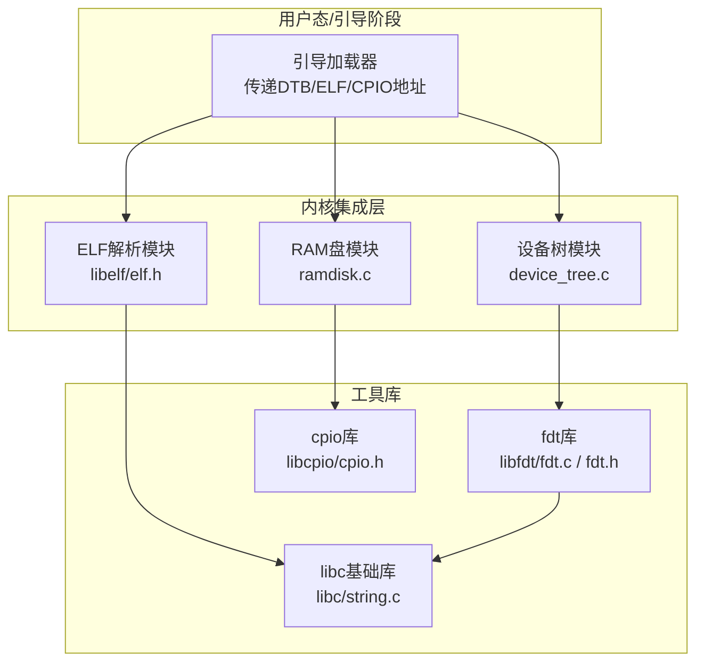
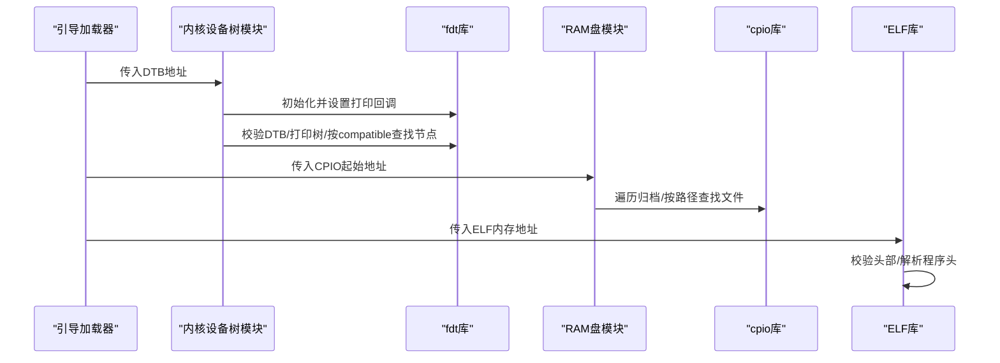
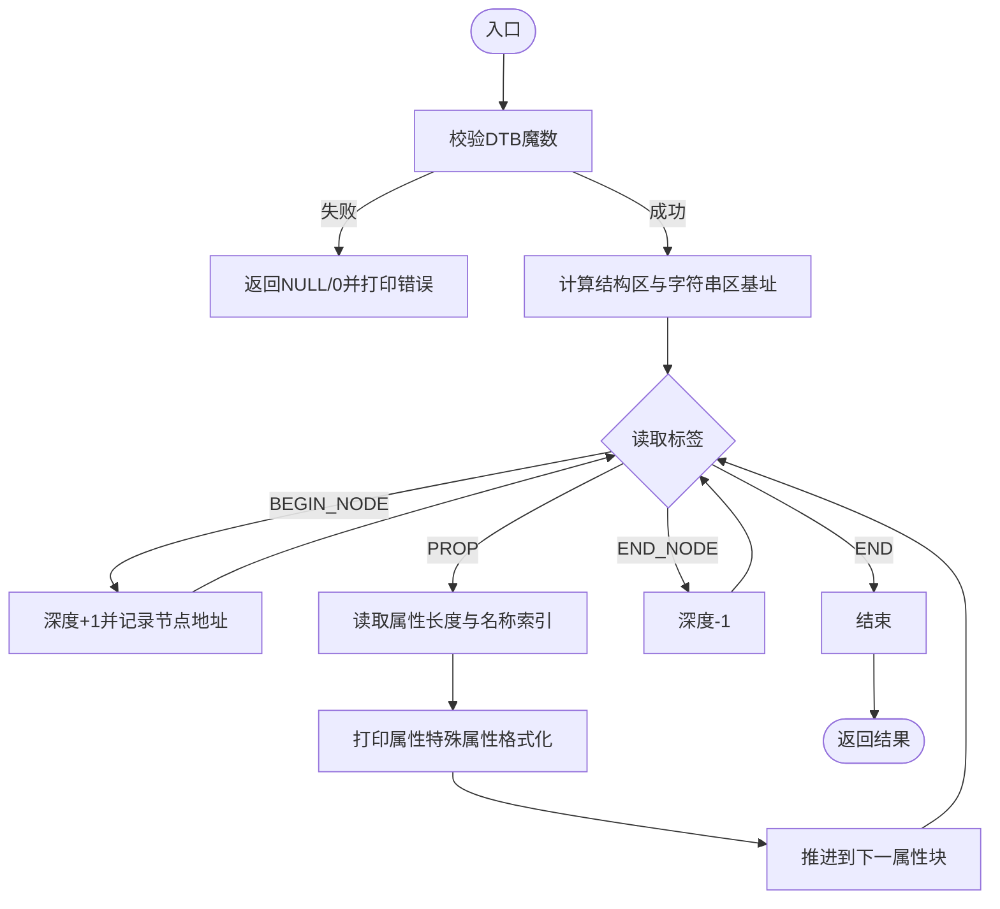
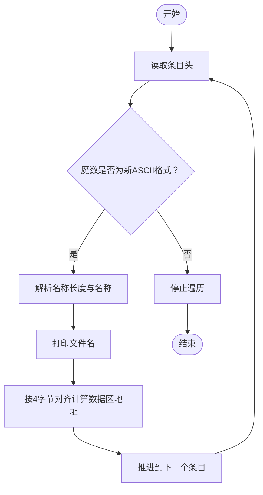
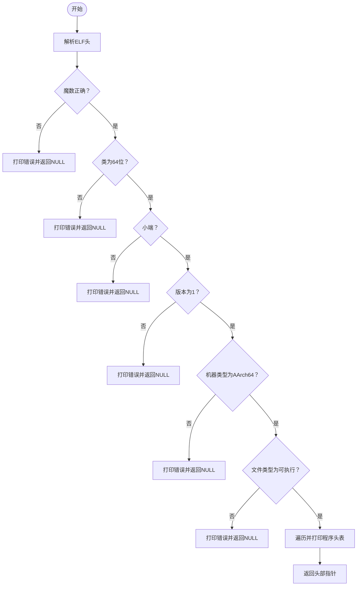
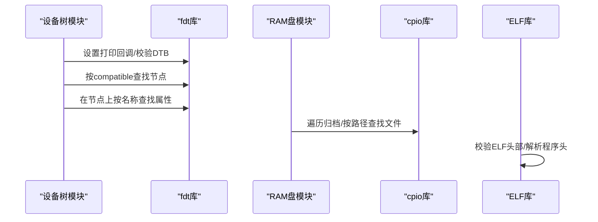
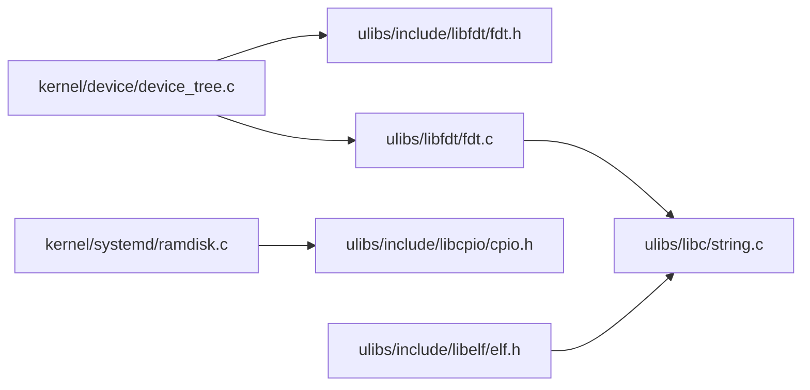

# 工具库

<cite>
**本文引用的文件**
- [ulibs/libfdt/fdt.c](file://ulibs/libfdt/fdt.c)
- [ulibs/include/libfdt/fdt.h](file://ulibs/include/libfdt/fdt.h)
- [kernel/device/device_tree.c](file://kernel/device/device_tree.c)
- [kernel/include/device/device_tree.h](file://kernel/include/device/device_tree.h)
- [ulibs/include/libcpio/cpio.h](file://ulibs/include/libcpio/cpio.h)
- [kernel/systemd/ramdisk.c](file://kernel/systemd/ramdisk.c)
- [ulibs/include/libelf/elf.h](file://ulibs/include/libelf/elf.h)
- [ulibs/libc/string.c](file://ulibs/libc/string.c)
</cite>

## 目录
1. [简介](#简介)
2. [项目结构](#项目结构)
3. [核心组件](#核心组件)
4. [架构总览](#架构总览)
5. [详细组件分析](#详细组件分析)
6. [依赖关系分析](#依赖关系分析)
7. [性能考量](#性能考量)
8. [故障排查指南](#故障排查指南)
9. [结论](#结论)
10. [附录](#附录)

## 简介
本文件面向TranquilOS工具库，聚焦以下三个子库的实现与使用：
- 设备树库（fdt）：负责设备树二进制（DTB）的解析、节点查询与属性读取。
- CPIO归档库（cpio）：负责CPIO新ASCII格式归档的遍历、文件定位与数据提取。
- ELF文件库（elf）：负责ELF可执行文件的头部校验、程序头解析与加载准备。

文档将从架构、数据流、处理逻辑、集成方式、错误处理与兼容性等方面进行系统化说明，并提供实际应用场景与最佳实践建议，帮助开发者在系统开发中高效使用这些工具库。

## 项目结构
TranquilOS工具库位于ulibs目录下，分别提供：
- libfdt：设备树解析与查询接口
- libcpio：CPIO归档处理接口
- libelf：ELF文件解析接口
- libc：基础字符串等通用函数支撑

内核侧通过kernel/device与kernel/systemd模块对上述工具库进行集成与调用，例如：
- 内核设备树模块：初始化DTB地址、打印树结构、按compatible或device_type查找节点、迭代节点等
- RAM盘模块：以cpio格式加载初始根文件系统，支持列出归档条目与按路径提取文件
- ELF模块：解析ELF可执行文件，输出关键头部信息与程序头表项

图表来源
- [kernel/device/device_tree.c](file://kernel/device/device_tree.c#L1-L95)
- [kernel/systemd/ramdisk.c](file://kernel/systemd/ramdisk.c#L1-L28)
- [ulibs/libfdt/fdt.c](file://ulibs/libfdt/fdt.c#L1-L334)
- [ulibs/include/libfdt/fdt.h](file://ulibs/include/libfdt/fdt.h#L1-L56)
- [ulibs/include/libcpio/cpio.h](file://ulibs/include/libcpio/cpio.h#L1-L88)
- [ulibs/include/libelf/elf.h](file://ulibs/include/libelf/elf.h#L1-L149)
- [ulibs/libc/string.c](file://ulibs/libc/string.c#L1-L58)

章节来源
- [kernel/device/device_tree.c](file://kernel/device/device_tree.c#L1-L95)
- [kernel/systemd/ramdisk.c](file://kernel/systemd/ramdisk.c#L1-L28)
- [ulibs/libfdt/fdt.c](file://ulibs/libfdt/fdt.c#L1-L334)
- [ulibs/include/libfdt/fdt.h](file://ulibs/include/libfdt/fdt.h#L1-L56)
- [ulibs/include/libcpio/cpio.h](file://ulibs/include/libcpio/cpio.h#L1-L88)
- [ulibs/include/libelf/elf.h](file://ulibs/include/libelf/elf.h#L1-L149)
- [ulibs/libc/string.c](file://ulibs/libc/string.c#L1-L58)

## 核心组件
- 设备树库（fdt）
  - 提供DTB校验、树形打印、按device_type与compatible查找节点、按名称查找属性、节点迭代等能力
  - 支持设置打印回调，便于在不同日志系统间切换
- CPIO归档库（cpio）
  - 提供CPIO新ASCII格式的条目大小计算、归档遍历打印、按路径查找文件、获取文件大小与数据起始地址
- ELF文件库（elf）
  - 提供ELF头部校验（魔数、类、字节序、版本、机器类型、文件类型），解析程序头表，顺序读取下一个程序头

章节来源
- [ulibs/libfdt/fdt.c](file://ulibs/libfdt/fdt.c#L25-L97)
- [ulibs/include/libfdt/fdt.h](file://ulibs/include/libfdt/fdt.h#L38-L54)
- [ulibs/include/libcpio/cpio.h](file://ulibs/include/libcpio/cpio.h#L27-L86)
- [ulibs/include/libelf/elf.h](file://ulibs/include/libelf/elf.h#L83-L147)

## 架构总览
工具库与内核模块的交互关系如下：

图表来源
- [kernel/device/device_tree.c](file://kernel/device/device_tree.c#L10-L23)
- [ulibs/libfdt/fdt.c](file://ulibs/libfdt/fdt.c#L8-L10)
- [kernel/systemd/ramdisk.c](file://kernel/systemd/ramdisk.c#L9-L13)
- [ulibs/include/libcpio/cpio.h](file://ulibs/include/libcpio/cpio.h#L41-L54)
- [ulibs/include/libelf/elf.h](file://ulibs/include/libelf/elf.h#L83-L123)

## 详细组件分析

### 设备树库（fdt）分析
- 数据结构与常量
  - 头部结构体包含魔数、总长度、结构偏移、字符串区偏移、保留区、版本、boot_cpuid等字段
  - 属性结构体包含属性长度与字符串表索引
  - 常量定义了BEGIN_NODE、END_NODE、PROP、NOP、END等标签值
- 关键流程
  - 校验：检查DTB魔数，失败则返回错误
  - 打印：遍历结构区，按层级缩进打印节点与属性；对常见字符串属性做格式化输出
  - 查询：
    - 按device_type：遍历节点，匹配属性“device_type”
    - 按compatible：遍历节点，匹配属性“compatible”
  - 属性读取：在指定节点范围内查找同名属性，返回属性值地址
  - 迭代：遍历所有节点并回调上层函数；按device_type过滤后回调
  - 节点地址解析：从节点名后的地址描述中解析十六进制地址
- 错误处理
  - 校验失败、未找到节点/属性时输出提示并返回空指针或0
- 性能与复杂度
  - 单次遍历线性时间O(N)，N为结构区字节数
  - 查询与迭代均为单次扫描，适合在启动阶段一次性完成

图表来源
- [ulibs/libfdt/fdt.c](file://ulibs/libfdt/fdt.c#L48-L94)
- [ulibs/include/libfdt/fdt.h](file://ulibs/include/libfdt/fdt.h#L13-L34)

章节来源
- [ulibs/libfdt/fdt.c](file://ulibs/libfdt/fdt.c#L25-L334)
- [ulibs/include/libfdt/fdt.h](file://ulibs/include/libfdt/fdt.h#L1-L56)

### CPIO归档库（cpio）分析
- 数据结构与常量
  - 新ASCII格式魔数常量
  - 结构体包含魔数、inode、mode、uid/gid、nlink、mtime、filesize、设备号、名称长度、校验等字段
- 关键流程
  - 条目大小计算：根据名称长度与数据长度按4字节对齐
  - 归档遍历打印：逐条读取魔数，打印文件名，推进到下一个条目
  - 文件查找：按路径精确匹配，返回对应头指针
  - 数据提取：计算数据区起始地址（按4字节对齐）
- 错误处理
  - 遍历遇到非魔数时停止；未找到目标文件返回空指针
- 性能与复杂度
  - 遍历线性O(N)，N为归档总字节数
  - 查找为顺序扫描，适合小规模初始ramdisk

图表来源
- [ulibs/include/libcpio/cpio.h](file://ulibs/include/libcpio/cpio.h#L41-L54)
- [ulibs/include/libcpio/cpio.h](file://ulibs/include/libcpio/cpio.h#L69-L86)

章节来源
- [ulibs/include/libcpio/cpio.h](file://ulibs/include/libcpio/cpio.h#L1-L88)

### ELF文件库（elf）分析
- 数据结构与常量
  - ELF标识、类、数据编码、版本、机器类型、文件类型等常量
  - 64位ELF头与程序头结构体
- 关键流程
  - 头部校验：魔数、类、字节序、版本、机器类型、文件类型逐一校验
  - 程序头解析：遍历程序头表，打印每个段的类型、虚拟/物理地址、文件/内存大小、对齐等
  - 程序头迭代：维护游标，顺序返回下一个程序头
- 错误处理
  - 任一校验失败返回空指针并打印原因
- 性能与复杂度
  - 头部校验O(1)，程序头表遍历O(P)，P为程序头数量

图表来源
- [ulibs/include/libelf/elf.h](file://ulibs/include/libelf/elf.h#L83-L123)

章节来源
- [ulibs/include/libelf/elf.h](file://ulibs/include/libelf/elf.h#L1-L149)

### 组件集成与使用场景
- 设备树库集成
  - 内核设备树模块在启动阶段接收DTB地址，设置打印回调，随后可进行树打印、节点查找与属性读取
  - 典型场景：驱动初始化时按compatible或device_type定位设备节点，读取寄存器地址、中断号等属性
- CPIO归档集成
  - RAM盘模块在启动阶段接收CPIO地址，打印归档条目，按需查找特定文件并返回数据指针
  - 典型场景：从初始ramdisk中提取配置文件、内核模块或根文件系统片段
- ELF集成
  - 启动加载器将ELF映射到内存后，由ELF库进行头部校验与程序头解析，为后续装载做好准备
  - 典型场景：加载内核镜像或用户态可执行文件，按程序头进行分段装载

图表来源
- [kernel/device/device_tree.c](file://kernel/device/device_tree.c#L10-L23)
- [ulibs/libfdt/fdt.c](file://ullibs/libfdt/fdt.c#L8-L10)
- [kernel/systemd/ramdisk.c](file://kernel/systemd/ramdisk.c#L9-L13)
- [ulibs/include/libelf/elf.h](file://ulibs/include/libelf/elf.h#L83-L123)

章节来源
- [kernel/device/device_tree.c](file://kernel/device/device_tree.c#L1-L95)
- [kernel/systemd/ramdisk.c](file://kernel/systemd/ramdisk.c#L1-L28)

## 依赖关系分析
- 内核设备树模块依赖fdt库提供的DTB解析与查询接口
- RAM盘模块依赖cpio库提供的归档遍历与文件定位接口
- ELF库依赖libc基础函数（如字符串比较等）
- fdt库内部使用libc字符串函数进行属性名比较与格式化输出

图表来源
- [kernel/device/device_tree.c](file://kernel/device/device_tree.c#L1-L95)
- [ulibs/libfdt/fdt.c](file://ulibs/libfdt/fdt.c#L1-L334)
- [ulibs/include/libfdt/fdt.h](file://ulibs/include/libfdt/fdt.h#L1-L56)
- [kernel/systemd/ramdisk.c](file://kernel/systemd/ramdisk.c#L1-L28)
- [ulibs/include/libcpio/cpio.h](file://ulibs/include/libcpio/cpio.h#L1-L88)
- [ulibs/include/libelf/elf.h](file://ulibs/include/libelf/elf.h#L1-L149)
- [ulibs/libc/string.c](file://ulibs/libc/string.c#L1-L58)

章节来源
- [kernel/device/device_tree.c](file://kernel/device/device_tree.c#L1-L95)
- [kernel/systemd/ramdisk.c](file://kernel/systemd/ramdisk.c#L1-L28)
- [ulibs/libfdt/fdt.c](file://ulibs/libfdt/fdt.c#L1-L334)
- [ulibs/include/libfdt/fdt.h](file://ulibs/include/libfdt/fdt.h#L1-L56)
- [ulibs/include/libcpio/cpio.h](file://ulibs/include/libcpio/cpio.h#L1-L88)
- [ulibs/include/libelf/elf.h](file://ulibs/include/libelf/elf.h#L1-L149)
- [ulibs/libc/string.c](file://ulibs/libc/string.c#L1-L58)

## 性能考量
- fdt库：线性扫描结构区，适合在启动阶段一次性完成；对大设备树应避免频繁重复扫描
- cpio库：顺序遍历，查找为线性扫描；ramdisk通常较小，影响有限
- elf库：头部校验O(1)，程序头表遍历O(P)；建议仅在需要时解析，避免对无关段进行装载
- 对齐与边界：三库均涉及4字节对齐计算，注意在跨平台移植时统一字节序与对齐策略

## 故障排查指南
- 设备树库
  - 现象：打印“未找到节点/属性”或返回空指针
  - 排查：确认DTB地址有效、魔数校验通过；检查compatible/device_type拼写；确认节点存在且属性名正确
- CPIO归档库
  - 现象：遍历提前终止或未找到目标文件
  - 排查：确认CPIO地址正确；检查魔数与名称长度字段；确认文件路径与归档中一致
- ELF库
  - 现象：头部校验失败或返回NULL
  - 排查：确认ELF内存映射正确；检查类、字节序、版本、机器类型与文件类型是否满足当前平台要求

章节来源
- [ulibs/libfdt/fdt.c](file://ulibs/libfdt/fdt.c#L146-L150)
- [ulibs/libfdt/fdt.c](file://ulibs/libfdt/fdt.c#L199-L203)
- [ulibs/libfdt/fdt.c](file://ulibs/libfdt/fdt.c#L238-L240)
- [ulibs/include/libcpio/cpio.h](file://ulibs/include/libcpio/cpio.h#L69-L86)
- [ulibs/include/libelf/elf.h](file://ulibs/include/libelf/elf.h#L89-L112)

## 结论
TranquilOS工具库围绕设备树、CPIO与ELF三大基础格式提供了简洁而实用的解析与查询接口。通过内核模块的集成，开发者可在启动阶段快速完成硬件发现、初始ramdisk挂载与可执行文件装载等关键任务。建议在实际工程中结合平台特性与性能需求，合理组织扫描与装载流程，并完善错误处理与日志输出，以提升系统的稳定性与可维护性。

## 附录
- 实际应用示例与最佳实践
  - 设备树：在驱动初始化前先打印树结构，再按compatible定位节点，最后读取属性完成资源分配
  - CPIO：在ramdisk初始化时先打印归档概览，再按需提取关键文件，避免全量解压
  - ELF：在装载前先进行头部校验，再按程序头逐段映射，注意对齐与权限设置
- 兼容性注意事项
  - fdt库：当前实现基于ARM64平台的设备树规范，其他平台需扩展标签与属性处理
  - cpio库：当前实现基于新ASCII格式，CRC格式需额外支持
  - elf库：当前实现限定为AArch64 64位ELF，其他架构需扩展支持