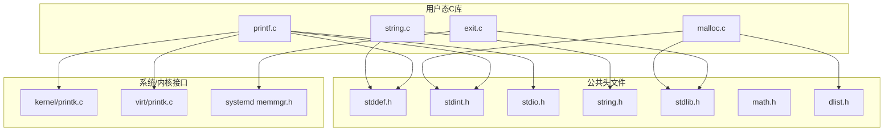
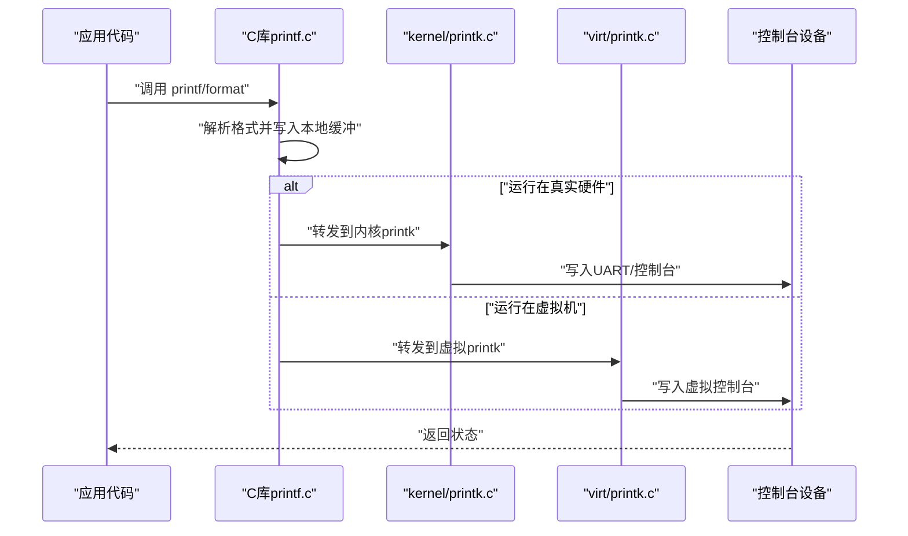
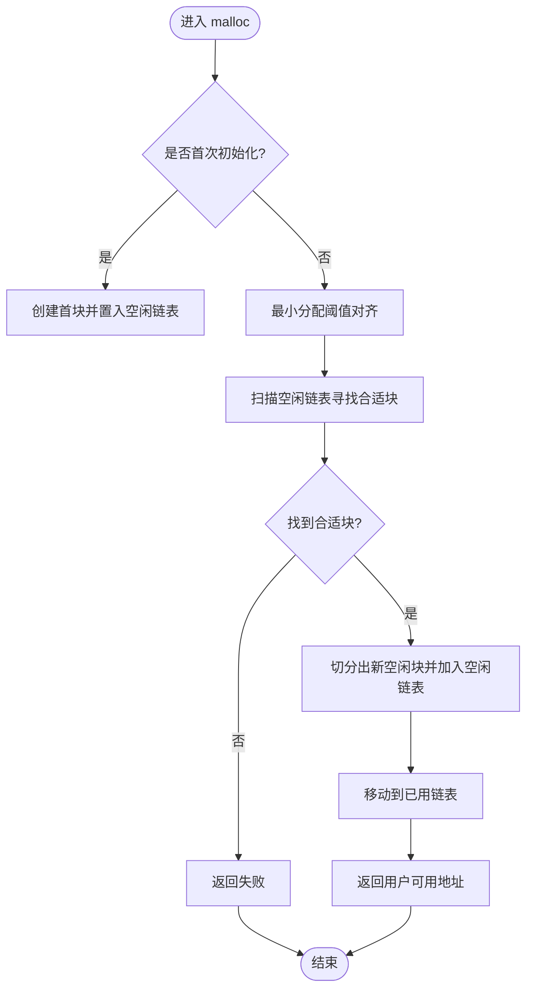
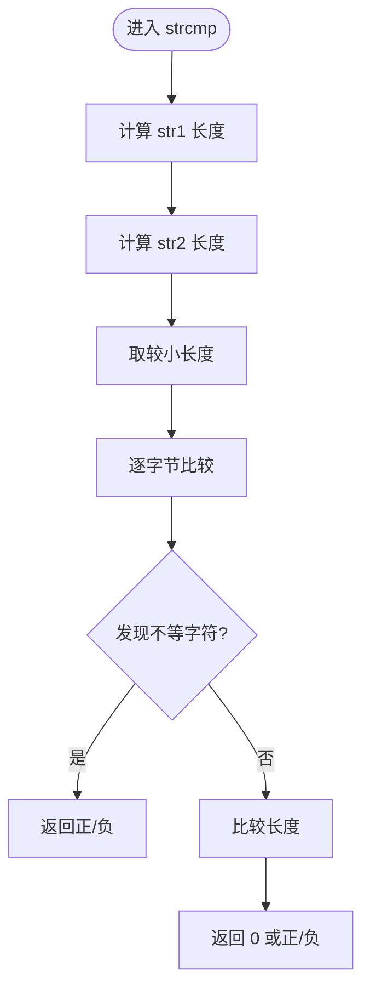
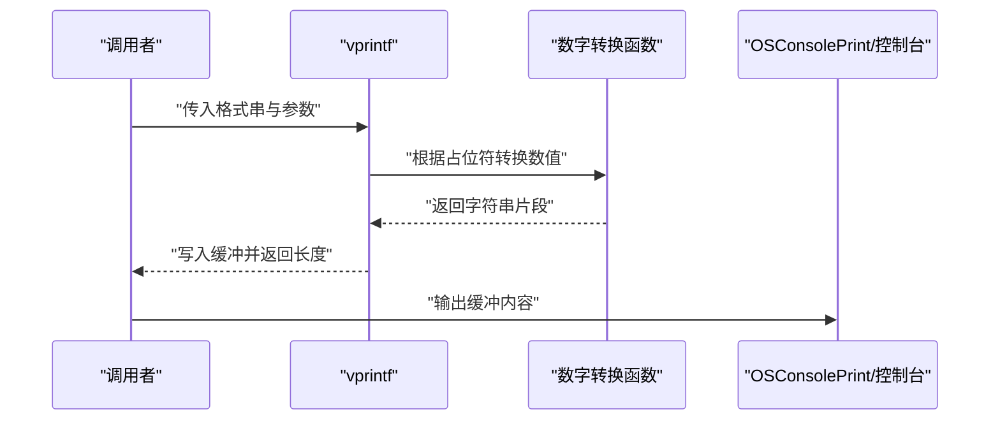
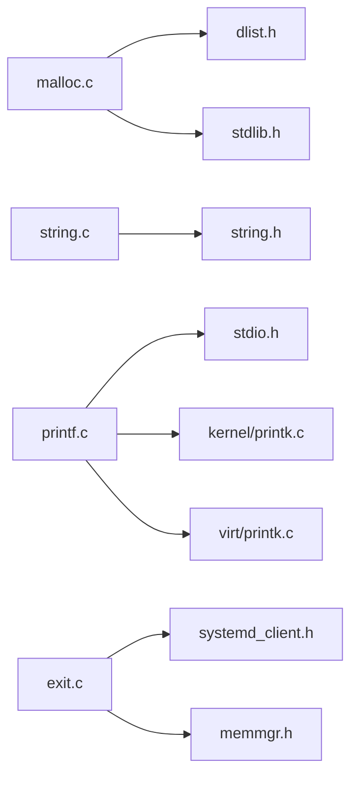

# 标准C库

<cite>
**本文引用的文件**
- [ulibs/libc/malloc.c](file://ulibs/libc/malloc.c)
- [ulibs/libc/string.c](file://ulibs/libc/string.c)
- [ulibs/libc/printf.c](file://ulibs/libc/printf.c)
- [ulibs/libc/exit.c](file://ulibs/libc/exit.c)
- [ulibs/include/libc/stdlib.h](file://ulibs/include/libc/stdlib.h)
- [ulibs/include/libc/string.h](file://ulibs/include/libc/string.h)
- [ulibs/include/libc/stdio.h](file://ulibs/include/libc/stdio.h)
- [ulibs/include/libc/stddef.h](file://ulibs/include/libc/stddef.h)
- [ulibs/include/libc/stdint.h](file://ulibs/include/libc/stdint.h)
- [ulibs/include/libc/math.h](file://ulibs/include/libc/math.h)
- [ulibs/include/libalgorithm/dlist.h](file://ulibs/include/libalgorithm/dlist.h)
- [kernel/printk.c](file://kernel/printk.c)
- [virt/printk.c](file://virt/printk.c)
- [kernel/systemd/include/memmgr/memmgr.h](file://kernel/systemd/include/memmgr/memmgr.h)
</cite>

## 目录
1. [引言](#引言)
2. [项目结构](#项目结构)
3. [核心组件](#核心组件)
4. [架构总览](#架构总览)
5. [详细组件分析](#详细组件分析)
6. [依赖关系分析](#依赖关系分析)
7. [性能考虑](#性能考虑)
8. [故障排查指南](#故障排查指南)
9. [结论](#结论)
10. [附录：使用示例与最佳实践](#附录使用示例与最佳实践)

## 引言
本文件面向TranquilOS用户态标准C库（ulibs/libc）的功能说明与开发指导，覆盖以下主题：
- 内存管理：malloc/free的分配策略、内存块结构与链表组织、初始化与碎片处理思路
- 字符串处理：长度计算、字节拷贝/填充、字典序比较与前缀比较
- 格式化输出：printf系列的格式解析、缓冲区管理、平台输出接口集成
- 数学函数：整数最大公约数等基础算术函数
- 错误处理与边界条件：空指针、魔数校验、容量不足等
- 性能优化建议：对齐、缓存行、批量写入、避免重复分配
- 使用示例与最佳实践：如何正确调用、常见陷阱与规避方法

## 项目结构
ulibs/libc目录提供了用户态C库的核心实现，配合ulibs/include中的头文件对外暴露API；同时通过系统服务与内核接口完成内存与控制台输出能力。

图表来源
- [ulibs/libc/malloc.c](file://ulibs/libc/malloc.c#L1-L92)
- [ulibs/libc/string.c](file://ulibs/libc/string.c#L1-L58)
- [ulibs/libc/printf.c](file://ulibs/libc/printf.c#L1-L212)
- [ulibs/libc/exit.c](file://ulibs/libc/exit.c#L1-L9)
- [ulibs/include/libc/stdlib.h](file://ulibs/include/libc/stdlib.h#L1-L12)
- [ulibs/include/libc/string.h](file://ulibs/include/libc/string.h#L1-L13)
- [ulibs/include/libc/stdio.h](file://ulibs/include/libc/stdio.h#L1-L17)
- [ulibs/include/libc/stddef.h](file://ulibs/include/libc/stddef.h#L1-L50)
- [ulibs/include/libc/stdint.h](file://ulibs/include/libc/stdint.h#L1-L21)
- [ulibs/include/libc/math.h](file://ulibs/include/libc/math.h#L1-L16)
- [ulibs/include/libalgorithm/dlist.h](file://ulibs/include/libalgorithm/dlist.h#L1-L61)
- [kernel/printk.c](file://kernel/printk.c#L1-L15)
- [virt/printk.c](file://virt/printk.c#L1-L15)
- [kernel/systemd/include/memmgr/memmgr.h](file://kernel/systemd/include/memmgr/memmgr.h#L1-L30)

章节来源
- [ulibs/libc/malloc.c](file://ulibs/libc/malloc.c#L1-L92)
- [ulibs/libc/string.c](file://ulibs/libc/string.c#L1-L58)
- [ulibs/libc/printf.c](file://ulibs/libc/printf.c#L1-L212)
- [ulibs/libc/exit.c](file://ulibs/libc/exit.c#L1-L9)
- [ulibs/include/libc/stdlib.h](file://ulibs/include/libc/stdlib.h#L1-L12)
- [ulibs/include/libc/string.h](file://ulibs/include/libc/string.h#L1-L13)
- [ulibs/include/libc/stdio.h](file://ulibs/include/libc/stdio.h#L1-L17)
- [ulibs/include/libc/stddef.h](file://ulibs/include/libc/stddef.h#L1-L50)
- [ulibs/include/libc/stdint.h](file://ulibs/include/libc/stdint.h#L1-L21)
- [ulibs/include/libc/math.h](file://ulibs/include/libc/math.h#L1-L16)
- [ulibs/include/libalgorithm/dlist.h](file://ulibs/include/libalgorithm/dlist.h#L1-L61)
- [kernel/printk.c](file://kernel/printk.c#L1-L15)
- [virt/printk.c](file://virt/printk.c#L1-L15)
- [kernel/systemd/include/memmgr/memmgr.h](file://kernel/systemd/include/memmgr/memmgr.h#L1-L30)

## 核心组件
- 内存管理（malloc/free）
  - 基于固定虚拟地址范围的连续内存池，使用双向链表维护空闲块与已用块
  - 分配时进行魔数校验与最小块大小检查，支持按需切分产生新空闲块
  - 当前未实现释放逻辑（占位），后续需补充合并与归还流程
- 字符串处理（strlen/strcmp/memcpy/memset/strncmp）
  - 提供基础字符串长度、字节拷贝/填充、字典序比较与定长比较
  - 实现简洁直接，适合嵌入式或早期引导阶段使用
- 格式化输出（vprintf/sprintf/printf/puts）
  - 支持占位符“s”“d”“x”“b”，并以固定缓冲区承载中间结果
  - 输出最终通过控制台打印接口转发到UART或虚拟控制台
- 数学函数（gcd）
  - 提供整数最大公约数计算，满足基础算法需求
- 进程退出（exit）
  - 调用systemd客户端接口通知系统进行进程自销毁

章节来源
- [ulibs/libc/malloc.c](file://ulibs/libc/malloc.c#L5-L92)
- [ulibs/libc/string.c](file://ulibs/libc/string.c#L3-L58)
- [ulibs/libc/printf.c](file://ulibs/libc/printf.c#L6-L212)
- [ulibs/include/libc/math.h](file://ulibs/include/libc/math.h#L7-L14)
- [ulibs/libc/exit.c](file://ulibs/libc/exit.c#L4-L9)

## 架构总览
下图展示了printf系列函数在用户态C库与内核/虚拟化层之间的交互路径，以及内存管理与控制台输出的集成方式。

图表来源
- [ulibs/libc/printf.c](file://ulibs/libc/printf.c#L198-L211)
- [kernel/printk.c](file://kernel/printk.c#L6-L14)
- [virt/printk.c](file://virt/printk.c#L6-L14)

## 详细组件分析

### 组件A：内存管理（malloc/do_malloc/链表）
- 设计要点
  - 固定起始地址与大小的虚拟内存池，块头部包含大小与魔数字段
  - 双向链表维护空闲块与已用块，分配时从空闲列表挑选合适块并切分
  - 魔数用于检测块损坏与链表异常；最小分配阈值保证元数据空间
- 数据结构
  - vmem_block_s：块头（魔数、大小、链表节点）
  - list_node_s：双向链表节点
- 关键流程（分配）
  - 初始化：创建首个空闲块并置入空闲链表
  - 查找：遍历空闲链表，筛选满足“剩余空间≥2×块头大小+请求大小”的块
  - 切分：原块更新大小并写入魔数；在末尾生成新空闲块并加入空闲链表
  - 移动：将已用块追加到已用链表头部
- 释放（当前未实现）
  - 合并相邻空闲块、校验魔数、归还至空闲链表、更新统计信息

图表来源
- [ulibs/libc/malloc.c](file://ulibs/libc/malloc.c#L55-L88)
- [ulibs/include/libalgorithm/dlist.h](file://ulibs/include/libalgorithm/dlist.h#L17-L58)

章节来源
- [ulibs/libc/malloc.c](file://ulibs/libc/malloc.c#L5-L92)
- [ulibs/include/libc/stdlib.h](file://ulibs/include/libc/stdlib.h#L6-L8)
- [ulibs/include/libalgorithm/dlist.h](file://ulibs/include/libalgorithm/dlist.h#L8-L61)

### 组件B：字符串处理（strlen/strcmp/memcpy/memset/strncmp）
- 功能概述
  - strlen：线性扫描终止符计算长度
  - strcmp/strncmp：逐字节比较，支持定长比较
  - memcpy/memset：基础字节级复制与填充
- 复杂度
  - strlen/strcmp/strncmp：O(n)
  - memcpy/memset：O(n)，无特殊优化
- 边界与安全
  - 空指针输入需由调用方保证；当前实现未做显式空指针检查
  - 定长比较函数不处理越界，调用方应确保源缓冲有效

图表来源
- [ulibs/libc/string.c](file://ulibs/libc/string.c#L13-L30)

章节来源
- [ulibs/libc/string.c](file://ulibs/libc/string.c#L3-L58)
- [ulibs/include/libc/string.h](file://ulibs/include/libc/string.h#L6-L10)

### 组件C：格式化输出（vprintf/sprintf/printf/puts）
- 占位符支持
  - “s”：字符串输出
  - “d”：十进制整数
  - “x”：十六进制整数
  - “b”：二进制位图（带分隔）
  - “f”：浮点占位（预留）
- 缓冲区管理
  - vprintf内部使用局部缓冲，sprintf将结果写入传入缓冲
  - printf使用固定小缓冲，随后统一输出
- 平台输出
  - printf最终调用OS控制台打印接口；实际行为取决于运行环境（内核或虚拟化）

图表来源
- [ulibs/libc/printf.c](file://ulibs/libc/printf.c#L130-L206)

章节来源
- [ulibs/libc/printf.c](file://ulibs/libc/printf.c#L6-L212)
- [ulibs/include/libc/stdio.h](file://ulibs/include/libc/stdio.h#L7-L13)
- [kernel/printk.c](file://kernel/printk.c#L6-L14)
- [virt/printk.c](file://virt/printk.c#L6-L14)

### 组件D：数学函数（gcd）
- 功能：计算两个非负整数的最大公约数
- 复杂度：O(log min(a,b))，基于欧几里得算法
- 适用场景：分数化简、模逆求解等

章节来源
- [ulibs/include/libc/math.h](file://ulibs/include/libc/math.h#L7-L14)

### 组件E：进程退出（exit）
- 行为：通过systemd客户端接口请求系统进行进程自销毁
- 注意：该实现依赖systemd客户端可用性，调用前应确保上下文有效

章节来源
- [ulibs/libc/exit.c](file://ulibs/libc/exit.c#L4-L9)
- [kernel/systemd/include/memmgr/memmgr.h](file://kernel/systemd/include/memmgr/memmgr.h#L26-L28)

## 依赖关系分析
- 模块耦合
  - malloc依赖dlist实现双向链表操作
  - printf依赖stdio头文件声明与内核/虚拟化printk实现
  - exit依赖systemd客户端接口
- 外部接口
  - 控制台输出：OSConsolePrint（由kernel/virt层实现）
  - 内存管理：systemd memmgr接口（用于宿主环境下的通用内存管理）

图表来源
- [ulibs/libc/malloc.c](file://ulibs/libc/malloc.c#L1-L3)
- [ulibs/libc/string.c](file://ulibs/libc/string.c#L1)
- [ulibs/libc/printf.c](file://ulibs/libc/printf.c#L1-L4)
- [ulibs/libc/exit.c](file://ulibs/libc/exit.c#L1-L3)
- [ulibs/include/libc/stdlib.h](file://ulibs/include/libc/stdlib.h#L1-L12)
- [ulibs/include/libc/string.h](file://ulibs/include/libc/string.h#L1-L13)
- [ulibs/include/libc/stdio.h](file://ulibs/include/libc/stdio.h#L1-L17)
- [kernel/printk.c](file://kernel/printk.c#L1-L15)
- [virt/printk.c](file://virt/printk.c#L1-L15)
- [kernel/systemd/include/memmgr/memmgr.h](file://kernel/systemd/include/memmgr/memmgr.h#L1-L30)

## 性能考虑
- 对齐与缓存行
  - 分配时可引入最小粒度对齐，减少跨缓存行访问带来的性能损耗
  - 批量写入时尽量按缓存行边界对齐，降低写放大
- 减少系统调用
  - printf采用小缓冲聚合输出，避免频繁调用控制台接口
- 避免重复分配
  - 在高频路径中复用缓冲区，减少malloc/free开销
- 字符串处理
  - 对超长字符串优先使用定长比较或分段处理，避免全量扫描
- 数学函数
  - gcd为轻量级函数，可内联；若频繁调用可考虑查表或分支优化

## 故障排查指南
- malloc失败
  - 现象：返回NULL并打印“no enough vmem”
  - 排查：确认请求大小是否超过可用空间；检查魔数校验是否失败
- 魔数校验失败
  - 现象：打印“block magic is not VMEM_MAGIC”
  - 排查：检查链表节点是否被越界写破坏；确认块头未被意外修改
- dlist异常
  - 现象：打印“block is NULL, there is something wrong in dlist”
  - 排查：检查链表插入/删除顺序；避免重复移除或悬挂指针
- printf输出异常
  - 现象：格式化结果缺失或乱码
  - 排查：确认格式串与参数类型匹配；检查缓冲区溢出
- 控制台无输出
  - 现象：printf后无显示
  - 排查：确认运行环境（内核或虚拟化）对应的printk实现可用；检查控制台设备初始化

章节来源
- [ulibs/libc/malloc.c](file://ulibs/libc/malloc.c#L73-L87)
- [ulibs/libc/printf.c](file://ulibs/libc/printf.c#L198-L211)
- [kernel/printk.c](file://kernel/printk.c#L6-L14)
- [virt/printk.c](file://virt/printk.c#L6-L14)

## 结论
TranquilOS标准C库在用户态提供了基础但完整的功能集合：简单高效的内存分配器、可靠的字符串处理工具、可扩展的格式化输出框架与必要的数学辅助函数。当前实现侧重可用性与清晰性，后续可在释放流程、缓冲区保护、浮点支持与性能优化方面进一步增强，以满足更复杂应用场景的需求。

## 附录：使用示例与最佳实践
- 内存管理
  - 示例：申请一块内存并检查返回值，避免直接使用NULL
  - 最佳实践：尽量批量分配、避免碎片；在生命周期结束时补充释放逻辑
- 字符串处理
  - 示例：使用strlen/strncmp进行安全的字符串长度与前缀比较
  - 最佳实践：始终确保源缓冲有效且以空字符结尾；对未知长度输入先验证再处理
- 格式化输出
  - 示例：printf用于调试输出；sprintf用于构建日志消息
  - 最佳实践：严格匹配格式串与参数类型；避免过大的临时缓冲；在关键路径上复用缓冲
- 数学函数
  - 示例：使用gcd进行分数化简
  - 最佳实践：输入非负整数；注意溢出风险（当前实现为64位）
- 进程退出
  - 示例：在异常路径调用exit(status)
  - 最佳实践：确保systemd客户端可用；清理必要资源后再退出