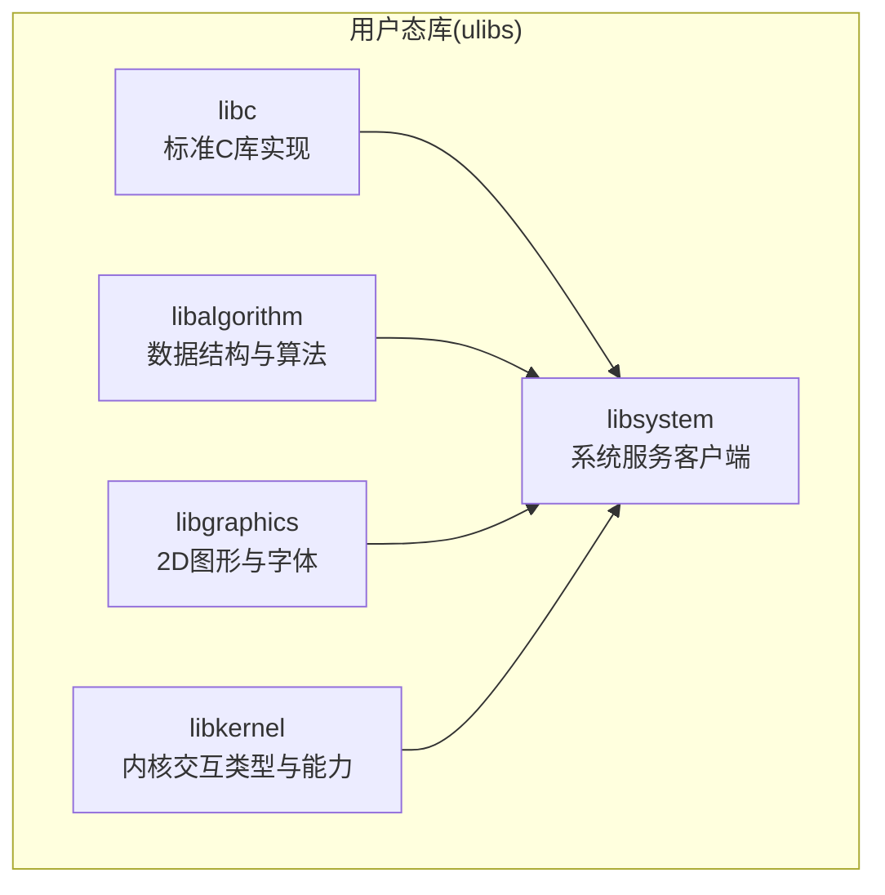
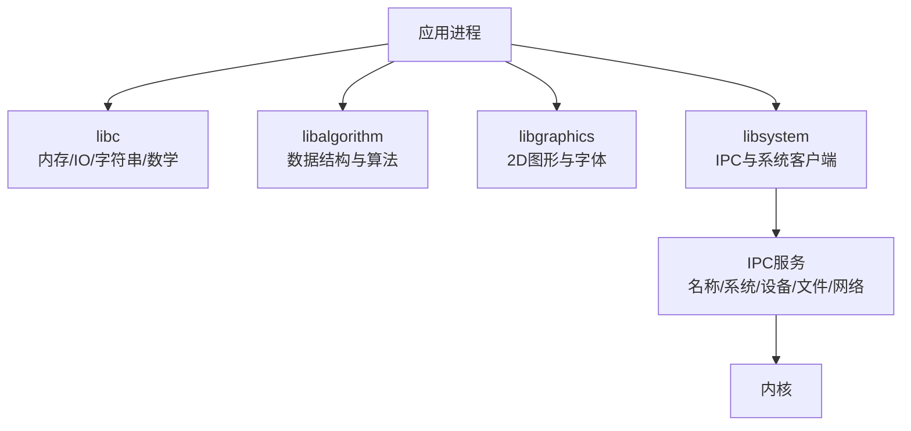
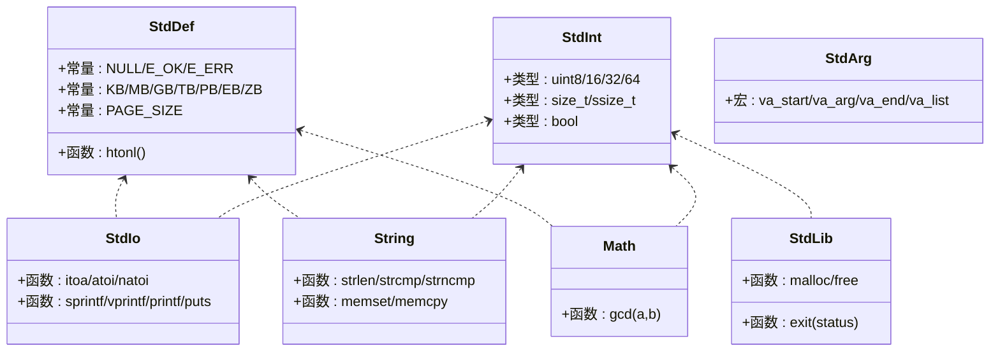
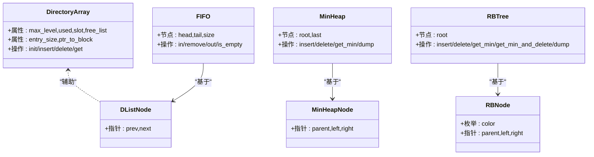
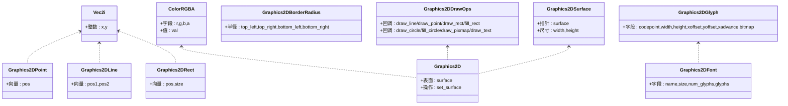
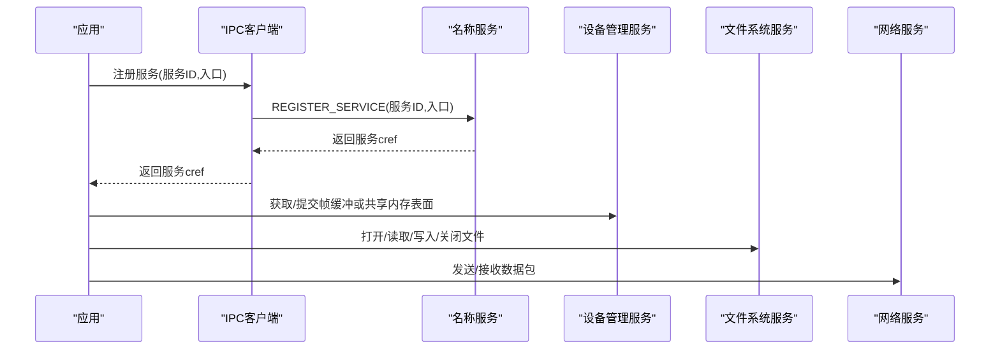
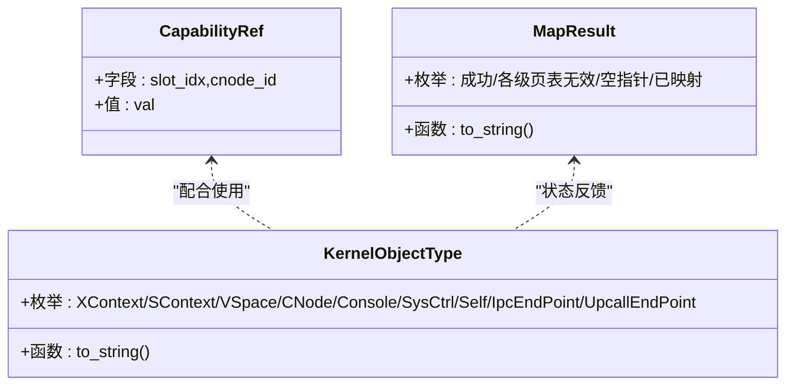
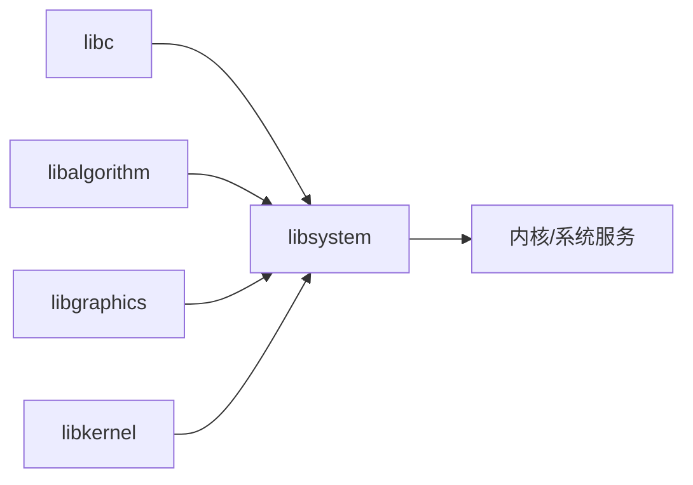

# 用户态库

<cite>
**本文引用的文件**
- [ulibs/include/libc/stdarg.h](file://ulibs/include/libc/stdarg.h)
- [ulibs/include/libc/stddef.h](file://ulibs/include/libc/stddef.h)
- [ulibs/include/libc/stdint.h](file://ulibs/include/libc/stdint.h)
- [ulibs/include/libc/stdio.h](file://ulibs/include/libc/stdio.h)
- [ulibs/include/libc/stdlib.h](file://ulibs/include/libc/stdlib.h)
- [ulibs/include/libc/string.h](file://ulibs/include/libc/string.h)
- [ulibs/include/libc/math.h](file://ulibs/include/libc/math.h)
- [ulibs/libc/malloc.c](file://ulibs/libc/malloc.c)
- [ulibs/libc/printf.c](file://ulibs/libc/printf.c)
- [ulibs/libc/string.c](file://ulibs/libc/string.c)
- [ulibs/libc/exit.c](file://ulibs/libc/exit.c)
- [ulibs/include/libalgorithm/darray.h](file://ulibs/include/libalgorithm/darray.h)
- [ulibs/include/libalgorithm/dlist.h](file://ulibs/include/libalgorithm/dlist.h)
- [ulibs/include/libalgorithm/fifo.h](file://ulibs/include/libalgorithm/fifo.h)
- [ulibs/include/libalgorithm/minheap.h](file://ulibs/include/libalgorithm/minheap.h)
- [ulibs/include/libalgorithm/rbtree.h](file://ulibs/include/libalgorithm/rbtree.h)
- [ulibs/include/libgraphics/graphics_2d.h](file://ulibs/include/libgraphics/graphics_2d.h)
- [ulibs/include/libgraphics/font_8x8.h](file://ulibs/include/libgraphics/font_8x8.h)
- [ulibs/include/libsystem/ipc.h](file://ulibs/include/libsystem/ipc.h)
- [ulibs/include/libsystem/devmgr_client.h](file://ulibs/include/libsystem/devmgr_client.h)
- [ulibs/include/libsystem/fs_client.h](file://ulibs/include/libsystem/fs_client.h)
- [ulibs/include/libsystem/systemd_client.h](file://ulibs/include/libsystem/systemd_client.h)
- [ulibs/include/libsystem/net_client.h](file://ulibs/include/libsystem/net_client.h)
- [ulibs/include/libkernel/types.h](file://ulibs/include/libkernel/types.h)
- [ulibs/include/libkernel/capability.h](file://ulibs/include/libkernel/capability.h)
</cite>

## 目录
1. [简介](#简介)
2. [项目结构](#项目结构)
3. [核心组件](#核心组件)
4. [架构总览](#架构总览)
5. [详细组件分析](#详细组件分析)
6. [依赖关系分析](#依赖关系分析)
7. [性能考虑](#性能考虑)
8. [故障排查指南](#故障排查指南)
9. [结论](#结论)
10. [附录：API 参考与使用示例](#附录api-参考与使用示例)

## 简介
本文件面向应用开发者与系统集成工程师，系统性梳理 TranquilOS 用户态库的实现与用法，覆盖以下方面：
- 标准 C 库（libc）：内存管理、字符串处理、格式化输出与基础数学函数
- 算法库（libalgorithm）：动态数组、双向链表、队列、最小堆、红黑树等数据结构与操作
- 图形库（libgraphics）：二维图形绘制与字体渲染接口
- 系统接口库（libsystem）：IPC 客户端、设备管理客户端、文件系统客户端、网络客户端
- 内核能力与类型（libkernel）：内核对象类型、能力引用与映射结果枚举
- 使用示例、集成方法、常见问题与性能优化建议

## 项目结构
用户态库位于 ulibs 目录下，按功能划分为 libc、libalgorithm、libgraphics、libsystem、libkernel 等子目录，并在 include 下提供公共头文件。

图示来源
- [ulibs/include/libc/stdio.h](file://ulibs/include/libc/stdio.h#L1-L17)
- [ulibs/include/libsystem/ipc.h](file://ulibs/include/libsystem/ipc.h#L1-L73)

章节来源
- [ulibs/include/libc/stddef.h](file://ulibs/include/libc/stddef.h#L1-L50)
- [ulibs/include/libc/stdint.h](file://ulibs/include/libc/stdint.h#L1-L21)
- [ulibs/include/libc/stdio.h](file://ulibs/include/libc/stdio.h#L1-L17)
- [ulibs/include/libc/stdlib.h](file://ulibs/include/libc/stdlib.h#L1-L12)
- [ulibs/include/libc/string.h](file://ulibs/include/libc/string.h#L1-L13)
- [ulibs/include/libc/math.h](file://ulibs/include/libc/math.h#L1-L16)

## 核心组件
- 标准 C 库（libc）
  - 类型与常量：stddef.h、stdint.h
  - 可变参数：stdarg.h
  - 输入输出：stdio.h（含格式化输出、字符串转换）
  - 内存管理：stdlib.h（malloc/free）、exit.c
  - 字符串处理：string.h、string.c
  - 基础数学：math.h（如 gcd）

- 算法库（libalgorithm）
  - 动态数组：darray.h
  - 双向链表：dlist.h
  - 队列：fifo.h
  - 最小堆：minheap.h
  - 红黑树：rbtree.h

- 图形库（libgraphics）
  - 2D 图形与字体：graphics_2d.h、font_8x8.h

- 系统接口库（libsystem）
  - IPC 服务注册与查询：ipc.h
  - 设备管理客户端：devmgr_client.h
  - 文件系统客户端：fs_client.h
  - systemd 客户端：systemd_client.h
  - 网络客户端：net_client.h

- 内核交互（libkernel）
  - 能力与对象类型：capability.h
  - 映射结果枚举：types.h

章节来源
- [ulibs/libc/malloc.c](file://ulibs/libc/malloc.c)
- [ulibs/libc/printf.c](file://ulibs/libc/printf.c)
- [ulibs/libc/string.c](file://ulibs/libc/string.c)
- [ulibs/libc/exit.c](file://ulibs/libc/exit.c)
- [ulibs/include/libalgorithm/darray.h](file://ulibs/include/libalgorithm/darray.h#L1-L64)
- [ulibs/include/libalgorithm/dlist.h](file://ulibs/include/libalgorithm/dlist.h#L1-L61)
- [ulibs/include/libalgorithm/fifo.h](file://ulibs/include/libalgorithm/fifo.h#L1-L27)
- [ulibs/include/libalgorithm/minheap.h](file://ulibs/include/libalgorithm/minheap.h#L1-L37)
- [ulibs/include/libalgorithm/rbtree.h](file://ulibs/include/libalgorithm/rbtree.h#L1-L45)
- [ulibs/include/libgraphics/graphics_2d.h](file://ulibs/include/libgraphics/graphics_2d.h#L1-L138)
- [ulibs/include/libgraphics/font_8x8.h](file://ulibs/include/libgraphics/font_8x8.h#L1-L9)
- [ulibs/include/libsystem/ipc.h](file://ulibs/include/libsystem/ipc.h#L1-L73)
- [ulibs/include/libsystem/devmgr_client.h](file://ulibs/include/libsystem/devmgr_client.h#L1-L43)
- [ulibs/include/libsystem/fs_client.h](file://ulibs/include/libsystem/fs_client.h#L1-L47)
- [ulibs/include/libsystem/systemd_client.h](file://ulibs/include/libsystem/systemd_client.h#L1-L84)
- [ulibs/include/libsystem/net_client.h](file://ulibs/include/libsystem/net_client.h#L1-L31)
- [ulibs/include/libkernel/types.h](file://ulibs/include/libkernel/types.h#L1-L76)
- [ulibs/include/libkernel/capability.h](file://ulibs/include/libkernel/capability.h#L1-L141)

## 架构总览
用户态库通过 libsystem 的 IPC 客户端与内核/系统服务交互；图形与算法模块为上层应用提供通用能力；libc 提供基础运行时支持。

图示来源
- [ulibs/include/libsystem/ipc.h](file://ulibs/include/libsystem/ipc.h#L1-L73)
- [ulibs/include/libsystem/systemd_client.h](file://ulibs/include/libsystem/systemd_client.h#L1-L84)
- [ulibs/include/libsystem/devmgr_client.h](file://ulibs/include/libsystem/devmgr_client.h#L1-L43)
- [ulibs/include/libsystem/fs_client.h](file://ulibs/include/libsystem/fs_client.h#L1-L47)
- [ulibs/include/libsystem/net_client.h](file://ulibs/include/libsystem/net_client.h#L1-L31)

## 详细组件分析

### 标准 C 库（libc）
- 类型与常量
  - 提供整数类型、大小单位、页大小、时间换算宏、NULL、错误码等
- 可变参数
  - 封装 __builtin_va_*，便于格式化输出
- 输入输出
  - 支持整数/字符串转换、格式化输出、打印等
- 内存管理
  - 提供 malloc/free 接口，exit 实现用于进程退出
- 字符串处理
  - 提供长度、比较、拷贝、填充等常用函数
- 数学函数
  - 提供最大公约数等基础数学运算

图示来源
- [ulibs/include/libc/stddef.h](file://ulibs/include/libc/stddef.h#L1-L50)
- [ulibs/include/libc/stdint.h](file://ulibs/include/libc/stdint.h#L1-L21)
- [ulibs/include/libc/stdarg.h](file://ulibs/include/libc/stdarg.h#L1-L9)
- [ulibs/include/libc/stdio.h](file://ulibs/include/libc/stdio.h#L1-L17)
- [ulibs/include/libc/stdlib.h](file://ulibs/include/libc/stdlib.h#L1-L12)
- [ulibs/include/libc/string.h](file://ulibs/include/libc/string.h#L1-L13)
- [ulibs/include/libc/math.h](file://ulibs/include/libc/math.h#L1-L16)

章节来源
- [ulibs/include/libc/stddef.h](file://ulibs/include/libc/stddef.h#L1-L50)
- [ulibs/include/libc/stdint.h](file://ulibs/include/libc/stdint.h#L1-L21)
- [ulibs/include/libc/stdarg.h](file://ulibs/include/libc/stdarg.h#L1-L9)
- [ulibs/include/libc/stdio.h](file://ulibs/include/libc/stdio.h#L1-L17)
- [ulibs/include/libc/stdlib.h](file://ulibs/include/libc/stdlib.h#L1-L12)
- [ulibs/include/libc/string.h](file://ulibs/include/libc/string.h#L1-L13)
- [ulibs/include/libc/math.h](file://ulibs/include/libc/math.h#L1-L16)
- [ulibs/libc/malloc.c](file://ulibs/libc/malloc.c)
- [ulibs/libc/printf.c](file://ulibs/libc/printf.c)
- [ulibs/libc/string.c](file://ulibs/libc/string.c)
- [ulibs/libc/exit.c](file://ulibs/libc/exit.c)

### 算法库（libalgorithm）
- 动态数组（Directory Array）
  - 多级索引组织，支持插入、删除、获取、扩展等操作
  - 提供错误码与位掩码配置
- 双向链表（DList）
  - 节点与容器宏，支持初始化、尾插、插入、移除
- 队列（FIFO）
  - 基于双向链表实现的队列接口
- 最小堆（MinHeap）
  - 二叉堆节点与操作接口，支持插入、删除、取最小
- 红黑树（RBTree）
  - 节点颜色与操作接口，支持插入、删除、取最小

图示来源
- [ulibs/include/libalgorithm/darray.h](file://ulibs/include/libalgorithm/darray.h#L1-L64)
- [ulibs/include/libalgorithm/dlist.h](file://ulibs/include/libalgorithm/dlist.h#L1-L61)
- [ulibs/include/libalgorithm/fifo.h](file://ulibs/include/libalgorithm/fifo.h#L1-L27)
- [ulibs/include/libalgorithm/minheap.h](file://ulibs/include/libalgorithm/minheap.h#L1-L37)
- [ulibs/include/libalgorithm/rbtree.h](file://ulibs/include/libalgorithm/rbtree.h#L1-L45)

章节来源
- [ulibs/include/libalgorithm/darray.h](file://ulibs/include/libalgorithm/darray.h#L1-L64)
- [ulibs/include/libalgorithm/dlist.h](file://ulibs/include/libalgorithm/dlist.h#L1-L61)
- [ulibs/include/libalgorithm/fifo.h](file://ulibs/include/libalgorithm/fifo.h#L1-L27)
- [ulibs/include/libalgorithm/minheap.h](file://ulibs/include/libalgorithm/minheap.h#L1-L37)
- [ulibs/include/libalgorithm/rbtree.h](file://ulibs/include/libalgorithm/rbtree.h#L1-L45)

### 图形库（libgraphics）
- 2D 几何与颜色
  - 向量、点、线、矩形、圆、边框半径等几何体
  - RGBA 颜色联合体与构造函数
- 字形与字体
  - 字形描述与字体元信息
- 绘图操作
  - 线条、点、矩形、圆、位图、文本绘制回调
- 表面与上下文
  - 绘图表面抽象与设置函数

图示来源
- [ulibs/include/libgraphics/graphics_2d.h](file://ulibs/include/libgraphics/graphics_2d.h#L1-L138)
- [ulibs/include/libgraphics/font_8x8.h](file://ulibs/include/libgraphics/font_8x8.h#L1-L9)

章节来源
- [ulibs/include/libgraphics/graphics_2d.h](file://ulibs/include/libgraphics/graphics_2d.h#L1-L138)
- [ulibs/include/libgraphics/font_8x8.h](file://ulibs/include/libgraphics/font_8x8.h#L1-L9)

### 系统接口库（libsystem）
- IPC 服务
  - 服务 ID、名称服务函数、服务注册与查询
- 设备管理客户端
  - 获取帧缓冲、提交帧缓冲、通过共享内存提交表面、获取 CPIO 地址
- 文件系统客户端
  - 打开、读取、写入、关闭文件句柄
- systemd 客户端
  - 分配/获取/释放共享内存、查询内存与进程/线程统计、注册上行调用、页故障处理、进程退出
- 网络客户端
  - 发送/接收数据包、获取 MAC 地址

图示来源
- [ulibs/include/libsystem/ipc.h](file://ulibs/include/libsystem/ipc.h#L1-L73)
- [ulibs/include/libsystem/devmgr_client.h](file://ulibs/include/libsystem/devmgr_client.h#L1-L43)
- [ulibs/include/libsystem/fs_client.h](file://ulibs/include/libsystem/fs_client.h#L1-L47)
- [ulibs/include/libsystem/systemd_client.h](file://ulibs/include/libsystem/systemd_client.h#L1-L84)
- [ulibs/include/libsystem/net_client.h](file://ulibs/include/libsystem/net_client.h#L1-L31)

章节来源
- [ulibs/include/libsystem/ipc.h](file://ulibs/include/libsystem/ipc.h#L1-L73)
- [ulibs/include/libsystem/devmgr_client.h](file://ulibs/include/libsystem/devmgr_client.h#L1-L43)
- [ulibs/include/libsystem/fs_client.h](file://ulibs/include/libsystem/fs_client.h#L1-L47)
- [ulibs/include/libsystem/systemd_client.h](file://ulibs/include/libsystem/systemd_client.h#L1-L84)
- [ulibs/include/libsystem/net_client.h](file://ulibs/include/libsystem/net_client.h#L1-L31)

### 内核交互（libkernel）
- 能力与对象类型
  - 定义内核对象类型、能力引用结构与方法枚举
- 映射结果
  - 映射成功与失败的多种状态码及字符串化

图示来源
- [ulibs/include/libkernel/capability.h](file://ulibs/include/libkernel/capability.h#L1-L141)
- [ulibs/include/libkernel/types.h](file://ulibs/include/libkernel/types.h#L1-L76)

章节来源
- [ulibs/include/libkernel/capability.h](file://ulibs/include/libkernel/capability.h#L1-L141)
- [ulibs/include/libkernel/types.h](file://ulibs/include/libkernel/types.h#L1-L76)

## 依赖关系分析
- libc 是其他库的基础，被 libsystem、libgraphics、libalgorithm 广泛依赖
- libsystem 通过 IPC 与内核/系统服务交互，是用户态与内核的桥梁
- libgraphics 与 libsystem 的设备管理服务结合，实现图形输出
- libalgorithm 为上层应用提供高效数据结构支撑

图示来源
- [ulibs/include/libsystem/ipc.h](file://ulibs/include/libsystem/ipc.h#L1-L73)
- [ulibs/include/libgraphics/graphics_2d.h](file://ulibs/include/libgraphics/graphics_2d.h#L1-L138)
- [ulibs/include/libkernel/capability.h](file://ulibs/include/libkernel/capability.h#L1-L141)

章节来源
- [ulibs/include/libsystem/ipc.h](file://ulibs/include/libsystem/ipc.h#L1-L73)
- [ulibs/include/libgraphics/graphics_2d.h](file://ulibs/include/libgraphics/graphics_2d.h#L1-L138)
- [ulibs/include/libkernel/capability.h](file://ulibs/include/libkernel/capability.h#L1-L141)

## 性能考虑
- 内存管理
  - 使用统一的内存分配器，避免碎片；对频繁分配的小对象可考虑池化策略
- 字符串与格式化
  - 尽量复用缓冲区，减少重复分配；printf 系列按需使用，避免过深嵌套
- 数据结构
  - 优先选择合适的数据结构：频繁查找用红黑树，队列用 FIFO，优先级用最小堆
- 图形绘制
  - 批量绘制、合并状态切换；尽量使用共享内存传输图像数据
- IPC
  - 合理缓存服务引用（cref），减少重复查询；长耗时操作避免阻塞主线程

## 故障排查指南
- 服务未找到
  - 检查名称服务是否启动，确认服务 ID 正确；重试机制会持续等待，确认服务最终可达
- IPC 调用失败
  - 校验 cref 是否有效；检查服务函数枚举与参数传递
- 设备管理
  - 提交帧缓冲前确保已获取有效表面；共享内存提交需先完成分配与映射
- 文件系统
  - 打开文件后务必关闭；读写长度与偏移需满足服务约束
- 内存与共享内存
  - 分配/获取/释放需成对使用；注意容量与权限
- 图形绘制
  - 颜色通道顺序与像素格式一致；字体资源正确加载

章节来源
- [ulibs/include/libsystem/ipc.h](file://ulibs/include/libsystem/ipc.h#L60-L70)
- [ulibs/include/libsystem/devmgr_client.h](file://ulibs/include/libsystem/devmgr_client.h#L14-L27)
- [ulibs/include/libsystem/fs_client.h](file://ulibs/include/libsystem/fs_client.h#L14-L27)
- [ulibs/include/libsystem/systemd_client.h](file://ulibs/include/libsystem/systemd_client.h#L25-L52)
- [ulibs/include/libgraphics/graphics_2d.h](file://ulibs/include/libgraphics/graphics_2d.h#L109-L138)

## 结论
TranquilOS 用户态库以简洁清晰的接口设计，覆盖了应用开发所需的基础运行时、数据结构、图形与系统交互能力。通过 IPC 客户端与内核/系统服务解耦，既保证了易用性，又为系统集成提供了可靠支撑。建议在实际工程中遵循本文的使用示例与性能优化建议，结合故障排查清单快速定位问题并提升稳定性。

## 附录：API 参考与使用示例

### libc API 参考
- 类型与常量
  - stddef.h：提供 NULL、E_OK、E_ERR、页大小、字节单位、时间换算宏、htonl 等
  - stdint.h：定义标准整数类型与 bool
- 可变参数
  - stdarg.h：va_start/va_arg/va_end/va_list
- 输入输出
  - stdio.h：itoa/atoi/natoi、sprintf/vprintf/printf/puts
- 内存管理
  - stdlib.h：malloc/free、exit
- 字符串处理
  - string.h：strlen/strcmp/strncmp、memset/memcpy
- 数学函数
  - math.h：gcd

使用示例（路径指引）
- 内存分配与释放：[ulibs/libc/malloc.c](file://ulibs/libc/malloc.c)
- 格式化输出：[ulibs/libc/printf.c](file://ulibs/libc/printf.c)
- 字符串处理：[ulibs/libc/string.c](file://ulibs/libc/string.c)
- 进程退出：[ulibs/libc/exit.c](file://ulibs/libc/exit.c)

章节来源
- [ulibs/include/libc/stddef.h](file://ulibs/include/libc/stddef.h#L1-L50)
- [ulibs/include/libc/stdint.h](file://ulibs/include/libc/stdint.h#L1-L21)
- [ulibs/include/libc/stdarg.h](file://ulibs/include/libc/stdarg.h#L1-L9)
- [ulibs/include/libc/stdio.h](file://ulibs/include/libc/stdio.h#L1-L17)
- [ulibs/include/libc/stdlib.h](file://ulibs/include/libc/stdlib.h#L1-L12)
- [ulibs/include/libc/string.h](file://ulibs/include/libc/string.h#L1-L13)
- [ulibs/include/libc/math.h](file://ulibs/include/libc/math.h#L1-L16)
- [ulibs/libc/malloc.c](file://ulibs/libc/malloc.c)
- [ulibs/libc/printf.c](file://ulibs/libc/printf.c)
- [ulibs/libc/string.c](file://ulibs/libc/string.c)
- [ulibs/libc/exit.c](file://ulibs/libc/exit.c)

### libalgorithm API 参考
- 动态数组
  - darray.h：目录数组初始化、插入、删除、获取、扩展等
- 双向链表
  - dlist.h：节点初始化、尾插、插入、移除
- 队列
  - fifo.h：队列初始化与入队/出队/删除/判空
- 最小堆
  - minheap.h：堆初始化、插入、删除、取最小、dump
- 红黑树
  - rbtree.h：树初始化、插入、删除、取最小、取最小并删除、dump

使用示例（路径指引）
- 动态数组：[ulibs/include/libalgorithm/darray.h](file://ulibs/include/libalgorithm/darray.h#L61-L61)
- 双向链表：[ulibs/include/libalgorithm/dlist.h](file://ulibs/include/libalgorithm/dlist.h#L17-L58)
- 队列：[ulibs/include/libalgorithm/fifo.h](file://ulibs/include/libalgorithm/fifo.h#L25-L25)
- 最小堆：[ulibs/include/libalgorithm/minheap.h](file://ulibs/include/libalgorithm/minheap.h#L34-L34)
- 红黑树：[ulibs/include/libalgorithm/rbtree.h](file://ulibs/include/libalgorithm/rbtree.h#L42-L42)

章节来源
- [ulibs/include/libalgorithm/darray.h](file://ulibs/include/libalgorithm/darray.h#L1-L64)
- [ulibs/include/libalgorithm/dlist.h](file://ulibs/include/libalgorithm/dlist.h#L1-L61)
- [ulibs/include/libalgorithm/fifo.h](file://ulibs/include/libalgorithm/fifo.h#L1-L27)
- [ulibs/include/libalgorithm/minheap.h](file://ulibs/include/libalgorithm/minheap.h#L1-L37)
- [ulibs/include/libalgorithm/rbtree.h](file://ulibs/include/libalgorithm/rbtree.h#L1-L45)

### libgraphics API 参考
- 2D 几何与颜色
  - graphics_2d.h：vec2i、color_rgba、点/线/矩形/圆/半径、字形/字体、绘图操作回调、表面与上下文
- 字体
  - font_8x8.h：8x8 字体实例

使用示例（路径指引）
- 2D 图形上下文初始化：[ulibs/include/libgraphics/graphics_2d.h](file://ulibs/include/libgraphics/graphics_2d.h#L136-L136)
- 字体使用：[ulibs/include/libgraphics/font_8x8.h](file://ulibs/include/libgraphics/font_8x8.h#L6-L6)

章节来源
- [ulibs/include/libgraphics/graphics_2d.h](file://ulibs/include/libgraphics/graphics_2d.h#L1-L138)
- [ulibs/include/libgraphics/font_8x8.h](file://ulibs/include/libgraphics/font_8x8.h#L1-L9)

### libsystem API 参考
- IPC
  - ipc.h：服务 ID、名称服务函数、sys_register_service/sys_get_service
- 设备管理
  - devmgr_client.h：获取帧缓冲、提交帧缓冲、通过共享内存提交表面、获取 CPIO 地址
- 文件系统
  - fs_client.h：open/read/write/close
- systemd
  - systemd_client.h：共享内存管理、内存与统计查询、注册上行调用、页故障、进程退出
- 网络
  - net_client.h：发送/接收数据包、获取 MAC 地址

使用示例（路径指引）
- 服务注册与查询：[ulibs/include/libsystem/ipc.h](file://ulibs/include/libsystem/ipc.h#L53-L70)
- 设备管理客户端：[ulibs/include/libsystem/devmgr_client.h](file://ulibs/include/libsystem/devmgr_client.h#L41-L41)
- 文件系统客户端：[ulibs/include/libsystem/fs_client.h](file://ulibs/include/libsystem/fs_client.h#L45-L45)
- systemd 客户端：[ulibs/include/libsystem/systemd_client.h](file://ulibs/include/libsystem/systemd_client.h#L82-L82)
- 网络客户端：[ulibs/include/libsystem/net_client.h](file://ulibs/include/libsystem/net_client.h#L28-L28)

章节来源
- [ulibs/include/libsystem/ipc.h](file://ulibs/include/libsystem/ipc.h#L1-L73)
- [ulibs/include/libsystem/devmgr_client.h](file://ulibs/include/libsystem/devmgr_client.h#L1-L43)
- [ulibs/include/libsystem/fs_client.h](file://ulibs/include/libsystem/fs_client.h#L1-L47)
- [ulibs/include/libsystem/systemd_client.h](file://ulibs/include/libsystem/systemd_client.h#L1-L84)
- [ulibs/include/libsystem/net_client.h](file://ulibs/include/libsystem/net_client.h#L1-L31)

### libkernel API 参考
- 能力与对象类型
  - capability.h：内核对象类型、能力引用、各对象方法枚举
- 映射结果
  - types.h：映射结果枚举与字符串化

使用示例（路径指引）
- 对象类型与方法：[ulibs/include/libkernel/capability.h](file://ulibs/include/libkernel/capability.h#L6-L141)
- 映射结果：[ulibs/include/libkernel/types.h](file://ulibs/include/libkernel/types.h#L4-L76)

章节来源
- [ulibs/include/libkernel/capability.h](file://ulibs/include/libkernel/capability.h#L1-L141)
- [ulibs/include/libkernel/types.h](file://ulibs/include/libkernel/types.h#L1-L76)