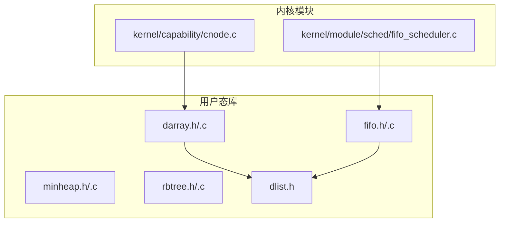
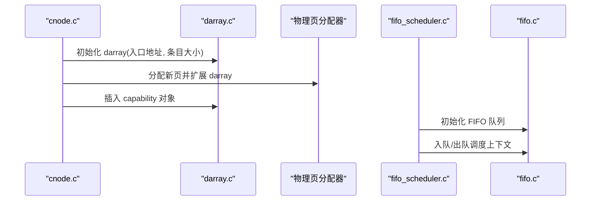
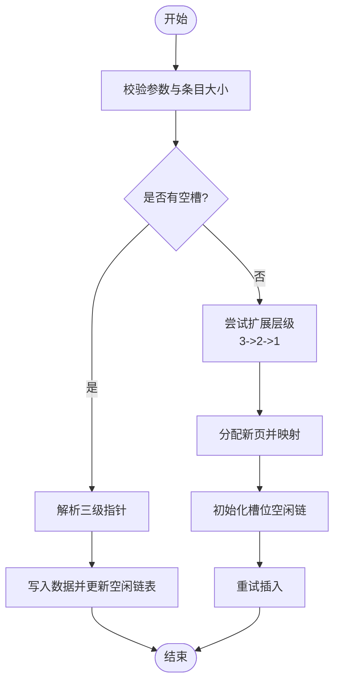
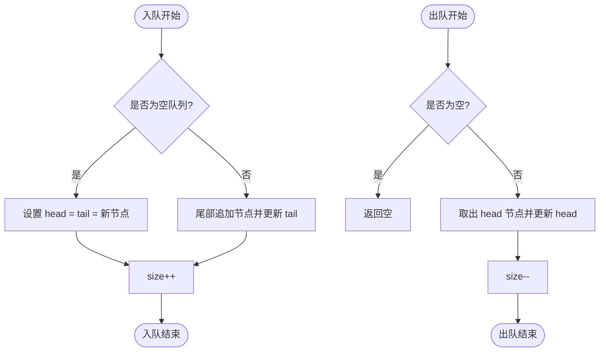
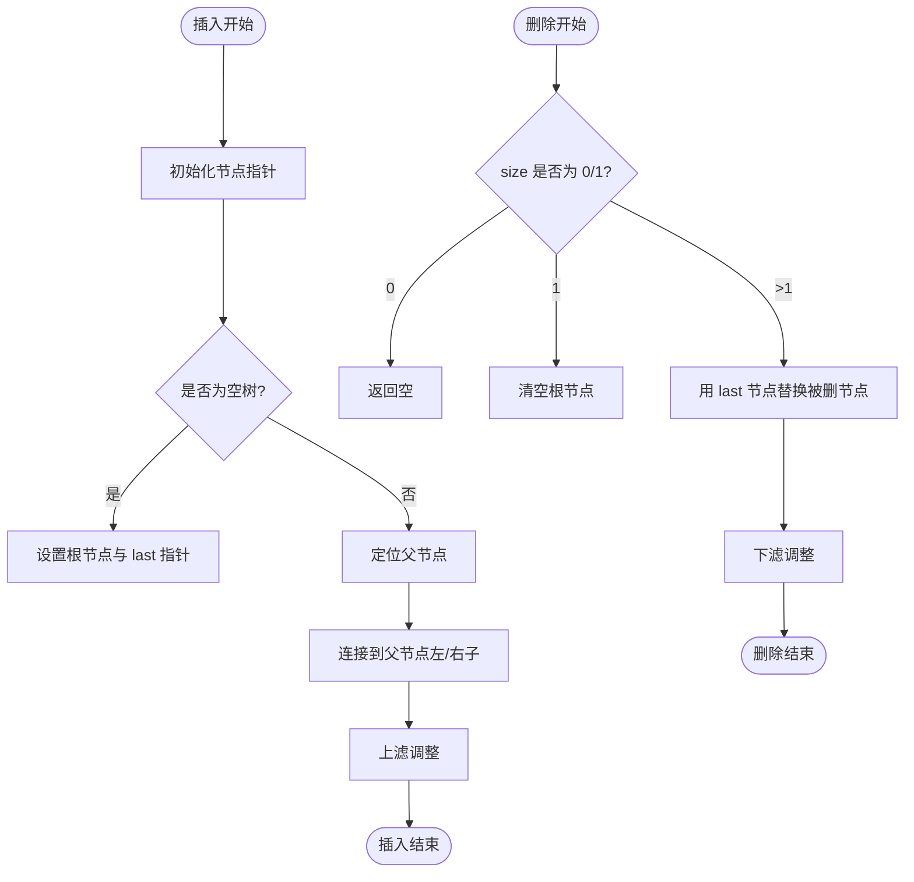
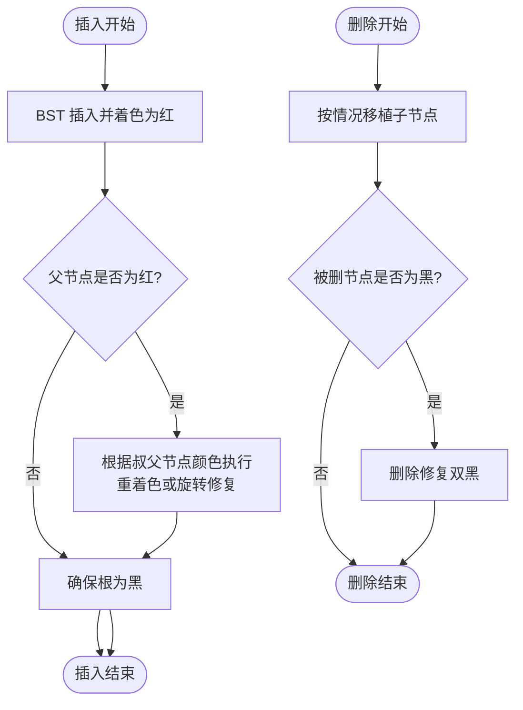
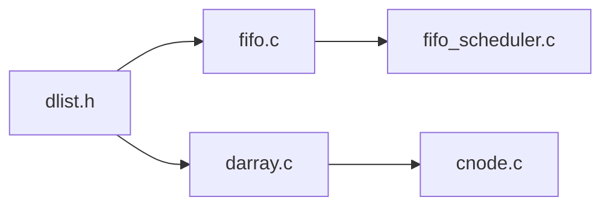

# 算法库

<cite>
**本文引用的文件**
- [darray.h](file://ulibs/include/libalgorithm/darray.h)
- [darray.c](file://ulibs/libalgorithm/darray.c)
- [fifo.h](file://ulibs/include/libalgorithm/fifo.h)
- [fifo.c](file://ulibs/libalgorithm/fifo.c)
- [minheap.h](file://ulibs/include/libalgorithm/minheap.h)
- [minheap.c](file://ulibs/libalgorithm/minheap.c)
- [rbtree.h](file://ulibs/include/libalgorithm/rbtree.h)
- [rbtree.c](file://ulibs/libalgorithm/rbtree.c)
- [dlist.h](file://ulibs/include/libalgorithm/dlist.h)
- [cnode.c](file://kernel/capability/cnode.c)
- [fifo_scheduler.c](file://kernel/module/sched/fifo_scheduler.c)
</cite>

## 目录
1. [简介](#简介)
2. [项目结构](#项目结构)
3. [核心组件](#核心组件)
4. [架构总览](#架构总览)
5. [详细组件分析](#详细组件分析)
6. [依赖关系分析](#依赖关系分析)
7. [性能考量](#性能考量)
8. [故障排查指南](#故障排查指南)
9. [结论](#结论)
10. [附录](#附录)

## 简介
本文件为 TranquilOS 算法库的数据结构与算法实现文档，覆盖以下模块：
- 动态数组（目录式多级分页存储）：darray
- 队列（FIFO）：基于双向链表的 fifo
- 最小堆（Min-Heap）：基于完全二叉树的优先队列
- 红黑树（RB-Tree）：自平衡二叉搜索树

文档内容包括：实现原理、数据结构设计、操作流程、复杂度分析、使用示例与注意事项，并给出常见问题排查建议。

## 项目结构
算法库位于 ulibs/libalgorithm 目录下，头文件位于 ulibs/include/libalgorithm。相关内核模块中存在对这些数据结构的实际使用，如能力节点（Capability Node）使用 darray 存储槽位，调度器框架使用 fifo 实现任务队列。

**图示来源**
- [darray.h](file://ulibs/include/libalgorithm/darray.h#L46-L59)
- [darray.c](file://ulibs/libalgorithm/darray.c#L184-L220)
- [fifo.h](file://ulibs/include/libalgorithm/fifo.h#L18-L23)
- [fifo.c](file://ulibs/libalgorithm/fifo.c#L89-L98)
- [dlist.h](file://ulibs/include/libalgorithm/dlist.h#L8-L11)
- [cnode.c](file://kernel/capability/cnode.c#L9-L21)
- [fifo_scheduler.c](file://kernel/module/sched/fifo_scheduler.c#L85-L109)

**章节来源**
- [darray.h](file://ulibs/include/libalgorithm/darray.h#L1-L64)
- [fifo.h](file://ulibs/include/libalgorithm/fifo.h#L1-L27)
- [minheap.h](file://ulibs/include/libalgorithm/minheap.h#L1-L37)
- [rbtree.h](file://ulibs/include/libalgorithm/rbtree.h#L1-L45)
- [dlist.h](file://ulibs/include/libalgorithm/dlist.h#L1-L61)

## 核心组件
- 目录式动态数组（darray）
  - 多级索引目录组织，支持按需扩展，提供插入、删除、获取、扩展等操作。
- 队列（FIFO）
  - 基于双向链表实现，提供入队、出队、移除指定节点、判空等操作。
- 最小堆（Min-Heap）
  - 完全二叉树结构，支持上滤/下滤与节点交换，提供插入、删除、取最小值等操作。
- 红黑树（RB-Tree）
  - 自平衡二叉搜索树，通过左旋/右旋与着色规则维持平衡，提供插入、删除、查找最小等操作。

**章节来源**
- [darray.c](file://ulibs/libalgorithm/darray.c#L4-L51)
- [fifo.c](file://ulibs/libalgorithm/fifo.c#L3-L87)
- [minheap.c](file://ulibs/libalgorithm/minheap.c#L81-L125)
- [rbtree.c](file://ulibs/libalgorithm/rbtree.c#L268-L297)

## 架构总览
下图展示算法库在内核中的典型使用路径：能力节点初始化时使用 darray；调度框架使用 fifo 对任务进行排队。

**图示来源**
- [cnode.c](file://kernel/capability/cnode.c#L9-L21)
- [cnode.c](file://kernel/capability/cnode.c#L42-L58)
- [fifo_scheduler.c](file://kernel/module/sched/fifo_scheduler.c#L85-L109)
- [fifo.c](file://ulibs/libalgorithm/fifo.c#L89-L98)

## 详细组件分析

### 动态数组（darray）：目录式多级分页存储
- 设计要点
  - 使用四层目录索引（Level 0–3），每层固定位宽与掩码，形成“6-9-9-8”位划分，最后一级条目大小由 entry_size 决定。
  - 维护每个层级的已用计数 used[]、总槽位数 slot[] 与空闲链表 free_list[]。
  - 支持按需扩展：当某一层有空闲块时，从扩展块中生成连续空闲槽位并接入 free_list。
- 关键操作
  - 插入：检查是否有可用空槽，定位三级指针，写入数据并更新 free_list 与 used。
  - 删除：将目标槽位链接到 free_list 并减少 used。
  - 获取：根据索引解析三级指针，返回对应槽位起始地址。
  - 扩展：优先扩展 Level 3（若 Level 2 有空闲），否则扩展 Level 2（若 Level 1 有空闲），再否则扩展 Level 1（若 Level 0 有空闲）。
- 错误处理
  - 参数校验失败返回参数错误码；各级指针为空返回内存错误码；无空槽时返回扩展基错误码。
- 复杂度
  - 插入/删除/获取：O(1)（指针寻址与常数次写入）
  - 扩展：O(2^L) 槽位初始化（L 为当前扩展层级的槽位宽度）
- 适用场景
  - 需要线性可寻址、可按需扩展的固定大小对象池（如能力槽位、定时器容器等）

**图示来源**
- [darray.c](file://ulibs/libalgorithm/darray.c#L4-L51)
- [darray.c](file://ulibs/libalgorithm/darray.c#L57-L138)
- [darray.c](file://ulibs/libalgorithm/darray.c#L140-L156)
- [darray.c](file://ulibs/libalgorithm/darray.c#L158-L182)

**章节来源**
- [darray.h](file://ulibs/include/libalgorithm/darray.h#L12-L27)
- [darray.h](file://ulibs/include/libalgorithm/darray.h#L46-L59)
- [darray.c](file://ulibs/libalgorithm/darray.c#L4-L51)
- [darray.c](file://ulibs/libalgorithm/darray.c#L57-L138)
- [darray.c](file://ulibs/libalgorithm/darray.c#L140-L156)
- [darray.c](file://ulibs/libalgorithm/darray.c#L158-L182)
- [darray.c](file://ulibs/libalgorithm/darray.c#L184-L220)

### 队列（FIFO）：基于双向链表
- 设计要点
  - 使用双向链表节点，维护 head、tail 与 size。
  - 提供入队、出队、移除指定节点、判空等操作。
- 关键操作
  - 入队：在 tail 后追加节点，更新 tail 与 size。
  - 出队：取出 head 节点并更新 head、size。
  - 移除：支持从任意位置摘除节点，维护 prev/next 连接。
- 复杂度
  - 入队/出队/判空：O(1)
  - 移除：O(1)（已知节点）
- 适用场景
  - 调度队列、事件队列、缓冲区管理等需要先进先出的场合。

**图示来源**
- [fifo.c](file://ulibs/libalgorithm/fifo.c#L3-L21)
- [fifo.c](file://ulibs/libalgorithm/fifo.c#L63-L83)

**章节来源**
- [fifo.h](file://ulibs/include/libalgorithm/fifo.h#L18-L23)
- [fifo.c](file://ulibs/libalgorithm/fifo.c#L3-L87)
- [dlist.h](file://ulibs/include/libalgorithm/dlist.h#L8-L11)

### 最小堆（Min-Heap）：完全二叉树优先队列
- 设计要点
  - 使用三叉指针（parent/left/right）的节点结构，维护根节点与最后一个节点指针以支持 O(log N) 上滤/下滤。
  - 通过比较器函数控制节点相对顺序。
- 关键操作
  - 插入：在完全二叉树末尾添加节点，向上与父节点比较并交换，直至满足堆序。
  - 删除：用最后节点替换被删节点，向下与较小子节点比较并交换，直至满足堆序。
  - 取最小：返回根节点。
- 复杂度
  - 插入/删除：O(log N)
  - 取最小：O(1)
- 适用场景
  - 优先队列、任务调度、Dijkstra 等算法的支撑结构。

**图示来源**
- [minheap.c](file://ulibs/libalgorithm/minheap.c#L81-L125)
- [minheap.c](file://ulibs/libalgorithm/minheap.c#L127-L200)

**章节来源**
- [minheap.h](file://ulibs/include/libalgorithm/minheap.h#L7-L32)
- [minheap.c](file://ulibs/libalgorithm/minheap.c#L81-L125)
- [minheap.c](file://ulibs/libalgorithm/minheap.c#L127-L200)
- [minheap.c](file://ulibs/libalgorithm/minheap.c#L202-L207)
- [minheap.c](file://ulibs/libalgorithm/minheap.c#L222-L234)

### 红黑树（RB-Tree）：自平衡二叉搜索树
- 设计要点
  - 节点带颜色属性（红/黑），通过左旋/右旋与重新着色维持平衡。
  - 插入时默认着色为红，必要时进行旋转与着色修复。
  - 删除时可能触发复杂的“双黑”修复过程。
- 关键操作
  - 插入：递归定位插入位置，设置为红色，调用修复函数确保性质成立。
  - 删除：定位节点，按情况替换与删除，必要时进行“删除修复”。
  - 查找最小：沿左分支下沉至最左节点。
- 复杂度
  - 插入/删除/查找：O(log N)
- 适用场景
  - 需要稳定对数时间范围查询与有序遍历的场景（如定时器容器、资源索引等）。

**图示来源**
- [rbtree.c](file://ulibs/libalgorithm/rbtree.c#L268-L297)
- [rbtree.c](file://ulibs/libalgorithm/rbtree.c#L299-L390)
- [rbtree.c](file://ulibs/libalgorithm/rbtree.c#L158-L181)
- [rbtree.c](file://ulibs/libalgorithm/rbtree.c#L203-L266)

**章节来源**
- [rbtree.h](file://ulibs/include/libalgorithm/rbtree.h#L7-L40)
- [rbtree.c](file://ulibs/libalgorithm/rbtree.c#L42-L91)
- [rbtree.c](file://ulibs/libalgorithm/rbtree.c#L116-L181)
- [rbtree.c](file://ulibs/libalgorithm/rbtree.c#L203-L266)
- [rbtree.c](file://ulibs/libalgorithm/rbtree.c#L268-L297)
- [rbtree.c](file://ulibs/libalgorithm/rbtree.c#L299-L390)
- [rbtree.c](file://ulibs/libalgorithm/rbtree.c#L392-L409)
- [rbtree.c](file://ulibs/libalgorithm/rbtree.c#L411-L423)
- [rbtree.c](file://ulibs/libalgorithm/rbtree.c#L425-L437)

## 依赖关系分析
- darray 依赖 dlist 的通用链表节点结构与宏（offset_of/container_of），用于在容器中嵌入链表节点。
- fifo 依赖 dlist 提供的双向链表操作（初始化、插入、移除、追加）。
- 内核实际使用示例：
  - 能力节点（cnode）使用 darray 存放 capability 槽位，按需扩展并插入对象。
  - 调度框架使用 fifo 对调度上下文进行排队与出队。

**图示来源**
- [dlist.h](file://ulibs/include/libalgorithm/dlist.h#L8-L11)
- [fifo.c](file://ulibs/libalgorithm/fifo.c#L1-L2)
- [darray.c](file://ulibs/libalgorithm/darray.c#L1-L2)
- [cnode.c](file://kernel/capability/cnode.c#L9-L21)
- [fifo_scheduler.c](file://kernel/module/sched/fifo_scheduler.c#L85-L109)

**章节来源**
- [dlist.h](file://ulibs/include/libalgorithm/dlist.h#L1-L61)
- [fifo.c](file://ulibs/libalgorithm/fifo.c#L1-L2)
- [darray.c](file://ulibs/libalgorithm/darray.c#L1-L2)
- [cnode.c](file://kernel/capability/cnode.c#L9-L21)
- [fifo_scheduler.c](file://kernel/module/sched/fifo_scheduler.c#L85-L109)

## 性能考量
- darray
  - 空间局部性好，访问延迟低；扩展成本集中在分配与初始化槽位阶段，后续插入/删除为 O(1)。
  - 适合固定大小对象池，避免频繁内存碎片。
- fifo
  - 链表节点开销小，O(1) 时间完成队列操作；注意节点生命周期管理，避免悬挂指针。
- minheap
  - 堆高约为 log2(N)，插入/删除为 O(log N)；比较器实现应尽量高效。
- rbtree
  - 对数时间复杂度，适合频繁插入/删除/查找的有序集合；旋转与着色修复为常数步，整体稳定。

[本节为通用性能讨论，不直接分析具体文件]

## 故障排查指南
- darray
  - 现象：插入返回参数错误或内存错误。
  - 排查：确认 entry_size 与传入数据大小匹配；检查各级指针是否正确映射；确认扩展块已成功映射。
  - 参考路径：[darray.c](file://ulibs/libalgorithm/darray.c#L5-L7)、[darray.c](file://ulibs/libalgorithm/darray.c#L17-L34)
- fifo
  - 现象：出队返回空或移除后队列状态异常。
  - 排查：确认节点 prev/next 已正确断开；出队/移除后置空指针；检查判空逻辑。
  - 参考路径：[fifo.c](file://ulibs/libalgorithm/fifo.c#L63-L83)、[fifo.c](file://ulibs/libalgorithm/fifo.c#L23-L61)
- minheap
  - 现象：堆序破坏或删除后根节点异常。
  - 排查：检查比较器返回值约定；上滤/下滤过程中节点交换与父子指针更新；确保根始终为黑色。
  - 参考路径：[minheap.c](file://ulibs/libalgorithm/minheap.c#L112-L122)、[minheap.c](file://ulibs/libalgorithm/minheap.c#L184-L197)
- rbtree
  - 现象：插入/删除后树失衡或颜色异常。
  - 排查：核对叔父节点颜色与旋转方向；删除修复循环直至满足性质；确保根节点始终为黑。
  - 参考路径：[rbtree.c](file://ulibs/libalgorithm/rbtree.c#L158-L181)、[rbtree.c](file://ulibs/libalgorithm/rbtree.c#L203-L266)

**章节来源**
- [darray.c](file://ulibs/libalgorithm/darray.c#L5-L7)
- [darray.c](file://ulibs/libalgorithm/darray.c#L17-L34)
- [fifo.c](file://ulibs/libalgorithm/fifo.c#L63-L83)
- [fifo.c](file://ulibs/libalgorithm/fifo.c#L23-L61)
- [minheap.c](file://ulibs/libalgorithm/minheap.c#L112-L122)
- [minheap.c](file://ulibs/libalgorithm/minheap.c#L184-L197)
- [rbtree.c](file://ulibs/libalgorithm/rbtree.c#L158-L181)
- [rbtree.c](file://ulibs/libalgorithm/rbtree.c#L203-L266)

## 结论
TranquilOS 算法库提供了高效、稳定的底层数据结构实现：
- darray 通过目录式多级索引实现可扩展的对象池；
- fifo 提供 O(1) 的队列操作；
- minheap 与 rbtree 分别满足优先队列与有序集合的高性能需求。
结合内核中的实际使用案例（能力槽位与调度队列），这些组件构成了系统调度与资源管理的重要基石。

[本节为总结性内容，不直接分析具体文件]

## 附录
- 使用示例（路径参考）
  - darray 在能力节点中的使用：初始化、扩展、插入、获取。
    - [cnode.c](file://kernel/capability/cnode.c#L9-L21)
    - [cnode.c](file://kernel/capability/cnode.c#L42-L58)
    - [cnode.c](file://kernel/capability/cnode.c#L61-L64)
  - fifo 在调度框架中的使用：初始化、入队、出队、判空。
    - [fifo_scheduler.c](file://kernel/module/sched/fifo_scheduler.c#L85-L109)
    - [fifo_scheduler.c](file://kernel/module/sched/fifo_scheduler.c#L18-L36)
    - [fifo_scheduler.c](file://kernel/module/sched/fifo_scheduler.c#L38-L52)
    - [fifo_scheduler.c](file://kernel/module/sched/fifo_scheduler.c#L54-L68)
    - [fifo_scheduler.c](file://kernel/module/sched/fifo_scheduler.c#L70-L83)

**章节来源**
- [cnode.c](file://kernel/capability/cnode.c#L9-L21)
- [cnode.c](file://kernel/capability/cnode.c#L42-L58)
- [cnode.c](file://kernel/capability/cnode.c#L61-L64)
- [fifo_scheduler.c](file://kernel/module/sched/fifo_scheduler.c#L85-L109)
- [fifo_scheduler.c](file://kernel/module/sched/fifo_scheduler.c#L18-L36)
- [fifo_scheduler.c](file://kernel/module/sched/fifo_scheduler.c#L38-L52)
- [fifo_scheduler.c](file://kernel/module/sched/fifo_scheduler.c#L54-L68)
- [fifo_scheduler.c](file://kernel/module/sched/fifo_scheduler.c#L70-L83)