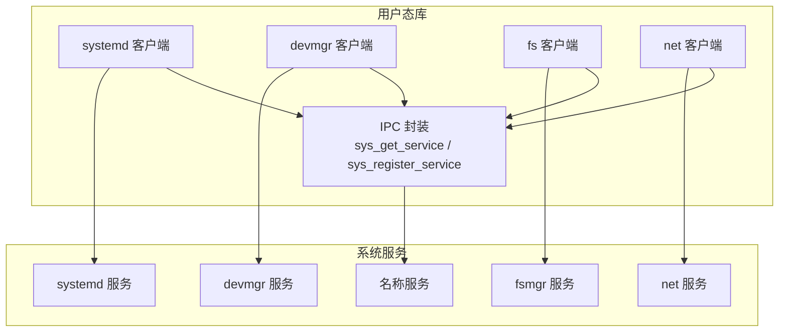
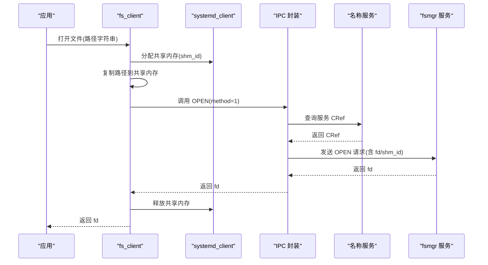
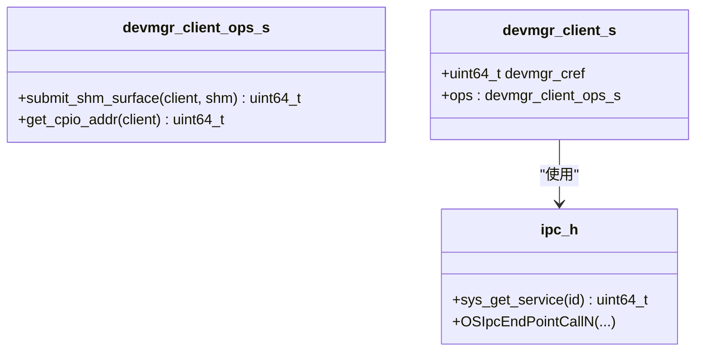
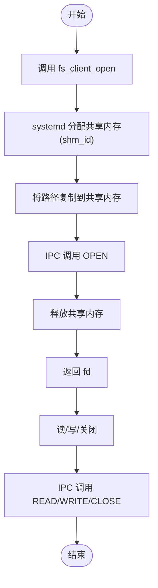
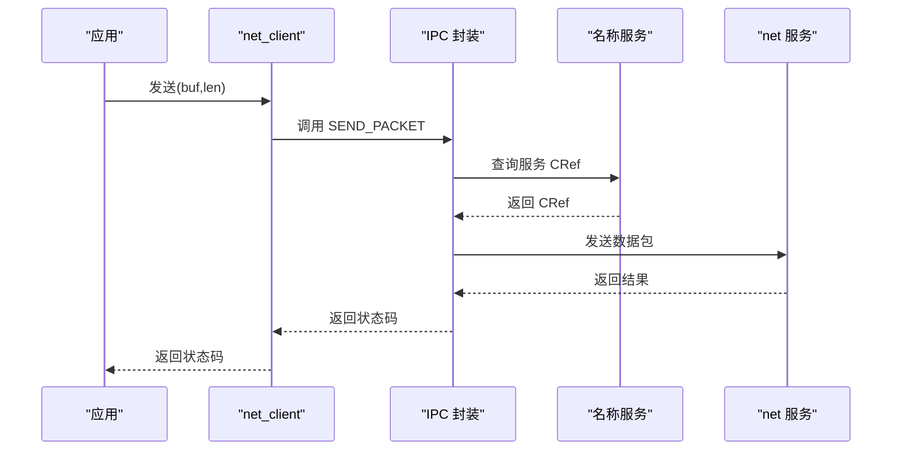
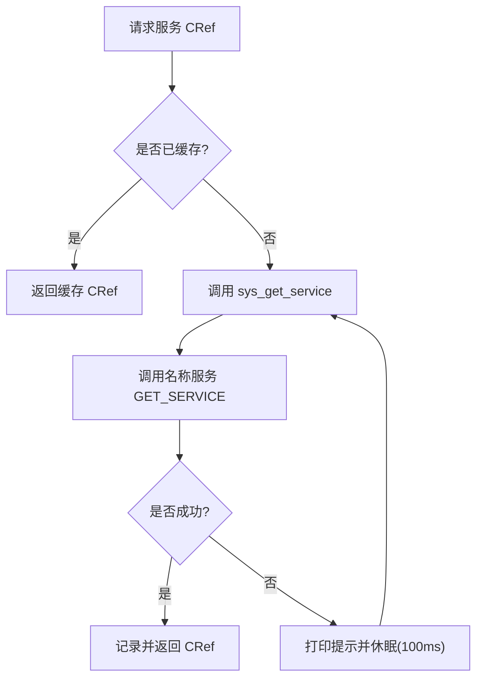
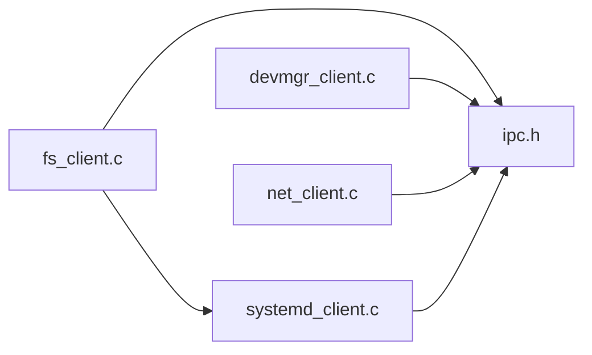

# 系统接口库

<cite>
**本文引用的文件**
- [ulibs/libsystem/devmgr_client.c](file://ulibs/libsystem/devmgr_client.c)
- [ulibs/include/libsystem/devmgr_client.h](file://ulibs/include/libsystem/devmgr_client.h)
- [ulibs/libsystem/fs_client.c](file://ulibs/libsystem/fs_client.c)
- [ulibs/include/libsystem/fs_client.h](file://ulibs/include/libsystem/fs_client.h)
- [ulibs/libsystem/net_client.c](file://ulibs/libsystem/net_client.c)
- [ulibs/include/libsystem/net_client.h](file://ulibs/include/libsystem/net_client.h)
- [ulibs/libsystem/systemd_client.c](file://ulibs/libsystem/systemd_client.c)
- [ulibs/include/libsystem/systemd_client.h](file://ulibs/include/libsystem/systemd_client.h)
- [ulibs/include/libsystem/ipc.h](file://ulibs/include/libsystem/ipc.h)
</cite>

## 目录
1. [简介](#简介)
2. [项目结构](#项目结构)
3. [核心组件](#核心组件)
4. [架构总览](#架构总览)
5. [详细组件分析](#详细组件分析)
6. [依赖关系分析](#依赖关系分析)
7. [性能与可靠性考虑](#性能与可靠性考虑)
8. [故障排查指南](#故障排查指南)
9. [结论](#结论)
10. [附录：API 参考](#附录api-参考)

## 简介
本文件面向应用开发者，系统性说明 TranquilOS 的“系统接口库”（libsystem）在用户态提供的统一客户端能力，涵盖以下方面：
- 设备管理客户端：设备发现、注册与图形表面共享等机制
- 文件系统客户端：文件打开、读写、关闭以及与共享内存的配合
- 网络客户端：数据包收发与 MAC 地址查询
- IPC 客户端：服务发现、调用封装与重试策略
- 集成示例与最佳实践：如何在应用中正确初始化与使用各客户端
- 错误处理与超时机制：服务不可用时的重试与退避策略

## 项目结构
系统接口库位于 ulibs/libsystem 与 ulibs/include/libsystem 下，按功能划分为若干客户端模块，并通过统一的 IPC 封装与服务发现机制连接到内核/系统服务。

图表来源
- [ulibs/include/libsystem/ipc.h](file://ulibs/include/libsystem/ipc.h#L61-L70)
- [ulibs/libsystem/systemd_client.c](file://ulibs/libsystem/systemd_client.c#L45-L65)
- [ulibs/libsystem/devmgr_client.c](file://ulibs/libsystem/devmgr_client.c#L13-L25)
- [ulibs/libsystem/fs_client.c](file://ulibs/libsystem/fs_client.c#L31-L45)
- [ulibs/libsystem/net_client.c](file://ulibs/libsystem/net_client.c#L19-L33)

章节来源
- [ulibs/include/libsystem/ipc.h](file://ulibs/include/libsystem/ipc.h#L1-L73)
- [ulibs/libsystem/systemd_client.c](file://ulibs/libsystem/systemd_client.c#L1-L65)
- [ulibs/libsystem/devmgr_client.c](file://ulibs/libsystem/devmgr_client.c#L1-L25)
- [ulibs/libsystem/fs_client.c](file://ulibs/libsystem/fs_client.c#L1-L45)
- [ulibs/libsystem/net_client.c](file://ulibs/libsystem/net_client.c#L1-L33)

## 核心组件
- IPC 封装与服务发现：提供 sys_get_service 与 sys_register_service，支持服务 ID 到 CRef 的解析与重试
- systemd 客户端：提供共享内存分配/获取/释放、内存统计、进程/线程计数、上行回调注册、缺页处理、自退出等
- devmgr 客户端：提供帧缓冲区获取、提交、通过共享内存提交显示表面、获取 CPIO 地址等
- fs 客户端：提供文件打开、读、写、关闭；通过 systemd 分配的共享内存传递路径
- net 客户端：提供网络数据包发送/接收、MAC 地址查询

章节来源
- [ulibs/include/libsystem/ipc.h](file://ulibs/include/libsystem/ipc.h#L11-L34)
- [ulibs/include/libsystem/systemd_client.h](file://ulibs/include/libsystem/systemd_client.h#L7-L52)
- [ulibs/include/libsystem/devmgr_client.h](file://ulibs/include/libsystem/devmgr_client.h#L7-L27)
- [ulibs/include/libsystem/fs_client.h](file://ulibs/include/libsystem/fs_client.h#L7-L27)
- [ulibs/include/libsystem/net_client.h](file://ulibs/include/libsystem/net_client.h#L7-L11)

## 架构总览
系统接口库采用“客户端 + IPC 调用 + 名称服务”的分层架构。应用通过客户端 API 获取服务 CRef，再以函数号（method）+ 参数的方式发起 IPC 调用。对于需要跨模块协作的功能（如文件路径传递），由 systemd 提供共享内存作为跨进程/跨模块的零拷贝通道。

图表来源
- [ulibs/libsystem/fs_client.c](file://ulibs/libsystem/fs_client.c#L9-L17)
- [ulibs/include/libsystem/ipc.h](file://ulibs/include/libsystem/ipc.h#L61-L70)
- [ulibs/libsystem/systemd_client.c](file://ulibs/libsystem/systemd_client.c#L6-L8)

章节来源
- [ulibs/libsystem/fs_client.c](file://ulibs/libsystem/fs_client.c#L1-L45)
- [ulibs/libsystem/systemd_client.c](file://ulibs/libsystem/systemd_client.c#L1-L65)
- [ulibs/include/libsystem/ipc.h](file://ulibs/include/libsystem/ipc.h#L61-L70)

## 详细组件分析

### 设备管理客户端（devmgr）
职责与能力
- 通过共享内存提交显示表面（用于图形输出）
- 获取 CPIO 地址（用于引导阶段或固件资源访问）

内部机制
- 使用 sys_get_service 获取 devmgr 服务 CRef
- 通过 OSIpcEndPointCallN 系列宏向服务发送请求
- 提供静态单例缓存，避免重复查询

图表来源
- [ulibs/include/libsystem/devmgr_client.h](file://ulibs/include/libsystem/devmgr_client.h#L29-L39)
- [ulibs/libsystem/devmgr_client.c](file://ulibs/libsystem/devmgr_client.c#L4-L25)
- [ulibs/include/libsystem/ipc.h](file://ulibs/include/libsystem/ipc.h#L61-L70)

章节来源
- [ulibs/libsystem/devmgr_client.c](file://ulibs/libsystem/devmgr_client.c#L1-L25)
- [ulibs/include/libsystem/devmgr_client.h](file://ulibs/include/libsystem/devmgr_client.h#L1-L43)

### 文件系统客户端（fs）
职责与能力
- 文件打开、读、写、关闭
- 通过 systemd 分配的共享内存传递文件路径，避免路径复制带来的安全与性能问题

内部机制
- 打开流程：申请共享内存 -> 写入路径 -> IPC 调用 OPEN -> 释放共享内存
- 读写流程：直接传入 fd 与共享内存地址/长度
- 通过 sys_get_service 获取 fs 服务 CRef

图表来源
- [ulibs/libsystem/fs_client.c](file://ulibs/libsystem/fs_client.c#L9-L29)
- [ulibs/libsystem/systemd_client.c](file://ulibs/libsystem/systemd_client.c#L6-L15)

章节来源
- [ulibs/libsystem/fs_client.c](file://ulibs/libsystem/fs_client.c#L1-L45)
- [ulibs/include/libsystem/fs_client.h](file://ulibs/include/libsystem/fs_client.h#L1-L47)
- [ulibs/libsystem/systemd_client.c](file://ulibs/libsystem/systemd_client.c#L1-L65)

### 网络客户端（net）
职责与能力
- 发送/接收网络数据包
- 查询网卡 MAC 地址

内部机制
- 通过 sys_get_service 获取 net 服务 CRef
- 以缓冲区指针与长度作为参数进行 IPC 调用

图表来源
- [ulibs/libsystem/net_client.c](file://ulibs/libsystem/net_client.c#L7-L9)
- [ulibs/include/libsystem/ipc.h](file://ulibs/include/libsystem/ipc.h#L61-L70)

章节来源
- [ulibs/libsystem/net_client.c](file://ulibs/libsystem/net_client.c#L1-L33)
- [ulibs/include/libsystem/net_client.h](file://ulibs/include/libsystem/net_client.h#L1-L31)

### IPC 客户端与服务发现
- 服务 ID 与函数号枚举定义集中于 ipc.h
- sys_get_service 提供服务发现与自动重试（轮询等待服务上线）
- sys_register_service 支持服务注册入口

图表来源
- [ulibs/include/libsystem/ipc.h](file://ulibs/include/libsystem/ipc.h#L61-L70)

章节来源
- [ulibs/include/libsystem/ipc.h](file://ulibs/include/libsystem/ipc.h#L1-L73)

## 依赖关系分析
- 客户端对 IPC 的依赖：所有客户端均通过 sys_get_service 获取服务 CRef，并通过 OSIpcEndPointCallN 系列宏发起调用
- fs_client 对 systemd_client 的依赖：用于共享内存生命周期管理
- systemd_client 对 IPC 的依赖：通过名称服务注册/查询自身或其它服务

图表来源
- [ulibs/libsystem/fs_client.c](file://ulibs/libsystem/fs_client.c#L1-L3)
- [ulibs/libsystem/systemd_client.c](file://ulibs/libsystem/systemd_client.c#L1-L2)
- [ulibs/include/libsystem/ipc.h](file://ulibs/include/libsystem/ipc.h#L1-L5)

章节来源
- [ulibs/libsystem/fs_client.c](file://ulibs/libsystem/fs_client.c#L1-L45)
- [ulibs/libsystem/systemd_client.c](file://ulibs/libsystem/systemd_client.c#L1-L65)
- [ulibs/include/libsystem/ipc.h](file://ulibs/include/libsystem/ipc.h#L1-L73)

## 性能与可靠性考虑
- 共享内存复用：fs_client 在使用后立即释放共享内存，减少内存占用与碎片
- 服务发现重试：sys_get_service 在服务尚未就绪时进行轮询等待，避免应用过早失败
- 调用参数最小化：devmgr 与 net 客户端直接传递指针/长度，减少不必要的拷贝
- 缺页与自退出：systemd 客户端提供缺页上报与自退出接口，便于异常恢复与优雅退出

[本节为通用指导，不直接分析具体文件]

## 故障排查指南
常见问题与定位建议
- 无法获取服务 CRef：检查名称服务是否启动，确认 sys_get_service 是否持续重试
- 文件打开失败：确认路径是否正确写入共享内存，shm_id 是否被及时释放
- 网络收发无响应：确认 net 服务是否可用，缓冲区长度与指针是否有效
- 图形表面提交失败：确认共享内存中的表面描述符有效，devmgr 服务是否在线

章节来源
- [ulibs/include/libsystem/ipc.h](file://ulibs/include/libsystem/ipc.h#L61-L70)
- [ulibs/libsystem/fs_client.c](file://ulibs/libsystem/fs_client.c#L9-L17)
- [ulibs/libsystem/net_client.c](file://ulibs/libsystem/net_client.c#L7-L13)
- [ulibs/libsystem/devmgr_client.c](file://ulibs/libsystem/devmgr_client.c#L5-L11)

## 结论
系统接口库通过统一的 IPC 与服务发现机制，为应用提供了稳定、可扩展的设备、文件系统与网络访问能力。借助共享内存与轻量级封装，既保证了性能，又简化了使用复杂度。开发者应遵循“先获取服务 CRef，再发起 IPC 调用”的流程，并在必要时利用 systemd 的共享内存与状态查询能力，构建健壮的应用。

[本节为总结性内容，不直接分析具体文件]

## 附录：API 参考

- 服务发现与注册
  - sys_get_service：根据服务 ID 获取 CRef，若未找到则轮询等待
  - sys_register_service：注册服务入口（特定场景）

- systemd 客户端
  - 分配/获取/释放共享内存
  - 内存统计：总内存、空闲内存
  - 进程/线程计数
  - 注册上行回调、缺页处理、自退出

- devmgr 客户端
  - 帧缓冲区获取/提交
  - 通过共享内存提交显示表面
  - 获取 CPIO 地址

- fs 客户端
  - 打开/读/写/关闭文件
  - 路径通过共享内存传递

- net 客户端
  - 发送/接收网络数据包
  - 查询 MAC 地址

章节来源
- [ulibs/include/libsystem/ipc.h](file://ulibs/include/libsystem/ipc.h#L11-L34)
- [ulibs/include/libsystem/systemd_client.h](file://ulibs/include/libsystem/systemd_client.h#L7-L52)
- [ulibs/include/libsystem/devmgr_client.h](file://ulibs/include/libsystem/devmgr_client.h#L7-L27)
- [ulibs/include/libsystem/fs_client.h](file://ulibs/include/libsystem/fs_client.h#L7-L27)
- [ulibs/include/libsystem/net_client.h](file://ulibs/include/libsystem/net_client.h#L7-L11)