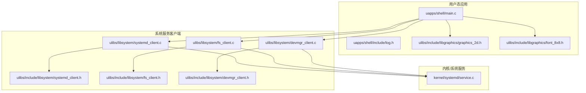
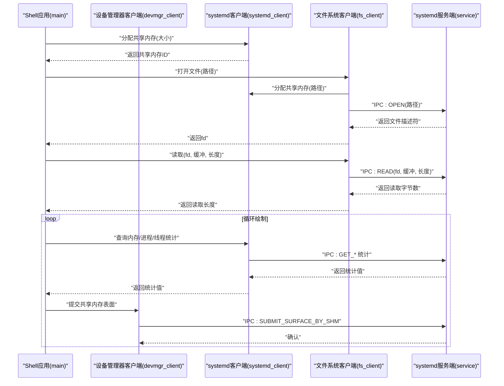
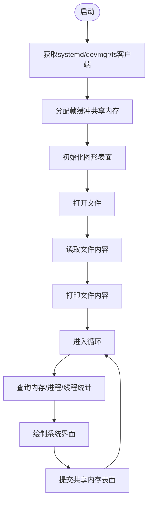
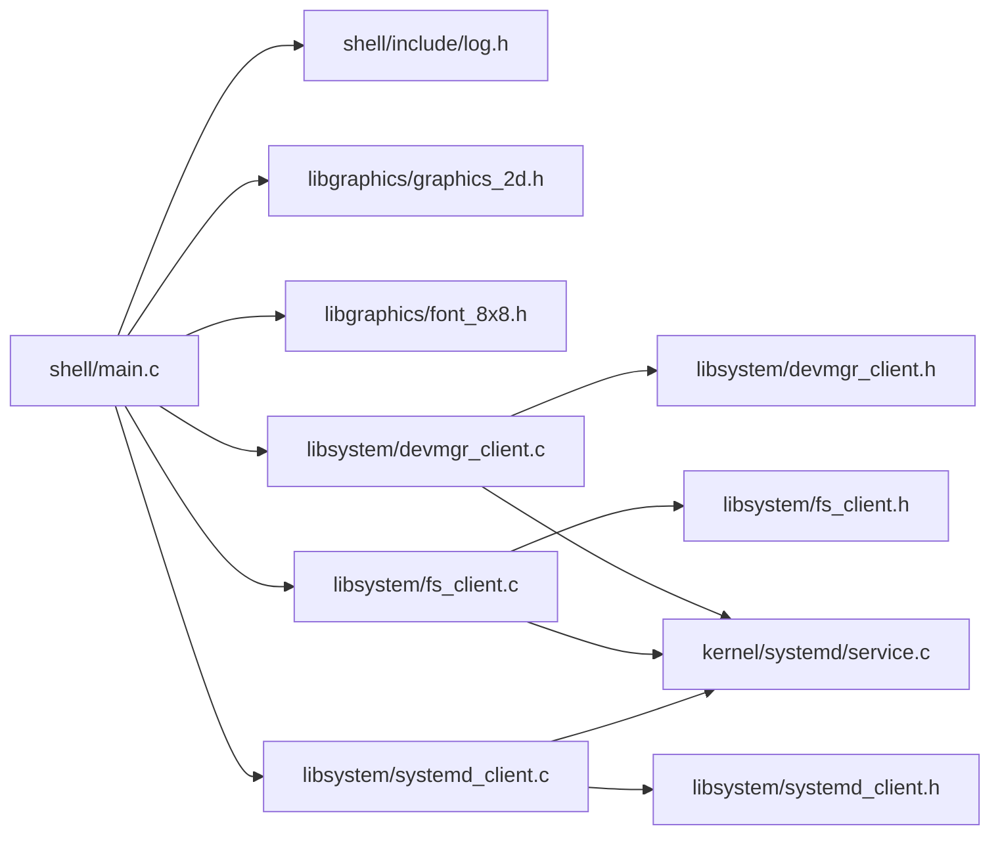

# Shell系统

<cite>
**本文引用的文件**
- [shell/main.c](file://uapps/shell/main.c)
- [shell/include/log.h](file://uapps/shell/include/log.h)
- [libsystem/systemd_client.c](file://ulibs/libsystem/systemd_client.c)
- [libsystem/systemd_client.h](file://ulibs/include/libsystem/systemd_client.h)
- [libsystem/fs_client.c](file://ulibs/libsystem/fs_client.c)
- [libsystem/fs_client.h](file://ulibs/include/libsystem/fs_client.h)
- [libsystem/devmgr_client.c](file://ulibs/libsystem/devmgr_client.c)
- [libsystem/devmgr_client.h](file://ulibs/include/libsystem/devmgr_client.h)
- [libgraphics/graphics_2d.h](file://ulibs/include/libgraphics/graphics_2d.h)
- [libgraphics/font_8x8.h](file://ulibs/include/libgraphics/font_8x8.h)
- [kernel/systemd/service.c](file://kernel/systemd/service.c)
</cite>

## 目录
1. [简介](#简介)
2. [项目结构](#项目结构)
3. [核心组件](#核心组件)
4. [架构总览](#架构总览)
5. [详细组件分析](#详细组件分析)
6. [依赖关系分析](#依赖关系分析)
7. [性能考虑](#性能考虑)
8. [故障排查指南](#故障排查指南)
9. [结论](#结论)
10. [附录](#附录)

## 简介
本文件面向TranquilOS Shell系统，系统当前以“SystemUI”形态呈现：负责申请共享内存、初始化2D图形绘制、读取文件内容并循环绘制系统界面（含时间、品牌文字等），同时通过设备管理器提交帧缓冲供显示子系统渲染。该实现展示了Shell如何与系统服务交互（systemd、设备管理器、文件系统）以及如何进行基础的用户界面绘制。

尽管当前仓库中未包含传统意义上的命令解释器（如命令解析、参数处理、命令执行流程等），本文仍基于现有代码对Shell的系统交互、图形界面、日志与错误处理机制进行深入分析，并给出扩展到完整Shell的建议与最佳实践。

## 项目结构
- uapps/shell：Shell应用入口与系统界面绘制逻辑
- ulibs/libsystem：系统服务客户端封装（systemd、设备管理器、文件系统）
- ulibs/include/libgraphics：2D图形与字体接口
- kernel/systemd：systemd服务端实现（IPC处理）

图表来源
- [shell/main.c](file://uapps/shell/main.c#L34-L72)
- [libsystem/systemd_client.c](file://ulibs/libsystem/systemd_client.c#L45-L65)
- [libsystem/fs_client.c](file://ulibs/libsystem/fs_client.c#L31-L45)
- [libsystem/devmgr_client.c](file://ulibs/libsystem/devmgr_client.c#L13-L25)
- [libsystem/systemd_client.h](file://ulibs/include/libsystem/systemd_client.h#L77-L84)
- [libsystem/fs_client.h](file://ulibs/include/libsystem/fs_client.h#L40-L47)
- [libsystem/devmgr_client.h](file://ulibs/include/libsystem/devmgr_client.h#L36-L43)
- [kernel/systemd/service.c](file://kernel/systemd/service.c#L232-L236)

章节来源
- [shell/main.c](file://uapps/shell/main.c#L1-L72)
- [libsystem/systemd_client.c](file://ulibs/libsystem/systemd_client.c#L1-L65)
- [libsystem/fs_client.c](file://ulibs/libsystem/fs_client.c#L1-L45)
- [libsystem/devmgr_client.c](file://ulibs/libsystem/devmgr_client.c#L1-L25)
- [libsystem/systemd_client.h](file://ulibs/include/libsystem/systemd_client.h#L54-L84)
- [libsystem/fs_client.h](file://ulibs/include/libsystem/fs_client.h#L1-L47)
- [libsystem/devmgr_client.h](file://ulibs/include/libsystem/devmgr_client.h#L1-L43)
- [kernel/systemd/service.c](file://kernel/systemd/service.c#L193-L236)

## 核心组件
- 日志模块：提供多等级日志输出，包含CPU ID与单调时钟信息，便于定位问题与追踪执行路径。
- 图形2D库：抽象了点、线、矩形、圆、文本等绘制操作，支持设置表面与批量绘制。
- 设备管理器客户端：通过IPC向设备管理器提交共享内存表面，实现帧缓冲显示。
- 文件系统客户端：通过共享内存传递文件路径，发起open/read/close等操作。
- systemd客户端：通过IPC获取系统资源统计（内存总量/空闲、进程数、线程数）并分配/释放共享内存。
- Shell主程序：整合上述能力，完成系统界面绘制与循环提交。

章节来源
- [shell/include/log.h](file://uapps/shell/include/log.h#L10-L31)
- [libgraphics/graphics_2d.h](file://ulibs/include/libgraphics/graphics_2d.h#L109-L138)
- [libsystem/devmgr_client.c](file://ulibs/libsystem/devmgr_client.c#L5-L7)
- [libsystem/fs_client.c](file://ulibs/libsystem/fs_client.c#L9-L29)
- [libsystem/systemd_client.c](file://ulibs/libsystem/systemd_client.c#L6-L43)
- [shell/main.c](file://uapps/shell/main.c#L34-L72)

## 架构总览
Shell采用“应用层 + 客户端库 + 系统服务”的分层架构。应用层通过客户端库发起IPC请求；客户端库封装IPC调用与共享内存管理；系统服务端根据方法号分发到具体处理函数。

图表来源
- [shell/main.c](file://uapps/shell/main.c#L34-L72)
- [libsystem/systemd_client.c](file://ulibs/libsystem/systemd_client.c#L6-L43)
- [libsystem/fs_client.c](file://ulibs/libsystem/fs_client.c#L9-L29)
- [libsystem/devmgr_client.c](file://ulibs/libsystem/devmgr_client.c#L5-L7)
- [kernel/systemd/service.c](file://kernel/systemd/service.c#L193-L236)

## 详细组件分析

### Shell主程序（SystemUI）
- 职责：初始化图形上下文、申请共享内存、读取文件、循环绘制并提交帧缓冲。
- 关键流程：
  - 获取systemd、devmgr、fs客户端实例。
  - 分配帧缓冲共享内存并初始化图形表面。
  - 打开并读取指定文件内容到共享内存，随后打印。
  - 循环查询系统统计信息，绘制界面元素，提交帧缓冲。

图表来源
- [shell/main.c](file://uapps/shell/main.c#L34-L72)

章节来源
- [shell/main.c](file://uapps/shell/main.c#L34-L72)

### 日志模块
- 提供DEBUG/INFO/WARN/ERROR/FATAL五级日志宏，统一前缀包含CPU ID与单调时钟，便于多核与时间线分析。
- 建议在新增功能时按模块增加日志点，便于排障。

章节来源
- [shell/include/log.h](file://uapps/shell/include/log.h#L10-L31)

### 图形2D库与字体
- 抽象了颜色、点、线、矩形、圆、文本等绘制操作，提供统一的绘制回调表与表面设置接口。
- 字体结构包含名称、字号、字形数量与字形数据指针，支持按字号缩放绘制。

章节来源
- [libgraphics/graphics_2d.h](file://ulibs/include/libgraphics/graphics_2d.h#L18-L138)
- [libgraphics/font_8x8.h](file://ulibs/include/libgraphics/font_8x8.h#L1-L9)

### 设备管理器客户端
- 提交共享内存表面用于显示，或获取设备树相关地址。
- 通过IPC端点调用实现与设备管理器服务的解耦。

章节来源
- [libsystem/devmgr_client.c](file://ulibs/libsystem/devmgr_client.c#L5-L7)
- [libsystem/devmgr_client.h](file://ulibs/include/libsystem/devmgr_client.h#L29-L34)

### 文件系统客户端
- 通过共享内存传递文件路径，避免跨边界拷贝；读写/关闭通过IPC调用完成。
- 支持最大文件路径长度限制，确保安全与一致性。

章节来源
- [libsystem/fs_client.c](file://ulibs/libsystem/fs_client.c#L9-L29)
- [libsystem/fs_client.h](file://ulibs/include/libsystem/fs_client.h#L7-L27)

### systemd客户端
- 封装共享内存分配/获取/释放、内存统计、进程/线程统计、注册上行回调、页故障处理、进程退出等接口。
- 通过单例模式获取服务端引用并填充操作表。

章节来源
- [libsystem/systemd_client.c](file://ulibs/libsystem/systemd_client.c#L6-L43)
- [libsystem/systemd_client.h](file://ulibs/include/libsystem/systemd_client.h#L64-L84)

### systemd服务端（IPC分发）
- 按方法号分发到具体处理函数，如获取进程数、线程数、注册上行回调、页故障处理、进程退出等。
- 注册服务ID并对外提供接口。

章节来源
- [kernel/systemd/service.c](file://kernel/systemd/service.c#L193-L236)

## 依赖关系分析
- Shell主程序依赖日志、图形、设备管理器、文件系统、systemd客户端。
- 客户端库依赖IPC与系统服务端，形成稳定的解耦。
- 服务端根据方法号路由到具体实现，避免直接耦合。

图表来源
- [shell/main.c](file://uapps/shell/main.c#L1-L8)
- [libsystem/systemd_client.c](file://ulibs/libsystem/systemd_client.c#L1-L3)
- [libsystem/fs_client.c](file://ulibs/libsystem/fs_client.c#L1-L3)
- [libsystem/devmgr_client.c](file://ulibs/libsystem/devmgr_client.c#L1-L2)
- [libsystem/systemd_client.h](file://ulibs/include/libsystem/systemd_client.h#L77-L84)
- [libsystem/fs_client.h](file://ulibs/include/libsystem/fs_client.h#L40-L47)
- [libsystem/devmgr_client.h](file://ulibs/include/libsystem/devmgr_client.h#L36-L43)
- [kernel/systemd/service.c](file://kernel/systemd/service.c#L232-L236)

## 性能考虑
- 共享内存复用：在循环中尽量重用已分配的共享内存，减少频繁分配/释放带来的IPC与内存碎片开销。
- 批量绘制：将多次绘制操作合并，减少IPC调用次数与设备管理器提交频率。
- 字符串与格式化：printf实现较为简单，避免在高频路径中进行复杂格式化，必要时缓存结果。
- 统计查询：系统统计接口可能涉及全局状态访问，建议降低查询频率或缓存结果。

## 故障排查指南
- 日志定位：利用日志宏输出关键路径与参数，结合CPU ID与时钟定位并发问题。
- IPC失败：检查服务端是否正确注册、方法号是否匹配、共享内存ID是否有效。
- 显示异常：确认帧缓冲尺寸、像素格式与设备管理器期望一致；检查提交的共享内存是否被正确映射。
- 文件读取：确认路径长度限制、共享内存拷贝是否成功、文件描述符有效性。

章节来源
- [shell/include/log.h](file://uapps/shell/include/log.h#L10-L31)
- [libsystem/systemd_client.c](file://ulibs/libsystem/systemd_client.c#L45-L65)
- [libsystem/fs_client.c](file://ulibs/libsystem/fs_client.c#L31-L45)
- [libsystem/devmgr_client.c](file://ulibs/libsystem/devmgr_client.c#L13-L25)
- [kernel/systemd/service.c](file://kernel/systemd/service.c#L225-L228)

## 结论
当前TranquilOS Shell以SystemUI为核心，展示了与systemd、设备管理器、文件系统的典型交互模式与图形绘制流程。若要扩展为完整的命令解释器，可在现有客户端与IPC框架之上增加命令解析、参数处理、命令查找与进程创建等模块，并沿用现有的日志与错误处理机制以保证可维护性与可观测性。

## 附录

### 开发指南：从SystemUI扩展到命令解释器
- 新增命令模块
  - 在ulibs或uapps下新增命令实现，遵循现有日志与IPC风格。
  - 若需系统调用，优先通过systemd客户端封装的IPC接口进行。
- 命令解析与执行
  - 引入命令表与参数解析器，支持内置命令与外部命令区分。
  - 内部命令直接在Shell进程中执行；外部命令通过systemd客户端创建进程并等待结果。
- 用户界面与交互
  - 可复用graphics_2d与font_8x8接口，扩展命令行输入框、历史记录与自动补全。
  - 使用日志模块记录用户输入与执行结果，便于审计与调试。
- 配置与脚本
  - 支持环境变量与别名表，提供加载配置文件的能力。
  - 脚本执行可基于外部命令机制，逐行解析并执行。
- 调试与错误处理
  - 在关键路径增加日志点，使用统一的日志宏输出。
  - 对IPC失败、共享内存异常、文件系统错误等场景提供明确的错误码与回退策略。